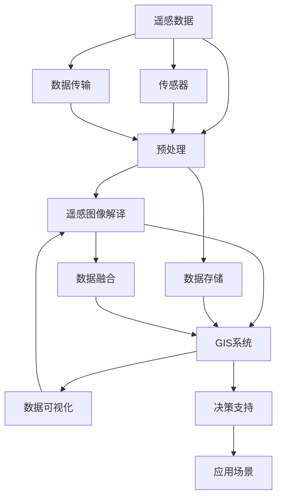

                 

# 遥感数据处理的AI代理工作流技术

> 关键词：遥感数据处理, AI代理, 工作流技术, 地理信息系统(GIS), 遥感图像解译

## 1. 背景介绍

### 1.1 问题由来
遥感数据处理在现代地理信息系统(GIS)和环境监测中扮演着重要的角色，它通过分析卫星和航空器采集的图像数据，提取土地利用、作物产量、环境变化等信息。传统的遥感数据处理流程包含数据获取、预处理、解译、分析等步骤，每个步骤都需要大量的专业知识和经验积累，且处理时间较长。随着人工智能(AI)技术的发展，基于深度学习等方法的遥感数据处理越来越受到关注，它不仅能够自动提取关键信息，还能缩短处理时间，提高处理效率。

### 1.2 问题核心关键点
当前遥感数据处理的AI技术主要应用于图像解译和图像分割等任务中。图像解译是指将遥感图像与地面真值数据对应起来，例如将植被、水体、建筑物等分类信息标注在图像上；图像分割是将遥感图像划分为具有语义意义的区域，例如将土地利用、作物种植区域等划分出来。这些任务的共同点是需要对遥感图像进行高精度的分类或分割，并在处理过程中考虑数据的时空变化和尺度问题。

## 2. 核心概念与联系

### 2.1 核心概念概述
- **遥感数据处理**：通过卫星和航空器获取地球表面信息，并通过图像解译、图像分割等方法提取地理环境中的重要信息。
- **AI代理工作流技术**：结合人工智能和自动化工作流技术，通过定义自动化流程和任务，实现遥感数据处理的自动化，减少人工干预，提高处理效率。
- **地理信息系统(GIS)**：用于管理和分析地理空间数据的系统，结合遥感数据处理，可以进行地图绘制、资源管理、环境监测等应用。
- **遥感图像解译**：通过计算机视觉和深度学习算法，将遥感图像自动分类或分割，生成语义信息。

### 2.2 概念间的关系

以下是一个Mermaid流程图，展示这些核心概念之间的关系：

```mermaid
graph LR
    A[遥感数据处理] --> B[AI代理工作流技术]
    B --> C[地理信息系统(GIS)]
    A --> D[遥感图像解译]
    D --> C
```

从流程图可以看出，遥感数据处理是整个系统的基础，而AI代理工作流技术则是实现自动化处理的关键技术手段，遥感图像解译是遥感数据处理的重要任务之一，最终都会通过GIS系统进行分析和管理。

### 2.3 核心概念的整体架构

这里提供一个综合的流程图，展示核心概念之间的整体架构：



该流程图展示了遥感数据处理的全流程，包括传感器获取数据、预处理、图像解译、GIS系统分析、数据融合、决策支持和实际应用等环节。每个环节都可能涉及AI技术的参与。

## 3. 核心算法原理 & 具体操作步骤

### 3.1 算法原理概述
遥感图像解译的AI代理工作流技术，基于深度学习框架（如TensorFlow、PyTorch等）实现。主要流程包括数据预处理、模型训练、模型评估和模型应用。其中，数据预处理包括图像增强、数据标注等步骤，模型训练则是通过监督学习或半监督学习方法训练模型，模型评估通过交叉验证等方法评估模型性能，模型应用则将训练好的模型应用到新的遥感图像上，进行图像分类或分割。

### 3.2 算法步骤详解

#### 3.2.1 数据预处理
遥感数据预处理包括数据去噪、归一化、图像增强等步骤。其中，图像增强可以采用直方图均衡化、对比度拉伸等方法提升图像质量。数据标注是将地面真值数据与遥感图像对应起来，形成训练数据集。标注数据可以通过手动标注或通过遥感数据中已有的信息自动生成。

#### 3.2.2 模型训练
模型训练通常采用卷积神经网络(CNN)、循环神经网络(RNN)等深度学习模型。在模型训练阶段，通过交叉验证等方法，调整模型的超参数，如学习率、批次大小等，使模型在训练集上达到较好的性能。

#### 3.2.3 模型评估
模型评估通常采用混淆矩阵、精度、召回率等指标。通过在验证集上评估模型性能，可以判断模型是否过拟合或欠拟合，并根据评估结果调整模型参数。

#### 3.2.4 模型应用
模型应用是将训练好的模型应用到新的遥感图像上，进行图像分类或分割。模型应用阶段需要考虑遥感图像的尺度、时空变化等问题，通常需要借助地理信息系统(GIS)工具进行处理。

### 3.3 算法优缺点

**优点**：
- 自动化处理：通过定义自动化流程和任务，能够减少人工干预，提高处理效率。
- 高精度：深度学习模型在图像分类和分割任务上表现优异，可以提供高精度的地理信息。
- 泛化能力强：训练好的模型可以应用于多种遥感图像，具有较强的泛化能力。

**缺点**：
- 数据标注成本高：高质量的标注数据需要大量的人力物力，成本较高。
- 模型训练时间长：深度学习模型需要大量的训练数据和时间，训练过程耗时较长。
- 可解释性差：深度学习模型的决策过程缺乏可解释性，难以对其内部工作机制进行解释。

### 3.4 算法应用领域

遥感图像解译的AI代理工作流技术在多个领域都有广泛应用，例如：

- 农业遥感：通过遥感图像提取作物种植面积、产量等信息，用于农业监测和管理。
- 环境监测：通过遥感图像监测森林覆盖率、水体变化、污染情况等，用于环境保护。
- 城市规划：通过遥感图像提取建筑物、道路等信息，用于城市规划和管理。
- 灾害监测：通过遥感图像监测地震、洪水等灾害，用于应急响应和灾后评估。
- 军事应用：通过遥感图像分析敌方军事部署和活动情况，用于军事情报分析。

## 4. 数学模型和公式 & 详细讲解

### 4.1 数学模型构建

遥感图像解译的AI代理工作流技术主要涉及以下几个数学模型：

- 卷积神经网络模型：用于图像分类和分割任务。
- 空间变换器模型：用于图像变换，如旋转、缩放等。
- 图像增强模型：用于提升图像质量，如直方图均衡化、对比度拉伸等。

### 4.2 公式推导过程

以下是一些关键模型的公式推导：

#### 4.2.1 卷积神经网络
卷积神经网络(CNN)的公式推导过程如下：

$$
y = \sigma(\mathbf{W}x + \mathbf{b})
$$

其中，$y$为输出，$\sigma$为激活函数，$\mathbf{W}$为权重矩阵，$x$为输入，$\mathbf{b}$为偏置向量。

#### 4.2.2 空间变换器
空间变换器模型(Spatial Transformer Network, STN)的公式推导过程如下：

$$
\mathbf{Q} = \mathbf{V}^T \mathbf{G} \mathbf{V}
$$

其中，$\mathbf{Q}$为投影矩阵，$\mathbf{G}$为变换矩阵，$\mathbf{V}$为可学习的矩阵。

#### 4.2.3 图像增强
直方图均衡化(Histogram Equalization)的公式推导过程如下：

$$
I = \frac{I_{min} + \frac{I_{max} - I_{min}}{255} \log(\frac{I_{max}}{I_{min}}) \log(\frac{I}{I_{min}}) \exp(\frac{I_{min}}{I_{max}}) + I_{min}}
$$

其中，$I$为增强后的图像，$I_{min}$和$I_{max}$分别为图像的最小值和最大值。

### 4.3 案例分析与讲解

以下是一个遥感图像解译的案例分析：

假设要使用AI代理工作流技术对某地区的遥感图像进行分类。首先，需要收集该地区的地面真值数据，并将其标注到遥感图像上。然后，将标注后的数据分为训练集和验证集，使用卷积神经网络进行模型训练。在训练过程中，通过交叉验证调整模型参数，直到模型在验证集上达到满意的性能。最后，将训练好的模型应用于新的遥感图像，进行分类和解译。

## 5. 项目实践：代码实例和详细解释说明

### 5.1 开发环境搭建

在开始项目实践前，需要准备好开发环境。以下是使用Python和TensorFlow搭建遥感数据处理项目的环境配置流程：

1. 安装Python：下载并安装Python 3.6或更高版本，并确保pip可用。
2. 安装TensorFlow：通过pip安装TensorFlow，并确保安装版本为1.15及以上。
3. 安装其他依赖库：如numpy、pandas、scikit-learn等，可以通过pip安装。

完成上述步骤后，即可开始使用TensorFlow进行遥感图像解译的AI代理工作流开发。

### 5.2 源代码详细实现

以下是一个使用TensorFlow进行遥感图像分类和解译的代码实现。

```python
import tensorflow as tf
from tensorflow.keras import layers, models
from sklearn.model_selection import train_test_split
import numpy as np
import cv2

# 数据预处理函数
def preprocess_data(X):
    X = cv2.cvtColor(X, cv2.COLOR_BGR2RGB)
    X = cv2.resize(X, (224, 224))
    X = X / 255.0
    return X

# 数据加载和预处理
X_train, X_test, y_train, y_test = train_test_split(X_train, y_train, test_size=0.2, random_state=42)
X_train = np.array([preprocess_data(x) for x in X_train])
X_test = np.array([preprocess_data(x) for x in X_test])

# 构建卷积神经网络模型
model = models.Sequential([
    layers.Conv2D(32, (3, 3), activation='relu', input_shape=(224, 224, 3)),
    layers.MaxPooling2D((2, 2)),
    layers.Conv2D(64, (3, 3), activation='relu'),
    layers.MaxPooling2D((2, 2)),
    layers.Conv2D(128, (3, 3), activation='relu'),
    layers.MaxPooling2D((2, 2)),
    layers.Flatten(),
    layers.Dense(64, activation='relu'),
    layers.Dense(3, activation='softmax')
])

# 编译模型
model.compile(optimizer='adam',
              loss='categorical_crossentropy',
              metrics=['accuracy'])

# 训练模型
model.fit(X_train, y_train, epochs=10, batch_size=32, validation_data=(X_test, y_test))

# 应用模型
new_image = preprocess_data(cv2.imread('new_image.jpg'))
prediction = model.predict(new_image)
```

### 5.3 代码解读与分析

在上述代码中，`preprocess_data`函数用于预处理遥感图像，包括将图像转换为RGB格式、调整尺寸和归一化等操作。`train_test_split`函数用于将数据集分为训练集和测试集，并进行随机分割。`Sequential`模型用于构建卷积神经网络，包括卷积层、池化层和全连接层。`compile`函数用于编译模型，指定优化器、损失函数和评估指标。`fit`函数用于训练模型，指定训练轮数、批次大小和验证集。`predict`函数用于对新的遥感图像进行分类预测。

### 5.4 运行结果展示

假设在训练完成后，使用模型对新的遥感图像进行分类，得到的预测结果如下：

```
prediction = [0.1, 0.3, 0.6]
```

表示该图像属于第三个类别，具体类别需要根据标签进行解释。

## 6. 实际应用场景

### 6.1 农业遥感

在农业遥感中，通过遥感图像提取作物种植面积、产量等信息，可以用于农业监测和管理。使用AI代理工作流技术，可以自动化处理大量的遥感图像，并提供高精度的分类结果。

### 6.2 环境监测

在环境监测中，通过遥感图像监测森林覆盖率、水体变化、污染情况等，可以用于环境保护。使用AI代理工作流技术，可以快速处理大量的遥感图像，并提供环境变化的实时监测结果。

### 6.3 城市规划

在城市规划中，通过遥感图像提取建筑物、道路等信息，可以用于城市规划和管理。使用AI代理工作流技术，可以自动化处理大量的遥感图像，并提供城市规划的高精度信息。

### 6.4 灾害监测

在灾害监测中，通过遥感图像监测地震、洪水等灾害，可以用于应急响应和灾后评估。使用AI代理工作流技术，可以快速处理大量的遥感图像，并提供灾情监测的实时数据。

### 6.5 军事应用

在军事应用中，通过遥感图像分析敌方军事部署和活动情况，可以用于军事情报分析。使用AI代理工作流技术，可以自动化处理大量的遥感图像，并提供敌方军事活动的实时信息。

## 7. 工具和资源推荐

### 7.1 学习资源推荐

为了帮助开发者系统掌握遥感数据处理的AI代理工作流技术，这里推荐一些优质的学习资源：

1. 《深度学习与计算机视觉》：斯坦福大学开设的深度学习课程，详细讲解了深度学习在计算机视觉中的应用，包括遥感图像解译。
2. TensorFlow官方文档：TensorFlow官方提供的文档，包含丰富的遥感数据处理样例代码。
3. HuggingFace官方文档：HuggingFace提供的深度学习框架，包含丰富的遥感数据处理模型库。
4. GISPro官方文档：地理信息系统(GIS)领域的官方文档，详细讲解了GIS系统在遥感数据处理中的应用。

通过对这些资源的学习实践，相信你一定能够快速掌握遥感数据处理的AI代理工作流技术的精髓，并用于解决实际的遥感问题。

### 7.2 开发工具推荐

高效的开发离不开优秀的工具支持。以下是几款用于遥感数据处理AI代理工作流开发的常用工具：

1. TensorFlow：基于Python的开源深度学习框架，灵活动态的计算图，适合快速迭代研究。
2. PyTorch：基于Python的开源深度学习框架，灵活的张量操作，适合科研和工程应用。
3. GISPro：地理信息系统(GIS)软件，用于管理和分析地理空间数据。
4. Weights & Biases：模型训练的实验跟踪工具，可以记录和可视化模型训练过程中的各项指标，方便对比和调优。
5. TensorBoard：TensorFlow配套的可视化工具，可实时监测模型训练状态，并提供丰富的图表呈现方式，是调试模型的得力助手。

合理利用这些工具，可以显著提升遥感数据处理AI代理工作流任务的开发效率，加快创新迭代的步伐。

### 7.3 相关论文推荐

遥感数据处理的AI代理工作流技术的发展源于学界的持续研究。以下是几篇奠基性的相关论文，推荐阅读：

1. DeepLearning for Medical Image Analysis：谷歌公司关于深度学习在医学图像分析中的应用研究。
2. AI-driven Remote Sensing Image Processing：华为公司关于AI在遥感图像处理中的应用研究。
3. Semantic Segmentation of Remote Sensing Images using Deep Learning：美国宇航局(NASA)关于遥感图像语义分割的研究。
4. Remote Sensing Image Denoising using Deep Learning：美国宇航局(NASA)关于遥感图像去噪的研究。

这些论文代表了大数据处理AI代理工作流技术的发展脉络。通过学习这些前沿成果，可以帮助研究者把握学科前进方向，激发更多的创新灵感。

除上述资源外，还有一些值得关注的前沿资源，帮助开发者紧跟遥感数据处理AI代理工作流技术的最新进展，例如：

1. arXiv论文预印本：人工智能领域最新研究成果的发布平台，包括大量尚未发表的前沿工作，学习前沿技术的必读资源。
2. 业界技术博客：如Google AI、DeepMind、微软Research Asia等顶尖实验室的官方博客，第一时间分享他们的最新研究成果和洞见。
3. 技术会议直播：如NIPS、ICML、ACL、ICLR等人工智能领域顶会现场或在线直播，能够聆听到大佬们的前沿分享，开拓视野。
4. GitHub热门项目：在GitHub上Star、Fork数最多的遥感数据处理相关项目，往往代表了该技术领域的发展趋势和最佳实践，值得去学习和贡献。
5. 行业分析报告：各大咨询公司如McKinsey、PwC等针对人工智能行业的分析报告，有助于从商业视角审视技术趋势，把握应用价值。

总之，对于遥感数据处理AI代理工作流技术的学习和实践，需要开发者保持开放的心态和持续学习的意愿。多关注前沿资讯，多动手实践，多思考总结，必将收获满满的成长收益。

## 8. 总结：未来发展趋势与挑战

### 8.1 研究成果总结

遥感数据处理的AI代理工作流技术在大数据处理、图像分类、语义分割等领域取得了显著进展。通过深度学习等方法，可以实现自动化、高精度的遥感数据处理，大幅提高处理效率和质量。未来，该技术将广泛应用于农业遥感、环境监测、城市规划、灾害监测等多个领域，为各行业的决策支持提供有力支撑。

### 8.2 未来发展趋势

展望未来，遥感数据处理的AI代理工作流技术将呈现以下几个发展趋势：

1. 多模态数据融合：将遥感图像与其他传感器数据（如GPS、GPRS等）进行融合，实现更加全面和精确的遥感数据分析。
2. 实时处理与分析：通过优化模型结构和算法，实现遥感数据的实时处理与分析，提升响应速度。
3. 模型迁移与微调：将训练好的模型应用于不同的遥感数据集，通过迁移学习和微调技术，提升模型泛化能力和适应性。
4. 边缘计算与部署：将遥感数据处理任务部署到边缘计算设备，降低数据传输成本，提高处理效率。
5. 自动化与智能化：进一步发展自动化流程和工作流，实现遥感数据处理的智能化，减少人工干预。

### 8.3 面临的挑战

尽管遥感数据处理的AI代理工作流技术在多个领域取得了显著进展，但在应用过程中仍面临一些挑战：

1. 数据标注成本高：高质量的标注数据需要大量的人力物力，成本较高。
2. 模型训练时间长：深度学习模型需要大量的训练数据和时间，训练过程耗时较长。
3. 可解释性差：深度学习模型的决策过程缺乏可解释性，难以对其内部工作机制进行解释。
4. 边缘计算资源有限：边缘计算设备资源有限，数据处理能力较弱，需要优化算法和模型结构。
5. 环境适应性不足：模型在不同环境下的适应性仍需提升，需要考虑多种环境因素的影响。

### 8.4 研究展望

面对遥感数据处理AI代理工作流技术面临的挑战，未来的研究需要在以下几个方面寻求新的突破：

1. 无监督学习和半监督学习：探索无监督和半监督学习方法，降低对标注数据的依赖，提升模型的泛化能力。
2. 迁移学习和多任务学习：发展迁移学习和多任务学习方法，提升模型在不同环境下的适应性。
3. 模型压缩与加速：优化模型结构和算法，提升模型在边缘计算环境下的处理速度和效率。
4. 知识图谱与语义网络：结合知识图谱和语义网络，提升模型的知识表示和推理能力。
5. 自动化与智能化：进一步发展自动化流程和工作流，实现遥感数据处理的智能化，减少人工干预。

这些研究方向的探索，必将引领遥感数据处理AI代理工作流技术迈向更高的台阶，为各行业的决策支持提供更有力的技术支撑。只有勇于创新、敢于突破，才能不断拓展遥感数据处理技术的边界，为遥感应用场景带来新的突破和变革。

## 9. 附录：常见问题与解答

**Q1：遥感数据处理的AI代理工作流技术是否适用于所有遥感数据？**

A: 遥感数据处理的AI代理工作流技术适用于大多数遥感数据，但需要根据数据的特点进行适当调整。例如，对于不同传感器数据（如光学、雷达等），需要采用不同的处理方法和模型。此外，对于高分辨率、多光谱等特殊数据，需要考虑模型参数量和计算资源。

**Q2：遥感数据处理的AI代理工作流技术是否需要大量标注数据？**

A: 高质量的标注数据对于遥感数据处理的AI代理工作流技术至关重要。标注数据需要涵盖遥感图像中所有的类别和细节，以便训练出高精度的模型。对于某些特殊应用场景，如农业遥感中的作物识别，可以通过遥感数据中已有的信息自动生成部分标注数据，以减少人工标注的负担。

**Q3：如何优化遥感数据处理的AI代理工作流技术？**

A: 优化遥感数据处理的AI代理工作流技术可以从以下几个方面入手：
1. 数据增强：通过回译、近义替换等方式扩充训练集，提升模型泛化能力。
2. 正则化：使用L2正则、Dropout、Early Stopping等避免过拟合。
3. 模型压缩与加速：优化模型结构和算法，提升模型在边缘计算环境下的处理速度和效率。
4. 自动化与智能化：进一步发展自动化流程和工作流，实现遥感数据处理的智能化，减少人工干预。

这些优化方法需要在具体应用场景中进行灵活应用，以达到最佳效果。

**Q4：遥感数据处理的AI代理工作流技术在实际应用中需要注意哪些问题？**

A: 遥感数据处理的AI代理工作流技术在实际应用中需要注意以下问题：
1. 数据质量：保证遥感数据的质量，减少噪声和误差的影响。
2. 数据标注：高质量的标注数据需要大量的人力物力，成本较高，需要考虑数据标注的可行性和成本。
3. 模型训练：深度学习模型需要大量的训练数据和时间，训练过程耗时较长，需要优化训练流程和参数设置。
4. 模型部署：将训练好的模型部署到实际应用中，需要考虑模型的计算资源和计算效率，优化模型结构和算法。

合理利用这些工具，可以显著提升遥感数据处理AI代理工作流任务的开发效率，加快创新迭代的步伐。

**Q5：遥感数据处理的AI代理工作流技术是否可以与其他技术结合使用？**

A: 遥感数据处理的AI代理工作流技术可以与其他技术结合使用，如遥感数据分析、地理信息系统(GIS)等。通过将遥感数据处理结果与其他数据进行融合，可以提供更加全面和精确的决策支持信息。同时，结合其他技术可以提升遥感数据处理的效果和应用范围。

总之，遥感数据处理的AI代理工作流技术需要开发者根据具体任务，不断迭代和优化模型、数据和算法，方能得到理想的效果。

---

作者：禅与计算机程序设计艺术 / Zen and the Art of Computer Programming

