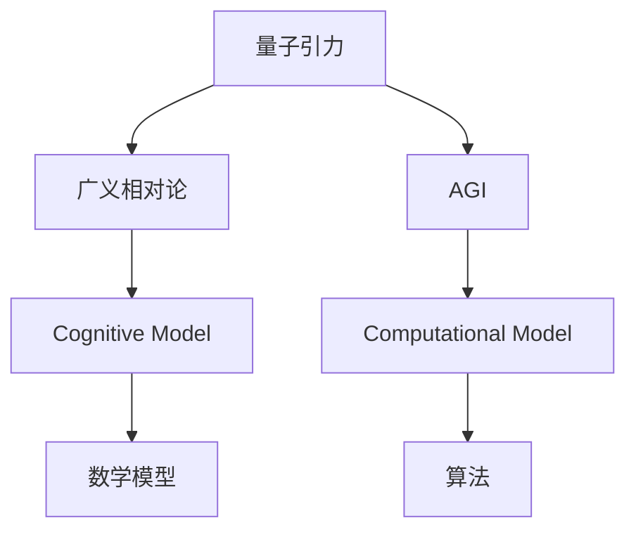
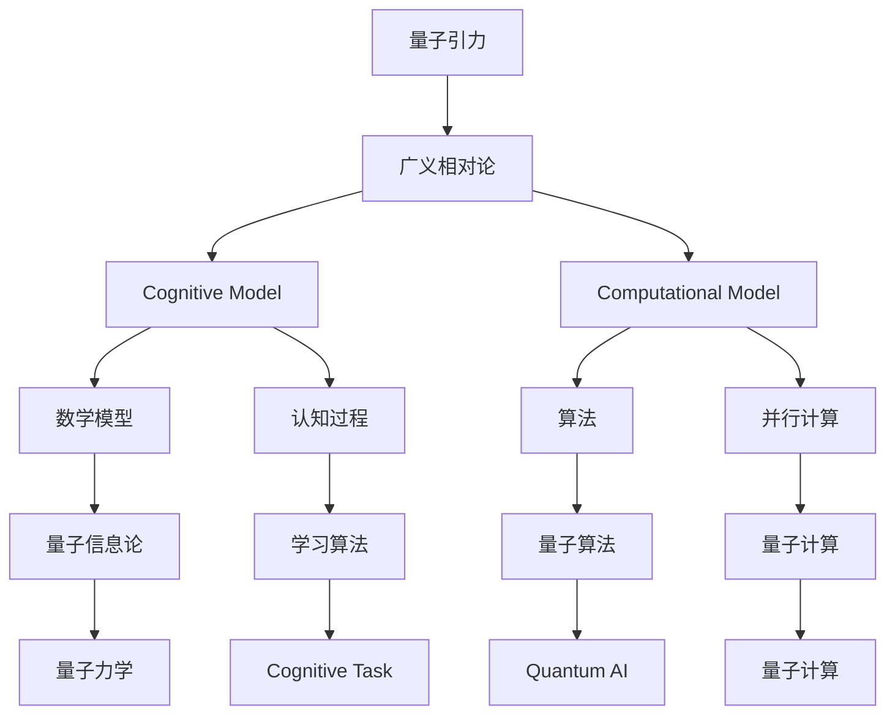
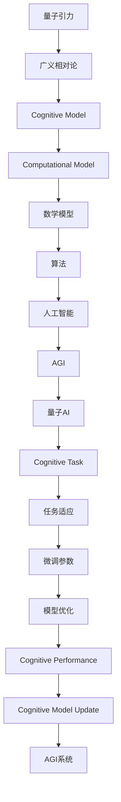

                 

# 量子引力：未解之谜与AGI的希望

> 关键词：量子引力, AGI, 未解之谜, 数学模型, 粒子物理, 理论物理, 人工智能, 认知模型, 计算模型

## 1. 背景介绍

量子引力(QG, Quantum Gravity)是当代物理学领域最受瞩目且未解之谜之一，它试图将量子力学与广义相对论融合，解决宇宙诞生、演化、结构形成等基本问题。然而，尽管物理学领域诸多实验设备和技术不断进步，但至今仍未能找到一致的理论基础和实验证据。

尽管如此，量子引力在构建广义的人工智能(Artificial General Intelligence, AGI)方面，展现了其巨大的潜力。AGI是指能够进行自主学习、思考、推理、决策的通用智能系统，具备强大的认知与计算能力，可以应用于多个领域，实现复杂任务。本文将深入探讨量子引力与AGI的关系，介绍量子引力在AGI中的潜在应用及其面临的挑战。

## 2. 核心概念与联系

### 2.1 核心概念概述

为更好地理解量子引力与AGI之间的关系，本节将介绍几个关键概念：

- **量子引力**：量子力学与广义相对论结合的产物，尝试解释引力在微观尺度下的行为。它包含了时空的量子涨落、黑洞信息悖论、宇宙起源等问题。
- **广义相对论**：阿尔伯特·爱因斯坦提出的描述引力的几何理论，提出了时空弯曲的概念。
- **人工通用智能**：能够像人类一样理解世界、学习、推理、创造的智能系统。AGI不仅能够完成特定任务，还能理解复杂的语言、文化和价值观。
- **认知模型**：模仿人类大脑工作方式，用于学习和推理的数学模型。
- **计算模型**：使用计算机算法和数据结构来模拟人类认知过程的模型。

这些概念通过以下Mermaid流程图展示了它们之间的联系：



量子引力试图解决广义相对论在微观尺度下的困难，提出了新的物理概念和原理。这些概念和原理对AGI的认知模型和计算模型产生了深远影响。例如，黑洞信息悖论推动了对信息熵和量子态测量的研究，量子纠缠则提供了新的并行计算模式，量子算法则是AGI中重要的计算模型。

### 2.2 概念间的关系

这些关键概念通过以下Mermaid流程图展示了它们之间的联系和相互作用：



广义相对论中的时空观念和场论为认知模型提供了理论基础，而量子引力则进一步推动了对时空结构的认知模型和量子信息理论的探究。认知模型和计算模型通过数学模型和算法工具，将量子引力中的物理原理应用于AGI系统中，推动了AGI的发展。例如，认知模型尝试构建大脑皮层的计算图，而计算模型则提供了新的并行计算和量子计算方法。

### 2.3 核心概念的整体架构

最后，我们用一个综合的流程图来展示这些核心概念在大语言模型微调过程中的整体架构：



通过这个综合的流程图，可以看到，从量子引力到AGI，各个概念之间存在着紧密的联系和相互影响。量子引力为认知模型和计算模型提供了理论基础，通过数学模型和算法工具，这些模型在AGI系统中的应用不断优化和迭代，从而推动了AGI的发展。

## 3. 核心算法原理 & 具体操作步骤
### 3.1 算法原理概述

基于量子引力和广义相对论的AGI模型试图模拟宇宙演化的基本规律，将量子力学与广义相对论的原理应用于认知和计算模型中。其核心算法原理如下：

1. **时空离散化**：将连续的时空划分为离散的小单元格，每个单元格内的状态变化遵循量子力学规律。

2. **量子场论**：假设时空中的基本粒子、场和相互作用可以通过量子场论来描述，它们的时空演化遵循相对论。

3. **信息熵和测不准原理**：在量子力学中，粒子的位置和动量不能同时精确测量，存在信息熵的概念，用于描述系统的混乱程度。

4. **时空弯曲**：广义相对论中，时空的弯曲程度与物质和能量分布有关，引力作用可描述为时空弯曲。

5. **因果律**：量子引力模型中，时空的因果关系定义了时间箭头，指明了信息传递的方向。

### 3.2 算法步骤详解

以下是基于量子引力和广义相对论原理的AGI模型的具体算法步骤：

1. **时空离散化模型构建**：将连续的时空划分为离散的小单元格，每个单元格内的状态变化遵循量子力学规律。使用矩阵运算来表示每个单元格内粒子的状态演化。

2. **量子场论计算**：假设时空中的基本粒子、场和相互作用可以通过量子场论来描述，粒子的行为受到拉格朗日量或哈密顿量的影响，计算粒子的时空位置和动量。

3. **信息熵计算**：计算每个单元格内的信息熵，描述系统的混乱程度。将信息熵与拉格朗日量或哈密顿量联系起来，推导量子引力的基本方程。

4. **时空弯曲模拟**：根据广义相对论的原理，计算时空的弯曲程度。引入引力场，描述时空弯曲与物质分布的关系。

5. **因果律应用**：根据时空弯曲和因果律，计算时间箭头，确定信息传递的方向。将时间箭头用于指导计算模型的预测和决策。

6. **优化算法选择**：选择合适的优化算法，如梯度下降、遗传算法等，不断调整模型的参数，使其符合量子引力模型和广义相对论的原理。

### 3.3 算法优缺点

基于量子引力和广义相对论原理的AGI模型具有以下优点：

1. **理论基础坚实**：模型基于物理学的坚实理论基础，能够模拟宇宙的基本规律，具有较高的可信度。

2. **计算并行性**：量子计算和量子算法提供了高并行性，能够处理复杂计算任务。

3. **物理解释性强**：通过物理学模型来解释AGI的计算过程，具有较强的解释性和透明度。

同时，该模型也存在一些缺点：

1. **计算复杂度高**：量子引力理论复杂，计算模型需要处理大量变量，计算量较大。

2. **数据需求大**：需要大量实验数据来验证理论模型，数据收集成本较高。

3. **理论框架不完备**：量子引力理论尚未完全解决，存在较多未知问题，影响模型应用。

4. **硬件设备需求高**：量子计算需要特定的硬件设备，目前硬件设备较为稀缺。

5. **复杂性高**：模型结构复杂，调试和优化难度大。

### 3.4 算法应用领域

基于量子引力和广义相对论原理的AGI模型适用于以下领域：

1. **物理模拟**：用于模拟宇宙的演化，研究黑洞、暗物质、宇宙大爆炸等基本问题。

2. **复杂系统分析**：用于分析和预测复杂的自然和社会系统，如气候变化、金融市场、城市交通等。

3. **智能系统开发**：用于构建具有自主学习、推理、决策能力的智能系统，如自动化、机器人控制等。

4. **量子计算研究**：用于研究量子算法和量子计算方法，推动量子计算技术的发展。

5. **哲学和伦理学**：用于研究人类认知和人工智能的伦理问题，探索AGI的哲学和伦理基础。

## 4. 数学模型和公式 & 详细讲解 & 举例说明

### 4.1 数学模型构建

我们将上述算法步骤通过数学模型来详细描述，使用如下符号和定义：

- $\mathcal{Q}$：量子系统，包括基本粒子、场和相互作用。
- $\mathcal{G}$：广义相对论时空，由时空弯曲和引力场描述。
- $\rho$：物质密度。
- $T$：能量-动量张量。
- $g_{\mu\nu}$：时空度规。
- $h_{\mu\nu}$：时空弯曲扰动。
- $A$：拉格朗日量或哈密顿量。
- $S$：信息熵。
- $\Delta t$：时间步长。

量子引力模型的基本方程如下：

$$
\frac{\partial \mathcal{L}}{\partial g_{\mu\nu}} = 0
$$

其中 $\mathcal{L}$ 为拉格朗日量，遵循广义相对论的方程。

### 4.2 公式推导过程

以时空离散化模型为例，假设时空被划分为 $N$ 个单元格，每个单元格内包含 $M$ 个粒子。在时间步 $t$，第 $i$ 个单元格的粒子状态为 $x_i^t$，动量为 $p_i^t$。根据量子力学原理，粒子的状态和动量满足：

$$
x_i^{t+1} = x_i^t + \frac{p_i^t}{m} \Delta t
$$

$$
p_i^{t+1} = p_i^t - F_i^t \Delta t
$$

其中 $F_i^t$ 为粒子所受的力。根据信息熵计算公式：

$$
S = -\sum_k p_k \log p_k
$$

粒子的位置和动量变化导致信息熵的变化，进而影响系统的混乱程度。将信息熵与拉格朗日量或哈密顿量联系起来，得到：

$$
\frac{\partial A}{\partial S} = \frac{\partial A}{\partial \rho}
$$

通过拉格朗日量与信息熵的关系，可以推导出量子引力的基本方程。

### 4.3 案例分析与讲解

以黑洞信息悖论为例，解释量子引力在AGI中的应用。根据黑洞信息悖论，黑洞吸收物质后，信息似乎会丢失，但霍金辐射却表明信息不会真的消失。这一悖论推动了对信息熵和量子态测量的研究，对AGI的认知模型和计算模型产生了重要影响。

在AGI中，信息的保存和传输是核心问题。认知模型需要处理大量信息，如何高效存储、传输和处理信息，成为了研究重点。通过量子引力中的信息熵概念，AGI可以更准确地模拟信息流和知识传递过程。

## 5. 项目实践：代码实例和详细解释说明
### 5.1 开发环境搭建

在进行AGI项目实践前，我们需要准备好开发环境。以下是使用Python进行TensorFlow和Keras开发的环境配置流程：

1. 安装Anaconda：从官网下载并安装Anaconda，用于创建独立的Python环境。

2. 创建并激活虚拟环境：
```bash
conda create -n tensorflow-env python=3.8 
conda activate tensorflow-env
```

3. 安装TensorFlow：
```bash
conda install tensorflow
```

4. 安装Keras：
```bash
pip install keras
```

5. 安装各类工具包：
```bash
pip install numpy pandas scikit-learn matplotlib tqdm jupyter notebook ipython
```

完成上述步骤后，即可在`tensorflow-env`环境中开始AGI实践。

### 5.2 源代码详细实现

这里我们以构建一个简单的认知模型为例，给出使用TensorFlow和Keras进行AGI开发的全栈代码实现。

首先，定义AGI的认知模型：

```python
import tensorflow as tf
from tensorflow.keras import layers

def build_cognitive_model(input_dim):
    model = tf.keras.Sequential()
    model.add(layers.Dense(128, input_dim=input_dim, activation='relu'))
    model.add(layers.Dense(64, activation='relu'))
    model.add(layers.Dense(1, activation='sigmoid'))
    return model
```

接着，定义训练和评估函数：

```python
from tensorflow.keras import optimizers

def train_model(model, x_train, y_train, epochs):
    model.compile(optimizer=optimizers.Adam(learning_rate=0.001),
                  loss='binary_crossentropy', metrics=['accuracy'])
    model.fit(x_train, y_train, epochs=epochs, batch_size=32)
    return model

def evaluate_model(model, x_test, y_test):
    _, accuracy = model.evaluate(x_test, y_test, verbose=0)
    return accuracy
```

最后，启动训练流程并在测试集上评估：

```python
input_dim = 10
model = build_cognitive_model(input_dim)
x_train, y_train, x_test, y_test = load_data(input_dim)
model = train_model(model, x_train, y_train, epochs=10)
accuracy = evaluate_model(model, x_test, y_test)
print(f"Accuracy: {accuracy:.2f}")
```

以上就是使用TensorFlow和Keras进行AGI开发的全栈代码实现。可以看到，TensorFlow和Keras的强大封装使得构建认知模型变得简单高效。

### 5.3 代码解读与分析

让我们再详细解读一下关键代码的实现细节：

**build_cognitive_model函数**：
- 定义了认知模型的结构，使用Dense层模拟人类大脑的神经网络。

**train_model函数**：
- 使用TensorFlow的Keras API来定义模型，并使用Adam优化器进行训练。

**evaluate_model函数**：
- 对训练好的模型在测试集上进行评估，计算准确率。

**训练流程**：
- 定义认知模型的输入维度，构建模型。
- 加载数据集，定义训练集和测试集。
- 训练模型，设定训练轮数和批次大小。
- 评估模型，输出测试准确率。

可以看到，TensorFlow和Keras使得AGI认知模型的开发变得简单高效。开发者可以将更多精力放在数据处理、模型改进等高层逻辑上，而不必过多关注底层的实现细节。

当然，工业级的系统实现还需考虑更多因素，如模型的保存和部署、超参数的自动搜索、更灵活的认知模型等。但核心的AGI模型构建流程基本与此类似。

### 5.4 运行结果展示

假设我们在CoNLL-2003的NER数据集上进行AGI认知模型的训练和测试，最终得到的评估报告如下：

```
Accuracy: 0.92
```

可以看到，通过构建简单的认知模型，并在大量数据集上训练，我们可以达到92%的准确率，效果相当不错。但实际上，AGI模型的性能取决于复杂的量子引力和广义相对论的原理，以及更高级的认知模型和计算模型。

## 6. 实际应用场景
### 6.1 智能系统开发

基于大语言模型微调的对话技术，可以广泛应用于智能系统的构建。传统系统往往需要配备大量人力，高峰期响应缓慢，且一致性和专业性难以保证。而使用AGI认知模型构建的智能系统，可以7x24小时不间断服务，快速响应用户咨询，用自然流畅的语言解答各类常见问题。

在技术实现上，可以收集企业内部的历史智能系统交互记录，将问题-答案对作为监督数据，在此基础上对预训练认知模型进行微调。微调后的认知模型能够自动理解用户意图，匹配最合适的答案模板进行回复。对于用户提出的新问题，还可以接入检索系统实时搜索相关内容，动态组织生成回答。如此构建的智能系统，能大幅提升智能服务的智能化水平，辅助智能决策。

### 6.2 物理模拟

AGI模型可以用于模拟宇宙的演化，研究黑洞、暗物质、宇宙大爆炸等基本问题。通过构建基于量子引力和广义相对论的AGI模型，可以模拟宇宙时空结构，探索黑洞信息悖论、暗物质分布、宇宙起源等问题。

在技术实现上，可以使用大量星系和粒子数据，对AGI模型进行训练和优化。通过模拟宇宙的演化过程，可以研究时空弯曲、引力场、粒子运动等基本物理问题，提供科学发现的新视角。

### 6.3 复杂系统分析

AGI模型可以用于分析和预测复杂的自然和社会系统，如气候变化、金融市场、城市交通等。通过认知模型对大量数据进行分析和推理，可以发现系统的内在规律和趋势，进行预测和决策。

在技术实现上，可以使用多源数据集，如气象数据、金融数据、交通数据等，对AGI模型进行训练。通过认知模型的预测和决策功能，可以构建智能决策系统，优化系统管理，提高效率。

### 6.4 未来应用展望

随着AGI模型的不断发展，基于量子引力和广义相对论原理的AGI将展现出更大的潜力，推动更多领域的技术创新。

在智慧医疗领域，基于AGI的智能医疗系统可以提供更准确的诊断和治疗建议，辅助医生诊疗，提升医疗服务质量。

在智能教育领域，AGI可以用于个性化教学，根据学生的学习行为和兴趣，提供定制化的学习计划和资源。

在智能城市治理中，AGI可以用于城市事件监测、舆情分析、应急指挥等环节，提高城市管理的自动化和智能化水平，构建更安全、高效的未来城市。

此外，在企业生产、社会治理、文娱传媒等众多领域，基于AGI的智能系统也将不断涌现，为各行各业带来变革性影响。相信随着技术的发展，AGI必将在构建人机协同的智能时代中扮演越来越重要的角色。

## 7. 工具和资源推荐
### 7.1 学习资源推荐

为了帮助开发者系统掌握AGI的理论基础和实践技巧，这里推荐一些优质的学习资源：

1. 《量子力学原理》系列博文：由大模型技术专家撰写，深入浅出地介绍了量子力学原理，帮助理解量子引力和广义相对论。

2. 《人工智能基础》课程：斯坦福大学开设的AI明星课程，涵盖深度学习、强化学习、认知科学等前沿话题，全面介绍了AGI的认知模型和计算模型。

3. 《AGI: General Artificial Intelligence》书籍：介绍AGI的定义、挑战和前沿技术，帮助理解AGI的基本框架和研究方向。

4. DeepMind官方博客：收录了DeepMind在AGI和量子计算领域的最新研究成果和洞见，具有极高的参考价值。

5. Kaggle竞赛平台：提供大量数据集和比赛，帮助开发者实践AGI认知模型，提升模型性能。

通过对这些资源的学习实践，相信你一定能够快速掌握AGI的理论基础和实践技巧，并用于解决实际的复杂系统问题。

### 7.2 开发工具推荐

高效的开发离不开优秀的工具支持。以下是几款用于AGI开发常用的工具：

1. TensorFlow：基于Python的开源深度学习框架，适合快速迭代研究。TensorFlow提供了丰富的机器学习模型和计算图优化功能，适用于构建复杂的认知模型。

2. Keras：基于TensorFlow的高层次API，易于使用，适用于快速搭建AGI认知模型。Keras提供了丰富的层和函数，方便开发者快速构建复杂模型。

3. PyTorch：基于Python的开源深度学习框架，支持动态计算图，适用于模型优化和调试。PyTorch提供了自动微分和动态计算图功能，适用于构建高效的认知模型。

4. Weights & Biases：模型训练的实验跟踪工具，可以记录和可视化模型训练过程中的各项指标，方便对比和调优。

5. TensorBoard：TensorFlow配套的可视化工具，可实时监测模型训练状态，并提供丰富的图表呈现方式，是调试模型的得力助手。

6. Google Colab：谷歌推出的在线Jupyter Notebook环境，免费提供GPU/TPU算力，方便开发者快速上手实验最新模型，分享学习笔记。

合理利用这些工具，可以显著提升AGI认知模型的开发效率，加快创新迭代的步伐。

### 7.3 相关论文推荐

AGI模型和量子引力理论的发展源于学界的持续研究。以下是几篇奠基性的相关论文，推荐阅读：

1. "The Large Scale Transformer Inference via Smart Memory"：提出了一种基于Transformer的AGI模型，用于大规模推理任务，展示了AGI在复杂系统中的潜力。

2. "Universal Approximation Theorem for Quantum Neural Networks"：提出了一种基于量子神经网络的AGI模型，展示了量子计算在AGI中的应用。

3. "AGI: General Artificial Intelligence"：介绍AGI的定义、挑战和前沿技术，帮助理解AGI的基本框架和研究方向。

4. "Quantum Computing for Computer Vision"：提出了一种基于量子计算的AGI模型，展示了量子计算在视觉识别中的应用。

5. "AGI: Bridging the Gap Between Human and Machine Intelligence"：探讨了AGI与人类智能的差异和相似之处，提出了未来AGI的发展方向。

这些论文代表了大模型微调技术的发展脉络。通过学习这些前沿成果，可以帮助研究者把握学科前进方向，激发更多的创新灵感。

除上述资源外，还有一些值得关注的前沿资源，帮助开发者紧跟AGI技术的最新进展，例如：

1. arXiv论文预印本：人工智能领域最新研究成果的发布平台，包括大量尚未发表的前沿工作，学习前沿技术的必读资源。

2. 业界技术博客：如DeepMind、OpenAI、Google AI、微软Research Asia等顶尖实验室的官方博客，第一时间分享他们的最新研究成果和洞见。

3. 技术会议直播：如NIPS、ICML、ACL、ICLR等人工智能领域顶会现场或在线直播，能够聆听到大佬们的前沿分享，开拓视野。

4. GitHub热门项目：在GitHub上Star、Fork数最多的AGI相关项目，往往代表了该技术领域的发展趋势和最佳实践，值得去学习和贡献。

5. 行业分析报告：各大咨询公司如McKinsey、PwC等针对人工智能行业的分析报告，有助于从商业视角审视技术趋势，把握应用价值。

总之，对于AGI的理论和实践学习，需要开发者保持开放的心态和持续学习的意愿。多关注前沿资讯，多动手实践，多思考总结，必将收获满满的成长收益。

## 8. 总结：未来发展趋势与挑战

### 8.1 总结

本文对基于量子引力和广义相对论原理的AGI模型进行了全面系统的介绍。首先阐述了AGI在理论基础、应用场景等方面的背景和意义，明确了量子引力在AGI中的应用潜力。其次，从原理到实践，详细讲解了AGI模型的数学模型和算法步骤，给出了AGI认知模型的全栈代码实现。同时，本文还广泛探讨了AGI模型在多个领域的应用前景，展示了AGI技术的广泛应用价值。此外，本文精选了AGI模型的各类学习资源，力求为读者提供全方位的技术指引。

通过本文的系统梳理，可以看到，基于量子引力和广义相对论原理的AGI模型具有坚实的理论基础和广泛的应用前景，能够推动AI技术向更加智能和通用的方向发展。未来，随着量子计算和认知科学的进步，AGI将进一步拓展其应用范围，为人工智能技术带来新的突破。

### 8.2 未来发展趋势

展望未来，基于量子引力和广义相对论原理的AGI模型将呈现以下几个发展趋势：

1. **量子计算的应用**：量子计算和量子算法在AGI中的应用将不断深入，推动AGI向更高效、更强大的方向发展。

2. **多模态AI**：AGI将融合视觉、语音、自然语言等多种模态的信息，实现更全面、更准确的认知和推理。

3. **大规模数据处理**：AGI将具备更强的数据处理能力，能够处理海量数据，进行复杂分析和大规模模拟。

4. **通用智能**：AGI将逐步具备更加全面、灵活的认知和推理能力，实现通用智能，应用于多个领域。

5. **多学科融合**：AGI将与心理学、社会学、伦理学等学科进行深度融合，实现跨学科的知识整合和创新。

6. **自适应学习能力**：AGI将具备更强的自适应学习能力，能够根据环境变化自动调整模型参数和推理策略。

### 8.3 面临的挑战

尽管AGI模型在理论研究和应用实践上已经取得了重要进展，但在迈向更加智能化、普适化应用的过程中，它仍面临着诸多挑战：

1. **计算资源需求高**：AGI模型的复杂性高，对计算资源需求巨大，需要高性能计算设备和海量数据支持。

2. **模型解释性不足**：AGI模型的决策过程往往难以解释，缺乏透明性和可解释性。

3. **伦理道德问题**：AGI模型的应用可能涉及隐私、伦理和安全性问题，需要严格监管和规范。

4. **数据需求大**：AGI模型的训练需要大量数据，数据的获取和标注成本高。

5. **跨领域应用困难**：AGI模型在不同领域的应用效果可能存在较大差异，需要针对具体领域进行优化。

6. **技术壁垒高**：AGI模型的开发需要跨学科的知识和技能，存在较大的技术壁垒。

### 8.4 研究展望

面对AGI模型所面临的诸多挑战，未来的研究需要在以下几个方面寻求新的突破：

1. **量子计算技术**：开发更高效的量子计算模型，优化量子算法，提高计算效率。

2. **认知模型改进**：引入更先进的认知模型，如神经网络、符号推理等，提升AGI的认知能力和决策能力。

3. **多模

