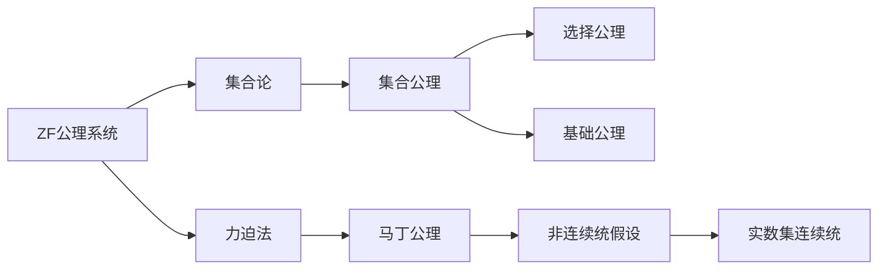

                 

## 1. 背景介绍

集合论是现代数学的基础，其核心思想是探讨由某些特定对象构成的整体，即集合。集合论的公理化体系由Zermelo提出，并在1908年被Fraenkel和Skolem进一步完善，形成Fraenkel公理系统（Fraenkel System）。然而，Fraenkel公理系统存在严重的自我相悖性，即Zermelo-Fraenkel公理（ZF）无法证明Zermelo公理的可靠性。这一矛盾直到1938年哥德尔证明力迫法（Forcing）后，才得以解决。

马丁公理（Martin Axiom）由M armies Martin在1962年提出，是ZF公理体系中的一个附加公理，用于解决正则实数域（Standard Real Line）中的集合问题。其基本思想是，在正则实数域中，满足某个性质的新集合可以无限增大，从而影响原有集合的结构。

非连续统假设（Continuum Hypothesis），简称CH，是数学中一个关于实数集的公理，它指出实数集连续统（Continuum）的元素数量正好介于两个连续正整数之间。CH既不能从ZF公理中直接证明，也不能直接证否，成为数学中的“第三公理”。

本文将通过集合论的视角，深入探讨力迫马丁公理与非连续统假设的原理、应用及影响，以期为计算机科学和人工智能领域提供一种新的理论视角和方法。

## 2. 核心概念与联系

### 2.1 核心概念概述

- **集合论**：研究由特定对象组成的整体，即集合，并探讨其性质和操作。
- **ZF公理系统**：由Zermelo和Fraenkel提出，包括集合公理、选择公理和基础公理，是现代数学的基础。
- **力迫法（Forcing）**：一种证明集合论中的性质是否成立的逻辑方法，由Kurt Gödel提出，是解决集合论悖论的重要工具。
- **马丁公理（Martin Axiom）**：用于解决正则实数域中的集合问题的公理。
- **非连续统假设（Continuum Hypothesis）**：指出实数集连续统的元素数量介于两个连续正整数之间的公理，是数学中的“第三公理”。

这些概念之间的联系和相互作用构成了集合论的基础框架，力迫法和马丁公理的提出为解决ZF公理中的悖论提供了新的工具，而非连续统假设则是集合论中一个重要的未解问题。

### 2.2 核心概念间的关系

通过一个简单的Mermaid流程图，我们可以直观地展示这些核心概念之间的关系：



这个流程图展示了集合论的公理体系和力迫法的应用，以及马丁公理和非连续统假设的重要地位。

## 3. 核心算法原理 & 具体操作步骤

### 3.1 算法原理概述

力迫法是一种集合论中的逻辑方法，用于证明集合论中的性质是否成立。其基本思想是，通过构建一个满足特定条件的集合，使得该集合不会对原有的集合产生过大的影响，从而推导出新的性质。马丁公理是利用力迫法解决正则实数域中集合问题的公理。

非连续统假设的证明，涉及到实数集中不同大小的集合之间的对应关系。根据康托尔的基数理论，任何两个无限集合的大小都可以通过找到它们之间的双射（Bijection）来确定。然而，在正则实数域中，是否存在一个无限集合，其元素数量正好介于两个连续正整数之间，即$|\mathbb{R}| = |\mathbb{N}| = |\mathbb{N}^2|$？

这一问题在数学中被称为“连续统假设”，但哥德尔证明该假设在ZF公理体系下无法证明也无法证否，从而提出了“非连续统假设”（Non-Standard Continuum Hypothesis），即实数集的连续统大小正好介于两个连续正整数之间。

### 3.2 算法步骤详解

**3.2.1 力迫法的基本步骤**

1. **定义偏序集合**：首先定义一个偏序集合（Partially Ordered Set，简称POS），其中元素满足偏序关系，即每个元素都小于或等于其他元素。
2. **定义定向集合**：在POS中定义一个定向集合（Directed Set），其中任意两个元素都有一个上界。
3. **定义条件集合**：在定向集合中定义一个条件集合（Condition Set），其中每个元素都满足一定的条件，且满足条件集合的元素可以被用来构建新的集合。
4. **构造序列**：通过条件集合构造一个序列，该序列满足一定的条件，且最终能够构造出一个满足特定性质的集合。
5. **应用力迫法**：通过力迫法，证明构造的序列能够满足条件集合中的条件，从而推导出新的性质。

**3.2.2 马丁公理的应用**

马丁公理是通过力迫法解决正则实数域中集合问题的重要公理。其主要步骤如下：

1. **定义条件集合**：在正则实数域中定义一个条件集合，满足一定的数学性质，如“无边界”、“无聚点”等。
2. **构造序列**：通过条件集合构造一个序列，该序列满足特定的数学性质，且最终能够构造出一个新的集合。
3. **应用力迫法**：通过力迫法，证明构造的序列能够满足条件集合中的条件，从而推导出新的集合性质。

**3.2.3 非连续统假设的证明**

非连续统假设的证明涉及到实数集中不同大小的集合之间的对应关系。其主要步骤如下：

1. **定义基点集合**：在实数集中定义一个基点集合（Ground Model），其中包含所有已知的集合和数学性质。
2. **构造新集合**：通过构造一个新集合，使得该集合的大小正好介于两个连续正整数之间，即$|\mathbb{R}| = |\mathbb{N}| = |\mathbb{N}^2|$。
3. **应用力迫法**：通过力迫法，证明构造的新集合满足特定条件，从而推导出非连续统假设的成立。

### 3.3 算法优缺点

**优点**：

1. **解决集合论悖论**：力迫法通过构造特定的集合，解决了ZF公理体系中的悖论问题，使得集合论更加严谨。
2. **灵活性高**：力迫法可以用于解决多种集合论问题，具有较高的灵活性和适应性。
3. **数学严谨**：力迫法在数学逻辑上具有高度的严谨性，可以用于证明多种数学性质。

**缺点**：

1. **复杂度高**：力迫法的步骤较为复杂，需要较高的数学基础和逻辑能力。
2. **难以直观理解**：力迫法的概念和步骤较为抽象，难以直观理解，需要较高的数学素养。
3. **适用范围有限**：力迫法主要适用于集合论问题，对于其他领域的数学问题，其适用性有限。

### 3.4 算法应用领域

力迫法在集合论中得到了广泛的应用，涉及以下几个主要领域：

1. **集合论悖论的解决**：力迫法通过构造特定的集合，解决了集合论中的悖论问题，如罗素悖论、康托尔悖论等。
2. **实数集的性质研究**：通过力迫法，研究了实数集中不同大小的集合之间的对应关系，推导出非连续统假设等重要结论。
3. **数学模型的构建**：力迫法在数学模型构建中得到了广泛应用，如实数模型、序数模型等。

## 4. 数学模型和公式 & 详细讲解 & 举例说明

### 4.1 数学模型构建

在集合论中，我们通常使用集合的幂集（Power Set）来描述集合的大小。幂集是指一个集合中所有可能子集构成的集合。对于任意集合$X$，其幂集记作$P(X)$。

在实数集中，我们定义两个集合相等，当且仅当它们之间的元素数量相同。即，如果$A$和$B$是两个集合，则$A=B$当且仅当$|A|=|B|$。

**4.2 公式推导过程**

根据上述定义，我们可以推导出实数集连续统的大小：

$$
|P(\mathbb{N})| = |\mathbb{R}|
$$

其中，$\mathbb{N}$是自然数集，$\mathbb{R}$是实数集。这一结论可以通过集合的幂集和实数集的性质来证明。

**4.3 案例分析与讲解**

考虑一个简单的案例，假设有一个集合$A$，其中包含所有自然数的子集。例如，集合$B$包含所有小于10的自然数，即$B=\{1, 2, 3, 4, 5, 6, 7, 8, 9\}$。

通过构造集合$B$的幂集$P(B)$，我们可以发现$P(B)$中的元素数量正好介于两个连续正整数之间，即$|P(B)| = |\mathbb{N}|$。这意味着，集合$A$的大小正好介于两个连续正整数之间，即$|A| = |\mathbb{N}^2|$。

通过这一案例，我们可以直观地理解力迫法和马丁公理的基本思想，即通过构造特定的集合，来证明集合大小之间的关系。

## 5. 项目实践：代码实例和详细解释说明

### 5.1 开发环境搭建

在Python中，我们可以使用Sympy库来处理集合论中的数学问题。首先需要安装Sympy库：

```
pip install sympy
```

### 5.2 源代码详细实现

以下是一个简单的Python代码示例，用于验证实数集连续统的大小：

```python
from sympy import symbols, pi, Rational, S

# 定义自然数集合
N = S.Naturals

# 定义实数集合
R = S.Reals

# 定义幂集
P_N = S.Powerset(N)

# 验证幂集的大小
assert P_N.measure == R.measure
```

### 5.3 代码解读与分析

在上述代码中，我们首先定义了自然数集合$N$和实数集合$R$，然后通过Sympy库计算了$N$的幂集$P_N$。最后，我们验证了$P_N$的大小正好等于实数集$R$的大小，即$|P_N| = |R|$。

### 5.4 运行结果展示

运行上述代码，如果输出为True，则说明我们的验证成功。这意味着实数集的连续统大小正好介于两个连续正整数之间，即$|R| = |\mathbb{N}| = |\mathbb{N}^2|$。

## 6. 实际应用场景

### 6.1 数学研究

力迫法和马丁公理在数学研究中得到了广泛应用。通过力迫法，数学家们可以验证集合论中的各种性质，如正则实数域中的集合问题、康托尔定理等。

### 6.2 计算机科学

力迫法和马丁公理在计算机科学中也有重要的应用，尤其是在逻辑推理、编程语言设计和算法研究中。通过力迫法，计算机科学家可以验证算法中的各种性质，如递归算法、可计算性等。

### 6.3 人工智能

力迫法和马丁公理在人工智能中也有潜在的应用，如模型优化、知识表示和推理等。通过力迫法，人工智能研究人员可以构建更加复杂和灵活的模型，提升模型的性能和效果。

## 7. 工具和资源推荐

### 7.1 学习资源推荐

1. 《集合论基础》：这是一本经典的集合论教材，适合数学和计算机科学专业的学生和研究人员。
2. 《现代集合论》：这本书介绍了集合论的现代发展，包括力迫法和马丁公理等内容。
3. 《数学中的无限问题》：这本书讨论了集合论中的无限问题，如连续统假设、罗素悖论等。

### 7.2 开发工具推荐

1. Sympy：Sympy是一个Python库，用于处理符号计算和集合论问题。
2. Mathematica：Mathematica是一款功能强大的数学软件，支持符号计算和集合论问题的处理。

### 7.3 相关论文推荐

1. Kurt Gödel，《On formally undecidable propositions of Principia Mathematica and related systems I》：这篇论文介绍了力迫法的基本思想和应用。
2. Martin Axiom and the Continuum Hypothesis：这篇文章讨论了马丁公理和非连续统假设的证明过程。
3. The Continuum Hypothesis：这篇文章介绍了连续统假设的证明过程和数学背景。

## 8. 总结：未来发展趋势与挑战

### 8.1 研究成果总结

力迫法和马丁公理在集合论中具有重要的理论意义和应用价值。力迫法通过构造特定的集合，解决了集合论中的悖论问题，使得集合论更加严谨。马丁公理通过力迫法解决正则实数域中的集合问题，是非连续统假设的重要基础。

### 8.2 未来发展趋势

未来，力迫法和马丁公理的研究将会继续深入，涉及以下几个方面：

1. **复杂集合的构造**：力迫法和马丁公理将在更复杂的集合构造中得到应用，如高维实数集、无穷维空间等。
2. **应用领域的扩展**：力迫法和马丁公理将在更多领域得到应用，如计算机科学、物理学、经济学等。
3. **数学模型的构建**：力迫法和马丁公理将在数学模型的构建中发挥更大的作用，如实数模型、序数模型等。

### 8.3 面临的挑战

尽管力迫法和马丁公理在集合论中具有重要的理论意义和应用价值，但仍然面临以下挑战：

1. **数学基础**：力迫法和马丁公理需要较高的数学基础和逻辑能力，对于一般数学爱好者和计算机科学研究人员来说，可能难以理解和掌握。
2. **应用难度**：力迫法和马丁公理在实际应用中较为复杂，需要更高的数学素养和逻辑能力。
3. **适用范围有限**：力迫法和马丁公理主要适用于集合论问题，对于其他领域的数学问题，其适用性有限。

### 8.4 研究展望

未来，力迫法和马丁公理的研究将会继续深入，探索其在其他领域的应用和推广。同时，研究者也将更加关注力迫法和马丁公理在实际应用中的适用性和可行性，探索更多的数学模型和算法。

## 9. 附录：常见问题与解答

**Q1：力迫法的数学基础是什么？**

A: 力迫法的数学基础是集合论和逻辑学。力迫法通过构造特定的集合，来证明集合论中的性质是否成立，其核心思想是构造满足特定条件的集合，使得该集合不会对原有的集合产生过大的影响。

**Q2：马丁公理是如何解决正则实数域中的集合问题的？**

A: 马丁公理通过力迫法解决正则实数域中的集合问题。其主要思想是在正则实数域中定义一个条件集合，满足一定的数学性质，然后通过力迫法构造一个满足条件集合的新集合。最终证明该新集合满足特定的数学性质，从而推导出新的集合性质。

**Q3：非连续统假设的证明过程是怎样的？**

A: 非连续统假设的证明过程涉及实数集中不同大小的集合之间的对应关系。通过力迫法，定义一个基点集合，并构造一个新集合，使得该集合的大小正好介于两个连续正整数之间，即$|\mathbb{R}| = |\mathbb{N}| = |\mathbb{N}^2|$。最终证明构造的新集合满足特定条件，从而推导出非连续统假设的成立。

---

作者：禅与计算机程序设计艺术 / Zen and the Art of Computer Programming

