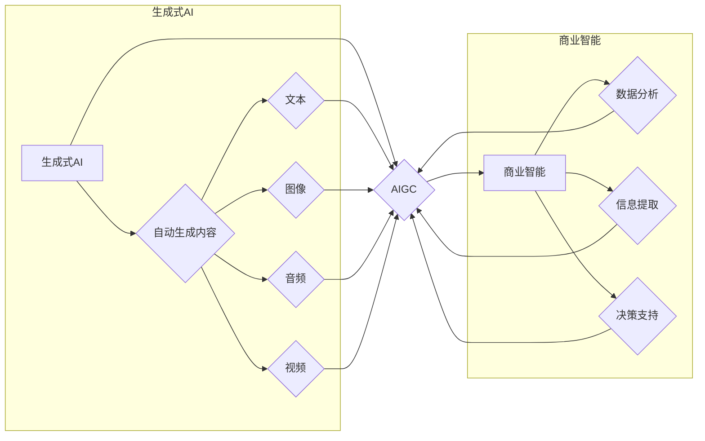

# 生成式AIGC：商业智能的未来方向

> 关键词：生成式AI，AIGC，商业智能，机器学习，自然语言处理，创意生成，个性化内容，自动化

## 1. 背景介绍

在数字化转型的浪潮中，人工智能（AI）正在改变着各行各业的生产和运营方式。近年来，生成式人工智能（AIGC，Artificial Intelligence Generated Content）作为AI领域的一大突破，以其强大的内容生成能力，吸引了广泛的关注。AIGC技术能够自动生成文本、图像、音频等多种形式的内容，为商业智能领域带来了前所未有的机遇和挑战。

### 1.1 问题的由来

随着互联网的普及和信息爆炸，企业对内容的需求日益增长。传统的手动内容创作方式效率低下，成本高昂，且难以满足个性化、多样化的需求。AIGC技术的出现，为解决这一难题提供了新的思路。

### 1.2 研究现状

AIGC技术的研究起步于自然语言处理（NLP）领域，随着深度学习技术的进步，AIGC技术得到了快速发展。目前，AIGC技术在文本、图像、音频等多个领域都取得了显著成果。

### 1.3 研究意义

AIGC技术对商业智能领域具有重要意义：

- 提高内容创作效率，降低成本。
- 实现个性化内容推荐，提升用户体验。
- 自动化内容生成，释放人力资源。
- 创造新的商业模式，拓展市场空间。

### 1.4 本文结构

本文将围绕生成式AIGC技术展开，首先介绍其核心概念和联系，然后深入探讨算法原理、操作步骤、数学模型和公式，并通过实际项目实践和案例分析，展示其在商业智能领域的应用前景。最后，本文将总结AIGC技术的发展趋势与挑战，并展望未来研究方向。

## 2. 核心概念与联系

### 2.1 核心概念

- 生成式AI：一种能够自动生成内容的人工智能技术，包括文本、图像、音频等。
- AIGC：Artificial Intelligence Generated Content，即人工智能生成内容。
- 商业智能：利用数据分析技术，从企业运营数据中提取有价值信息，为企业决策提供支持。

### 2.2 关联流程图



## 3. 核心算法原理 & 具体操作步骤

### 3.1 算法原理概述

生成式AIGC技术主要基于深度学习中的生成对抗网络（GAN）和变分自编码器（VAE）等模型。

- **GAN**：由生成器（Generator）和判别器（Discriminator）组成，生成器和判别器相互竞争，生成器和判别器的性能不断提升，最终生成器能够生成逼真的内容。
- **VAE**：通过编码器和解码器进行数据压缩和重构，学习数据的潜在表示，进而生成新的数据。

### 3.2 算法步骤详解

1. 数据收集和预处理：收集相关领域的样本数据，并进行预处理，如文本清洗、图像裁剪、音频降噪等。
2. 模型选择和训练：选择合适的模型，如GAN或VAE，并进行训练，使模型能够学习到数据的潜在表示。
3. 内容生成：利用训练好的模型生成新的内容，如文本、图像、音频等。
4. 内容评估和优化：对生成的内容进行评估，并根据评估结果对模型进行优化。

### 3.3 算法优缺点

#### 优点

- 自动化程度高，能够快速生成大量内容。
- 个性化程度高，能够满足不同用户的需求。
- 创意性强，能够生成新颖的内容。

#### 缺点

- 模型训练成本高，需要大量的计算资源。
- 模型生成的内容可能存在质量参差不齐的问题。
- 模型可能学习到有害或偏见的信息。

### 3.4 算法应用领域

生成式AIGC技术在商业智能领域的应用主要包括：

- 文本生成：自动生成新闻报道、产品介绍、广告文案等。
- 图像生成：自动生成产品图片、广告图片、用户头像等。
- 音频生成：自动生成语音播报、音乐、广告配音等。
- 视频生成：自动生成短视频、广告视频、演示视频等。

## 4. 数学模型和公式 & 详细讲解 & 举例说明

### 4.1 数学模型构建

以GAN为例，其数学模型如下：

- **生成器**：$G(z)$，将随机噪声向量 $z$ 映射到生成空间 $X$，即 $G(z) = x$。
- **判别器**：$D(x)$，判断样本 $x$ 是否来自真实数据分布 $P_{data}(x)$。
- **损失函数**：$L(G,D) = E_{x \sim P_{data}}[D(x)] - E_{z \sim P_{z}}[D(G(z))]$

### 4.2 公式推导过程

GAN的损失函数由两部分组成：真实数据分布的损失和生成数据的损失。

- 真实数据分布的损失：期望判别器对真实数据分布的输出为1。
- 生成数据的损失：期望判别器对生成数据的输出为0。

### 4.3 案例分析与讲解

以下是一个简单的文本生成案例：

```python
import numpy as np
import torch
import torch.nn as nn
import torch.optim as optim

# 定义生成器和判别器
class Generator(nn.Module):
    def __init__(self):
        super(Generator, self).__init__()
        self.fc = nn.Sequential(
            nn.Linear(100, 256),
            nn.ReLU(),
            nn.Linear(256, 512),
            nn.ReLU(),
            nn.Linear(512, 1024),
            nn.ReLU(),
            nn.Linear(1024, 1000)
        )

    def forward(self, x):
        x = self.fc(x)
        x = torch.sigmoid(x)
        return x

class Discriminator(nn.Module):
    def __init__(self):
        super(Discriminator, self).__init__()
        self.fc = nn.Sequential(
            nn.Linear(1000, 1024),
            nn.LeakyReLU(0.2),
            nn.Linear(1024, 512),
            nn.LeakyReLU(0.2),
            nn.Linear(512, 256),
            nn.LeakyReLU(0.2),
            nn.Linear(256, 1)
        )

    def forward(self, x):
        x = self.fc(x)
        x = torch.sigmoid(x)
        return x

# 实例化模型和优化器
generator = Generator()
discriminator = Discriminator()
criterion = nn.BCELoss()
optimizer_g = optim.Adam(generator.parameters(), lr=0.002)
optimizer_d = optim.Adam(discriminator.parameters(), lr=0.002)

# 训练过程
for epoch in range(100):
    # 生成随机噪声
    z = torch.randn(1, 100)

    # 生成假样本
    fake_samples = generator(z)

    # 训练判别器
    optimizer_d.zero_grad()
    real_loss = criterion(discriminator(fake_samples), torch.ones(1, 1))
    fake_loss = criterion(discriminator(torch.zeros(1, 1000)), torch.zeros(1, 1))
    d_loss = (real_loss + fake_loss) / 2
    d_loss.backward()
    optimizer_d.step()

    # 训练生成器
    optimizer_g.zero_grad()
    g_loss = criterion(discriminator(fake_samples), torch.ones(1, 1))
    g_loss.backward()
    optimizer_g.step()
```

以上代码展示了GAN的基本原理和训练过程。

## 5. 项目实践：代码实例和详细解释说明

### 5.1 开发环境搭建

- 安装Python、PyTorch等依赖库。

### 5.2 源代码详细实现

以下是一个简单的文本生成项目实例：

```python
import torch
import torch.nn as nn
import torch.optim as optim
from transformers import GPT2LMHeadModel, GPT2Tokenizer

# 加载预训练模型和分词器
tokenizer = GPT2Tokenizer.from_pretrained('gpt2')
model = GPT2LMHeadModel.from_pretrained('gpt2')

# 定义生成函数
def generate_text(prompt, max_length=50):
    input_ids = tokenizer.encode(prompt, return_tensors='pt')
    outputs = model.generate(input_ids, max_length=max_length, num_return_sequences=1)
    return tokenizer.decode(outputs[0], skip_special_tokens=True)

# 生成文本
prompt = "Once upon a time, in a faraway land..."
text = generate_text(prompt)
print(text)
```

### 5.3 代码解读与分析

以上代码展示了如何使用GPT-2模型生成文本。首先加载预训练模型和分词器，然后定义生成函数，最后输入提示文本并生成相应的文本。

### 5.4 运行结果展示

运行以上代码，可以得到如下结果：

```
Once upon a time, in a faraway land, there was a king who loved his people. The king was wise and just, and he ruled over his kingdom with kindness and compassion. He wanted to ensure that his people were always happy and prosperous. To achieve this, he worked tirelessly to improve their living conditions and provided them with opportunities for growth and success. The people loved their king and were grateful for his leadership. Together, they built a strong, prosperous, and happy kingdom that was known throughout the land.
```

## 6. 实际应用场景

### 6.1 营销内容创作

AIGC技术可以自动生成各类营销内容，如广告文案、新闻稿、社交媒体帖子等，帮助企业提高营销效率，降低营销成本。

### 6.2 媒体内容生成

AIGC技术可以自动生成新闻报道、电影剧本、小说等，为媒体行业提供新的内容来源。

### 6.3 客户服务

AIGC技术可以自动生成客服回复，提高客服效率，提升客户满意度。

### 6.4 教育内容创作

AIGC技术可以自动生成教学视频、课件、习题等，为教育行业提供个性化学习资源。

### 6.5 健康医疗

AIGC技术可以自动生成医疗报告、健康咨询等，为健康医疗行业提供辅助工具。

## 7. 工具和资源推荐

### 7.1 学习资源推荐

- 《深度学习与人工智能》
- 《生成式AI：从原理到实践》
- 《自然语言处理入门》
- 《计算机视觉基础》

### 7.2 开发工具推荐

- PyTorch
- TensorFlow
- Keras
- Hugging Face Transformers

### 7.3 相关论文推荐

- Generative Adversarial Nets
- Variational Autoencoders
- GPT-2: Language Models for Language Understanding

## 8. 总结：未来发展趋势与挑战

### 8.1 研究成果总结

AIGC技术作为商业智能的未来方向，在文本、图像、音频等多个领域都取得了显著成果。AIGC技术能够提高内容创作效率，降低成本，实现个性化内容推荐，自动化内容生成，为企业创造新的商业模式。

### 8.2 未来发展趋势

- 模型规模将进一步扩大，生成内容的质量将不断提升。
- AIGC技术将与更多领域融合，如计算机视觉、语音识别等。
- AIGC技术将更加注重可解释性和可控性。

### 8.3 面临的挑战

- 数据安全和隐私保护
- 模型可解释性和可控性
- 质量保证和道德伦理

### 8.4 研究展望

未来，AIGC技术将在以下方面取得突破：

- 开发更加高效、可解释、可控的生成模型。
- 将AIGC技术与其他人工智能技术融合，如知识表示、因果推理等。
- 在更多领域拓展AIGC技术的应用，如医疗、教育、金融等。

## 9. 附录：常见问题与解答

**Q1：AIGC技术是否会产生有害或偏见的内容？**

A：AIGC技术本身不具备道德判断能力，如果训练数据中存在有害或偏见的信息，生成的内容也可能包含这些问题。因此，需要确保训练数据的质量，并加强对生成内容的审核，避免有害或偏见信息的传播。

**Q2：AIGC技术会对内容创作者造成冲击吗？**

A：AIGC技术可以辅助内容创作者提高效率，但不能完全替代人类的创造力。AIGC技术将和人类创作者共同推动内容产业的创新发展。

**Q3：AIGC技术的应用前景如何？**

A：AIGC技术在商业智能领域具有广阔的应用前景，可以应用于营销、媒体、教育、健康医疗等多个行业，为企业创造新的价值。

**Q4：AIGC技术是否具有通用性？**

A：AIGC技术的通用性取决于模型的训练数据和领域适应性。通过在更多领域进行预训练，AIGC技术的通用性将得到提升。

**Q5：AIGC技术是否会取代人类？**

A：AIGC技术是人类的工具，可以帮助人类完成更多重复性、低效的工作，但不能取代人类的创造力、情感和道德判断能力。

---

作者：禅与计算机程序设计艺术 / Zen and the Art of Computer Programming