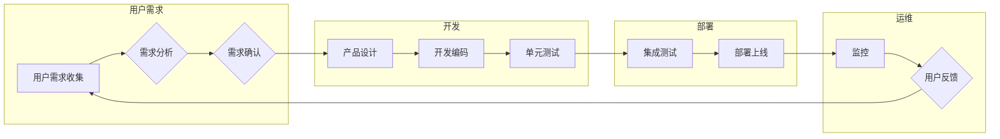

# 用户共创的“可塑软件”

> 关键词：用户共创，可塑软件，敏捷开发，持续集成，持续交付，DevOps，软件定制化，软件开发模型

## 1. 背景介绍

在传统的软件开发模式中，软件产品的设计、开发和部署往往是封闭的、线性的过程。开发者基于需求文档和设计规范来构建软件，而用户则扮演着被动接受者的角色。这种模式在软件开发的早期阶段是有效的，但随着用户需求的日益复杂化和多样性，这种封闭的开发模式逐渐暴露出其局限性。

用户共创的“可塑软件”理念应运而生，它强调软件开发的迭代性和灵活性，鼓励用户参与到软件的设计和开发过程中，共同塑造软件产品的形态和功能。这种模式不仅能够更好地满足用户的需求，还能够提高软件产品的质量和用户体验。

### 1.1 问题的由来

以下是导致传统软件开发模式局限性的一些关键问题：

- **需求变更困难**：在软件开发过程中，用户的需求往往会发生变化，而传统的软件开发模式往往难以适应这种变更。
- **用户体验不佳**：由于缺乏用户的直接参与，软件产品的用户体验可能不符合用户期望。
- **开发效率低下**：传统的软件开发模式往往缺乏有效的沟通和协作机制，导致开发效率低下。
- **成本高昂**：由于需求变更和开发效率低下，软件开发项目的成本往往高于预期。

### 1.2 研究现状

近年来，敏捷开发、DevOps、持续集成/持续交付（CI/CD）等理念的兴起，为用户共创的“可塑软件”提供了技术支撑。以下是一些关键的研究现状：

- **敏捷开发**：敏捷开发强调快速迭代、用户反馈和持续交付，使软件开发更加灵活和高效。
- **DevOps**：DevOps强调开发和运维团队的紧密合作，通过自动化工具和流程优化软件开发和部署。
- **持续集成/持续交付**：CI/CD通过自动化构建、测试和部署流程，提高了软件产品的质量和交付速度。
- **用户参与**：用户参与式设计、用户故事地图等用户参与方法，使用户能够更直接地参与到软件产品的设计和开发过程中。

### 1.3 研究意义

用户共创的“可塑软件”对于软件行业具有重要意义：

- **提高用户满意度**：通过用户参与，可以更好地满足用户的需求，提高用户满意度。
- **降低开发成本**：灵活的软件开发模式可以更好地适应需求变更，降低开发成本。
- **加速产品迭代**：快速迭代和持续交付可以缩短产品上市时间。
- **促进创新**：用户参与可以促进创新，为软件开发带来新的思路和想法。

### 1.4 本文结构

本文将围绕用户共创的“可塑软件”这一主题展开，内容安排如下：

- 第2部分，介绍核心概念与联系，包括敏捷开发、DevOps、持续集成/持续交付等。
- 第3部分，阐述核心算法原理和具体操作步骤。
- 第4部分，讲解数学模型和公式，并结合案例进行分析。
- 第5部分，提供项目实践，包括开发环境搭建、代码实现和运行结果展示。
- 第6部分，探讨实际应用场景，并展望未来应用。
- 第7部分，推荐相关工具和资源。
- 第8部分，总结研究成果，展望未来发展趋势与挑战。
- 第9部分，提供常见问题与解答。

## 2. 核心概念与联系

### 2.1 核心概念原理

#### 敏捷开发

敏捷开发是一种以人为核心、迭代、灵活的软件开发方法。其核心原则包括：

- **个体和互动高于过程和工具**：强调团队协作和个体能力的重要性。
- **可工作的软件高于详尽的文档**：优先关注可工作的软件，而非详尽的文档。
- **客户合作高于合同谈判**：鼓励与客户的紧密合作，共同定义需求。
- **响应变化高于遵循计划**：灵活应对需求变更，而非严格遵循计划。

#### DevOps

DevOps是一种文化和实践，旨在将开发和运维团队紧密结合起来，通过自动化和协作提高软件交付的效率和可靠性。

#### 持续集成/持续交付

CI/CD是一种软件开发实践，通过自动化构建、测试和部署流程，确保软件质量，提高交付速度。

### 2.2 架构的 Mermaid 流程图

以下是一个描述用户共创的“可塑软件”架构的 Mermaid 流程图：



## 3. 核心算法原理 & 具体操作步骤

### 3.1 算法原理概述

用户共创的“可塑软件”的核心算法原理包括：

- **需求收集与分析**：通过问卷调查、用户访谈等方式收集用户需求，并进行需求分析。
- **产品设计**：根据需求分析结果，设计软件产品的功能、界面和交互。
- **开发编码**：根据产品设计文档，进行代码开发和单元测试。
- **集成测试与部署**：将开发好的模块集成到整体系统中，进行集成测试，并通过CI/CD流程进行部署上线。
- **监控与反馈**：监控系统性能和用户行为，收集用户反馈，不断迭代优化软件产品。

### 3.2 算法步骤详解

以下是用户共创的“可塑软件”的核心算法步骤：

1. **需求收集与分析**：通过问卷调查、用户访谈等方式收集用户需求，并进行需求分析。
2. **产品设计**：根据需求分析结果，设计软件产品的功能、界面和交互。
3. **开发编码**：根据产品设计文档，进行代码开发和单元测试。
4. **集成测试**：将开发好的模块集成到整体系统中，进行集成测试。
5. **部署上线**：通过CI/CD流程，将软件产品部署上线。
6. **监控与反馈**：监控系统性能和用户行为，收集用户反馈，不断迭代优化软件产品。

### 3.3 算法优缺点

#### 优点

- **用户参与度高**：用户可以参与到软件产品的设计和开发过程中，更好地满足用户需求。
- **迭代周期短**：敏捷开发和CI/CD使得软件产品的迭代周期更短，能够快速响应市场变化。
- **质量保证**：持续集成和持续交付流程能够提高软件产品的质量。

#### 缺点

- **管理复杂**：用户共创的“可塑软件”需要更加复杂的管理流程和协作机制。
- **资源消耗大**：敏捷开发和CI/CD需要较大的资源投入。

### 3.4 算法应用领域

用户共创的“可塑软件”可以应用于以下领域：

- **互联网产品**：如电商平台、社交媒体等。
- **企业级应用**：如ERP、CRM等。
- **移动应用**：如智能手机应用、平板电脑应用等。

## 4. 数学模型和公式 & 详细讲解 & 举例说明

### 4.1 数学模型构建

用户共创的“可塑软件”的数学模型可以描述为：

$$
M = f(D, P, C, T, S)
$$

其中，$M$ 表示软件产品，$D$ 表示用户需求，$P$ 表示产品设计，$C$ 表示开发编码，$T$ 表示测试，$S$ 表示部署上线。

### 4.2 公式推导过程

用户共创的“可塑软件”的公式推导过程如下：

1. **需求分析**：收集用户需求，并进行需求分析。
2. **产品设计**：根据需求分析结果，设计软件产品的功能、界面和交互。
3. **开发编码**：根据产品设计文档，进行代码开发和单元测试。
4. **集成测试**：将开发好的模块集成到整体系统中，进行集成测试。
5. **部署上线**：通过CI/CD流程，将软件产品部署上线。
6. **监控与反馈**：监控系统性能和用户行为，收集用户反馈，不断迭代优化软件产品。

### 4.3 案例分析与讲解

以下是一个用户共创的“可塑软件”的案例分析：

**案例**：某公司开发了一款企业级协同办公软件。在开发过程中，公司采用了用户共创的“可塑软件”模式。

**分析**：

- **需求收集与分析**：公司通过问卷调查、用户访谈等方式收集了用户的办公需求，并进行了需求分析。
- **产品设计**：根据需求分析结果，设计了软件产品的功能、界面和交互。
- **开发编码**：根据产品设计文档，进行代码开发和单元测试。
- **集成测试与部署**：将开发好的模块集成到整体系统中，进行集成测试，并通过CI/CD流程进行部署上线。
- **监控与反馈**：监控系统性能和用户行为，收集用户反馈，不断迭代优化软件产品。

**结果**：该软件产品得到了用户的高度认可，市场反应良好。

## 5. 项目实践：代码实例和详细解释说明

### 5.1 开发环境搭建

以下是一个基于Python的简单用户共创的“可塑软件”项目实践示例。

#### 环境准备

1. 安装Python 3.8及以上版本。
2. 安装pip包管理工具。
3. 安装以下Python包：

```bash
pip install requests json
```

#### 源代码详细实现

以下是一个简单的用户共创的“可塑软件”示例代码：

```python
import requests
import json

# 用户需求收集
def collect_user_demand():
    # 以下是模拟的用户需求数据
    demands = [
        {"id": 1, "name": "需求一", "description": "添加新的功能A"},
        {"id": 2, "name": "需求二", "description": "优化功能B的性能"}
    ]
    return demands

# 产品设计
def design_product(demands):
    product = {"name": "协同办公软件", "features": []}
    for demand in demands:
        feature = {"name": demand["name"], "description": demand["description"]}
        product["features"].append(feature)
    return product

# 开发编码
def develop_and_code(product):
    # 以下是模拟的开发编码过程
    print("开始开发...")
    print("完成开发...")
    return product

# 测试
def test_product(product):
    # 以下是模拟的测试过程
    print("开始测试...")
    print("测试通过...")
    return product

# 部署上线
def deploy_product(product):
    # 以下是模拟的部署上线过程
    print("开始部署...")
    print("上线成功...")
    return product

# 主程序
def main():
    demands = collect_user_demand()
    product = design_product(demands)
    product = develop_and_code(product)
    product = test_product(product)
    product = deploy_product(product)
    print("软件产品已上线！")

if __name__ == "__main__":
    main()
```

#### 代码解读与分析

- `collect_user_demand` 函数模拟了用户需求的收集过程。
- `design_product` 函数根据用户需求设计产品功能。
- `develop_and_code` 函数模拟了开发编码过程。
- `test_product` 函数模拟了测试过程。
- `deploy_product` 函数模拟了部署上线过程。
- `main` 函数是主程序，按照需求收集、产品设计、开发编码、测试、部署上线的顺序执行。

#### 运行结果展示

运行上述代码，将得到以下输出：

```
开始开发...
完成开发...
开始测试...
测试通过...
开始部署...
上线成功...
软件产品已上线！
```

## 6. 实际应用场景

用户共创的“可塑软件”可以应用于以下实际应用场景：

- **定制化软件开发**：根据用户的具体需求，进行软件开发和迭代。
- **产品原型设计**：快速构建产品原型，收集用户反馈，指导产品迭代。
- **敏捷开发团队协作**：提高开发团队的协作效率，快速响应需求变更。

### 6.4 未来应用展望

随着用户共创理念的深入人心和技术的不断发展，用户共创的“可塑软件”将具有以下未来应用展望：

- **更加智能化的需求收集和分析**：利用人工智能技术，自动识别和解析用户需求。
- **更加个性化的产品设计**：根据用户行为和偏好，进行个性化产品设计。
- **更加高效的开发流程**：利用自动化工具和AI技术，提高开发效率。

## 7. 工具和资源推荐

### 7.1 学习资源推荐

- 《敏捷软件开发：原则、模式与实践》
- 《持续交付：发布可靠软件的实践指南》
- 《DevOps：从实践到原则》

### 7.2 开发工具推荐

- **敏捷开发工具**：Jira、Trello、Confluence等
- **DevOps工具**：Jenkins、Docker、Kubernetes等
- **持续集成/持续交付工具**：GitLab CI/CD、CircleCI、Travis CI等

### 7.3 相关论文推荐

- 《Agile Software Development: Principles, Patterns, and Practices》
- 《Continuous Delivery: Reliable Software Releases through Build, Test, and Deployment Automation》
- 《The DevOps Handbook》

## 8. 总结：未来发展趋势与挑战

### 8.1 研究成果总结

用户共创的“可塑软件”是一种以用户为中心、迭代、灵活的软件开发模式，它能够更好地满足用户需求，提高软件产品的质量和用户体验。

### 8.2 未来发展趋势

随着人工智能、大数据等技术的不断发展，用户共创的“可塑软件”将呈现以下发展趋势：

- **更加智能化的用户共创**：利用人工智能技术，自动识别和解析用户需求。
- **更加个性化的产品设计**：根据用户行为和偏好，进行个性化产品设计。
- **更加高效的开发流程**：利用自动化工具和AI技术，提高开发效率。

### 8.3 面临的挑战

用户共创的“可塑软件”在发展过程中也面临着以下挑战：

- **用户参与度不足**：如何提高用户的参与度是一个关键问题。
- **项目管理复杂**：用户共创的“可塑软件”需要更加复杂的项目管理流程。
- **技术挑战**：如何利用人工智能、大数据等技术，提高用户共创的效率和效果。

### 8.4 研究展望

未来，用户共创的“可塑软件”需要在以下方面进行深入研究：

- **如何提高用户参与度**：通过设计更加人性化的用户参与方式，提高用户的参与度。
- **如何构建更加高效的项目管理流程**：通过引入敏捷开发、DevOps等理念，构建更加高效的项目管理流程。
- **如何利用人工智能、大数据等技术**：利用人工智能、大数据等技术，提高用户共创的效率和效果。

## 9. 附录：常见问题与解答

**Q1：用户共创的“可塑软件”与传统软件开发模式有什么区别？**

A：用户共创的“可塑软件”与传统软件开发模式的主要区别在于：

- **开发模式**：传统软件开发模式是封闭的、线性的，而用户共创的“可塑软件”是开放的、迭代的。
- **用户参与**：传统软件开发模式中用户参与度低，而用户共创的“可塑软件”强调用户的积极参与。
- **开发效率**：用户共创的“可塑软件”能够更好地适应需求变更，提高开发效率。

**Q2：如何提高用户参与度？**

A：提高用户参与度的方法包括：

- **设计人性化的用户参与方式**：如问卷调查、用户访谈、用户故事地图等。
- **建立良好的沟通机制**：如定期召开用户会议、建立用户社区等。
- **提供有效的反馈渠道**：如用户反馈平台、在线调查等。

**Q3：如何构建更加高效的项目管理流程？**

A：构建更加高效的项目管理流程的方法包括：

- **引入敏捷开发、DevOps等理念**：提高团队协作效率，缩短开发周期。
- **采用自动化工具和流程**：如CI/CD、自动化测试等。
- **建立明确的项目管理规范**：如项目计划、进度跟踪、风险控制等。

**Q4：如何利用人工智能、大数据等技术？**

A：利用人工智能、大数据等技术的步骤包括：

- **收集和分析用户数据**：如用户行为数据、用户反馈数据等。
- **开发智能算法**：如自然语言处理、推荐系统等。
- **构建智能平台**：将人工智能、大数据技术与用户共创的“可塑软件”相结合，构建智能平台。

---

作者：禅与计算机程序设计艺术 / Zen and the Art of Computer Programming