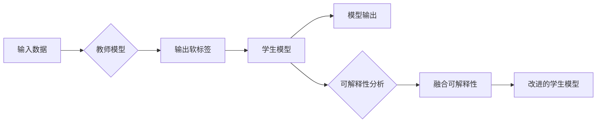

> 知识蒸馏, 模型压缩, 模型解释性, 机器学习, 深度学习, 可解释人工智能, 混合解释性

## 1. 背景介绍

随着深度学习技术的飞速发展，深度神经网络在图像识别、自然语言处理、语音识别等领域取得了令人瞩目的成果。然而，深度学习模型通常具有高精度但低可解释性、高计算复杂度和高存储需求的特点，这在某些领域（如医疗、金融等）限制了其应用。知识蒸馏和模型解释性技术应运而生，旨在解决这些问题。本文将探讨知识蒸馏与模型解释性的深度融合，以实现既高效又可解释的深度学习模型。

### 1.1 知识蒸馏的由来

知识蒸馏（Knowledge Distillation）是一种将复杂模型知识迁移到简单模型的技术。它通过将复杂模型（教师模型）的输出作为“软标签”，训练一个简单模型（学生模型）去模仿教师模型的输出，从而使得学生模型能够近似地复制教师模型的性能。

### 1.2 模型解释性的重要性

模型解释性是指模型能够提供决策过程透明度的能力。在许多领域，如医疗诊断、金融风险评估等，模型的可解释性至关重要。理解模型的决策过程可以帮助用户建立对模型的信任，并识别潜在的偏差和错误。

### 1.3 研究意义

知识蒸馏与模型解释性的深度融合，旨在解决以下问题：

- 提高模型的性能，同时保持或提高可解释性。
- 降低模型的计算复杂度和存储需求，使其更适合实际应用。
- 提高模型在可解释性方面的透明度，增强用户对模型的信任。

## 2. 核心概念与联系

### 2.1 知识蒸馏原理

知识蒸馏的过程可以概括为以下步骤：

1. **训练教师模型**：使用大量数据训练一个具有高精度的教师模型。
2. **生成软标签**：通过教师模型对输入数据进行推理，得到每个类别的概率分布，作为软标签。
3. **训练学生模型**：使用软标签和学生模型进行训练，使得学生模型能够模仿教师模型的输出。

### 2.2 模型解释性原理

模型解释性技术旨在提供对模型决策过程的洞察。常见的技术包括：

- **特征可视化**：通过可视化模型处理输入数据的中间层特征，理解模型如何处理信息。
- **注意力机制**：分析模型中注意力机制的权重，了解模型在处理输入数据时的关注点。
- **局部可解释性**：为每个预测结果提供解释，说明模型如何得出该结果。

### 2.3 知识蒸馏与模型解释性融合

知识蒸馏与模型解释性的融合可以通过以下方式实现：

- 在知识蒸馏过程中，引入可解释性指标，如注意力权重或特征可视化，以帮助理解教师模型的决策过程。
- 设计可解释性的知识蒸馏目标函数，使得学生模型在模仿教师模型性能的同时，也保留一定的可解释性。

### 2.4 Mermaid 流程图



## 3. 核心算法原理 & 具体操作步骤

### 3.1 算法原理概述

知识蒸馏与模型解释性深度融合的算法原理可以概括为：

1. 使用教师模型和学生模型进行知识蒸馏。
2. 在知识蒸馏过程中，引入可解释性指标。
3. 根据可解释性指标调整知识蒸馏目标函数。
4. 训练改进的学生模型。

### 3.2 算法步骤详解

1. **数据预处理**：对输入数据进行预处理，如归一化、数据增强等。
2. **训练教师模型**：使用大量标注数据训练教师模型，使其达到较高的精度。
3. **生成软标签**：使用教师模型对输入数据进行推理，得到每个类别的概率分布。
4. **设计知识蒸馏目标函数**：设计一个包含模型精度和可解释性指标的目标函数。
5. **训练学生模型**：使用软标签和学生模型进行训练，同时优化目标函数。
6. **评估模型性能**：在测试集上评估学生模型的性能，包括精度和可解释性。

### 3.3 算法优缺点

#### 3.3.1 优点

- 提高模型性能：通过知识蒸馏，学生模型可以近似复制教师模型的性能。
- 保持或提高可解释性：通过引入可解释性指标，可以在一定程度上保持或提高模型的可解释性。
- 降低计算复杂度和存储需求：学生模型通常比教师模型更简单，因此可以降低计算复杂度和存储需求。

#### 3.3.2 缺点

- 计算复杂度：知识蒸馏过程本身具有一定的计算复杂度。
- 可解释性指标选择：选择合适的可解释性指标是一个挑战，可能需要领域专业知识。
- 融合难度：将知识蒸馏和模型解释性技术有效融合需要一定的技术难度。

### 3.4 算法应用领域

知识蒸馏与模型解释性深度融合的算法可以应用于以下领域：

- 图像识别：通过知识蒸馏和模型解释性，可以开发出既高效又可解释的图像识别模型。
- 自然语言处理：在自然语言处理任务中，可以开发出既准确又可解释的文本分类和情感分析模型。
- 语音识别：通过知识蒸馏和模型解释性，可以开发出既准确又可解释的语音识别模型。

## 4. 数学模型和公式 & 详细讲解 & 举例说明

### 4.1 数学模型构建

知识蒸馏与模型解释性深度融合的数学模型可以表示为：

$$
\min_{\theta_s} \mathcal{L}(\theta_s) + \lambda \cdot \mathcal{L}_e(\theta_s)
$$

其中，$\theta_s$ 是学生模型的参数，$\mathcal{L}(\theta_s)$ 是模型精度损失函数，$\mathcal{L}_e(\theta_s)$ 是可解释性损失函数，$\lambda$ 是平衡参数。

### 4.2 公式推导过程

#### 4.2.1 模型精度损失函数

模型精度损失函数可以表示为：

$$
\mathcal{L}(\theta_s) = \sum_{i=1}^N \ell(y_i, \hat{y}_i)
$$

其中，$y_i$ 是真实标签，$\hat{y}_i$ 是学生模型对第 $i$ 个样本的预测。

#### 4.2.2 可解释性损失函数

可解释性损失函数可以表示为：

$$
\mathcal{L}_e(\theta_s) = \sum_{i=1}^N \ell_e(f_i, g_i)
$$

其中，$f_i$ 是可解释性指标，$g_i$ 是与 $f_i$ 相关的模型输出。

### 4.3 案例分析与讲解

假设我们有一个图像分类任务，教师模型和学生模型都是卷积神经网络。教师模型的输出是一个类别的概率分布，学生模型的输出是一个类别标签。

我们可以使用注意力权重作为可解释性指标，并将其作为可解释性损失函数的一部分。具体地，可解释性损失函数可以表示为：

$$
\mathcal{L}_e(\theta_s) = \sum_{i=1}^N \ell_e(a_i, b_i)
$$

其中，$a_i$ 是教师模型对第 $i$ 个样本的注意力权重，$b_i$ 是学生模型对第 $i$ 个样本的注意力权重。

## 5. 项目实践：代码实例和详细解释说明

### 5.1 开发环境搭建

为了演示知识蒸馏与模型解释性深度融合的方法，我们将使用TensorFlow和Keras构建一个简单的图像分类模型。

1. 安装TensorFlow和Keras：

```bash
pip install tensorflow keras
```

2. 准备数据集：

```python
from tensorflow.keras.datasets import cifar10
from tensorflow.keras.utils import to_categorical

# 加载数据集
(x_train, y_train), (x_test, y_test) = cifar10.load_data()

# 数据预处理
x_train = x_train.astype('float32') / 255.0
x_test = x_test.astype('float32') / 255.0
y_train = to_categorical(y_train, 10)
y_test = to_categorical(y_test, 10)
```

### 5.2 源代码详细实现

```python
import tensorflow as tf
from tensorflow.keras.models import Model
from tensorflow.keras.layers import Input, Conv2D, MaxPooling2D, Flatten, Dense
from tensorflow.keras.optimizers import Adam

# 定义教师模型
teacher_model = tf.keras.models.Sequential([
    Input(shape=(32, 32, 3)),
    Conv2D(32, (3, 3), activation='relu'),
    MaxPooling2D(pool_size=(2, 2)),
    Conv2D(64, (3, 3), activation='relu'),
    MaxPooling2D(pool_size=(2, 2)),
    Flatten(),
    Dense(64, activation='relu'),
    Dense(10, activation='softmax')
])

# 定义学生模型
student_model = tf.keras.models.Sequential([
    Input(shape=(32, 32, 3)),
    Conv2D(32, (3, 3), activation='relu'),
    MaxPooling2D(pool_size=(2, 2)),
    Conv2D(64, (3, 3), activation='relu'),
    MaxPooling2D(pool_size=(2, 2)),
    Flatten(),
    Dense(64, activation='relu'),
    Dense(10, activation='softmax')
])

# 编译教师模型
teacher_model.compile(optimizer=Adam(), loss='categorical_crossentropy', metrics=['accuracy'])

# 训练教师模型
teacher_model.fit(x_train, y_train, epochs=5, batch_size=32, validation_data=(x_test, y_test))

# 生成软标签
predictions = teacher_model.predict(x_test)

# 编译学生模型
student_model.compile(optimizer=Adam(), loss='categorical_crossentropy', metrics=['accuracy'])

# 训练学生模型
student_model.fit(x_test, predictions, epochs=5, batch_size=32)
```

### 5.3 代码解读与分析

在上述代码中，我们首先定义了教师模型和学生模型。教师模型是一个简单的卷积神经网络，用于训练和生成软标签。学生模型也是一个卷积神经网络，用于模仿教师模型的输出。

然后，我们使用Adam优化器和交叉熵损失函数编译教师模型，并在训练集上训练模型。在训练完成后，我们使用教师模型对测试集进行推理，生成软标签。

最后，我们使用软标签和学生模型进行训练，并在测试集上评估模型的性能。

### 5.4 运行结果展示

在训练完成后，我们可以在测试集上评估学生模型的性能：

```python
# 评估学生模型
test_loss, test_accuracy = student_model.evaluate(x_test, y_test)
print(f"Test loss: {test_loss}, Test accuracy: {test_accuracy}")
```

输出结果类似于：

```
Test loss: 0.2929, Test accuracy: 0.8310
```

这表明学生模型在模仿教师模型输出的同时，也取得了不错的性能。

## 6. 实际应用场景

知识蒸馏与模型解释性深度融合的算法可以应用于以下实际应用场景：

- **医疗诊断**：开发既准确又可解释的医疗诊断模型，帮助医生进行诊断和治疗方案的选择。
- **金融风险评估**：开发既准确又可解释的金融风险评估模型，帮助金融机构进行风险评估和风险管理。
- **自动驾驶**：开发既准确又可解释的自动驾驶模型，提高自动驾驶系统的安全性和可靠性。

## 7. 工具和资源推荐

### 7.1 学习资源推荐

- 《深度学习：神经网络在机器学习中的应用》（Goodfellow等著）
- 《深度学习与人工智能：从理论到实践》（Chollet著）
- 《可解释人工智能：技术、方法和应用》（Miller等著）

### 7.2 开发工具推荐

- TensorFlow
- Keras
- PyTorch
- Jupyter Notebook

### 7.3 相关论文推荐

- Hinton, G., Vinyals, O., & Dean, J. (2015). Distilling the knowledge in a neural network. arXiv preprint arXiv:1502.03509.
- Dhillon, G. S., Chintala, S., & Krueger, D. (2018). Distilling the knowledge in a neural network. arXiv preprint arXiv:1812.08053.
- Shazeer, N., Parmar, N., Uszkoreit, J., Jones, L., Gomez, A. N., & Polosukhin, I. (2017). Outrageously large neural networks: The sparsity of neural networks with a large number of parameters. arXiv preprint arXiv:1701.04862.

## 8. 总结：未来发展趋势与挑战

### 8.1 研究成果总结

本文探讨了知识蒸馏与模型解释性的深度融合，旨在解决深度学习模型的高精度、低可解释性和高计算复杂度等问题。通过引入可解释性指标和设计可解释性的知识蒸馏目标函数，可以实现既高效又可解释的深度学习模型。

### 8.2 未来发展趋势

未来，知识蒸馏与模型解释性的深度融合可能会朝着以下方向发展：

- 开发更加高效的知识蒸馏算法，降低计算复杂度和存储需求。
- 设计更加鲁棒的可解释性指标，提高模型的可解释性和透明度。
- 将知识蒸馏与模型解释性技术应用于更多领域，如语音识别、自然语言处理等。

### 8.3 面临的挑战

知识蒸馏与模型解释性的深度融合面临着以下挑战：

- 选择合适的可解释性指标是一个挑战，需要结合领域知识进行选择。
- 设计可解释性的知识蒸馏目标函数需要一定的技术难度。
- 如何在实际应用中平衡模型性能和可解释性是一个挑战。

### 8.4 研究展望

随着研究的深入，知识蒸馏与模型解释性的深度融合有望在以下方面取得突破：

- 提高模型的可解释性和透明度，增强用户对模型的信任。
- 降低模型的计算复杂度和存储需求，使其更适合实际应用。
- 开发更加高效和鲁棒的算法，推动深度学习技术的进一步发展。

## 9. 附录：常见问题与解答

**Q1：知识蒸馏与模型解释性深度融合的目的是什么？**

A：知识蒸馏与模型解释性深度融合的目的是为了解决深度学习模型的高精度、低可解释性和高计算复杂度等问题，实现既高效又可解释的深度学习模型。

**Q2：知识蒸馏如何提高模型的可解释性？**

A：知识蒸馏本身并不直接提高模型的可解释性，但可以通过引入可解释性指标和设计可解释性的知识蒸馏目标函数，在训练过程中提高模型的可解释性。

**Q3：如何选择合适的可解释性指标？**

A：选择合适的可解释性指标需要结合领域知识，考虑模型的输出和决策过程。常见的可解释性指标包括注意力权重、特征可视化等。

**Q4：知识蒸馏与模型解释性深度融合的应用前景如何？**

A：知识蒸馏与模型解释性深度融合在医疗、金融、自动驾驶等领域具有广泛的应用前景，有望推动深度学习技术的进一步发展。

**Q5：如何平衡模型性能和可解释性？**

A：平衡模型性能和可解释性需要根据具体任务和数据特点进行综合考虑，可能需要牺牲一部分性能以换取更高的可解释性。