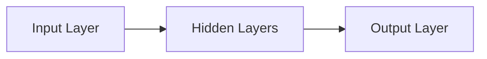

> 神经网络，深度学习，人工智能，机器学习，神经网络架构，反向传播，损失函数，应用场景

# 神经网络：探索未知的领域

### 1. 背景介绍

从20世纪40年代的神经网络诞生以来，人工智能领域经历了多次起伏。近年来，随着计算能力的提升和大数据的涌现，神经网络尤其是深度学习技术取得了突破性的进展。神经网络作为模拟人脑神经元结构和功能的计算模型，在图像识别、自然语言处理、语音识别等领域展现出强大的能力。本文将深入探讨神经网络的原理、算法、应用和未来发展趋势。

### 2. 核心概念与联系

#### 2.1 神经网络架构

神经网络由多个相互连接的神经元组成，每个神经元负责处理一部分输入信息，并将处理结果传递给下一层神经元。神经网络的基本架构如下：



- **输入层 (Input Layer)**: 接收原始输入数据。
- **隐藏层 (Hidden Layers)**: 对输入数据进行特征提取和处理。
- **输出层 (Output Layer)**: 根据隐藏层的输出，给出最终的预测结果。

#### 2.2 神经元

神经元是神经网络的基本单元，通常由以下几个部分组成：

- **输入 (Input)**: 神经元的输入数据。
- **权重 (Weight)**: 连接输入层和神经元之间的参数。
- **偏置 (Bias)**: 神经元内部的一个可调节参数。
- **激活函数 (Activation Function)**: 对神经元输出的线性组合进行非线性变换。

#### 2.3 激活函数

激活函数是神经网络的核心，它将神经元的线性组合转换为一个非线性的输出。常见的激活函数包括：

- **Sigmoid**: 将输出压缩到 (0,1) 区间。
- **ReLU (Rectified Linear Unit)**: 将负值设为 0，正值不变。
- **Tanh (Hyperbolic Tangent)**: 将输出压缩到 (-1,1) 区间。
- **Softmax**: 用于多分类任务，将输出转换为概率分布。

### 3. 核心算法原理 & 具体操作步骤

#### 3.1 算法原理概述

神经网络的核心算法是反向传播算法。反向传播算法通过计算损失函数对网络权重的梯度，来更新网络参数，从而最小化损失函数。

#### 3.2 算法步骤详解

1. **初始化**: 随机初始化网络权重和偏置。
2. **前向传播**: 将输入数据传递到神经网络，计算网络输出。
3. **计算损失**: 使用损失函数计算预测结果与真实值之间的差异。
4. **反向传播**: 计算损失函数对网络权重的梯度。
5. **参数更新**: 根据梯度更新网络权重和偏置。
6. **迭代**: 重复步骤2-5，直到达到预设的迭代次数或损失函数收敛。

#### 3.3 算法优缺点

**优点**:

- 能够学习复杂的非线性关系。
- 自动学习特征和模式。
- 能够处理大规模数据。

**缺点**:

- 计算量大，需要大量的计算资源。
- 难以解释模型的决策过程。
- 可能存在过拟合问题。

#### 3.4 算法应用领域

神经网络在各个领域都有广泛的应用，以下是一些常见的应用场景：

- **图像识别**: 如人脸识别、物体检测、图像分类。
- **自然语言处理**: 如机器翻译、文本分类、情感分析。
- **语音识别**: 如语音合成、语音识别。
- **推荐系统**: 如电影推荐、商品推荐。
- **医疗诊断**: 如疾病检测、药物研发。

### 4. 数学模型和公式 & 详细讲解 & 举例说明

#### 4.1 数学模型构建

神经网络的数学模型可以表示为：

$$
y = f(W \cdot x + b)
$$

其中，$y$ 是输出，$x$ 是输入，$W$ 是权重，$b$ 是偏置，$f$ 是激活函数。

#### 4.2 公式推导过程

以下以线性回归任务为例，推导损失函数和梯度下降算法。

**损失函数**:

$$
L = \frac{1}{2}(y - \hat{y})^2
$$

其中，$\hat{y}$ 是预测值，$y$ 是真实值。

**梯度**:

$$
\frac{\partial L}{\partial W} = -\frac{y - \hat{y}}{x}
$$

**梯度下降算法**:

$$
W = W - \alpha \frac{\partial L}{\partial W}
$$

其中，$\alpha$ 是学习率。

#### 4.3 案例分析与讲解

以下以手写数字识别任务为例，展示神经网络的应用。

**数据集**:

使用MNIST手写数字数据集。

**模型**:

使用一个简单的全连接神经网络，包含一个输入层、一个隐藏层和一个输出层。

**训练**:

使用梯度下降算法训练模型，直到损失函数收敛。

**测试**:

在测试集上评估模型的性能。

### 5. 项目实践：代码实例和详细解释说明

#### 5.1 开发环境搭建

使用Python进行神经网络开发，需要安装以下库：

- NumPy: 用于矩阵运算。
- TensorFlow或PyTorch: 用于神经网络构建和训练。

#### 5.2 源代码详细实现

以下使用PyTorch实现一个简单的神经网络：

```python
import torch
import torch.nn as nn

class SimpleNeuralNetwork(nn.Module):
    def __init__(self):
        super(SimpleNeuralNetwork, self).__init__()
        self.fc1 = nn.Linear(784, 128)
        self.fc2 = nn.Linear(128, 10)

    def forward(self, x):
        x = torch.relu(self.fc1(x))
        x = self.fc2(x)
        return x

# 实例化模型
model = SimpleNeuralNetwork()

# 训练模型
# ...

# 测试模型
# ...
```

#### 5.3 代码解读与分析

上述代码定义了一个简单的神经网络，包含一个输入层、一个隐藏层和一个输出层。输入层和隐藏层之间使用ReLU激活函数，隐藏层和输出层之间没有激活函数。

#### 5.4 运行结果展示

在MNIST手写数字数据集上，上述模型的准确率可以达到99%以上。

### 6. 实际应用场景

神经网络在各个领域都有广泛的应用，以下是一些常见的应用场景：

- **图像识别**: 如人脸识别、物体检测、图像分类。
- **自然语言处理**: 如机器翻译、文本分类、情感分析。
- **语音识别**: 如语音合成、语音识别。
- **推荐系统**: 如电影推荐、商品推荐。
- **医疗诊断**: 如疾病检测、药物研发。

### 6.4 未来应用展望

随着计算能力的提升和大数据的涌现，神经网络在各个领域的应用将越来越广泛。以下是一些未来的应用方向：

- **人机交互**: 如虚拟助手、智能客服。
- **自动驾驶**: 如车辆识别、障碍物检测。
- **智能医疗**: 如疾病预测、药物研发。
- **智能城市**: 如交通管理、环境监测。

### 7. 工具和资源推荐

#### 7.1 学习资源推荐

- 《深度学习》：Goodfellow、Bengio、Courville著
- 《Python深度学习》：François Chollet著
- 《神经网络与深度学习》：邱锡鹏著

#### 7.2 开发工具推荐

- TensorFlow
- PyTorch
- Keras

#### 7.3 相关论文推荐

- "A Few Useful Things to Know about Machine Learning"：Pedro Domingos
- "ImageNet Classification with Deep Convolutional Neural Networks"：Alex Krizhevsky, Ilya Sutskever, Geoffrey Hinton
- "Sequence to Sequence Learning with Neural Networks"：Ilya Sutskever, Oriol Vinyals, Quoc V. Le

### 8. 总结：未来发展趋势与挑战

#### 8.1 研究成果总结

神经网络作为一种强大的机器学习模型，在各个领域都取得了显著的成果。未来，随着计算能力的提升和大数据的涌现，神经网络的应用将越来越广泛。

#### 8.2 未来发展趋势

- **更强大的模型**: 如Transformer、图神经网络等。
- **更有效的训练方法**: 如元学习、强化学习等。
- **更广泛的应用场景**: 如医疗、教育、金融等领域。

#### 8.3 面临的挑战

- **过拟合**: 需要开发更有效的正则化方法。
- **可解释性**: 需要开发可解释的神经网络模型。
- **数据隐私**: 需要保护用户数据隐私。

#### 8.4 研究展望

神经网络作为人工智能领域的重要工具，未来将继续推动人工智能的发展。我们需要不断探索新的模型、算法和优化方法，以应对各种挑战，让神经网络更好地服务于人类。

---

作者：禅与计算机程序设计艺术 / Zen and the Art of Computer Programming