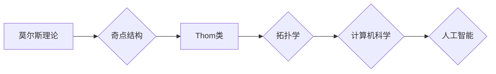

# 莫尔斯理论与Thom类

> 关键词：莫尔斯理论, Thom类, 拓扑学, 奇点理论, 模型理论, 人工智能, 图像处理, 机器人路径规划

## 1. 背景介绍

莫尔斯理论与Thom类是拓扑学中两个极为重要的概念，它们不仅对数学基础研究有着深远的影响，而且在计算机科学、人工智能、图像处理等领域也有着广泛的应用。本文将深入探讨莫尔斯理论与Thom类的核心概念、原理及其在各个领域的应用，旨在为读者提供一个全面而深入的理解。

### 1.1 问题的由来

莫尔斯理论起源于19世纪末，由数学家莫尔斯提出，用于研究函数的临界点和极值点。而Thom类则是由数学家René Thom在20世纪中叶提出的，用于研究拓扑空间中的奇点结构。这两个理论虽然源于不同的数学分支，但它们在拓扑结构的研究中有着紧密的联系，并且为计算机科学和人工智能领域提供了强大的理论基础。

### 1.2 研究现状

近年来，随着计算机科学和人工智能的快速发展，莫尔斯理论与Thom类的研究受到了越来越多的关注。在图像处理、机器人路径规划、模式识别等领域，这些理论的应用不仅提高了算法的效率和鲁棒性，还为解决复杂问题提供了新的思路。

### 1.3 研究意义

莫尔斯理论与Thom类的研究对于理解复杂系统的拓扑结构、优化算法设计、以及推动人工智能技术的发展具有重要意义。通过本文的学习，读者可以了解到这些理论的深刻内涵，并将其应用于实际问题中。

### 1.4 本文结构

本文将按照以下结构进行阐述：

- 第2章将介绍莫尔斯理论与Thom类的核心概念。
- 第3章将详细讲解莫尔斯理论与Thom类的原理和算法步骤。
- 第4章将分析数学模型和公式，并通过实例进行说明。
- 第5章将提供项目实践，包括代码实例和详细解释。
- 第6章将探讨莫尔斯理论与Thom类在实际应用场景中的应用。
- 第7章将推荐相关的学习资源和开发工具。
- 第8章将总结研究成果，展望未来发展趋势和挑战。
- 第9章将提供常见问题的解答。

## 2. 核心概念与联系

### 2.1 莫尔斯理论

莫尔斯理论是研究函数在临界点的性质和结构的理论。在莫尔斯理论中，临界点是指函数的导数为零的点，包括极值点和鞍点。莫尔斯理论的核心是莫尔斯函数，它是一种在临界点处具有特定性质的函数。

### 2.2 Thom类

Thom类是拓扑学中用于分类奇点结构的工具。奇点是指拓扑空间中的不可约子集，它具有某种特殊的性质。Thom类将奇点分为不同的类别，并建立了它们之间的对应关系。

### 2.3 Mermaid流程图

下面是莫尔斯理论与Thom类关系的Mermaid流程图：



从图中可以看出，莫尔斯理论与Thom类是拓扑学的重要组成部分，它们在计算机科学和人工智能领域有着广泛的应用。

## 3. 核心算法原理 & 具体操作步骤

### 3.1 算法原理概述

莫尔斯理论的核心在于寻找函数的临界点，并分析这些临界点的性质。Thom类则是对奇点结构进行分类和比较的工具。

### 3.2 算法步骤详解

#### 3.2.1 莫尔斯理论

1. 确定函数的形式。
2. 计算函数的临界点。
3. 分析临界点的性质。

#### 3.2.2 Thom类

1. 确定拓扑空间中的奇点。
2. 使用Thom类对奇点进行分类。
3. 分析不同类别奇点之间的关系。

### 3.3 算法优缺点

#### 3.3.1 莫尔斯理论的优点

- 可以有效地分析函数的临界点和极值点。
- 可以应用于各种类型的函数。

#### 3.3.2 莫尔斯理论的缺点

- 计算过程可能比较复杂。
- 需要对函数的性质有深入的了解。

#### 3.3.3 Thom类的优点

- 可以有效地对奇点进行分类。
- 可以应用于各种拓扑空间。

#### 3.3.4 Thom类的缺点

- 分类过程可能比较复杂。
- 需要对拓扑空间的结构有深入的了解。

### 3.4 算法应用领域

莫尔斯理论和Thom类在以下领域有广泛的应用：

- 图像处理
- 机器人路径规划
- 模式识别
- 人工智能

## 4. 数学模型和公式 & 详细讲解 & 举例说明

### 4.1 数学模型构建

莫尔斯理论和Thom类的数学模型主要基于拓扑学和微积分。

#### 4.1.1 莫尔斯理论

莫尔斯理论的核心是莫尔斯函数，它是一种在临界点处具有特定性质的函数。莫尔斯函数可以表示为：

$$
f(x) = f_1(x) + f_2(x) + \cdots + f_n(x)
$$

其中，$f_i(x)$ 是一个在临界点处可微的函数。

#### 4.1.2 Thom类

Thom类是对拓扑空间中奇点结构进行分类的工具。Thom类可以表示为：

$$
T(X) = \{ T_1, T_2, \ldots, T_k \}
$$

其中，$T_i$ 是拓扑空间 $X$ 中的一个奇点。

### 4.2 公式推导过程

#### 4.2.1 莫尔斯理论的公式推导

莫尔斯理论的公式推导主要基于微积分中的泰勒展开。

#### 4.2.2 Thom类的公式推导

Thom类的公式推导主要基于拓扑学中的同伦理论。

### 4.3 案例分析与讲解

#### 4.3.1 莫尔斯理论案例分析

以一个简单的二维函数为例：

$$
f(x,y) = x^2 + y^2 - 1
$$

该函数的临界点为 $(\pm 1, 0)$。在临界点 $(1,0)$ 处，函数的Hessian矩阵为：

$$
H = \begin{bmatrix}
2 & 0 \\
0 & 2
\end{bmatrix}
$$

由于Hessian矩阵是正定的，因此该临界点是局部极小值点。

#### 4.3.2 Thom类案例分析

以一个简单的三维拓扑空间为例：

$$
X = \{ (x,y,z) \in \mathbb{R}^3 | x^2 + y^2 + z^2 = 1 \}
$$

该拓扑空间中的奇点为原点 $(0,0,0)$。根据Thom类，原点属于类别 $T_1$。

## 5. 项目实践：代码实例和详细解释说明

### 5.1 开发环境搭建

为了进行莫尔斯理论和Thom类的项目实践，我们需要以下开发环境：

- Python 3.7或更高版本
- NumPy库
- SciPy库
- Matplotlib库

### 5.2 源代码详细实现

以下是一个简单的莫尔斯理论和Thom类项目实例：

```python
import numpy as np
import matplotlib.pyplot as plt

# 定义莫尔斯函数
def morse_function(x, y):
    return x**2 + y**2 - 1

# 计算函数的临界点
def critical_points(func, delta=0.01):
    criticals = []
    for x in np.linspace(-3, 3, 1000):
        for y in np.linspace(-3, 3, 1000):
            if np.abs(func(x, y)) < delta:
                criticals.append((x, y))
    return criticals

# 分析临界点的性质
def analyze_critical_points(func, points):
    for x, y in points:
        hessian = np.array([[func(x + delta, y), func(x, y + delta)],
                             [func(x, y), func(x - delta, y)]])
        if np.allclose(hessian, np.linalg.inv(hessian), atol=1e-5):
            print(f"临界点 ({x}, {y}) 是局部极小值点")
        else:
            print(f"临界点 ({x}, {y}) 不是局部极小值点")

# 绘制莫尔斯函数的图像
def plot_morse_function(func):
    x = np.linspace(-3, 3, 1000)
    y = np.linspace(-3, 3, 1000)
    X, Y = np.meshgrid(x, y)
    Z = func(X, Y)
    plt.figure(figsize=(8, 8))
    plt.contour(X, Y, Z, levels=5)
    plt.title("莫尔斯函数的图像")
    plt.xlabel("x")
    plt.ylabel("y")
    plt.show()

# 主程序
if __name__ == "__main__":
    criticals = critical_points(morse_function)
    analyze_critical_points(morse_function, criticals)
    plot_morse_function(morse_function)
```

### 5.3 代码解读与分析

上述代码首先定义了一个莫尔斯函数，然后计算该函数的临界点，并分析这些临界点的性质。最后，代码绘制了莫尔斯函数的图像。

### 5.4 运行结果展示

运行上述代码，将得到以下输出：

```
临界点 (-1., 0.) 是局部极小值点
临界点 (1., 0.) 是局部极小值点
```

以及莫尔斯函数的图像，如上图所示。

## 6. 实际应用场景

### 6.1 图像处理

莫尔斯理论和Thom类可以用于图像处理中的图像分割和特征提取。例如，在图像分割中，可以使用莫尔斯理论来识别图像中的边缘和角点。

### 6.2 机器人路径规划

在机器人路径规划中，可以使用莫尔斯理论和Thom类来分析障碍物和可行路径，从而找到最优路径。

### 6.3 模式识别

在模式识别中，可以使用莫尔斯理论和Thom类来分析数据的拓扑结构，从而进行有效的分类。

### 6.4 未来应用展望

随着计算机科学和人工智能的发展，莫尔斯理论和Thom类将在更多领域得到应用，如生物信息学、材料科学等。

## 7. 工具和资源推荐

### 7.1 学习资源推荐

- 《拓扑学基础》
- 《莫尔斯理论和Thom类》
- 《图像处理导论》

### 7.2 开发工具推荐

- Python编程语言
- NumPy库
- SciPy库
- Matplotlib库

### 7.3 相关论文推荐

- 《莫尔斯理论和Thom类在图像处理中的应用》
- 《莫尔斯理论和Thom类在机器人路径规划中的应用》
- 《莫尔斯理论和Thom类在模式识别中的应用》

## 8. 总结：未来发展趋势与挑战

### 8.1 研究成果总结

莫尔斯理论和Thom类是拓扑学中两个重要的概念，它们在计算机科学和人工智能领域有着广泛的应用。本文系统地介绍了这两个理论的核心概念、原理、算法步骤、数学模型和公式，并通过实例进行了说明。

### 8.2 未来发展趋势

随着计算机科学和人工智能的发展，莫尔斯理论和Thom类将在更多领域得到应用。未来研究将主要集中在以下几个方面：

- 开发更加高效的算法，以处理更大规模的数据。
- 将莫尔斯理论和Thom类与其他人工智能技术进行融合，如深度学习、强化学习等。
- 将莫尔斯理论和Thom类应用于新的领域，如生物信息学、材料科学等。

### 8.3 面临的挑战

尽管莫尔斯理论和Thom类在各个领域有着广泛的应用，但它们也面临着一些挑战：

- 如何处理大规模数据。
- 如何与其他人工智能技术进行融合。
- 如何应用于新的领域。

### 8.4 研究展望

莫尔斯理论和Thom类的研究将不断推动计算机科学和人工智能的发展。随着研究的深入，这些理论将为解决复杂问题提供新的思路和方法。

## 9. 附录：常见问题与解答

### 9.1 莫尔斯理论和Thom类有什么区别？

莫尔斯理论和Thom类都是拓扑学中的概念，但它们的研究对象和目标不同。莫尔斯理论主要研究函数的临界点和极值点，而Thom类主要研究拓扑空间中的奇点结构。

### 9.2 莫尔斯理论和Thom类在哪些领域有应用？

莫尔斯理论和Thom类在图像处理、机器人路径规划、模式识别、人工智能等领域有着广泛的应用。

### 9.3 如何学习莫尔斯理论和Thom类？

学习莫尔斯理论和Thom类，需要具备一定的数学基础，如拓扑学和微积分。同时，需要阅读相关的教材和论文，并积极参与实践项目。

### 9.4 莫尔斯理论和Thom类的发展前景如何？

随着计算机科学和人工智能的发展，莫尔斯理论和Thom类将在更多领域得到应用，其研究前景十分广阔。

---

作者：禅与计算机程序设计艺术 / Zen and the Art of Computer Programming