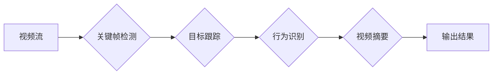

# 视频数据的关键信息捕捉详细技术

> 关键词：视频分析，关键帧检测，目标跟踪，行为识别，视频摘要，深度学习，卷积神经网络，计算机视觉

## 1. 背景介绍

随着数字技术的飞速发展，视频数据已成为信息时代最重要的数据形式之一。从社交媒体到安全监控，从远程教育到远程医疗，视频数据的应用场景日益广泛。然而，视频数据的高维性和复杂性使得对视频内容的有效分析变得极具挑战性。本文将深入探讨视频数据的关键信息捕捉技术，包括关键帧检测、目标跟踪、行为识别和视频摘要等，旨在为视频分析领域的从业者提供全面的技术指导和实践参考。

## 2. 核心概念与联系

### 2.1 核心概念

**视频分析**：指利用计算机技术和算法对视频数据进行处理、理解、分析和解释的过程。

**关键帧检测**：从视频序列中提取具有代表性的帧，用于后续的视频摘要、检索等任务。

**目标跟踪**：在视频序列中持续追踪特定目标，以理解目标的运动轨迹和状态。

**行为识别**：从视频序列中识别和分类人的行为，用于智能监控、人机交互等场景。

**视频摘要**：将长视频内容压缩成短小精悍的摘要，便于快速浏览和理解。

### 2.2 架构流程图

以下是一个简化的视频分析流程图，展示了关键帧检测、目标跟踪、行为识别和视频摘要之间的关系。



## 3. 核心算法原理 & 具体操作步骤

### 3.1 算法原理概述

视频分析的核心算法主要包括：

**关键帧检测**：通常基于运动能量、帧间差异、视觉显著性等指标进行帧级特征提取，并结合聚类或阈值分割等方法进行帧级分类。

**目标跟踪**：基于特征匹配、光流法、基于运动模型等方法进行目标检测和轨迹预测。

**行为识别**：使用深度学习模型对视频序列进行分类，如卷积神经网络（CNN）、循环神经网络（RNN）、长短期记忆网络（LSTM）等。

**视频摘要**：使用视频压缩、特征提取、排序和剪辑等技术，从视频序列中提取关键信息，生成视频摘要。

### 3.2 算法步骤详解

#### 3.2.1 关键帧检测

1. 特征提取：对视频帧进行特征提取，如颜色、纹理、形状等。
2. 帧间差异计算：计算相邻帧之间的差异，如运动能量、光流等。
3. 显著性度量：根据特征差异和时空变化，计算帧的显著性。
4. 帧级分类：将显著帧划分为关键帧和非关键帧。

#### 3.2.2 目标跟踪

1. 目标检测：使用目标检测算法（如YOLO、SSD、Faster R-CNN等）检测视频帧中的目标。
2. 特征提取：提取目标的特征，如颜色、纹理、形状等。
3. 跟踪算法：根据目标特征和运动信息，对目标进行跟踪，如卡尔曼滤波、粒子滤波等。

#### 3.2.3 行为识别

1. 视频预处理：对视频进行预处理，如裁剪、缩放等。
2. 特征提取：提取视频帧的特征，如动作、表情、姿态等。
3. 模型训练：使用深度学习模型进行训练，如CNN、RNN等。
4. 行为识别：对视频序列进行分类，识别行为类型。

#### 3.2.4 视频摘要

1. 视频压缩：对视频进行压缩，降低视频质量，减少计算量。
2. 关键帧提取：提取视频的关键帧，用于后续的摘要生成。
3. 特征提取：提取关键帧的特征，如颜色、纹理、形状等。
4. 排序和剪辑：根据特征和重要性，对关键帧进行排序和剪辑，生成视频摘要。

### 3.3 算法优缺点

#### 3.3.1 关键帧检测

**优点**：

- 简单易行，计算量小。
- 可以有效降低后续处理的数据量。

**缺点**：

- 容易漏检关键帧。
- 对噪声敏感。

#### 3.3.2 目标跟踪

**优点**：

- 可以持续追踪目标。
- 可以识别目标的运动轨迹和状态。

**缺点**：

- 容易受到遮挡、光照变化等因素影响。
- 对于运动速度快的对象，跟踪效果可能不佳。

#### 3.3.3 行为识别

**优点**：

- 可以识别多种行为类型。
- 可以应用于人机交互、安全监控等领域。

**缺点**：

- 模型训练需要大量标注数据。
- 对于复杂行为识别，模型性能可能不佳。

#### 3.3.4 视频摘要

**优点**：

- 可以快速了解视频内容。
- 可以节省存储空间。

**缺点**：

- 摘要质量受多种因素影响。
- 难以保留视频的所有细节。

### 3.4 算法应用领域

- **智能监控**：用于安全监控、交通管理、异常检测等场景。
- **人机交互**：用于手势识别、动作捕捉等场景。
- **视频检索**：用于视频检索、内容审核等场景。
- **视频摘要**：用于视频压缩、视频分享等场景。

## 4. 数学模型和公式 & 详细讲解 & 举例说明

### 4.1 数学模型构建

视频分析中的数学模型主要包括：

- **特征提取**：如颜色直方图、SIFT特征、HOG特征等。
- **目标检测**：如基于深度学习的目标检测模型，如YOLO、SSD、Faster R-CNN等。
- **目标跟踪**：如卡尔曼滤波、粒子滤波等。
- **行为识别**：如CNN、RNN、LSTM等。

### 4.2 公式推导过程

以下以卡尔曼滤波为例，简单介绍公式推导过程。

假设目标的状态向量为 $x_t$，状态转移方程为：

$$
x_t = A_t x_{t-1} + B_t u_t
$$

其中，$A_t$ 为状态转移矩阵，$B_t$ 为控制输入矩阵，$u_t$ 为控制输入向量。

假设观测向量为 $z_t$，观测方程为：

$$
z_t = H_t x_t + v_t
$$

其中，$H_t$ 为观测矩阵，$v_t$ 为观测噪声。

卡尔曼滤波的目标是最小化预测误差和观测误差，即：

$$
\min_{x_t} \frac{1}{2} (x_t - \hat{x}_t)^T P_t^{-1} (x_t - \hat{x}_t) + \frac{1}{2} (z_t - \hat{z}_t)^T Q_t^{-1} (z_t - \hat{z}_t)
$$

其中，$\hat{x}_t$ 为预测状态，$P_t$ 为状态协方差矩阵，$\hat{z}_t$ 为预测观测值，$Q_t$ 为观测噪声协方差矩阵。

### 4.3 案例分析与讲解

以基于深度学习的目标检测模型YOLO为例，讲解其工作原理。

YOLO将图像分割成多个网格，每个网格负责预测图像中物体的类别和位置。模型输入为图像，输出为每个网格的预测结果，包括物体的类别和位置。

具体步骤如下：

1. 图像预处理：将图像缩放到特定尺寸。
2. 网格划分：将图像划分为多个网格。
3. 网格预测：每个网格预测物体的类别和位置。
4. 非极大值抑制：去除重叠的预测框。
5. 输出结果：输出最终的预测结果。

## 5. 项目实践：代码实例和详细解释说明

### 5.1 开发环境搭建

1. 安装深度学习框架，如TensorFlow、PyTorch等。
2. 安装预训练模型，如YOLOv5、Faster R-CNN等。
3. 安装相关库，如OpenCV、PIL等。

### 5.2 源代码详细实现

以下是一个简单的YOLOv5目标检测示例代码：

```python
import cv2
import torch
from PIL import Image
import numpy as np

# 加载预训练模型
model = torch.load('yolov5s.pt', map_location=torch.device('cpu'))

# 加载图像
image_path = 'image.jpg'
image = Image.open(image_path)
image = image.resize((640, 640))

# 转换图像格式
image = np.array(image)
image = torch.from_numpy(image).float()
image /= 255.0

# 增加批次维度
image = image.unsqueeze(0)

# 模型预测
with torch.no_grad():
    pred = model(image)

# 非极大值抑制
det = pred[0]

# 解析检测结果
boxes = det['boxes']
labels = det['labels']
scores = det['scores']

# 显示检测结果
for i, box in enumerate(boxes):
    label = labels[i]
    score = scores[i]
    cv2.rectangle(image, (int(box[0]), int(box[1])), (int(box[2]), int(box[3])), (0, 255, 0), 2)
    cv2.putText(image, str(label.item()), (int(box[0]), int(box[1])), cv2.FONT_HERSHEY_SIMPLEX, 0.5, (0, 255, 0), 1)

cv2.imshow('image', image)
cv2.waitKey(0)
cv2.destroyAllWindows()
```

### 5.3 代码解读与分析

该代码展示了如何使用YOLOv5模型进行图像目标检测。首先，加载预训练模型和图像。然后，将图像转换为模型输入格式，并添加批次维度。接着，进行模型预测，并使用非极大值抑制去除重叠的预测框。最后，解析检测结果并显示图像。

### 5.4 运行结果展示

运行上述代码，即可在图像上显示目标检测结果。

## 6. 实际应用场景

### 6.1 智能监控

在智能监控场景中，视频分析技术可以用于：

- 目标检测：识别和跟踪监控区域内的目标。
- 行为识别：识别异常行为，如斗殴、闯入等。
- 车牌识别：识别和记录车辆信息。

### 6.2 人机交互

在人机交互场景中，视频分析技术可以用于：

- 手势识别：识别和控制机器人或虚拟现实设备。
- 面部识别：实现门禁、支付等场景。

### 6.3 视频检索

在视频检索场景中，视频分析技术可以用于：

- 视频分类：将视频分类到不同的类别。
- 视频聚类：将相似的视频聚类在一起。

### 6.4 视频摘要

在视频摘要场景中，视频分析技术可以用于：

- 视频压缩：降低视频质量，减少存储空间。
- 视频剪辑：从视频中提取关键帧，生成视频摘要。

## 7. 工具和资源推荐

### 7.1 学习资源推荐

- 《计算机视觉：算法与应用》
- 《深度学习》
- 《计算机视觉基础》

### 7.2 开发工具推荐

- OpenCV：开源计算机视觉库
- TensorFlow：开源深度学习框架
- PyTorch：开源深度学习框架

### 7.3 相关论文推荐

- YOLOv5: You Only Look Once v5
- Faster R-CNN: Faster R-CNN: towards real-time object detection with region proposal networks
- SSD: Single Shot MultiBox Detector

## 8. 总结：未来发展趋势与挑战

### 8.1 研究成果总结

本文深入探讨了视频数据的关键信息捕捉技术，包括关键帧检测、目标跟踪、行为识别和视频摘要等。通过介绍核心概念、算法原理、具体操作步骤和实际应用场景，为视频分析领域的从业者提供了全面的技术指导和实践参考。

### 8.2 未来发展趋势

随着深度学习技术的不断发展，视频分析技术将呈现以下发展趋势：

- 模型轻量化：开发更轻量级的模型，降低计算资源消耗。
- 增强现实：将视频分析技术应用于增强现实场景。
- 跨模态融合：将视频分析与其他模态数据（如音频、文本等）进行融合，实现更全面的视频理解。
- 个性化推荐：根据用户喜好和兴趣，推荐个性化的视频内容。

### 8.3 面临的挑战

视频分析技术在实际应用中仍面临以下挑战：

- 数据标注：需要大量的标注数据来训练模型。
- 模型泛化能力：模型在真实场景下的泛化能力有限。
- 隐私保护：在处理视频数据时，需要保护用户的隐私。

### 8.4 研究展望

未来，视频分析技术将在以下方面取得突破：

- 开发更有效的算法，提高模型的性能和效率。
- 利用迁移学习等技术，降低数据标注成本。
- 探索新的应用场景，拓展视频分析技术的应用范围。

相信随着技术的不断发展，视频分析技术将在未来发挥越来越重要的作用，为人类社会带来更多福祉。

## 9. 附录：常见问题与解答

**Q1：如何提高视频分析算法的实时性？**

A：提高视频分析算法的实时性可以从以下几个方面入手：

- 使用轻量级模型，降低计算复杂度。
- 使用GPU、FPGA等高性能硬件加速计算。
- 使用多线程、并行计算等技术提高计算效率。
- 采用流式处理技术，实时处理视频数据。

**Q2：如何处理视频数据中的遮挡问题？**

A：处理视频数据中的遮挡问题可以从以下几个方面入手：

- 使用数据增强技术，如遮挡、旋转等，增加模型鲁棒性。
- 使用检测算法，如YOLO、SSD等，提高模型在遮挡场景下的检测能力。
- 使用跟踪算法，如卡尔曼滤波、粒子滤波等，跟踪遮挡后的目标。

**Q3：如何保护视频数据的隐私？**

A：保护视频数据的隐私可以从以下几个方面入手：

- 数据脱敏：对视频数据中的敏感信息进行脱敏处理。
- 加密：对视频数据进行加密，防止数据泄露。
- 隐私保护算法：使用隐私保护算法，如差分隐私、同态加密等，在保留数据价值的同时保护用户隐私。

**Q4：如何评估视频分析算法的性能？**

A：评估视频分析算法的性能可以从以下几个方面入手：

- 准确率：衡量模型预测结果的正确性。
- 召回率：衡量模型能够识别出所有真实目标的能力。
- F1分数：综合考虑准确率和召回率，衡量模型的综合性能。

**Q5：如何将视频分析技术应用于实际场景？**

A：将视频分析技术应用于实际场景可以从以下几个方面入手：

- 了解实际场景的需求和目标。
- 选择合适的算法和模型。
- 进行实验和评估，优化模型性能。
- 将模型部署到实际场景中，进行测试和迭代。

作者：禅与计算机程序设计艺术 / Zen and the Art of Computer Programming