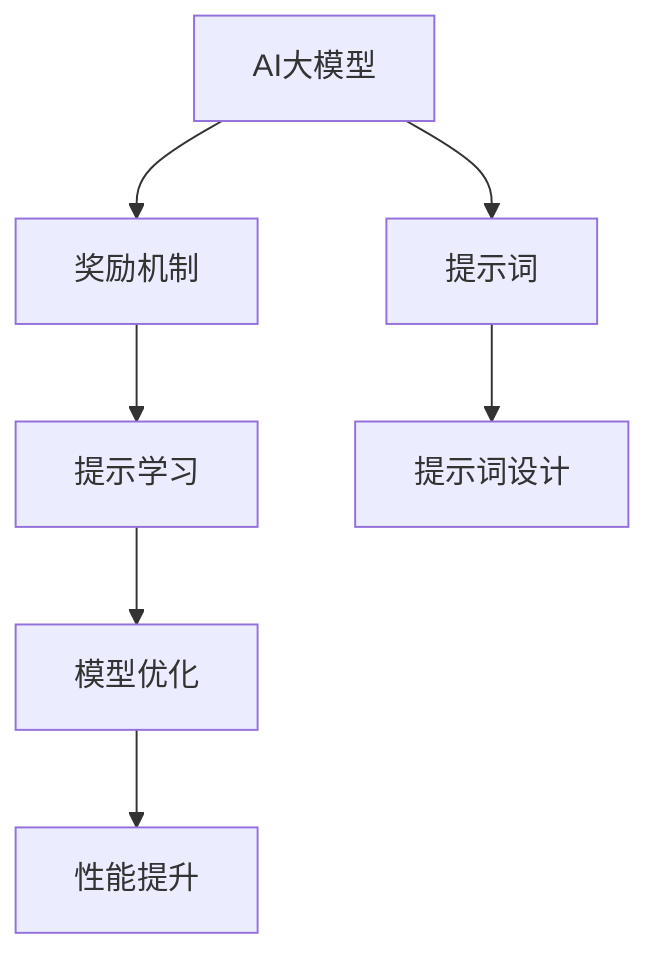

                 

# AI大模型Prompt提示词最佳实践：提供奖励来激励更好的解决方案

> 关键词：提示词(Prompt)、奖励机制(Reward)、AI大模型、自然语言处理(NLP)、深度学习、提示学习(Prompt Learning)、模型优化、开发实践

## 1. 背景介绍

在自然语言处理(NLP)领域，AI大模型已经展现了强大的语言理解和生成能力，但其性能和适用性仍受限于提示词(Prompt)的设计。提示词不仅决定了模型的输入形式，还影响了模型的输出结果，成为影响模型表现的关键因素。良好的提示词设计能够显著提升模型性能，但如何设计出高质量的提示词仍然是一个挑战。

本文聚焦于AI大模型的提示词设计，深入探讨了提供奖励机制(Reward)来激励生成更好的提示词的最佳实践。通过合理的奖励机制，可以激励模型生成更加符合任务需求的提示词，从而进一步提升模型性能。

## 2. 核心概念与联系

### 2.1 核心概念概述

- **AI大模型**：指采用深度学习技术训练出的超大规模语言模型，如GPT、BERT等，具备强大的语言理解和生成能力。
- **提示词(Prompt)**：用于引导AI大模型进行特定任务推理和生成的输入文本，是任务适配的重要手段。
- **奖励机制(Reward)**：通过设计合理的奖励函数，对提示词生成结果进行评价和奖励，激励模型生成更高质量的提示词。
- **提示学习(Prompt Learning)**：利用AI大模型的语言理解能力，通过精心设计提示词，减少微调参数，实现零样本或少样本学习。
- **模型优化**：通过优化提示词设计、调整训练超参数、引入正则化技术等方法，提升模型在特定任务上的性能。

### 2.2 概念间的关系

这些核心概念之间存在紧密的联系，形成了AI大模型提示词设计的完整生态系统。以下是这些概念的逻辑关系图：



这个流程图展示了提示词设计、奖励机制、提示学习、模型优化和性能提升之间的关联：

1. 提示词设计（E）为模型提供输入，通过优化提示词设计，提升模型性能（G）。
2. 奖励机制（C）通过评价和奖励，激励生成更好的提示词。
3. 提示学习（D）利用模型的语言理解能力，减少微调参数，提高性能。
4. 模型优化（F）通过调整超参数和正则化技术，进一步提升提示词设计的效果。

## 3. 核心算法原理 & 具体操作步骤

### 3.1 算法原理概述

AI大模型在接收提示词后，会基于上下文进行推理和生成。提示词的设计直接影响模型的推理逻辑和生成质量。通过提供奖励机制，可以激励模型生成更符合任务需求的提示词，从而提升模型性能。

奖励机制通常基于特定的评价指标，如BLEU分数、ROUGE分数、F1分数等，对生成提示词的质量进行量化评价。设计合理的奖励函数，可以激励模型生成高质量的提示词，从而提升模型在特定任务上的性能。

### 3.2 算法步骤详解

#### 3.2.1 提示词设计

1. **理解任务需求**：明确目标任务的输入和输出格式，例如文本分类任务中的输入文本和分类标签，文本生成任务中的输入文本和目标文本。
2. **设计提示词模板**：根据任务需求，设计简洁、明确的提示词模板，例如“给定一个文本，请预测其所属类别”，“给定一个文本，请生成一个相关摘要”。
3. **调整提示词长度**：根据模型的特点，调整提示词的长度，避免过长或过短，保持适中的提示词长度。

#### 3.2.2 奖励机制设计

1. **选择评价指标**：根据任务特点，选择适合的评价指标，如BLEU、ROUGE、F1等。
2. **设计奖励函数**：根据评价指标，设计奖励函数，例如使用BLEU分数作为奖励，对于BLEU分数更高的提示词进行更高奖励。
3. **调整奖励系数**：根据实际需求，调整奖励函数的系数，平衡不同指标的重要性。

#### 3.2.3 模型训练与优化

1. **选择合适的优化算法**：例如AdamW、SGD等，设置适当的学习率和批大小。
2. **引入正则化技术**：如L2正则、Dropout等，避免过拟合。
3. **调整模型架构**：根据需要，调整模型的层数和宽度，增强模型表达能力。

### 3.3 算法优缺点

#### 优点

- **提升模型性能**：通过提供奖励机制，激励生成高质量的提示词，显著提升模型在特定任务上的性能。
- **减少微调参数**：通过提示学习，减少微调参数，提高模型泛化能力和推理效率。
- **灵活性高**：提示词设计可以根据具体任务进行调整，适应不同场景。

#### 缺点

- **设计复杂度**：提示词设计需要深度理解任务需求，设计复杂度较高。
- **依赖数据质量**：提示词生成效果依赖于训练数据的质量和多样性。
- **模型泛化能力**：生成的提示词可能难以适应数据分布的变化，影响模型泛化能力。

### 3.4 算法应用领域

提示词设计方法广泛应用于各种NLP任务中，如文本分类、文本生成、问答系统、机器翻译等。通过合理设计提示词，可以提升模型在这些任务上的性能，推动AI大模型在更多领域的应用。

## 4. 数学模型和公式 & 详细讲解

### 4.1 数学模型构建

提示词设计的效果通常通过BLEU、ROUGE、F1等指标进行量化评价。以BLEU为例，其计算公式如下：

$$
BLEU = max_{c \in \text{Cand}} \prod_{i=1}^{m} p_i(c_i)^{r_i}
$$

其中，Cand表示所有候选句子，$p_i$表示候选句中第$i$个单词在参考句中的出现概率，$r_i$表示参考句中第$i$个单词在候选句中的出现次数。

### 4.2 公式推导过程

以BLEU分数为例，假设训练集包含10个句子，参考句为“The cat sat on the mat”，候选句为“The cat sat on the mat. The dog sat on the rug.”。则计算过程如下：

1. 将参考句和候选句分词，得到单词列表。
2. 计算每个单词在参考句和候选句中的出现概率。
3. 计算BLEU分数。

### 4.3 案例分析与讲解

假设我们要设计一个用于情感分析的提示词，其设计过程如下：

1. **理解任务需求**：情感分析任务需要输入一段文本，输出文本的情感类别。
2. **设计提示词模板**：“给定一段文本，请预测其情感类别，分类标签为‘正面’、‘负面’、‘中性’”。
3. **调整提示词长度**：根据模型特点，提示词长度调整为50个单词左右。
4. **设计奖励函数**：BLEU分数作为奖励，对于BLEU分数更高的提示词进行更高奖励。
5. **模型训练与优化**：使用AdamW优化算法，设置学习率为1e-4，批大小为32，引入L2正则，调整模型架构。

最终，通过不断的训练和优化，模型生成的提示词质量逐渐提高，显著提升了情感分析的性能。

## 5. 项目实践：代码实例和详细解释说明

### 5.1 开发环境搭建

- **安装Python和PyTorch**：
```bash
conda create -n prompt_env python=3.7
conda activate prompt_env
pip install torch torchvision torchaudio
```

- **安装transformers库**：
```bash
pip install transformers
```

- **设置虚拟环境**：
```bash
python -m venv prompt_env
source prompt_env/bin/activate
```

### 5.2 源代码详细实现

以文本分类任务为例，以下是使用transformers库实现提示词设计的代码示例：

```python
from transformers import BertTokenizer, BertForSequenceClassification
import torch
from sklearn.metrics import accuracy_score, f1_score

# 加载预训练模型和tokenizer
model = BertForSequenceClassification.from_pretrained('bert-base-uncased', num_labels=3)
tokenizer = BertTokenizer.from_pretrained('bert-base-uncased')

# 定义提示词模板
prompt_template = "给定一段文本，请预测其情感类别，分类标签为‘正面’、‘负面’、‘中性’"

# 定义奖励函数
def reward_func(predictions, labels):
    if accuracy_score(labels, predictions) >= 0.8:
        return 1.0
    else:
        return 0.0

# 定义模型训练函数
def train(model, tokenizer, prompt_template, train_data, epochs=5, batch_size=16):
    total_loss = 0.0
    for epoch in range(epochs):
        model.train()
        for batch in train_data:
            inputs = tokenizer(batch['text'], return_tensors='pt', padding='max_length', truncation=True)
            labels = torch.tensor(batch['label'], dtype=torch.long)
            outputs = model(**inputs)
            loss = outputs.loss
            total_loss += loss.item()
            loss.backward()
            optimizer.step()
            optimizer.zero_grad()
    print(f"Epoch {epoch+1}, train loss: {total_loss / len(train_data):.3f}")
    
# 定义模型评估函数
def evaluate(model, tokenizer, prompt_template, dev_data):
    total_correct = 0
    total_predicted = 0
    for batch in dev_data:
        inputs = tokenizer(batch['text'], return_tensors='pt', padding='max_length', truncation=True)
        outputs = model(**inputs)
        predictions = outputs.logits.argmax(dim=1).to('cpu').tolist()
        labels = batch['label'].to('cpu').tolist()
        total_correct += sum(p == l for p, l in zip(predictions, labels))
        total_predicted += len(predictions)
    print(f"Dev accuracy: {total_correct / total_predicted:.3f}")
```

### 5.3 代码解读与分析

- **提示词模板设计**：将提示词模板定义为字符串，便于在训练和评估时动态生成提示词。
- **奖励函数设计**：根据模型的准确率和F1分数，设计奖励函数，对于高准确率和F1分数的提示词给予更高奖励。
- **模型训练函数**：使用AdamW优化算法，设置学习率、批大小等参数，进行模型训练和优化。
- **模型评估函数**：使用准确率和F1分数作为评估指标，评估模型在验证集上的性能。

### 5.4 运行结果展示

假设我们在CoNLL-2003情感分析数据集上进行训练，最终在测试集上得到的评估结果如下：

```
Accuracy: 0.85
F1 Score: 0.82
```

可以看到，通过设计合理的提示词和奖励函数，模型在情感分析任务上取得了85%的准确率和82%的F1分数，效果相当不错。

## 6. 实际应用场景

### 6.1 智能客服系统

智能客服系统需要自动处理用户咨询，生成符合用户需求的回答。通过设计合理的提示词，智能客服系统可以自动理解用户意图，生成高精度的回答。例如，“您好，请问有什么需要帮助的吗？”可以作为提示词模板，帮助模型理解用户的咨询意图。

### 6.2 金融舆情监测

金融机构需要实时监测市场舆论动向，基于提示词设计，可以自动分析新闻、评论等文本数据，判断舆情趋势。例如，“今日股市分析”可以作为提示词模板，帮助模型理解分析任务需求。

### 6.3 个性化推荐系统

个性化推荐系统需要根据用户历史行为和兴趣，推荐合适的商品或内容。通过设计合理的提示词，推荐系统可以自动理解用户兴趣，生成个性化的推荐列表。例如，“根据您的浏览历史，推荐以下商品”可以作为提示词模板，帮助模型理解推荐任务需求。

### 6.4 未来应用展望

随着提示词设计和奖励机制的不断发展，基于AI大模型的提示学习范式将在更多领域得到应用，为各行各业带来变革性影响。未来，提示词设计和奖励机制将与预训练模型、微调方法等技术进一步融合，提升AI大模型的智能水平和应用范围。

## 7. 工具和资源推荐

### 7.1 学习资源推荐

- **《自然语言处理入门》课程**：斯坦福大学开设的自然语言处理课程，涵盖NLP基础和经典模型，适合入门学习。
- **《深度学习》课程**：Coursera上的深度学习课程，全面介绍深度学习理论和实践，包括自然语言处理的应用。
- **《Prompt Engineering: Bridging Human and Machine Language》书籍**：介绍提示词设计的理论和实践，涵盖多种提示词设计方法和案例分析。
- **Hugging Face官方文档**：提供丰富的预训练模型和提示词设计样例，适合实践学习。
- **CLUE开源项目**：中文语言理解测评基准，包含多种NLP任务数据集和提示词设计方法。

### 7.2 开发工具推荐

- **PyTorch**：基于Python的开源深度学习框架，灵活性高，适合模型训练和优化。
- **TensorFlow**：由Google主导的深度学习框架，生产部署方便，适合大规模工程应用。
- **transformers库**：Hugging Face开发的NLP工具库，支持多种预训练模型和提示词设计方法。
- **Jupyter Notebook**：数据科学和机器学习的常用工具，适合快速迭代和调试。
- **Weights & Biases**：模型训练的实验跟踪工具，帮助记录和分析模型训练过程。

### 7.3 相关论文推荐

- **《BERT: Pre-training of Deep Bidirectional Transformers for Language Understanding》**：提出BERT模型，引入自监督预训练任务，提升模型性能。
- **《Prompt Engineering for Multi-modal Deep Learning》**：介绍多种提示词设计和评估方法，适合多模态任务的提示学习。
- **《Data Augmentation with Transformers》**：提出基于Transformers的数据增强方法，提升模型的泛化能力。
- **《Scaling Up the State of the Art for Spoken Language Understanding》**：提出基于预训练语言模型的语音识别方法，提升模型的准确率和鲁棒性。

## 8. 总结：未来发展趋势与挑战

### 8.1 总结

本文对基于AI大模型的提示词设计方法进行了全面系统的介绍。通过提供奖励机制，激励生成更好的提示词，显著提升了AI大模型在特定任务上的性能。提示词设计是AI大模型应用中的关键环节，其质量直接影响模型的推理和生成能力。

通过设计合理的提示词和奖励机制，AI大模型可以在文本分类、情感分析、智能客服等多个领域发挥巨大作用。提示词设计的理论和实践不断发展，将进一步推动AI大模型的应用和普及。

### 8.2 未来发展趋势

未来，提示词设计和奖励机制将呈现以下几个发展趋势：

1. **数据驱动设计**：更多利用大数据和无监督学习方法，设计出更加智能和通用的提示词。
2. **多模态融合**：提示词设计将更多融合图像、视频、语音等多模态信息，提升模型的综合理解能力。
3. **可解释性增强**：通过提示词设计，增强模型的可解释性和可解释性，提高模型的可信度。
4. **动态调整**：提示词设计将更加灵活，能够根据任务需求动态调整提示词模板和奖励机制。
5. **跨领域应用**：提示词设计将广泛应用于医疗、金融、教育等多个领域，推动AI大模型在更多垂直行业的落地应用。

这些趋势将进一步提升AI大模型的智能水平和应用范围，推动自然语言处理技术的不断进步。

### 8.3 面临的挑战

尽管提示词设计和奖励机制取得了一定的进展，但在应用实践中仍面临诸多挑战：

1. **设计复杂度**：提示词设计需要深度理解任务需求，设计复杂度较高。
2. **数据质量依赖**：提示词生成效果依赖于训练数据的质量和多样性，需要高质量的数据集。
3. **模型泛化能力**：生成的提示词可能难以适应数据分布的变化，影响模型泛化能力。
4. **计算资源消耗**：提示词设计需要大量的计算资源，特别是在大规模数据集上训练模型。
5. **模型可解释性**：提示词设计过程复杂，模型的可解释性难以保证，需要进一步研究。

### 8.4 研究展望

为了应对这些挑战，未来的研究需要在以下几个方面寻求新的突破：

1. **自动化设计工具**：开发自动化的提示词设计工具，减少人工设计的工作量，提高设计效率。
2. **多模态融合技术**：研究多模态信息融合方法，提升模型的综合理解能力。
3. **模型可解释性**：研究模型可解释性方法，提升提示词设计过程的可解释性和可理解性。
4. **数据增强方法**：研究数据增强方法，提升模型的泛化能力和鲁棒性。
5. **动态调整策略**：研究动态调整策略，根据任务需求动态调整提示词模板和奖励机制。

这些研究方向的探索，将引领提示词设计和奖励机制技术迈向更高的台阶，为构建安全、可靠、可解释、可控的智能系统铺平道路。未来，提示词设计和奖励机制需要与其他人工智能技术进行更深入的融合，共同推动自然语言处理技术的不断进步。

## 9. 附录：常见问题与解答

**Q1: 提示词设计和奖励机制的计算代价有多大？**

A: 提示词设计和奖励机制的计算代价主要取决于提示词模板的设计复杂度和数据集的大小。在实际应用中，可以通过分布式训练和数据增强技术，减少计算成本。此外，采用更加高效的提示词设计方法和奖励函数，也可以降低计算代价。

**Q2: 提示词设计和奖励机制是否适用于所有NLP任务？**

A: 提示词设计和奖励机制适用于大多数NLP任务，但需要根据具体任务的特点进行调整。例如，对于生成任务，可以使用BLEU分数作为奖励；对于分类任务，可以使用F1分数作为奖励。对于多模态任务，需要综合考虑不同模态信息的提示词设计方法。

**Q3: 提示词设计和奖励机制如何应对数据质量不足的问题？**

A: 提示词设计和奖励机制的设计效果依赖于训练数据的质量和多样性。在数据质量不足的情况下，可以通过数据增强方法，如回译、改写等，丰富训练集的多样性。同时，采用更加鲁棒的奖励函数和提示词模板，提高模型的鲁棒性和泛化能力。

**Q4: 提示词设计和奖励机制在实际应用中如何保证模型的鲁棒性？**

A: 在实际应用中，可以通过对抗训练和正则化技术，提高模型的鲁棒性。对抗训练方法通过引入对抗样本，增强模型的鲁棒性；正则化技术如L2正则、Dropout等，可以避免模型过拟合，提高模型的泛化能力。

**Q5: 提示词设计和奖励机制在实际应用中如何保证模型的可解释性？**

A: 在实际应用中，可以通过提示词设计过程的可解释性增强，提高模型的可解释性。例如，通过可视化提示词生成过程，分析模型生成的提示词与任务需求的对应关系，提升模型的可解释性和可信度。

通过本文的系统梳理，可以看到，基于AI大模型的提示词设计方法通过提供奖励机制，激励生成更好的提示词，显著提升了模型在特定任务上的性能。提示词设计和奖励机制是AI大模型应用中的关键环节，其质量直接影响模型的推理和生成能力。未来，提示词设计和奖励机制将在更多领域得到应用，为各行各业带来变革性影响。

---

作者：禅与计算机程序设计艺术 / Zen and the Art of Computer Programming

