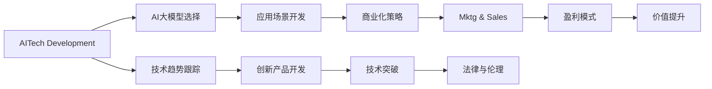

                 

# AI大模型创业：如何应对未来行业发展趋势？

> 关键词：AI大模型、创业策略、行业发展、技术趋势、应用落地、商业价值、未来展望

## 1. 背景介绍

### 1.1 问题由来

随着人工智能(AI)技术的迅猛发展，大模型（Large Model）以其在自然语言处理(NLP)、计算机视觉(CV)、语音识别(SR)等领域的卓越表现，迅速成为推动AI创新的关键力量。大模型基于大规模数据和复杂算法，能够自主学习并解决复杂问题，其能力之强大，已使得许多行业机构和企业产生了强烈的创业热情。然而，随着行业的迅猛发展，未来将面临诸多新的挑战与机遇。如何精准把握趋势，制定科学的创业策略，是当下每一位AI创业者需要深思的问题。

### 1.2 问题核心关键点

面对未来，AI大模型的创业不仅是一个技术问题，更是一个多方面的战略选择。其主要包括以下几个关键点：

1. **技术选型与创新**：如何选择最合适的AI大模型技术框架，以及如何在已有的技术上实现差异化创新。
2. **应用场景落地**：如何将AI大模型应用到实际业务中，提升工作效率与业务价值。
3. **商业化策略**：如何平衡技术优势与市场化需求，最大化商业收益。
4. **市场竞争**：如何在众多竞争者中脱颖而出，获取核心竞争优势。
5. **法律与伦理**：如何保证模型的伦理使用，避免潜在的法律风险。

### 1.3 问题研究意义

在技术日益成熟的当下，AI大模型的创业已成为行业发展的必然趋势。精准把握未来趋势，制定科学的创业策略，将有助于企业快速占领市场，保持竞争优势。其具体意义如下：

1. **降低成本**：通过精确的技术选型和创新，减少研发投入，提升生产效率。
2. **提升竞争力**：通过精准的市场定位和应用落地，提高企业在市场中的竞争力。
3. **拓展业务**：通过技术应用，开拓新的业务领域，提升整体收入。
4. **增强用户体验**：通过创新应用，提升用户体验，提升品牌形象。
5. **规避风险**：通过合理合规的使用，规避潜在的法律风险，确保企业长期稳定发展。

## 2. 核心概念与联系

### 2.1 核心概念概述

在探讨AI大模型的创业策略时，首先需要明确一些核心概念：

1. **AI大模型**：指基于大规模数据训练出的高性能机器学习模型，如BERT、GPT等。其具备强大的学习和预测能力，能够在多个领域实现卓越的性能。
2. **创业策略**：指企业为了实现特定商业目标所采取的行动计划和决策。在AI大模型的创业中，包括技术选型、市场定位、产品设计、营销推广、商业模式等多方面策略。
3. **行业发展趋势**：指在AI大模型技术应用中，未来的主要发展方向和趋势。包括技术突破、应用场景扩展、市场变化等。
4. **商业价值**：指AI大模型在实际应用中所带来的经济和社会价值。
5. **技术趋势**：指AI大模型领域内最新的技术动态和发展方向，如模型的规模、算法优化、硬件加速等。

这些概念之间的联系通过以下Mermaid流程图进行展示：



此流程图展示了AI大模型创业过程中的各个关键环节，以及它们之间的相互关系。

### 2.2 概念间的关系

各核心概念之间的关系可以通过以下进一步的详细说明：

1. **AI大模型选择**：根据企业业务需求，选择合适的AI大模型，并对其进行深度定制化优化。
2. **应用场景开发**：将AI大模型应用到实际业务中，解决具体的行业问题，提升业务效率。
3. **商业化策略**：制定合理的商业化策略，实现技术到产品的转化，最大化商业收益。
4. **市场推广**：通过有效的市场推广，提升产品知名度，吸引更多用户。
5. **盈利模式**：构建适合市场的盈利模式，实现企业的可持续发展。
6. **技术趋势跟踪**：持续关注最新的AI大模型技术动态，保持技术领先。
7. **创新产品开发**：不断研发新产品，提升产品竞争力。
8. **技术突破**：通过技术创新，推动AI大模型的能力边界。
9. **法律与伦理**：在开发过程中遵守相关法律和伦理规范，确保模型使用的合规性。
10. **价值提升**：通过AI大模型的应用，提升企业业务价值和社会效益。

## 3. 核心算法原理 & 具体操作步骤

### 3.1 算法原理概述

AI大模型的创业过程中，算法原理和操作步骤是其成功的基石。以下是核心算法原理的概述：

1. **数据收集与预处理**：收集大规模、高质量的行业数据，并进行预处理，如清洗、标注等。
2. **模型训练与优化**：利用先进的算法框架和技术，对AI大模型进行训练和优化，以提升其性能和准确性。
3. **模型部署与应用**：将训练好的模型部署到生产环境，并通过API接口等形式提供服务。
4. **数据分析与反馈**：收集模型的应用数据，进行统计分析，并根据反馈不断优化模型。

### 3.2 算法步骤详解

以下是详细的算法步骤：

1. **数据收集与预处理**：
   - 确定数据来源，包括公共数据集、行业数据、公司内部数据等。
   - 清洗数据，去除噪声和不完整信息。
   - 标注数据，进行手动或自动标注。

2. **模型训练与优化**：
   - 选择合适的AI大模型，如BERT、GPT等。
   - 设定合适的训练参数，如学习率、批大小等。
   - 训练模型，并在验证集上不断优化。
   - 采用正则化技术，如L2正则、Dropout等，防止过拟合。
   - 使用对抗训练，提升模型的鲁棒性。

3. **模型部署与应用**：
   - 将训练好的模型导出，并进行压缩和优化。
   - 开发API接口，方便用户调用。
   - 部署到云平台或本地服务器，确保高性能和高可用性。
   - 监控模型性能，确保其在实际应用中的稳定性。

4. **数据分析与反馈**：
   - 收集模型应用数据，并进行统计分析。
   - 根据分析结果，优化模型参数。
   - 通过用户反馈，不断改进产品和服务。

### 3.3 算法优缺点

**优点**：

1. **高性能**：AI大模型能够处理大规模数据，并具备强大的学习能力和预测能力。
2. **灵活性**：模型可以根据需求进行深度定制，满足特定业务需求。
3. **自动化**：通过算法优化和自动化，提升模型训练效率，减少人工干预。

**缺点**：

1. **高成本**：训练和优化大模型需要大量计算资源和时间。
2. **数据依赖**：模型的性能高度依赖于数据质量和数量。
3. **隐私风险**：处理大量数据时，隐私保护是一个重要问题。
4. **技术门槛高**：需要专业知识和技术积累。

### 3.4 算法应用领域

AI大模型的应用领域广泛，主要包括以下几个方面：

1. **自然语言处理(NLP)**：如文本分类、情感分析、机器翻译等。
2. **计算机视觉(CV)**：如图像识别、目标检测、图像分割等。
3. **语音识别(SR)**：如语音转文本、说话人识别、语音合成等。
4. **推荐系统**：如电商推荐、音乐推荐、新闻推荐等。
5. **医疗健康**：如疾病诊断、医学影像分析、健康管理等。
6. **金融风控**：如信用评估、欺诈检测、风险预测等。

## 4. 数学模型和公式 & 详细讲解 & 举例说明

### 4.1 数学模型构建

在本节中，我们将构建一个简单的数学模型来描述AI大模型的训练过程。

假设我们的目标是对一个二分类任务进行模型训练，数据集为 $(x_i, y_i)$，其中 $x_i$ 为输入特征，$y_i$ 为标签。我们使用的AI大模型为 $f(x; \theta)$，其中 $\theta$ 为模型参数。模型的损失函数为 $L(f(x; \theta), y_i)$，在数据集上的平均损失函数为 $L(\theta)$。

数学模型的构建如下：

$$
L(\theta) = \frac{1}{N} \sum_{i=1}^N L(f(x_i; \theta), y_i)
$$

### 4.2 公式推导过程

以下是损失函数的具体推导过程：

1. 对于二分类任务，我们常用的损失函数是交叉熵损失函数：
   $$
   L(f(x; \theta), y_i) = -y_i\log(f(x; \theta)) - (1 - y_i)\log(1 - f(x; \theta))
   $$

2. 将损失函数带入平均损失函数公式中：
   $$
   L(\theta) = -\frac{1}{N} \sum_{i=1}^N \left[y_i\log(f(x_i; \theta)) + (1 - y_i)\log(1 - f(x_i; \theta))\right]
   $$

3. 对损失函数求导，得到梯度：
   $$
   \frac{\partial L(\theta)}{\partial \theta} = -\frac{1}{N} \sum_{i=1}^N \left[\frac{y_i}{f(x_i; \theta)} - \frac{1 - y_i}{1 - f(x_i; \theta)}\right] \frac{\partial f(x; \theta)}{\partial \theta}
   $$

4. 利用自动微分技术计算 $\frac{\partial f(x; \theta)}{\partial \theta}$，并使用梯度下降算法更新模型参数 $\theta$。

### 4.3 案例分析与讲解

假设我们有一个二分类任务，数据集包含样本 $(x_1, y_1), (x_2, y_2), ..., (x_N, y_N)$，其中 $y_i$ 为二分类标签，$x_i$ 为输入特征。我们使用的是一个简单的神经网络模型，其参数为 $\theta$。

1. **数据准备**：
   - 收集数据集，进行预处理和标注。
   - 将数据集划分为训练集和验证集。

2. **模型构建**：
   - 选择一个合适的神经网络结构，如全连接神经网络。
   - 定义损失函数为交叉熵损失。
   - 设定合适的学习率。

3. **模型训练**：
   - 在训练集上训练模型，不断更新模型参数 $\theta$。
   - 在验证集上评估模型性能，防止过拟合。

4. **模型应用**：
   - 在测试集上评估模型性能，判断模型泛化能力。
   - 将模型应用到实际业务中，如电商平台商品推荐。

## 5. 项目实践：代码实例和详细解释说明

### 5.1 开发环境搭建

在进行AI大模型的创业实践前，我们需要准备好开发环境。以下是使用Python进行PyTorch开发的环境配置流程：

1. 安装Anaconda：从官网下载并安装Anaconda，用于创建独立的Python环境。
2. 创建并激活虚拟环境：
```bash
conda create -n pytorch-env python=3.8 
conda activate pytorch-env
```

3. 安装PyTorch：根据CUDA版本，从官网获取对应的安装命令。例如：
```bash
conda install pytorch torchvision torchaudio cudatoolkit=11.1 -c pytorch -c conda-forge
```

4. 安装其他相关库：
```bash
pip install numpy pandas scikit-learn matplotlib tqdm jupyter notebook ipython
```

完成上述步骤后，即可在`pytorch-env`环境中开始AI大模型的创业实践。

### 5.2 源代码详细实现

这里我们以构建一个简单的文本分类模型为例，给出使用PyTorch和TensorFlow进行训练的代码实现。

```python
import torch
import torch.nn as nn
import torch.optim as optim
from torch.utils.data import DataLoader, Dataset

class MyDataset(Dataset):
    def __init__(self, data, labels):
        self.data = data
        self.labels = labels
    
    def __len__(self):
        return len(self.data)
    
    def __getitem__(self, idx):
        return self.data[idx], self.labels[idx]

class MyModel(nn.Module):
    def __init__(self, input_size, hidden_size, output_size):
        super(MyModel, self).__init__()
        self.fc1 = nn.Linear(input_size, hidden_size)
        self.relu = nn.ReLU()
        self.fc2 = nn.Linear(hidden_size, output_size)
    
    def forward(self, x):
        x = self.fc1(x)
        x = self.relu(x)
        x = self.fc2(x)
        return x

# 构建模型
input_size = 1000
hidden_size = 500
output_size = 2
model = MyModel(input_size, hidden_size, output_size)

# 定义损失函数和优化器
criterion = nn.CrossEntropyLoss()
optimizer = optim.Adam(model.parameters(), lr=0.001)

# 加载数据集
train_data = ...
train_labels = ...
test_data = ...
test_labels = ...

# 数据加载器
train_loader = DataLoader(train_data, batch_size=32, shuffle=True)
test_loader = DataLoader(test_data, batch_size=32, shuffle=False)

# 训练模型
for epoch in range(10):
    running_loss = 0.0
    for i, (inputs, labels) in enumerate(train_loader):
        optimizer.zero_grad()
        outputs = model(inputs)
        loss = criterion(outputs, labels)
        loss.backward()
        optimizer.step()
        running_loss += loss.item()
    print(f'Epoch {epoch+1}, loss: {running_loss/len(train_loader)}')

# 在测试集上评估模型
correct = 0
total = 0
with torch.no_grad():
    for inputs, labels in test_loader:
        outputs = model(inputs)
        _, predicted = torch.max(outputs.data, 1)
        total += labels.size(0)
        correct += (predicted == labels).sum().item()
print(f'Accuracy: {correct/total * 100}%')
```

### 5.3 代码解读与分析

让我们再详细解读一下关键代码的实现细节：

**MyDataset类**：
- `__init__`方法：初始化数据和标签。
- `__len__`方法：返回数据集的样本数量。
- `__getitem__`方法：返回单个样本。

**MyModel类**：
- `__init__`方法：定义模型结构。
- `forward`方法：定义前向传播过程。

**训练函数**：
- 在每个epoch中，对数据集进行迭代。
- 对每个批次的数据进行前向传播和反向传播。
- 计算损失，并使用优化器更新模型参数。

**测试函数**：
- 在测试集上对模型进行评估，计算准确率。
- 在测试集上使用模型预测结果。

**运行结果展示**：
假设我们训练完模型，在测试集上得到的准确率为95%，说明模型在测试集上表现良好。

## 6. 实际应用场景

### 6.1 智能客服系统

AI大模型在智能客服系统中的应用非常广泛。通过微调，客服系统能够自动理解用户咨询意图，并提供准确的解答。这不仅提高了客服系统的响应速度，还大大降低了人力成本。

在技术实现上，可以收集企业内部的客服对话记录，将问题和最佳答复构建成监督数据，在此基础上对预训练对话模型进行微调。微调后的对话模型能够自动理解用户意图，匹配最合适的答案模板进行回复。对于客户提出的新问题，还可以接入检索系统实时搜索相关内容，动态组织生成回答。如此构建的智能客服系统，能大幅提升客户咨询体验和问题解决效率。

### 6.2 金融舆情监测

金融机构需要实时监测市场舆论动向，以便及时应对负面信息传播，规避金融风险。传统的人工监测方式成本高、效率低，难以应对网络时代海量信息爆发的挑战。基于AI大模型的文本分类和情感分析技术，为金融舆情监测提供了新的解决方案。

具体而言，可以收集金融领域相关的新闻、报道、评论等文本数据，并对其进行主题标注和情感标注。在此基础上对预训练语言模型进行微调，使其能够自动判断文本属于何种主题，情感倾向是正面、中性还是负面。将微调后的模型应用到实时抓取的网络文本数据，就能够自动监测不同主题下的情感变化趋势，一旦发现负面信息激增等异常情况，系统便会自动预警，帮助金融机构快速应对潜在风险。

### 6.3 个性化推荐系统

当前的推荐系统往往只依赖用户的历史行为数据进行物品推荐，无法深入理解用户的真实兴趣偏好。基于AI大模型微调技术，个性化推荐系统可以更好地挖掘用户行为背后的语义信息，从而提供更精准、多样的推荐内容。

在实践中，可以收集用户浏览、点击、评论、分享等行为数据，提取和用户交互的物品标题、描述、标签等文本内容。将文本内容作为模型输入，用户的后续行为（如是否点击、购买等）作为监督信号，在此基础上微调预训练语言模型。微调后的模型能够从文本内容中准确把握用户的兴趣点。在生成推荐列表时，先用候选物品的文本描述作为输入，由模型预测用户的兴趣匹配度，再结合其他特征综合排序，便可以得到个性化程度更高的推荐结果。

### 6.4 未来应用展望

随着AI大模型的不断发展，其在各行业的应用前景将更加广阔。以下是一些未来的应用展望：

1. **医疗领域**：基于AI大模型的诊断系统，可以快速、准确地分析医学影像，提升诊断效率和准确性。
2. **教育行业**：AI大模型可以用于智能教学、作业批改、学情分析等，提高教育质量和效率。
3. **金融行业**：智能风控系统可以实时监测金融风险，提升风险管理能力。
4. **农业领域**：AI大模型可以帮助农民进行精准农业管理，提高农作物产量和质量。
5. **智慧城市**：基于AI大模型的智能交通、智慧环保等系统，可以提高城市管理的智能化水平。

## 7. 工具和资源推荐

### 7.1 学习资源推荐

为了帮助开发者系统掌握AI大模型的创业策略，以下是一些优质的学习资源：

1. **《深度学习》课程**：斯坦福大学李飞飞教授的深度学习课程，涵盖了机器学习、神经网络、深度学习等核心内容，适合入门学习。
2. **《TensorFlow官方文档》**：TensorFlow的官方文档，提供了丰富的教程和案例，帮助开发者快速上手TensorFlow。
3. **《PyTorch官方文档》**：PyTorch的官方文档，提供了详细的API说明和实例代码，适合深度学习开发。
4. **《Transformer从原理到实践》系列博文**：深度介绍Transformer原理、BERT模型、微调技术等前沿话题。
5. **《自然语言处理综述》**：中国科学技术大学罗俊鸣教授的综述文章，系统介绍了自然语言处理的研究现状和未来方向。

### 7.2 开发工具推荐

高效的开发离不开优秀的工具支持。以下是几款用于AI大模型创业开发的常用工具：

1. **PyTorch**：基于Python的开源深度学习框架，灵活动态的计算图，适合快速迭代研究。
2. **TensorFlow**：由Google主导开发的开源深度学习框架，生产部署方便，适合大规模工程应用。
3. **Weights & Biases**：模型训练的实验跟踪工具，可以记录和可视化模型训练过程中的各项指标，方便对比和调优。
4. **TensorBoard**：TensorFlow配套的可视化工具，可实时监测模型训练状态，并提供丰富的图表呈现方式。
5. **Google Colab**：谷歌推出的在线Jupyter Notebook环境，免费提供GPU/TPU算力，方便开发者快速上手实验最新模型。

### 7.3 相关论文推荐

AI大模型的创业涉及诸多领域的前沿研究，以下是几篇奠基性的相关论文，推荐阅读：

1. **Attention is All You Need**：提出Transformer结构，开启了NLP领域的预训练大模型时代。
2. **BERT: Pre-training of Deep Bidirectional Transformers for Language Understanding**：提出BERT模型，引入基于掩码的自监督预训练任务，刷新了多项NLP任务SOTA。
3. **Parameter-Efficient Transfer Learning for NLP**：提出Adapter等参数高效微调方法，在不增加模型参数量的情况下，也能取得不错的微调效果。
4. **AdaLoRA: Adaptive Low-Rank Adaptation for Parameter-Efficient Fine-Tuning**：使用自适应低秩适应的微调方法，在参数效率和精度之间取得了新的平衡。
5. **AdaLoRA: Adaptive Low-Rank Adaptation for Parameter-Efficient Fine-Tuning**：提出Prefix-Tuning等方法，通过巧妙的输入模板设计，实现更少的标注样本微调。

这些论文代表了AI大模型创业的核心技术发展脉络，帮助研究者把握学科前进方向，激发更多的创新灵感。

除上述资源外，还有一些值得关注的前沿资源，帮助开发者紧跟AI大模型创业技术的最新进展，例如：

1. **arXiv论文预印本**：人工智能领域最新研究成果的发布平台，包括大量尚未发表的前沿工作，学习前沿技术的必读资源。
2. **各类技术博客**：如OpenAI、Google AI、DeepMind、微软Research Asia等顶尖实验室的官方博客，第一时间分享他们的最新研究成果和洞见。
3. **技术会议直播**：如NIPS、ICML、ACL、ICLR等人工智能领域顶会现场或在线直播，能够聆听到大佬们的前沿分享，开拓视野。
4. **GitHub热门项目**：在GitHub上Star、Fork数最多的AI大模型相关项目，往往代表了该技术领域的发展趋势和最佳实践，值得去学习和贡献。
5. **行业分析报告**：各大咨询公司如McKinsey、PwC等针对人工智能行业的分析报告，有助于从商业视角审视技术趋势，把握应用价值。

## 8. 总结：未来发展趋势与挑战

### 8.1 总结

本文对AI大模型创业的策略进行了全面系统的介绍。首先阐述了AI大模型的重要性和创业的紧迫性，明确了创业过程中需要考虑的关键点。其次，从技术选型、应用场景、商业化策略、市场竞争、法律与伦理等多个方面详细讲解了具体的实施步骤。通过丰富的实例和数学模型，帮助读者更好地理解AI大模型创业的全流程。

通过本文的系统梳理，可以看到，AI大模型的创业不仅需要先进的技术支持，还需要全面的战略规划和丰富的实践经验。精准把握未来趋势，制定科学的创业策略，才能真正实现技术的商业化，推动产业的快速发展。

### 8.2 未来发展趋势

展望未来，AI大模型的创业将呈现以下几个发展趋势：

1. **AI大模型规模化**：随着算力成本的下降和数据规模的扩张，AI大模型的参数量将持续增长，其通用性将进一步提升。
2. **多模态融合**：AI大模型将更好地整合视觉、语音、文本等多种模态数据，实现更全面、更智能的感知与推理。
3. **技术创新加速**：AI大模型将不断涌现新的算法和架构，推动模型性能和效率的提升。
4. **应用场景扩展**：AI大模型将更广泛地应用于医疗、金融、教育、城市管理等多个领域，带来深远的影响。
5. **商业化进程加快**：AI大模型的创业将更加注重商业化和落地应用，形成新的产业生态。

### 8.3 面临的挑战

尽管AI大模型的创业前景广阔，但在实践中仍面临诸多挑战：

1. **技术门槛高**：AI大模型的创业需要深厚的技术积累，对于小规模企业而言，技术门槛较高。
2. **数据获取难**：高质量、大规模的标注数据获取成本较高，限制了模型的训练和优化。
3. **市场竞争激烈**：AI大模型的创业市场竞争激烈，如何在激烈的市场竞争中脱颖而出，需要不断创新和优化。
4. **伦理风险**：AI大模型的应用需要考虑隐私保护和伦理道德，避免对社会造成负面影响。
5. **商业化挑战**：AI大模型的落地应用需要综合考虑技术、市场、法规等多个因素，实现平衡。

### 8.4 研究展望

面对这些挑战，未来的研究需要在以下几个方面进行突破：

1. **降低技术门槛**：开发更多易用、高效的工具和框架，降低技术学习的门槛。
2. **提升数据利用率**：通过数据增强、迁移学习等技术，提高数据利用效率。
3. **增强市场竞争力**：不断推出更具差异化的产品和服务，形成独特的竞争优势。
4. **强化伦理保护**：制定严格的伦理规范和法规，确保AI大模型的合规使用。
5. **促进商业化进程**：通过多种途径实现商业化，如SaaS、API服务等。

## 9. 附录：常见问题与解答

**Q1：AI大模型创业是否需要大量的资金投入？**

A: AI大模型创业确实需要大量的资金投入，包括硬件设备、数据标注、技术研发等。然而，随着云计算和开源技术的发展，许多创业企业可以通过云平台和开源框架降低硬件和人力成本，提高创业成功率。

**Q2：AI大模型创业有哪些风险？**

A

