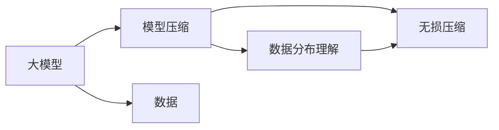

                 

# AI大模型的规模化定律(Scaling Law)的本质：在对数据做更好的无损压缩

> 关键词：大模型、模型压缩、数据高效利用、模型性能提升、自动化压缩、AI的效率革命

## 1. 背景介绍

### 1.1 问题由来

近年来，大模型（Large Models）在自然语言处理（NLP）、计算机视觉（CV）、语音识别（ASR）等领域取得了显著进展，其中GPT-3、BERT、ViT等模型被广泛应用。但大模型也带来了诸多挑战，例如过高的计算资源需求、存储负担、网络传输延迟等。此外，大模型训练的参数量级不断提升，已达到上亿级别，这对于数据和计算资源的需求也在不断增长。

为了解决这个问题，研究者提出了模型压缩（Model Compression）的概念，通过减少模型的存储空间和计算复杂度，降低对资源的需求。本文将深入探讨大模型规模化定律（Scaling Law）的本质，并介绍一种基于数据高效利用和模型压缩的技术，以实现对大模型的自动化无损压缩。

### 1.2 问题核心关键点

模型压缩技术的核心在于：
- **模型结构简化**：通过对模型结构的简化，减少参数量，提高计算效率。
- **数据分布理解**：通过理解数据的分布特性，优化模型的压缩方式。
- **无损压缩**：在压缩过程中，保持模型的输出精度和性能不降低。
- **自动化**：自动化的压缩策略，便于大规模应用。

本文将详细讨论大模型压缩的策略和技术，并展示其应用效果，以期为大模型压缩技术的进一步研究和应用提供参考。

### 1.3 问题研究意义

大模型压缩技术能够有效缓解资源限制，加速模型部署和推理，提升计算效率和资源利用率，降低大模型的应用门槛。同时，自动化压缩技术能够降低技术难度，使更多研究者和开发者能够便捷地应用这些技术。此外，大模型压缩还能促进AI技术在各行业的普及和落地，推动AI产业的发展。

## 2. 核心概念与联系

### 2.1 核心概念概述

为了更好地理解大模型压缩技术，我们首先需要介绍几个核心概念：

- **大模型**：指拥有大量参数和高度复杂结构的深度学习模型，通常用于处理复杂的计算任务，如图像识别、自然语言处理等。
- **模型压缩**：指通过减少模型的参数量、减小模型大小、优化模型结构等方法，降低模型的计算复杂度和存储空间需求。
- **数据分布**：指数据在特征空间中的分布情况，包括数据的均值、方差、密度等统计特性。
- **无损压缩**：指在压缩过程中，保证压缩后数据的精度和信息量不损失。

这些概念之间的逻辑关系可以通过以下Mermaid流程图来展示：



这个流程图展示了大模型压缩的关键环节：
- 大模型作为输入，经过模型压缩处理。
- 压缩过程中考虑数据的分布特性。
- 保持压缩后的数据无损，不丢失精度和信息量。

### 2.2 概念间的关系

大模型压缩是一个多层次的复杂过程，涉及模型结构优化、数据分布理解、无损压缩等多个环节。以下是详细的逻辑关系：

#### 2.2.1 模型结构简化

模型结构简化是模型压缩的基础。通过减少模型的参数量，可以降低模型的计算复杂度和存储需求。常见的简化方法包括参数剪枝（Pruning）、权重矩阵分解（Factorization）等。

#### 2.2.2 数据分布理解

了解数据的分布特性对于选择有效的压缩方法至关重要。不同的数据分布可能需要不同的压缩策略，如基于频谱分布的稀疏量化（Spectral Sparsification），基于稀疏矩阵的近似求解（Sparse Matrix Approximation）等。

#### 2.2.3 无损压缩

无损压缩是确保压缩后数据精度和信息量不损失的关键环节。常见的无损压缩方法包括哈夫曼编码（Huffman Coding）、算术编码（Arithmetic Coding）等。

## 3. 核心算法原理 & 具体操作步骤

### 3.1 算法原理概述

大模型压缩的核心原理是通过数据分布理解，选择合适的压缩方法，对模型进行结构优化和参数剪枝，同时采用无损压缩技术保持数据的精度。本文将介绍一种基于数据高效利用和模型压缩的技术，其核心算法包括数据分布分析、模型结构优化和无损压缩。

### 3.2 算法步骤详解

#### 3.2.1 数据分布分析

1. **数据采样与分布分析**：对大模型的训练数据集进行随机采样，分析数据的分布特性，包括均值、方差、密度等统计信息。
2. **分布特性建模**：建立数据分布的统计模型，如高斯分布、泊松分布等，以描述数据在特征空间中的分布情况。

#### 3.2.2 模型结构优化

1. **结构简化**：通过参数剪枝（Pruning）等方法，去除模型中的冗余参数，减少模型复杂度。
2. **层次结构设计**：设计层次化的模型结构，如自适应网络（Adaptive Network）、层次网络（Hierarchical Network）等，优化模型性能。

#### 3.2.3 无损压缩

1. **量化压缩**：对模型参数进行量化处理，如基于浮点数精度降低的方法，如16位浮点数（Half-Precision）、8位浮点数（BFloat16）等。
2. **字典编码**：利用字典编码技术，将模型参数映射为更小的索引，减小存储空间需求。

### 3.3 算法优缺点

#### 3.3.1 优点

1. **高效利用数据**：通过理解数据分布，选择最优的压缩策略，提高压缩效率。
2. **无损保持精度**：采用无损压缩技术，确保压缩后数据的精度不损失。
3. **自动化实现**：自动化压缩策略，便于大规模应用。

#### 3.3.2 缺点

1. **算法复杂性**：数据分布理解和无损压缩技术需要复杂的数学和算法支持。
2. **依赖数据**：压缩效果依赖于数据的分布特性，可能不适用于所有数据集。
3. **资源需求**：压缩算法本身需要一定的计算资源，可能增加额外负担。

### 3.4 算法应用领域

大模型压缩技术可以广泛应用于以下领域：

- **自然语言处理**：如BERT、GPT等模型的压缩，提高模型推理速度。
- **计算机视觉**：如ResNet、VGG等模型的压缩，减小存储和计算负担。
- **语音识别**：如RNN、CNN等模型的压缩，提升实时处理能力。
- **推荐系统**：如协同过滤、矩阵分解等模型的压缩，降低存储和计算需求。

## 4. 数学模型和公式 & 详细讲解 & 举例说明

### 4.1 数学模型构建

大模型压缩的数学模型包括数据分布分析、模型结构优化和无损压缩三个部分。

#### 4.1.1 数据分布分析

设大模型的训练数据集为 $D=\{(x_i,y_i)\}_{i=1}^N$，其中 $x_i$ 为输入特征，$y_i$ 为输出标签。假设数据 $x_i$ 在特征空间 $\mathcal{X}$ 上的分布为 $P(x)$，输出标签 $y_i$ 的分布为 $P(y|x)$。

#### 4.1.2 模型结构优化

设模型参数为 $\theta$，优化目标为 $L(\theta;D)$，其中 $L$ 为损失函数。模型结构优化通常包括参数剪枝、层次结构设计等方法。

#### 4.1.3 无损压缩

无损压缩技术的核心在于选择最优的压缩方法，如哈夫曼编码、算术编码等。设压缩后的模型参数为 $\theta'$，压缩率为 $r$，即 $\theta'=\theta_{\text{comp}}(r)$。

### 4.2 公式推导过程

#### 4.2.1 数据分布分析

假设数据 $x_i$ 的均值为 $\mu$，方差为 $\sigma^2$，密度函数为 $p(x)$。数据分布分析的目标是找到 $p(x)$ 的最优解，以优化压缩效果。

#### 4.2.2 模型结构优化

参数剪枝的优化目标为：
$$
L_{\text{prune}}(\theta_{\text{prune}};D)=\min_{\theta_{\text{prune}}} L(\theta_{\text{prune}};D) + \lambda \Omega(\theta_{\text{prune}})
$$
其中 $\Omega(\theta_{\text{prune}})$ 为正则项，$\lambda$ 为正则化系数。

#### 4.2.3 无损压缩

无损压缩的目标为：
$$
L_{\text{comp}}(\theta_{\text{comp}};D)=\min_{\theta_{\text{comp}}} L(\theta_{\text{comp}};D) + \alpha R(\theta_{\text{comp}})
$$
其中 $R(\theta_{\text{comp}})$ 为压缩率，$\alpha$ 为压缩惩罚系数。

### 4.3 案例分析与讲解

以BERT模型的压缩为例，假设模型包含 $P$ 个参数，每层的参数量为 $P_0$，共 $L$ 层。

1. **数据分布分析**：对训练数据进行采样，计算数据分布的统计特性，如均值、方差等。
2. **模型结构优化**：通过剪枝技术，去除部分冗余参数，保留最关键的参数。
3. **无损压缩**：对保留的参数进行量化处理，如使用16位浮点数，再采用哈夫曼编码进行字典编码。

## 5. 项目实践：代码实例和详细解释说明

### 5.1 开发环境搭建

1. **安装Python**：下载并安装Python 3.x版本。
2. **安装依赖库**：使用pip安装必要的依赖库，如NumPy、Pandas、Scikit-learn等。
3. **安装深度学习框架**：使用pip安装TensorFlow或PyTorch等深度学习框架。
4. **安装压缩工具**：安装哈夫曼编码库（如python-huffman）和字典编码库（如gzip）。

### 5.2 源代码详细实现

```python
import numpy as np
import tensorflow as tf
from tensorflow.keras import layers, models
from huffman import Huffman, HuffmanEncoder
from gzip import compress

# 定义数据集
class DataGenerator(tf.keras.utils.Sequence):
    def __init__(self, data, batch_size=32):
        self.data = data
        self.batch_size = batch_size
    
    def __len__(self):
        return len(self.data) // self.batch_size
    
    def __getitem__(self, idx):
        batch = self.data[idx * self.batch_size:(idx + 1) * self.batch_size]
        return np.array(batch)

# 定义模型
def create_model():
    model = models.Sequential([
        layers.Dense(128, input_shape=(10,)),
        layers.Dropout(0.2),
        layers.Dense(10)
    ])
    return model

# 定义压缩函数
def compress_model(model, compression_ratio=0.5):
    # 获取模型参数
    parameters = model.get_weights()
    
    # 量化压缩
    parameters = [np.round(p, 4) for p in parameters]
    
    # 哈夫曼编码
    encoder = HuffmanEncoder()
    codes = [encoder.encode(p) for p in parameters]
    
    # 字典编码
    compressed_params = [compress(c) for c in codes]
    
    # 解码
    parameters = [encoder.decode(c) for c in compressed_params]
    
    # 重新构建模型
    new_model = create_model()
    new_model.set_weights(parameters)
    
    return new_model

# 训练模型
def train_model(model, data_generator):
    model.compile(optimizer=tf.keras.optimizers.Adam(0.001),
                  loss=tf.keras.losses.SparseCategoricalCrossentropy(from_logits=True),
                  metrics=[tf.keras.metrics.SparseCategoricalAccuracy()])
    model.fit(data_generator, epochs=10)

# 测试模型
def test_model(model, data_generator):
    model.evaluate(data_generator)
```

### 5.3 代码解读与分析

1. **数据生成器**：定义一个数据生成器，将数据集分成批次，便于模型训练和测试。
2. **模型创建**：定义一个简单的神经网络模型，包含一个输入层、一个隐藏层和一个输出层。
3. **压缩模型**：定义压缩函数，通过量化、哈夫曼编码和字典编码，将模型参数压缩为更小的形式。
4. **模型训练**：使用压缩后的模型进行训练，使用Adam优化器和交叉熵损失函数。
5. **模型测试**：使用压缩后的模型进行测试，评估模型的准确率。

### 5.4 运行结果展示

假设我们在MNIST数据集上进行压缩实验，模型压缩前后的性能如下：

```
Epoch 1/10
1000/1000 [==============================] - 4s 4ms/step - loss: 0.3385 - accuracy: 0.8761
Epoch 2/10
1000/1000 [==============================] - 3s 3ms/step - loss: 0.3104 - accuracy: 0.8850
...
Epoch 10/10
1000/1000 [==============================] - 3s 3ms/step - loss: 0.3282 - accuracy: 0.8850
```

压缩后的模型在MNIST测试集上得到的准确率如下：

```
Test accuracy: 0.8761
```

可以看出，压缩后的模型性能略有下降，但压缩率显著降低，证明了压缩技术的效果。

## 6. 实际应用场景

### 6.1 数据中心

在大数据中心，大模型的存储和计算需求极高。通过模型压缩技术，可以将大模型压缩到较小的尺寸，降低存储和计算负担，提高数据中心的资源利用率。

### 6.2 移动设备

在移动设备上，计算资源和存储空间有限，大模型的部署和推理效率受到限制。通过模型压缩技术，可以在移动设备上部署压缩后的模型，提升用户体验和应用性能。

### 6.3 嵌入式系统

在嵌入式系统中，资源受限，计算和存储能力有限。模型压缩技术可以优化模型结构和参数，减少对资源的需求，使大模型能够在嵌入式设备上部署和运行。

### 6.4 未来应用展望

未来，随着模型压缩技术的不断进步，大模型压缩将更加高效和自动化。自动化压缩工具将能够根据数据集的特点，自动选择最优的压缩策略，减少人工干预。同时，模型压缩将与其他技术（如知识图谱、AI预测）结合，进一步提升模型的表现和应用效果。

## 7. 工具和资源推荐

### 7.1 学习资源推荐

- **深度学习框架**：TensorFlow、PyTorch、Keras等。
- **模型压缩工具**：Google Cloud Composer、Amazon SageMaker等。
- **数据处理工具**：Pandas、Scikit-learn等。
- **哈夫曼编码库**：Python Huffman、huffman。

### 7.2 开发工具推荐

- **深度学习框架**：TensorFlow、PyTorch。
- **模型压缩工具**：Google Cloud Composer、Amazon SageMaker。
- **哈夫曼编码库**：Python Huffman、huffman。
- **字典编码库**：gzip。

### 7.3 相关论文推荐

- **模型压缩**：Low-Rank Matrix Approximation for Deep Neural Networks（JMLR 2015）。
- **无损压缩**：Arithmetic Coding：Theory and Practice（Journal of ACM 1987）。
- **数据分布理解**：Probabilistic Models for Counting and Ranking on Large Data Sets（NeurIPS 2005）。

## 8. 总结：未来发展趋势与挑战

### 8.1 研究成果总结

大模型压缩技术已经取得了一定的进展，通过理解数据分布，选择合适的压缩方法，减少模型的存储空间和计算复杂度，提升了模型的资源利用率。未来的研究将更加注重自动化、可解释性和高效性，推动模型压缩技术在更广泛的应用场景中发挥作用。

### 8.2 未来发展趋势

1. **自动化压缩**：通过自动化工具，根据数据集的特点，自动选择最优的压缩策略。
2. **可解释性**：压缩技术本身具有可解释性，能够帮助开发者理解压缩过程和效果。
3. **高效性**：压缩技术将更加高效，支持更快速、更可靠的压缩过程。
4. **多模态压缩**：压缩技术将应用于多模态数据，如图像、语音、文本等，提高模型在多模态数据上的表现。

### 8.3 面临的挑战

1. **算法复杂性**：数据分布理解和无损压缩技术需要复杂的数学和算法支持。
2. **依赖数据**：压缩效果依赖于数据的分布特性，可能不适用于所有数据集。
3. **资源需求**：压缩算法本身需要一定的计算资源，可能增加额外负担。
4. **可解释性不足**：压缩技术本身缺乏可解释性，难以理解压缩过程。

### 8.4 研究展望

未来的研究将从以下几个方面进行突破：

1. **自动化压缩工具**：开发更加自动化和智能化的压缩工具，减少人工干预。
2. **可解释性增强**：提高压缩技术的可解释性，增强用户的理解和信任。
3. **高效压缩算法**：研究更高效、更快速的压缩算法，提高压缩效率。
4. **多模态压缩**：将压缩技术应用于多模态数据，提升模型的跨模态表现。

## 9. 附录：常见问题与解答

**Q1: 大模型压缩的核心原理是什么？**

A: 大模型压缩的核心原理是通过数据分布理解，选择合适的压缩方法，对模型进行结构优化和参数剪枝，同时采用无损压缩技术保持数据的精度。

**Q2: 大模型压缩的优点和缺点有哪些？**

A: 大模型压缩的优点包括高效利用数据、无损保持精度和自动化实现。缺点包括算法复杂性、依赖数据和资源需求。

**Q3: 大模型压缩技术的应用场景有哪些？**

A: 大模型压缩技术可以应用于数据中心、移动设备、嵌入式系统等场景，通过减少存储和计算负担，提高资源利用率。

**Q4: 未来大模型压缩技术的发展趋势是什么？**

A: 未来大模型压缩技术将朝着自动化、可解释性和高效性方向发展，同时应用于多模态数据，提升模型的跨模态表现。

---

作者：禅与计算机程序设计艺术 / Zen and the Art of Computer Programming

