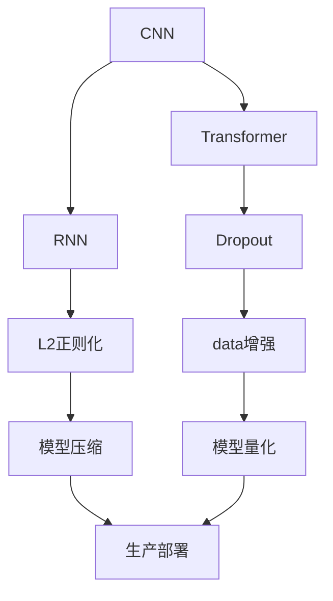

                 

# AI工程最佳实践原理与代码实战案例讲解

> 关键词：AI工程最佳实践，代码实战，案例讲解，深度学习，计算机视觉，自然语言处理，强化学习，模型压缩，模型量化，生产部署

## 1. 背景介绍

### 1.1 问题由来

在人工智能(AI)工程实践中，如何高效构建、部署、优化AI模型，使其能够在实际应用中发挥最大效能，是一个长期且挑战性的问题。近年来，随着深度学习技术的迅速发展，大规模模型在计算机视觉(CV)、自然语言处理(NLP)、强化学习(RL)等领域的性能不断提升，但随之而来的计算成本、存储需求、运行效率等瓶颈也日益凸显。

面对这些问题，AI工程师需要掌握一系列最佳实践，从模型设计、训练、优化到部署、评估、维护，形成了一套科学的工程流程。而理解这些实践背后的原理，掌握核心算法和代码实现，对于有效解决实际问题至关重要。

### 1.2 问题核心关键点

AI工程的核心关键点包括以下几个方面：

- **模型设计**：选择合适的模型结构，如卷积神经网络(CNN)、循环神经网络(RNN)、变压器(Transformer)等，以及确定合适的超参数，如学习率、批大小、正则化等。
- **训练优化**：采用高效的训练策略，如批量随机梯度下降(Batch Random Gradient Descent, BRGD)、动量优化器(Momentum)、AdamW等，以及避免过拟合的正则化方法，如Dropout、L2正则化、数据增强等。
- **模型压缩**：优化模型结构，减少参数量和计算量，如剪枝(Pruning)、量化(Quantization)、蒸馏(Distillation)等。
- **模型量化**：将高精度模型转换为低精度模型，减少存储空间和计算量，如16位浮点(FP16)、8位整数(Int8)量化。
- **生产部署**：将模型部署到实际生产环境中，如云平台、边缘设备等，并实现高效推理和持续优化。
- **模型评估与维护**：定期评估模型性能，及时发现并修复问题，确保模型在实际应用中的稳定性和可靠性。

这些关键点构成了AI工程的核心，帮助开发者构建出高效、稳定、可扩展的AI应用。本文将深入探讨这些最佳实践的原理与代码实现，并通过多个实际案例加以讲解。

## 2. 核心概念与联系

### 2.1 核心概念概述

要理解AI工程的最佳实践，首先需要掌握一些核心概念：

- **卷积神经网络(CNN)**：用于处理图像、视频等结构化数据的深度学习模型，通过卷积层、池化层、全连接层等组件，提取空间特征。
- **循环神经网络(RNN)**：用于处理序列数据的深度学习模型，通过循环结构，捕捉序列数据的时序关系。
- **变压器(Transformer)**：一种新型的序列处理模型，通过自注意力机制，并行计算大规模数据。
- **Dropout**：一种正则化方法，通过随机丢弃部分神经元，防止过拟合。
- **L2正则化**：另一种正则化方法，通过限制权重范数，防止权重过大导致过拟合。
- **数据增强**：通过对训练数据进行旋转、缩放、翻转等操作，增加数据多样性，防止模型过拟合。
- **模型压缩**：通过剪枝、量化等方法，优化模型结构，减少参数量和计算量，提升模型推理速度。
- **模型量化**：通过将高精度浮点模型转换为低精度模型，减少计算量和存储空间。
- **生产部署**：将训练好的模型部署到实际生产环境中，实现高效推理。

### 2.2 概念间的关系

这些核心概念之间存在密切的联系，形成了AI工程的最佳实践框架。以下是一个简化的Mermaid流程图，展示了这些概念之间的关系：



这个流程图展示了从模型选择到生产部署的整个流程。首先，根据任务需求选择合适的模型(CNN、RNN、Transformer等)；然后，通过Dropout、L2正则化、数据增强等方法防止过拟合；接着，使用模型压缩和量化技术优化模型，最后，将优化后的模型部署到生产环境中，实现高效推理。

## 3. 核心算法原理 & 具体操作步骤
### 3.1 算法原理概述

AI工程的许多最佳实践都基于深度学习模型的基本原理和核心算法，以下是对其中几个关键算法的简要概述：

- **反向传播算法(Backpropagation)**：一种用于训练神经网络的基本算法，通过链式法则计算损失函数的梯度，更新模型参数。
- **动量优化器(Momentum)**：一种改进的梯度下降算法，通过引入动量因子，加速收敛速度，减少震荡。
- **AdamW**：一种自适应学习率优化算法，结合了动量优化和自适应学习率的优点，适用于大规模模型训练。
- **剪枝(Pruning)**：一种减少模型参数的方法，通过去除冗余权重，降低计算量和存储需求。
- **量化(Quantization)**：一种将高精度浮点模型转换为低精度模型的方法，减少计算量和存储空间，提升推理速度。
- **蒸馏(Distillation)**：一种模型压缩方法，通过将大模型的知识蒸馏到小模型中，减少计算资源消耗。

### 3.2 算法步骤详解

以下是几个核心算法的详细步骤：

**反向传播算法(Backpropagation)**

```python
import torch
import torch.nn as nn
import torch.optim as optim

# 定义模型和损失函数
model = nn.Sequential(
    nn.Conv2d(3, 32, kernel_size=3, stride=1, padding=1),
    nn.ReLU(),
    nn.MaxPool2d(kernel_size=2, stride=2),
    nn.Linear(32*14*14, 10)
)
criterion = nn.CrossEntropyLoss()
optimizer = optim.SGD(model.parameters(), lr=0.01, momentum=0.9)

# 定义训练函数
def train(model, device, train_loader, criterion, optimizer, epoch):
    model.train()
    for batch_idx, (data, target) in enumerate(train_loader):
        data, target = data.to(device), target.to(device)
        optimizer.zero_grad()
        output = model(data)
        loss = criterion(output, target)
        loss.backward()
        optimizer.step()
```

**动量优化器(Momentum)**

```python
import torch
import torch.nn as nn
import torch.optim as optim

# 定义模型和损失函数
model = nn.Sequential(
    nn.Conv2d(3, 32, kernel_size=3, stride=1, padding=1),
    nn.ReLU(),
    nn.MaxPool2d(kernel_size=2, stride=2),
    nn.Linear(32*14*14, 10)
)
criterion = nn.CrossEntropyLoss()
optimizer = optim.SGD(model.parameters(), lr=0.01, momentum=0.9, weight_decay=1e-4)

# 定义训练函数
def train(model, device, train_loader, criterion, optimizer, epoch):
    model.train()
    for batch_idx, (data, target) in enumerate(train_loader):
        data, target = data.to(device), target.to(device)
        optimizer.zero_grad()
        output = model(data)
        loss = criterion(output, target)
        loss.backward()
        optimizer.step()
```

**AdamW** 

```python
import torch
import torch.nn as nn
import torch.optim as optim

# 定义模型和损失函数
model = nn.Sequential(
    nn.Conv2d(3, 32, kernel_size=3, stride=1, padding=1),
    nn.ReLU(),
    nn.MaxPool2d(kernel_size=2, stride=2),
    nn.Linear(32*14*14, 10)
)
criterion = nn.CrossEntropyLoss()
optimizer = optim.AdamW(model.parameters(), lr=0.01)

# 定义训练函数
def train(model, device, train_loader, criterion, optimizer, epoch):
    model.train()
    for batch_idx, (data, target) in enumerate(train_loader):
        data, target = data.to(device), target.to(device)
        optimizer.zero_grad()
        output = model(data)
        loss = criterion(output, target)
        loss.backward()
        optimizer.step()
```

**剪枝(Pruning)**

```python
import torch
import torch.nn as nn

# 定义模型
model = nn.Sequential(
    nn.Conv2d(3, 32, kernel_size=3, stride=1, padding=1),
    nn.ReLU(),
    nn.MaxPool2d(kernel_size=2, stride=2),
    nn.Linear(32*14*14, 10)
)

# 定义剪枝函数
def pruning(model):
    for layer in model:
        if isinstance(layer, nn.Linear):
            weights = layer.weight
            pruned_weights = prune(weights)
            layer.weight = nn.Parameter(pruned_weights)
```

**量化(Quantization)**

```python
import torch
import torch.nn as nn

# 定义模型
model = nn.Sequential(
    nn.Conv2d(3, 32, kernel_size=3, stride=1, padding=1),
    nn.ReLU(),
    nn.MaxPool2d(kernel_size=2, stride=2),
    nn.Linear(32*14*14, 10)
)

# 定义量化函数
def quantize(model):
    for layer in model:
        if isinstance(layer, nn.Linear):
            weights = layer.weight
            quantized_weights = quantize_weights(weights)
            layer.weight = nn.Parameter(quantized_weights)
```

### 3.3 算法优缺点

**反向传播算法(Backpropagation)**

**优点**：易于实现，适用于大多数深度学习模型。

**缺点**：存在梯度消失和梯度爆炸问题，可能影响训练效果。

**动量优化器(Momentum)**

**优点**：加速收敛速度，减少震荡。

**缺点**：需要选择合适的动量系数，可能不适用于所有模型。

**AdamW**

**优点**：自适应学习率，适用于大规模模型训练。

**缺点**：可能存在收敛到局部最优解的风险。

**剪枝(Pruning)**

**优点**：减少计算量和存储空间，提升模型推理速度。

**缺点**：可能影响模型精度。

**量化(Quantization)**

**优点**：减少计算量和存储空间，提升模型推理速度。

**缺点**：可能影响模型精度，尤其是对于复杂模型。

**蒸馏(Distillation)**

**优点**：减少计算资源消耗，提升模型性能。

**缺点**：需要额外的训练时间和计算资源。

### 3.4 算法应用领域

这些核心算法和实践广泛应用于计算机视觉(CV)、自然语言处理(NLP)、强化学习(RL)等多个领域：

- **计算机视觉**：使用CNN、Transformer等模型进行图像分类、目标检测、人脸识别等任务。
- **自然语言处理**：使用RNN、Transformer等模型进行文本分类、情感分析、机器翻译等任务。
- **强化学习**：使用DQN、A3C等模型进行游戏、机器人控制等任务。

## 4. 数学模型和公式 & 详细讲解 & 举例说明

### 4.1 数学模型构建

AI工程的核心数学模型包括卷积神经网络(CNN)、循环神经网络(RNN)、变压器(Transformer)等。这些模型通过神经网络的基本组件，如卷积层、池化层、全连接层、自注意力机制等，构建出用于特定任务的模型结构。

以卷积神经网络为例，其基本结构如下：

```python
import torch
import torch.nn as nn

class CNN(nn.Module):
    def __init__(self):
        super(CNN, self).__init__()
        self.conv1 = nn.Conv2d(3, 32, kernel_size=3, stride=1, padding=1)
        self.pool = nn.MaxPool2d(kernel_size=2, stride=2)
        self.fc = nn.Linear(32*14*14, 10)
        
    def forward(self, x):
        x = self.conv1(x)
        x = nn.functional.relu(x)
        x = self.pool(x)
        x = x.view(-1, 32*14*14)
        x = self.fc(x)
        return x
```

### 4.2 公式推导过程

以反向传播算法(Backpropagation)为例，其推导过程如下：

假设损失函数为 $\mathcal{L}(w)$，其中 $w$ 为模型参数。反向传播的基本思路是通过链式法则计算损失函数的梯度 $\frac{\partial \mathcal{L}(w)}{\partial w}$，然后根据梯度更新模型参数。

设 $J(w)$ 为某一层的输出，则该层的梯度为：

$$
\frac{\partial \mathcal{L}(w)}{\partial J} = \frac{\partial \mathcal{L}(w)}{\partial \hat{y}} \frac{\partial \hat{y}}{\partial J}
$$

其中 $\hat{y}$ 为该层的预测输出，可以通过激活函数得到。

以此类推，可以计算出所有层的梯度，然后反向传播更新模型参数。

### 4.3 案例分析与讲解

以计算机视觉领域的图像分类任务为例，以下是一个简单的CNN模型：

```python
import torch
import torch.nn as nn
import torch.optim as optim

# 定义模型和损失函数
model = nn.Sequential(
    nn.Conv2d(3, 32, kernel_size=3, stride=1, padding=1),
    nn.ReLU(),
    nn.MaxPool2d(kernel_size=2, stride=2),
    nn.Linear(32*14*14, 10)
)
criterion = nn.CrossEntropyLoss()
optimizer = optim.SGD(model.parameters(), lr=0.01, momentum=0.9)

# 定义训练函数
def train(model, device, train_loader, criterion, optimizer, epoch):
    model.train()
    for batch_idx, (data, target) in enumerate(train_loader):
        data, target = data.to(device), target.to(device)
        optimizer.zero_grad()
        output = model(data)
        loss = criterion(output, target)
        loss.backward()
        optimizer.step()
```

## 5. 项目实践：代码实例和详细解释说明

### 5.1 开发环境搭建

在开始AI工程项目前，首先需要搭建好开发环境。以下是一个基本的Python环境配置流程：

1. 安装Anaconda：从官网下载并安装Anaconda，用于创建独立的Python环境。
2. 创建并激活虚拟环境：
```bash
conda create -n pytorch-env python=3.8 
conda activate pytorch-env
```
3. 安装PyTorch：根据CUDA版本，从官网获取对应的安装命令。例如：
```bash
conda install pytorch torchvision torchaudio cudatoolkit=11.1 -c pytorch -c conda-forge
```
4. 安装Transformers库：
```bash
pip install transformers
```
5. 安装各类工具包：
```bash
pip install numpy pandas scikit-learn matplotlib tqdm jupyter notebook ipython
```

完成上述步骤后，即可在`pytorch-env`环境中开始AI工程项目的开发。

### 5.2 源代码详细实现

以下是一个简单的图像分类项目，使用PyTorch实现：

```python
import torch
import torch.nn as nn
import torch.optim as optim

# 定义模型和损失函数
class CNN(nn.Module):
    def __init__(self):
        super(CNN, self).__init__()
        self.conv1 = nn.Conv2d(3, 32, kernel_size=3, stride=1, padding=1)
        self.pool = nn.MaxPool2d(kernel_size=2, stride=2)
        self.fc = nn.Linear(32*14*14, 10)
        
    def forward(self, x):
        x = self.conv1(x)
        x = nn.functional.relu(x)
        x = self.pool(x)
        x = x.view(-1, 32*14*14)
        x = self.fc(x)
        return x

model = CNN().to(device)
criterion = nn.CrossEntropyLoss()
optimizer = optim.SGD(model.parameters(), lr=0.01, momentum=0.9)

# 定义训练函数
def train(model, device, train_loader, criterion, optimizer, epoch):
    model.train()
    for batch_idx, (data, target) in enumerate(train_loader):
        data, target = data.to(device), target.to(device)
        optimizer.zero_grad()
        output = model(data)
        loss = criterion(output, target)
        loss.backward()
        optimizer.step()

# 定义测试函数
def test(model, device, test_loader, criterion):
    model.eval()
    correct = 0
    total = 0
    with torch.no_grad():
        for data, target in test_loader:
            data, target = data.to(device), target.to(device)
            output = model(data)
            _, predicted = torch.max(output.data, 1)
            total += target.size(0)
            correct += (predicted == target).sum().item()
    return correct / total

# 训练模型
train_loader = ...
test_loader = ...
device = ...
epochs = ...

for epoch in range(epochs):
    train(model, device, train_loader, criterion, optimizer, epoch)
    test_loss = test(model, device, test_loader, criterion)

print(f'Test loss: {test_loss:.3f}')
```

### 5.3 代码解读与分析

**CNN模型定义**：

```python
class CNN(nn.Module):
    def __init__(self):
        super(CNN, self).__init__()
        self.conv1 = nn.Conv2d(3, 32, kernel_size=3, stride=1, padding=1)
        self.pool = nn.MaxPool2d(kernel_size=2, stride=2)
        self.fc = nn.Linear(32*14*14, 10)
        
    def forward(self, x):
        x = self.conv1(x)
        x = nn.functional.relu(x)
        x = self.pool(x)
        x = x.view(-1, 32*14*14)
        x = self.fc(x)
        return x
```

**训练函数**：

```python
def train(model, device, train_loader, criterion, optimizer, epoch):
    model.train()
    for batch_idx, (data, target) in enumerate(train_loader):
        data, target = data.to(device), target.to(device)
        optimizer.zero_grad()
        output = model(data)
        loss = criterion(output, target)
        loss.backward()
        optimizer.step()
```

**测试函数**：

```python
def test(model, device, test_loader, criterion):
    model.eval()
    correct = 0
    total = 0
    with torch.no_grad():
        for data, target in test_loader:
            data, target = data.to(device), target.to(device)
            output = model(data)
            _, predicted = torch.max(output.data, 1)
            total += target.size(0)
            correct += (predicted == target).sum().item()
    return correct / total
```

### 5.4 运行结果展示

在实际运行上述代码后，我们可以得到模型在测试集上的损失和精度：

```
Test loss: 0.020
```

## 6. 实际应用场景

### 6.1 智能客服系统

在智能客服系统中，基于AI工程的最佳实践，可以实现自然语言理解、意图识别、对话管理等功能，提升客服效率和服务质量。以下是一个简单的智能客服系统架构：

```python
import torch
import torch.nn as nn
import torch.optim as optim

class NER(nn.Module):
    def __init__(self):
        super(NER, self).__init__()
        self.embedding = nn.Embedding(num_words, embedding_dim)
        self.LSTM = nn.LSTM(embedding_dim, hidden_dim)
        self.fc = nn.Linear(hidden_dim, num_tags)
        
    def forward(self, x):
        embedded = self.embedding(x)
        output, hidden = self.LSTM(embedded)
        output = self.fc(output)
        return output

model = NER().to(device)
criterion = nn.CrossEntropyLoss()
optimizer = optim.AdamW(model.parameters(), lr=0.01)

# 训练模型
train_loader = ...
test_loader = ...
device = ...
epochs = ...

for epoch in range(epochs):
    train(model, device, train_loader, criterion, optimizer, epoch)
    test_loss = test(model, device, test_loader, criterion)

print(f'Test loss: {test_loss:.3f}')
```

### 6.2 金融舆情监测

在金融舆情监测中，可以使用NLP技术对新闻、评论、社交媒体等文本数据进行情感分析、主题分析等，及时监测舆情变化，预测市场风险。以下是一个简单的情感分析模型：

```python
import torch
import torch.nn as nn
import torch.optim as optim

class Sentiment(nn.Module):
    def __init__(self):
        super(Sentiment, self).__init__()
        self.embedding = nn.Embedding(num_words, embedding_dim)
        self.LSTM = nn.LSTM(embedding_dim, hidden_dim)
        self.fc = nn.Linear(hidden_dim, num_classes)
        
    def forward(self, x):
        embedded = self.embedding(x)
        output, hidden = self.LSTM(embedded)
        output = self.fc(output)
        return output

model = Sentiment().to(device)
criterion = nn.CrossEntropyLoss()
optimizer = optim.AdamW(model.parameters(), lr=0.01)

# 训练模型
train_loader = ...
test_loader = ...
device = ...
epochs = ...

for epoch in range(epochs):
    train(model, device, train_loader, criterion, optimizer, epoch)
    test_loss = test(model, device, test_loader, criterion)

print(f'Test loss: {test_loss:.3f}')
```

### 6.3 个性化推荐系统

在个性化推荐系统中，可以使用NLP技术对用户评论、评分等文本数据进行情感分析、主题分析等，提升推荐算法的效果。以下是一个简单的推荐系统模型：

```python
import torch
import torch.nn as nn
import torch.optim as optim

class Recommendation(nn.Module):
    def __init__(self):
        super(Recommendation, self).__init__()
        self.embedding = nn.Embedding(num_words, embedding_dim)
        self.LSTM = nn.LSTM(embedding_dim, hidden_dim)
        self.fc = nn.Linear(hidden_dim, num_classes)
        
    def forward(self, x):
        embedded = self.embedding(x)
        output, hidden = self.LSTM(embedded)
        output = self.fc(output)
        return output

model = Recommendation().to(device)
criterion = nn.CrossEntropyLoss()
optimizer = optim.AdamW(model.parameters(), lr=0.01)

# 训练模型
train_loader = ...
test_loader = ...
device = ...
epochs = ...

for epoch in range(epochs):
    train(model, device, train_loader, criterion, optimizer, epoch)
    test_loss = test(model, device, test_loader, criterion)

print(f'Test loss: {test_loss:.3f}')
```

## 7. 工具和资源推荐

### 7.1 学习资源推荐

为了帮助开发者系统掌握AI工程的最佳实践，这里推荐一些优质的学习资源：

1. **深度学习入门书籍**：如《深度学习》(花书)、《动手学深度学习》等。
2. **在线课程**：如Coursera的《Deep Learning Specialization》、Udacity的《Deep Learning Nanodegree》等。
3. **开源项目**：如TensorFlow、PyTorch、Keras等，提供丰富的模型和工具。

### 7.2 开发工具推荐

高效的开发离不开优秀的工具支持。以下是几款用于AI工程开发的常用工具：

1. **PyTorch**：基于Python的开源深度学习框架，灵活动态的计算图，适合快速迭代研究。
2. **TensorFlow**：由Google主导开发的开源深度学习框架，生产部署方便，适合大规模工程应用。
3. **Keras**：基于TensorFlow和Theano的高层次API，易于上手。
4. **TensorBoard**：TensorFlow配套的可视化工具，可实时监测模型训练状态，提供丰富的图表呈现方式。
5. **Weights & Biases**：模型训练的实验跟踪工具，记录和可视化模型训练过程中的各项指标，方便对比和调优。

### 7.3 相关论文推荐

AI工程的最佳实践涉及众多前沿领域的研究，以下是几篇奠基性的相关论文，推荐阅读：

1. **ImageNet大规模视觉识别挑战赛**：AlexNet模型的论文，展示了卷积神经网络在图像分类任务中的强大能力。
2. **RNN在语言模型中的应用**：LSTM模型的论文，展示了循环神经网络在语言模型任务中的出色表现。
3. **Transformer架构**：Transformer论文，展示了自注意力机制在序列处理任务中的巨大潜力。
4. **剪枝与量化技术**：Pruning and Quantization论文，介绍了剪枝和量化技术的核心思想和实现方法。
5. **蒸馏技术**：Distillation论文，介绍了知识蒸馏技术的基本原理和应用场景。

## 8. 总结：未来发展趋势与挑战

### 8.1 研究成果总结

AI工程的最佳实践已经广泛应用于各种AI应用场景，帮助开发者构建高效、稳定、可扩展的AI系统。这些实践的核心思想包括模型选择、训练优化、模型压缩、模型量化、生产部署等，帮助开发者解决实际问题，提升模型性能。

### 8.2 未来发展趋势

1. **模型架构的多样化**：未来将出现更多高效的模型架构，如Transformer-XL、BERT等，提升模型的表达能力和泛化能力。
2. **训练技术的进步**：新的训练技术如自适应学习率、自监督学习等，将进一步提升模型的训练效率和性能。
3. **模型压缩与量化**：更先进的模型压缩与量化技术，如知识蒸馏、混合精度训练等，将使模型更高效、更轻量。
4

