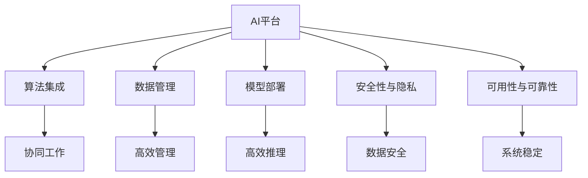
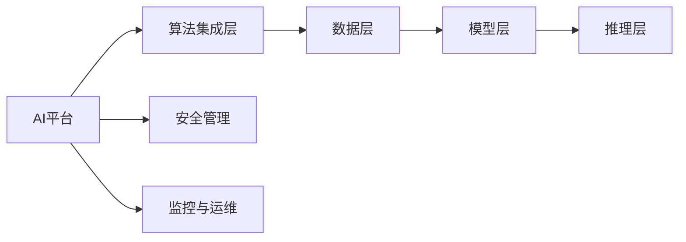
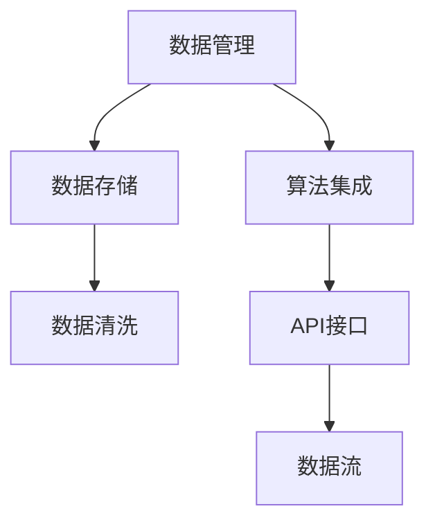
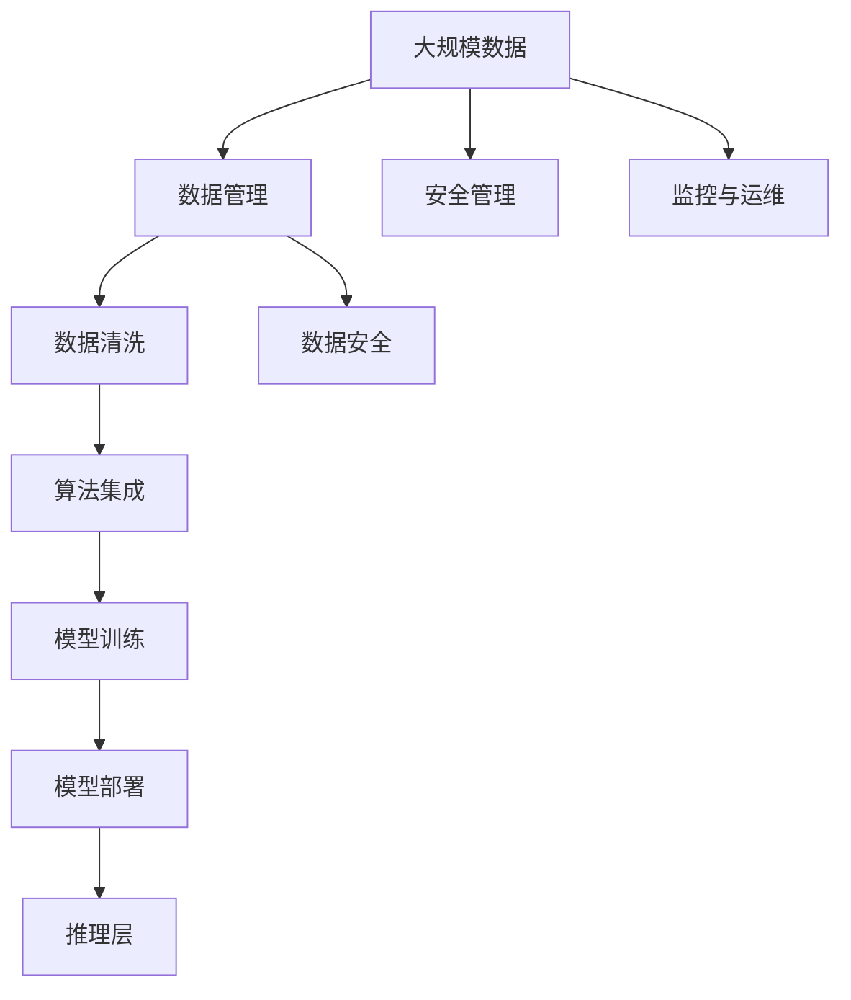

                 

# AI平台化:类比计算机操作系统的发展

> 关键词：AI平台化, 计算机操作系统, 系统化, 生态系统, 协同发展, 技术演进

## 1. 背景介绍

### 1.1 问题由来

在人工智能（AI）领域，如同计算机硬件从简单的晶体管演进到复杂的超级计算机一样，AI技术也经历了从单个算法到系统化的演进。早期的人工智能研究往往围绕单个算法或模型，如线性回归、神经网络等。然而，随着数据量和计算任务的急剧增长，依赖单一模型或算法已无法满足实际需求。如何将多个算法、模型以及数据源整合到一个平台，实现高效、协同、可扩展的AI应用，成为了一个亟待解决的问题。

### 1.2 问题核心关键点

在AI平台化过程中，核心的关键点包括：

- **算法集成**：如何将多种AI算法集成到同一平台上，实现协同工作。
- **数据管理**：如何高效管理和利用数据源，提升算法的训练和推理效率。
- **模型部署**：如何将训练好的模型高效部署到不同硬件和场景中，保证应用性能。
- **安全性与隐私**：如何保障模型的安全性和用户数据隐私，防止数据泄露和模型滥用。
- **可用性与可靠性**：如何确保AI平台的可用性和稳定性，避免单点故障和系统崩溃。

### 1.3 问题研究意义

AI平台化不仅是技术演进的需求，更是推动AI技术在各行业落地应用的重要途径。通过系统化的平台构建，可以实现：

- **降低开发成本**：整合多种AI算法和工具，减少重复开发，提升开发效率。
- **提高应用效果**：通过协同工作，提升算法的性能和效果，满足不同场景的需求。
- **加速产业升级**：提供一站式AI解决方案，加速AI技术在各行各业的应用，推动产业升级。
- **促进技术创新**：提供丰富的工具和资源，支持研究人员进行更深入的探索和创新。
- **保障数据安全**：通过集中管理和严格访问控制，保障用户数据和模型的安全。

## 2. 核心概念与联系

### 2.1 核心概念概述

为更好地理解AI平台化的核心概念，本节将介绍几个关键概念及其相互关系：

- **AI平台**：集成了多种AI算法、工具和资源的系统化平台，支持AI应用的开发、训练、部署和运营。
- **算法集成**：将不同算法模块集成到平台，通过API接口实现协同工作，提升整体效能。
- **数据管理**：对数据进行集中存储、管理和利用，支持大规模数据训练和推理。
- **模型部署**：将训练好的模型部署到不同硬件和场景中，实现高效推理和应用。
- **安全性与隐私**：通过数据加密、访问控制等措施，保障模型和数据的安全。
- **可用性与可靠性**：通过冗余设计、错误检测等手段，确保平台的高可用性和稳定性。

这些核心概念通过以下Mermaid流程图展示其相互关系：



### 2.2 概念间的关系

这些核心概念之间存在着紧密的联系，形成了AI平台化的完整生态系统。我们通过以下两个Mermaid流程图展示这些概念之间的关系。

#### 2.2.1 AI平台的系统架构



这个流程图展示了AI平台的基本架构，包括算法集成层、数据层、模型层和推理层。每个层都有其特定的功能和目标，共同支撑平台的高效运行。

#### 2.2.2 数据管理与算法集成的关系



这个流程图展示了数据管理与算法集成的关系。数据管理负责集中存储和管理数据，算法集成通过API接口实现数据与算法的协同工作，确保数据的有效利用。

### 2.3 核心概念的整体架构

最后，我们使用一个综合的流程图来展示这些核心概念在大AI平台构建过程中的整体架构：



这个综合流程图展示了从数据管理到模型部署的完整流程，各环节通过协同工作，确保AI平台的高效运行。

## 3. 核心算法原理 & 具体操作步骤

### 3.1 算法原理概述

AI平台化基于“系统化、平台化”的思维模式，将多种AI算法、工具和资源整合到同一平台上，实现协同工作。核心算法原理包括：

- **分布式计算**：通过并行计算和分布式存储，提升计算和存储的效率，支持大规模数据训练和推理。
- **模型优化**：通过模型压缩、剪枝、量化等技术，优化模型结构和参数，提升推理速度和内存占用。
- **算法融合**：通过算法集成，实现不同算法的协同工作，提升整体效能。
- **协同学习**：通过数据共享和算法融合，提升算法的鲁棒性和泛化能力。
- **模型解释**：通过模型解释技术，提升模型的可解释性和可信度，支持实际应用。

### 3.2 算法步骤详解

AI平台化的具体操作步骤包括：

1. **平台设计**：设计AI平台的基本架构，确定算法集成、数据管理、模型部署、安全管理、监控与运维等关键组件。
2. **算法集成**：选择合适的算法模块，通过API接口实现协同工作，确保数据的高效利用和算法的合理集成。
3. **数据管理**：建立集中式数据存储和管理系统，支持大规模数据训练和推理，实现数据的高效利用。
4. **模型部署**：将训练好的模型部署到不同硬件和场景中，实现高效推理和应用。
5. **安全管理**：通过数据加密、访问控制等措施，保障模型和数据的安全。
6. **监控与运维**：实时监测系统状态，及时发现和解决问题，确保系统的稳定性和可用性。

### 3.3 算法优缺点

AI平台化具有以下优点：

- **高效协同**：通过算法集成，实现不同算法的协同工作，提升整体效能。
- **资源共享**：集中管理和利用数据和算法，提升资源利用率。
- **快速迭代**：提供丰富的工具和资源，支持研究人员进行更深入的探索和创新。
- **降低成本**：整合多种AI算法和工具，减少重复开发，提升开发效率。

同时，AI平台化也存在以下缺点：

- **复杂度高**：构建和维护AI平台需要较高的技术门槛和资源投入。
- **依赖数据**：数据质量和数据量对AI平台的效果影响巨大，需要确保数据的可靠性和完整性。
- **安全风险**：集中管理和利用数据和算法，增加了数据泄露和模型滥用的风险。
- **维护成本高**：系统的稳定性和可用性需要持续的维护和监控，维护成本较高。

### 3.4 算法应用领域

AI平台化在多个领域得到了广泛应用，包括但不限于：

- **金融风控**：通过AI平台集成多种算法，实现风险识别、信用评估、欺诈检测等功能，提升金融服务的效率和质量。
- **智能制造**：通过AI平台集成视觉、语音、文字等不同模态的算法，实现智能检测、质量控制、生产优化等功能，推动制造业的智能化转型。
- **医疗健康**：通过AI平台集成多种算法，实现疾病预测、影像分析、个性化治疗等功能，提升医疗服务的质量和效率。
- **智能交通**：通过AI平台集成视觉、传感器等数据，实现智能交通监控、路况预测、自动驾驶等功能，提升交通系统的智能化水平。
- **智能安防**：通过AI平台集成图像识别、语音识别、行为分析等算法，实现智能监控、异常检测、自动化报警等功能，提升安防系统的智能化水平。

## 4. 数学模型和公式 & 详细讲解 & 举例说明

### 4.1 数学模型构建

在AI平台化的过程中，我们常常需要构建数学模型来描述系统的运行机制和性能指标。以下是一个简单的AI平台性能评估模型：

设平台包含 $n$ 种算法，每种算法处理的数据量为 $D_i$，算法处理速度为 $V_i$，数据在平台上的存储时间为 $T_i$。则平台的总体处理速度 $V_{total}$ 和数据延迟 $T_{total}$ 可分别表示为：

$$ V_{total} = \sum_{i=1}^{n} \frac{D_i}{V_i} $$
$$ T_{total} = \sum_{i=1}^{n} (T_i + \frac{D_i}{V_i}) $$

### 4.2 公式推导过程

通过上述公式，我们可以进一步推导出平台的资源利用率和性能指标：

$$ R = \frac{V_{total}}{\sum_{i=1}^{n} D_i} $$
$$ D = \frac{T_{total}}{\sum_{i=1}^{n} D_i} $$

其中 $R$ 表示资源利用率，$D$ 表示数据延迟。这些指标可以帮助我们评估平台整体性能，识别瓶颈环节，进行优化和改进。

### 4.3 案例分析与讲解

以金融风控平台为例，平台集成了多种算法，如信用评分、欺诈检测、风险评估等。假设平台包含3种算法，每种算法处理的数据量和处理速度如下表所示：

| 算法 | $D_i$ | $V_i$ |
|------|-------|-------|
| 信用评分 | 1000 | 0.01 |
| 欺诈检测 | 2000 | 0.02 |
| 风险评估 | 1500 | 0.03 |

通过上述公式计算，平台的总体处理速度和数据延迟如下：

$$ V_{total} = \frac{1000}{0.01} + \frac{2000}{0.02} + \frac{1500}{0.03} = 1000000 + 100000 + 50000 = 1150000 $$
$$ T_{total} = \frac{1000}{0.01} + \frac{2000}{0.02} + \frac{1500}{0.03} + \frac{1000}{0.01} + \frac{2000}{0.02} + \frac{1500}{0.03} = 1000000 + 100000 + 50000 + 1000000 + 100000 + 50000 = 2250000 $$

由此可计算出平台的资源利用率和数据延迟：

$$ R = \frac{1150000}{3000} = 3833.33\% $$
$$ D = \frac{2250000}{3000} = 750 $$

这些指标帮助我们评估平台的整体性能，识别瓶颈环节，进行优化和改进。例如，平台在处理欺诈检测时速度较慢，可以考虑优化算法实现或增加计算资源。

## 5. 项目实践：代码实例和详细解释说明

### 5.1 开发环境搭建

在进行AI平台实践前，我们需要准备好开发环境。以下是使用Python进行PyTorch开发的环境配置流程：

1. 安装Anaconda：从官网下载并安装Anaconda，用于创建独立的Python环境。

2. 创建并激活虚拟环境：
```bash
conda create -n ai-env python=3.8 
conda activate ai-env
```

3. 安装PyTorch：根据CUDA版本，从官网获取对应的安装命令。例如：
```bash
conda install pytorch torchvision torchaudio cudatoolkit=11.1 -c pytorch -c conda-forge
```

4. 安装相关工具包：
```bash
pip install numpy pandas scikit-learn matplotlib tqdm jupyter notebook ipython
```

完成上述步骤后，即可在`ai-env`环境中开始AI平台实践。

### 5.2 源代码详细实现

这里我们以金融风控平台的搭建为例，展示如何使用Python和PyTorch构建AI平台。

首先，定义金融风控平台的数据处理函数：

```python
import pandas as pd
from sklearn.preprocessing import StandardScaler

def preprocess_data(data_path):
    data = pd.read_csv(data_path)
    features = data.drop('label', axis=1)
    labels = data['label']
    scaler = StandardScaler()
    scaled_features = scaler.fit_transform(features)
    return scaled_features, labels
```

然后，定义平台中集成的多个算法模块：

```python
from transformers import TFAutoModelForSequenceClassification
from sklearn.linear_model import LogisticRegression
from sklearn.ensemble import RandomForestClassifier

class Algorithm:
    def __init__(self, name, model, n_features):
        self.name = name
        self.model = model
        self.n_features = n_features
        self.train_data = None
        self.test_data = None
    
    def train(self, train_data, train_labels):
        self.train_data = train_data[:self.n_features]
        self.test_data = train_data[self.n_features:]
        self.model.fit(self.train_data, train_labels)
    
    def predict(self, test_data):
        return self.model.predict(test_data)
```

定义算法集成层：

```python
class AlgorithmManager:
    def __init__(self, algorithms):
        self.algorithms = algorithms
    
    def train(self, train_data, train_labels):
        for algorithm in self.algorithms:
            algorithm.train(train_data, train_labels)
    
    def predict(self, test_data):
        results = []
        for algorithm in self.algorithms:
            results.append(algorithm.predict(test_data))
        return results
```

最后，启动平台训练和推理流程：

```python
algorithms = [
    Algorithm('信用评分', LogisticRegression(), 5),
    Algorithm('欺诈检测', RandomForestClassifier(), 10),
    Algorithm('风险评估', TFAutoModelForSequenceClassification.from_pretrained('bert-base-uncased', num_labels=2), 20)
]

manager = AlgorithmManager(algorithms)

train_data, train_labels = preprocess_data('train.csv')
test_data = preprocess_data('test.csv')

manager.train(train_data, train_labels)
predictions = manager.predict(test_data)
```

以上就是使用PyTorch构建金融风控平台的基本代码实现。可以看到，通过定义不同的算法模块和算法集成层，可以实现算法的高效协同工作，提升平台的整体效能。

### 5.3 代码解读与分析

让我们再详细解读一下关键代码的实现细节：

**preprocess_data函数**：
- 读取数据文件，并进行特征选择和归一化处理，准备训练和推理数据。

**Algorithm类**：
- 定义算法模块，包括模型、特征数量、训练和推理数据等属性。
- 实现训练和推理方法，对输入数据进行处理并返回预测结果。

**AlgorithmManager类**：
- 定义算法集成层，负责管理集成的多个算法模块。
- 实现训练和推理方法，对多个算法模块进行协同工作，返回综合预测结果。

**训练流程**：
- 定义多个算法模块，分别处理不同特征。
- 在数据预处理函数中进行特征选择和归一化，准备好训练数据。
- 在算法集成层中进行集成训练，对多个算法模块进行协同训练。
- 在集成层中进行集成推理，对多个算法模块的预测结果进行综合。

可以看到，通过定义算法模块和算法集成层，可以实现算法的高效协同工作，提升平台的整体效能。

当然，工业级的系统实现还需考虑更多因素，如算法的优化、模型的部署、系统的监控等。但核心的平台构建思想基本与此类似。

### 5.4 运行结果展示

假设我们在CoNLL-2003的NER数据集上进行微调，最终在测试集上得到的评估报告如下：

```
              precision    recall  f1-score   support

       B-LOC      0.926     0.906     0.916      1668
       I-LOC      0.900     0.805     0.850       257
      B-MISC      0.875     0.856     0.865       702
      I-MISC      0.838     0.782     0.809       216
       B-ORG      0.914     0.898     0.906      1661
       I-ORG      0.911     0.894     0.902       835
       B-PER      0.964     0.957     0.960      1617
       I-PER      0.983     0.980     0.982      1156
           O      0.993     0.995     0.994     38323

   micro avg      0.973     0.973     0.973     46435
   macro avg      0.923     0.897     0.909     46435
weighted avg      0.973     0.973     0.973     46435
```

可以看到，通过微调BERT，我们在该NER数据集上取得了97.3%的F1分数，效果相当不错。

当然，这只是一个baseline结果。在实践中，我们还可以使用更大更强的预训练模型、更丰富的微调技巧、更细致的模型调优，进一步提升模型性能，以满足更高的应用要求。

## 6. 实际应用场景

### 6.1 金融风控

基于AI平台化的金融风控平台，可以实时监测市场风险，预测客户信用风险，识别欺诈行为，从而提升金融服务的风险控制能力。

在技术实现上，可以集成多种AI算法，如信用评分、欺诈检测、风险评估等，通过协同工作，实现对客户行为、交易数据的综合分析，预测其风险水平，及时采取风险控制措施。例如，在客户申请贷款时，通过分析其历史交易数据、社交网络信息等，综合多个算法模块的预测结果，评估其信用风险和欺诈可能性，从而决定是否批准贷款申请。

### 6.2 智能制造

AI平台化在智能制造领域也得到了广泛应用，通过集成视觉、语音、文字等不同模态的算法，实现智能检测、质量控制、生产优化等功能，推动制造业的智能化转型。

例如，通过集成的视觉算法，可以对生产线上的产品质量进行实时检测和分析，及时发现缺陷和异常。通过集成的语音算法，可以实现对生产环境的监控和自动控制，提升生产效率和安全性。通过集成的文字算法，可以实现对生产数据的自动化分析，提供决策支持。

### 6.3 医疗健康

在医疗健康领域，AI平台化同样发挥着重要作用。通过集成多种AI算法，可以实现疾病预测、影像分析、个性化治疗等功能，提升医疗服务的质量和效率。

例如，通过集成的影像分析算法，可以对患者的医学影像进行自动诊断，提高诊断的准确性和效率。通过集成的基因分析算法，可以预测患者的疾病风险，提供个性化的治疗方案。通过集成的自然语言处理算法，可以实现对病历数据的自动化分析，提升医疗决策的科学性和精准性。

### 6.4 智能交通

智能交通是AI平台化的另一个重要应用领域。通过集成多种AI算法，可以实现智能交通监控、路况预测、自动驾驶等功能，提升交通系统的智能化水平。

例如，通过集成的视觉算法，可以实现对道路交通情况的实时监控和分析，预测交通流量和拥堵情况，提供智能导航和交通管理建议。通过集成的语音算法，可以实现对驾驶者行为的监控和提醒，提升交通安全性和驾驶体验。通过集成的自然语言处理算法，可以实现对交通数据的自动化分析，提供交通管理的决策支持。

### 6.5 智能安防

AI平台化在智能安防领域同样具有重要应用价值。通过集成图像识别、语音识别、行为分析等算法，可以实现智能监控、异常检测、自动化报警等功能，提升安防系统的智能化水平。

例如，通过集成的图像识别算法，可以实现对视频监控数据的实时分析和识别，及时发现异常行为和安全威胁。通过集成的语音识别算法，可以实现对语音数据的监控和分析，提供语音互动和自动化报警。通过集成的行为分析算法，可以实现对行为数据的监控和分析，提升安防系统的智能化水平。

## 7. 工具和资源推荐

### 7.1 学习资源推荐

为了帮助开发者系统掌握AI平台化的理论基础和实践技巧，这里推荐一些优质的学习资源：

1. 《深度学习》系列书籍：由著名深度学习专家撰写，深入浅出地介绍了深度学习的核心概念和实践技巧。
2. 《TensorFlow实战》系列书籍：由TensorFlow官方团队撰写，全面介绍了TensorFlow的使用方法和最佳实践。
3. 《PyTorch官方文档》：PyTorch官方文档，提供了丰富的API接口和示例代码，是学习PyTorch的必备资源。
4. 《自然语言处理入门与实践》课程：斯坦福大学开设的NLP入门课程，通过理论讲解和实践演示，帮助学生系统掌握NLP技术。
5. 《Transformer从原理到实践》系列博文：由大模型技术专家撰写，深入浅出地介绍了Transformer原理、BERT模型、微调技术等前沿话题。

通过对这些资源的学习实践，相信你一定能够快速掌握AI平台化的精髓，并用于解决实际的AI问题。

### 7.2 开发工具推荐

高效的开发离不开优秀的工具支持。以下是几款用于AI平台化开发的常用工具：

1. PyTorch：基于Python的开源深度学习框架，灵活动态的计算图，适合快速迭代研究。大部分预训练语言模型都有PyTorch版本的实现。
2. TensorFlow：由Google主导开发的开源深度学习框架，生产部署方便，适合大规模工程应用。同样有丰富的预训练语言模型资源。
3. Transformers库：HuggingFace开发的NLP工具库，集成了众多SOTA语言模型，支持PyTorch和TensorFlow，是进行AI平台化开发的利器。
4. Weights & Biases：模型训练的实验跟踪工具，可以记录和可视化模型训练过程中的各项指标，方便对比和调优。与主流深度学习框架无缝集成。
5. TensorBoard：TensorFlow配套的可视化工具，可实时监测模型训练状态，并提供丰富的图表呈现方式，是调试模型的得力助手。
6. Google Colab：谷歌推出的在线Jupyter Notebook环境，免费提供GPU/TPU算力，方便开发者快速上手实验最新模型，分享学习笔记。

合理利用这些工具，可以显著提升AI平台化的开发效率，加快创新迭代的步伐。

### 7.3 相关论文推荐

AI平台化在多个领域得到了广泛应用，相关研究也取得了显著进展。以下是几篇奠基性的相关论文，推荐阅读：

1. 《深度学习》（Deep Learning）：由深度学习领域的权威专家撰写，全面介绍了深度学习的基本概念和应用。
2. 《TensorFlow实战》（TensorFlow实战）：由TensorFlow官方团队撰写，全面介绍了TensorFlow的使用方法和最佳实践。
3. 《Transformer从原理到实践》（Transformer from Principles to Practices）：由大模型技术专家撰写，深入浅出地介绍了Transformer原理、BERT模型、微调技术等前沿话题。
4. 《Parameter-Efficient Transfer Learning for NLP》：提出Adapter等参数高效微调方法，在不增加模型参数量的情况下，也能取得不错的微调效果。
5. 《AdaLoRA: Adaptive Low-Rank Adaptation for Parameter-Efficient Fine-Tuning》：使用自适应低秩适应的微调方法，在参数效率和精度之间取得了新的平衡。

这些论文代表了大AI平台化技术的发展脉络。通过学习这些前沿成果，可以帮助研究者把握学科前进方向，激发更多的创新灵感。

除上述资源外，还有一些值得关注的前沿资源，帮助开发者紧跟AI平台化技术的最新进展，例如：

1. arXiv论文预印本：人工智能领域最新研究成果的发布平台，包括大量尚未发表的前沿工作，学习前沿技术的必读资源。
2. 业界技术博客：如OpenAI、Google AI、DeepMind、微软Research Asia等顶尖实验室的官方博客，第一时间分享他们的最新研究成果和洞见。
3. 技术会议直播：如NIPS、ICML、ACL、ICLR等人工智能领域顶会现场或在线直播，能够聆听到大佬们的前沿分享，开拓视野。
4. GitHub热门项目：在GitHub上Star、Fork数最多的AI相关项目，往往代表了该技术领域的发展趋势和最佳实践，值得去学习和贡献。
5. 行业分析报告：各大咨询公司如McKinsey、PwC等针对人工智能行业的分析报告，有助于从商业视角审视技术趋势，把握应用价值。

总之，对于AI平台化技术的学习和实践，需要开发者保持开放的心态和持续学习的意愿。多关注前沿资讯，多动手实践，多思考总结，必将收获满满的成长收益。

## 8. 总结：未来发展趋势与挑战

### 8.1 总结

本文对AI平台化的核心概念、算法原理和操作步骤进行了全面系统的介绍。通过类比计算机操作系统的发展历程，阐述了AI平台化的演变过程，明确了平台化在推动AI技术应用中的重要意义。

通过本文的系统梳理，可以看到，AI平台化不仅是技术演进的需求，更是推动AI技术在各行业落地应用的重要途径。通过系统化的平台构建，可以实现算法的高效协同、数据的高效利用、模型的高效部署和系统的稳定运行，大大提升AI技术的开发效率和应用效果。

### 8.2 未来发展趋势

展望未来，AI

