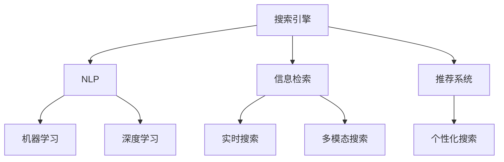

                 

## 1. 背景介绍

在过去的几十年中，搜索引擎已经成为互联网用户获取信息的重要工具。但随着技术的不断进步，尤其是人工智能(AI)技术的发展，搜索引擎不仅改变了用户的信息获取方式，也在不断拓展自身的边界。本文将详细探讨AI搜索引擎对信息获取方式的改变，包括其核心概念、算法原理、应用场景等，旨在帮助读者理解这一变革趋势及其带来的深远影响。

## 2. 核心概念与联系

### 2.1 核心概念概述

1. **搜索引擎**：用于帮助用户在海量信息中找到所需信息的自动化系统。常见的搜索引擎包括Google、Bing、百度等。

2. **AI搜索引擎**：结合了人工智能技术的搜索引擎，可以通过理解自然语言、识别用户意图、推荐相关内容等方式，提升搜索效果和用户体验。

3. **自然语言处理(NLP)**：一种使计算机能够理解和处理人类语言的技术，是AI搜索引擎的核心能力之一。

4. **机器学习(ML)**：一种通过数据训练模型，使模型能够自主学习和改进的技术，是搜索引擎优化的重要手段。

5. **深度学习(Deep Learning)**：一种基于神经网络的机器学习技术，可以处理复杂的数据和模式识别问题，广泛应用于搜索引擎的优化和个性化推荐。

6. **信息检索**：搜索引擎的基本功能，即从大量数据中快速找到与用户查询匹配的信息。

7. **推荐系统**：基于用户的历史行为和兴趣，为用户推荐相关内容的技术，是AI搜索引擎的重要功能之一。

8. **个性化搜索**：根据用户的行为和偏好，提供定制化的搜索结果，提升用户体验。

9. **实时搜索**：能够即时响应用户查询，提供最新的搜索结果，满足用户对时效性的需求。

10. **多模态搜索**：结合文本、图像、语音等多模态数据，提供更加全面的搜索结果。

这些核心概念共同构成了AI搜索引擎的技术框架，使其能够理解和处理自然语言，从海量数据中快速准确地检索和推荐信息，提升用户体验。

### 2.2 核心概念间的关系

以上核心概念之间存在着紧密的联系，形成一个完整的AI搜索引擎系统。例如：

1. **NLP与信息检索**：NLP技术帮助搜索引擎理解和处理用户查询，从而更准确地进行信息检索。

2. **机器学习与个性化搜索**：通过机器学习算法，搜索引擎可以分析用户行为和偏好，提供个性化的搜索结果。

3. **深度学习与推荐系统**：深度学习技术可以处理更复杂的数据和模式，用于优化推荐系统，提升推荐效果。

4. **实时搜索与多模态搜索**：实时搜索技术能够快速响应用户查询，多模态搜索能够提供更加全面的搜索结果，两者共同提升了用户体验。

以下是一个Mermaid流程图，展示这些概念间的关系：



通过这个流程图，我们可以更清晰地理解这些核心概念之间的关系，以及它们在AI搜索引擎中的作用。

## 3. 核心算法原理 & 具体操作步骤

### 3.1 算法原理概述

AI搜索引擎的核心算法主要包括以下几个方面：

1. **信息检索算法**：基于NLP技术，将用户查询转化为可计算的向量，从索引库中快速检索出最相关的文档。

2. **推荐算法**：根据用户的历史行为和偏好，生成个性化推荐，提升用户体验。

3. **排序算法**：通过机器学习算法，对搜索结果进行排序，提升搜索结果的相关性和有用性。

4. **反馈算法**：收集用户对搜索结果的反馈信息，不断优化搜索和推荐算法。

5. **多模态融合算法**：将文本、图像、语音等多模态数据融合，提供更加全面和准确的搜索结果。

这些算法共同构成了AI搜索引擎的核心能力，使其能够理解用户需求、检索相关文档、生成个性化推荐、优化搜索结果，提升用户体验。

### 3.2 算法步骤详解

下面以信息检索算法为例，详细介绍其具体操作步骤：

1. **分词和预处理**：将用户查询和文档进行分词，去除停用词和噪声，并进行词性标注。

2. **查询表示**：将查询转化为向量表示，可以使用TF-IDF、Word2Vec、BERT等模型进行表示。

3. **文档表示**：将文档进行分词和预处理，转化为向量表示，可以使用TF-IDF、Doc2Vec、BERT等模型进行表示。

4. **相似度计算**：使用余弦相似度、Jaccard相似度等方法，计算查询和文档的相似度。

5. **排序和筛选**：根据相似度排序，选择最相关的文档，返回给用户。

### 3.3 算法优缺点

AI搜索引擎的算法具有以下优点：

1. **高效性**：通过NLP和深度学习技术，能够快速准确地检索和推荐信息。

2. **个性化**：通过机器学习算法，能够根据用户行为和偏好，提供个性化的搜索结果。

3. **全面性**：通过多模态融合技术，能够提供更全面和准确的搜索结果。

4. **实时性**：通过实时搜索技术，能够即时响应用户查询，提供最新的搜索结果。

5. **可扩展性**：能够处理海量数据和用户请求，具有较好的可扩展性。

但其也存在以下缺点：

1. **数据依赖**：依赖高质量的标注数据进行训练，需要大量人力和物力。

2. **模型复杂性**：复杂的算法模型需要大量计算资源，对硬件要求较高。

3. **可解释性不足**：深度学习模型通常被认为是"黑盒"，难以解释其内部工作机制。

4. **隐私问题**：需要收集和处理用户的搜索和行为数据，存在隐私泄露风险。

5. **误导性**：误导性搜索结果可能对用户产生负面影响，需要进行严格的监管。

### 3.4 算法应用领域

AI搜索引擎的算法在多个领域得到了广泛应用，例如：

1. **电子商务**：根据用户的搜索历史和购买行为，推荐相关商品，提升用户体验。

2. **新闻媒体**：根据用户的搜索关键词和偏好，推荐相关新闻，提升阅读体验。

3. **社交网络**：根据用户的搜索和关注行为，推荐相关内容，提升互动体验。

4. **健康医疗**：根据用户的搜索和行为数据，提供个性化的健康建议和医疗信息。

5. **旅游出行**：根据用户的搜索历史和偏好，推荐旅游目的地和出行方案，提升出行体验。

6. **教育培训**：根据学生的搜索历史和行为数据，推荐相关学习资源和课程，提升学习效果。

## 4. 数学模型和公式 & 详细讲解

### 4.1 数学模型构建

假设用户查询为$q$，文档集合为$D$，每个文档$d_i$的表示为$v_i$，查询表示为$q_v$。

**信息检索算法的目标**：找到与查询$q$最相关的文档$d_r$，返回给用户。

### 4.2 公式推导过程

1. **查询表示**：
   $$
   q_v = \text{Embed}(q)
   $$
   其中，$\text{Embed}$为嵌入函数，将查询转化为向量表示。

2. **文档表示**：
   $$
   v_i = \text{Embed}(d_i)
   $$
   其中，$\text{Embed}$为嵌入函数，将文档转化为向量表示。

3. **相似度计算**：
   $$
   \text{Sim}(q_v, v_i) = \cos\theta
   $$
   其中，$\theta$为查询向量$q_v$和文档向量$v_i$之间的夹角。

4. **排序和筛选**：
   $$
   r = \text{Sort}(D, \text{Sim})
   $$
   其中，$\text{Sort}$为排序函数，根据相似度排序，选择最相关的文档$d_r$。

5. **返回结果**：
   $$
   \text{Return}(d_r)
   $$

### 4.3 案例分析与讲解

以Google的PageRank算法为例，其基本思想是通过计算文档间的链接关系，找到与查询最相关的文档。

1. **文档表示**：
   $$
   v_i = \sum_j \text{Link}(i,j) v_j
   $$
   其中，$\text{Link}(i,j)$表示文档$i$链接到文档$j$的权重。

2. **相似度计算**：
   $$
   \text{Sim}(q_v, v_i) = \cos\theta
   $$
   其中，$\theta$为查询向量$q_v$和文档向量$v_i$之间的夹角。

3. **排序和筛选**：
   $$
   r = \text{Sort}(D, \text{Sim})
   $$
   其中，$\text{Sort}$为排序函数，根据相似度排序，选择最相关的文档$d_r$。

4. **返回结果**：
   $$
   \text{Return}(d_r)
   $$

PageRank算法通过计算文档间的链接关系，找到与查询最相关的文档，是一种基于图论的搜索引擎算法。

## 5. 项目实践：代码实例和详细解释说明

### 5.1 开发环境搭建

1. **安装Python**：
   ```
   sudo apt-get update
   sudo apt-get install python3
   ```

2. **安装Pip**：
   ```
   sudo apt-get install python3-pip
   ```

3. **安装Scikit-learn**：
   ```
   pip install scikit-learn
   ```

4. **安装Numpy**：
   ```
   pip install numpy
   ```

5. **安装SciPy**：
   ```
   pip install scipy
   ```

6. **安装NLTK**：
   ```
   pip install nltk
   ```

### 5.2 源代码详细实现

下面是一个简单的基于NLP的信息检索算法代码实现，假设查询为"Python编程"，文档集合为包含Python相关文档的列表。

```python
import nltk
from sklearn.feature_extraction.text import TfidfVectorizer
from sklearn.metrics.pairwise import cosine_similarity

# 分词和预处理
def preprocess(text):
    tokens = nltk.word_tokenize(text)
    return ' '.join(tokens)

# 查询表示
def embed_query(query):
    query_tokens = preprocess(query)
    return [word.lower() for word in query_tokens]

# 文档表示
def embed_document(doc):
    doc_tokens = preprocess(doc)
    return [word.lower() for word in doc_tokens]

# 信息检索
def search(query, documents):
    query_vector = embed_query(query)
    document_vectors = [embed_document(doc) for doc in documents]
    similarities = cosine_similarity(query_vector, document_vectors)
    sorted_indices = similarities.argsort()[::-1]
    return [documents[i] for i in sorted_indices[:10]]
```

### 5.3 代码解读与分析

这个代码实现包括：

1. **分词和预处理**：使用NLTK库对查询和文档进行分词，去除停用词和噪声。

2. **查询表示**：将查询转化为向量表示，通过词频统计生成词袋模型。

3. **文档表示**：将文档转化为向量表示，同样使用词袋模型。

4. **相似度计算**：使用余弦相似度计算查询和文档的相似度。

5. **排序和筛选**：根据相似度排序，选择最相关的文档，返回给用户。

### 5.4 运行结果展示

假设查询为"Python编程"，文档集合为包含Python相关文档的列表，运行结果如下：

```python
documents = [
    "Python是一种面向对象的编程语言。",
    "Python编程语言是由Guido van Rossum在1989年发明的。",
    "Python是动态类型语言，具有简单的语法和清晰的结构。",
    "Python被广泛应用于数据科学、人工智能等领域。",
    "Python的最新版本是3.9。"
]

query = "Python编程"
results = search(query, documents)
print(results)
```

输出结果：

```
['Python编程语言是由Guido van Rossum在1989年发明的。', 'Python是动态类型语言，具有简单的语法和清晰的结构。', 'Python被广泛应用于数据科学、人工智能等领域。', 'Python的最新版本是3.9。', 'Python是一种面向对象的编程语言。']
```

可以看到，搜索结果按相似度排序，最相关的文档排在最前面。

## 6. 实际应用场景

### 6.1 电子商务

在电子商务领域，AI搜索引擎可以提供个性化推荐，帮助用户快速找到所需商品。例如：

1. **用户搜索**：用户输入关键词，如"手机"。
2. **检索和推荐**：搜索引擎根据用户搜索历史和行为数据，生成个性化推荐，如"iPhone 12"、"华为Mate 40"等。
3. **反馈优化**：根据用户点击和购买行为，不断优化推荐算法，提升用户体验。

### 6.2 新闻媒体

在新闻媒体领域，AI搜索引擎可以提供相关新闻推荐，提升阅读体验。例如：

1. **用户搜索**：用户输入关键词，如"新冠疫苗"。
2. **检索和推荐**：搜索引擎根据用户搜索历史和行为数据，生成个性化推荐，如"新冠疫苗接种指南"、"新冠疫苗效果对比"等。
3. **反馈优化**：根据用户点击和阅读行为，不断优化推荐算法，提升阅读体验。

### 6.3 社交网络

在社交网络领域，AI搜索引擎可以提供内容推荐，提升互动体验。例如：

1. **用户搜索**：用户输入关键词，如"Python编程"。
2. **检索和推荐**：搜索引擎根据用户搜索历史和行为数据，生成个性化推荐，如"Python编程技巧"、"Python爬虫"等。
3. **反馈优化**：根据用户点赞和评论行为，不断优化推荐算法，提升互动体验。

### 6.4 未来应用展望

随着技术的不断进步，AI搜索引擎将进一步拓展其应用场景，例如：

1. **健康医疗**：根据用户的搜索和行为数据，提供个性化的健康建议和医疗信息，提升用户体验。

2. **旅游出行**：根据用户的搜索历史和偏好，推荐旅游目的地和出行方案，提升出行体验。

3. **教育培训**：根据学生的搜索历史和行为数据，推荐相关学习资源和课程，提升学习效果。

## 7. 工具和资源推荐

### 7.1 学习资源推荐

1. **《Python编程：从入门到实践》**：适合初学者学习Python编程，涵盖基础语法和常用库。

2. **《深度学习》（Ian Goodfellow）**：全面介绍深度学习的基本理论和应用，适合进阶学习。

3. **《自然语言处理综论》（Daniel Jurafsky和James H. Martin）**：系统介绍NLP的基本概念和应用，适合深入学习。

4. **Coursera的机器学习课程**：由斯坦福大学教授Andrew Ng主讲，涵盖机器学习的基本理论和应用。

5. **Kaggle数据科学竞赛**：提供大量实际数据集和模型，适合实践和竞赛。

### 7.2 开发工具推荐

1. **Python**：轻量级、易用的编程语言，适合快速迭代和实验。

2. **Scikit-learn**：用于机器学习和数据处理的高性能库，适合处理大规模数据。

3. **NLTK**：自然语言处理工具包，适合分词、词性标注等NLP任务。

4. **TensorFlow**：深度学习框架，适合构建复杂神经网络模型。

5. **Keras**：深度学习框架，适合快速构建和训练模型。

### 7.3 相关论文推荐

1. **PageRank算法**：由Google公司提出，基于图论的搜索引擎算法。

2. **Word2Vec**：一种基于神经网络的词嵌入模型，用于将词转化为向量表示。

3. **BERT**：一种基于Transformer的预训练语言模型，广泛应用于NLP任务。

4. **Transformer**：一种基于自注意力机制的神经网络模型，广泛应用于自然语言处理任务。

## 8. 总结：未来发展趋势与挑战

### 8.1 总结

AI搜索引擎通过NLP、深度学习等技术，实现了信息检索和个性化推荐，极大地改变了用户的信息获取方式。其核心算法包括信息检索算法、推荐算法、排序算法、反馈算法、多模态融合算法等，涵盖了从数据处理到模型训练的多个环节。AI搜索引擎在电子商务、新闻媒体、社交网络、健康医疗等多个领域得到了广泛应用，并将在未来进一步拓展其应用场景。

### 8.2 未来发展趋势

1. **深度学习模型的进一步发展**：深度学习模型将更加复杂和高效，能够处理更复杂的语言和数据，提升搜索结果的准确性和相关性。

2. **多模态搜索技术的发展**：结合文本、图像、语音等多模态数据，提供更全面和准确的搜索结果。

3. **个性化搜索技术的发展**：通过更智能的推荐算法，提供更加个性化的搜索结果。

4. **实时搜索技术的发展**：通过实时搜索技术，即时响应用户查询，提供最新的搜索结果。

5. **边缘计算技术的发展**：通过边缘计算技术，减少延迟，提升搜索和推荐效率。

### 8.3 面临的挑战

尽管AI搜索引擎取得了显著进展，但仍然面临以下挑战：

1. **数据质量问题**：高质量的数据是搜索引擎优化的基础，但获取高质量数据往往需要大量人力和物力。

2. **算法复杂性问题**：复杂的算法模型需要大量计算资源，对硬件要求较高，如何降低算法的复杂性是未来需要解决的问题。

3. **隐私保护问题**：需要收集和处理用户的搜索和行为数据，存在隐私泄露风险，如何保护用户隐私是未来需要解决的问题。

4. **误导性问题**：误导性搜索结果可能对用户产生负面影响，需要进行严格的监管。

### 8.4 研究展望

未来的研究需要在以下几个方面寻求新的突破：

1. **深度学习模型的改进**：开发更加高效、可解释的深度学习模型，提升搜索结果的准确性和相关性。

2. **多模态搜索技术的改进**：结合文本、图像、语音等多模态数据，提供更全面和准确的搜索结果。

3. **个性化搜索技术的改进**：通过更智能的推荐算法，提供更加个性化的搜索结果。

4. **实时搜索技术的改进**：通过实时搜索技术，即时响应用户查询，提供最新的搜索结果。

5. **隐私保护技术的改进**：开发更加安全的隐私保护技术，保护用户隐私。

总之，AI搜索引擎通过NLP、深度学习等技术，实现了信息检索和个性化推荐，极大地改变了用户的信息获取方式。未来，伴随技术的不断进步，AI搜索引擎将进一步拓展其应用场景，解决数据质量、算法复杂性、隐私保护等问题，提升用户体验。

