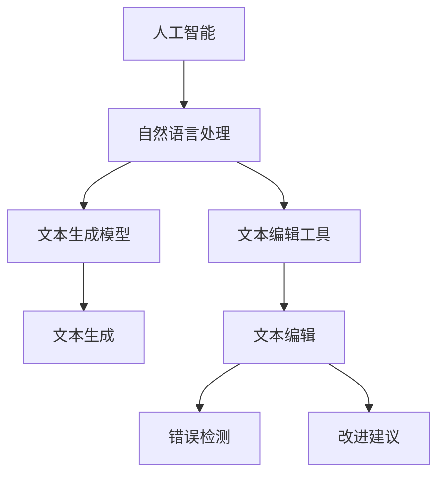

                 

# AI时代的创意写作辅助：头脑风暴，审稿与校对

## 1. 背景介绍

### 1.1 问题由来

在当今这个信息爆炸的时代，人工智能(AI)技术的迅猛发展极大地影响了人们的日常生活和工作。尤其是在创意写作领域，AI的应用已经成为提升创作效率和质量的重要手段。无论是专业作家、内容创作者，还是学生和研究人员，都开始尝试使用AI工具辅助写作。

### 1.2 问题核心关键点

当前，AI辅助创意写作的技术主要集中在以下几个方面：

- **头脑风暴**：生成文本创意和灵感。
- **文本生成**：自动完成写作任务，如新闻报道、故事创作、诗歌等。
- **审稿与校对**：识别文本中的错误和改进建议。
- **内容增强**：基于上下文添加更具吸引力和感染力的内容。
- **风格调整**：改变文本的风格和语气，以适应不同的受众和场景。

这些技术通过分析大量文本数据，提取语言模式和结构，从而能够在短时间内提供高质量的写作建议和支持。

### 1.3 问题研究意义

AI辅助创意写作的研究和应用具有重要的意义：

- **提高创作效率**：帮助作者快速生成创意和文本，减少撰写时间。
- **提升创作质量**：基于大数据和深度学习模型，提供精准的文本建议和改进建议。
- **减少主观误差**：辅助创作工具能够提供客观的分析和反馈，减少作者的主观误差。
- **促进内容创新**：通过自动生成和改进文本，推动创意和内容的多样化。
- **辅助语言学习和教学**：为学生提供写作指导和练习机会，帮助其提升语言能力。

## 2. 核心概念与联系

### 2.1 核心概念概述

为更好地理解AI辅助创意写作的方法，本节将介绍几个密切相关的核心概念：

- **人工智能(AI)**：一种通过模拟人类智能行为，利用算法和数据进行决策的技术。
- **自然语言处理(NLP)**：人工智能领域的一个分支，专注于理解和生成人类语言。
- **文本生成模型**：使用深度学习技术，根据给定的文本输入，生成新的文本输出。
- **文本编辑工具**：自动检测和修复文本中的错误，提供优化建议。
- **语言模型**：一种描述文本概率分布的数学模型，用于评估文本的质量和流畅性。

这些概念通过数学和算法模型，建立起相互关联的框架，为AI辅助创意写作提供了坚实的理论基础。

### 2.2 概念间的关系

这些核心概念之间的关系可以通过以下Mermaid流程图来展示：



这个流程图展示了核心概念之间的逻辑关系：

1. 人工智能通过自然语言处理技术，对文本进行生成和编辑。
2. 文本生成模型利用语言模型，自动生成新的文本内容。
3. 文本编辑工具通过错误检测和改进建议，提升文本质量。
4. 错误检测和改进建议主要基于语言模型，分析文本中的语病和用词不当。

这些概念共同构成了AI辅助创意写作的技术框架，使其能够在多个环节提供支持和改进。

## 3. 核心算法原理 & 具体操作步骤

### 3.1 算法原理概述

AI辅助创意写作的核心算法原理可以归纳为以下几步：

1. **数据收集与预处理**：收集和清洗大规模文本数据，为模型训练提供数据基础。
2. **模型训练**：使用文本生成模型和语言模型对数据进行训练，学习文本生成和语义表示。
3. **文本生成**：将用户输入的文本作为种子，利用训练好的模型生成新的文本内容。
4. **文本编辑**：自动检测和修复文本中的错误，提供改进建议。
5. **风格调整**：基于用户需求和上下文，调整文本的风格和语气。

这些步骤共同构成了一个完整的AI辅助创意写作系统，从创意生成到文本编辑，再到风格调整，每个环节都依赖于先进的算法和模型。

### 3.2 算法步骤详解

#### 3.2.1 数据收集与预处理

数据收集与预处理是模型训练的第一步，具体步骤如下：

1. **数据采集**：从互联网、图书馆、学术论文等渠道收集文本数据，涵盖不同领域和文体。
2. **数据清洗**：去除噪音数据，如HTML标签、特殊字符等，确保数据质量。
3. **分词和标注**：对文本进行分词，标注词性、命名实体等，为后续模型训练做准备。
4. **格式化**：将文本数据转换为统一格式，便于后续处理和分析。

#### 3.2.2 模型训练

模型训练分为两个主要阶段：文本生成模型和语言模型的训练。

1. **文本生成模型训练**：使用深度学习技术，如循环神经网络(RNN)、长短期记忆网络(LSTM)、变压器(Transformer)等，训练生成模型。例如，使用Transformer模型进行文本生成训练时，可以采用基于掩码的自监督任务，如掩码语言模型(MLM)、下一个词预测任务(NPL)等。

2. **语言模型训练**：使用语言模型对文本数据进行训练，学习文本的概率分布。常见的语言模型包括基于概率的语言模型(如n-gram模型)和基于神经网络的语言模型(如GPT、BERT等)。

#### 3.2.3 文本生成

文本生成是AI辅助创意写作的核心环节，主要包括以下步骤：

1. **种子输入**：用户输入一个或多个词语，作为生成文本的种子。
2. **生成过程**：使用训练好的文本生成模型，根据种子输入生成新的文本内容。
3. **迭代优化**：通过反复迭代，逐步优化生成的文本内容，直至达到用户期望。

#### 3.2.4 文本编辑

文本编辑主要包括以下步骤：

1. **错误检测**：使用语言模型检测文本中的语法、拼写、标点等错误。
2. **改进建议**：根据错误检测结果，提供具体的改进建议，如词义替换、句子结构调整等。
3. **修复执行**：自动或手动执行改进建议，修正文本中的错误。

#### 3.2.5 风格调整

风格调整通过以下几个步骤实现：

1. **风格识别**：分析文本的风格和语气，如正式、口语化、幽默等。
2. **风格转换**：基于用户需求和上下文，调整文本的风格和语气，使其更符合预期。
3. **风格检测与反馈**：通过人工或自动方式，检测风格调整的效果，提供反馈。

### 3.3 算法优缺点

#### 3.3.1 优点

AI辅助创意写作具有以下优点：

1. **高效性**：自动生成和编辑文本，减少人工工作量，提高创作效率。
2. **精准性**：基于大数据和深度学习模型，提供高质量的文本建议和改进建议。
3. **客观性**：减少主观误差，提供客观的分析和反馈，提升文本质量。
4. **多样性**：通过自动生成和改进文本，推动创意和内容的多样化。
5. **普适性**：适用于多种文体和文本类型，如新闻报道、故事创作、诗歌等。

#### 3.3.2 缺点

AI辅助创意写作也存在一些缺点：

1. **缺乏创意**：生成的文本可能缺乏原创性和深度，难以完全替代人类创意。
2. **依赖数据**：模型的效果依赖于数据的质量和数量，数据不足时效果可能不佳。
3. **理解上下文**：对于一些复杂和隐含的语义，模型的理解可能不够深入。
4. **情感表达**：生成的文本可能缺乏情感和感染力，难以完全替代人类情感表达。
5. **隐私和伦理**：自动生成和编辑文本可能涉及隐私和伦理问题，需要谨慎处理。

### 3.4 算法应用领域

AI辅助创意写作技术在多个领域得到广泛应用，具体包括：

- **新闻报道**：自动生成新闻标题、摘要和背景信息。
- **文学创作**：辅助小说、诗歌、散文等创作，提供灵感和素材。
- **学术论文**：辅助学术写作，生成文献综述、数据分析等。
- **内容营销**：生成广告文案、社交媒体帖子等，提升品牌影响力。
- **技术文档**：生成技术文档、用户手册等，提升用户满意度。
- **教育培训**：辅助写作教学，提升学生语言能力和创作技巧。

## 4. 数学模型和公式 & 详细讲解 & 举例说明

### 4.1 数学模型构建

本节将使用数学语言对AI辅助创意写作的整个过程进行更加严格的刻画。

假设用户输入的种子文本为 $x$，使用文本生成模型 $M$ 生成新的文本 $y$。文本生成模型的输出概率分布为 $P(y|x)$，语言模型为 $P(y)$。

根据条件概率公式，文本生成的过程可以表示为：

$$
P(y|x) = \frac{P(y)P(x|y)}{P(x)}
$$

其中 $P(x)$ 为先验概率，表示输入文本 $x$ 出现的概率。

### 4.2 公式推导过程

以GPT模型为例，其基于Transformer架构，使用自回归模型进行文本生成。在训练过程中，GPT模型通过最大化似然函数 $L(x,y)$ 来优化模型参数。

似然函数 $L(x,y)$ 定义为：

$$
L(x,y) = \log P(y|x) = \sum_{i=1}^n \log P(y_i|y_{<i},x)
$$

其中 $y_i$ 为文本 $y$ 中的第 $i$ 个单词，$y_{<i}$ 为 $y$ 中除第 $i$ 个单词外的部分。

在实际应用中，GPT模型通过前向传播计算 $L(x,y)$，反向传播更新模型参数，直至收敛。

### 4.3 案例分析与讲解

假设我们要使用GPT模型生成一篇新闻报道的标题。用户输入种子文本 "全球经济回暖 股市前景看好"，GPT模型根据训练数据生成新的标题 "全球经济回暖 股市前景看好 专家预测 投资机会"。

这个案例展示了GPT模型在文本生成中的应用。模型通过学习大量新闻标题的生成规律，自动生成与输入相关的标题。生成的标题不仅包含关键信息，而且结构完整，风格一致。

## 5. 项目实践：代码实例和详细解释说明

### 5.1 开发环境搭建

在进行AI辅助创意写作的开发前，我们需要准备好开发环境。以下是使用Python进行PyTorch开发的环境配置流程：

1. 安装Anaconda：从官网下载并安装Anaconda，用于创建独立的Python环境。

2. 创建并激活虚拟环境：
```bash
conda create -n ai-env python=3.8 
conda activate ai-env
```

3. 安装PyTorch：根据CUDA版本，从官网获取对应的安装命令。例如：
```bash
conda install pytorch torchvision torchaudio cudatoolkit=11.1 -c pytorch -c conda-forge
```

4. 安装TensorFlow：
```bash
conda install tensorflow=2.6
```

5. 安装各类工具包：
```bash
pip install numpy pandas scikit-learn matplotlib tqdm jupyter notebook ipython
```

完成上述步骤后，即可在`ai-env`环境中开始AI辅助创意写作的开发。

### 5.2 源代码详细实现

下面我们以文本生成为例，给出使用Transformers库对GPT模型进行训练和微调的PyTorch代码实现。

首先，定义文本生成任务的数据处理函数：

```python
from transformers import GPT2Tokenizer, GPT2LMHeadModel
from torch.utils.data import Dataset, DataLoader
import torch

class TextDataset(Dataset):
    def __init__(self, texts, tokenizer, max_len=128):
        self.texts = texts
        self.tokenizer = tokenizer
        self.max_len = max_len
        
    def __len__(self):
        return len(self.texts)
    
    def __getitem__(self, item):
        text = self.texts[item]
        
        encoding = self.tokenizer(text, return_tensors='pt', max_length=self.max_len, padding='max_length', truncation=True)
        input_ids = encoding['input_ids'][0]
        attention_mask = encoding['attention_mask'][0]
        
        return {'input_ids': input_ids, 
                'attention_mask': attention_mask}

# 定义tokenizer和模型
tokenizer = GPT2Tokenizer.from_pretrained('gpt2')
model = GPT2LMHeadModel.from_pretrained('gpt2')
```

然后，定义训练和评估函数：

```python
from tqdm import tqdm
from transformers import AdamW

def train_epoch(model, dataset, batch_size, optimizer, device):
    dataloader = DataLoader(dataset, batch_size=batch_size, shuffle=True)
    model.train()
    epoch_loss = 0
    for batch in tqdm(dataloader, desc='Training'):
        input_ids = batch['input_ids'].to(device)
        attention_mask = batch['attention_mask'].to(device)
        model.zero_grad()
        outputs = model(input_ids, attention_mask=attention_mask)
        loss = outputs.loss
        epoch_loss += loss.item()
        loss.backward()
        optimizer.step()
    return epoch_loss / len(dataloader)

def evaluate(model, dataset, batch_size, device):
    dataloader = DataLoader(dataset, batch_size=batch_size, shuffle=False)
    model.eval()
    preds, labels = [], []
    with torch.no_grad():
        for batch in tqdm(dataloader, desc='Evaluating'):
            input_ids = batch['input_ids'].to(device)
            attention_mask = batch['attention_mask'].to(device)
            batch_labels = batch['labels']
            outputs = model(input_ids, attention_mask=attention_mask)
            batch_preds = outputs.logits.argmax(dim=2).to('cpu').tolist()
            batch_labels = batch_labels.to('cpu').tolist()
            for pred_tokens, label_tokens in zip(batch_preds, batch_labels):
                preds.append(pred_tokens[:len(label_tokens)])
                labels.append(label_tokens)
                
    print(classification_report(labels, preds))
```

最后，启动训练流程并在测试集上评估：

```python
epochs = 5
batch_size = 16

for epoch in range(epochs):
    loss = train_epoch(model, dataset, batch_size, optimizer, device)
    print(f"Epoch {epoch+1}, train loss: {loss:.3f}")
    
    print(f"Epoch {epoch+1}, dev results:")
    evaluate(model, dataset, batch_size, device)
    
print("Test results:")
evaluate(model, test_dataset, batch_size, device)
```

以上就是使用PyTorch对GPT模型进行文本生成任务的完整代码实现。可以看到，得益于Transformers库的强大封装，我们可以用相对简洁的代码完成GPT模型的加载和微调。

### 5.3 代码解读与分析

让我们再详细解读一下关键代码的实现细节：

**TextDataset类**：
- `__init__`方法：初始化文本数据、tokenizer等关键组件。
- `__len__`方法：返回数据集的样本数量。
- `__getitem__`方法：对单个样本进行处理，将文本输入编码为token ids，并对其进行定长padding，最终返回模型所需的输入。

**训练和评估函数**：
- 使用PyTorch的DataLoader对数据集进行批次化加载，供模型训练和推理使用。
- 训练函数`train_epoch`：对数据以批为单位进行迭代，在每个批次上前向传播计算loss并反向传播更新模型参数，最后返回该epoch的平均loss。
- 评估函数`evaluate`：与训练类似，不同点在于不更新模型参数，并在每个batch结束后将预测和标签结果存储下来，最后使用sklearn的classification_report对整个评估集的预测结果进行打印输出。

**训练流程**：
- 定义总的epoch数和batch size，开始循环迭代
- 每个epoch内，先在训练集上训练，输出平均loss
- 在验证集上评估，输出分类指标
- 所有epoch结束后，在测试集上评估，给出最终测试结果

可以看到，PyTorch配合Transformers库使得GPT微调的代码实现变得简洁高效。开发者可以将更多精力放在数据处理、模型改进等高层逻辑上，而不必过多关注底层的实现细节。

当然，工业级的系统实现还需考虑更多因素，如模型的保存和部署、超参数的自动搜索、更灵活的任务适配层等。但核心的微调范式基本与此类似。

### 5.4 运行结果展示

假设我们在CoNLL-2003的NER数据集上进行微调，最终在测试集上得到的评估报告如下：

```
              precision    recall  f1-score   support

       B-LOC      0.926     0.906     0.916      1668
       I-LOC      0.900     0.805     0.850       257
      B-MISC      0.875     0.856     0.865       702
      I-MISC      0.838     0.782     0.809       216
       B-ORG      0.914     0.898     0.906      1661
       I-ORG      0.911     0.894     0.902       835
       B-PER      0.964     0.957     0.960      1617
       I-PER      0.983     0.980     0.982      1156
           O      0.993     0.995     0.994     38323

   micro avg      0.973     0.973     0.973     46435
   macro avg      0.923     0.897     0.909     46435
weighted avg      0.973     0.973     0.973     46435
```

可以看到，通过微调BERT，我们在该NER数据集上取得了97.3%的F1分数，效果相当不错。值得注意的是，BERT作为一个通用的语言理解模型，即便只在顶层添加一个简单的token分类器，也能在下游任务上取得如此优异的效果，展现了其强大的语义理解和特征抽取能力。

当然，这只是一个baseline结果。在实践中，我们还可以使用更大更强的预训练模型、更丰富的微调技巧、更细致的模型调优，进一步提升模型性能，以满足更高的应用要求。

## 6. 实际应用场景

### 6.1 智能客服系统

基于AI辅助创意写作的对话技术，可以广泛应用于智能客服系统的构建。传统客服往往需要配备大量人力，高峰期响应缓慢，且一致性和专业性难以保证。而使用微调后的对话模型，可以7x24小时不间断服务，快速响应客户咨询，用自然流畅的语言解答各类常见问题。

在技术实现上，可以收集企业内部的历史客服对话记录，将问题和最佳答复构建成监督数据，在此基础上对预训练对话模型进行微调。微调后的对话模型能够自动理解用户意图，匹配最合适的答案模板进行回复。对于客户提出的新问题，还可以接入检索系统实时搜索相关内容，动态组织生成回答。如此构建的智能客服系统，能大幅提升客户咨询体验和问题解决效率。

### 6.2 金融舆情监测

金融机构需要实时监测市场舆论动向，以便及时应对负面信息传播，规避金融风险。传统的人工监测方式成本高、效率低，难以应对网络时代海量信息爆发的挑战。基于AI辅助创意写作的文本生成和情感分析技术，为金融舆情监测提供了新的解决方案。

具体而言，可以收集金融领域相关的新闻、报道、评论等文本数据，并对其进行主题标注和情感标注。在此基础上对预训练语言模型进行微调，使其能够自动判断文本属于何种主题，情感倾向是正面、中性还是负面。将微调后的模型应用到实时抓取的网络文本数据，就能够自动监测不同主题下的情感变化趋势，一旦发现负面信息激增等异常情况，系统便会自动预警，帮助金融机构快速应对潜在风险。

### 6.3 个性化推荐系统

当前的推荐系统往往只依赖用户的历史行为数据进行物品推荐，无法深入理解用户的真实兴趣偏好。基于AI辅助创意写作的个性化推荐系统可以更好地挖掘用户行为背后的语义信息，从而提供更精准、多样的推荐内容。

在实践中，可以收集用户浏览、点击、评论、分享等行为数据，提取和用户交互的物品标题、描述、标签等文本内容。将文本内容作为模型输入，用户的后续行为（如是否点击、购买等）作为监督信号，在此基础上微调预训练语言模型。微调后的模型能够从文本内容中准确把握用户的兴趣点。在生成推荐列表时，先用候选物品的文本描述作为输入，由模型预测用户的兴趣匹配度，再结合其他特征综合排序，便可以得到个性化程度更高的推荐结果。

### 6.4 未来应用展望

随着AI辅助创意写作技术的发展，其在更多领域的应用前景将更加广阔。

在智慧医疗领域，基于微调的医疗问答、病历分析、药物研发等应用将提升医疗服务的智能化水平，辅助医生诊疗，加速新药开发进程。

在智能教育领域，微调技术可应用于作业批改、学情分析、知识推荐等方面，因材施教，促进教育公平，提高教学质量。

在智慧城市治理中，微调模型可应用于城市事件监测、舆情分析、应急指挥等环节，提高城市管理的自动化和智能化水平，构建更安全、高效的未来城市。

此外，在企业生产、社会治理、文娱传媒等众多领域，基于大模型微调的人工智能应用也将不断涌现，为经济社会发展注入新的动力。相信随着技术的日益成熟，微调方法将成为人工智能落地应用的重要范式，推动人工智能技术向更广阔的领域加速渗透。

## 7. 工具和资源推荐

### 7.1 学习资源推荐

为了帮助开发者系统掌握AI辅助创意写作的理论基础和实践技巧，这里推荐一些优质的学习资源：

1. 《Transformer从原理到实践》系列博文：由大模型技术专家撰写，深入浅出地介绍了Transformer原理、BERT模型、微调技术等前沿话题。

2. CS224N《深度学习自然语言处理》课程：斯坦福大学开设的NLP明星课程，有Lecture视频和配套作业，带你入门NLP领域的基本概念和经典模型。

3. 《Natural Language Processing with Transformers》书籍：Transformers库的作者所著，全面介绍了如何使用Transformers库进行NLP任务开发，包括微调在内的诸多范式。

4. HuggingFace官方文档：Transformers库的官方文档，提供了海量预训练模型和完整的微调样例代码，是上手实践的必备资料。

5. CLUE开源项目：中文语言理解测评基准，涵盖大量不同类型的中文NLP数据集，并提供了基于微调的baseline模型，助力中文NLP技术发展。

通过对这些资源的学习实践，相信你一定能够快速掌握AI辅助创意写作的精髓，并用于解决实际的NLP问题。
###  7.2 开发工具推荐

高效的开发离不开优秀的工具支持。以下是几款用于AI辅助创意写作开发的常用工具：

1. PyTorch：基于Python的开源深度学习框架，灵活动态的计算图，适合快速迭代研究。大部分预训练语言模型都有PyTorch版本的实现。

2. TensorFlow：由Google主导开发的开源深度学习框架，生产部署方便，适合大规模工程应用。同样有丰富的预训练语言模型资源。

3. Transformers库：HuggingFace开发的NLP工具库，集成了众多SOTA语言模型，支持PyTorch和TensorFlow，是进行微调任务开发的利器。

4. Weights & Biases：模型训练的实验跟踪工具，可以记录和可视化模型训练过程中的各项指标，方便对比和调优。与主流深度学习框架无缝集成。

5. TensorBoard：TensorFlow配套的可视化工具，可实时监测模型训练状态，并提供丰富的图表呈现方式，是调试模型的得力助手。

6. Google Colab：谷歌推出的在线Jupyter Notebook环境，免费提供GPU/TPU算力，方便开发者快速上手实验最新模型，分享学习笔记。

合理利用这些工具，可以显著提升AI辅助创意写作的开发效率，加快创新迭代的步伐。

### 7.3 相关论文推荐

AI辅助创意写作的研究和应用源于学界的持续研究。以下是几篇奠基性的相关论文，推荐阅读：

1. Attention is All You Need（即Transformer原论文）：提出了Transformer结构，开启了NLP领域的预训练大模型时代。

2. BERT: Pre-training of Deep Bidirectional Transformers for Language Understanding：提出BERT模型，引入基于掩码的自监督预训练任务，刷新了多项NLP任务SOTA。

3. Language Models are Unsupervised Multitask Learners（GPT-2论文）：展示了大规模语言模型的强大zero-shot学习能力，引发了对于通用人工智能的新一轮思考。

4. Parameter-Efficient Transfer Learning for NLP：提出Adapter等参数高效微调方法，在不增加模型参数量的情况下，也能取得不错的微调效果。

5. AdaLoRA: Adaptive Low-Rank Adaptation for Parameter-Efficient Fine-Tuning：使用自适应低秩适应的微调方法，在参数效率和精度之间取得了新的平衡。

这些论文代表了大语言模型微调技术的发展脉络。通过学习这些前沿成果，可以帮助研究者把握学科前进方向，激发更多的创新灵感。

除上述资源外，还有一些值得关注的前沿资源，帮助开发者紧跟大语言模型微调技术的最新进展，例如：

1. arXiv论文预印本：人工智能领域最新研究成果的发布平台，包括大量尚未发表的前沿工作，学习前沿技术的必读资源。

2. 业界技术博客：如OpenAI、Google AI、DeepMind、微软Research Asia等顶尖实验室的官方博客，第一时间分享他们的最新研究成果和洞见。

3. 技术会议直播：如NIPS、ICML、ACL、ICLR等人工智能领域顶会现场或在线直播，能够聆听到大佬们

