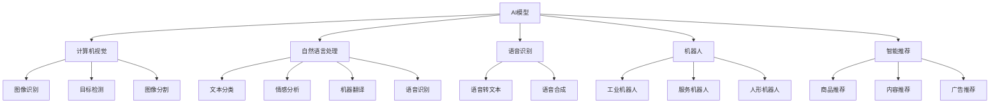

                 

# AI模型在现实世界中的实际应用

> 关键词：AI模型，现实世界应用，深度学习，计算机视觉，自然语言处理，语音识别，机器人

## 1. 背景介绍

### 1.1 问题由来
随着人工智能技术的快速发展，AI模型已经广泛应用于各个领域，包括医疗、金融、教育、制造、交通、安全、能源等。AI模型的应用不仅提高了生产效率、改善了用户体验，还推动了产业升级和经济增长。然而，在实际应用中，AI模型也面临诸多挑战，如数据质量、模型泛化、算法可解释性、伦理道德等问题。因此，本文旨在探讨AI模型在现实世界中的实际应用，并分析其面临的挑战和未来发展方向。

### 1.2 问题核心关键点
AI模型在现实世界中的应用，主要集中在以下几个方面：
1. **计算机视觉**：如图像识别、目标检测、图像分割等，广泛应用于安防监控、智能制造、自动驾驶等领域。
2. **自然语言处理**：如文本分类、情感分析、机器翻译、语音识别等，广泛应用于智能客服、智能写作、智能翻译、智能助手等。
3. **语音识别**：如语音转文本、语音合成、语音识别等，广泛应用于智能家居、智能音箱、语音助手等。
4. **机器人**：如工业机器人、服务机器人、人形机器人等，广泛应用于制造业、服务业、医疗等领域。
5. **智能推荐**：如商品推荐、内容推荐、广告推荐等，广泛应用于电商、社交网络、新闻平台等领域。

## 2. 核心概念与联系

### 2.1 核心概念概述

为更好地理解AI模型在现实世界中的应用，本节将介绍几个密切相关的核心概念：

- **AI模型**：指通过深度学习、强化学习等技术训练得到的模型，能够自动学习数据特征和模式，实现高效的数据处理和决策能力。
- **计算机视觉**：指使用计算机算法处理、分析和理解视觉信息的领域，如图像识别、目标检测、图像分割等。
- **自然语言处理**：指使用计算机算法处理、分析和理解自然语言的领域，如文本分类、情感分析、机器翻译、语音识别等。
- **语音识别**：指将人类语音转换为文本的领域，广泛应用于智能家居、语音助手等。
- **机器人**：指模拟人类行为的智能机器，广泛应用于工业制造、服务业、医疗等领域。
- **智能推荐**：指通过机器学习算法为用户推荐个性化内容的领域，广泛应用于电商、社交网络、新闻平台等。

这些核心概念之间的逻辑关系可以通过以下Mermaid流程图来展示：



这个流程图展示了这个核心概念的逻辑关系，帮助我们更好地理解AI模型在现实世界中的不同应用。

### 2.2 概念间的关系

这些核心概念之间存在着紧密的联系，形成了AI模型在现实世界中的完整生态系统。下面我通过几个Mermaid流程图来展示这些概念之间的关系。

#### 2.2.1 AI模型在计算机视觉中的应用


这个流程图展示了AI模型在计算机视觉中的应用，从图像识别到目标检测和图像分割。

#### 2.2.2 AI模型在自然语言处理中的应用


这个流程图展示了AI模型在自然语言处理中的应用，从文本分类到情感分析和机器翻译，最终到语音识别。

#### 2.2.3 AI模型在语音识别中的应用


这个流程图展示了AI模型在语音识别中的应用，从语音转文本到语音合成。

#### 2.2.4 AI模型在机器人中的应用


这个流程图展示了AI模型在机器人中的应用，从工业机器人到服务和人形机器人。

#### 2.2.5 AI模型在智能推荐中的应用


这个流程图展示了AI模型在智能推荐中的应用，从商品推荐到内容广告推荐。

## 3. 核心算法原理 & 具体操作步骤
### 3.1 算法原理概述

AI模型在现实世界中的应用，主要基于深度学习和强化学习技术。深度学习通过构建多层神经网络，自动学习数据特征和模式，实现高效的数据处理和决策能力。强化学习则通过智能体与环境的交互，通过奖励信号逐步优化决策策略。

### 3.2 算法步骤详解

以下是AI模型在现实世界中的具体应用步骤：

**Step 1: 数据准备**
- 收集数据集，并进行预处理，如数据清洗、特征提取、数据增强等。
- 将数据集划分为训练集、验证集和测试集。

**Step 2: 模型选择与设计**
- 选择适合的深度学习或强化学习模型架构。
- 设计模型损失函数、优化器、正则化技术等。

**Step 3: 模型训练**
- 使用训练集对模型进行前向传播和反向传播，更新模型参数。
- 使用验证集评估模型性能，防止过拟合。
- 根据模型性能，调整超参数。

**Step 4: 模型评估与优化**
- 在测试集上评估模型性能，如准确率、召回率、F1分数等。
- 根据评估结果，进行模型优化，如调整模型结构、优化超参数、增加数据增强等。

**Step 5: 模型部署与维护**
- 将模型部署到生产环境，实现实时推理和预测。
- 定期监控模型性能，进行模型复训和更新。

### 3.3 算法优缺点

AI模型在现实世界中的应用，具有以下优点：
1. 高效数据处理：AI模型能够自动学习数据特征和模式，实现高效的数据处理和决策能力。
2. 精准预测与决策：通过深度学习和强化学习，AI模型能够实现精准的预测和决策。
3. 泛化能力强：AI模型能够适应不同场景和任务，具有较强的泛化能力。
4. 自动化与智能化：AI模型能够自动完成复杂任务，提高生产效率和用户体验。

同时，AI模型也存在以下缺点：
1. 数据质量依赖：AI模型需要大量高质量的数据进行训练，数据质量直接影响模型性能。
2. 模型复杂度高：AI模型通常具有高复杂度，需要大量计算资源进行训练和推理。
3. 可解释性不足：AI模型往往是"黑盒"系统，难以解释其内部工作机制和决策逻辑。
4. 伦理道德问题：AI模型可能存在偏见、歧视等问题，需要严格监管和约束。

### 3.4 算法应用领域

AI模型在现实世界中的应用领域非常广泛，包括但不限于以下几个方面：

- **医疗**：如医学影像分析、病理诊断、疾病预测等。
- **金融**：如信用评估、风险管理、市场分析等。
- **制造**：如质量检测、设备维护、供应链管理等。
- **交通**：如自动驾驶、智能交通管理、车联网等。
- **能源**：如能源管理、智能电网、环境监测等。
- **安全**：如网络安全、反欺诈、公共安全等。
- **教育**：如智能教育、在线学习、教育数据分析等。
- **农业**：如精准农业、作物识别、病虫害预测等。

## 4. 数学模型和公式 & 详细讲解 & 举例说明

### 4.1 数学模型构建

AI模型在现实世界中的应用，主要基于深度学习和强化学习技术。深度学习模型通常包含多层神经网络，每一层由若干神经元组成，神经元之间通过权重和偏置进行连接。模型的输入为原始数据，经过若干层的处理，最终输出为预测结果或决策策略。

**公式推导过程**

以卷积神经网络（CNN）为例，其数学模型可以表示为：

$$
y = f(Wx + b)
$$

其中，$y$为输出结果，$x$为输入数据，$W$为权重矩阵，$b$为偏置向量，$f$为激活函数。

在训练过程中，使用反向传播算法计算梯度，更新模型参数。梯度的计算公式为：

$$
\frac{\partial L}{\partial w_{ij}} = \frac{\partial L}{\partial y} \cdot \frac{\partial y}{\partial x_i} \cdot \frac{\partial x_i}{\partial w_{ij}}
$$

其中，$L$为损失函数，$w_{ij}$为权重矩阵中第$i$行第$j$列元素，$y$为输出结果，$x_i$为输入数据。

### 4.2 案例分析与讲解

以图像识别为例，CNN模型可以通过多个卷积层和池化层，自动学习图像特征，并将特征映射为最终的分类结果。

**数学公式**

卷积层的计算公式为：

$$
\begin{bmatrix}
o_{1,1} & o_{1,2} & o_{1,3} \\
o_{2,1} & o_{2,2} & o_{2,3} \\
o_{3,1} & o_{3,2} & o_{3,3} \\
\end{bmatrix}
=
\begin{bmatrix}
f_{1,1} & f_{1,2} & f_{1,3} \\
f_{2,1} & f_{2,2} & f_{2,3} \\
f_{3,1} & f_{3,2} & f_{3,3} \\
\end{bmatrix}
\ast
\begin{bmatrix}
w_{1,1} & w_{1,2} & w_{1,3} \\
w_{2,1} & w_{2,2} & w_{2,3} \\
w_{3,1} & w_{3,2} & w_{3,3} \\
\end{bmatrix}
+
\begin{bmatrix}
b_{1,1} & b_{1,2} & b_{1,3} \\
b_{2,1} & b_{2,2} & b_{2,3} \\
b_{3,1} & b_{3,2} & b_{3,3} \\
\end{bmatrix}
$$

其中，$f_{ij}$为卷积核函数，$w_{ij}$为卷积核权重，$b_{ij}$为卷积核偏置。

## 5. 项目实践：代码实例和详细解释说明

### 5.1 开发环境搭建

在进行AI模型在现实世界中的应用实践前，我们需要准备好开发环境。以下是使用Python进行TensorFlow开发的环境配置流程：

1. 安装Anaconda：从官网下载并安装Anaconda，用于创建独立的Python环境。

2. 创建并激活虚拟环境：
```bash
conda create -n tf-env python=3.8 
conda activate tf-env
```

3. 安装TensorFlow：根据CUDA版本，从官网获取对应的安装命令。例如：
```bash
conda install tensorflow=2.4 tensorflow-cpu
```

4. 安装各类工具包：
```bash
pip install numpy pandas scikit-learn matplotlib tqdm jupyter notebook ipython
```

完成上述步骤后，即可在`tf-env`环境中开始AI模型在现实世界中的应用实践。

### 5.2 源代码详细实现

这里我们以图像识别任务为例，给出使用TensorFlow对卷积神经网络（CNN）进行训练的Python代码实现。

首先，定义CNN模型：

```python
import tensorflow as tf
from tensorflow.keras.layers import Conv2D, MaxPooling2D, Flatten, Dense

model = tf.keras.Sequential([
    Conv2D(32, (3, 3), activation='relu', input_shape=(28, 28, 1)),
    MaxPooling2D((2, 2)),
    Conv2D(64, (3, 3), activation='relu'),
    MaxPooling2D((2, 2)),
    Conv2D(64, (3, 3), activation='relu'),
    Flatten(),
    Dense(64, activation='relu'),
    Dense(10, activation='softmax')
])
```

接着，定义训练和评估函数：

```python
from tensorflow.keras.datasets import mnist
from tensorflow.keras.utils import to_categorical
import numpy as np

# 加载数据集
(x_train, y_train), (x_test, y_test) = mnist.load_data()

# 数据预处理
x_train = x_train.reshape(-1, 28, 28, 1).astype('float32') / 255.0
x_test = x_test.reshape(-1, 28, 28, 1).astype('float32') / 255.0
y_train = to_categorical(y_train)
y_test = to_categorical(y_test)

# 定义训练函数
def train(model, x_train, y_train, batch_size, epochs):
    model.compile(optimizer='adam', loss='categorical_crossentropy', metrics=['accuracy'])
    model.fit(x_train, y_train, batch_size=batch_size, epochs=epochs, validation_data=(x_test, y_test))

# 定义评估函数
def evaluate(model, x_test, y_test):
    loss, accuracy = model.evaluate(x_test, y_test, verbose=0)
    print(f'Test accuracy: {accuracy:.2f}')
```

最后，启动训练流程并在测试集上评估：

```python
batch_size = 64
epochs = 10

train(model, x_train, y_train, batch_size, epochs)
evaluate(model, x_test, y_test)
```

以上就是使用TensorFlow对CNN进行图像识别任务训练的完整代码实现。可以看到，得益于TensorFlow的强大封装，我们可以用相对简洁的代码完成CNN模型的训练和评估。

### 5.3 代码解读与分析

让我们再详细解读一下关键代码的实现细节：

**CNN模型定义**

```python
import tensorflow as tf
from tensorflow.keras.layers import Conv2D, MaxPooling2D, Flatten, Dense

model = tf.keras.Sequential([
    Conv2D(32, (3, 3), activation='relu', input_shape=(28, 28, 1)),
    MaxPooling2D((2, 2)),
    Conv2D(64, (3, 3), activation='relu'),
    MaxPooling2D((2, 2)),
    Conv2D(64, (3, 3), activation='relu'),
    Flatten(),
    Dense(64, activation='relu'),
    Dense(10, activation='softmax')
])
```

这个代码片段定义了一个包含三个卷积层、两个池化层、两个全连接层的CNN模型。其中，`Conv2D`用于定义卷积层，`MaxPooling2D`用于定义池化层，`Flatten`用于将多维张量展平，`Dense`用于定义全连接层。

**数据预处理**

```python
from tensorflow.keras.datasets import mnist
from tensorflow.keras.utils import to_categorical
import numpy as np

# 加载数据集
(x_train, y_train), (x_test, y_test) = mnist.load_data()

# 数据预处理
x_train = x_train.reshape(-1, 28, 28, 1).astype('float32') / 255.0
x_test = x_test.reshape(-1, 28, 28, 1).astype('float32') / 255.0
y_train = to_categorical(y_train)
y_test = to_categorical(y_test)
```

这个代码片段对MNIST数据集进行了预处理，包括将数据集reshape为符合模型输入形状的数据、将数据转换为float32类型并归一化，以及将标签转换为one-hot编码。

**训练函数**

```python
from tensorflow.keras.datasets import mnist
from tensorflow.keras.utils import to_categorical
import numpy as np

# 加载数据集
(x_train, y_train), (x_test, y_test) = mnist.load_data()

# 数据预处理
x_train = x_train.reshape(-1, 28, 28, 1).astype('float32') / 255.0
x_test = x_test.reshape(-1, 28, 28, 1).astype('float32') / 255.0
y_train = to_categorical(y_train)
y_test = to_categorical(y_test)

# 定义训练函数
def train(model, x_train, y_train, batch_size, epochs):
    model.compile(optimizer='adam', loss='categorical_crossentropy', metrics=['accuracy'])
    model.fit(x_train, y_train, batch_size=batch_size, epochs=epochs, validation_data=(x_test, y_test))
```

这个代码片段定义了一个训练函数，使用`compile`方法配置模型优化器、损失函数和评估指标，使用`fit`方法进行模型训练，并在验证集上评估模型性能。

**评估函数**

```python
from tensorflow.keras.datasets import mnist
from tensorflow.keras.utils import to_categorical
import numpy as np

# 加载数据集
(x_train, y_train), (x_test, y_test) = mnist.load_data()

# 数据预处理
x_train = x_train.reshape(-1, 28, 28, 1).astype('float32') / 255.0
x_test = x_test.reshape(-1, 28, 28, 1).astype('float32') / 255.0
y_train = to_categorical(y_train)
y_test = to_categorical(y_test)

# 定义评估函数
def evaluate(model, x_test, y_test):
    loss, accuracy = model.evaluate(x_test, y_test, verbose=0)
    print(f'Test accuracy: {accuracy:.2f}')
```

这个代码片段定义了一个评估函数，使用`evaluate`方法评估模型在测试集上的性能，并打印出测试准确率。

**训练与评估流程**

```python
batch_size = 64
epochs = 10

train(model, x_train, y_train, batch_size, epochs)
evaluate(model, x_test, y_test)
```

这个代码片段启动了模型训练和评估流程，定义了训练和评估的超参数，并调用训练函数和评估函数进行模型训练和评估。

## 6. 实际应用场景

### 6.1 医疗影像分析

医疗影像分析是AI模型在现实世界中的重要应用之一。AI模型可以自动分析医疗影像数据，进行疾病诊断和预测，辅助医生进行诊疗决策。

以医学影像分类为例，AI模型可以对肺部CT、乳腺X光片等影像进行分类，判断是否有病变、病变的类型和严重程度。通过深度学习技术，AI模型可以自动学习影像特征，实现高精度的影像分类。

### 6.2 金融信用评估

金融信用评估是AI模型在金融领域的重要应用之一。AI模型可以通过分析用户的交易记录、社交网络等数据，评估用户的信用风险，为金融机构提供信贷决策支持。

以信用评分为例，AI模型可以对用户的还款能力、还款意愿等进行分析，并给出信用评分。通过深度学习技术，AI模型可以自动学习用户的特征，并根据历史数据进行预测。

### 6.3 工业设备维护

工业设备维护是AI模型在制造业的重要应用之一。AI模型可以自动分析设备的运行数据，进行故障诊断和预测维护，减少设备停机时间，提高生产效率。

以设备故障诊断为例，AI模型可以对设备的振动、温度、电流等数据进行分析，判断设备是否存在故障。通过深度学习技术，AI模型可以自动学习设备的运行特征，并根据历史数据进行故障预测。

### 6.4 自动驾驶

自动驾驶是AI模型在交通领域的重要应用之一。AI模型可以通过分析道路环境、车辆状态等数据，自动控制车辆行驶，实现自动驾驶。

以路径规划为例，AI模型可以对道路环境进行感知和理解，并自动生成最优路径。通过深度学习技术，AI模型可以自动学习道路环境特征，并根据当前状态进行路径规划。

### 6.5 智能推荐系统

智能推荐系统是AI模型在电商、社交网络等领域的重要应用之一。AI模型可以通过分析用户行为、商品特征等数据，为用户推荐个性化内容，提高用户满意度和忠诚度。

以商品推荐为例，AI模型可以根据用户的浏览、点击、购买等行为数据，自动推荐相关的商品。通过深度学习技术，AI模型可以自动学习用户和商品特征，并根据历史数据进行推荐。

## 7. 工具和资源推荐
### 7.1 学习资源推荐

为了帮助开发者系统掌握AI模型在现实世界中的应用理论基础和实践技巧，这里推荐一些优质的学习资源：

1. 《深度学习》（Ian Goodfellow、Yoshua Bengio、Aaron Courville著）：全面介绍了深度学习的基本概念和算法，是深度学习领域的经典教材。

2. 《TensorFlow官方文档》：TensorFlow的官方文档，提供了丰富的API文档、案例和教程，是TensorFlow学习的必备资源。

3. 《PyTorch官方文档》：PyTorch的官方文档，提供了丰富的API文档、案例和教程，是PyTorch学习的必备资源。

4. 《自然语言处理综述》（Yoshua Bengio著）：全面介绍了自然语言处理的基本概念和算法，是自然语言处理领域的经典教材。

5. 《计算机视觉：算法与应用》（Richard Szeliski著）：全面介绍了计算机视觉的基本概念和算法，是计算机视觉学习的必备资源。

6. 《机器学习实战》（Peter Harrington著）：介绍了机器学习的基本概念和算法，并提供了大量代码示例，是机器学习学习的必备资源。

通过对这些资源的学习实践，相信你一定能够快速掌握AI模型在现实世界中的应用精髓，并用于解决实际的AI问题。
###  7.2 开发工具推荐

高效的开发离不开优秀的工具支持。以下是几款用于AI模型在现实世界中的应用开发的常用工具：

1. TensorFlow：由Google主导开发的开源深度学习框架，生产部署方便，适合大规模工程应用。

2. PyTorch：基于Python的开源深度学习框架，灵活动态的计算图，适合快速迭代研究。

3. Scikit-learn：Python机器学习库，提供了丰富的机器学习算法和工具，适合数据预处理和特征工程。

4. Weights & Biases：模型训练的实验跟踪工具，可以记录和可视化模型训练过程中的各项指标，方便对比和调优。

5. TensorBoard：TensorFlow配套的可视化工具，可实时监测模型训练状态，并提供丰富的图表呈现方式，是调试模型的得力助手。

6. Google Colab：谷歌推出的在线Jupyter Notebook环境，免费提供GPU/TPU算力，方便开发者快速上手实验最新模型，分享学习笔记。

合理利用这些工具，可以显著提升AI模型在现实世界中的应用开发效率，加快创新迭代的步伐。

### 7.3 相关论文推荐

AI模型在现实世界中的应用涉及诸多前沿领域，以下是几篇奠基性的相关论文，推荐阅读：

1. AlphaGo：DeepMind开发的围棋AI模型，展示了深度学习在复杂决策问题中的应用。

2. ImageNet：大规模图像识别数据集，展示了深度学习在计算机视觉中的应用。

3. Google Inbox：Google开发的智能邮箱系统，展示了深度学习在自然语言处理中的应用。

4. AlphaStar：OpenAI开发的星际争霸AI模型，展示了深度学习在游戏AI中的应用。

5. T5：Google开发的预训练语言模型，展示了深度学习在自然语言生成中的应用。

6. OpenAI Gym：OpenAI开发的智能体与环境交互平台，展示了深度学习在强化学习中的应用。

这些论文代表了大语言模型在现实世界中的应用发展脉络。通过学习这些前沿成果，可以帮助研究者把握学科前进方向，激发更多的创新灵感。

除上述资源外，还有一些值得关注的前沿资源，帮助开发者紧跟大语言模型在现实世界中的应用最新进展，例如：

1. arXiv论文预印本：人工智能领域最新研究成果的发布平台，包括大量尚未发表的前沿工作，学习前沿技术的必读资源。

2. 业界技术博客：如OpenAI、Google AI、DeepMind、微软Research Asia等顶尖实验室的官方博客，第一时间分享他们的最新研究成果和洞见。

3. 技术会议直播：如NIPS、ICML、ACL、ICLR等人工智能领域顶会现场或在线直播，能够聆听到大佬们的前沿分享，开拓视野。

4. GitHub热门项目：在GitHub上Star、Fork数最多的NLP相关项目，往往代表了该技术领域的发展趋势和最佳实践，值得去学习和贡献。

5. 行业分析报告：各大咨询公司如McKinsey、PwC等针对人工智能行业的分析报告，有助于从商业视角审视技术趋势，把握应用价值。

总之，对于AI模型在现实世界中的应用的学习和实践，需要开发者保持开放的心态和持续学习的意愿。多关注前沿资讯，多动手实践，多思考总结，必将收获满满的成长收益。

## 8. 总结：未来发展趋势与挑战

### 8.1 总结

本文对AI模型在现实世界中的实际应用进行了全面系统的介绍。首先阐述了AI模型在各个

