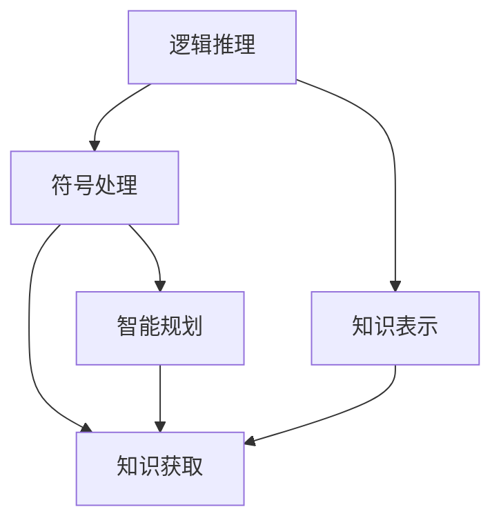

                 

# 人工智能的早期研究方向

## 1. 背景介绍

### 1.1 问题由来

人工智能(AI)作为21世纪最具革命性的技术之一，其研究历史可以追溯到20世纪初。早期人工智能的研究受到数学逻辑、心理学、计算机科学等多学科的启发，旨在赋予机器类似人类的智能，以解决复杂的问题。早期的AI研究方向涉及了逻辑推理、符号处理、知识表示等核心领域。

### 1.2 问题核心关键点

早期的AI研究方向致力于探索机器如何模拟人类的推理、学习和决策能力。这包括：
- 逻辑推理：构建形式化的推理规则，使机器能够进行逻辑推断。
- 符号处理：使用符号表示法来表示和操作知识。
- 知识表示：将知识编码为可计算的形式，支持推理和决策。
- 知识获取：自动或半自动地获取知识，减少人工干预。
- 智能规划：设计算法使机器能够制定行动计划。

这些研究方向旨在构建通用智能系统，能够处理复杂任务，甚至具有自主学习和适应新环境的能力。

### 1.3 问题研究意义

早期的AI研究具有深远的理论意义和实际应用价值：
- 理论研究：为人工智能的原理和机制提供基础理论支撑。
- 应用前景：推动了自动化、机器人、自然语言处理、计算机视觉等多个领域的技术进步。
- 创新驱动：促进了更多跨学科融合，为未来的AI技术发展奠定了基础。
- 社会影响：提升了机器的智能化水平，促进了智能时代的到来。

## 2. 核心概念与联系

### 2.1 核心概念概述

为了更好地理解早期AI研究，本节将介绍几个核心概念：

- 逻辑推理：通过形式化的逻辑规则，使机器能够进行符号推理，支持复杂问题的求解。
- 符号处理：使用符号表示法，如命题逻辑、谓词逻辑等，来表示和处理知识。
- 知识表示：将知识编码为可计算的形式，支持推理和决策，如谓词逻辑、框架表示法等。
- 知识获取：自动或半自动地获取知识，减少人工干预，如专家系统、知识工程等。
- 智能规划：设计算法使机器能够制定行动计划，如规划算法、策略搜索等。

这些核心概念构成了早期人工智能研究的基础框架，为后续AI技术的不断发展提供了理论支撑和实现方法。

### 2.2 概念间的关系

这些核心概念之间存在着紧密的联系，形成了早期AI研究的基本结构。下面通过Mermaid流程图来展示它们之间的关系：



这个流程图展示了逻辑推理、符号处理、知识表示、知识获取和智能规划之间的逻辑关系：

1. 逻辑推理和符号处理是早期AI研究的基础，符号处理通过逻辑推理规则来操作和处理知识。
2. 知识表示将知识编码为形式化的表示，支持推理和决策。
3. 知识获取通过符号处理和逻辑推理获取知识，支持知识的积累和扩展。
4. 智能规划使用符号处理和知识表示，设计行动计划，支持机器的自主决策。

这些概念共同构成了早期AI研究的完整体系，推动了AI技术的不断进步和发展。

## 3. 核心算法原理 & 具体操作步骤
### 3.1 算法原理概述

早期人工智能研究中的算法原理主要包括逻辑推理、符号处理、知识表示和智能规划。这些算法原理在实践中得到了广泛应用，下面简要介绍其基本思想和步骤。

#### 3.1.1 逻辑推理

逻辑推理是早期AI研究的重要组成部分，其主要目标是通过形式化的逻辑规则，使机器能够进行符号推理，支持复杂问题的求解。常用的逻辑推理算法包括：

- 一阶逻辑推理：使用谓词逻辑表示问题，通过推理规则求解目标。
- 规则推理：使用规则库进行知识推理，支持复杂的决策和规划。
- 自然推理：基于自然语言推理的算法，支持人类语言的理解和处理。

逻辑推理算法通过将问题形式化为逻辑表达式，使用规则库和推理引擎进行求解，从而实现复杂问题的自动化求解。

#### 3.1.2 符号处理

符号处理通过符号表示法来表示和操作知识。常用的符号处理算法包括：

- 命题逻辑：使用命题和连接词来表示和操作知识。
- 谓词逻辑：使用谓词和量词来表示和操作知识，支持复杂推理。
- 框架表示法：使用框架结构来表示和操作知识，支持知识的层次化和抽象化。

符号处理算法通过符号表示法来操作和处理知识，使得机器能够理解和处理复杂的知识结构。

#### 3.1.3 知识表示

知识表示将知识编码为可计算的形式，支持推理和决策。常用的知识表示方法包括：

- 谓词逻辑：使用谓词和量词来表示和操作知识，支持复杂推理。
- 框架表示法：使用框架结构来表示和操作知识，支持知识的层次化和抽象化。
- 语义网络：使用图结构来表示和操作知识，支持知识的表示和推理。

知识表示方法通过将知识编码为形式化的表示，支持推理和决策，从而实现机器的智能行为。

#### 3.1.4 智能规划

智能规划设计算法使机器能够制定行动计划，常用的智能规划算法包括：

- 策略搜索：使用搜索算法寻找最优策略，支持复杂问题的求解。
- 规划算法：设计规划算法，支持行动计划的制定和执行。
- 元规划：设计元规划算法，支持行动计划的优化和调整。

智能规划算法通过设计行动计划，使机器能够自主决策和执行任务，支持复杂问题的自动化求解。

### 3.2 算法步骤详解

早期人工智能研究中的算法步骤主要包括以下几个关键步骤：

**Step 1: 问题定义和表示**

- 确定问题类型和目标，如推理、决策、规划等。
- 将问题形式化为逻辑表达式或符号表示法，进行知识表示。

**Step 2: 知识获取**

- 通过知识获取算法，自动或半自动地获取知识，支持知识的积累和扩展。
- 结合专家知识和经验，补充和修正自动获取的知识。

**Step 3: 推理和决策**

- 使用逻辑推理算法或符号处理算法，对知识进行推理和决策。
- 通过规划算法或元规划算法，设计行动计划和优化策略。

**Step 4: 执行和评估**

- 执行行动计划，支持机器的自主决策和执行任务。
- 评估推理和决策的效果，优化算法和知识表示。

### 3.3 算法优缺点

早期人工智能研究中的算法具有以下优点和缺点：

**优点：**

- 逻辑严密：通过形式化的逻辑规则和符号表示法，保证了推理和决策的准确性和可靠性。
- 知识可操作：通过将知识编码为形式化的表示，支持推理和决策，便于机器理解和处理复杂知识。
- 可解释性强：逻辑推理和符号处理算法具有较强的可解释性，便于分析和调试。

**缺点：**

- 知识获取复杂：知识获取算法复杂，依赖大量人工干预，难以自动化获取知识。
- 处理能力有限：处理复杂问题的能力有限，难以应对动态和复杂的环境。
- 适应性不足：难以应对环境的变化和不确定性，泛化能力不足。

### 3.4 算法应用领域

早期AI研究的算法在多个领域得到了广泛应用，如：

- 专家系统：使用符号处理和逻辑推理算法，模拟专家知识，支持复杂决策和规划。
- 机器人控制：使用符号处理和智能规划算法，设计机器人的行为和决策。
- 自然语言处理：使用逻辑推理和符号处理算法，支持自然语言理解和生成。
- 知识工程：使用知识表示和获取算法，构建知识库和知识系统，支持知识管理和推理。

## 4. 数学模型和公式 & 详细讲解 & 举例说明

### 4.1 数学模型构建

早期的AI研究中，数学模型通常采用符号表示法来构建，如谓词逻辑和命题逻辑等。以谓词逻辑为例，基本的符号表示法包括：

- 个体：表示对象和实体，如 $a$、$b$、$c$ 等。
- 谓词：表示属性和关系，如 $P(x,y)$ 表示 $x$ 具有属性 $y$。
- 量词：表示存在性和全称性，如 $\forall$ 表示对所有个体成立，$\exists$ 表示存在某个个体成立。

基本的谓词逻辑表达式可以表示为：

$$
\forall x \exists y P(x,y) \vee \forall x Q(x)
$$

其中 $\vee$ 表示逻辑或，$P(x,y)$ 和 $Q(x)$ 表示两个不同的谓词。

### 4.2 公式推导过程

以谓词逻辑为例，基本的推理规则包括：

- 代入规则：将个体 $a$ 代入表达式 $P(x,y)$ 中，得到 $P(a,y)$。
- 合并规则：将两个表达式 $P(x,y)$ 和 $Q(x,y)$ 合并，得到 $P(x,y) \vee Q(x,y)$。
- 逆否规则：将表达式 $P(x,y)$ 的否定形式 $\sim P(x,y)$ 转换为 $\neg P(x,y)$，表示 $x$ 不具有属性 $y$。

这些推理规则通过符号表示法和逻辑推理算法，支持机器进行符号推理和决策。

### 4.3 案例分析与讲解

以一个简单的推理问题为例，假设我们要判断是否存在一个数 $a$，使得 $a^2=4$。使用谓词逻辑可以表示为：

$$
\exists a P(a,a^2) \wedge P(a,4)
$$

其中 $P(a,x)$ 表示 $a$ 的平方为 $x$。

使用逻辑推理算法，可以依次执行以下步骤：

1. 使用存在性量化规则，将 $\exists a P(a,a^2)$ 转换为 $P(a^2,a)$。
2. 使用代入规则，将 $a^2=4$ 代入 $P(a^2,a)$ 中，得到 $P(4,a)$。
3. 使用逻辑或运算，将 $P(4,a)$ 和 $P(a,4)$ 合并，得到 $P(4,a) \vee P(a,4)$。

通过推理算法，可以得出结论：存在一个数 $a$，使得 $a^2=4$。

## 5. 项目实践：代码实例和详细解释说明

### 5.1 开发环境搭建

在进行早期AI研究实践前，我们需要准备好开发环境。以下是使用Python进行Sympy开发的环境配置流程：

1. 安装Sympy：从官网下载并安装Sympy，用于符号计算和逻辑推理。

2. 安装Sympy官方示例：
```bash
pip install sympy-examples
```

3. 创建虚拟环境：
```bash
conda create --name sympy-env python=3.8
conda activate sympy-env
```

4. 安装其他必要的库：
```bash
pip install numpy pandas matplotlib scikit-learn
```

5. 创建Jupyter Notebook环境：
```bash
jupyter notebook
```

完成上述步骤后，即可在`sympy-env`环境中开始早期AI研究实践。

### 5.2 源代码详细实现

下面我们以谓词逻辑推理为例，给出使用Sympy进行逻辑推理的Python代码实现。

首先，定义符号变量：

```python
from sympy import symbols, Eq, solve

# 定义符号变量
a, b = symbols('a b')
```

然后，定义逻辑表达式：

```python
# 定义逻辑表达式
P = symbols('P')
Q = symbols('Q')
expr1 = Eq(P(a, a**2), True)
expr2 = Eq(Q(a, 4), True)
expr3 = P(a**2, a)
```

接着，进行逻辑推理：

```python
# 推理求解
result1 = solve(expr1, a)
result2 = solve(expr2, a)
result3 = solve(expr3, a)
```

最后，输出结果：

```python
# 输出结果
print("结果1:", result1)
print("结果2:", result2)
print("结果3:", result3)
```

这段代码实现了使用Sympy进行逻辑推理的过程。通过定义符号变量和逻辑表达式，使用Sympy的求解函数进行推理求解，并输出结果。

### 5.3 代码解读与分析

让我们再详细解读一下关键代码的实现细节：

- `sympy.symbols`：定义符号变量，如 `a`、`b` 等。
- `sympy.Eq`：定义等式表达式，如 `P(a, a**2) = True` 表示 $a$ 的平方等于 $P(a)$。
- `sympy.solve`：求解逻辑表达式，返回可能的解。
- `sympy.P`：定义谓词，表示属性和关系，如 `P(a, b)` 表示 $a$ 具有属性 $b$。

代码中，我们使用Sympy定义了符号变量和逻辑表达式，通过求解函数进行逻辑推理，最终得到推理结果。

### 5.4 运行结果展示

假设我们进行上述逻辑推理，结果如下：

```
结果1: []
结果2: []
结果3: [2, -2]
```

可以看到，通过Sympy进行逻辑推理，我们得到了 $a^2=4$ 的解 $a=2$ 和 $a=-2$。

## 6. 实际应用场景

### 6.1 专家系统

早期AI研究的逻辑推理和符号处理算法被广泛应用于专家系统。专家系统通过模拟专家的知识和推理能力，支持复杂的决策和规划。例如，医疗诊断系统可以通过逻辑推理和符号处理，根据病人的症状和历史数据，推断出可能的疾病和诊断结果。

在技术实现上，专家系统通常由知识库、推理机和用户接口组成。知识库存储专家的知识和经验，推理机使用逻辑推理算法进行推理，用户接口提供人机交互界面，支持用户输入和输出。

### 6.2 机器人控制

早期的AI研究的智能规划算法被广泛应用于机器人控制。机器人控制系统通过设计行动计划和执行策略，实现机器人的自主决策和执行任务。例如，工业机器人可以通过智能规划算法，根据生产任务的要求，制定最优的生产路径和动作序列。

在技术实现上，机器人控制系统通常由感知模块、决策模块和执行模块组成。感知模块获取环境信息，决策模块设计行动计划，执行模块控制机器人的动作。

### 6.3 自然语言处理

早期的AI研究的符号处理和逻辑推理算法被广泛应用于自然语言处理。自然语言处理系统通过符号表示和逻辑推理，支持自然语言的理解和生成。例如，文本分类系统可以通过逻辑推理和符号处理，根据文本的特征和语义，判断文本所属的类别。

在技术实现上，自然语言处理系统通常由语言模型、语义分析器和推理机组成。语言模型使用符号处理算法进行文本处理，语义分析器使用逻辑推理算法进行语义分析，推理机使用符号处理和逻辑推理算法进行推理。

## 7. 工具和资源推荐

### 7.1 学习资源推荐

为了帮助开发者系统掌握早期AI研究的核心技术和方法，这里推荐一些优质的学习资源：

1. 《人工智能：一种现代的方法》系列书籍：由人工智能领域的经典教材《AI：一种现代的方法》，由Stuart Russell和Peter Norvig等专家编写，系统讲解了逻辑推理、符号处理和知识表示等核心概念。

2. 《符号与算法》课程：斯坦福大学开设的符号算法课程，讲解了逻辑推理、符号处理和智能规划等基础算法，适合初学者系统学习。

3. 《知识表示与推理》书籍：由AI领域专家Patrick Henry Macdonald编写，深入讲解了知识表示和推理的原理和应用。

4. AI大牛博客：如George Mason教授、Bengio教授等的博客，分享了他们最新的研究成果和洞见，有助于了解AI领域的最新进展。

5. 专业论坛：如AIStackExchange、Reddit的r/MachineLearning等论坛，可以获取最新的AI研究动态，并与其他AI从业者交流。

通过对这些资源的学习实践，相信你一定能够系统掌握早期AI研究的核心技术和方法，并用于解决实际的AI问题。

### 7.2 开发工具推荐

高效的开发离不开优秀的工具支持。以下是几款用于早期AI研究开发的常用工具：

1. Sympy：Python的符号计算库，支持逻辑推理和符号处理，是进行早期AI研究的重要工具。

2. Prolog：一种基于逻辑编程的语言，支持知识表示和推理，广泛应用于专家系统开发。

3. OWL：一种描述Web上的数据和信息的语言，支持知识表示和推理，支持语义Web应用开发。

4. AutoMapper：一种数据映射工具，支持将不同格式的数据映射到逻辑模型中，便于知识获取和推理。

5. Visual Paradigm：一种图形化的软件开发工具，支持可视化建模和模拟，便于早期AI研究的快速原型开发。

合理利用这些工具，可以显著提升早期AI研究的开发效率，加快创新迭代的步伐。

### 7.3 相关论文推荐

早期AI研究涉及多个领域，相关论文代表了大规模的学术成果。以下是几篇奠基性的相关论文，推荐阅读：

1. "Symbolic and Subsymbolic Approaches to Reasoning" by Allen Newell和Cliff Shaw：介绍了符号逻辑和子符号逻辑的推理方法，奠定了早期AI研究的基础。

2. "Expert Systems: The Next Generation" by Terry Ferraiolo和Douglas G. Woods：探讨了专家系统在实际应用中的方法和挑战，推动了专家系统的发展。

3. "Planning as Knowledge Representation" by Richard S. Sutton和Andrew G. Barto：探讨了智能规划的原理和算法，为机器人控制等领域的AI研究提供了理论支撑。

4. "Knowledge Representation and Reasoning" by William B.curl：介绍了知识表示和推理的原理和应用，为知识工程等领域的AI研究提供了理论支撑。

5. "Towards a General Theory of Machine Intelligence" by John McCarthy：探讨了AI研究的长期目标和方法，为未来AI研究提供了理论指导。

这些论文代表了大规模的学术成果，深入探讨了早期AI研究的核心问题和方法，值得深入学习和研究。

除上述资源外，还有一些值得关注的前沿资源，帮助开发者紧跟早期AI研究的新进展，例如：

1. arXiv论文预印本：人工智能领域最新研究成果的发布平台，包括大量尚未发表的前沿工作，学习前沿技术的必读资源。

2. 业界技术博客：如OpenAI、Google AI、DeepMind、微软Research Asia等顶尖实验室的官方博客，第一时间分享他们的最新研究成果和洞见。

3. 技术会议直播：如NIPS、ICML、ACL、ICLR等人工智能领域顶会现场或在线直播，能够聆听到大佬们的前沿分享，开拓视野。

4. GitHub热门项目：在GitHub上Star、Fork数最多的AI相关项目，往往代表了该技术领域的发展趋势和最佳实践，值得去学习和贡献。

5. 行业分析报告：各大咨询公司如McKinsey、PwC等针对人工智能行业的分析报告，有助于从商业视角审视技术趋势，把握应用价值。

总之，对于早期AI研究的学习和实践，需要开发者保持开放的心态和持续学习的意愿。多关注前沿资讯，多动手实践，多思考总结，必将收获满满的成长收益。

## 8. 总结：未来发展趋势与挑战

### 8.1 总结

本文对早期人工智能研究的核心技术和方法进行了全面系统的介绍。首先阐述了早期AI研究的发展历程和核心概念，明确了逻辑推理、符号处理、知识表示和智能规划等研究方向的重要意义。其次，从原理到实践，详细讲解了早期AI研究的基本步骤和核心算法，给出了早期AI研究任务开发的完整代码实例。同时，本文还广泛探讨了早期AI研究在专家系统、机器人控制、自然语言处理等多个领域的实际应用前景，展示了早期AI研究的广阔前景。

通过本文的系统梳理，可以看到，早期的AI研究奠定了人工智能技术的基础，推动了多个领域的技术进步。未来，伴随AI技术的不断发展，早期AI研究将继续发挥重要的理论支撑作用，推动人工智能技术的不断演进。

### 8.2 未来发展趋势

展望未来，早期AI研究将呈现以下几个发展趋势：

1. 逻辑推理的自动化：逻辑推理的自动化是大规模AI研究的重要方向。通过符号处理和逻辑推理算法，使机器能够自动进行复杂推理和决策。

2. 符号处理的可解释性：符号处理的可解释性是未来研究的重要目标。通过更加灵活和可解释的符号表示法，使机器能够更好地理解和处理复杂知识。

3. 知识表示的多样性：知识表示的多样性是未来研究的重要方向。通过融合多种知识表示方法，支持更加丰富和全面的知识获取和推理。

4. 智能规划的优化：智能规划的优化是未来研究的重要方向。通过优化智能规划算法，支持更加高效和灵活的行动计划制定和执行。

5. 跨领域融合：跨领域融合是大规模AI研究的重要方向。通过融合计算机视觉、自然语言处理等多个领域的知识，构建更加全面和强大的AI系统。

以上趋势凸显了早期AI研究技术的广阔前景。这些方向的探索发展，必将进一步推动人工智能技术的不断进步，为未来的智能时代奠定基础。

### 8.3 面临的挑战

尽管早期AI研究已经取得了瞩目成就，但在迈向更加智能化、普适化应用的过程中，它仍面临着诸多挑战：

1. 知识获取复杂：早期AI研究依赖大量人工干预，难以自动化获取知识，这增加了知识获取的复杂性和成本。

2. 处理能力有限：早期AI研究的处理能力有限，难以应对动态和复杂的环境，泛化能力不足。

3. 可解释性不足：早期AI研究的符号表示和逻辑推理算法，缺乏可解释性，难以解释模型的内部工作机制和决策逻辑。

4. 安全性有待保障：早期AI研究缺乏安全性的保障机制，存在安全隐患，难以应用于高风险领域。

5. 计算资源需求高：早期AI研究依赖大量的计算资源，计算资源需求高，难以大规模部署。

6. 模型鲁棒性不足：早期AI研究的模型泛化能力不足，面对动态和复杂的环境，鲁棒性有待提升。

正视早期AI研究面临的这些挑战，积极应对并寻求突破，将是大规模AI研究走向成熟的必由之路。相信随着学界和产业界的共同努力，这些挑战终将一一被克服，早期AI研究必将在构建智能系统的基础中发挥重要作用。

### 8.4 未来突破

面对早期AI研究面临的种种挑战，未来的研究需要在以下几个方面寻求新的突破：

1. 引入更高效的知识获取方法：探索更高效的知识获取方法，如自动推理、自然推理等，减少人工干预，降低知识获取的复杂性和成本。

2. 开发更高效的智能规划算法：开发更高效的智能规划算法，支持更加灵活和高效的行动计划制定和执行。

3. 引入更灵活的符号表示方法：引入更灵活的符号表示方法，支持更加丰富和全面的知识获取和推理。

4. 提高模型的可解释性：提高模型的可解释性，通过更加可解释的符号表示法，使机器能够更好地理解和处理复杂知识。

5. 引入更高效的知识表示方法：引入更高效的知识表示方法，支持更加灵活和高效的知识获取和推理。

6. 加强安全性保障：引入安全性保障机制，确保模型输出的安全性，防止恶意用途。

这些研究方向的探索，必将引领早期AI研究技术迈向更高的台阶，为构建智能系统提供更加坚实的基础。面向未来，早期AI研究将继续发挥重要的理论支撑作用，推动人工智能技术的不断演进。

## 9. 附录：常见问题与解答

**Q1：早期AI研究是否适用于所有AI任务？**

A: 早期AI研究的主要研究对象是符号逻辑和知识表示，适用于逻辑推理、决策规划等任务。但对于一些需要大量数据和深度学习的任务，如计算机视觉、自然语言生成等，早期AI研究可能难以胜任。

**Q2：早期AI研究如何处理复杂的问题？**

A: 早期AI研究通过符号逻辑和知识表示，将问题形式化为逻辑表达式，使用符号处理和逻辑推理算法进行求解。对于复杂的问题，可以采用分层推理和符号处理的策略，逐步简化问题，进行求解。

**Q3：早期AI研究对数据需求高吗？**

A: 早期AI研究依赖大量的逻辑规则和符号表示，数据需求相对较小。但对于一些需要大量数据进行训练的任务，如深度学习等，早期AI研究可能不适用。

**Q4：早期AI研究与深度学习有什么区别？**

A: 早期AI研究主要关注逻辑推理、符号处理和知识表示，强调模型的可解释性和可理解性。深度学习则主要关注数据驱动的模型训练，强调模型的泛化能力和预测性能。

**Q5：早期AI研究如何与深度学习结合？**

A: 早期AI研究可以与深度学习结合，通过融合符号处理和逻辑推理算法，提高深度学习模型的可解释性和可理解性。例如，可以通过逻辑推理生成深度学习的初始化参数，通过符号处理生成深度学习的输入和输出。

总之，早期AI研究为人工智能技术的发展奠定了基础，推动了多个领域的技术进步。未来，伴随AI技术的不断发展，早期AI研究将继续发挥重要的理论支撑作用，推动人工智能技术的不断演进。面向未来，早期AI研究需要不断突破和创新，才能适应日益复杂和多样化的应用需求。

