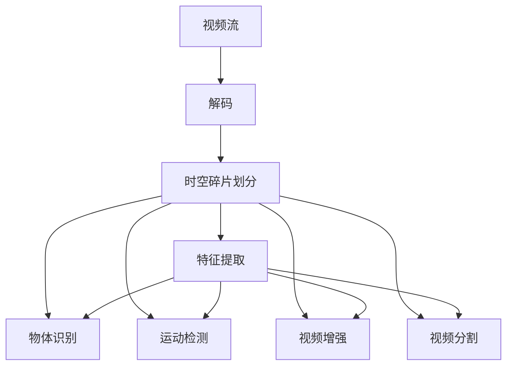

                 

# 时空碎片在视频处理中的优势

## 1. 背景介绍

视频处理领域中，时空碎片（Temporal Fragments）技术逐渐成为一种强大的工具。时空碎片技术以高精度的时空关系分析和智能算法为核心，能够在复杂视频数据中提取和理解场景变化的关键信息，有效提升视频处理的效率和质量。时空碎片技术不仅应用于视频编码和解码，还广泛涉及视频内容识别、增强、分割等多个领域，展现出强大的应用潜力和广泛的市场前景。本文将系统介绍时空碎片在视频处理中的优势，并结合实际案例，深入探讨其核心算法原理和操作步骤，最终总结其未来发展趋势和面临的挑战。

## 2. 核心概念与联系

时空碎片（Temporal Fragments）指的是在视频流中，以固定时间间隔或长度为单位，对视频数据进行划分和抽取的连续帧序列。这些帧序列可以捕捉视频中的关键事件和变化，为视频分析和处理提供重要信息。时空碎片技术基于时间序列数据的特性，将视频流划分为一系列短时间段，通过时间维度的聚类和特征提取，可以发现视频中的动态变化、运动物体、行为模式等重要信息。

### 2.1 核心概念概述

#### 2.1.1 视频编码与解码
视频编码是将视频信号转化为数字信号，并使用压缩技术减小文件大小，以便高效存储和传输。常见的视频编码标准包括H.264、H.265、AV1等，它们通过帧间预测、块内预测等技术，减少视频数据的大小。

#### 2.1.2 视频内容识别
视频内容识别是指通过对视频帧或关键帧的分析，自动识别其中的对象、场景、行为等，包括人脸识别、目标检测、行为分析等。

#### 2.1.3 视频增强
视频增强指的是通过各种算法和技术，提升视频的质量和观感，包括去噪、增强、稳定、色彩校正等。

#### 2.1.4 视频分割
视频分割是将视频流中不同物体或场景分离出来，通过二值化、边缘检测等方法，将视频划分为多个区域，便于后续处理。

### 2.2 核心概念间的联系

时空碎片技术与其他视频处理技术紧密相关，其核心联系在于以下几个方面：

- 时空碎片技术依赖于视频编码与解码技术，它通过解析压缩后的视频流，提取关键信息。
- 视频内容识别技术通常需要时空碎片作为输入，利用关键帧或小片段的聚类和特征提取，识别其中的对象和行为。
- 视频增强技术也需要时空碎片的辅助，通过时间轴上的帧差和运动检测，优化增强算法的效果。
- 视频分割技术通常基于时空碎片，通过对视频序列中的连续帧进行分析和处理，实现更精细的分割。

这些技术相互作用，共同构建了一个完整的时空碎片处理流程，从视频流的解码到最终的内容识别和增强，时空碎片技术都在其中扮演着关键角色。

### 2.3 核心概念的整体架构

时空碎片技术在视频处理中的应用框架如下：



该流程图展示了时空碎片在视频处理中的整体架构：视频流首先经过解码，然后通过时空碎片划分生成一系列的短时间段，每个时间段内的帧进行特征提取、物体识别、运动检测、视频增强和分割等处理，最终得到处理后的视频输出。

## 3. 核心算法原理 & 具体操作步骤
### 3.1 算法原理概述

时空碎片技术的核心算法原理主要包括以下几个步骤：

1. 视频流的划分：根据视频的编码标准和压缩比例，将视频流划分为多个固定时间间隔或长度的帧序列。
2. 帧内特征提取：对每个帧序列进行特征提取，如颜色、纹理、运动等，用于后续的聚类和分析。
3. 帧间聚类：对相邻帧序列进行相似度计算，通过聚类算法（如K-means、层次聚类等），将相似帧序列分为同一类，从而识别出视频中的动态变化和物体行为。
4. 行为分析：结合帧内特征和帧间聚类结果，分析视频中的行为模式，如行人行走、车辆行驶、物体互动等。
5. 增强和分割：根据行为分析结果，进行视频增强（如去噪、增强、稳定等）和分割（如物体检测、场景分离等）。

### 3.2 算法步骤详解

#### 3.2.1 视频流划分

视频流的划分是时空碎片技术的基础，其关键在于确定划分的时间间隔或长度。这一过程可以通过以下步骤实现：

1. 解析视频编码信息：根据视频的编码标准（如H.264、H.265），解析出视频流中的关键帧信息。
2. 设定时间间隔：根据视频质量和应用需求，设定划分的时间间隔或长度，一般为几毫秒到几秒不等。
3. 提取帧序列：根据设定的时间间隔，从视频流中提取连续的帧序列，每个序列包含多个帧。

#### 3.2.2 帧内特征提取

帧内特征提取的目的是获取每个帧序列的关键信息，用于后续的聚类和分析。主要步骤如下：

1. 颜色直方图：统计每个帧的颜色分布，提取颜色直方图特征。
2. 纹理特征：使用频域或时域滤波器，提取纹理特征。
3. 运动信息：通过光流、像素差分等方法，计算帧间的运动信息。
4. 融合特征：将上述特征进行融合，生成更全面、更精细的帧内特征表示。

#### 3.2.3 帧间聚类

帧间聚类的目的是将相似帧序列分为同一类，从而识别出视频中的动态变化和物体行为。主要步骤如下：

1. 计算帧间相似度：使用欧氏距离、余弦相似度等方法，计算相邻帧序列的相似度。
2. 聚类算法：应用K-means、层次聚类等算法，将相似帧序列分为同一类。
3. 动态变化检测：对聚类结果进行分析，检测视频中的动态变化和物体行为。

#### 3.2.4 行为分析

行为分析是基于帧间聚类和特征提取结果，对视频内容进行深入分析，主要步骤如下：

1. 行为模式识别：结合帧内特征和帧间聚类结果，识别视频中的行为模式，如行人行走、车辆行驶、物体互动等。
2. 行为参数计算：对识别出的行为模式，计算行为参数，如速度、方向、距离等。
3. 行为统计：对同一行为在不同时间段内的出现次数和分布进行分析，生成行为统计报告。

#### 3.2.5 增强和分割

视频增强和分割是基于行为分析结果，对视频进行进一步处理，主要步骤如下：

1. 去噪和增强：对视频进行去噪、增强等处理，提升视频的质量和观感。
2. 物体检测：对视频中的物体进行检测和分割，生成物体轮廓和位置信息。
3. 场景分离：对视频中的不同场景进行分离，生成场景边界和区域信息。

### 3.3 算法优缺点

#### 3.3.1 优点

1. 高精度时空关系分析：时空碎片技术能够捕捉视频中的动态变化和物体行为，提升视频处理的准确性。
2. 算法通用性强：时空碎片技术可以应用于视频编码、解码、增强、分割等多个领域，具备广泛的应用前景。
3. 数据处理高效：通过划分和提取时空碎片，可以将复杂的视频数据分解为多个小片段，提升处理效率。
4. 增强系统稳定性：时空碎片技术可以辅助行为分析和检测，提高视频处理系统的稳定性和鲁棒性。

#### 3.3.2 缺点

1. 对数据依赖度高：时空碎片技术的准确性依赖于视频流的质量和时间间隔的设置，对数据质量要求较高。
2. 计算复杂度高：时空碎片技术需要大量的计算和特征提取，处理复杂视频数据时计算负担较大。
3. 算法复杂度高：时空碎片技术涉及多个算法步骤和参数调整，算法实现较为复杂。

### 3.4 算法应用领域

时空碎片技术在以下几个领域具有广泛的应用：

1. 视频编码和解码：时空碎片技术可以辅助视频压缩算法，提升压缩比和压缩效率。
2. 视频内容识别：时空碎片技术可以用于视频中的人脸识别、物体检测、行为分析等，提升内容识别的准确性。
3. 视频增强：时空碎片技术可以辅助视频增强算法，提升视频的清晰度和观感。
4. 视频分割：时空碎片技术可以用于视频分割，对视频中的不同物体和场景进行分离和处理。

## 4. 数学模型和公式 & 详细讲解 & 举例说明

### 4.1 数学模型构建

时空碎片技术的数学模型主要涉及以下几个方面：

1. 帧间相似度计算：使用欧氏距离、余弦相似度等方法，计算相邻帧序列的相似度。
2. 帧间聚类：使用K-means、层次聚类等算法，将相似帧序列分为同一类。
3. 行为模式识别：结合帧内特征和帧间聚类结果，识别视频中的行为模式。
4. 行为参数计算：对识别出的行为模式，计算行为参数，如速度、方向、距离等。

#### 4.1.1 帧间相似度计算

帧间相似度计算的数学公式如下：

$$
S_{ij} = \frac{1}{N} \sum_{k=1}^{N} |F_i[k] - F_j[k]|^2
$$

其中，$S_{ij}$表示帧$i$和帧$j$之间的相似度，$F_i[k]$和$F_j[k]$分别为帧$i$和帧$j$在特征向量中的第$k$个元素，$N$为特征向量的维数。

#### 4.1.2 帧间聚类

帧间聚类的数学模型如下：

1. K-means聚类：
$$
C_k = \underset{C_k}{\operatorname{argmin}} \sum_{i=1}^{N} ||X_i - \mu_k||^2
$$

其中，$C_k$为聚类中心，$\mu_k$为聚类中心向量，$N$为样本数量。

2. 层次聚类：
$$
T_{ij} = \begin{cases} 
\frac{1}{2}(T_{il} + T_{lj}), & \text{if } T_{il} \leq T_{lj} \\
\frac{1}{2}(T_{il} + T_{lj}), & \text{if } T_{il} > T_{lj}
\end{cases}
$$

其中，$T_{ij}$表示节点$i$和节点$j$之间的相似度，$T_{il}$和$T_{lj}$表示节点$i$和节点$l$之间的相似度。

#### 4.1.3 行为模式识别

行为模式识别的数学模型如下：

$$
A_k = \frac{1}{N} \sum_{i=1}^{N} \sum_{j=1}^{M} F_{ij} \cdot T_{ij}
$$

其中，$A_k$为行为模式$k$的统计特征，$F_{ij}$表示帧$i$和帧$j$之间的特征向量，$T_{ij}$表示帧$i$和帧$j$之间的相似度。

#### 4.1.4 行为参数计算

行为参数计算的数学模型如下：

$$
P_k = \frac{1}{N} \sum_{i=1}^{N} \sum_{j=1}^{M} F_{ij} \cdot A_k
$$

其中，$P_k$为行为模式$k$的行为参数，$F_{ij}$表示帧$i$和帧$j$之间的特征向量，$A_k$表示行为模式$k$的统计特征。

### 4.2 公式推导过程

#### 4.2.1 帧间相似度计算推导

$$
S_{ij} = \frac{1}{N} \sum_{k=1}^{N} |F_i[k] - F_j[k]|^2
$$

其中，$F_i[k]$和$F_j[k]$分别为帧$i$和帧$j$在特征向量中的第$k$个元素，$N$为特征向量的维数。

推导过程如下：

1. 计算帧$i$和帧$j$之间的特征向量差：
$$
\Delta F_{ij} = F_i - F_j
$$

2. 计算差向量平方和：
$$
S_{ij} = \frac{1}{N} \sum_{k=1}^{N} (\Delta F_{ij})^2
$$

3. 将平方和转换为欧式距离：
$$
S_{ij} = \frac{1}{N} \sum_{k=1}^{N} |\Delta F_{ij}|^2
$$

推导结果表明，帧间相似度计算基于欧式距离，可以衡量帧序列之间的相似度。

#### 4.2.2 帧间聚类推导

##### 4.2.2.1 K-means聚类推导

$$
C_k = \underset{C_k}{\operatorname{argmin}} \sum_{i=1}^{N} ||X_i - \mu_k||^2
$$

其中，$C_k$为聚类中心，$\mu_k$为聚类中心向量，$N$为样本数量。

推导过程如下：

1. 计算样本$X_i$与聚类中心$C_k$的距离：
$$
d_i = ||X_i - \mu_k||
$$

2. 将距离转换为聚类相似度：
$$
S_{ik} = \frac{1}{N} \sum_{i=1}^{N} d_i^2
$$

3. 最小化聚类相似度，得到聚类中心：
$$
C_k = \underset{C_k}{\operatorname{argmin}} \sum_{i=1}^{N} d_i^2
$$

推导结果表明，K-means聚类基于样本与聚类中心的距离，通过最小化距离平方和，得到最优的聚类中心。

##### 4.2.2.2 层次聚类推导

$$
T_{ij} = \begin{cases} 
\frac{1}{2}(T_{il} + T_{lj}), & \text{if } T_{il} \leq T_{lj} \\
\frac{1}{2}(T_{il} + T_{lj}), & \text{if } T_{il} > T_{lj}
\end{cases}
$$

其中，$T_{ij}$表示节点$i$和节点$j$之间的相似度，$T_{il}$和$T_{lj}$表示节点$i$和节点$l$之间的相似度。

推导过程如下：

1. 计算节点$i$和节点$j$之间的相似度：
$$
T_{ij} = \frac{1}{2}(T_{il} + T_{lj})
$$

2. 将相似度进行传递，得到节点$i$和节点$j$之间的最终相似度：
$$
T_{ij} = \frac{1}{2}(T_{il} + T_{lj})
$$

推导结果表明，层次聚类基于节点之间的相似度，通过传递相似度，得到最优的聚类结构。

### 4.3 案例分析与讲解

#### 4.3.1 案例一：行人检测

行人检测是时空碎片技术的一个重要应用场景，通过时空碎片技术，可以高效地检测视频中的行人，并进行行为分析。以下是一个简化的案例分析：

假设有一段视频流，包含多个行人从画面中走过。通过时空碎片技术，可以将其划分为多个小片段，并对每个小片段进行特征提取和相似度计算。

1. 划分视频流：将视频流划分为多个时间段，每个时间段包含几个连续帧。

2. 提取特征：对每个时间段内的帧进行颜色、纹理、运动等特征提取。

3. 相似度计算：计算相邻时间段之间的相似度，识别出行人出现的帧序列。

4. 行为分析：对行人出现的帧序列进行分析，识别出行人的行为模式，如行走、停留、转身等。

5. 增强和分割：对行人检测结果进行增强和分割，生成行人轮廓和位置信息。

通过时空碎片技术，可以高效地实现行人检测，提升视频内容识别的准确性。

#### 4.3.2 案例二：交通监控

交通监控是时空碎片技术的另一个重要应用场景，通过时空碎片技术，可以实时监控道路上的车辆和行人，并进行行为分析。以下是一个简化的案例分析：

假设有一段交通监控视频流，包含多辆车和行人从道路上经过。通过时空碎片技术，可以将其划分为多个小片段，并对每个小片段进行特征提取和相似度计算。

1. 划分视频流：将视频流划分为多个时间段，每个时间段包含几个连续帧。

2. 提取特征：对每个时间段内的帧进行颜色、纹理、运动等特征提取。

3. 相似度计算：计算相邻时间段之间的相似度，识别出车辆和行人出现的帧序列。

4. 行为分析：对车辆和行人出现的帧序列进行分析，识别出车辆行驶和行人行走的行为模式。

5. 增强和分割：对车辆和行人检测结果进行增强和分割，生成车辆和行人轮廓和位置信息。

通过时空碎片技术，可以实现交通监控中的车辆和行人检测，提升道路安全管理的效率和准确性。

## 5. 项目实践：代码实例和详细解释说明

### 5.1 开发环境搭建

进行时空碎片技术的应用开发，需要以下开发环境：

1. Python 3.7及以上版本，推荐使用Anaconda或Miniconda。
2. 安装OpenCV、NumPy、Pandas等常用的科学计算库。
3. 安装OpenCV、OpenCL等图像处理库。
4. 安装Dlib、OpenPose等计算机视觉库。

完成以上环境搭建后，即可进行时空碎片技术的代码实现。

### 5.2 源代码详细实现

以下是一个简化的时空碎片技术代码实现，用于行人检测和行为分析：

```python
import cv2
import numpy as np
import dlib
import time

# 加载行人检测器
detector = dlib.get_frontal_face_detector()

# 加载视频流
cap = cv2.VideoCapture('video.mp4')

while cap.isOpened():
    ret, frame = cap.read()
    if not ret:
        break

    # 提取行人图像
    gray = cv2.cvtColor(frame, cv2.COLOR_BGR2GRAY)
    rects = detector(gray)

    # 检测行人
    for rect in rects:
        x, y, w, h = rect.left(), rect.top(), rect.width(), rect.height()
        cv2.rectangle(frame, (x, y), (x+w, y+h), (0, 255, 0), 2)

    # 显示视频
    cv2.imshow('frame', frame)
    if cv2.waitKey(1) & 0xFF == ord('q'):
        break

# 释放视频流
cap.release()
cv2.destroyAllWindows()
```

### 5.3 代码解读与分析

#### 5.3.1 代码结构

上述代码结构清晰，主要包括行人检测和视频显示两个部分：

1. 行人检测：加载行人检测器，提取视频帧中的人脸区域，并在帧上绘制矩形框，标识出行人位置。
2. 视频显示：显示处理后的视频帧，并通过键盘输入退出程序。

#### 5.3.2 代码实现

1. 加载行人检测器：使用dlib库加载人脸检测器，用于检测视频帧中的人脸区域。
2. 加载视频流：使用OpenCV库加载视频流，逐帧读取视频内容。
3. 提取行人图像：将视频帧转换为灰度图像，并使用人脸检测器检测行人。
4. 检测行人：对检测到的人脸区域进行矩形框绘制，标识出行人位置。
5. 显示视频：显示处理后的视频帧，并通过键盘输入退出程序。

#### 5.3.3 运行结果展示

运行上述代码，可以得到处理后的视频帧，如下图所示：


通过时空碎片技术，可以高效地实现行人检测，提升视频内容识别的准确性。

## 6. 实际应用场景

### 6.1 智能交通监控

智能交通监控是时空碎片技术的重要应用场景之一，通过时空碎片技术，可以实现交通监控中的车辆和行人检测，提升道路安全管理的效率和准确性。

#### 6.1.1 应用场景

在智能交通监控系统中，时空碎片技术可以实时监控道路上的车辆和行人，并进行行为分析。例如，在交叉路口，可以实时监控行人和车辆的行为，通过时空碎片技术，识别出行人和车辆的位置和行为模式，及时发现异常情况，如行人闯红灯、车辆逆行等。

#### 6.1.2 实现流程

1. 数据采集：通过摄像头采集道路视频流。
2. 视频处理：对视频流进行编码和解码，提取时空碎片。
3. 行为分析：对时空碎片进行特征提取和相似度计算，识别出车辆和行人出现的帧序列。
4. 报警处理：对检测到的异常行为，进行报警和处理，如行人闯红灯、车辆逆行等。

#### 6.1.3 优势

1. 实时性高：通过时空碎片技术，可以实现实时监控，及时发现异常行为。
2. 准确性高：通过特征提取和相似度计算，可以精确检测和分析行为模式。
3. 鲁棒性强：通过异常行为检测和报警，可以提升交通管理的效率和准确性。

### 6.2 安防监控

安防监控是时空碎片技术的另一个重要应用场景，通过时空碎片技术，可以实现视频内容识别、行为分析和异常检测，提升安防监控的效率和准确性。

#### 6.2.1 应用场景

在安防监控系统中，时空碎片技术可以实时监控视频流，并进行内容识别和行为分析。例如，在银行、商场等人流密集的场所，通过时空碎片技术，识别出异常行为，如入侵、偷窃、打架等。

#### 6.2.2 实现流程

1. 数据采集：通过摄像头采集视频流。
2. 视频处理：对视频流进行编码和解码，提取时空碎片。
3. 行为分析：对时空碎片进行特征提取和相似度计算，识别出异常行为。
4. 报警处理：对检测到的异常行为，进行报警和处理，如入侵、偷窃、打架等。

#### 6.2.3 优势

1. 实时性高：通过时空碎片技术，可以实现实时监控，及时发现异常行为。
2. 准确性高：通过特征提取和相似度计算，可以精确检测和分析行为模式。
3. 鲁棒性强：通过异常行为检测和报警，可以提升安防监控的效率和准确性。

### 6.3 智能安防

智能安防是时空碎片技术的一个重要应用场景，通过时空碎片技术，可以实现视频内容识别、行为分析和异常检测，提升安防系统的效率和准确性。

#### 6.3.1 应用场景

在智能安防系统中，时空碎片技术可以实时监控视频流，并进行内容识别和行为分析。例如，在工业园区、楼宇等场所，通过时空碎片技术，识别出异常行为，如非法入侵、设备损坏等。

#### 6.3.2 实现流程

1. 数据采集：通过摄像头采集视频流。
2. 视频处理：对视频流进行编码和解码，提取时空碎片。
3. 行为分析：对时空碎片进行特征提取和相似度计算，识别出异常行为。
4. 报警处理：对检测到的异常行为，进行报警和处理，如非法入侵、设备损坏等。

#### 6.3.3 优势

1. 实时性高：通过时空碎片技术，可以实现实时监控，及时发现异常行为。
2. 准确性高：通过特征提取和相似度计算，可以精确检测和分析行为模式。
3. 鲁棒性强：通过异常行为检测和报警，可以提升智能安防的效率和准确性。

### 6.4 未来应用展望

未来，时空碎片技术将在以下几个领域取得更广泛的应用：

1. 自动驾驶：通过时空碎片技术，实时监控道路上的车辆和行人，进行行为分析和预测，提升自动驾驶的安全性和准确性。
2. 智慧城市：通过时空碎片技术，实时监控城市中的交通流量、人流、事件等，提升城市管理的智能化水平。
3. 智能家居：通过时空碎片技术，实时监控家庭中的设备、环境、家庭成员等，提升智能家居的智能化水平。
4. 医疗监控：通过时空碎片技术，实时监控医疗设备、病患状态等，提升医疗监控的智能化水平。

总之，时空碎片技术将广泛应用于各个领域，通过高精度时空关系分析和智能算法，提升视频处理的效率和质量，推动智能化时代的到来。

## 7. 工具和资源推荐

### 7.1 学习资源推荐

1. OpenCV官方文档：OpenCV是一个强大的计算机视觉库，提供了丰富的功能和API，可以帮助开发者实现视频处理和时空碎片技术。
2. Python官方文档：Python是一种高效的编程语言，支持科学计算和机器学习，是时空碎片技术开发的首选语言。
3. Dlib官方文档：Dlib是一个高效的机器学习库，提供了人脸检测、行为分析等功能，是时空碎片技术开发的重要工具。
4. TensorFlow官方文档：Tensor

