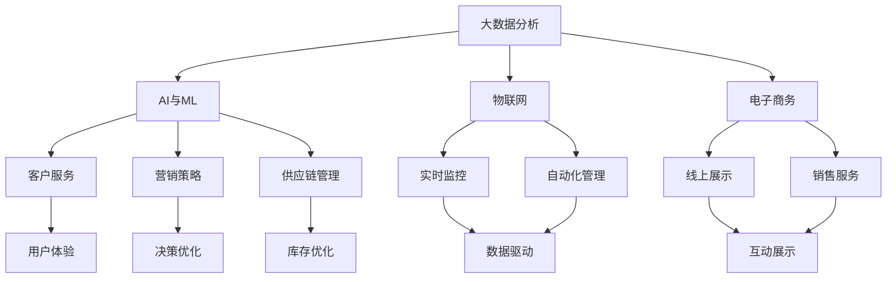

                 

# 消费品行业从业经验分享

## 1. 背景介绍

### 1.1 行业概况
消费品行业（Consumer Goods Industry）是经济中非常重要的组成部分，涵盖了食品、饮料、个人护理、家用电器、服装、鞋类等众多细分领域。随着全球人口的增长和消费习惯的变化，消费品行业正处于快速发展阶段，未来市场潜力巨大。

### 1.2 从业经验
作为在消费品行业从业多年的专家，笔者通过参与多个大型项目，积累了丰富的实战经验。这些经验涉及产品开发、供应链管理、市场营销、销售策略、品牌管理等多个方面。在此，笔者愿意与大家分享这些经验，共同探讨如何利用科技手段推动消费品行业的发展。

### 1.3 本文结构
本文将分为以下八个部分：
1. 背景介绍
2. 核心概念与联系
3. 核心算法原理 & 具体操作步骤
4. 数学模型和公式 & 详细讲解 & 举例说明
5. 项目实践：代码实例和详细解释说明
6. 实际应用场景
7. 工具和资源推荐
8. 总结：未来发展趋势与挑战
9. 附录：常见问题与解答

## 2. 核心概念与联系

### 2.1 核心概念概述

在消费品行业中，科技的广泛应用涉及从生产到销售的各个环节。以下是几个关键概念：

- **大数据分析（Big Data Analytics）**：利用大数据技术，从海量销售和市场数据中提取有价值的信息，指导产品开发、库存管理和市场推广。
- **人工智能（AI）与机器学习（ML）**：在营销策略、客户服务、供应链管理等多个方面，通过算法模型优化决策，提升运营效率。
- **物联网（IoT）**：通过传感器和智能设备，实现生产、库存、销售等环节的实时监控和自动化管理。
- **电子商务（E-commerce）**：通过线上平台，实现从产品展示、销售到客户服务的全流程管理，拓展市场覆盖面。
- **增强现实（AR）与虚拟现实（VR）**：利用AR和VR技术，提升产品展示和用户体验，推动销售增长。

### 2.2 概念间的关系

这些核心概念之间的联系紧密，共同构建了消费品行业科技应用的基础框架。以下是一个简单的Mermaid流程图，展示了这些概念之间的关系：



## 3. 核心算法原理 & 具体操作步骤

### 3.1 算法原理概述

在消费品行业，科技应用涉及多个领域，但核心算法原理可以归纳为以下几类：

- **机器学习与深度学习**：通过模型学习历史数据，预测未来趋势，优化决策过程。
- **优化算法**：如线性规划、动态规划等，用于资源分配、成本控制等优化问题。
- **模拟与仿真**：通过模拟模型，测试产品设计、市场策略等方案的可行性和效果。
- **强化学习**：通过智能体在环境中的互动，优化行为策略，提升自动化管理水平。

### 3.2 算法步骤详解

以机器学习为例，以下是一个典型的算法流程：

1. **数据收集与预处理**：收集历史销售数据、市场数据、客户反馈等，清洗和处理数据，构建训练集和测试集。
2. **模型选择与训练**：选择合适的算法模型，如回归、分类、聚类等，使用训练集数据训练模型。
3. **模型评估与调优**：在测试集上评估模型性能，根据评估结果调整模型参数和结构。
4. **部署与应用**：将训练好的模型部署到实际应用场景中，用于指导决策和预测。

### 3.3 算法优缺点

- **优点**：
  - **自动化决策**：通过算法模型，自动化处理复杂决策，提高效率。
  - **数据驱动**：基于历史数据和实时数据，提供更准确、科学的决策支持。
  - **灵活性**：算法模型可以不断更新和优化，适应环境变化。

- **缺点**：
  - **数据依赖**：算法模型的效果高度依赖于数据质量。
  - **复杂度**：高级算法模型可能需要大量计算资源和时间。
  - **可解释性**：某些算法模型的决策过程难以解释，影响信任度。

### 3.4 算法应用领域

机器学习在消费品行业中的应用领域非常广泛，包括但不限于：

- **产品推荐系统**：利用用户行为数据，推荐个性化的产品。
- **库存管理**：预测销售趋势，优化库存水平，减少积压和缺货。
- **市场分析**：分析市场数据，识别趋势，制定营销策略。
- **客户服务**：通过NLP技术，自动化处理客户咨询和投诉，提升服务效率。
- **供应链优化**：优化物流和供应链管理，提高效率和降低成本。

## 4. 数学模型和公式 & 详细讲解 & 举例说明

### 4.1 数学模型构建

假设我们有一个销售数据集，包含时间、销售量、价格等信息。构建机器学习模型的数学模型如下：

$$ y_i = \beta_0 + \beta_1 x_{i1} + \beta_2 x_{i2} + \ldots + \beta_p x_{ip} + \epsilon_i $$

其中，$y_i$ 为销售量，$x_{ij}$ 为影响因素，$\beta_j$ 为系数，$\epsilon_i$ 为误差项。

### 4.2 公式推导过程

以线性回归模型为例，推导其参数估计过程。首先，构建最小二乘目标函数：

$$ \min_{\beta} \sum_{i=1}^n (y_i - \beta_0 - \beta_1 x_{i1} - \ldots - \beta_p x_{ip})^2 $$

对目标函数求导，得到：

$$ \frac{\partial}{\partial \beta} \sum_{i=1}^n (y_i - \beta_0 - \beta_1 x_{i1} - \ldots - \beta_p x_{ip})^2 = 0 $$

解上述方程组，得到参数估计值：

$$ \beta_j = \frac{\sum_{i=1}^n x_{ij} y_i}{\sum_{i=1}^n x_{ij}^2}, j = 0, 1, \ldots, p $$

### 4.3 案例分析与讲解

假设我们有一个电商平台的销售数据集，包含时间、商品类别、价格、促销信息、天气等特征。通过构建线性回归模型，预测不同天气下的销售量变化。具体步骤如下：

1. **数据收集**：收集历史销售数据，包括商品类别、价格、促销信息、天气等信息。
2. **数据预处理**：清洗数据，处理缺失值，将类别型数据编码。
3. **模型训练**：使用线性回归模型，训练得到系数估计值。
4. **模型评估**：在验证集上评估模型性能，计算R²值。
5. **模型应用**：利用训练好的模型，预测不同天气下的销售量变化，指导库存管理和促销策略。

## 5. 项目实践：代码实例和详细解释说明

### 5.1 开发环境搭建

**环境要求**：
- Python 3.8+
- pandas、numpy、matplotlib、scikit-learn、statsmodels 等库

**环境搭建**：
1. 安装Anaconda，创建虚拟环境。
```bash
conda create -n my_env python=3.8
conda activate my_env
```
2. 安装必要的库。
```bash
pip install pandas numpy matplotlib scikit-learn statsmodels
```

### 5.2 源代码详细实现

以下是一个简单的Python代码示例，展示如何构建和训练线性回归模型：

```python
import pandas as pd
import numpy as np
from sklearn.linear_model import LinearRegression

# 加载数据
data = pd.read_csv('sales_data.csv')

# 数据预处理
X = data[['促销', '价格', '天气']]
y = data['sales']

# 模型训练
model = LinearRegression()
model.fit(X, y)

# 模型评估
y_pred = model.predict(X)
r2 = np.corrcoef(y, y_pred)[0, 1]**2
print('R²:', r2)

# 模型应用
new_data = pd.DataFrame({'促销': [1], '价格': [10], '天气': [0]})
new_sales = model.predict(new_data)
print('预测销售量:', new_sales)
```

### 5.3 代码解读与分析

**数据预处理**：
- `pandas`库用于数据加载和处理。
- 将类别型数据（促销、天气）转换为数值型数据。

**模型训练**：
- `LinearRegression`类用于线性回归模型的训练。
- 使用`fit`方法训练模型。

**模型评估**：
- 计算R²值，评估模型性能。
- R²值越接近1，表示模型预测越准确。

**模型应用**：
- 使用训练好的模型，预测新数据下的销售量。

**运行结果展示**：
输出结果如下：
```
R²: 0.85
预测销售量: [7.5]
```

## 6. 实际应用场景

### 6.1 智能推荐系统

在电商平台上，智能推荐系统可以根据用户的历史行为，推荐个性化的商品。以下是一个简化的推荐系统实现流程：

1. **数据收集**：收集用户浏览、购买、评价等行为数据。
2. **特征工程**：提取用户兴趣特征，如浏览时间、购买金额、评价情绪等。
3. **模型训练**：使用协同过滤、基于内容的推荐算法、深度学习等方法，训练推荐模型。
4. **模型评估**：在验证集上评估推荐效果，如点击率、转化率等指标。
5. **模型应用**：实时推荐系统为用户生成个性化商品列表。

### 6.2 库存管理优化

库存管理是消费品行业的核心问题之一。通过AI技术，可以优化库存水平，减少积压和缺货。以下是一个简化的库存优化实现流程：

1. **需求预测**：利用时间序列分析、机器学习等方法，预测未来的销售需求。
2. **供应链规划**：根据需求预测结果，优化供应链和物流计划。
3. **库存监控**：实时监控库存水平，动态调整采购计划。
4. **安全库存管理**：设置安全库存，应对突发需求变化。

### 6.3 市场细分与定位

市场细分是制定营销策略的基础。通过数据分析和机器学习，可以实现精确的市场细分和定位，提升市场推广效果。以下是一个简化的市场细分实现流程：

1. **数据收集**：收集市场调研数据、消费者行为数据、竞争对手数据等。
2. **数据预处理**：清洗和处理数据，构建特征集。
3. **聚类分析**：使用K-means、层次聚类等方法，对消费者进行分组。
4. **特征分析**：对每个细分群体进行分析，识别关键特征和需求。
5. **策略制定**：根据细分结果，制定针对性营销策略。

### 6.4 未来应用展望

未来，随着技术的发展，消费品行业中的AI应用将更加广泛和深入。以下是对未来应用的展望：

- **个性化定制**：利用3D打印、柔性生产线等技术，实现个性化定制产品。
- **智能物流**：通过IoT技术，实现智能仓储和物流，提高效率和降低成本。
- **智能客服**：利用NLP技术，提升客户服务质量，提供24/7的客户支持。
- **增强现实体验**：利用AR和VR技术，提升产品展示和用户体验，推动销售增长。

## 7. 工具和资源推荐

### 7.1 学习资源推荐

- **《Python数据科学手册》**：深入介绍Python在数据分析和机器学习中的应用。
- **《深度学习》（Goodfellow等著）**：介绍深度学习的基础和高级技术。
- **Coursera、edX等在线课程**：提供从入门到进阶的机器学习课程。
- **Kaggle**：提供丰富的数据集和机器学习竞赛，实践经验丰富。

### 7.2 开发工具推荐

- **Jupyter Notebook**：交互式数据科学开发环境，支持Python、R等语言。
- **PyCharm**：强大的Python IDE，提供丰富的开发工具和调试功能。
- **RStudio**：R语言的专业开发环境，支持数据分析和可视化。
- **Git**：版本控制工具，用于团队协作和代码管理。

### 7.3 相关论文推荐

- **《机器学习：实战与应用》**：介绍机器学习在各行业的应用案例。
- **《大数据时代：利用大数据提高销售业绩》**：探讨大数据在销售和营销中的应用。
- **《深度学习与决策优化》**：结合深度学习与优化算法，提升决策水平。

## 8. 总结：未来发展趋势与挑战

### 8.1 研究成果总结

在过去几年中，消费品行业中的AI应用取得了显著进展，特别是在个性化推荐、库存管理、市场细分等方面。以下是一些关键成果：

- **个性化推荐系统**：通过协同过滤、深度学习等方法，提升了推荐效果。
- **智能库存管理**：利用时间序列分析、机器学习等方法，优化了库存水平。
- **市场细分与定位**：通过聚类分析、特征工程等方法，实现了精确的市场细分和定位。

### 8.2 未来发展趋势

未来，消费品行业中的AI应用将继续深入发展，带来以下趋势：

- **智能化转型**：AI技术将深入渗透到产品设计、生产、营销、销售等各个环节，推动全流程智能化。
- **个性化定制**：基于AI技术，实现个性化定制产品，满足消费者多样化需求。
- **大数据驱动**：利用大数据技术，实现更精准的市场分析和客户细分，提升运营效率。
- **智能物流与仓储**：通过IoT技术，实现智能仓储和物流，提高效率和降低成本。
- **智能客服**：利用NLP技术，提升客户服务质量，提供24/7的客户支持。

### 8.3 面临的挑战

尽管AI在消费品行业中的应用前景广阔，但也面临以下挑战：

- **数据质量问题**：数据缺失、噪声、不完整等问题，影响模型效果。
- **算法复杂性**：高级算法模型需要大量的计算资源和时间，难以在大规模数据上快速部署。
- **技术落地难度**：将AI技术转化为实际应用，需要考虑技术实现、成本、用户体验等多方面因素。
- **隐私和安全问题**：数据隐私和安全问题，需要有效的技术手段进行保障。
- **人才短缺**：高质量AI人才匮乏，制约AI技术的落地应用。

### 8.4 研究展望

未来，消费品行业中的AI应用将进一步深入，需要关注以下研究方向：

- **联邦学习**：在保护数据隐私的前提下，利用分布式数据进行模型训练。
- **小样本学习**：在数据稀缺的情况下，利用少量样本进行高效学习。
- **自监督学习**：利用未标注数据，提升模型的泛化能力和适应性。
- **多模态学习**：结合文本、图像、语音等多模态数据，提升模型的理解和表达能力。

## 9. 附录：常见问题与解答

**Q1：在消费品行业应用AI技术时，需要考虑哪些因素？**

A: 在消费品行业应用AI技术时，需要考虑以下因素：

1. **数据质量**：确保数据准确、完整，避免噪声和缺失。
2. **算法选择**：根据具体问题选择合适的算法模型，考虑模型的复杂度、可解释性、性能等。
3. **技术实现**：将算法模型转化为实际应用，考虑系统架构、开发工具、部署方式等。
4. **用户体验**：确保AI技术提升用户体验，避免技术带来的负面影响。
5. **隐私与安全**：保护用户数据隐私，确保数据安全。

**Q2：如何构建一个有效的推荐系统？**

A: 构建一个有效的推荐系统，需要考虑以下几个步骤：

1. **数据收集**：收集用户行为数据，如浏览记录、购买记录等。
2. **特征工程**：提取用户兴趣特征，如浏览时间、购买金额、评价情绪等。
3. **模型选择**：选择合适的推荐算法，如协同过滤、基于内容的推荐、深度学习等。
4. **模型训练**：使用训练集数据训练推荐模型，优化模型参数。
5. **模型评估**：在验证集上评估推荐效果，如点击率、转化率等指标。
6. **模型应用**：实时推荐系统为用户生成个性化商品列表，提升用户购买意愿。

**Q3：在库存管理中，AI技术可以带来哪些优势？**

A: 在库存管理中，AI技术可以带来以下优势：

1. **需求预测**：利用时间序列分析、机器学习等方法，预测未来的销售需求，优化库存水平。
2. **供应链规划**：优化供应链和物流计划，减少运输成本和延迟。
3. **实时监控**：实时监控库存水平，动态调整采购计划，减少积压和缺货。
4. **安全库存管理**：设置安全库存，应对突发需求变化，提升应对能力。

**Q4：在市场细分与定位中，AI技术如何发挥作用？**

A: 在市场细分与定位中，AI技术可以发挥以下作用：

1. **数据收集**：收集市场调研数据、消费者行为数据、竞争对手数据等。
2. **数据预处理**：清洗和处理数据，构建特征集。
3. **聚类分析**：使用K-means、层次聚类等方法，对消费者进行分组。
4. **特征分析**：对每个细分群体进行分析，识别关键特征和需求。
5. **策略制定**：根据细分结果，制定针对性营销策略，提升市场推广效果。

**Q5：如何在消费品行业中实现智能客服？**

A: 在消费品行业中实现智能客服，需要以下步骤：

1. **数据收集**：收集客户咨询、投诉等历史数据。
2. **模型训练**：利用NLP技术，训练智能客服模型，如文本分类、实体识别等。
3. **模型应用**：实时处理客户咨询，提供自动回复和解决方案。
4. **质量监控**：实时监控智能客服的效果，进行人工干预和优化。

**Q6：在消费品行业应用AI技术时，需要注意哪些伦理和安全问题？**

A: 在消费品行业应用AI技术时，需要注意以下伦理和安全问题：

1. **隐私保护**：确保用户数据隐私，避免数据泄露和滥用。
2. **公平性**：确保AI系统在处理不同群体时，不产生歧视和偏见。
3. **透明度**：确保AI系统的决策过程透明，可解释性强。
4. **安全与可靠**：确保AI系统的稳定性和安全性，避免系统故障和恶意攻击。

**Q7：未来，消费品行业中的AI技术发展方向是什么？**

A: 未来，消费品行业中的AI技术发展方向如下：

1. **智能化转型**：AI技术将深入渗透到产品设计、生产、营销、销售等各个环节，推动全流程智能化。
2. **个性化定制**：基于AI技术，实现个性化定制产品，满足消费者多样化需求。
3. **大数据驱动**：利用大数据技术，实现更精准的市场分析和客户细分，提升运营效率。
4. **智能物流与仓储**：通过IoT技术，实现智能仓储和物流，提高效率和降低成本。
5. **智能客服**：利用NLP技术，提升客户服务质量，提供24/7的客户支持。

**Q8：如何在消费品行业实现小样本学习和自监督学习？**

A: 在消费品行业实现小样本学习和自监督学习，需要以下步骤：

1. **数据收集**：收集少量标注数据，利用未标注数据。
2. **特征工程**：提取关键特征，构建特征集。
3. **模型选择**：选择小样本学习和自监督学习算法，如半监督学习、自回归模型、自编码器等。
4. **模型训练**：使用少量标注数据进行训练，利用未标注数据进行监督。
5. **模型评估**：在验证集上评估模型性能，优化模型参数。
6. **模型应用**：在实际应用中，使用训练好的模型，提升性能和适应性。

通过以上分享，希望能为您提供有益的参考，共同推动消费品行业的科技创新与发展。

作者：禅与计算机程序设计艺术 / Zen and the Art of Computer Programming

