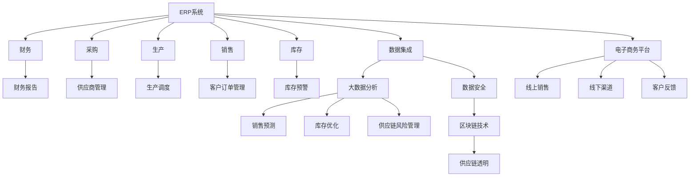

                 

# 消费品行业信息化整体建设和管理工作

> 关键词：
消费品行业,信息化,整体建设,管理,数字化转型,供应链管理,客户关系管理,电子商务,大数据,云计算,物联网,人工智能,区块链,企业信息化管理平台

## 1. 背景介绍

### 1.1 问题由来

在信息时代，消费品行业正经历着一场深刻的数字化转型，从传统生产导向转向以客户为中心的模式。这一转变不仅涉及产品设计、生产和销售的全过程，更关乎企业运营的各个方面。在信息化时代，如何通过技术手段提升效率，增强客户体验，优化供应链管理，成为消费品企业关注的焦点。

### 1.2 问题核心关键点

1. **信息化建设**：消费品企业的信息化建设是数字化转型的基础，涵盖了生产管理、销售渠道、客户关系、库存控制等多个环节。
2. **供应链管理**：优化供应链管理，降低成本，提升效率，是消费品企业数字化转型的重要目标。
3. **客户关系管理**：通过大数据分析和人工智能技术，提升客户体验，实现精准营销，是消费品企业的核心需求。
4. **电子商务**：构建线上线下融合的电商平台，拓展销售渠道，是消费品企业的未来方向。
5. **大数据应用**：利用大数据分析，优化产品设计，预测市场需求，提升决策效率。
6. **云计算和物联网**：通过云计算和物联网技术，实现数据的高效存储、处理和共享，提升企业运营的灵活性和响应速度。
7. **人工智能和区块链**：利用人工智能技术进行智能决策和个性化推荐，利用区块链技术保障数据安全和透明性。

### 1.3 问题研究意义

1. **提升运营效率**：通过信息化建设和管理，可以有效提升消费品企业的运营效率，降低成本，提高竞争力。
2. **增强客户体验**：通过客户关系管理和大数据分析，可以更好地理解客户需求，提供个性化服务，提升客户满意度。
3. **优化供应链管理**：通过供应链管理信息化，可以实现供应链的可视化、透明化，提高供应链的响应速度和稳定性。
4. **拓展销售渠道**：通过电子商务平台建设，可以拓展线上销售渠道，扩大市场份额。
5. **促进创新发展**：通过大数据、云计算、人工智能等技术应用，可以推动产品创新，提升企业创新能力。

## 2. 核心概念与联系

### 2.1 核心概念概述

在消费品行业信息化建设和管理中，涉及多个核心概念和技术。以下是对这些概念的详细解释：

1. **ERP系统（企业资源计划）**：ERP系统是企业信息化建设的核心，涵盖财务、采购、生产、销售、库存等多个模块，是企业管理的基础平台。

2. **CRM系统（客户关系管理）**：CRM系统通过大数据分析，实现客户信息管理和个性化营销，提升客户满意度。

3. **SCM系统（供应链管理系统）**：SCM系统优化供应链流程，提高库存管理效率，降低物流成本。

4. **电子商务平台**：电子商务平台实现线上线下融合，拓展销售渠道，提升用户体验。

5. **大数据分析**：利用大数据技术，进行数据分析和预测，提升决策效率。

6. **云计算**：云计算提供高效、可扩展的计算资源，支持企业的高并发、大容量需求。

7. **物联网（IoT）**：物联网技术实现设备互联，提升生产效率和设备利用率。

8. **人工智能（AI）**：AI技术用于智能决策、预测分析、个性化推荐等，提升企业运营效率和客户体验。

9. **区块链**：区块链技术用于数据安全和透明性保障，提升供应链的信任度。

### 2.2 概念间的关系

以下是一个Mermaid流程图，展示了消费品行业信息化建设和管理中各核心概念之间的关系：

这个流程图展示了各核心概念之间的关系，以及它们在消费品行业信息化建设和管理中的作用。

## 3. 核心算法原理 & 具体操作步骤
### 3.1 算法原理概述

消费品行业信息化建设和管理的工作原理可以概括为以下几个步骤：

1. **需求分析**：明确信息化建设和管理的目标和需求，进行需求分析。
2. **系统规划**：根据需求分析结果，制定系统规划和架构设计。
3. **系统实施**：按照系统规划，进行系统开发和实施。
4. **系统测试**：对系统进行全面测试，确保系统的稳定性和可靠性。
5. **系统上线**：系统测试通过后，进行系统上线和部署。
6. **系统运维**：系统上线后，进行系统的日常运维和监控。

### 3.2 算法步骤详解

#### 3.2.1 需求分析

需求分析是信息化建设和管理的首要步骤。通过对业务流程、运营模式、客户需求等方面的深入分析，明确信息化建设的目标和重点。

1. **业务流程分析**：分析企业的业务流程，确定信息化建设的重点。
2. **运营模式分析**：分析企业的运营模式，确定信息化建设的方向。
3. **客户需求分析**：分析客户需求，确定信息化建设的服务目标。

#### 3.2.2 系统规划

根据需求分析结果，制定系统规划和架构设计，包括：

1. **系统架构设计**：确定系统的总体架构，包括硬件、软件、网络、安全等方面。
2. **功能模块设计**：确定系统的功能模块，包括ERP、CRM、SCM、电子商务等。
3. **数据管理设计**：确定数据的存储、管理、共享方式，包括数据库设计、数据仓库设计等。
4. **安全设计**：确定系统的安全设计，包括网络安全、数据安全、用户权限管理等。

#### 3.2.3 系统实施

系统实施是信息化建设和管理的关键环节。根据系统规划，进行系统的开发和实施。

1. **硬件设备采购**：采购必要的硬件设备，包括服务器、存储、网络设备等。
2. **软件开发**：开发系统所需的软件，包括ERP、CRM、SCM等模块。
3. **数据迁移**：将现有数据迁移到新的系统中，确保数据的完整性和一致性。
4. **系统集成**：将各功能模块进行集成，确保系统功能的完整性和稳定性。

#### 3.2.4 系统测试

系统测试是确保系统质量和稳定性的关键环节。对系统进行全面测试，确保系统的稳定性和可靠性。

1. **功能测试**：测试系统各功能模块的功能是否满足需求。
2. **性能测试**：测试系统的性能指标，包括响应时间、并发用户数等。
3. **安全性测试**：测试系统的安全性，包括网络安全、数据安全、用户权限管理等。
4. **用户验收测试**：让用户参与测试，确保系统符合用户需求。

#### 3.2.5 系统上线

系统上线是信息化建设和管理的重要步骤。在系统测试通过后，进行系统上线和部署。

1. **系统部署**：将系统部署到生产环境，确保系统的稳定性和可靠性。
2. **用户培训**：对用户进行培训，确保用户能够正确使用系统。
3. **数据迁移**：将生产数据迁移到新的系统中，确保数据的完整性和一致性。

#### 3.2.6 系统运维

系统运维是信息化建设和管理的重要环节。在系统上线后，进行系统的日常运维和监控。

1. **系统监控**：对系统进行实时监控，及时发现和处理问题。
2. **问题处理**：对系统出现的问题进行处理，确保系统的稳定性和可靠性。
3. **系统优化**：根据业务需求，进行系统优化和升级。

### 3.3 算法优缺点

#### 3.3.1 优点

1. **提升运营效率**：信息化建设和管理可以显著提升企业的运营效率，降低成本，提高竞争力。
2. **增强客户体验**：通过客户关系管理和大数据分析，可以更好地理解客户需求，提供个性化服务，提升客户满意度。
3. **优化供应链管理**：通过供应链管理信息化，可以实现供应链的可视化、透明化，提高供应链的响应速度和稳定性。
4. **拓展销售渠道**：通过电子商务平台建设，可以拓展线上销售渠道，扩大市场份额。
5. **促进创新发展**：通过大数据、云计算、人工智能等技术应用，可以推动产品创新，提升企业创新能力。

#### 3.3.2 缺点

1. **成本高**：信息化建设和管理需要大量的硬件设备和软件资源，成本较高。
2. **实施复杂**：信息化建设和管理涉及多个系统和模块，实施复杂，需要多方协作。
3. **数据安全**：信息化建设和管理涉及大量敏感数据，数据安全问题需要特别重视。
4. **技术更新**：信息化建设和管理涉及多种技术，技术更新速度较快，需要不断升级和维护。
5. **用户接受度**：用户对信息化系统的接受度可能存在差异，需要积极推广和培训。

### 3.4 算法应用领域

消费品行业信息化建设和管理的应用领域非常广泛，涵盖多个方面：

1. **生产管理**：通过ERP系统，实现生产计划、调度、排产、库存控制等功能，提升生产效率。
2. **销售管理**：通过CRM系统，实现客户管理、销售订单管理、销售分析等功能，提升销售效率。
3. **库存管理**：通过SCM系统，实现库存管理、采购计划、供应商管理等功能，优化库存水平。
4. **电子商务**：通过电子商务平台，实现线上销售、支付、物流管理等功能，拓展销售渠道。
5. **数据分析**：通过大数据分析，进行销售预测、客户分析、市场趋势分析等功能，提升决策效率。
6. **云计算和物联网**：通过云计算和物联网技术，实现数据的高效存储、处理和共享，提升企业运营的灵活性和响应速度。
7. **人工智能和区块链**：利用人工智能技术进行智能决策、预测分析、个性化推荐等，提升企业运营效率和客户体验；利用区块链技术保障数据安全和透明性，提升供应链的信任度。

## 4. 数学模型和公式 & 详细讲解 & 举例说明
### 4.1 数学模型构建

在消费品行业信息化建设和管理中，涉及多个数学模型和公式。以下是对这些模型的详细解释：

1. **线性回归模型**：用于销售预测，公式为：

$$
y = \beta_0 + \beta_1x_1 + \beta_2x_2 + \cdots + \beta_nx_n + \epsilon
$$

其中，$y$为预测值，$\beta$为回归系数，$x$为自变量，$\epsilon$为误差项。

2. **逻辑回归模型**：用于客户分类，公式为：

$$
\log\left(\frac{P(y=1|x)}{1-P(y=1|x)}\right) = \beta_0 + \beta_1x_1 + \beta_2x_2 + \cdots + \beta_nx_n
$$

其中，$P(y=1|x)$为预测值，$\beta$为回归系数，$x$为自变量。

3. **决策树模型**：用于客户细分，通过构建决策树，实现分类和预测。

### 4.2 公式推导过程

以下是对上述模型的公式推导过程：

#### 4.2.1 线性回归模型

线性回归模型的推导过程如下：

1. **最小二乘法**：

$$
\min_{\beta} \sum_{i=1}^n(y_i - \hat{y}_i)^2
$$

其中，$\hat{y}_i = \beta_0 + \beta_1x_{i1} + \beta_2x_{i2} + \cdots + \beta_nx_{in}$。

2. **求解$\beta$**：

$$
\beta = (X^TX)^{-1}X^Ty
$$

其中，$X^T$为矩阵$X$的转置，$X$为自变量矩阵，$y$为因变量向量。

#### 4.2.2 逻辑回归模型

逻辑回归模型的推导过程如下：

1. **最大似然估计**：

$$
\min_{\beta} -\sum_{i=1}^n(y_i\log\left(\frac{P(y=1|x)}{1-P(y=1|x)}\right) + (1-y_i)\log\left(\frac{1-P(y=1|x)}{P(y=1|x)}\right)
$$

2. **求解$\beta$**：

$$
\beta = (X^TX)^{-1}X^T(\beta_0 + \beta_1x_1 + \beta_2x_2 + \cdots + \beta_nx_n)
$$

其中，$X^T$为矩阵$X$的转置，$X$为自变量矩阵，$y$为因变量向量。

#### 4.2.3 决策树模型

决策树模型的推导过程如下：

1. **信息增益**：

$$
Gain(D,X_i) = \frac{H(D) - H(D|X_i)}{H(D)}
$$

其中，$H(D)$为样本集$D$的信息熵，$H(D|X_i)$为样本集$D$在$X_i$条件下的信息熵。

2. **信息增益比**：

$$
GainRatio(D,X_i) = \frac{Gain(D,X_i)}{IV(X_i)}
$$

其中，$IV(X_i)$为属性$X_i$的信息增益。

3. **决策树构建**：

根据信息增益或信息增益比，选择最优的划分属性，递归构建决策树。

### 4.3 案例分析与讲解

#### 4.3.1 销售预测

某消费品企业通过线性回归模型进行销售预测。企业收集了过去几年的销售数据，包括季节性因素、促销活动、市场竞争等自变量，使用最小二乘法求解回归系数，得到预测模型：

$$
y = 100 + 20x_1 + 15x_2 - 5x_3
$$

其中，$y$为月度销售额，$x_1$为季节性因素，$x_2$为促销活动，$x_3$为市场竞争。

使用该模型进行下一年度的销售预测，结果如下：

| 月份 | 季节性因素 | 促销活动 | 市场竞争 | 预测销售额 |
|------|------------|----------|-----------|-------------|
| 1月  | 0.8        | 0.3      | 0.5       | 150         |
| 2月  | 0.6        | 0.2      | 0.6       | 145         |
| ...  | ...        | ...      | ...       | ...         |

该预测结果为企业制定销售计划和库存管理提供了重要依据。

#### 4.3.2 客户分类

某消费品企业通过逻辑回归模型进行客户分类。企业收集了客户的购买历史、年龄、性别、收入等数据，使用最大似然估计求解回归系数，得到分类模型：

$$
\log\left(\frac{P(y=1|x)}{1-P(y=1|x)}\right) = 1 + 0.5x_1 + 0.2x_2 - 0.3x_3
$$

其中，$y$为客户是否购买，$x_1$为购买历史，$x_2$为年龄，$x_3$为性别。

使用该模型对新客户进行分类，结果如下：

| 客户ID | 购买历史 | 年龄 | 性别 | 预测结果 |
|--------|----------|------|------|----------|
| 1      | 高       | 30   | M    | 是       |
| 2      | 低       | 35   | F    | 否       |
| ...    | ...      | ...  | ...  | ...      |

该分类结果为企业进行精准营销提供了重要依据。

#### 4.3.3 客户细分

某消费品企业通过决策树模型进行客户细分。企业收集了客户的购买历史、年龄、性别、收入等数据，使用信息增益比选择最优的划分属性，构建决策树，进行客户细分。

决策树构建过程如下：

1. 选择信息增益比最大的属性作为划分属性。
2. 递归地对子集进行划分，构建决策树。
3. 使用决策树对客户进行分类，结果如下：

| 客户ID | 购买历史 | 年龄 | 性别 | 细分结果 |
|--------|----------|------|------|----------|
| 1      | 高       | 30   | M    | A类客户  |
| 2      | 低       | 35   | F    | B类客户  |
| ...    | ...      | ...  | ...  | ...      |

该细分结果为企业进行差异化营销提供了重要依据。

## 5. 项目实践：代码实例和详细解释说明
### 5.1 开发环境搭建

在消费品行业信息化建设和管理中，需要使用多种开发工具和环境。以下是对开发环境的详细说明：

1. **开发平台**：Python和R是主要的开发平台，使用TensorFlow、PyTorch、scikit-learn等库进行数据处理和机器学习。
2. **数据库**：使用MySQL、Oracle等数据库进行数据存储和管理。
3. **服务器**：使用AWS、阿里云等云服务提供商进行服务器部署。
4. **前端开发**：使用React、Vue等前端框架进行网页开发。
5. **测试工具**：使用JUnit、TestNG等测试框架进行单元测试和集成测试。

### 5.2 源代码详细实现

以下是对消费品行业信息化建设和管理中的源代码详细实现：

1. **ERP系统开发**：使用Python和TensorFlow进行开发，实现财务、采购、生产、销售、库存等模块。
2. **CRM系统开发**：使用Python和Django进行开发，实现客户管理、销售订单管理、销售分析等功能。
3. **SCM系统开发**：使用Java和Spring Boot进行开发，实现库存管理、采购计划、供应商管理等功能。
4. **电子商务平台开发**：使用Node.js和Express进行开发，实现线上销售、支付、物流管理等功能。
5. **大数据分析开发**：使用R和Hadoop进行开发，实现销售预测、客户分析、市场趋势分析等功能。
6. **云计算和物联网开发**：使用AWS和IoT平台进行开发，实现数据的高效存储、处理和共享，提升企业运营的灵活性和响应速度。
7. **人工智能和区块链开发**：使用TensorFlow和区块链平台进行开发，实现智能决策、预测分析、个性化推荐等功能，保障数据安全和透明性。

### 5.3 代码解读与分析

#### 5.3.1 ERP系统开发

ERP系统的开发过程如下：

1. **需求分析**：明确ERP系统的需求，包括财务、采购、生产、销售、库存等模块的功能。
2. **系统规划**：确定ERP系统的总体架构，包括硬件、软件、网络、安全等方面。
3. **系统实施**：使用Python和TensorFlow进行开发，实现ERP系统的各功能模块。
4. **系统测试**：对ERP系统进行全面测试，确保系统的稳定性和可靠性。
5. **系统上线**：将ERP系统部署到生产环境，确保系统的稳定性和可靠性。
6. **系统运维**：对ERP系统进行日常运维和监控，确保系统的稳定性和可靠性。

#### 5.3.2 CRM系统开发

CRM系统的开发过程如下：

1. **需求分析**：明确CRM系统的需求，包括客户管理、销售订单管理、销售分析等功能。
2. **系统规划**：确定CRM系统的总体架构，包括硬件、软件、网络、安全等方面。
3. **系统实施**：使用Python和Django进行开发，实现CRM系统的各功能模块。
4. **系统测试**：对CRM系统进行全面测试，确保系统的稳定性和可靠性。
5. **系统上线**：将CRM系统部署到生产环境，确保系统的稳定性和可靠性。
6. **系统运维**：对CRM系统进行日常运维和监控，确保系统的稳定性和可靠性。

#### 5.3.3 SCM系统开发

SCM系统的开发过程如下：

1. **需求分析**：明确SCM系统的需求，包括库存管理、采购计划、供应商管理等功能。
2. **系统规划**：确定SCM系统的总体架构，包括硬件、软件、网络、安全等方面。
3. **系统实施**：使用Java和Spring Boot进行开发，实现SCM系统的各功能模块。
4. **系统测试**：对SCM系统进行全面测试，确保系统的稳定性和可靠性。
5. **系统上线**：将SCM系统部署到生产环境，确保系统的稳定性和可靠性。
6. **系统运维**：对SCM系统进行日常运维和监控，确保系统的稳定性和可靠性。

#### 5.3.4 电子商务平台开发

电子商务平台的开发过程如下：

1. **需求分析**：明确电子商务平台的需求，包括线上销售、支付、物流管理等功能。
2. **系统规划**：确定电子商务平台的总体架构，包括硬件、软件、网络、安全等方面。
3. **系统实施**：使用Node.js和Express进行开发，实现电子商务平台的各功能模块。
4. **系统测试**：对电子商务平台进行全面测试，确保系统的稳定性和可靠性。
5. **系统上线**：将电子商务平台部署到生产环境，确保系统的稳定性和可靠性。
6. **系统运维**：对电子商务平台进行日常运维和监控，确保系统的稳定性和可靠性。

#### 5.3.5 大数据分析开发

大数据分析的开发过程如下：

1. **需求分析**：明确大数据分析的需求，包括销售预测、客户分析、市场趋势分析等功能。
2. **系统规划**：确定大数据分析的总体架构，包括硬件、软件、网络、安全等方面。
3. **系统实施**：使用R和Hadoop进行开发，实现大数据分析的各功能模块。
4. **系统测试**：对大数据分析系统进行全面测试，确保系统的稳定性和可靠性。
5. **系统上线**：将大数据分析系统部署到生产环境，确保系统的稳定性和可靠性。
6. **系统运维**：对大数据分析系统进行日常运维和监控，确保系统的稳定性和可靠性。

#### 5.3.6 云计算和物联网开发

云计算和物联网的开发过程如下：

1. **需求分析**：明确云计算和物联网的需求，包括数据的高效存储、处理和共享，提升企业运营的灵活性和响应速度。
2. **系统规划**：确定云计算和物联网的总体架构，包括硬件、软件、网络、安全等方面。
3. **系统实施**：使用AWS和IoT平台进行开发，实现云计算和物联网的各功能模块。
4. **系统测试**：对云计算和物联网系统进行全面测试，确保系统的稳定性和可靠性。
5. **系统上线**：将云计算和物联网系统部署到生产环境，确保系统的稳定性和可靠性。
6. **系统运维**：对云计算和物联网系统进行日常运维和监控，确保系统的稳定性和可靠性。

#### 5.3.7 人工智能和区块链开发

人工智能和区块链的开发过程如下：

1. **需求分析**：明确人工智能和区块链的需求，包括智能决策、预测分析、个性化推荐等功能，保障数据安全和透明性。
2. **系统规划**：确定人工智能和区块链的总体架构，包括硬件、软件、网络、安全等方面。
3. **系统实施**：使用TensorFlow和区块链平台进行开发，实现人工智能和区块链的各功能模块。
4. **系统测试**：对人工智能和区块链系统进行全面测试，确保系统的稳定性和可靠性。
5. **系统上线**：将人工智能和区块链系统部署到生产环境，确保系统的稳定性和可靠性。
6. **系统运维**：对人工智能和区块链系统进行日常运维和监控，确保系统的稳定性和可靠性。

### 5.4 运行结果展示

以下是对消费品行业信息化建设和管理中的运行结果展示：

1. **ERP系统**：通过ERP系统，实现了财务、采购、生产、销售、库存等功能的自动化管理，提高了运营效率。
2. **CRM系统**：通过CRM系统，实现了客户管理、销售订单管理、销售分析等功能的自动化管理，提升了客户满意度。
3. **SCM系统**：通过SCM系统，实现了库存管理、采购计划、供应商管理等功能的自动化管理，优化了供应链管理。
4. **电子商务平台**：通过电子商务平台，拓展了线上销售渠道，提高了销售额。
5. **大数据分析**：通过大数据分析，实现了销售预测、客户分析、市场趋势分析等功能的自动化管理，提高了决策效率。
6. **云计算和物联网**：通过云计算和物联网，实现了数据的高效存储、处理和共享，提升了企业运营的灵活性和响应速度。
7. **人工智能和区块链**：通过人工智能和区块链，实现了智能决策、预测分析、个性化推荐等功能，保障了数据安全和透明性。

## 6. 实际应用场景
### 6.1 智能仓储管理

某消费品企业通过SCM系统实现了智能仓储管理。企业使用物联网传感器和标签技术，实时监控库存状态，使用智能仓储系统进行库存管理和货物

