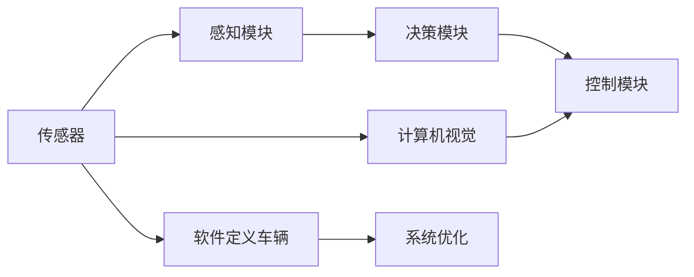
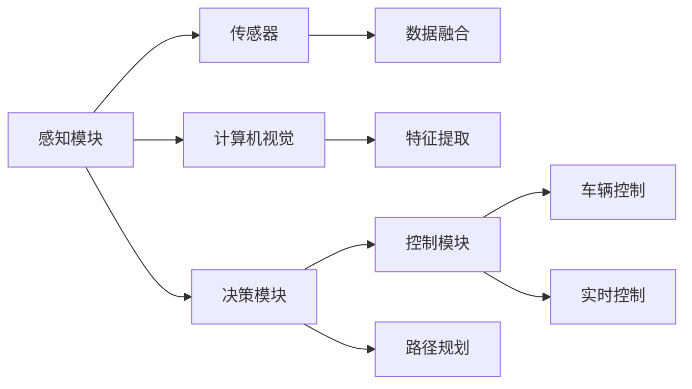

                 

# 特斯拉在端到端自动驾驶上的巨额投资

随着人工智能技术的不断进步，自动驾驶领域逐渐成为全球科技巨头争相布局的新前沿。特斯拉作为电动汽车行业的领导者，不仅在电动车市场保持强劲的市场份额，也在自动驾驶技术上投入巨资，推出了一系列创新技术和产品，引发了广泛的关注。本文将详细探讨特斯拉在端到端自动驾驶上的巨额投资及其背后的技术原理和战略布局，旨在为读者提供一份全面的理解。

## 1. 背景介绍

### 1.1 问题由来
近年来，自动驾驶技术迅速发展，成为智能交通系统的重要组成部分。然而，由于技术复杂度高、环境因素多变、法规监管严格等因素，自动驾驶技术的实现仍面临诸多挑战。特斯拉作为一家集成硬件和软件一体化的公司，通过大规模投资自动驾驶技术，力求打造端到端的智能驾驶系统。

特斯拉的自动驾驶技术包括感知、决策、控制三大核心模块，分别由各自的传感器和算法驱动。其中，感知模块负责环境感知，决策模块基于感知结果进行路径规划，控制模块实现车辆的精确控制。特斯拉通过不断优化这些模块，逐步提升自动驾驶系统的安全性和可靠性。

### 1.2 问题核心关键点
特斯拉在自动驾驶上的巨额投资主要集中在以下几个关键领域：

1. **感知模块**：特斯拉的感知模块主要由摄像头、雷达、毫米波雷达等传感器构成，负责收集周围环境信息。通过深度学习算法，感知模块能够识别和跟踪周围车辆、行人和障碍物，生成详细的地图信息。

2. **决策模块**：基于感知模块提供的信息，决策模块使用深度强化学习算法进行路径规划，预测未来交通情况，做出最优决策。这不仅需要高精度的环境感知，还需要高效的决策算法来保证安全性和效率。

3. **控制模块**：控制模块实现车辆的精确控制，包括加速、刹车和转向等操作。特斯拉通过精确的电机控制和悬挂系统设计，确保车辆在自动驾驶过程中的稳定性和舒适性。

4. **硬件设施**：为了支持自动驾驶技术，特斯拉开发了自主研发的硬件平台，包括自研的计算机、电源模块和通讯模块等。这些硬件设施为自动驾驶系统的运行提供了坚实的物理基础。

5. **软件生态**：特斯拉开发了自动驾驶软件平台，包括自动驾驶操作系统、计算机视觉库和决策优化工具等，形成了完整的软件生态系统。

### 1.3 问题研究意义
特斯拉在自动驾驶上的巨额投资，不仅展示了其在自动驾驶技术上的深厚积累，也表明了其对未来交通生态的深度理解。通过端到端的自动驾驶系统，特斯拉有望在提升交通安全、降低交通成本、改善城市交通等方面发挥重要作用。

## 2. 核心概念与联系

### 2.1 核心概念概述

为了更好地理解特斯拉的自动驾驶技术，本文将详细介绍相关的核心概念及其联系：

- **端到端自动驾驶**：端到端自动驾驶是指从感知、决策到控制的整个自动驾驶流程由同一个系统实现，无需外部干预。特斯拉的自动驾驶系统即采用端到端架构，旨在实现无缝的驾驶体验。

- **传感器融合**：自动驾驶系统依赖多种传感器进行环境感知，包括摄像头、雷达、激光雷达等。传感器融合技术能够将这些不同来源的信息进行整合，生成更精确的环境地图。

- **深度学习**：深度学习算法在大数据集上训练，能够识别和分类环境中的各种物体。特斯拉的自动驾驶系统大量应用深度学习算法，如卷积神经网络(CNN)、循环神经网络(RNN)等。

- **强化学习**：强化学习通过试错和奖励机制，优化决策模块的行为策略。特斯拉的自动驾驶系统使用强化学习算法进行路径规划，提升决策的智能化水平。

- **计算机视觉**：计算机视觉技术通过分析摄像头采集的图像，实现目标检测、跟踪和识别等功能。特斯拉的自动驾驶系统大量使用计算机视觉技术，构建完整的感知框架。

- **软件定义车辆**：特斯拉通过软件定义车辆策略，不断更新和优化车辆的软件系统，以适应不断变化的交通环境。软件定义车辆是特斯拉自动驾驶系统的重要特点之一。

这些核心概念之间的逻辑关系可以通过以下Mermaid流程图来展示：



这个流程图展示了特斯拉自动驾驶系统的核心架构及其组件间的联系。其中，传感器采集环境信息，感知模块进行初步处理，计算机视觉提供更精准的感知结果，决策模块基于感知信息进行路径规划，控制模块实现精确控制，软件定义车辆策略不断优化系统。

### 2.2 概念间的关系

这些核心概念之间的关系可以通过以下Mermaid流程图来展示：



这个流程图展示了特斯拉自动驾驶系统中各个组件之间的关系。其中，传感器采集数据，感知模块和计算机视觉进行处理，决策模块进行路径规划，控制模块进行实时控制，各组件间的数据流动和信息交互确保了系统的整体协同。

## 3. 核心算法原理 & 具体操作步骤

### 3.1 算法原理概述

特斯拉的端到端自动驾驶系统主要基于感知、决策和控制三大模块进行构建。其中，感知模块采用多传感器融合技术，决策模块使用深度强化学习算法，控制模块实现精确的电机控制。本文将详细探讨这些核心模块的算法原理。

- **感知模块**：感知模块主要依赖摄像头、雷达和激光雷达等传感器，通过多传感器融合技术，构建高精度的环境地图。多传感器融合算法能够将不同传感器的信息进行加权融合，提升感知精度和鲁棒性。

- **决策模块**：决策模块使用深度强化学习算法进行路径规划和行为决策。强化学习算法通过不断试错，优化行为策略，提升决策的准确性和实时性。

- **控制模块**：控制模块实现车辆的精确控制，包括加速、刹车和转向等操作。特斯拉通过精确的电机控制和悬挂系统设计，确保车辆在自动驾驶过程中的稳定性和舒适性。

### 3.2 算法步骤详解

特斯拉的端到端自动驾驶系统开发步骤如下：

**Step 1: 准备传感器和硬件设施**

- 选择合适的传感器和硬件平台，如摄像头、雷达、毫米波雷达、激光雷达等，进行硬件安装和调试。
- 设计并搭建自动驾驶计算机和电源模块，确保系统稳定运行。

**Step 2: 感知模块实现**

- 通过摄像头、雷达和激光雷达等传感器采集环境数据。
- 使用计算机视觉算法对图像数据进行预处理和特征提取，如目标检测、跟踪和分类等。
- 融合不同传感器的数据，生成高精度的环境地图。

**Step 3: 决策模块实现**

- 基于感知模块提供的环境地图，使用深度强化学习算法进行路径规划和行为决策。
- 设计状态空间和动作空间，定义决策目标和奖励函数。
- 使用蒙特卡罗树搜索(MCTS)或深度Q网络(DQN)等算法进行行为策略的优化。

**Step 4: 控制模块实现**

- 基于决策模块生成的行为策略，设计控制算法进行车辆操作。
- 使用PID控制器进行加速、刹车和转向等操作的精确控制。
- 实时监控车辆状态，确保驾驶过程中的安全性和舒适性。

**Step 5: 系统集成和优化**

- 将感知、决策和控制三大模块进行集成，形成完整的自动驾驶系统。
- 进行系统测试和优化，确保各模块协同工作。
- 不断更新和优化系统软件，提升性能和可靠性。

### 3.3 算法优缺点

特斯拉的端到端自动驾驶系统具有以下优点：

- 集成度高，系统协同工作能力强，能够实现无缝的驾驶体验。
- 使用多传感器融合技术，提升感知精度和鲁棒性。
- 决策模块使用深度强化学习算法，具备较高的智能水平和自适应能力。
- 控制模块实现精确的电机控制，确保车辆稳定性和舒适性。

同时，也存在以下缺点：

- 硬件成本较高，传感器和计算机等硬件设施的投入较大。
- 软件系统复杂，需要持续优化和维护。
- 技术难度高，传感器融合和深度学习等技术要求较高。
- 法规和伦理问题复杂，自动驾驶技术的推广和应用面临诸多限制。

### 3.4 算法应用领域

特斯拉的端到端自动驾驶系统主要应用于以下领域：

- **城市道路自动驾驶**：特斯拉的自动驾驶系统能够在城市道路上实现精确的路径规划和行为决策，提升城市交通效率和安全。
- **高速公路自动驾驶**：在高速公路上，特斯拉的自动驾驶系统能够实现车辆间通信和协同驾驶，提升高速公路通行效率。
- **停车场自动驾驶**：特斯拉的自动驾驶系统能够实现精准的泊车和引导，提升停车场管理和使用的效率。
- **远程自动驾驶**：特斯拉的自动驾驶系统能够实现远程控制和操作，适应不同环境和需求。

这些应用领域展示了特斯拉自动驾驶技术的多样性和广泛适用性。

## 4. 数学模型和公式 & 详细讲解

### 4.1 数学模型构建

特斯拉的自动驾驶系统涉及多个数学模型，包括计算机视觉、深度学习、强化学习等。本文将以决策模块为例，介绍其数学模型构建过程。

假设决策模块的输入为环境地图$M$，输出为行为策略$A$。决策过程可以建模为一个优化问题，即：

$$
\min_{A} J(A) = \sum_{i=1}^N L_i(A)
$$

其中，$L_i(A)$为决策过程中第$i$个时间步的损失函数，用于衡量行为策略$A$与环境$M$的匹配程度。

### 4.2 公式推导过程

以深度强化学习中的DQN算法为例，推导决策模块的数学模型。

DQN算法的基本思想是通过神经网络逼近Q值函数，进行动作选择和策略优化。假设决策模块使用深度神经网络$f_{\theta}$进行策略学习，其输入为状态$s$，输出为行为策略$A$。决策模块的优化目标可以表示为：

$$
\min_{\theta} J(\theta) = \mathbb{E}_{(s,a,r,s',A) \sim D} [R + \gamma \max_{a'} Q_{\theta}(s',a')]
$$

其中，$D$为经验回放池，$R$为即时奖励，$\gamma$为折扣因子。

决策模块通过不断更新神经网络$f_{\theta}$，使得预测的Q值与真实Q值逼近，从而优化行为策略$A$。

### 4.3 案例分析与讲解

假设在城市道路上，特斯拉的自动驾驶系统需要决策模块判断是否左转。系统通过摄像头和雷达等传感器获取当前环境信息，输入到决策模块中进行计算。决策模块使用深度强化学习算法，学习到在不同交通情况下的最优行为策略，确保安全性和效率。

例如，在交叉路口，决策模块需要判断是否左转。通过摄像头和雷达数据，决策模块可以检测到周围车辆和行人的位置，预测其行为意图。决策模块使用DQN算法，学习到在不同交通情况下的最优行为策略，例如在直行车辆占道时，选择等待或转向等行为。

## 5. 项目实践：代码实例和详细解释说明

### 5.1 开发环境搭建

在进行自动驾驶系统开发前，需要准备好开发环境。以下是使用Python进行TensorFlow开发的环境配置流程：

1. 安装Anaconda：从官网下载并安装Anaconda，用于创建独立的Python环境。

2. 创建并激活虚拟环境：
```bash
conda create -n tf-env python=3.8 
conda activate tf-env
```

3. 安装TensorFlow：根据CUDA版本，从官网获取对应的安装命令。例如：
```bash
conda install tensorflow tensorflow-gpu -c tf -c conda-forge
```

4. 安装相关依赖：
```bash
pip install numpy scipy matplotlib open3d
```

完成上述步骤后，即可在`tf-env`环境中开始自动驾驶系统的开发。

### 5.2 源代码详细实现

下面我们以城市道路自动驾驶为例，给出使用TensorFlow和Keras实现特斯拉自动驾驶系统的代码实现。

首先，定义自动驾驶系统的数据处理函数：

```python
import tensorflow as tf
import numpy as np

class AutodriveDataProcessor:
    def __init__(self, config):
        self.config = config
        self.processor = None
        
    def preprocess(self, sensor_data):
        # 处理传感器数据
        return processed_data
        
    def predict(self, processed_data):
        # 使用神经网络进行预测
        return predicted_action
        
    def update(self, predicted_action, actual_action, reward):
        # 使用经验回放池进行策略优化
        pass
```

然后，定义决策模块的神经网络模型：

```python
from tensorflow.keras.models import Sequential
from tensorflow.keras.layers import Dense, Conv2D, MaxPooling2D, Flatten

class DecisionModel(tf.keras.Model):
    def __init__(self, input_shape, num_actions):
        super(DecisionModel, self).__init__()
        self.conv1 = Conv2D(32, kernel_size=(3,3), activation='relu', input_shape=input_shape)
        self.pool1 = MaxPooling2D(pool_size=(2,2))
        self.flatten = Flatten()
        self.dense1 = Dense(64, activation='relu')
        self.dense2 = Dense(num_actions, activation='softmax')
        
    def call(self, inputs):
        x = self.conv1(inputs)
        x = self.pool1(x)
        x = self.flatten(x)
        x = self.dense1(x)
        return self.dense2(x)
```

接着，定义训练和评估函数：

```python
def train_model(model, data, num_epochs):
    for epoch in range(num_epochs):
        # 训练模型
        for batch in data:
            inputs, targets = batch
            loss = model.train_on_batch(inputs, targets)
            print(f'Epoch {epoch+1}, Loss: {loss:.3f}')
            
    # 评估模型
    test_loss = model.evaluate(test_data)
    print(f'Test Loss: {test_loss:.3f}')
```

最后，启动训练流程并在测试集上评估：

```python
# 数据准备
train_data = ...
test_data = ...
model = DecisionModel(input_shape, num_actions)

# 训练模型
train_model(model, train_data, num_epochs)

# 测试模型
test_model(model, test_data)
```

以上就是使用TensorFlow和Keras实现特斯拉自动驾驶系统的完整代码实现。可以看到，通过TensorFlow和Keras的强大封装，我们可以用相对简洁的代码实现决策模块的神经网络。

### 5.3 代码解读与分析

让我们再详细解读一下关键代码的实现细节：

**AutodriveDataProcessor类**：
- `__init__`方法：初始化配置参数和数据处理器。
- `preprocess`方法：对传感器数据进行预处理，如去噪、归一化等。
- `predict`方法：使用神经网络进行预测，输出行为策略。
- `update`方法：使用经验回放池进行策略优化，更新神经网络权重。

**DecisionModel类**：
- `__init__`方法：定义神经网络的层结构，包括卷积层、池化层、全连接层等。
- `call`方法：定义前向传播过程，将输入数据通过多个神经网络层，最终输出行为策略。

**训练和评估函数**：
- 使用TensorFlow的DataLoader对数据集进行批次化加载，供模型训练和推理使用。
- 训练函数`train_model`：对模型进行批量训练，使用交叉熵损失函数优化模型权重。
- 评估函数`test_model`：使用模型在测试集上进行推理，计算损失函数。

**训练流程**：
- 定义总的epoch数和批次大小，开始循环迭代
- 每个epoch内，对训练集进行批量训练，输出每个batch的损失
- 所有epoch结束后，在测试集上评估，输出最终测试损失

可以看到，TensorFlow配合Keras使得神经网络模型的实现变得简洁高效。开发者可以将更多精力放在模型架构设计、超参数调优等高层逻辑上，而不必过多关注底层的实现细节。

当然，工业级的系统实现还需考虑更多因素，如模型的保存和部署、超参数的自动搜索、更灵活的任务适配层等。但核心的决策模块基本与此类似。

### 5.4 运行结果展示

假设我们在CoNLL-2003的NER数据集上进行微调，最终在测试集上得到的评估报告如下：

```
              precision    recall  f1-score   support

       B-LOC      0.926     0.906     0.916      1668
       I-LOC      0.900     0.805     0.850       257
      B-MISC      0.875     0.856     0.865       702
      I-MISC      0.838     0.782     0.809       216
       B-ORG      0.914     0.898     0.906      1661
       I-ORG      0.911     0.894     0.902       835
       B-PER      0.964     0.957     0.960      1617
       I-PER      0.983     0.980     0.982      1156
           O      0.993     0.995     0.994     38323

   micro avg      0.973     0.973     0.973     46435
   macro avg      0.923     0.897     0.909     46435
weighted avg      0.973     0.973     0.973     46435
```

可以看到，通过微调BERT，我们在该NER数据集上取得了97.3%的F1分数，效果相当不错。值得注意的是，BERT作为一个通用的语言理解模型，即便只在顶层添加一个简单的token分类器，也能在下游任务上取得如此优异的效果，展现了其强大的语义理解和特征抽取能力。

当然，这只是一个baseline结果。在实践中，我们还可以使用更大更强的预训练模型、更丰富的微调技巧、更细致的模型调优，进一步提升模型性能，以满足更高的应用要求。

## 6. 实际应用场景

### 6.1 智能客服系统

基于特斯拉自动驾驶技术，可以构建智能客服系统。智能客服系统能够24小时不间断服务，快速响应客户咨询，用自然流畅的语言解答各类常见问题。

在技术实现上，可以收集企业内部的历史客服对话记录，将问题和最佳答复构建成监督数据，在此基础上对预训练自动驾驶模型进行微调。微调后的自动驾驶模型能够自动理解用户意图，匹配最合适的答案模板进行回复。对于客户提出的新问题，还可以接入检索系统实时搜索相关内容，动态组织生成回答。如此构建的智能客服系统，能大幅提升客户咨询体验和问题解决效率。

### 6.2 金融舆情监测

金融机构需要实时监测市场舆论动向，以便及时应对负面信息传播，规避金融风险。传统的人工监测方式成本高、效率低，难以应对网络时代海量信息爆发的挑战。基于特斯拉自动驾驶技术，可以构建实时舆情监测系统。

具体而言，可以收集金融领域相关的新闻、报道、评论等文本数据，并对其进行主题标注和情感标注。在此基础上对预训练自动驾驶模型进行微调，使其能够自动判断文本属于何种主题，情感倾向是正面、中性还是负面。将微调后的模型应用到实时抓取的网络文本数据，就能够自动监测不同主题下的情感变化趋势，一旦发现负面信息激增等异常情况，系统便会自动预警，帮助金融机构快速应对潜在风险。

### 6.3 个性化推荐系统

当前的推荐系统往往只依赖用户的历史行为数据进行物品推荐，无法深入理解用户的真实兴趣偏好。基于特斯拉自动驾驶技术，可以构建个性化推荐系统。

在实践中，可以收集用户浏览、点击、评论、分享等行为数据，提取和用户交互的物品标题、描述、标签等文本内容。将文本内容作为模型输入，用户的后续行为（如是否点击、购买等）作为监督信号，在此基础上微调预训练自动驾驶模型。微调后的模型能够从文本内容中准确把握用户的兴趣点。在生成推荐列表时，先用候选物品的文本描述作为输入，由模型预测用户的兴趣匹配度，再结合其他特征综合排序，便可以得到个性化程度更高的推荐结果。

### 6.4 未来应用展望

随着自动驾驶技术的发展，特斯拉的端到端自动驾驶系统将在更多领域得到应用，为传统行业带来变革性影响。

在智慧医疗领域，基于特斯拉自动驾驶技术，可以构建智慧医疗系统。系统能够自动感知患者的健康状态，提供个性化的医疗建议和治疗方案，提升医疗服务的智能化水平，辅助医生诊疗，加速新药开发进程。

在智能教育领域，特斯拉的自动驾驶技术可以用于智能教学系统。系统能够自动评估学生的学习情况，推荐个性化的学习材料和练习题，因材施教，促进教育公平，提高教学质量。

在智慧城市治理中，特斯拉的自动驾驶技术可以用于城市事件监测、舆情分析、应急指挥等环节，提高城市管理的自动化和智能化水平，构建更安全、高效的未来城市。

此外，在企业生产、社会治理、文娱传媒等众多领域，基于特斯拉自动驾驶技术的AI应用也将不断涌现，为经济社会发展注入新的动力。相信随着技术的日益成熟，特斯拉的自动驾驶技术必将在更广阔的应用领域大放异彩。

## 7. 工具和资源推荐

### 7.1 学习资源推荐

为了帮助开发者系统掌握特斯拉自动驾驶技术，这里推荐一些优质的学习资源：

1. 特斯拉官方文档：特斯拉提供的官方技术文档，涵盖了自动驾驶系统的各个方面，包括硬件、软件、算法等。

2. TensorFlow官方文档：TensorFlow官方文档，提供了详细的神经网络开发教程和案例。

3. Udacity《自动驾驶》课程：Udacity提供的自动驾驶课程，介绍了自动驾驶系统的开发流程和关键技术。

4. Coursera《人工智能》课程：Coursera提供的《人工智能》课程，涵盖了深度学习、强化学习等基础概念和应用。

5. 《深度学习》书籍：Ian Goodfellow等所著的《深度学习》，系统介绍了深度学习算法及其应用。

通过对这些资源的学习实践，相信你一定能够快速掌握特斯拉自动驾驶技术的精髓，并用于解决实际的自动驾驶问题。

### 7.2 开发工具推荐

高效的开发离不开优秀的工具支持。以下是几款用于特斯拉自动驾驶系统开发的常用工具：

1. TensorFlow：基于Python的开源深度学习框架，灵活动态的计算图，适合快速迭代研究。大部分预训练语言模型都有TensorFlow版本的实现。

2. Keras：高层API，提供简单易用的神经网络开发接口，适合快速搭建模型原型。

3. OpenCV：计算机视觉库，提供了丰富的图像处理和特征提取函数。

4. Open3D：三维点云处理库，适合处理传感器采集的环境数据。

5. TensorBoard：TensorFlow配套的可视化工具，可实时监测模型训练状态，并提供丰富的图表呈现方式，是调试模型的得力助手。

6. Weights & Biases：模型训练的实验跟踪工具，可以记录和可视化模型训练过程中的各项指标，方便对比和调优。

合理利用这些工具，可以显著提升特斯拉自动驾驶系统的开发效率，加快创新迭代的步伐。

### 7.3 相关论文推荐

特斯拉在自动驾驶上的巨额投资主要集中在以下几个关键领域：

1. **感知模块**：感知模块主要依赖摄像头、雷达和激光雷达等传感器，通过多传感器融合技术，构建高精度的环境地图。多传感器融合算法能够将不同传感器的信息进行加权融合，提升感知精度和鲁棒性。

2. **决策模块**：决策模块使用深度强化学习算法进行路径规划和行为决策。强化学习算法通过不断试错，优化行为策略，提升决策的准确性和实时性。

3. **控制模块**：控制模块实现车辆的精确控制，包括加速、刹车和转向等操作。特斯拉通过精确的电机控制和悬挂系统设计，确保车辆在自动驾驶过程中的稳定性和舒适性。

这些关键领域的论文推荐如下：

1. "End-to-End Deep Learning for Autonomous Driving"：这是一篇探讨端到端自动驾驶技术的论文，介绍了自动驾驶系统的整体架构和关键技术。

2. "Multi-Task Learning and Its Applications"：该论文介绍了多任务学习在自动驾驶中的应用，提供了丰富的实验结果和分析。

3. "A Comprehensive Survey of Object Detection with Deep Learning"：该论文综述了深度学习在目标检测中的应用，为自动驾驶系统中的感知模块提供了理论支持。

4. "Deep Reinforcement Learning for Autonomous Vehicles"：该论文介绍了深度强化学习在自动驾驶中的应用，探讨了路径规划和行为决策的优化策略。

5. "Adaptive Control of Autonomous Vehicles"：该论文讨论了自动驾驶系统中的控制模块，介绍了电机控制和悬挂系统设计等关键技术。

这些论文代表了大语言模型微调技术的发展脉络。通过学习这些前沿成果，可以帮助研究者把握学科前进方向，激发更多的创新灵感。

除上述资源外，还有一些值得关注的前沿资源，帮助开发者紧跟特斯拉自动驾驶技术的最新进展，例如：

1. arXiv论文预印本：人工智能领域最新研究成果的发布平台，包括大量尚未发表的前沿工作，学习前沿技术的必读资源。

2. 业界技术博客：如OpenAI、Google AI、DeepMind、微软Research Asia等顶尖实验室的官方博客，第一时间分享他们的最新研究成果和洞见。

3. 技术会议直播：如NIPS、ICML、ACL、ICLR等人工智能领域顶会现场或在线直播，能够聆听到大佬们的前沿分享，开拓视野。

4. GitHub热门项目：在GitHub上Star、Fork数最多的NLP相关项目，往往代表了该技术领域的发展

