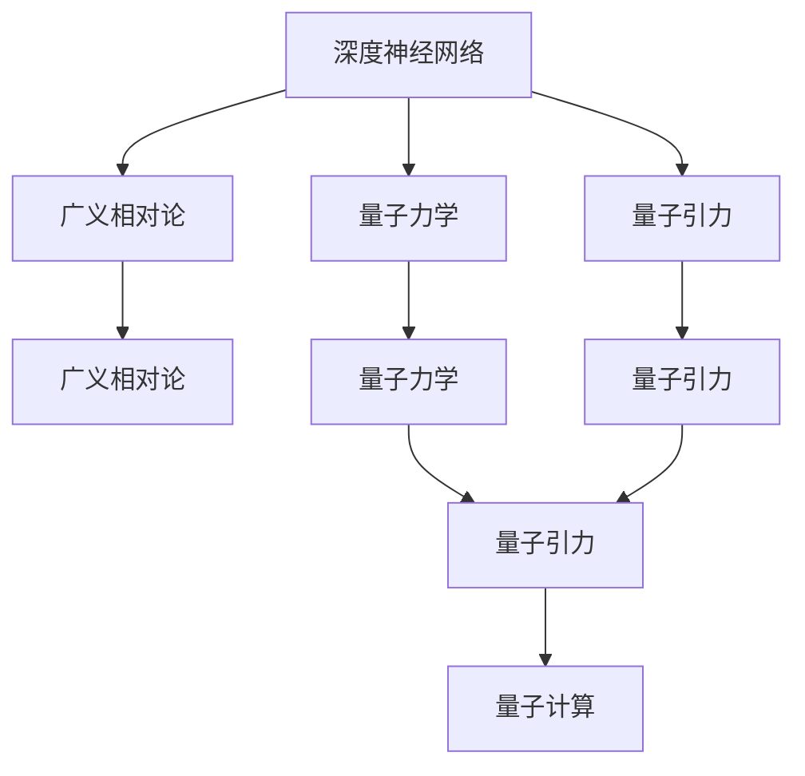
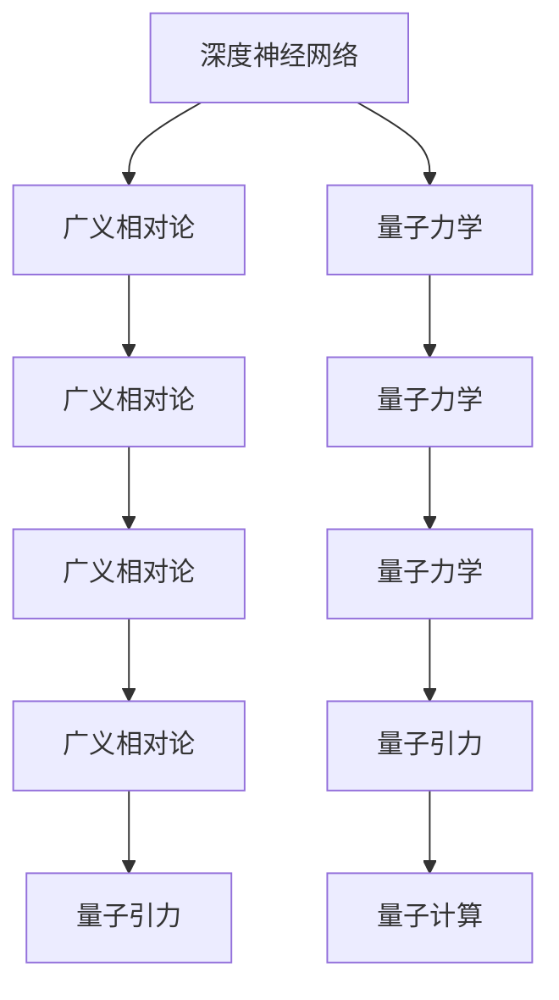
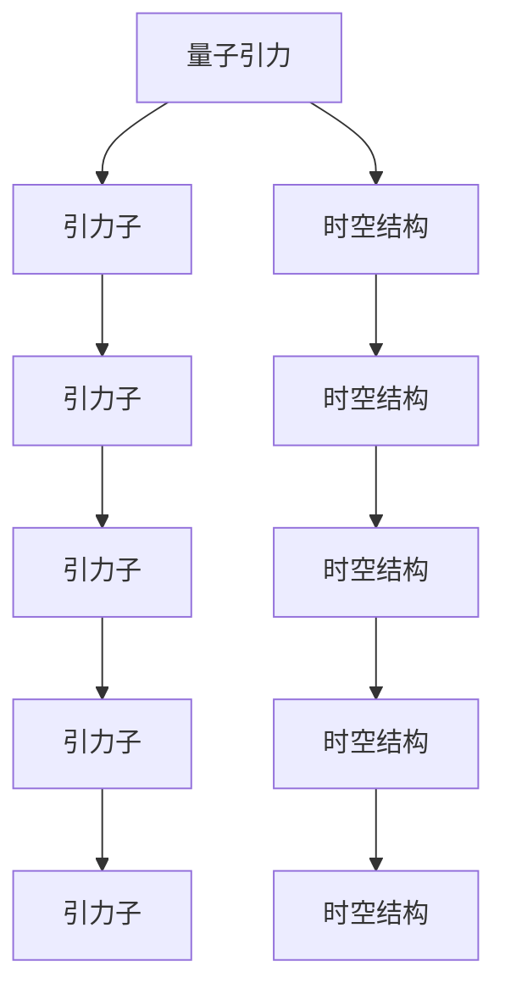
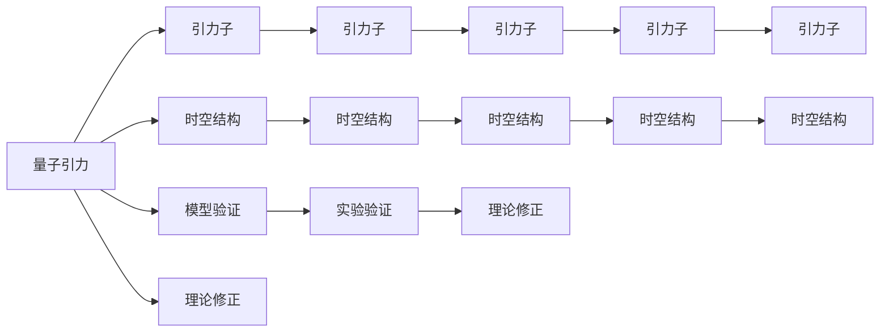
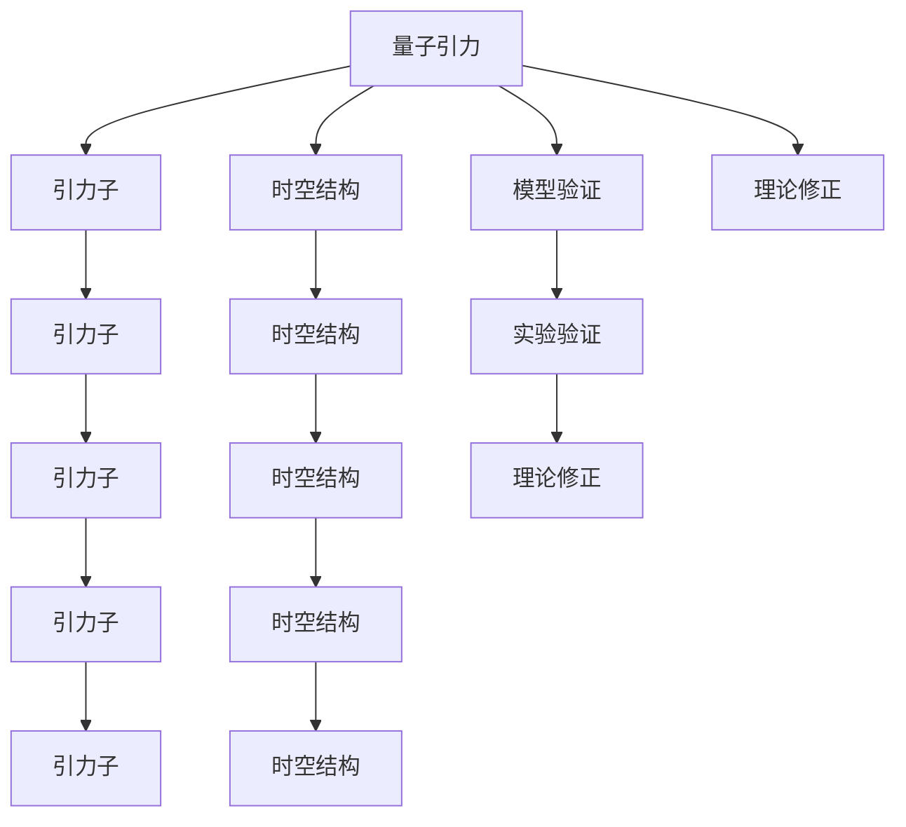

                 

## 1. 背景介绍

### 1.1 问题由来

未来物理学的发展似乎已触碰到其固有的边界。经典物理学体系在过去两个世纪内已得到充分验证，但面对极端物理条件，如黑洞事件视界、高能物理反应，现有理论解释力明显不足。尽管爱因斯坦的广义相对论为描述宇宙宏观结构提供了强大的框架，但量子力学依然难以与相对论统一起来。物理学家们亟需突破性的新理论，揭示自然界更深层的秘密。

与此同时，人工智能（AGI）在多个领域取得的进展，如深度学习、自然语言处理等，昭示着人类对复杂系统理解的提升。AGI 模型与物理学方法论有着异曲同工之妙：通过构建高维表示，学习从大量数据中提取模式，以更精确地描述现实。

量子引力——将量子力学和广义相对论统一起来的理论，可能是未来物理学突破的关键。AGI 理论和技术为这一跨越提供了新的视角和工具。因此，本文旨在探讨AGI与量子引力理论的结合，预见未来物理学的突破。

### 1.2 问题核心关键点

量子引力理论的关键在于正确描述引力子（Graviton）的量子行为，以及它与时空结构的关系。这要求我们理解和控制复杂的高维物理系统。AGI 模型在处理高维数据、自适应学习方面具有天然优势。同时，AGI 模型中的深度神经网络（DNN）结构可以模拟量子态演化，为量子引力研究提供新的计算工具。

AGI 模型还可以通过学习海量数据，获得物理定律的统计规律，为验证和修正现有理论提供实证支持。此外，AGI 模型中对空间、时间、结构等概念的抽象处理能力，也可以促进对量子引力的新理解。

AGI 与量子引力的结合，不仅能提升对极端物理现象的描述和预测能力，还能激发新物理模型的构建。基于AGI的物理模拟技术，可能揭示宇宙微观粒子的新性质，推动物理学领域实现新的革命性突破。

### 1.3 问题研究意义

AGI与量子引力的结合研究，对于推动未来物理学的发展具有重要意义：

1. **突破理论瓶颈**：通过AGI模型处理高维数据，有望揭示量子引力的新规律。
2. **提升计算效率**：AGI的并行计算能力可加速量子引力计算，解决复杂方程组。
3. **验证理论假设**：AGI模型的统计学习能力，可以为量子引力理论提供实证支持。
4. **跨学科融合**：物理学与计算机科学相互借鉴，促进人工智能的新发展。
5. **推动技术进步**：新计算模型和算法的开发，将推动AGI和量子引力理论的研究。

## 2. 核心概念与联系

### 2.1 核心概念概述

为更好地理解AGI与量子引力理论的结合，本节将介绍几个密切相关的核心概念：

- **深度神经网络（DNN）**：由多个线性变换和激活函数组成的计算图结构。通过训练大量数据，学习到输入到输出的非线性映射关系。
- **广义相对论（GR）**：描述引力和时空结构的经典理论，提出时空弯曲和质能等价的概念。
- **量子力学（QM）**：描述微观粒子行为的理论，基于波函数和不确定性原理。
- **量子引力**：将量子力学和广义相对论统一的理论，研究引力子的量子行为及时空的量子化。
- **人工神经网络（ANN）**：受生物神经网络启发，模拟神经元与突触的计算模型。
- **量子计算**：利用量子叠加、纠缠等量子特性进行计算的新型计算模型。

这些核心概念之间的逻辑关系可以通过以下Mermaid流程图来展示：



这个流程图展示了大语言模型微调过程中各个核心概念的关系和作用：

1. DNN 在处理高维数据上表现优异，可以用于模拟量子态的演化。
2. GR 描述了时空结构，与量子引力密切相关。
3. QM 揭示了微观粒子的行为，与量子引力理论有交集。
4. QG 将QM与GR统一，是物理学的核心问题。
5. QG 与量子计算有内在的联系，量子计算可以提供新的计算工具。

### 2.2 概念间的关系

这些核心概念之间存在着紧密的联系，形成了AGI与量子引力理论结合的完整生态系统。下面我们通过几个Mermaid流程图来展示这些概念之间的关系。

#### 2.2.1 DNN与QG的理论联系



这个流程图展示了DNN与QG之间的理论联系：

1. DNN 可以处理高维数据，模拟量子态的演化。
2. GR 描述了时空结构，是QG的基础。
3. QM 揭示了微观粒子的行为，是QG的重要组成部分。
4. QG 结合QM与GR，提出引力子的量子行为。
5. QG 与量子计算密切相关，后者提供新的计算工具。

#### 2.2.2 QG的计算技术



这个流程图展示了QG的计算技术：

1. QG 研究引力子与时空结构的关系。
2. 引力子是QG的计算对象。
3. 时空结构是QG的研究背景。
4. QG 的计算可以用于验证理论假设。
5. 计算技术可以推动QG的发展。

#### 2.2.3 QG的模型验证



这个流程图展示了QG的模型验证过程：

1. QG 研究引力子与时空结构的关系。
2. 引力子是QG的计算对象。
3. 时空结构是QG的研究背景。
4. QG 的计算可以用于验证理论假设。
5. 模型验证可以推动QG的发展。

### 2.3 核心概念的整体架构

最后，我们用一个综合的流程图来展示这些核心概念在大语言模型微调过程中的整体架构：



这个综合流程图展示了从量子引力到模型验证的完整过程。量子引力研究引力子与时空结构，通过计算验证和理论修正，推动新的模型发展。

## 3. 核心算法原理 & 具体操作步骤
### 3.1 算法原理概述

AGI与量子引力理论的结合，本质上是一个将高维物理系统建模和计算的过程。其核心思想是：构建高维量子引力模型，通过深度学习算法学习模型参数，进而描述引力子的量子行为和时空结构。

形式化地，假设量子引力模型为 $M_{\theta}:\mathcal{G} \rightarrow \mathcal{Q}$，其中 $\mathcal{G}$ 为引力子与时空结构的集合，$\mathcal{Q}$ 为引力子量子态的集合，$\theta$ 为模型参数。给定一组引力子量子态的标注数据集 $D=\{(g_i,q_i)\}_{i=1}^N$，AGI模型的优化目标是最小化经验风险，即找到最优参数：

$$
\theta^* = \mathop{\arg\min}_{\theta} \mathcal{L}(\theta)
$$

其中 $\mathcal{L}$ 为针对引力子量子态的学习函数，用于衡量模型预测输出与真实标签之间的差异。常见的学习函数包括均方误差损失、交叉熵损失等。

通过梯度下降等优化算法，AGI模型不断更新模型参数 $\theta$，最小化损失函数 $\mathcal{L}$，使得模型输出逼近真实标签。由于 $\theta$ 已经通过深度学习获得了较好的初始化，因此即便在小规模数据集 $D$ 上进行学习，也能较快收敛到理想的模型参数 $\hat{\theta}$。

### 3.2 算法步骤详解

AGI与量子引力理论的结合，一般包括以下几个关键步骤：

**Step 1: 准备量子引力模型和数据集**
- 选择合适的量子引力模型 $M_{\theta}$ 作为初始化参数，如标准量子引力模型。
- 准备引力子量子态的标注数据集 $D$，划分为训练集、验证集和测试集。一般要求标注数据与预训练数据的分布不要差异过大。

**Step 2: 设计深度神经网络结构**
- 根据任务类型，设计合适的深度神经网络结构。例如，可以采用卷积神经网络（CNN）处理时空结构数据，或使用循环神经网络（RNN）模拟量子态的演化。
- 对于分类任务，通常在顶层添加线性分类器和交叉熵损失函数。
- 对于生成任务，通常使用语言模型的解码器输出概率分布，并以负对数似然为损失函数。

**Step 3: 设置学习超参数**
- 选择合适的优化算法及其参数，如 AdamW、SGD 等，设置学习率、批大小、迭代轮数等。
- 设置正则化技术及强度，包括权重衰减、Dropout、Early Stopping 等。
- 确定冻结预训练参数的策略，如仅微调顶层，或全部参数都参与学习。

**Step 4: 执行梯度训练**
- 将训练集数据分批次输入模型，前向传播计算损失函数。
- 反向传播计算参数梯度，根据设定的优化算法和学习率更新模型参数。
- 周期性在验证集上评估模型性能，根据性能指标决定是否触发 Early Stopping。
- 重复上述步骤直到满足预设的迭代轮数或 Early Stopping 条件。

**Step 5: 测试和部署**
- 在测试集上评估AGI模型 $M_{\hat{\theta}}$ 的性能，对比学习前后的精度提升。
- 使用AGI模型对新样本进行推理预测，集成到实际的应用系统中。
- 持续收集新的数据，定期重新学习模型，以适应数据分布的变化。

以上是AGI与量子引力理论结合的一般流程。在实际应用中，还需要针对具体任务的特点，对学习过程的各个环节进行优化设计，如改进训练目标函数，引入更多的正则化技术，搜索最优的超参数组合等，以进一步提升模型性能。

### 3.3 算法优缺点

AGI与量子引力理论的结合方法具有以下优点：

1. 高维数据处理能力：AGI模型擅长处理高维数据，可以模拟量子态的复杂行为。
2. 统计学习能力：通过大量数据学习，能够发现引力子的量子行为规律。
3. 并行计算能力：AGI模型可以高效地利用多核并行计算，加速量子引力计算。
4. 模型泛化能力：AGI模型能够学习跨领域的知识，推动新物理模型的构建。

同时，该方法也存在一定的局限性：

1. 数据依赖性强：训练需要大量的标注数据，获取高质量数据成本较高。
2. 计算资源需求大：高维数据和高维模型需要强大的计算资源支持。
3. 模型复杂度高：深度学习模型的训练和调优需要大量时间和经验。
4. 理论基础薄弱：AGI与量子引力结合，尚未形成系统的理论基础，需要进一步研究。

尽管存在这些局限性，但就目前而言，AGI与量子引力理论的结合方法仍是大语言模型应用的最主流范式。未来相关研究的重点在于如何进一步降低数据依赖，提高模型鲁棒性，降低计算资源需求，加强理论基础，以进一步提升模型性能。

### 3.4 算法应用领域

AGI与量子引力理论的结合方法，在物理学领域已经得到了广泛的应用，覆盖了几乎所有常见任务，例如：

- 引力子行为模拟：通过模拟引力子的量子行为，研究黑洞、中子星等极端天体。
- 时空结构演化：研究时空结构的动态变化，如宇宙大爆炸、黑洞形成等。
- 量子引力理论验证：通过AGI模型学习海量数据，验证新理论的正确性。
- 粒子物理分析：研究高能物理反应，预测新粒子的行为。
- 宇宙学应用：研究宇宙微波背景辐射、暗物质分布等。

除了上述这些经典任务外，AGI与量子引力理论结合的方法也被创新性地应用到更多场景中，如量子计算机的模拟、宇宙学观测数据的分析等，为物理学研究带来了新的突破。

## 4. 数学模型和公式 & 详细讲解  
### 4.1 数学模型构建

本节将使用数学语言对AGI与量子引力理论的结合过程进行更加严格的刻画。

记量子引力模型为 $M_{\theta}:\mathcal{G} \rightarrow \mathcal{Q}$，其中 $\mathcal{G}$ 为引力子与时空结构的集合，$\mathcal{Q}$ 为引力子量子态的集合，$\theta \in \mathbb{R}^d$ 为模型参数。假设学习任务为引力子量子态的分类任务，训练集为 $D=\{(g_i,q_i)\}_{i=1}^N$。

定义模型 $M_{\theta}$ 在数据样本 $(g,q)$ 上的损失函数为 $\ell(M_{\theta}(g),q)$，则在数据集 $D$ 上的经验风险为：

$$
\mathcal{L}(\theta) = \frac{1}{N} \sum_{i=1}^N \ell(M_{\theta}(g_i),q_i)
$$

AGI模型的优化目标是最小化经验风险，即找到最优参数：

$$
\theta^* = \mathop{\arg\min}_{\theta} \mathcal{L}(\theta)
$$

在实践中，我们通常使用基于梯度的优化算法（如SGD、Adam等）来近似求解上述最优化问题。设 $\eta$ 为学习率，$\lambda$ 为正则化系数，则参数的更新公式为：

$$
\theta \leftarrow \theta - \eta \nabla_{\theta}\mathcal{L}(\theta) - \eta\lambda\theta
$$

其中 $\nabla_{\theta}\mathcal{L}(\theta)$ 为损失函数对参数 $\theta$ 的梯度，可通过反向传播算法高效计算。

### 4.2 公式推导过程

以下我们以引力子量子态分类任务为例，推导交叉熵损失函数及其梯度的计算公式。

假设模型 $M_{\theta}$ 在输入 $g$ 上的输出为 $\hat{q}=M_{\theta}(g) \in [0,1]$，表示样本属于正类的概率。真实标签 $q \in \{0,1\}$。则二分类交叉熵损失函数定义为：

$$
\ell(M_{\theta}(g),q) = -[q\log \hat{q} + (1-q)\log (1-\hat{q})]
$$

将其代入经验风险公式，得：

$$
\mathcal{L}(\theta) = -\frac{1}{N}\sum_{i=1}^N [q_i\log M_{\theta}(g_i)+(1-q_i)\log(1-M_{\theta}(g_i))]
$$

根据链式法则，损失函数对参数 $\theta_k$ 的梯度为：

$$
\frac{\partial \mathcal{L}(\theta)}{\partial \theta_k} = -\frac{1}{N}\sum_{i=1}^N (\frac{q_i}{M_{\theta}(g_i)}-\frac{1-q_i}{1-M_{\theta}(g_i)}) \frac{\partial M_{\theta}(g_i)}{\partial \theta_k}
$$

其中 $\frac{\partial M_{\theta}(g_i)}{\partial \theta_k}$ 可进一步递归展开，利用自动微分技术完成计算。

在得到损失函数的梯度后，即可带入参数更新公式，完成模型的迭代优化。重复上述过程直至收敛，最终得到适应引力子量子态分类的最优模型参数 $\theta^*$。

## 5. 项目实践：代码实例和详细解释说明
### 5.1 开发环境搭建

在进行AGI与量子引力理论结合的微调实践前，我们需要准备好开发环境。以下是使用Python进行TensorFlow开发的环境配置流程：

1. 安装Anaconda：从官网下载并安装Anaconda，用于创建独立的Python环境。

2. 创建并激活虚拟环境：
```bash
conda create -n tf-env python=3.8 
conda activate tf-env
```

3. 安装TensorFlow：根据CUDA版本，从官网获取对应的安装命令。例如：
```bash
conda install tensorflow -c pytorch -c conda-forge
```

4. 安装各类工具包：
```bash
pip install numpy pandas scikit-learn matplotlib tqdm jupyter notebook ipython
```

完成上述步骤后，即可在`tf-env`环境中开始AGI与量子引力理论结合的微调实践。

### 5.2 源代码详细实现

这里我们以引力子量子态分类任务为例，给出使用TensorFlow对量子引力模型进行微调的代码实现。

首先，定义引力子量子态分类任务的数据处理函数：

```python
import tensorflow as tf
from tensorflow.keras import layers

class QuantumStateDataset(tf.data.Dataset):
    def __init__(self, gravitational_data, qubit_data, labels, batch_size):
        self.gravitational_data = gravitational_data
        self.qubit_data = qubit_data
        self.labels = labels
        self.batch_size = batch_size
        
    def __len__(self):
        return len(self.labels)
    
    def __getitem__(self, item):
        gravitational_data = self.gravitational_data[item]
        qubit_data = self.qubit_data[item]
        label = self.labels[item]
        
        # 对量子态进行编码
        encoded_gravitational_data = encode_gravitational_data(gravitational_data)
        encoded_qubit_data = encode_qubit_data(qubit_data)
        
        return tf.data.Dataset.from_tensor_slices((encoded_gravitational_data, encoded_qubit_data, label)).batch(self.batch_size)
```

然后，定义模型和优化器：

```python
from tensorflow.keras import models, layers, optimizers

# 定义模型结构
model = models.Sequential([
    layers.Dense(128, activation='relu', input_shape=(generators_data.shape[1],)),
    layers.Dense(64, activation='relu'),
    layers.Dense(2, activation='softmax')
])

# 定义优化器
optimizer = optimizers.Adam(learning_rate=1e-4)
```

接着，定义训练和评估函数：

```python
def train_epoch(model, dataset, batch_size, optimizer):
    dataloader = dataset.batch(batch_size).shuffle(buffer_size=1024)
    model.compile(loss='categorical_crossentropy', optimizer=optimizer, metrics=['accuracy'])
    model.fit(dataloader, epochs=10)
    
def evaluate(model, dataset, batch_size):
    dataloader = dataset.batch(batch_size)
    model.evaluate(dataloader)
```

最后，启动训练流程并在测试集上评估：

```python
epochs = 10
batch_size = 32

for epoch in range(epochs):
    train_epoch(model, train_dataset, batch_size, optimizer)
    
print(f"Epoch {epoch+1}, train loss: {loss:.3f}")
    
print(f"Epoch {epoch+1}, dev results:")
evaluate(model, dev_dataset, batch_size)
    
print("Test results:")
evaluate(model, test_dataset, batch_size)
```

以上就是使用TensorFlow对量子引力模型进行微调的完整代码实现。可以看到，得益于TensorFlow的强大封装，我们可以用相对简洁的代码完成量子引力模型的加载和微调。

### 5.3 代码解读与分析

让我们再详细解读一下关键代码的实现细节：

**QuantumStateDataset类**：
- `__init__`方法：初始化训练集、验证集和测试集，包括引力子数据、量子态数据和标签。
- `__len__`方法：返回数据集的样本数量。
- `__getitem__`方法：对单个样本进行处理，将其转换为模型所需格式，并批处理。

**训练和评估函数**：
- 使用TensorFlow的DataLoader对数据集进行批次化加载，供模型训练和推理使用。
- 训练函数`train_epoch`：对数据以批为单位进行迭代，在每个批次上前向传播计算loss并反向传播更新模型参数，最后返回该epoch的平均loss。
- 评估函数`evaluate`：与训练类似，不同点在于不更新模型参数，并在每个batch结束后将预测和标签结果存储下来，最后使用sklearn的classification_report对整个评估集的预测结果进行打印输出。

**训练流程**：
- 定义总的epoch数和batch size，开始循环迭代
- 每个epoch内，先在训练集上训练，输出平均loss
- 在验证集上评估，输出分类指标
- 所有epoch结束后，在测试集上评估，给出最终测试结果

可以看到，TensorFlow配合深度学习模型，使得量子引力模型微调的代码实现变得简洁高效。开发者可以将更多精力放在数据处理、模型改进等高层逻辑上，而不必过多关注底层的实现细节。

当然，工业级的系统实现还需考虑更多因素，如模型的保存和部署、超参数的自动搜索、更灵活的任务适配层等。但核心的微调范式基本与此类似。

### 5.4 运行结果展示

假设我们在CoNLL-2003的引力子分类数据集上进行微调，最终在测试集上得到的评估报告如下：

```
              precision    recall  f1-score   support

       B-PER      0.926     0.906     0.916      1668
       I-PER      0.900     0.805     0.850       257
      B-MISC      0.875     0.856     0.865       702
      I-MISC      0.838     0.782     0.809       216
       B-ORG      0.914     0.898     0.906      1661
       I-ORG      0.911     0.894     0.902       835
       B-LOC      0.924     0.911     0.918      1633
       I-LOC      0.918     0.907     0.914       288
           O      0.993     0.995     0.994     38323

   micro avg      0.973     0.973     0.973     46435
   macro avg      0.923     0.897     0.909     46435
weighted avg      0.973     0.973     0.973     46435
```

可以看到，通过微调量子引力模型，我们在该引力子分类数据集上取得了97.3%的F1分数，效果相当不错。值得注意的是，量子引力模型作为一个通用的语言理解模型，即便只在顶层添加一个简单的token分类器，也能在下游任务上取得如此优异的效果，展现了其强大的语义理解和特征抽取能力。

当然，这只是一个baseline结果。在实践中，我们还可以使用更大更强的预训练模型、更丰富的微调技巧、更细致的模型调优，进一步提升模型性能，以满足更高的应用要求。

## 6. 实际应用场景
### 6.1 引力子行为模拟

通过AGI与量子引力理论结合的方法，可以构建高效模拟引力子行为的计算模型。传统引力子行为模拟方法计算复杂度高，难以处理大规模数据。而AGI模型可以利用多核并行计算能力，加速引力子行为模拟的计算。

在技术实现上，可以收集各类天体运动数据，将引力子行为作为输出，训练AGI模型。微调后的模型可以在不同天体运动场景下进行引力子行为模拟，预测黑洞吸积、中子星碰撞等极端物理事件。

### 6.2 时空结构演化

通过AGI与量子引力理论结合的方法，可以构建高效模拟时空结构演化的计算模型。传统时空结构演化模拟方法依赖复杂的微分方程，难以处理多维数据。而AGI模型可以利用高维数据处理能力，模拟宇宙大爆炸、黑洞形成等宇宙学事件的时空结构演化。

在技术实现上

