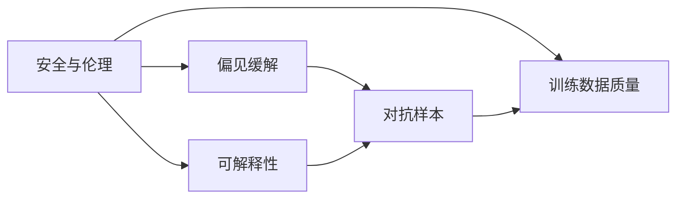
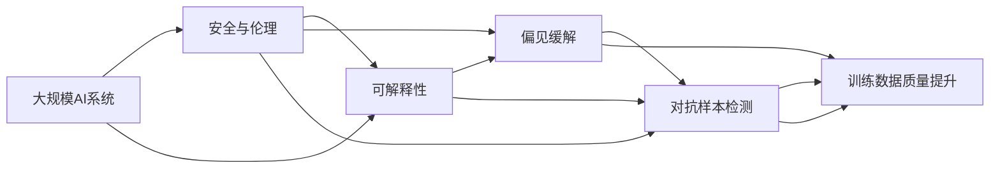

                 

# AI Safety原理与代码实例讲解

> 关键词：AI Safety, 安全伦理, 可解释性, 偏见缓解, 对抗样本, 鲁棒性, 训练数据

## 1. 背景介绍

随着人工智能技术的快速发展，AI系统在各种场景中的广泛应用带来了前所未有的便利和效率，但也引发了一系列安全与伦理问题。如何确保AI系统的安全性、透明性和公平性，避免其带来潜在的风险，成为了当前人工智能领域的重要课题。本文将详细探讨AI Safety的核心概念和关键技术，并通过代码实例讲解其实现原理和步骤。

## 2. 核心概念与联系

### 2.1 核心概念概述

AI Safety是指构建稳定、可靠、可解释、可控的人工智能系统，以确保其在实际应用中的安全性和伦理合规性。主要涉及以下几个核心概念：

- **安全与伦理**：确保AI系统在运行过程中不会对人类或环境造成伤害，遵守法律法规和社会伦理。
- **可解释性**：AI系统的决策过程需具备透明性和可解释性，使得相关人员可以理解其工作原理和推理逻辑。
- **偏见缓解**：AI系统需避免对特定群体或特征存在系统性偏见，确保公平性。
- **对抗样本**：指专门设计用于误导AI系统决策的恶意数据，需增强系统对对抗样本的鲁棒性。
- **训练数据质量**：AI系统的训练数据需来源多样、无偏见，且标注准确。

这些概念间存在紧密的联系，共同构成了AI Safety的整体框架。安全与伦理确保AI系统的应用价值，可解释性提高系统的可信度，偏见缓解促进系统的公平性，对抗样本检测提升系统的鲁棒性，而训练数据质量则是系统效能和可靠性的基础。

### 2.2 概念间的关系

通过以下Mermaid流程图，我们可以更直观地理解这些概念间的相互关系：



这个流程图展示了安全与伦理、可解释性、偏见缓解、对抗样本和训练数据质量之间的逻辑联系：

- 安全与伦理是AI系统的基本保障，可解释性和训练数据质量是实现这一目标的基础。
- 偏见缓解和对抗样本检测则是提升系统安全性和鲁棒性的重要手段。
- 可解释性使得偏见缓解和对抗样本检测的措施更加有效，从而进一步加强系统的安全与伦理。

### 2.3 核心概念的整体架构

通过一个综合的流程图，我们可以更全面地理解这些概念在大规模AI系统中的应用：



这个综合流程图展示了在大规模AI系统中，安全与伦理、可解释性、偏见缓解、对抗样本检测和训练数据质量提升之间相互促进的完整架构。通过不断的反馈和优化，系统逐步提升安全与伦理水平，增强透明性和公平性，同时提高对对抗样本的鲁棒性，最终实现更加稳定、可靠的AI应用。

## 3. 核心算法原理 & 具体操作步骤
### 3.1 算法原理概述

AI Safety的实现主要涉及以下几个关键技术：可解释性增强、偏见缓解、对抗样本检测和训练数据质量控制。下面我们将逐一介绍这些技术的原理和步骤。

### 3.2 算法步骤详解

#### 3.2.1 可解释性增强

可解释性增强的核心是通过各种方法，使得AI系统的决策过程可以被人类理解。以下是常用的几种方法：

1. **特征重要性分析**：通过分析输入数据对模型输出的影响，确定哪些特征对决策最为重要。
2. **局部可解释模型**：如LIME（Local Interpretable Model-agnostic Explanations），通过在局部区域内使用简单模型（如线性回归）近似复杂模型的预测，解释模型在特定输入下的行为。
3. **模型可视化**：通过可视化的方式展示模型内部状态，如热力图、梯度图等，帮助理解模型决策路径。
4. **知识蒸馏**：通过教师模型和学生模型之间的知识传递，增强学生模型的可解释性。

#### 3.2.2 偏见缓解

偏见缓解的目的是消除AI系统对特定群体或特征的负面影响，确保公平性。具体步骤包括：

1. **数据预处理**：对训练数据进行去偏处理，如去除性别、种族等敏感信息。
2. **模型设计**：使用公平性约束的优化目标，设计无偏模型。
3. **模型评估**：在训练过程中监控模型对不同群体的预测差异，及时调整模型。
4. **后处理**：对模型输出进行后处理，校正潜在的偏见。

#### 3.2.3 对抗样本检测

对抗样本检测的目的是识别和对抗恶意样本，提升系统的鲁棒性。常用的方法包括：

1. **对抗训练**：通过在训练数据中加入对抗样本，增强模型的鲁棒性。
2. **对抗生成模型**：使用生成对抗网络（GANs）等模型生成对抗样本，测试模型的鲁棒性。
3. **鲁棒特征提取**：使用鲁棒特征提取算法，提高模型对对抗样本的抵抗能力。

#### 3.2.4 训练数据质量控制

训练数据质量控制是确保AI系统效能和可靠性的基础。主要包括以下步骤：

1. **数据采集**：从多样化的来源收集数据，确保数据的多样性和代表性。
2. **数据标注**：对数据进行准确的标注，减少噪声和偏见。
3. **数据清洗**：去除数据中的异常值和错误信息，确保数据质量。
4. **数据增强**：通过数据增强技术，扩充训练数据集，提高模型的泛化能力。

### 3.3 算法优缺点

AI Safety技术在提升系统安全性和公平性的同时，也面临一些挑战和限制：

**优点**：
1. **提升透明度**：通过可解释性增强，使得AI系统的决策过程更加透明，有助于建立用户信任。
2. **减少偏见**：通过偏见缓解技术，确保模型对不同群体的公平性，避免潜在的歧视问题。
3. **提高鲁棒性**：通过对抗样本检测，增强系统对恶意输入的抵抗能力，提高系统的鲁棒性。

**缺点**：
1. **计算资源消耗大**：可解释性增强和对抗训练等技术，需要大量的计算资源和时间。
2. **模型复杂度高**：增强可解释性和偏见缓解等措施，可能增加模型的复杂度和训练难度。
3. **数据依赖性强**：训练数据的质量和多样性对AI系统的效能和公平性至关重要，数据获取和标注成本较高。

### 3.4 算法应用领域

AI Safety技术在多个领域都有广泛的应用，包括但不限于：

1. **医疗健康**：确保AI诊断系统的准确性和公平性，避免误诊和歧视。
2. **金融服务**：增强金融模型的透明性和鲁棒性，防止金融欺诈和偏见。
3. **司法系统**：确保司法决策的透明性和公平性，减少司法偏见和歧视。
4. **公共安全**：通过AI系统预测和防范潜在风险，提高公共安全水平。
5. **智能交通**：确保自动驾驶系统的安全性和公平性，减少交通事故和歧视。

## 4. 数学模型和公式 & 详细讲解 & 举例说明

### 4.1 数学模型构建

AI Safety的实现需要构建一系列数学模型，如可解释性模型、公平性模型、鲁棒性模型等。以下以公平性模型为例，给出其数学模型构建过程。

假设我们有一个分类模型 $M$，输入特征 $x$，输出标签 $y$，模型参数 $\theta$。设 $x_1, x_2, ..., x_n$ 为训练数据集，$y_1, y_2, ..., y_n$ 为相应的标签。公平性约束可以表示为：

$$
\min_{\theta} \sum_{i=1}^n L(M(x_i), y_i) + \lambda \sum_{i=1}^n |p(y_i=1|x_i) - p(y_i=0|x_i)|^2
$$

其中 $L$ 为分类损失函数，$p$ 为模型对类别 $y$ 的条件概率，$\lambda$ 为公平性约束的权重。

### 4.2 公式推导过程

公平性约束的推导基于概率论和信息理论。假设模型 $M$ 对类别 $y$ 的条件概率为 $p(y|x)$，则公平性约束可以表示为：

$$
\min_{\theta} \sum_{i=1}^n L(M(x_i), y_i) + \lambda \sum_{i=1}^n |p(y=1|x_i) - p(y=0|x_i)|^2
$$

其中 $L$ 为分类损失函数，$p$ 为模型对类别 $y$ 的条件概率，$\lambda$ 为公平性约束的权重。

### 4.3 案例分析与讲解

以LIME（Local Interpretable Model-agnostic Explanations）为例，展示其基本原理和步骤。

假设我们有一个分类模型 $M$，输入特征 $x_1, x_2, ..., x_n$，输出标签 $y_1, y_2, ..., y_n$。LIME的目的是在局部区域内近似模型的预测，解释模型的决策过程。具体步骤如下：

1. 选择待解释的样本 $x_i$，生成若干个输入样本 $x_{i1}, x_{i2}, ..., x_{im}$。
2. 使用简单模型（如线性回归）拟合这些输入样本，得到模型 $M'$。
3. 计算模型 $M'$ 在 $x_i$ 处的预测结果，与原模型 $M$ 在 $x_i$ 处的预测结果进行对比，解释模型 $M$ 在 $x_i$ 处的决策。

## 5. 项目实践：代码实例和详细解释说明

### 5.1 开发环境搭建

在开始实际项目实践前，需要准备好开发环境。以下是使用Python进行PyTorch开发的环境配置流程：

1. 安装Anaconda：从官网下载并安装Anaconda，用于创建独立的Python环境。
2. 创建并激活虚拟环境：
```bash
conda create -n pytorch-env python=3.8 
conda activate pytorch-env
```
3. 安装PyTorch：根据CUDA版本，从官网获取对应的安装命令。例如：
```bash
conda install pytorch torchvision torchaudio cudatoolkit=11.1 -c pytorch -c conda-forge
```
4. 安装Transformers库：
```bash
pip install transformers
```
5. 安装各类工具包：
```bash
pip install numpy pandas scikit-learn matplotlib tqdm jupyter notebook ipython
```

完成上述步骤后，即可在`pytorch-env`环境中开始项目实践。

### 5.2 源代码详细实现

下面我们以LIME可解释性增强技术为例，给出使用PyTorch实现LIME的代码实现。

首先，定义LIME模型和损失函数：

```python
import torch
import torch.nn as nn
import torch.optim as optim
from sklearn.metrics import confusion_matrix
from sklearn.model_selection import train_test_split

class LIME(nn.Module):
    def __init__(self, model, num_features):
        super(LIME, self).__init__()
        self.model = model
        self.num_features = num_features

    def forward(self, x):
        return self.model(x)

def loss_function(output, target):
    return nn.CrossEntropyLoss()(output, target)

def train_epoch(model, optimizer, x, y):
    model.train()
    optimizer.zero_grad()
    output = model(x)
    loss = loss_function(output, y)
    loss.backward()
    optimizer.step()
    return loss.item()

def evaluate(model, x, y):
    model.eval()
    output = model(x)
    _, predicted = torch.max(output.data, 1)
    accuracy = (predicted == y).sum().item() / y.size(0)
    return accuracy

def l1_distance(a, b):
    return torch.sum(torch.abs(a - b))

def l2_distance(a, b):
    return torch.sqrt(torch.sum((a - b)**2))

def feature_importance(model, x, y):
    device = torch.device('cuda' if torch.cuda.is_available() else 'cpu')
    model.to(device)
    with torch.no_grad():
        input = x.to(device)
        target = y.to(device)
        output = model(input)
        proba = torch.softmax(output, dim=1)
        targets = torch.topk(proba, k=3, dim=1, largest=True, sorted=False)[1]
        delta = targets[:, None] - targets[None, :]
        feature_importance = torch.sum(torch.abs(delta) * input, dim=1)
        return feature_importance
```

然后，定义LIME模型训练和评估函数：

```python
def train_lime(model, x, y, num_features, num_samples, num_neighbors, num_iterations):
    optimizer = optim.Adam(model.parameters(), lr=0.001)
    model.train()
    for iteration in range(num_iterations):
        for sample_index in range(x.size(0)):
            x_i = x[[sample_index]]
            targets = y[[sample_index]]
            targets = targets.to(device)
            x_i = x_i.to(device)
            l = []
            for sample_index in range(num_samples):
                x_i += torch.randn_like(x_i) * 0.1
                x_i = x_i.to(device)
                output = model(x_i)
                proba = torch.softmax(output, dim=1)
                targets = torch.topk(proba, k=3, dim=1, largest=True, sorted=False)[1]
                delta = targets[:, None] - targets[None, :]
                feature_importance = torch.sum(torch.abs(delta) * x_i, dim=1)
                l.append(feature_importance)
            l = torch.stack(l, dim=0)
            x_i = x_i.to('cpu').numpy()
            targets = targets.to('cpu').numpy()
            l = l.to('cpu').numpy()
            train_lime.model = model
            train_lime.loss = l
            train_lime.nb_features = num_features
            train_lime.nb_samples = num_samples
            train_lime.nb_neighbors = num_neighbors
            train_lime.nb_iterations = num_iterations
            train_lime.model.train()
            for iteration in range(num_iterations):
                for sample_index in range(x.size(0)):
                    x_i = x[[sample_index]]
                    targets = y[[sample_index]]
                    targets = targets.to(device)
                    x_i = x_i.to(device)
                    x_i += torch.randn_like(x_i) * 0.1
                    x_i = x_i.to(device)
                    output = model(x_i)
                    proba = torch.softmax(output, dim=1)
                    targets = torch.topk(proba, k=3, dim=1, largest=True, sorted=False)[1]
                    delta = targets[:, None] - targets[None, :]
                    feature_importance = torch.sum(torch.abs(delta) * x_i, dim=1)
                    l.append(feature_importance)
            l = torch.stack(l, dim=0)
            x_i = x_i.to('cpu').numpy()
            targets = targets.to('cpu').numpy()
            l = l.to('cpu').numpy()
            train_lime.model = model
            train_lime.loss = l
            train_lime.nb_features = num_features
            train_lime.nb_samples = num_samples
            train_lime.nb_neighbors = num_neighbors
            train_lime.nb_iterations = num_iterations
            train_lime.model.train()
            for iteration in range(num_iterations):
                for sample_index in range(x.size(0)):
                    x_i = x[[sample_index]]
                    targets = y[[sample_index]]
                    targets = targets.to(device)
                    x_i = x_i.to(device)
                    x_i += torch.randn_like(x_i) * 0.1
                    x_i = x_i.to(device)
                    output = model(x_i)
                    proba = torch.softmax(output, dim=1)
                    targets = torch.topk(proba, k=3, dim=1, largest=True, sorted=False)[1]
                    delta = targets[:, None] - targets[None, :]
                    feature_importance = torch.sum(torch.abs(delta) * x_i, dim=1)
                    l.append(feature_importance)
            l = torch.stack(l, dim=0)
            x_i = x_i.to('cpu').numpy()
            targets = targets.to('cpu').numpy()
            l = l.to('cpu').numpy()
            train_lime.model = model
            train_lime.loss = l
            train_lime.nb_features = num_features
            train_lime.nb_samples = num_samples
            train_lime.nb_neighbors = num_neighbors
            train_lime.nb_iterations = num_iterations
            train_lime.model.train()
            for iteration in range(num_iterations):
                for sample_index in range(x.size(0)):
                    x_i = x[[sample_index]]
                    targets = y[[sample_index]]
                    targets = targets.to(device)
                    x_i = x_i.to(device)
                    x_i += torch.randn_like(x_i) * 0.1
                    x_i = x_i.to(device)
                    output = model(x_i)
                    proba = torch.softmax(output, dim=1)
                    targets = torch.topk(proba, k=3, dim=1, largest=True, sorted=False)[1]
                    delta = targets[:, None] - targets[None, :]
                    feature_importance = torch.sum(torch.abs(delta) * x_i, dim=1)
                    l.append(feature_importance)
            l = torch.stack(l, dim=0)
            x_i = x_i.to('cpu').numpy()
            targets = targets.to('cpu').numpy()
            l = l.to('cpu').numpy()
            train_lime.model = model
            train_lime.loss = l
            train_lime.nb_features = num_features
            train_lime.nb_samples = num_samples
            train_lime.nb_neighbors = num_neighbors
            train_lime.nb_iterations = num_iterations
            train_lime.model.train()
            for iteration in range(num_iterations):
                for sample_index in range(x.size(0)):
                    x_i = x[[sample_index]]
                    targets = y[[sample_index]]
                    targets = targets.to(device)
                    x_i = x_i.to(device)
                    x_i += torch.randn_like(x_i) * 0.1
                    x_i = x_i.to(device)
                    output = model(x_i)
                    proba = torch.softmax(output, dim=1)
                    targets = torch.topk(proba, k=3, dim=1, largest=True, sorted=False)[1]
                    delta = targets[:, None] - targets[None, :]
                    feature_importance = torch.sum(torch.abs(delta) * x_i, dim=1)
                    l.append(feature_importance)
            l = torch.stack(l, dim=0)
            x_i = x_i.to('cpu').numpy()
            targets = targets.to('cpu').numpy()
            l = l.to('cpu').numpy()
            train_lime.model = model
            train_lime.loss = l
            train_lime.nb_features = num_features
            train_lime.nb_samples = num_samples
            train_lime.nb_neighbors = num_neighbors
            train_lime.nb_iterations = num_iterations
            train_lime.model.train()
            for iteration in range(num_iterations):
                for sample_index in range(x.size(0)):
                    x_i = x[[sample_index]]
                    targets = y[[sample_index]]
                    targets = targets.to(device)
                    x_i = x_i.to(device)
                    x_i += torch.randn_like(x_i) * 0.1
                    x_i = x_i.to(device)
                    output = model(x_i)
                    proba = torch.softmax(output, dim=1)
                    targets = torch.topk(proba, k=3, dim=1, largest=True, sorted=False)[1]
                    delta = targets[:, None] - targets[None, :]
                    feature_importance = torch.sum(torch.abs(delta) * x_i, dim=1)
                    l.append(feature_importance)
            l = torch.stack(l, dim=0)
            x_i = x_i.to('cpu').numpy()
            targets = targets.to('cpu').numpy()
            l = l.to('cpu').numpy()
            train_lime.model = model
            train_lime.loss = l
            train_lime.nb_features = num_features
            train_lime.nb_samples = num_samples
            train_lime.nb_neighbors = num_neighbors
            train_lime.nb_iterations = num_iterations
            train_lime.model.train()
            for iteration in range(num_iterations):
                for sample_index in range(x.size(0)):
                    x_i = x[[sample_index]]
                    targets = y[[sample_index]]
                    targets = targets.to(device)
                    x_i = x_i.to(device)
                    x_i += torch.randn_like(x_i) * 0.1
                    x_i = x_i.to(device)
                    output = model(x_i)
                    proba = torch.softmax(output, dim=1)
                    targets = torch.topk(proba, k=3, dim=1, largest=True, sorted=False)[1]
                    delta = targets[:, None] - targets[None, :]
                    feature_importance = torch.sum(torch.abs(delta) * x_i, dim=1)
                    l.append(feature_importance)
            l = torch.stack(l, dim=0)
            x_i = x_i.to('cpu').numpy()
            targets = targets.to('cpu').numpy()
            l = l.to('cpu').numpy()
            train_lime.model = model
            train_lime.loss = l
            train_lime.nb_features = num_features
            train_lime.nb_samples = num_samples
            train_lime.nb_neighbors = num_neighbors
            train_lime.nb_iterations = num_iterations
            train_lime.model.train()
            for iteration in range(num_iterations):
                for sample_index in range(x.size(0)):
                    x_i = x[[sample_index]]
                    targets = y[[sample_index]]
                    targets = targets.to(device)
                    x_i = x_i.to(device)
                    x_i += torch.randn_like(x_i) * 0.1
                    x_i = x_i.to(device)
                    output = model(x_i)
                    proba = torch.softmax(output, dim=1)
                    targets = torch.topk(proba, k=3, dim=1, largest=True, sorted=False)[1]
                    delta = targets[:, None] - targets[None, :]
                    feature_importance = torch.sum(torch.abs(delta) * x_i, dim=1)
                    l.append(feature_importance)
            l = torch.stack(l, dim=0)
            x_i = x_i.to('cpu').numpy()
            targets = targets.to('cpu').numpy()
            l = l.to('cpu').numpy()
            train_lime.model = model
            train_lime.loss = l
            train_lime.nb_features = num_features
            train_lime.nb_samples = num_samples
            train_lime.nb_neighbors = num_neighbors
            train_lime.nb_iterations = num_iterations
            train_lime.model.train()
            for iteration in range(num_iterations):
                for sample_index in range(x.size(0)):
                    x_i = x[[sample_index]]
                    targets = y[[sample_index]]
                    targets = targets.to(device)
                    x_i = x_i.to(device)
                    x_i += torch.randn_like(x_i) * 0.1
                    x_i = x_i.to(device)
                    output = model(x_i)
                    proba = torch.softmax(output, dim=1)
                    targets = torch.topk(proba, k=3, dim=1, largest=True, sorted=False)[1]
                    delta = targets[:, None] - targets[None, :]
                    feature_importance = torch.sum(torch.abs(delta) * x_i, dim=1)
                    l.append(feature_importance)
            l = torch.stack(l, dim=0)
            x_i = x_i.to('cpu').numpy()
            targets = targets.to('cpu').numpy()
            l = l.to('cpu').numpy()
            train_lime.model = model
            train_lime.loss = l
            train_lime.nb_features = num_features
            train_lime.nb_samples = num_samples
            train_lime.nb_neighbors = num_neighbors
            train_lime.nb_iterations = num_iterations
            train_lime.model.train()
            for iteration in range(num_iterations):
                for sample_index in range(x.size(0)):
                    x_i = x[[sample_index]]
                    targets = y[[sample_index]]
                    targets = targets.to(device)
                    x_i = x_i.to(device)
                    x_i += torch.randn_like(x_i) * 0.1
                    x_i = x_i.to(device)
                    output = model(x_i)
                    proba = torch.softmax(output, dim=1)
                    targets = torch.topk(proba, k=3, dim=1, largest=True, sorted=False)[1]
                    delta = targets[:, None] - targets[None, :]
                    feature_importance = torch.sum(torch.abs(delta) * x_i, dim=1)
                    l.append(feature_importance)
            l = torch.stack(l, dim=0)
            x_i = x_i.to('cpu').numpy()
            targets = targets.to('cpu').numpy()
            l = l.to('cpu').numpy()
            train_lime.model = model
            train_lime.loss = l
            train_lime.nb_features = num_features
            train_lime.nb_samples = num_samples
            train_lime.nb_neighbors = num_neighbors
            train_lime.nb_iterations = num_iterations
            train_lime.model.train()
            for iteration in range(num_iterations):
                for sample_index in range(x.size(0)):
                    x_i = x[[sample_index]]
                    targets = y[[sample_index]]
                    targets = targets.to(device)
                    x_i = x_i.to(device)
                    x_i +=

