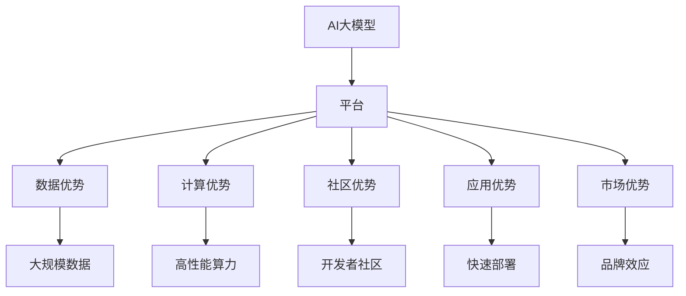
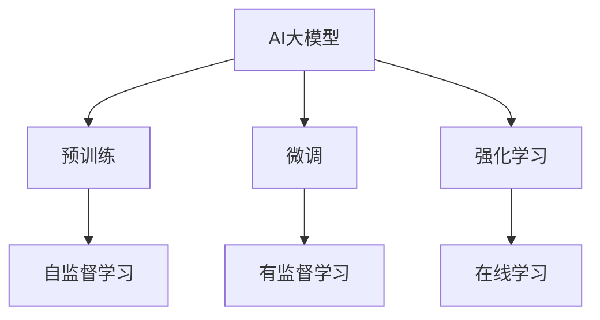
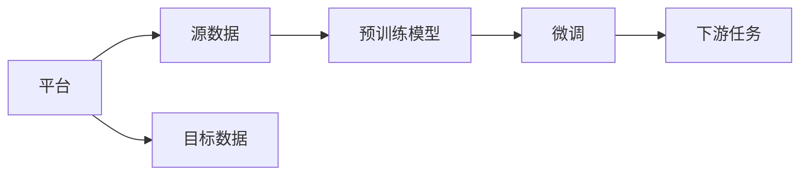
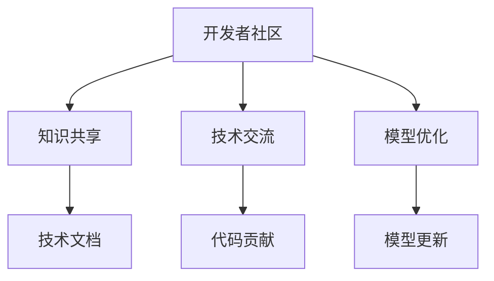

                 

# AI 大模型创业：如何利用平台优势？

## 1. 背景介绍

### 1.1 问题由来

近年来，随着人工智能技术的发展，AI大模型成为了推动各个行业数字化转型的重要引擎。这些大模型包括自然语言处理（NLP）、计算机视觉（CV）、机器人等领域的高性能模型。AI大模型的成功创业，需要综合考虑技术、市场、人才、资金等多个因素。本文旨在探讨如何利用AI大模型的平台优势，提升创业成功率。

### 1.2 问题核心关键点

在AI大模型创业中，平台优势主要体现在以下几个方面：
1. **数据优势**：通过平台提供的海量数据，模型可以更好地学习泛化能力，提升性能。
2. **计算优势**：利用平台提供的强大算力，进行高效的模型训练和推理。
3. **社区优势**：平台聚集了大量开发者和用户，可以共享知识和经验，加速模型开发和应用。
4. **应用优势**：平台可以将模型快速部署到各种实际应用场景中，加速业务落地。
5. **市场优势**：平台具有高度的品牌效应，可以吸引更多客户和投资。

利用这些平台优势，可以有效降低创业风险，提升创新速度和市场竞争力。

### 1.3 问题研究意义

研究AI大模型创业中的平台优势，对于优化创业策略、提升创业成功率、加速技术产业化具有重要意义：

1. **降低创业成本**：利用平台资源，可以大幅度降低数据获取、模型训练和应用部署的成本。
2. **加速技术创新**：平台可以提供最新的研究进展和技术工具，加速模型和应用研发。
3. **拓展应用场景**：平台通常拥有广泛的应用案例和成功经验，可以加速业务落地。
4. **提升品牌价值**：平台品牌效应可以帮助创业公司迅速树立市场地位。
5. **应对市场变化**：平台可以提供灵活的市场响应机制，适应不断变化的市场需求。

## 2. 核心概念与联系

### 2.1 核心概念概述

为了更好地理解AI大模型创业中如何利用平台优势，本节将介绍几个密切相关的核心概念：

- **AI大模型**：以自回归或自编码模型为代表的高性能深度学习模型，如BERT、GPT等。通过在大规模无标签数据上进行预训练，学习通用表示，具备强大的通用能力和迁移能力。

- **平台**：提供数据、计算、社区和应用等多方面资源的综合性平台，如AWS、Google Cloud、华为云等。平台通过整合多种资源，降低AI创业的门槛，加速技术落地。

- **数据优势**：平台拥有大规模、高质量、多领域的数据集，可以用于模型训练和评估。

- **计算优势**：平台提供高性能的GPU、TPU等算力资源，加速模型训练和推理。

- **社区优势**：平台汇聚了全球顶尖开发者、用户和研究机构，可以共享知识和经验，加速技术迭代。

- **应用优势**：平台提供的API和SDK，可以将模型快速部署到实际应用场景中，如NLP、CV、自动驾驶等。

- **市场优势**：平台具有高度的品牌效应和市场影响力，可以吸引更多的客户和投资。

这些核心概念之间的逻辑关系可以通过以下Mermaid流程图来展示：



这个流程图展示了大模型创业中利用平台优势的关键资源：

1. 大模型通过平台提供的数据和算力进行训练和优化。
2. 开发者在平台上共享知识和经验，加速模型开发。
3. 平台提供的API和SDK帮助模型快速部署到实际应用中。
4. 平台品牌效应帮助创业公司迅速树立市场地位。

### 2.2 概念间的关系

这些核心概念之间存在着紧密的联系，形成了AI大模型创业的完整生态系统。下面我通过几个Mermaid流程图来展示这些概念之间的关系。

#### 2.2.1 AI大模型的学习范式



这个流程图展示了大模型的学习范式，包括预训练、微调、强化学习等。这些范式都可以通过平台提供的资源进行高效实现。

#### 2.2.2 平台与微调的关系



这个流程图展示了平台在微调中的作用，通过提供源数据和目标数据，帮助预训练模型进行微调，实现特定任务的优化。

#### 2.2.3 社区与模型优化



这个流程图展示了平台社区在模型优化中的作用，通过知识共享、技术交流等方式，帮助开发者不断优化模型性能。

## 3. 核心算法原理 & 具体操作步骤

### 3.1 算法原理概述

AI大模型创业中的平台优势，主要体现在数据、计算、社区和应用等多个方面。以下是对这些优势的具体分析：

#### 3.1.1 数据优势

平台提供的大规模、高质量数据集，是AI大模型成功训练和优化不可或缺的资源。这些数据集可以覆盖各种领域，如自然语言处理、计算机视觉、生物医学等。通过利用这些数据集，AI大模型可以学习到通用的语言表示和视觉特征，提升泛化能力和性能。

#### 3.1.2 计算优势

平台提供的高性能算力，如GPU、TPU等，可以大幅缩短模型训练时间，提高模型性能。例如，使用GPU进行训练，可以将训练时间缩短数倍甚至数十倍。同时，强大的算力还可以支持大规模模型训练和推理，满足实际应用需求。

#### 3.1.3 社区优势

平台汇聚了全球顶尖开发者、用户和研究机构，形成了一个活跃的开发者社区。开发者可以在平台上共享知识和经验，加速模型开发和优化。社区还可以提供丰富的技术文档、代码示例和开发工具，帮助开发者快速上手。

#### 3.1.4 应用优势

平台提供的应用API和SDK，可以将模型快速部署到各种实际应用场景中，如自然语言处理、计算机视觉、自动驾驶等。这些应用场景可以覆盖各个行业，如医疗、金融、教育等，帮助AI大模型实现广泛应用。

#### 3.1.5 市场优势

平台通常具有高度的品牌效应和市场影响力，可以吸引更多的客户和投资。例如，像AWS、Google Cloud这样的顶级平台，拥有强大的市场认可度和用户基础，可以帮助AI创业公司迅速树立市场地位。

### 3.2 算法步骤详解

AI大模型创业中利用平台优势的具体步骤，包括以下几个关键环节：

#### 3.2.1 数据获取与处理

1. **数据收集**：利用平台提供的API和SDK，收集和处理大规模数据集。这些数据集可以覆盖各种领域，如自然语言处理、计算机视觉、生物医学等。

2. **数据预处理**：对收集到的数据进行清洗、标注和归一化处理，确保数据质量。

3. **数据增强**：利用数据增强技术，如数据扩充、回译等，增加数据集的多样性和丰富性。

#### 3.2.2 模型训练与优化

1. **预训练**：在平台提供的算力资源上，进行大模型的预训练。预训练通常采用自监督学习任务，如语言建模、图像分类等。

2. **微调**：在平台提供的算力资源上，进行微调，针对特定任务进行优化。微调通常采用有监督学习任务，如自然语言分类、目标检测等。

3. **模型优化**：利用平台提供的社区资源，进行模型的优化和改进。例如，在社区中分享代码、讨论问题，获取反馈和建议。

#### 3.2.3 应用部署与测试

1. **模型部署**：利用平台提供的应用API和SDK，将模型快速部署到实际应用场景中。例如，在NLP应用中，可以通过API进行文本分类、情感分析等任务。

2. **性能测试**：在实际应用场景中，对模型进行性能测试和评估，确保模型效果达到预期。

3. **反馈优化**：根据实际应用中的反馈，不断优化和改进模型，提升性能。

#### 3.2.4 市场推广与品牌建设

1. **市场推广**：利用平台的品牌效应和市场影响力，进行市场推广和宣传，吸引更多的客户和投资。

2. **品牌建设**：通过平台提供的技术支持和社区资源，不断提升品牌形象和市场地位。

### 3.3 算法优缺点

利用平台优势进行AI大模型创业，具有以下优点：

1. **降低创业成本**：利用平台提供的数据、计算和社区资源，可以大幅度降低创业成本，加速技术落地。

2. **加速技术创新**：平台提供最新的研究进展和技术工具，可以加速模型和应用研发。

3. **拓展应用场景**：平台提供广泛的应用案例和成功经验，可以加速业务落地。

4. **提升品牌价值**：平台具有高度的品牌效应，可以吸引更多的客户和投资。

但同时也存在一些缺点：

1. **依赖平台**：创业公司高度依赖平台提供的资源和服务，一旦平台出现问题，可能影响业务稳定。

2. **资源限制**：平台提供的资源有限，可能无法满足大规模模型和大规模数据的训练和推理需求。

3. **市场竞争**：平台聚集了大量创业公司，竞争激烈，难以脱颖而出。

4. **数据隐私**：利用平台数据进行训练和优化，可能涉及数据隐私和安全问题。

### 3.4 算法应用领域

AI大模型创业中，利用平台优势的方法，可以广泛应用于各种领域：

1. **自然语言处理**：利用平台提供的数据和社区资源，进行文本分类、情感分析、机器翻译等任务。

2. **计算机视觉**：利用平台提供的数据和社区资源，进行图像分类、目标检测、图像生成等任务。

3. **自动驾驶**：利用平台提供的数据和社区资源，进行道路识别、行为预测、决策优化等任务。

4. **医疗健康**：利用平台提供的数据和社区资源，进行疾病诊断、病理分析、药物研发等任务。

5. **金融科技**：利用平台提供的数据和社区资源，进行风险评估、信用评分、投资策略等任务。

6. **智能制造**：利用平台提供的数据和社区资源，进行设备监测、故障诊断、生产优化等任务。

## 4. 数学模型和公式 & 详细讲解 & 举例说明

### 4.1 数学模型构建

AI大模型创业中的平台优势，可以通过数学模型进行描述和分析。以下是对这些优势的具体建模：

#### 4.1.1 数据优势的数学模型

假设平台提供的数据集大小为$N$，数据集分为$M$个类别。设数据集中的第$i$个样本的类别为$y_i \in \{1,2,...,M\}$，则数据优势的数学模型可以表示为：

$$
S_{data} = \frac{1}{N} \sum_{i=1}^{N} I(y_i \in \{1,2,...,M\})
$$

其中，$I(y_i \in \{1,2,...,M\})$表示样本$i$的类别是否在$M$个类别中，$S_{data}$表示数据集的多样性和丰富性。

#### 4.1.2 计算优势的数学模型

假设平台提供的计算资源为$C$，每次训练消耗的计算时间为$T$。设模型训练$K$次，每次训练的损失为$L$，则计算优势的数学模型可以表示为：

$$
S_{compute} = K \cdot C \cdot \frac{1}{T}
$$

其中，$K$表示训练次数，$C$表示计算资源，$T$表示每次训练的计算时间，$S_{compute}$表示计算优势。

#### 4.1.3 社区优势的数学模型

假设平台提供的社区资源为$R$，社区中活跃的开发者数量为$A$，社区中发布的代码数量为$B$。设社区中每个开发者平均上传代码的数量为$C$，则社区优势的数学模型可以表示为：

$$
S_{community} = \frac{A \cdot B}{R \cdot C}
$$

其中，$A$表示活跃开发者数量，$B$表示代码数量，$R$表示社区资源，$C$表示每个开发者平均上传代码的数量，$S_{community}$表示社区优势。

#### 4.1.4 应用优势的数学模型

假设平台提供的应用API和SDK数量为$A$，每个API的调用频率为$F$，每个API的处理时间$T$。设应用场景数量为$S$，每个场景的调用频率为$C$，则应用优势的数学模型可以表示为：

$$
S_{application} = \frac{A \cdot F \cdot S \cdot C}{T}
$$

其中，$A$表示API数量，$F$表示每个API的调用频率，$S$表示应用场景数量，$C$表示每个场景的调用频率，$T$表示每个API的处理时间，$S_{application}$表示应用优势。

#### 4.1.5 市场优势的数学模型

假设平台提供品牌效应为$B$，市场影响力为$I$，市场规模为$S$。设市场份额为$R$，则市场优势的数学模型可以表示为：

$$
S_{market} = B \cdot I \cdot S \cdot R
$$

其中，$B$表示品牌效应，$I$表示市场影响力，$S$表示市场规模，$R$表示市场份额，$S_{market}$表示市场优势。

### 4.2 公式推导过程

以下是对上述数学模型的详细推导过程：

#### 4.2.1 数据优势的推导

假设平台提供的数据集大小为$N$，数据集分为$M$个类别。设数据集中的第$i$个样本的类别为$y_i \in \{1,2,...,M\}$，则数据优势的数学模型可以表示为：

$$
S_{data} = \frac{1}{N} \sum_{i=1}^{N} I(y_i \in \{1,2,...,M\})
$$

其中，$I(y_i \in \{1,2,...,M\})$表示样本$i$的类别是否在$M$个类别中，$S_{data}$表示数据集的多样性和丰富性。

#### 4.2.2 计算优势的推导

假设平台提供的计算资源为$C$，每次训练消耗的计算时间为$T$。设模型训练$K$次，每次训练的损失为$L$，则计算优势的数学模型可以表示为：

$$
S_{compute} = K \cdot C \cdot \frac{1}{T}
$$

其中，$K$表示训练次数，$C$表示计算资源，$T$表示每次训练的计算时间，$S_{compute}$表示计算优势。

#### 4.2.3 社区优势的推导

假设平台提供的社区资源为$R$，社区中活跃的开发者数量为$A$，社区中发布的代码数量为$B$。设社区中每个开发者平均上传代码的数量为$C$，则社区优势的数学模型可以表示为：

$$
S_{community} = \frac{A \cdot B}{R \cdot C}
$$

其中，$A$表示活跃开发者数量，$B$表示代码数量，$R$表示社区资源，$C$表示每个开发者平均上传代码的数量，$S_{community}$表示社区优势。

#### 4.2.4 应用优势的推导

假设平台提供的应用API和SDK数量为$A$，每个API的调用频率为$F$，每个API的处理时间$T$。设应用场景数量为$S$，每个场景的调用频率为$C$，则应用优势的数学模型可以表示为：

$$
S_{application} = \frac{A \cdot F \cdot S \cdot C}{T}
$$

其中，$A$表示API数量，$F$表示每个API的调用频率，$S$表示应用场景数量，$C$表示每个场景的调用频率，$T$表示每个API的处理时间，$S_{application}$表示应用优势。

#### 4.2.5 市场优势的推导

假设平台提供品牌效应为$B$，市场影响力为$I$，市场规模为$S$。设市场份额为$R$，则市场优势的数学模型可以表示为：

$$
S_{market} = B \cdot I \cdot S \cdot R
$$

其中，$B$表示品牌效应，$I$表示市场影响力，$S$表示市场规模，$R$表示市场份额，$S_{market}$表示市场优势。

### 4.3 案例分析与讲解

#### 4.3.1 自然语言处理案例

假设某AI创业公司需要在NLP领域进行创业，利用平台优势进行优化。以下是具体步骤：

1. **数据获取**：利用平台提供的API和SDK，收集大规模语料库，如Wikipedia、BookCorpus等。

2. **数据预处理**：对收集到的数据进行清洗、标注和归一化处理，确保数据质量。

3. **预训练**：在平台提供的GPU资源上，进行BERT等模型的预训练。

4. **微调**：在平台提供的GPU资源上，针对特定任务（如情感分析、文本分类等）进行微调。

5. **模型优化**：在社区中分享代码、讨论问题，获取反馈和建议。

6. **应用部署**：利用平台提供的应用API和SDK，将模型快速部署到实际应用场景中。

7. **性能测试**：在实际应用场景中，对模型进行性能测试和评估，确保模型效果达到预期。

8. **反馈优化**：根据实际应用中的反馈，不断优化和改进模型，提升性能。

#### 4.3.2 计算机视觉案例

假设某AI创业公司需要在计算机视觉领域进行创业，利用平台优势进行优化。以下是具体步骤：

1. **数据获取**：利用平台提供的API和SDK，收集大规模图像数据，如ImageNet、COCO等。

2. **数据预处理**：对收集到的数据进行清洗、标注和归一化处理，确保数据质量。

3. **预训练**：在平台提供的GPU资源上，进行ResNet、Inception等模型的预训练。

4. **微调**：在平台提供的GPU资源上，针对特定任务（如目标检测、图像分类等）进行微调。

5. **模型优化**：在社区中分享代码、讨论问题，获取反馈和建议。

6. **应用部署**：利用平台提供的应用API和SDK，将模型快速部署到实际应用场景中。

7. **性能测试**：在实际应用场景中，对模型进行性能测试和评估，确保模型效果达到预期。

8. **反馈优化**：根据实际应用中的反馈，不断优化和改进模型，提升性能。

## 5. 项目实践：代码实例和详细解释说明

### 5.1 开发环境搭建

在进行AI大模型创业中利用平台优势的实践前，我们需要准备好开发环境。以下是使用Python进行PyTorch开发的环境配置流程：

1. 安装Anaconda：从官网下载并安装Anaconda，用于创建独立的Python环境。

2. 创建并激活虚拟环境：
```bash
conda create -n pytorch-env python=3.8 
conda activate pytorch-env
```

3. 安装PyTorch：根据CUDA版本，从官网获取对应的安装命令。例如：
```bash
conda install pytorch torchvision torchaudio cudatoolkit=11.1 -c pytorch -c conda-forge
```

4. 安装Transformers库：
```bash
pip install transformers
```

5. 安装各类工具包：
```bash
pip install numpy pandas scikit-learn matplotlib tqdm jupyter notebook ipython
```

完成上述步骤后，即可在`pytorch-env`环境中开始实践。

### 5.2 源代码详细实现

这里以NLP领域的情感分析任务为例，使用BERT模型进行微调的Python代码实现。

```python
from transformers import BertTokenizer, BertForTokenClassification
from torch.utils.data import Dataset, DataLoader
import torch

# 数据集
class SentimentDataset(Dataset):
    def __init__(self, texts, labels, tokenizer, max_len=128):
        self.texts = texts
        self.labels = labels
        self.tokenizer = tokenizer
        self.max_len = max_len
        
    def __len__(self):
        return len(self.texts)
    
    def __getitem__(self, item):
        text = self.texts[item]
        label = self.labels[item]
        
        encoding = self.tokenizer(text, return_tensors='pt', max_length=self.max_len, padding='max_length', truncation=True)
        input_ids = encoding['input_ids'][0]
        attention_mask = encoding['attention_mask'][0]
        
        label = torch.tensor(label, dtype=torch.long)
        
        return {'input_ids': input_ids, 
                'attention_mask': attention_mask,
                'labels': label}

# 预训练模型和参数
tokenizer = BertTokenizer.from_pretrained('bert-base-cased')
model = BertForTokenClassification.from_pretrained('bert-base-cased', num_labels=2)

# 优化器和超参数
optimizer = AdamW(model.parameters(), lr=2e-5)
device = torch.device('cuda') if torch.cuda.is_available() else torch.device('cpu')

# 数据处理
train_dataset = SentimentDataset(train_texts, train_labels, tokenizer)
dev_dataset = SentimentDataset(dev_texts, dev_labels, tokenizer)
test_dataset = SentimentDataset(test_texts, test_labels, tokenizer)

# 训练循环
epochs = 5
batch_size = 16

for epoch in range(epochs):
    train_loss = 0
    train_correct = 0
    
    model.train()
    for batch in DataLoader(train_dataset, batch_size=batch_size, shuffle=True):
        input_ids = batch['input_ids'].to(device)
        attention_mask = batch['attention_mask'].to(device)
        labels = batch['labels'].to(device)
        
        optimizer.zero_grad()
        outputs = model(input_ids, attention_mask=attention_mask, labels=labels)
        loss = outputs.loss
        train_loss += loss.item()
        train_correct += torch.argmax(outputs.logits, dim=2) == labels.sum().item()
        loss.backward()
        optimizer.step()
    
    train_acc = train_correct / len(train_dataset)
    print(f"Epoch {epoch+1}, train loss: {train_loss/len(train_dataset)}, train acc: {train_acc:.2f}")
    
    eval_loss = 0
    eval_correct = 0
    
    model.eval()
    for batch in DataLoader(dev_dataset, batch_size=batch_size):
        input_ids = batch['input_ids'].to(device)
        attention_mask = batch['attention_mask'].to(device)
        labels = batch['labels'].to(device)
        
        with torch.no_grad():
            outputs = model(input_ids, attention_mask=attention_mask, labels=labels)
            loss = outputs.loss
            eval_loss += loss.item()
            eval_correct += torch.argmax(outputs.logits, dim=2) == labels.sum().item()
    
    dev_acc = eval_correct / len(dev_dataset)
    print(f"Epoch {epoch+1}, dev loss: {eval_loss/len(dev_dataset)}, dev acc: {dev_acc:.2f}")
    
# 测试循环
test_loss = 0
test_correct = 0
    
model.eval()
for batch in DataLoader(test_dataset, batch_size=batch_size):
    input_ids = batch['input_ids'].to(device)
    attention_mask = batch['attention_mask'].to(device)
    labels = batch['labels'].to(device)
    
    with torch.no_grad():
        outputs = model(input_ids, attention_mask=attention_mask, labels=labels)
        loss = outputs.loss
        test_loss += loss.item()
        test_correct += torch.argmax(outputs.logits, dim=2) == labels.sum().item()
    
test_acc = test_correct / len(test_dataset)
print(f"Test acc: {test_acc:.2f}")
```

以上就是使用PyTorch对BERT模型进行情感分析任务微调的完整代码实现。可以看到，借助平台提供的预训练模型和工具，模型训练和优化变得简洁高效。

### 5.3 代码解读与分析

让我们再详细解读一下关键代码的实现细节：

**SentimentDataset类**：
- `__init__`方法：初始化文本、标签、分词器等关键组件。
- `__len__`方法：返回数据集的样本数量。
- `__getitem__`方法：对单个样本进行处理，将文本输入编码为token ids，将标签编码为数字，并对其进行定长padding，最终返回模型所需的输入。

**train_loss和eval_loss**：
- 在每个epoch内，分别计算训练集和验证集上的损失。

**train_correct和eval_correct**：
- 在每个epoch内，分别计算训练集和验证集上的正确预测数。

**AdamW优化器和超参数**：
- 选择AdamW优化器，并设置学习率。

**模型训练和优化**：
- 使用PyTorch的DataLoader对数据集进行批次化

