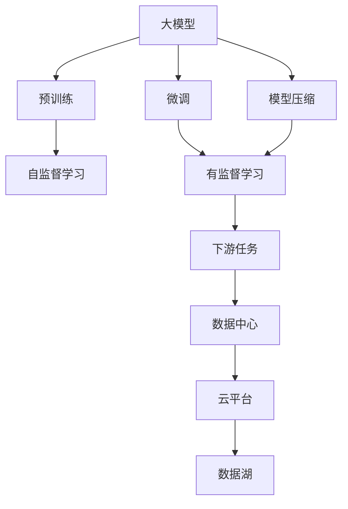
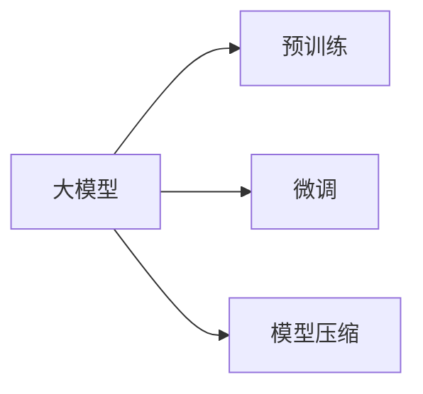
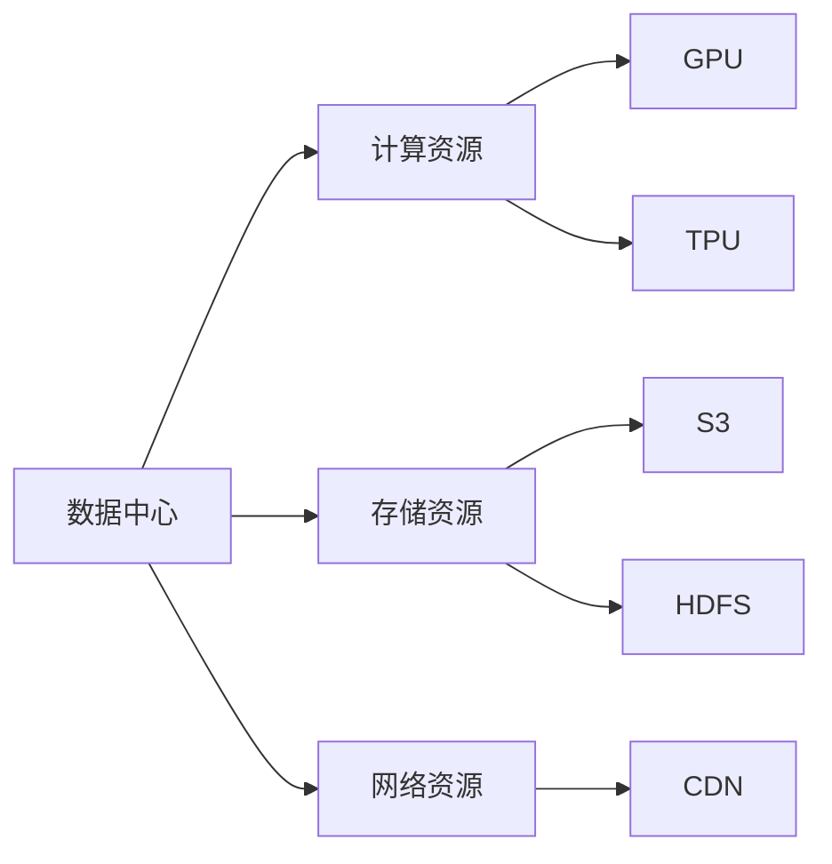
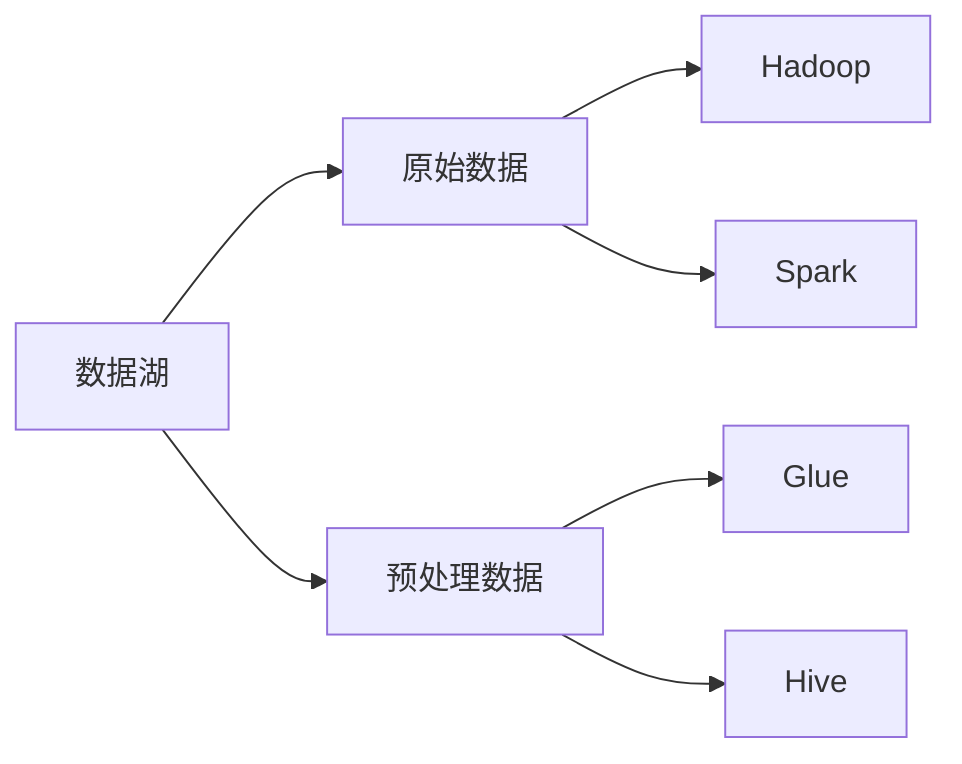
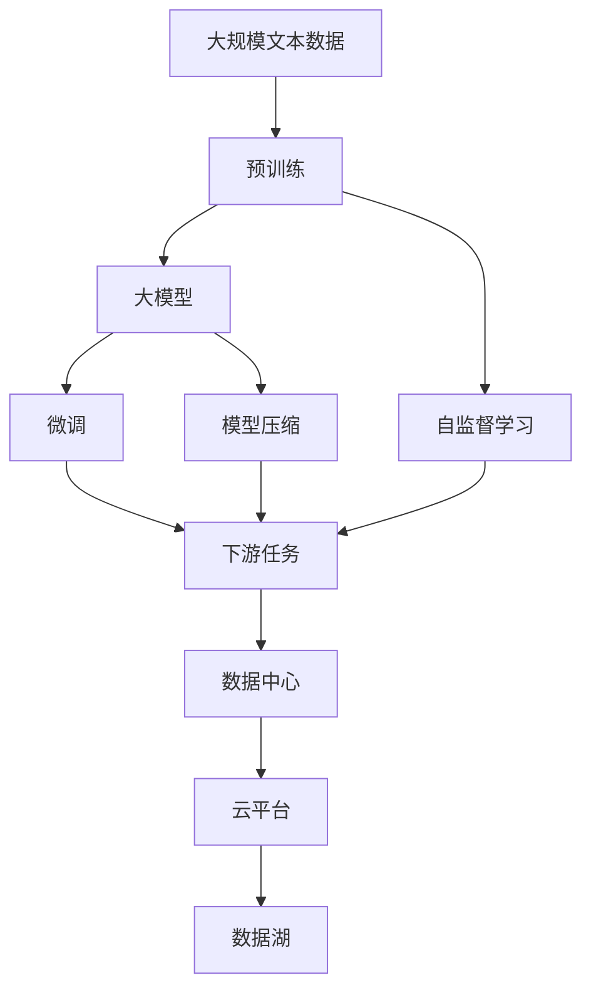

                 

## 1. 背景介绍

### 1.1 问题由来
随着人工智能（AI）技术的迅猛发展，大模型在自然语言处理（NLP）、计算机视觉（CV）、语音识别（ASR）等领域取得了巨大突破。大模型通过在大规模无标签数据上进行预训练，具备了强大的数据处理能力和泛化能力。然而，这些模型的训练和推理过程对计算资源的需求极高，且往往需要特定的硬件环境支持，如高性能的GPU、TPU等。因此，构建高效、稳定、安全的大模型应用数据中心，成为推动AI技术落地应用的关键。

### 1.2 问题核心关键点
构建大模型应用数据中心的核心关键点包括：

- **计算资源优化**：如何高效利用计算资源，降低能耗，提升计算效率。
- **硬件兼容性**：如何选择合适的主流硬件设备，确保系统兼容性和稳定性。
- **数据安全与隐私**：如何保障数据的安全存储与传输，防止数据泄露和篡改。
- **模型压缩与优化**：如何在保证模型性能的前提下，减小模型大小和推理时间。
- **系统可扩展性**：如何快速扩充和升级数据中心，满足不断增长的业务需求。

这些关键点在大模型应用数据中心的建设过程中需要综合考虑，形成一套系统全面的方案。

### 1.3 问题研究意义
构建大模型应用数据中心对于加速AI技术应用、保障数据安全、提升用户体验等方面具有重要意义：

- **加速AI应用落地**：提供高效稳定的计算环境，加速大模型的训练和推理，推动AI技术在更多领域的应用。
- **保障数据安全与隐私**：构建安全的数据中心，确保数据安全存储和传输，保护用户隐私。
- **提升用户体验**：通过高效的数据中心架构，提供快速稳定的服务响应，提升用户体验。
- **支持创新研究**：提供高性能计算资源，支持AI研究人员进行前沿研究和技术创新。

总之，构建大模型应用数据中心是实现AI技术产业化的重要环节，对于推动技术进步和商业落地具有不可替代的作用。

## 2. 核心概念与联系

### 2.1 核心概念概述

为更好地理解大模型应用数据中心的核心概念，本节将介绍几个密切相关的核心概念：

- **大模型**：指通过在大规模无标签数据上进行自监督预训练的语言模型、图像模型、语音模型等。如BERT、GPT、Vit等。
- **预训练**：指在大规模无标签数据上，通过自监督学习任务（如语言建模、图像分类、目标检测等）训练模型的过程。
- **微调(Fine-Tuning)**：指在预训练模型基础上，使用下游任务的少量标注数据，通过有监督学习优化模型在下游任务上的性能。
- **模型压缩**：指通过剪枝、量化、蒸馏等技术减小模型大小，提升推理效率的过程。
- **数据中心（DC）**：由计算、存储、网络等硬件资源组成，提供大模型应用所需的基础设施。
- **云平台**：如AWS、Google Cloud、阿里云等，提供高性能计算资源、存储服务和大模型API。
- **数据湖**：指集中存储海量原始数据的分布式文件系统，支持大模型的数据预处理和存储。

这些核心概念之间的逻辑关系可以通过以下Mermaid流程图来展示：



这个流程图展示了大模型应用数据中心的整体架构，从预训练到微调，再到模型压缩和数据中心建设，最后到云平台和数据湖的集成应用。

### 2.2 概念间的关系

这些核心概念之间存在着紧密的联系，形成了大模型应用数据中心的完整生态系统。下面我们通过几个Mermaid流程图来展示这些概念之间的关系。

#### 2.2.1 大模型的学习范式



这个流程图展示了大模型的三种主要学习范式：预训练、微调和模型压缩。预训练主要采用自监督学习方法，而微调则是有监督学习的过程。模型压缩可以在固定大部分预训练参数的情况下，减小模型大小和推理时间。

#### 2.2.2 数据中心与云平台的关系



这个流程图展示了数据中心提供的基础设施与主流硬件设备之间的对应关系。数据中心包含了计算、存储和网络等资源，这些资源通过GPU、TPU、S3、HDFS和CDN等技术实现。

#### 2.2.3 数据湖的存储与应用



这个流程图展示了数据湖与大数据处理技术之间的对应关系。数据湖存储原始数据，通过Hadoop、Spark等技术进行数据预处理和分析，最后由Glue、Hive等技术进行数据管理和建模。

### 2.3 核心概念的整体架构

最后，我们用一个综合的流程图来展示这些核心概念在大模型应用数据中心微调过程中的整体架构：



这个综合流程图展示了从预训练到微调，再到模型压缩和数据中心建设，最后到云平台和数据湖的集成应用。通过这些流程图，我们可以更清晰地理解大模型应用数据中心微调过程中各个核心概念的关系和作用。

## 3. 核心算法原理 & 具体操作步骤
### 3.1 算法原理概述

大模型应用数据中心的建设，涉及多方面的算法原理和技术细节。以下是几个关键算法的概述：

#### 3.1.1 分布式训练

分布式训练是大模型应用数据中心的核心算法之一。通过将大规模数据和模型分发到多个节点上进行并行计算，可以实现高效、快速的模型训练。分布式训练的关键在于合理设计计算图和通信协议，优化数据传输和模型更新策略。

#### 3.1.2 梯度同步与聚合

在大规模模型训练过程中，各节点的计算梯度需要定期同步和聚合，以确保所有节点的模型参数一致。常用的梯度同步算法包括Ring AllReduce、AllReduce等，这些算法通过异步或同步的方式，确保梯度信息的正确传递和合并。

#### 3.1.3 模型并行与混合精度训练

模型并行通过将模型不同部分分配到不同节点上进行并行计算，进一步提升计算效率。混合精度训练通过使用低精度浮点数（如FP16）替代标准精度浮点数（如FP32），减少内存占用和计算时间。

#### 3.1.4 数据湖与数据预处理

数据湖通过分布式文件系统（如HDFS）存储原始数据，支持大规模数据预处理和分析。数据预处理技术包括数据清洗、去重、特征工程等，确保数据质量和一致性。

#### 3.1.5 模型压缩与优化

模型压缩通过剪枝、量化、蒸馏等技术减小模型大小和推理时间。常用的模型压缩算法包括Folded Convolution、Knowledge Distillation等，这些算法在保证模型性能的前提下，大幅减小了模型复杂度。

### 3.2 算法步骤详解

以下是大模型应用数据中心建设的具体操作步骤：

**Step 1: 数据收集与预处理**

1. **数据收集**：根据业务需求，收集并整理所需的大规模数据，包括文本、图像、语音等。

2. **数据预处理**：对数据进行清洗、去重、标注等预处理工作，确保数据质量和一致性。

**Step 2: 预训练模型选择与部署**

1. **预训练模型选择**：根据任务类型选择合适的预训练模型，如BERT、GPT、Vit等。

2. **模型部署**：将预训练模型部署到数据中心的高性能计算节点上，确保模型能够高效运行。

**Step 3: 分布式训练**

1. **计算资源分配**：合理分配计算资源，确保每个节点有足够的计算能力和内存。

2. **分布式训练**：使用分布式训练框架（如Horovod、MPI），将数据和模型分发到多个节点上进行并行计算。

**Step 4: 模型微调与优化**

1. **微调数据准备**：准备下游任务的标注数据集，划分为训练集、验证集和测试集。

2. **微调模型训练**：在分布式计算平台上，使用微调数据集对预训练模型进行有监督学习训练。

3. **模型优化**：通过剪枝、量化、蒸馏等技术对微调后的模型进行优化，减小模型大小和推理时间。

**Step 5: 数据中心优化**

1. **硬件选择**：选择合适的主流硬件设备（如GPU、TPU），确保系统兼容性和稳定性。

2. **网络优化**：优化网络拓扑结构，确保数据中心内部的高效通信。

3. **能耗管理**：采用能耗优化技术（如GPU占空比控制、网络流量控制等），降低能耗，提升计算效率。

**Step 6: 数据湖构建与数据存储**

1. **数据湖构建**：搭建分布式文件系统（如HDFS），构建数据湖，支持大规模数据存储和预处理。

2. **数据存储**：将原始数据和预处理数据存储到数据湖中，确保数据安全和可访问性。

**Step 7: 云平台集成与部署**

1. **云平台选择**：选择合适的云平台（如AWS、Google Cloud、阿里云等），确保平台的高性能和稳定性。

2. **大模型API部署**：将微调后的模型集成到云平台，提供API服务，支持用户调用。

### 3.3 算法优缺点

大模型应用数据中心的建设具有以下优点：

- **高效计算**：通过分布式训练和模型并行，大幅提升计算效率，缩短训练时间。
- **灵活扩展**：数据中心可以根据需求进行动态扩展和升级，支持大规模应用。
- **高可用性**：通过冗余和备份机制，确保数据中心的高可用性和稳定性。
- **资源优化**：通过能耗优化和混合精度训练，降低计算成本，提升经济效益。

同时，该方法也存在一些缺点：

- **高成本**：构建高性能数据中心需要大量资金投入，硬件设备成本较高。
- **复杂性高**：分布式训练和数据预处理等环节复杂，需要专业知识和技术积累。
- **数据安全风险**：数据存储和传输存在隐私和安全的风险，需要严格的安全措施和管理策略。

尽管存在这些缺点，但大模型应用数据中心作为AI技术落地的重要基础设施，其建设和优化对于推动AI技术的发展和应用具有重要意义。

### 3.4 算法应用领域

大模型应用数据中心的建设，已经在多个领域得到广泛应用，例如：

- **自然语言处理（NLP）**：如BERT、GPT等大模型的预训练和微调，广泛应用于文本分类、情感分析、机器翻译等任务。

- **计算机视觉（CV）**：如ResNet、Vit等大模型的预训练和微调，广泛应用于图像分类、目标检测、图像生成等任务。

- **语音识别（ASR）**：如wav2vec、Tacotron等大模型的预训练和微调，广泛应用于语音识别、语音合成等任务。

- **推荐系统**：通过大模型进行用户行为分析和物品特征提取，构建个性化推荐系统，提升用户体验。

- **智能客服**：通过微调大模型进行自然语言理解和生成，构建智能客服系统，提升服务效率和质量。

- **智慧医疗**：通过大模型进行医学影像分析、自然语言理解等任务，辅助医生诊断和治疗。

- **智慧交通**：通过大模型进行交通数据分析和预测，优化交通管理和规划。

## 4. 数学模型和公式 & 详细讲解 & 举例说明

### 4.1 数学模型构建

在大模型应用数据中心的建设过程中，涉及多个数学模型和公式。以下对主要模型进行详细讲解：

#### 4.1.1 分布式训练模型

分布式训练模型（Distributed Training Model）通常采用异步或同步的梯度聚合方式，确保各节点的模型参数一致。一个基本的分布式训练模型可以表示为：

$$
\theta_{new} = \theta_{old} - \eta \frac{1}{N} \sum_{i=1}^N \nabla L(\theta, D_i)
$$

其中 $\theta_{new}$ 为新的模型参数，$\theta_{old}$ 为旧的模型参数，$D_i$ 为第 $i$ 个节点的数据集，$N$ 为节点数量，$\eta$ 为学习率，$L$ 为损失函数，$\nabla$ 表示梯度运算符。

#### 4.1.2 梯度同步与聚合

梯度同步与聚合模型（Gradient Synchronization and Aggregation Model）通常采用Ring AllReduce或AllReduce算法，确保各节点的梯度信息正确传递和合并。Ring AllReduce算法可以表示为：

$$
\text{RingAllReduce}(\theta_i) = \text{RingAllReduce}(\theta_i - \nabla L(\theta_i, D_i))
$$

其中 $\theta_i$ 为第 $i$ 个节点的模型参数，$D_i$ 为第 $i$ 个节点的数据集，$L$ 为损失函数，$\nabla$ 表示梯度运算符。

#### 4.1.3 混合精度训练模型

混合精度训练模型（Mixed-Precision Training Model）通过使用低精度浮点数（如FP16）替代标准精度浮点数（如FP32），减少内存占用和计算时间。混合精度训练模型可以表示为：

$$
\theta_{new} = \theta_{old} - \eta \frac{1}{N} \sum_{i=1}^N \nabla L(\theta_{fp32}, D_i)
$$

其中 $\theta_{new}$ 为新的模型参数，$\theta_{old}$ 为旧的模型参数，$D_i$ 为第 $i$ 个节点的数据集，$N$ 为节点数量，$\eta$ 为学习率，$L$ 为损失函数，$\nabla$ 表示梯度运算符。

#### 4.1.4 数据湖与数据预处理模型

数据湖与数据预处理模型（Data Lake and Data Preprocessing Model）通过分布式文件系统（如HDFS）存储原始数据，支持大规模数据预处理和分析。数据预处理模型可以表示为：

$$
\text{DataPreprocessing}(D) = \text{DataCleaning}(D) + \text{DataSampling}(D) + \text{DataTransform}(D)
$$

其中 $D$ 为原始数据集，$\text{DataCleaning}$ 为数据清洗，$\text{DataSampling}$ 为数据采样，$\text{DataTransform}$ 为数据变换。

#### 4.1.5 模型压缩与优化模型

模型压缩与优化模型（Model Compression and Optimization Model）通过剪枝、量化、蒸馏等技术减小模型大小和推理时间。模型压缩与优化模型可以表示为：

$$
\text{ModelCompression}(\theta) = \text{Pruning}(\theta) + \text{Quantization}(\theta) + \text{KnowledgeDistillation}(\theta)
$$

其中 $\theta$ 为原始模型参数，$\text{Pruning}$ 为剪枝，$\text{Quantization}$ 为量化，$\text{KnowledgeDistillation}$ 为蒸馏。

### 4.2 公式推导过程

以下我们对上述主要模型进行公式推导过程：

#### 4.2.1 分布式训练模型

对于分布式训练模型，梯度聚合的公式推导如下：

$$
\theta_{new} = \theta_{old} - \eta \frac{1}{N} \sum_{i=1}^N \nabla L(\theta_i, D_i)
$$

其中 $L$ 为损失函数，$\nabla$ 表示梯度运算符。在实际计算中，通常使用Ring AllReduce或AllReduce算法进行梯度同步和聚合。

#### 4.2.2 梯度同步与聚合模型

梯度同步与聚合模型的Ring AllReduce算法推导如下：

$$
\text{RingAllReduce}(\theta_i) = \theta_i - \frac{1}{N} \sum_{j=1}^N (\theta_j - \theta_i)
$$

其中 $\theta_i$ 为第 $i$ 个节点的模型参数，$N$ 为节点数量，$L$ 为损失函数，$\nabla$ 表示梯度运算符。

#### 4.2.3 混合精度训练模型

混合精度训练模型的公式推导如下：

$$
\theta_{new} = \theta_{old} - \eta \frac{1}{N} \sum_{i=1}^N \nabla L(\theta_{fp32}, D_i)
$$

其中 $\theta_{new}$ 为新的模型参数，$\theta_{old}$ 为旧的模型参数，$D_i$ 为第 $i$ 个节点的数据集，$N$ 为节点数量，$\eta$ 为学习率，$L$ 为损失函数，$\nabla$ 表示梯度运算符。

#### 4.2.4 数据湖与数据预处理模型

数据湖与数据预处理模型的公式推导如下：

$$
\text{DataPreprocessing}(D) = \text{DataCleaning}(D) + \text{DataSampling}(D) + \text{DataTransform}(D)
$$

其中 $D$ 为原始数据集，$\text{DataCleaning}$ 为数据清洗，$\text{DataSampling}$ 为数据采样，$\text{DataTransform}$ 为数据变换。

#### 4.2.5 模型压缩与优化模型

模型压缩与优化模型的公式推导如下：

$$
\text{ModelCompression}(\theta) = \text{Pruning}(\theta) + \text{Quantization}(\theta) + \text{KnowledgeDistillation}(\theta)
$$

其中 $\theta$ 为原始模型参数，$\text{Pruning}$ 为剪枝，$\text{Quantization}$ 为量化，$\text{KnowledgeDistillation}$ 为蒸馏。

### 4.3 案例分析与讲解

以下是一个实际案例分析与讲解：

#### 4.3.1 案例背景

某电商企业需要构建一个大规模推荐系统，实现商品推荐功能的优化。该企业原始数据量庞大，需要高效、稳定的计算环境来支持模型的训练和推理。

#### 4.3.2 数据收集与预处理

1. **数据收集**：收集用户浏览、点击、购买等行为数据，以及商品描述、图片、评价等文本和图片数据。

2. **数据预处理**：对数据进行清洗、去重、标注等预处理工作，确保数据质量和一致性。

#### 4.3.3 预训练模型选择与部署

1. **预训练模型选择**：选择适合的预训练模型，如BERT、GPT等，用于用户行为分析和物品特征提取。

2. **模型部署**：将预训练模型部署到高性能计算节点上，确保模型能够高效运行。

#### 4.3.4 分布式训练

1. **计算资源分配**：合理分配计算资源，确保每个节点有足够的计算能力和内存。

2. **分布式训练**：使用分布式训练框架（如Horovod、MPI），将数据和模型分发到多个节点上进行并行计算。

#### 4.3.5 模型微调与优化

1. **微调数据准备**：准备下游任务的标注数据集，划分为训练集、验证集和测试集。

2. **微调模型训练**：在分布式计算平台上，使用微调数据集对预训练模型进行有监督学习训练。

3. **模型优化**：通过剪枝、量化、蒸馏等技术对微调后的模型进行优化，减小模型大小和推理时间。

#### 4.3.6 数据中心优化

1. **硬件选择**：选择合适的主流硬件设备（如GPU、TPU），确保系统兼容性和稳定性。

2. **网络优化**：优化网络拓扑结构，确保数据中心内部的高效通信。

3. **能耗管理**：采用能耗优化技术（如GPU占空比控制、网络流量控制等），降低能耗，提升计算效率。

#### 4.3.7 数据湖构建与数据存储

1. **数据湖构建**：搭建分布式文件系统（如HDFS），构建数据湖，支持大规模数据存储和预处理。

2. **数据存储**：将原始数据和预处理数据存储到数据湖中，确保数据安全和可访问性。

#### 4.3.8 云平台集成与部署

1. **云平台选择**：选择合适的云平台（如AWS、Google Cloud、阿里云等），确保平台的高性能和稳定性。

2. **大模型API部署**：将微调后的模型集成到云平台，提供API服务，支持用户调用。

通过以上步骤，该电商企业成功构建了大模型应用数据中心，实现了高效的推荐系统部署，显著提升了用户推荐体验。

## 5. 项目实践：代码实例和详细解释说明

### 5.1 开发环境搭建

在进行大模型应用数据中心建设的项目实践前，我们需要准备好开发环境。以下是使用Python进行PyTorch开发的环境配置流程：

1. 安装Anaconda：从官网下载并安装Anaconda，用于创建独立的Python环境。

2. 创建并激活虚拟环境：
```bash
conda create -n pytorch-env python=3.8 
conda activate pytorch-env
```

3. 安装PyTorch：根据CUDA版本，从官网获取对应的安装命令。例如：
```bash
conda install pytorch torchvision torchaudio cudatoolkit=11.1 -c pytorch -c conda-forge
```

4. 安装Transformers库：
```bash
pip install transformers
```

5. 安装各类工具包：
```bash
pip install numpy pandas scikit-learn matplotlib tqdm jupyter notebook ipython
```

完成上述步骤后，即可在`pytorch-env`环境中开始项目实践。

### 5.2 源代码详细实现

这里我们以构建推荐系统为例，给出使用Transformers库进行大模型微调的PyTorch代码实现。

首先，定义推荐系统的数据处理函数：

```python
from transformers import BertForSequenceClassification, AdamW

class RecommendationDataset(Dataset):
    def __init__(self, items, ratings, tokenizer, max_len=128):
        self.items = items
        self.ratings = ratings
        self.tokenizer = tokenizer
        self.max_len = max_len
        
    def __len__(self):
        return len(self.items)
    
    def __getitem__(self, item):
        item_text = self.items[item]
        item_ratings = self.ratings[item]
        
        encoding = self.tokenizer(item_text, return_tensors='pt', max_length=self.max_len, padding='max_length', truncation=True)
        input_ids = encoding['input_ids'][0]
        attention_mask = encoding['attention_mask'][0]
        
        # 对用户评分进行编码
        encoded_ratings = [rating] * self.max_len
        labels = torch.tensor(encoded_ratings, dtype=torch.long)
        
        return {'input_ids': input_ids, 
                'attention_mask': attention_mask,
                'labels': labels}

# 定义模型和优化器
model = BertForSequenceClassification.from_pretrained('bert-base-cased', num_labels=len(rating2id))

optimizer = AdamW(model.parameters(), lr=2e-5)
```

然后，定义训练和评估函数：

```python
from torch.utils.data import DataLoader
from tqdm import tqdm
from sklearn.metrics import mean_squared_error

device = torch.device('cuda') if torch.cuda.is_available() else torch.device('cpu')
model.to(device)

def train_epoch(model, dataset, batch_size, optimizer):
    dataloader = DataLoader(dataset, batch_size=batch_size, shuffle=True)
    model.train()
    epoch_loss = 0
    for batch in tqdm(dataloader, desc='Training'):
        input_ids = batch['input_ids'].to(device)
        attention_mask = batch['attention_mask'].to(device)
        labels = batch['labels'].to(device)
        model.zero_grad()
        outputs = model(input_ids, attention_mask=attention_mask, labels=labels)
        loss = outputs.loss
        epoch_loss += loss.item()
        loss.backward()
        optimizer.step()
    return epoch_loss / len(dataloader)

def evaluate(model, dataset, batch_size):
    dataloader = DataLoader(dataset, batch

