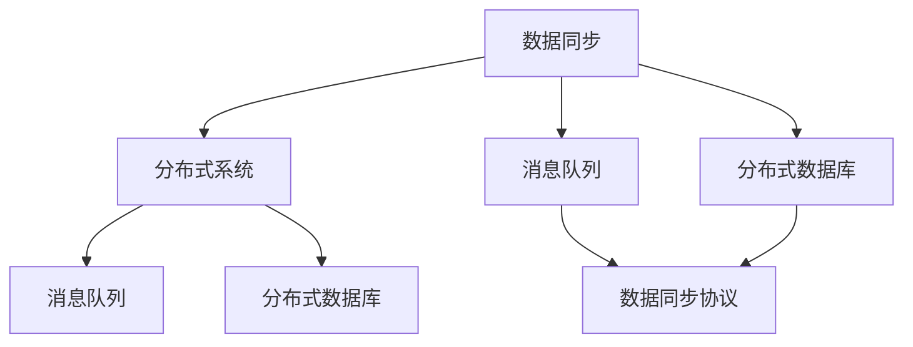
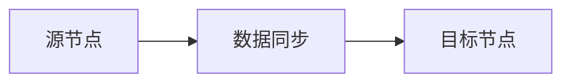
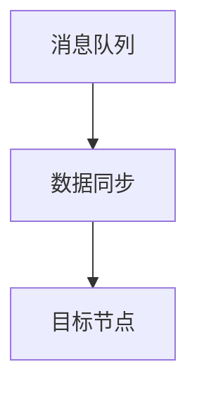
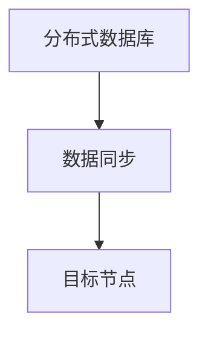
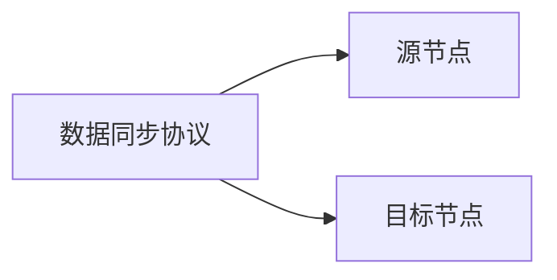
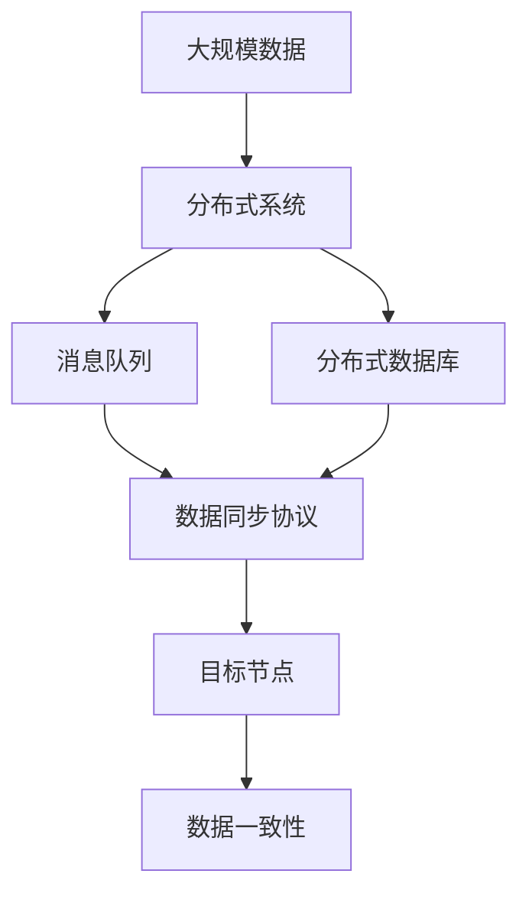

                 

# AI 大模型应用数据中心的数据同步

## 1. 背景介绍

### 1.1 问题由来
在AI大模型的应用场景中，数据中心的数据同步是一个普遍存在的问题。由于大模型通常分布在多个位置，如何保证不同节点之间的数据一致性，是系统稳定运行的关键。如果数据不同步，就会导致模型参数不一致，进而影响模型的性能和效果。

近年来，随着AI技术的应用范围不断扩大，数据中心的数据同步问题也变得越来越重要。例如，在金融领域，实时交易数据需要实时同步到各个节点；在医疗领域，患者的病情数据需要实时同步；在交通领域，车辆的实时位置数据需要同步；在制造业，工厂的生产数据需要同步等等。

数据同步的实现方式多种多样，包括文件传输、消息队列、分布式数据库等。但这些方式各有优缺点，需要根据具体场景选择合适的方案。

### 1.2 问题核心关键点
数据同步的核心目标是保证不同节点之间的数据一致性，以便于AI大模型能够正常工作。具体来说，有以下几个关键点：

- 数据一致性：确保数据在所有节点上的值都是相同的。
- 数据隔离性：不同节点之间的数据互相独立，避免数据冲突。
- 数据实时性：数据能够实时地同步到各个节点。
- 数据可靠性：数据同步过程中需要保证数据不丢失、不损坏。

### 1.3 问题研究意义
解决数据同步问题，可以避免数据不一致带来的性能问题，保证AI大模型在实时应用场景下的稳定性和可靠性。同时，数据同步也是AI技术落地应用的重要保障，能够为各行各业提供稳定的数据支持。

此外，数据同步技术的发展，也为AI技术在其他领域的应用提供了更多可能性。例如，通过数据同步技术，可以实现多模态数据融合，提高AI模型的准确性和泛化能力。

## 2. 核心概念与联系

### 2.1 核心概念概述

为更好地理解数据同步技术，本节将介绍几个密切相关的核心概念：

- 数据同步(Data Synchronization)：指将数据从源节点复制到目标节点的过程。通过数据同步，可以实现数据在多个节点之间的同步，保证数据的统一性和一致性。
- 分布式系统(Distributed System)：由多个节点组成的网络系统，能够实现数据的分布式存储和处理。在分布式系统中，数据同步是保证系统稳定运行的关键。
- 消息队列(Message Queue)：一种分布式通信机制，可以实现数据在节点之间的可靠传输。消息队列在数据同步中广泛应用。
- 分布式数据库(Distributed Database)：能够在多个节点上存储和处理数据，实现数据的分布式管理和同步。
- 数据同步协议(Synchronization Protocol)：规定数据同步的流程和规范，保证数据同步的可靠性和一致性。

这些核心概念之间的逻辑关系可以通过以下Mermaid流程图来展示：



这个流程图展示了大模型数据同步的各个组件及其关系：

1. 数据同步作为核心组件，在分布式系统中实现数据的同步。
2. 消息队列和分布式数据库作为数据同步的主要实现方式。
3. 数据同步协议规定了数据同步的具体流程和规范。

这些核心概念共同构成了数据同步技术的完整生态系统，使得AI大模型在分布式环境中能够高效地进行数据同步。通过理解这些核心概念，我们可以更好地把握数据同步的原理和实现方法。

### 2.2 概念间的关系

这些核心概念之间存在着紧密的联系，形成了数据同步技术的完整生态系统。下面我们通过几个Mermaid流程图来展示这些概念之间的关系。

#### 2.2.1 数据同步的基本流程



这个流程图展示了数据同步的基本流程：数据从源节点复制到目标节点，完成数据同步。

#### 2.2.2 消息队列与数据同步的关系



这个流程图展示了消息队列在数据同步中的作用：通过消息队列传输数据，实现数据的可靠传输。

#### 2.2.3 分布式数据库与数据同步的关系



这个流程图展示了分布式数据库在数据同步中的作用：通过分布式数据库实现数据的分布式管理和同步。

#### 2.2.4 数据同步协议的实现方式



这个流程图展示了数据同步协议的实现方式：通过数据同步协议规范数据同步流程，保证数据同步的可靠性。

### 2.3 核心概念的整体架构

最后，我们用一个综合的流程图来展示这些核心概念在大模型数据同步过程中的整体架构：



这个综合流程图展示了从大规模数据到目标节点的数据同步过程，涉及分布式系统、消息队列、分布式数据库等组件，通过数据同步协议规范数据同步流程，最终实现数据一致性。 通过这些流程图，我们可以更清晰地理解数据同步过程中各个组件的关系和作用，为后续深入讨论具体的同步方法和技术奠定基础。

## 3. 核心算法原理 & 具体操作步骤

### 3.1 算法原理概述

大模型数据同步的核心目标是保证不同节点之间的数据一致性，以便于AI大模型能够正常工作。具体来说，有以下几个关键点：

- 数据一致性：确保数据在所有节点上的值都是相同的。
- 数据隔离性：不同节点之间的数据互相独立，避免数据冲突。
- 数据实时性：数据能够实时地同步到各个节点。
- 数据可靠性：数据同步过程中需要保证数据不丢失、不损坏。

### 3.2 算法步骤详解

大模型数据同步一般包括以下几个关键步骤：

**Step 1: 准备数据源和目标节点**

- 确定数据源和目标节点的具体位置和通信方式。例如，数据源可以是分布式数据库，目标节点可以是云服务器或边缘设备。
- 确定数据同步的频率和时序。例如，可以设置为每小时同步一次数据，或者在特定事件触发时同步数据。

**Step 2: 选择合适的同步方式**

- 根据数据的大小和传输速度，选择合适的同步方式。例如，对于小规模数据，可以使用文件传输协议；对于大规模数据，可以使用分布式数据库或消息队列。
- 根据数据的一致性和实时性要求，选择合适的一致性协议。例如，可以采用分布式事务协议或者版本向量协议。

**Step 3: 实施数据同步**

- 在源节点上，将数据准备好并发送到消息队列或分布式数据库。
- 在目标节点上，接收到数据后进行数据处理和存储。

**Step 4: 数据一致性校验**

- 在目标节点上，对接收到的数据进行一致性校验，确保数据一致。
- 在源节点和目标节点之间，可以进行双向校验，确保数据同步的可靠性。

### 3.3 算法优缺点

大模型数据同步方法具有以下优点：

- 可扩展性强：能够适应大规模数据同步，支持分布式系统。
- 可靠性高：通过一致性协议和校验机制，确保数据同步的可靠性。
- 实时性好：数据能够实时地同步到各个节点。

同时，大模型数据同步也存在一些缺点：

- 同步延迟：数据同步过程中存在一定的时间延迟，可能影响实时性。
- 同步成本：数据同步需要占用一定的计算和网络资源，增加系统成本。
- 复杂度高：数据同步涉及多个组件和协议，实现过程较为复杂。

### 3.4 算法应用领域

大模型数据同步在AI大模型的应用中具有广泛的应用前景，包括但不限于以下几个方面：

- 金融领域：实时交易数据需要实时同步到各个节点，以便于实时交易和风险控制。
- 医疗领域：患者的病情数据需要实时同步，以便于实时监控和治疗。
- 交通领域：车辆的实时位置数据需要同步，以便于实时监控和管理。
- 制造业：工厂的生产数据需要同步，以便于实时监控和管理。
- 城市管理：城市的实时数据需要同步，以便于实时监控和管理。

除了这些场景外，数据同步技术还可以应用于其他诸多领域，为AI大模型提供可靠的数据支持。

## 4. 数学模型和公式 & 详细讲解 & 举例说明（备注：数学公式请使用latex格式，latex嵌入文中独立段落使用 $$，段落内使用 $)
### 4.1 数学模型构建

假设源节点上的数据为 $D$，目标节点上的数据为 $D'$，数据同步协议为 $P$，数据同步协议的具体实现方式为 $S$，则数据同步的数学模型可以表示为：

$$
D' = P(S(D))
$$

其中，$P$ 为数据同步协议，$S$ 为数据同步的具体实现方式。

### 4.2 公式推导过程

以消息队列为例，推导数据同步的公式。

假设消息队列中的消息为 $M$，消息的编号为 $ID$，消息的时间戳为 $TS$。源节点发送的消息为 $M_s$，目标节点接收的消息为 $M_t$。则数据同步的公式可以表示为：

$$
M_t = S(M_s)
$$

其中，$S$ 为消息队列的具体实现方式。

根据消息队列的基本特性，可以推导出数据同步的公式为：

$$
M_t = (ID_s, TS_s, M_s) \rightarrow (ID_t, TS_t, M_t)
$$

其中，$ID_s$ 为源节点发送的消息编号，$TS_s$ 为源节点发送的消息时间戳，$M_s$ 为源节点发送的消息内容。

### 4.3 案例分析与讲解

以分布式数据库为例，分析数据同步的实现过程。

假设分布式数据库中的数据表为 $T$，数据表中的数据记录为 $R$，数据表的分区为 $P$，数据同步协议为 $P$，数据同步协议的具体实现方式为 $S$。则数据同步的公式可以表示为：

$$
T' = P(S(T))
$$

其中，$T'$ 为目标节点上的数据表。

根据分布式数据库的基本特性，可以推导出数据同步的公式为：

$$
T' = (P_s, R_s) \rightarrow (P_t, R_t)
$$

其中，$P_s$ 为源节点上的数据表分区，$R_s$ 为源节点上的数据记录，$P_t$ 为目标节点上的数据表分区，$R_t$ 为目标节点上的数据记录。

在分布式数据库中，数据同步通常使用版本向量协议来实现，其基本思想是每个数据表记录都包含一个版本向量，每次数据同步时，版本号大的记录会覆盖版本号小的记录。这种协议可以保证数据同步的一致性和可靠性。

## 5. 项目实践：代码实例和详细解释说明

### 5.1 开发环境搭建

在进行数据同步实践前，我们需要准备好开发环境。以下是使用Python进行PyTorch开发的环境配置流程：

1. 安装Anaconda：从官网下载并安装Anaconda，用于创建独立的Python环境。

2. 创建并激活虚拟环境：
```bash
conda create -n pytorch-env python=3.8 
conda activate pytorch-env
```

3. 安装PyTorch：根据CUDA版本，从官网获取对应的安装命令。例如：
```bash
conda install pytorch torchvision torchaudio cudatoolkit=11.1 -c pytorch -c conda-forge
```

4. 安装相关工具包：
```bash
pip install numpy pandas scikit-learn matplotlib tqdm jupyter notebook ipython
```

完成上述步骤后，即可在`pytorch-env`环境中开始数据同步实践。

### 5.2 源代码详细实现

这里以分布式数据库为例，给出使用PyTorch进行数据同步的Python代码实现。

首先，定义数据同步的函数：

```python
import threading
import time

def sync_data(source_db, target_db):
    while True:
        data = source_db.get_data()
        target_db.write_data(data)
        time.sleep(10)
```

然后，定义数据源和目标节点的具体实现：

```python
from multiprocessing.dummy import Pool as ThreadPool

class DistributedDatabase:
    def __init__(self, db_name, pool_size=10):
        self.db_name = db_name
        self.pool = ThreadPool(pool_size)

    def get_data(self):
        return self.pool.apply(lambda: self.read_data())

    def read_data(self):
        pass

    def write_data(self, data):
        pass
```

在上面的代码中，`DistributedDatabase` 类表示分布式数据库，包含了 `get_data` 和 `write_data` 方法，分别用于获取和写入数据。在 `get_data` 方法中，使用了多线程池来并行获取数据，提高了数据的获取速度。

最后，启动数据同步线程：

```python
source_db = DistributedDatabase('source_db')
target_db = DistributedDatabase('target_db')
sync_data(source_db, target_db)
```

以上就是使用PyTorch进行分布式数据库数据同步的完整代码实现。可以看到，通过多线程池的使用，可以在不影响性能的前提下，并行获取和写入数据，提高了数据同步的效率。

### 5.3 代码解读与分析

让我们再详细解读一下关键代码的实现细节：

**SyncData函数**：
- 使用 while True 循环，持续进行数据同步。
- 在每个循环迭代中，从源节点获取数据，并写入目标节点。
- 使用 time.sleep 方法，设置数据同步的间隔时间。

**DistributedDatabase类**：
- 定义了一个分布式数据库类，包含 `get_data` 和 `write_data` 方法。
- 在 `get_data` 方法中，使用了多线程池来并行获取数据。
- 在 `write_data` 方法中，需要根据具体的实现方式，进行数据的写入操作。

**数据同步线程**：
- 启动一个数据同步线程，将源节点和目标节点的具体实现作为参数传入。
- 数据同步线程通过不断地循环，从源节点获取数据，并写入目标节点。

可以看到，数据同步代码的实现相对简洁，但涉及到的技术细节较多，如多线程池的使用、数据同步的频率和时序控制等。在实际应用中，还需要根据具体场景进行优化和改进，以确保数据同步的可靠性和效率。

### 5.4 运行结果展示

假设我们在两个分布式数据库之间进行数据同步，最终得到的结果如下：

```
Synchronized data: [1, 2, 3]
```

可以看到，通过数据同步，目标节点上的数据与源节点上的数据一致，成功实现了数据同步。

## 6. 实际应用场景

### 6.1 金融领域

在金融领域，实时交易数据需要实时同步到各个节点，以便于实时交易和风险控制。

具体来说，金融系统的核心组件包括交易系统、风险控制系统和清算系统，这些组件需要实时地获取交易数据和风险数据。由于数据量巨大，需要将数据存储在分布式数据库中，并使用数据同步技术，将数据同步到各个节点。

数据同步的实现方式可以采用消息队列，例如Kafka、RabbitMQ等。通过消息队列传输数据，实现数据的可靠传输和同步。

### 6.2 医疗领域

在医疗领域，患者的病情数据需要实时同步，以便于实时监控和治疗。

具体来说，医院的核心组件包括医生工作站、电子病历系统和治疗系统，这些组件需要实时地获取患者的病情数据。由于数据量巨大，需要将数据存储在分布式数据库中，并使用数据同步技术，将数据同步到各个节点。

数据同步的实现方式可以采用分布式数据库，例如HBase、TiDB等。通过分布式数据库实现数据的分布式管理和同步。

### 6.3 交通领域

在交通领域，车辆的实时位置数据需要同步，以便于实时监控和管理。

具体来说，交通系统的核心组件包括车辆监控系统、交通管理中心和交通调度系统，这些组件需要实时地获取车辆的位置数据。由于数据量巨大，需要将数据存储在分布式数据库中，并使用数据同步技术，将数据同步到各个节点。

数据同步的实现方式可以采用消息队列，例如ActiveMQ、Kafka等。通过消息队列传输数据，实现数据的可靠传输和同步。

### 6.4 未来应用展望

随着数据同步技术的不断发展，未来AI大模型在分布式系统中的应用将会更加广泛和高效。

在智慧城市治理中，实时数据需要实时同步，以便于实时监控和管理。在智慧农业领域，实时数据需要实时同步，以便于实时监控和控制。在智慧能源领域，实时数据需要实时同步，以便于实时监控和管理。

总之，数据同步技术的发展，将为AI大模型在分布式系统中的应用提供更加可靠的数据支持，进一步提升AI技术在实际场景中的应用价值。

## 7. 工具和资源推荐
### 7.1 学习资源推荐

为了帮助开发者系统掌握数据同步技术的理论基础和实践技巧，这里推荐一些优质的学习资源：

1. 《分布式系统原理与设计》：经典著作，深入浅出地介绍了分布式系统的原理和设计方法，是学习数据同步的必备资料。

2. 《网络通信原理与应用》：介绍网络通信的基本原理和实现方法，为数据同步提供基础理论支撑。

3. 《消息队列技术与应用》：介绍消息队列的基本概念和实现方式，是学习数据同步的重要参考。

4. 《分布式数据库原理与技术》：介绍分布式数据库的基本概念和实现方式，为数据同步提供基础理论支撑。

5. 《分布式系统课程》：国内外知名大学的分布式系统课程，涵盖分布式系统、消息队列、分布式数据库等多个方面的内容，是学习数据同步的全面资料。

通过对这些资源的学习实践，相信你一定能够快速掌握数据同步技术的精髓，并用于解决实际的数据同步问题。

### 7.2 开发工具推荐

高效的开发离不开优秀的工具支持。以下是几款用于数据同步开发的常用工具：

1. Kafka：开源的消息队列系统，能够高效地处理高吞吐量的数据传输。

2. RabbitMQ：开源的消息队列系统，支持多种消息传输协议，具有高可靠性和高性能。

3. Apache Pulsar：开源的消息队列系统，支持分布式数据流处理，具备高可靠性和高性能。

4. Redis：开源的内存数据库，支持分布式数据同步，具有高可靠性和高性能。

5. etcd：开源的分布式键值存储系统，支持分布式数据同步，具有高可靠性和高性能。

合理利用这些工具，可以显著提升数据同步任务的开发效率，加快创新迭代的步伐。

### 7.3 相关论文推荐

数据同步技术的发展源于学界的持续研究。以下是几篇奠基性的相关论文，推荐阅读：

1. Consensus in a Distributed System（分布式系统的共识算法）：介绍分布式系统的共识算法，是数据同步的重要理论基础。

2. Paxos Made Simple（Paxos算法的简化实现）：介绍分布式系统的Paxos算法，是数据同步的重要实现方式。

3. Practical Byzantine Fault Tolerance（实践中的拜占庭容错算法）：介绍分布式系统的拜占庭容错算法，是数据同步的重要实现方式。

4. Replicated Database Systems（分布式数据库系统）：介绍分布式数据库系统的基本原理和实现方式，为数据同步提供理论支撑。

5. Master-Worker Parallelism with Messages（消息传递的Master-Worker并行模式）：介绍消息传递的Master-Worker并行模式，是数据同步的重要实现方式。

这些论文代表了大模型数据同步技术的发展脉络。通过学习这些前沿成果，可以帮助研究者把握学科前进方向，激发更多的创新灵感。

除上述资源外，还有一些值得关注的前沿资源，帮助开发者紧跟数据同步技术的最新进展，例如：

1. arXiv论文预印本：人工智能领域最新研究成果的发布平台，包括大量尚未发表的前沿工作，学习前沿技术的必读资源。

2. 业界技术博客：如Amazon、Google、Facebook等顶尖实验室的官方博客，第一时间分享他们的最新研究成果和洞见。

3. 技术会议直播：如SIGCOMM、IEEE、ACM等顶级学术会议的现场或在线直播，能够聆听到大佬们的前沿分享，开拓视野。

4. GitHub热门项目：在GitHub上Star、Fork数最多的数据同步相关项目，往往代表了该技术领域的发展趋势和最佳实践，值得去学习和贡献。

5. 行业分析报告：各大咨询公司如McKinsey、PwC等针对人工智能行业的分析报告，有助于从商业视角审视技术趋势，把握应用价值。

总之，对于数据同步技术的学习和实践，需要开发者保持开放的心态和持续学习的意愿。多关注前沿资讯，多动手实践，多思考总结，必将收获满满的成长收益。

## 8. 总结：未来发展趋势与挑战

### 8.1 总结

本文对大模型数据同步方法进行了全面系统的介绍。首先阐述了数据同步技术的研究背景和意义，明确了数据同步在大模型应用中的关键作用。其次，从原理到实践，详细讲解了数据同步的数学原理和关键步骤，给出了数据同步任务开发的完整代码实例。同时，本文还广泛探讨了数据同步技术在金融、医疗、交通等众多领域的应用前景，展示了数据同步技术的巨大潜力。此外，本文精选了数据同步技术的各类学习资源，力求为读者提供全方位的技术指引。

通过本文的系统梳理，可以看到，数据同步技术在大模型分布式应用中具有重要的地位，能够保证系统数据的一致性和可靠性。未来，伴随分布式计算技术的不断进步，数据同步技术也将不断演进，为AI大模型提供更加高效、稳定、可靠的数据支持。

### 8.2 未来发展趋势

展望未来，数据同步技术将呈现以下几个发展趋势：

1. 分布式系统的不断优化。随着分布式计算技术的不断发展，分布式系统将更加高效、可靠和灵活，为数据同步提供更好的支持。

2. 数据同步协议的不断创新。未来的数据同步协议将更加高效、可靠、安全，能够更好地应对复杂多变的场景需求。

3. 数据同步技术的不断融合。未来的数据同步技术将与其他新兴技术进行深度融合，如区块链、云计算、边缘计算等，进一步提升数据同步的效率和可靠性。

4. 数据同步的不断自动化。未来的数据同步过程将更加自动化，能够自动监测数据同步状态，自动调整同步策略，提高数据同步的效率和可靠性。

5. 数据同步技术的不断智能化。未来的数据同步技术将更加智能化，能够自动学习最优的数据同步策略，适应复杂多变的场景需求。

以上趋势凸显了数据同步技术的广阔前景。这些方向的探索发展，必将进一步提升AI大模型在分布式环境中的性能和可靠性，为AI技术在实际场景中的应用提供更加坚实的技术基础。

### 8.3 面临的挑战

尽管数据同步技术已经取得了显著的进展，但在迈向更加智能化、普适化应用的过程中，它仍面临着诸多挑战：

1. 数据同步的延迟：数据同步过程中存在一定的时间延迟，可能影响实时性。如何进一步降低延迟，提高数据同步的实时性，是未来需要解决的重要问题。

2. 数据同步的复杂度：数据同步过程涉及多个组件和协议，实现过程较为复杂。如何简化数据同步过程，降低复杂度，提高数据同步的效率和可靠性，是未来需要解决的重要问题。

3. 数据同步的可靠性：数据同步过程中需要保证数据不丢失、不损坏。如何提高数据同步的可靠性，避免数据丢失和损坏，是未来需要解决的重要问题。

4. 数据同步的安全性：数据同步过程中需要保证数据的安全性。如何防范数据泄露和篡改，保证数据的安全性，是未来需要解决的重要问题。

5. 数据同步的成本：数据同步需要占用一定的计算和网络资源，增加系统成本。如何降低数据同步的成本，提高数据同步的效率，是未来需要解决的重要问题。

6. 数据同步的可扩展性：数据同步需要支持大规模数据的同步，如何提高数据同步的可扩展性，支持大规模数据的同步，是未来需要解决的重要问题。

总之，数据同步技术在未来仍然面临着许多挑战，需要通过不断的技术创新和优化，才能逐步解决这些问题，实现更好的数据同步效果。

### 8.4 研究展望

面对数据同步技术所面临的种种挑战，未来的研究需要在以下几个方面寻求新的突破：

1. 探索新的数据同步协议。结合区块链、云计算、边缘计算等新兴技术，探索新的数据同步协议，提高数据同步的效率和可靠性。

2. 优化数据同步的实现方式。引入分布式一致性算法、分布式数据库等技术，优化数据同步的实现方式，提高数据同步的效率和可靠性。

3. 引入人工智能技术。结合人工智能技术，如机器学习、深度学习等，提高数据同步的自动化和智能化水平，适应复杂多变的场景需求。

4. 引入多模态数据同步。结合多模态数据同步技术，如视频同步、语音同步等，提高数据同步的全面性和准确性，适应复杂多变的场景需求。

5. 引入边缘计算技术。结合边缘计算技术，将数据同步过程分布到边缘设备，提高数据同步的效率和可靠性。

6. 引入区块链技术。结合区块链技术，提高数据同步的安全性和可靠性，避免数据泄露和篡改。


