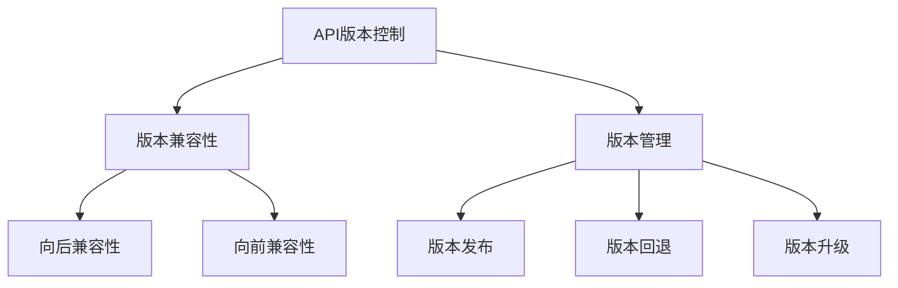
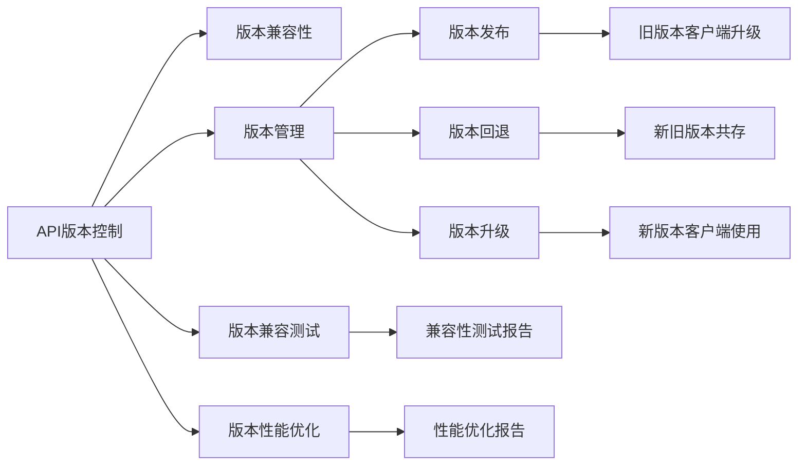
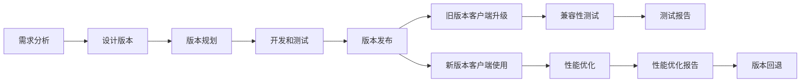

                 

## 1. 背景介绍

在互联网和软件开发领域，API（应用程序编程接口）的作用日益凸显。无论是Web应用、移动应用还是物联网设备，API都被广泛应用于连接和集成不同的软件系统。然而，API版本控制的重要性常常被忽视，导致许多API在发布后迅速过时，维护成本上升，用户满意度下降。本文将深入探讨API版本控制的重要性，阐述其基本原理和实践策略，并结合案例分析，提出一些切实可行的解决方案，帮助开发者构建更加稳定和可靠的API生态系统。

### 1.1 问题由来

API版本控制的必要性源于以下几个方面：

- **兼容性问题**：API的更改可能破坏旧版本客户端的功能，导致兼容性问题。例如，添加新参数、修改返回值类型等都可能导致旧版本客户端无法正常工作。
- **维护成本**：API的频繁更改会增加维护成本，因为每次更改都需要在多个版本中进行兼容性测试和修复。
- **用户满意度**：频繁的API更改会降低用户对系统的信任度和满意度，影响业务发展。
- **生态系统建设**：API版本控制是构建健康API生态系统的基础，有助于吸引第三方开发者，促进系统的创新和扩展。

### 1.2 问题核心关键点

API版本控制的核心关键点在于如何平衡灵活性和稳定性，确保新功能能够在稳定运行的前提下逐步引入。具体来说，需要考虑以下方面：

- **向后兼容性**：新版本的API应该兼容旧版本，使得旧版本客户端可以继续使用。
- **向前兼容性**：新版本的API应该支持旧版本功能，使得旧版本客户端可以向后迁移。
- **版本管理**：明确不同版本的API功能差异，便于管理和维护。

## 2. 核心概念与联系

### 2.1 核心概念概述

API版本控制涉及以下几个核心概念：

- **API版本**：API的发布版本，每个版本有不同的功能、特性和兼容性要求。
- **版本兼容性**：不同版本API之间的兼容性要求，确保旧版本客户端能够向后迁移，新客户端能够向前使用。
- **版本管理**：对不同版本API进行管理和维护的方法和工具。

### 2.2 概念间的关系

API版本控制的核心在于通过版本管理，确保API的稳定性和兼容性。以下是几个关键的流程图，展示这些概念之间的关系：



- **版本兼容性**：确保新旧版本API之间的兼容性，使旧版本客户端能够继续使用。
- **版本管理**：通过工具和方法对不同版本API进行管理，如版本发布、回退、升级等。
- **版本发布**：指将新版本的API发布给用户，并明确版本变化。
- **版本回退**：指在出现问题时，将API版本回退到更稳定版本，避免系统崩溃。
- **版本升级**：指在新版本API发布后，用户和客户端逐步升级到新版本，避免兼容性问题。

### 2.3 核心概念的整体架构

最后，我们用一个综合的流程图来展示API版本控制的整体架构：



这个综合流程图展示了从API版本控制到兼容测试和性能优化，再到版本发布、回退和升级的全过程。通过明确各环节的职责和方法，可以构建更加稳定和可靠的API生态系统。

## 3. 核心算法原理 & 具体操作步骤
### 3.1 算法原理概述

API版本控制的算法原理主要涉及以下几个方面：

- **向后兼容性设计**：通过版本管理工具和方法，确保新旧版本API的兼容性。
- **版本发布策略**：确定版本发布的频率和方式，确保用户能够及时获取新版本。
- **版本升级方法**：在客户端和系统层面，逐步升级到新版本API，避免兼容性问题。
- **版本回退机制**：在系统出现问题时，能够迅速回退到稳定版本，确保系统正常运行。

### 3.2 算法步骤详解

以下是一个典型的API版本控制流程图：



具体步骤如下：

1. **需求分析**：明确API的功能需求和用户期望，制定版本规划。
2. **设计版本**：根据需求分析，设计新版本的API接口和功能。
3. **版本规划**：确定版本发布的时间表和策略，包括版本发布频率、发布方式等。
4. **开发和测试**：开发新版本的API，并进行全面测试，确保功能和性能。
5. **版本发布**：将新版本API发布到服务器，并通知用户。
6. **旧版本客户端升级**：引导旧版本客户端逐步升级到新版本，确保兼容性。
7. **新版本客户端使用**：新版本客户端开始使用新功能。
8. **兼容性测试**：在发布新版本后，进行兼容性测试，确保旧版本客户端能够正常工作。
9. **性能优化**：对新旧版本API进行性能优化，提升系统性能。
10. **版本回退**：在系统出现问题时，能够迅速回退到稳定版本，避免系统崩溃。

### 3.3 算法优缺点

API版本控制的优点包括：

- **提高稳定性**：通过版本管理和兼容性设计，确保API的稳定性和可靠性。
- **降低维护成本**：通过逐步升级和兼容性测试，减少维护成本。
- **提升用户体验**：通过明确的版本发布和兼容性测试，提升用户体验。

缺点包括：

- **增加开发复杂性**：版本控制的开发和测试复杂性增加，需要更多的资源和精力。
- **兼容问题**：不同版本API的兼容性设计难度较大，容易出现兼容性问题。

### 3.4 算法应用领域

API版本控制在以下领域得到广泛应用：

- **Web应用开发**：如RESTful API、GraphQL API等。
- **移动应用开发**：如iOS、Android等平台API。
- **IoT设备开发**：如智能家居、车联网等领域的API。
- **企业级API**：如ERP、CRM等系统API。

## 4. 数学模型和公式 & 详细讲解 & 举例说明

### 4.1 数学模型构建

API版本控制的数学模型主要涉及以下几个方面：

- **兼容性矩阵**：通过兼容性矩阵，明确不同版本API之间的兼容性关系。
- **版本发布频率**：根据发布频率，设计版本发布策略。
- **版本升级路径**：通过版本升级路径，逐步将旧版本客户端升级到新版本。

### 4.2 公式推导过程

以下是一个简单的兼容性矩阵示例：

$$
\begin{bmatrix}
1 & 0 & 0 & 0 \\
0 & 1 & 0 & 0 \\
0 & 0 & 1 & 0 \\
0 & 0 & 0 & 1
\end{bmatrix}
$$

其中，1表示兼容性，0表示不兼容性。例如，旧版本API和新版本API完全不兼容，新版本的API需要新增兼容性测试。

### 4.3 案例分析与讲解

以一个RESTful API为例，其兼容性矩阵如下：

$$
\begin{bmatrix}
1 & 0 & 1 & 0 \\
0 & 1 & 1 & 0 \\
1 & 0 & 1 & 0 \\
0 & 0 & 0 & 1
\end{bmatrix}
$$

- 第1行表示旧版本API和新版本API的兼容性。第2行和第3行表示新版本的API需要新增兼容性测试。第4行表示新版本API和旧版本API完全不兼容，需要逐步升级。

## 5. 项目实践：代码实例和详细解释说明

### 5.1 开发环境搭建

以下是使用Python和Flask框架进行API版本控制的开发环境配置：

1. 安装Python和Flask：
```bash
pip install flask
```

2. 安装版本控制工具：
```bash
pip install flask-restful
```

3. 安装数据库：
```bash
pip install flask-sqlalchemy
```

4. 安装API版本控制工具：
```bash
pip install flask-restful-swagger
```

完成上述步骤后，即可在Python环境下进行API版本控制的开发。

### 5.2 源代码详细实现

以下是一个简单的API版本控制的Flask应用示例：

```python
from flask import Flask, jsonify
from flask_restful import Resource, Api
from flask_sqlalchemy import SQLAlchemy

app = Flask(__name__)
api = Api(app)

# 数据库配置
app.config['SQLALCHEMY_DATABASE_URI'] = 'sqlite:///database.db'
db = SQLAlchemy(app)

# 定义API版本和功能
class VersionResource(Resource):
    def get(self):
        return jsonify({'version': 1, 'features': ['feature1', 'feature2']})

# 版本发布
class VersionPublishResource(Resource):
    def post(self):
        db.session.add(Version(version=2, features=['feature1', 'feature2', 'feature3']))
        db.session.commit()
        return jsonify({'status': 'success', 'message': 'Version 2 published'})

# 旧版本客户端升级
class ClientUpgradeResource(Resource):
    def put(self):
        db.session.query(Version).update({'support_end': datetime.utcnow()})
        return jsonify({'status': 'success', 'message': 'Client upgraded'})

# 新旧版本共存
class VersionCoexistenceResource(Resource):
    def get(self):
        new_versions = db.session.query(Version).filter(Version.support_end > datetime.utcnow()).all()
        old_versions = db.session.query(Version).filter(Version.support_end < datetime.utcnow()).all()
        return jsonify({'new_versions': [version.version for version in new_versions], 'old_versions': [version.version for version in old_versions]})

# 启动Flask应用
if __name__ == '__main__':
    app.run(debug=True)
```

### 5.3 代码解读与分析

这段代码实现了基本的API版本控制功能，主要包括：

- **版本管理**：使用SQLAlchemy库对不同版本的API进行管理。
- **版本发布**：通过RESTful API发布新版本。
- **旧版本客户端升级**：引导旧版本客户端逐步升级到新版本。
- **新旧版本共存**：展示当前系统支持的新旧版本API。

### 5.4 运行结果展示

假设运行上述代码，通过访问http://127.0.0.1:5000/version，可以得到以下结果：

```json
{
    'version': 1,
    'features': ['feature1', 'feature2']
}
```

通过访问http://127.0.0.1:5000/publish/version/2，可以发布新版本API：

```json
{
    'status': 'success',
    'message': 'Version 2 published'
}
```

通过访问http://127.0.0.1:5000/upgrade/client，可以引导旧版本客户端逐步升级到新版本：

```json
{
    'status': 'success',
    'message': 'Client upgraded'
}
```

通过访问http://127.0.0.1:5000/coexistence，可以得到当前系统支持的新旧版本API：

```json
{
    'new_versions': [2],
    'old_versions': [1]
}
```

## 6. 实际应用场景

### 6.1 智能家居设备API

智能家居设备通常需要连接多种系统，如语音助手、传感器、智能锁等。通过API版本控制，可以确保不同系统之间的兼容性，避免因API变更导致的设备无法正常工作。

### 6.2 企业级API

企业级API需要兼容不同版本的ERP、CRM等系统，通过API版本控制，可以确保旧系统能够正常迁移，新系统能够逐步引入，保证企业业务的连续性。

### 6.3 车联网API

车联网API需要连接多种设备和系统，如车载传感器、车载中控、云平台等。通过API版本控制，可以确保不同设备和系统之间的兼容性，提升系统的稳定性和可靠性。

### 6.4 未来应用展望

未来，API版本控制将面临更多的挑战和机遇：

- **跨平台兼容性**：随着应用场景的多样化，API需要支持更多的平台和设备。
- **微服务架构**：在微服务架构下，API版本控制变得更加复杂，需要考虑不同服务的兼容性。
- **自动化部署**：通过自动化部署工具，提高API版本发布的效率和可靠性。
- **人工智能和机器学习**：引入AI和ML技术，优化API版本控制的策略和工具。

## 7. 工具和资源推荐

### 7.1 学习资源推荐

以下是一些优秀的API版本控制学习资源：

1. **《API设计规范》**：这本书详细介绍了API设计和版本控制的规范和最佳实践。
2. **《RESTful API设计》**：这本书介绍了RESTful API设计和版本控制的理论基础和实践方法。
3. **《微服务架构》**：这本书介绍了微服务架构下API版本控制的方法和工具。
4. **《API版本控制最佳实践》**：这篇文章介绍了API版本控制的常见问题和解决方案。

### 7.2 开发工具推荐

以下是一些优秀的API版本控制开发工具：

1. **Swagger**：用于生成API文档和UI界面，帮助开发者进行版本控制。
2. **Postman**：用于测试和调用API，支持版本管理。
3. **Jenkins**：用于自动化部署和测试API版本控制。

### 7.3 相关论文推荐

以下是一些优秀的API版本控制相关论文：

1. **《API版本控制：方法、挑战和实践》**：这篇文章介绍了API版本控制的方法和挑战。
2. **《API版本控制的自动化实践》**：这篇文章介绍了API版本控制的自动化工具和方法。
3. **《API版本控制的前世今生》**：这篇文章介绍了API版本控制的演变和未来趋势。

## 8. 总结：未来发展趋势与挑战

### 8.1 总结

本文对API版本控制的重要性进行了深入探讨，阐述了其基本原理和实践策略，并通过案例分析，提出了一些切实可行的解决方案。通过本文的系统梳理，可以看到，API版本控制在构建稳定和可靠的API生态系统方面具有重要意义。未来的API版本控制将更加复杂和多样，需要开发者根据具体需求进行全面优化。

### 8.2 未来发展趋势

API版本控制的未来发展趋势包括：

1. **自动化和智能化**：通过自动化和智能化工具，提高API版本控制的效率和可靠性。
2. **跨平台和跨服务**：API版本控制需要支持更多平台和服务的兼容性。
3. **微服务架构**：在微服务架构下，API版本控制变得更加复杂，需要新的方法和工具。
4. **人工智能和机器学习**：引入AI和ML技术，优化API版本控制的策略和工具。

### 8.3 面临的挑战

尽管API版本控制已经取得了一些进展，但在迈向更加智能化、普适化应用的过程中，仍面临诸多挑战：

1. **复杂性增加**：在微服务架构下，API版本控制的复杂性增加，需要新的方法和工具。
2. **兼容性问题**：不同版本API之间的兼容性设计难度较大，容易出现兼容性问题。
3. **性能优化**：API版本控制的性能优化需要更多的资源和精力。

### 8.4 研究展望

未来API版本控制的研究方向包括：

1. **自动化和智能化**：通过自动化和智能化工具，提高API版本控制的效率和可靠性。
2. **跨平台和跨服务**：API版本控制需要支持更多平台和服务的兼容性。
3. **微服务架构**：在微服务架构下，API版本控制变得更加复杂，需要新的方法和工具。
4. **人工智能和机器学习**：引入AI和ML技术，优化API版本控制的策略和工具。

这些研究方向将推动API版本控制技术的发展，为构建稳定和可靠的API生态系统提供有力支持。总之，API版本控制需要开发者根据具体需求进行全面优化，方能真正实现API生态系统的健康发展。

## 9. 附录：常见问题与解答

**Q1：如何设计兼容性和兼容性矩阵？**

A: 设计兼容性和兼容性矩阵的关键在于明确不同版本API之间的功能差异。具体步骤如下：

1. 确定新旧版本API的功能差异。
2. 根据功能差异设计兼容性矩阵，明确不同版本API之间的兼容性关系。

**Q2：如何逐步升级旧版本客户端？**

A: 逐步升级旧版本客户端的关键在于进行兼容性测试和修复。具体步骤如下：

1. 确定旧版本客户端需要新增的功能。
2. 进行兼容性测试，确保新旧版本API能够正常工作。
3. 逐步升级旧版本客户端，引导用户和客户端逐步升级到新版本。

**Q3：如何设计API版本控制策略？**

A: 设计API版本控制策略的关键在于明确版本发布频率、版本发布方式和版本兼容性要求。具体步骤如下：

1. 确定API的版本发布频率，如每月、每季度等。
2. 确定版本发布的策略，如一次性发布、逐步发布等。
3. 确定不同版本API之间的兼容性要求，确保旧版本客户端能够向后迁移。

通过明确各环节的职责和方法，可以构建更加稳定和可靠的API生态系统。

---

作者：禅与计算机程序设计艺术 / Zen and the Art of Computer Programming

