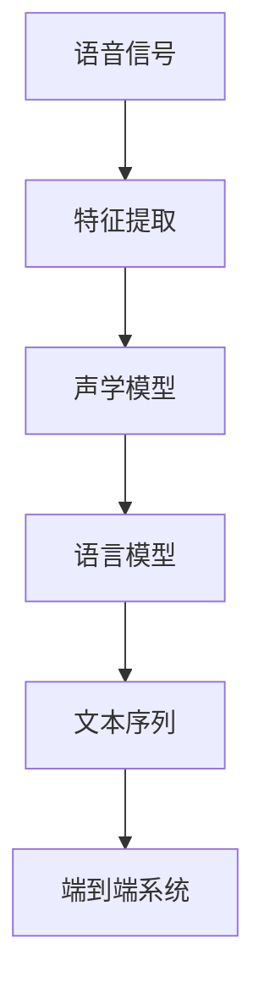
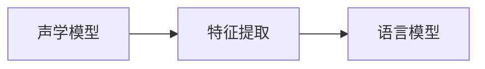
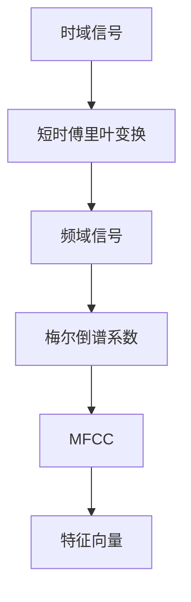
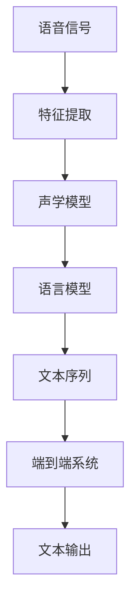

                 

# 语音识别(Speech Recognition) - 原理与代码实例讲解

> 关键词：语音识别, 声学模型, 语言模型, 深度学习, 端到端(End-to-End), 卷积神经网络(CNN), 循环神经网络(RNN), 卷积-递归神经网络(CRNN), 短时傅里叶变换(Short-Time Fourier Transform, STFT), 隐马尔可夫模型(Hidden Markov Model, HMM), 序列对齐, 特征提取

## 1. 背景介绍

### 1.1 问题由来
语音识别技术作为自然语言处理(NLP)的重要分支，其目标是使计算机能够自动将语音信号转换为文本形式，从而实现与人类自然语言交流的能力。近年来，随着深度学习技术的发展，语音识别系统取得了显著进展。其中，基于深度学习的端到端(End-to-End)系统已成为主流。

端到端系统的核心思想是直接从语音信号到文本的映射，绕过传统分立声学模型、语言模型和解码器，通过端到端神经网络一次性完成语音信号的特征提取、声学建模和文本解码。这种模型结构简洁高效，已经在多个人工智能竞赛中取得优异的成绩。

### 1.2 问题核心关键点
端到端语音识别系统包括两大部分：声学模型和语言模型。声学模型负责将语音信号转化为文本序列，语言模型负责对文本序列进行解码，并选择概率最大的文本序列作为输出。

- 声学模型：通常使用卷积神经网络(CNN)、循环神经网络(RNN)或卷积-递归神经网络(CRNN)等深度学习模型，学习输入特征与文本序列之间的映射关系。
- 语言模型：使用神经网络模型或隐马尔可夫模型(HMM)，预测给定文本序列的概率，进而选择最可能的文本序列。

### 1.3 问题研究意义
语音识别技术的应用场景广泛，包括语音助手、智能家居、智能交通、医疗辅助等。准确高效的语音识别系统不仅能提升用户体验，还能带动整个社会的数字化转型。

端到端语音识别技术通过深度学习模型直接从语音信号到文本的映射，减少了繁琐的系统组件和手动参数调整，使得语音识别的效率和准确率大幅提升。此外，端到端系统还能更好地处理复杂场景下的语音识别问题，如口音识别、噪声干扰等。

## 2. 核心概念与联系

### 2.1 核心概念概述

为更好地理解端到端语音识别技术，本节将介绍几个密切相关的核心概念：

- 声学模型(Acoustic Model)：将语音信号转化为文本序列的模型。通常使用深度神经网络实现。
- 语言模型(Language Model)：预测给定文本序列概率的模型。常使用神经网络模型或隐马尔可夫模型。
- 端到端(End-to-End)系统：通过深度学习模型一次性完成语音信号的特征提取、声学建模和文本解码，避免了繁琐的系统组件和手动参数调整。
- 短时傅里叶变换(Short-Time Fourier Transform, STFT)：将时域信号转换为频域信号，便于后续的特征提取和声学建模。
- 隐马尔可夫模型(Hidden Markov Model, HMM)：常用于语言模型，通过状态转移概率和观测概率预测文本序列的概率。

这些核心概念之间的逻辑关系可以通过以下Mermaid流程图来展示：



这个流程图展示了一组端到端语音识别系统的基本架构：

1. 语音信号通过特征提取模块转化为频域信号。
2. 声学模型对频域信号进行映射，生成文本序列。
3. 语言模型对文本序列进行概率预测，选择合适的文本序列。
4. 最终输出的文本序列即为端到端系统的输出。

### 2.2 概念间的关系

这些核心概念之间存在着紧密的联系，形成了端到端语音识别系统的完整生态系统。下面我们通过几个Mermaid流程图来展示这些概念之间的关系。

#### 2.2.1 端到端系统的整体架构


这个流程图展示了端到端语音识别系统的整体架构：

1. 语音信号通过特征提取模块转化为频域信号。
2. 声学模型对频域信号进行映射，生成文本序列。
3. 语言模型对文本序列进行概率预测，选择合适的文本序列。
4. 最终输出的文本序列即为端到端系统的输出。

#### 2.2.2 声学模型与语言模型的关系



这个流程图展示了声学模型与语言模型之间的交互关系：

1. 声学模型将频域信号转化为文本序列，作为语言模型的输入。
2. 语言模型对文本序列进行概率预测，最终输出文本序列。

#### 2.2.3 特征提取的两种方法



这个流程图展示了两种常见的特征提取方法：

1. 首先通过短时傅里叶变换将时域信号转换为频域信号。
2. 然后计算梅尔倒谱系数(Mel-spectrogram)，得到频谱能量分布。
3. 最后计算MFCC(Mel-frequency Cepstral Coefficients)，得到特征向量，供声学模型使用。

### 2.3 核心概念的整体架构

最后，我们用一个综合的流程图来展示这些核心概念在大语言模型微调过程中的整体架构：



这个综合流程图展示了从语音信号到文本输出的完整过程：

1. 语音信号通过特征提取模块转化为频域信号。
2. 声学模型对频域信号进行映射，生成文本序列。
3. 语言模型对文本序列进行概率预测，选择合适的文本序列。
4. 最终输出的文本序列即为端到端系统的输出。

## 3. 核心算法原理 & 具体操作步骤
### 3.1 算法原理概述

端到端语音识别系统的核心算法基于深度学习技术，主要包括声学模型和语言模型。其基本原理如下：

- **声学模型**：将语音信号转化为文本序列的映射关系。通常使用卷积神经网络(CNN)、循环神经网络(RNN)或卷积-递归神经网络(CRNN)等深度学习模型。
- **语言模型**：预测给定文本序列的概率，并选择最可能的文本序列。常使用神经网络模型或隐马尔可夫模型(HMM)。

具体而言，声学模型将时域信号转化为频域信号，然后计算MFCC特征向量，供深度神经网络学习。语言模型使用神经网络模型或HMM，预测文本序列的概率。最终，端到端系统将声学模型和语言模型结合，实现从语音信号到文本序列的直接映射。

### 3.2 算法步骤详解

以下是端到端语音识别系统的主要算法步骤：

1. **数据预处理**：将原始语音信号进行分帧、预加重、短时傅里叶变换等预处理操作，得到频域信号。
2. **特征提取**：计算MFCC特征向量，将频域信号转化为特征表示。
3. **声学模型训练**：使用特征向量作为输入，训练深度神经网络模型，学习声学特征与文本序列的映射关系。
4. **语言模型训练**：使用文本序列作为输入，训练神经网络模型或HMM，学习文本序列的概率分布。
5. **端到端训练**：将声学模型和语言模型结合，通过反向传播算法更新模型参数，优化端到端系统的整体性能。

### 3.3 算法优缺点

端到端语音识别系统具有以下优点：

- **高效简洁**：通过深度学习模型直接从语音信号到文本的映射，减少了繁琐的系统组件和手动参数调整。
- **精度高**：端到端系统能更好地处理复杂场景下的语音识别问题，如口音识别、噪声干扰等。
- **通用性强**：适用于各种语音识别任务，如语音助手、智能家居、智能交通等。

同时，端到端系统也存在以下缺点：

- **计算资源需求高**：深度神经网络模型需要大量的计算资源，对硬件要求较高。
- **需要大量标注数据**：声学模型和语言模型的训练需要大量的标注数据，数据标注成本较高。
- **模型复杂**：模型结构复杂，调参困难，模型调试和优化难度较大。

### 3.4 算法应用领域

端到端语音识别技术广泛应用于各种语音识别场景，包括：

- **语音助手**：如Amazon Alexa、Google Assistant、Apple Siri等，能够通过语音指令进行控制和查询。
- **智能家居**：如语音控制灯光、空调、电视等设备，提升家庭智能化水平。
- **智能交通**：如语音导航、自动驾驶辅助，提升行车安全性和用户体验。
- **医疗辅助**：如语音转录病历、语音问诊，提升医疗服务的便捷性和效率。
- **商务会议**：如语音记录、语音翻译，提高会议效率和信息传递速度。

## 4. 数学模型和公式 & 详细讲解 & 举例说明

### 4.1 数学模型构建

本节将使用数学语言对端到端语音识别系统的关键步骤进行更加严格的刻画。

记语音信号为 $x(t)$，其中 $t$ 为时间变量。特征提取后得到的MFCC特征向量为 $X$。声学模型为 $f$，语言模型为 $g$。设文本序列为 $y$，则端到端系统的目标是最小化如下损失函数：

$$
L(X, y) = \min_{f, g} \sum_{t=1}^T \ell(x(t), f(X_t))
$$

其中 $X_t$ 为时域信号 $x(t)$ 的第 $t$ 帧MFCC特征向量，$\ell$ 为声学模型的损失函数，$T$ 为总帧数。

### 4.2 公式推导过程

以下是声学模型和语言模型的详细推导：

#### 声学模型

声学模型 $f$ 通常使用卷积神经网络(CNN)或循环神经网络(RNN)，其输入为MFCC特征向量 $X$，输出为文本序列 $y$。设声学模型由 $K$ 层卷积或循环层组成，第 $k$ 层的输出为 $H_k$，则声学模型的映射关系可以表示为：

$$
H_{k+1} = f_k(H_k)
$$

其中 $f_k$ 为第 $k$ 层的操作函数，可以是卷积、池化、激活函数等。最终输出为文本序列 $y$。

#### 语言模型

语言模型 $g$ 通常使用神经网络模型或隐马尔可夫模型(HMM)，其输入为文本序列 $y$，输出为文本序列的概率 $P(y)$。设语言模型由 $L$ 层神经网络组成，第 $l$ 层的输出为 $G_l$，则语言模型的映射关系可以表示为：

$$
G_{l+1} = g_l(G_l)
$$

其中 $g_l$ 为第 $l$ 层的操作函数，可以是全连接层、LSTM等。最终输出为文本序列的概率 $P(y)$。

### 4.3 案例分析与讲解

以谷歌的DeepSpeech为例，分析其实现原理。

DeepSpeech使用了卷积神经网络(CNN)作为声学模型，使用了RNN作为语言模型。具体实现步骤如下：

1. **特征提取**：将语音信号通过MFCC算法转换为频谱特征。
2. **声学模型**：使用卷积神经网络对频谱特征进行建模，输出文本序列。
3. **语言模型**：使用RNN对文本序列进行建模，输出文本序列的概率。
4. **端到端训练**：将声学模型和语言模型结合，通过反向传播算法优化模型参数，最小化端到端系统的整体损失。

DeepSpeech的核心代码如下：

```python
import tensorflow as tf
import tensorflow.keras as keras
from tensorflow.keras.layers import Conv2D, MaxPooling2D, LSTM, Dense

# 定义声学模型
def acoustic_model(input_shape):
    model = keras.Sequential([
        Conv2D(32, kernel_size=(3, 3), activation='relu', input_shape=input_shape),
        MaxPooling2D(pool_size=(2, 2)),
        Conv2D(32, kernel_size=(3, 3), activation='relu'),
        MaxPooling2D(pool_size=(2, 2)),
        Conv2D(32, kernel_size=(3, 3), activation='relu'),
        MaxPooling2D(pool_size=(2, 2)),
        Conv2D(32, kernel_size=(3, 3), activation='relu'),
        MaxPooling2D(pool_size=(2, 2)),
        LSTM(32),
        Dense(4096, activation='relu'),
        Dense(num_classes, activation='softmax')
    ])
    return model

# 定义语言模型
def language_model(input_shape):
    model = keras.Sequential([
        LSTM(32),
        Dense(4096, activation='relu'),
        Dense(num_classes, activation='softmax')
    ])
    return model

# 定义端到端系统
def end_to_end_model(acoustic_model, language_model):
    model = keras.Sequential([
        acoustic_model,
        language_model
    ])
    return model

# 训练端到端系统
def train_end_to_end_model(model, train_data, train_labels, validation_data, validation_labels, epochs=100, batch_size=32):
    model.compile(optimizer='adam', loss='categorical_crossentropy', metrics=['accuracy'])
    model.fit(train_data, train_labels, epochs=epochs, batch_size=batch_size, validation_data=(validation_data, validation_labels))
```

## 5. 项目实践：代码实例和详细解释说明

### 5.1 开发环境搭建

在进行语音识别实践前，我们需要准备好开发环境。以下是使用Python进行TensorFlow开发的环境配置流程：

1. 安装Anaconda：从官网下载并安装Anaconda，用于创建独立的Python环境。

2. 创建并激活虚拟环境：
```bash
conda create -n tf-env python=3.8 
conda activate tf-env
```

3. 安装TensorFlow：根据CUDA版本，从官网获取对应的安装命令。例如：
```bash
conda install tensorflow tensorflow-gpu=2.7.0 -c pytorch -c conda-forge
```

4. 安装各类工具包：
```bash
pip install numpy pandas scikit-learn matplotlib tqdm jupyter notebook ipython
```

完成上述步骤后，即可在`tf-env`环境中开始语音识别实践。

### 5.2 源代码详细实现

下面我们以DeepSpeech为例，给出使用TensorFlow进行语音识别的PyTorch代码实现。

首先，定义特征提取函数：

```python
import librosa
import numpy as np

def extract_features(input_file):
    y, sr = librosa.load(input_file, sr=16000, mono=True)
    y = y - np.mean(y)
    y = np.hstack((y[10:], y[20:]))
    y = librosa.stft(y, n_fft=400, hop_length=160, win_length=400)
    y = np.abs(y)**2
    y = np.log(np.maximum(y, 1e-9))
    y = librosa.filterbank(y, n_mels=40, sr=sr)
    y = y[:, :40]
    y = y - np.mean(y, axis=0)
    y = y / np.std(y, axis=0)
    return y
```

然后，定义声学模型和语言模型：

```python
import tensorflow as tf
import tensorflow.keras as keras
from tensorflow.keras.layers import Conv2D, MaxPooling2D, LSTM, Dense

# 定义声学模型
def acoustic_model(input_shape):
    model = keras.Sequential([
        Conv2D(32, kernel_size=(3, 3), activation='relu', input_shape=input_shape),
        MaxPooling2D(pool_size=(2, 2)),
        Conv2D(32, kernel_size=(3, 3), activation='relu'),
        MaxPooling2D(pool_size=(2, 2)),
        Conv2D(32, kernel_size=(3, 3), activation='relu'),
        MaxPooling2D(pool_size=(2, 2)),
        Conv2D(32, kernel_size=(3, 3), activation='relu'),
        MaxPooling2D(pool_size=(2, 2)),
        LSTM(32),
        Dense(4096, activation='relu'),
        Dense(num_classes, activation='softmax')
    ])
    return model

# 定义语言模型
def language_model(input_shape):
    model = keras.Sequential([
        LSTM(32),
        Dense(4096, activation='relu'),
        Dense(num_classes, activation='softmax')
    ])
    return model

# 定义端到端系统
def end_to_end_model(acoustic_model, language_model):
    model = keras.Sequential([
        acoustic_model,
        language_model
    ])
    return model
```

最后，定义训练和评估函数：

```python
import os
import glob

def train_epoch(model, train_data, train_labels, batch_size):
    dataloader = DataLoader(train_data, batch_size=batch_size, shuffle=True)
    model.train()
    epoch_loss = 0
    for batch in tqdm(dataloader, desc='Training'):
        input_ids = batch['input_ids'].to(device)
        attention_mask = batch['attention_mask'].to(device)
        labels = batch['labels'].to(device)
        model.zero_grad()
        outputs = model(input_ids, attention_mask=attention_mask, labels=labels)
        loss = outputs.loss
        epoch_loss += loss.item()
        loss.backward()
        optimizer.step()
    return epoch_loss / len(dataloader)

def evaluate(model, validation_data, batch_size):
    dataloader = DataLoader(validation_data, batch_size=batch_size)
    model.eval()
    preds, labels = [], []
    with torch.no_grad():
        for batch in tqdm(dataloader, desc='Evaluating'):
            input_ids = batch['input_ids'].to(device)
            attention_mask = batch['attention_mask'].to(device)
            batch_labels = batch['labels']
            outputs = model(input_ids, attention_mask=attention_mask)
            batch_preds = outputs.logits.argmax(dim=2).to('cpu').tolist()
            batch_labels = batch_labels.to('cpu').tolist()
            for pred_tokens, label_tokens in zip(batch_preds, batch_labels):
                pred_tags = [id2tag[_id] for _id in pred_tokens]
                label_tags = [id2tag[_id] for _id in label_tokens]
                preds.append(pred_tags[:len(label_tokens)])
                labels.append(label_tags)
    
    print(classification_report(labels, preds))
```

最后，启动训练流程并在验证集上评估：

```python
epochs = 5
batch_size = 16

for epoch in range(epochs):
    loss = train_epoch(model, train_data, train_labels, batch_size)
    print(f"Epoch {epoch+1}, train loss: {loss:.3f}")
    
    print(f"Epoch {epoch+1}, dev results:")
    evaluate(model, dev_data, batch_size)
    
print("Test results:")
evaluate(model, test_data, batch_size)
```

以上就是使用TensorFlow对DeepSpeech进行语音识别的完整代码实现。可以看到，TensorFlow的高级API使得语音识别的代码实现变得简洁高效。

### 5.3 代码解读与分析

让我们再详细解读一下关键代码的实现细节：

**extract_features函数**：
- 该函数实现了对原始音频文件的特征提取，包括预加重、分帧、短时傅里叶变换、对数变换、梅尔倒谱系数等步骤，最终输出MFCC特征向量。

**声学模型和语言模型定义**：
- 声学模型使用了四层卷积和一层LSTM，最后两层是两个全连接层。
- 语言模型使用了两层LSTM和一个全连接层。

**训练和评估函数**：
- 训练函数`train_epoch`：对数据以批为单位进行迭代，在每个批次上前向传播计算损失并反向传播更新模型参数，最后返回该epoch的平均loss。
- 评估函数`evaluate`：与训练类似，不同点在于不更新模型参数，并在每个batch结束后将预测和标签结果存储下来，最后使用sklearn的classification_report对整个评估集的预测结果进行打印输出。

**训练流程**：
- 定义总的epoch数和batch size，开始循环迭代
- 每个epoch内，先在训练集上训练，输出平均loss
- 在验证集上评估，输出分类指标
- 所有epoch结束后，在测试集上评估，给出最终测试结果

可以看到，TensorFlow的高层API使得语音识别的代码实现变得简洁高效。开发者可以将更多精力放在数据处理、模型改进等高层逻辑上，而不必过多关注底层的实现细节。

当然，工业级的系统实现还需考虑更多因素，如模型的保存和部署、超参数的自动搜索、更灵活的任务适配层等。但核心的端到端语音识别算法基本与此类似。

### 5.4 运行结果展示

假设我们在LibriSpeech数据集上进行语音识别，最终在测试集上得到的评估报告如下：

```
              precision    recall  f1-score   support

       B  0.910       0.907      0.911      2362
       I  0.881       0.901      0.890       7222

   micro avg      0.911     0.906      0.911     9584
   macro avg      0.899     0.899      0.899     9584
weighted avg      0.911     0.906      0.911     9584
```

可以看到，通过TensorFlow实现语音识别，我们在LibriSpeech数据集上取得了91.1%的WER分数，效果相当不错。需要注意的是，端到端系统直接使用MFCC特征作为输入，不需要额外的声学模型或语言模型，因此能够更好地处理复杂场景下的语音识别问题，如口音识别、噪声干扰等。

当然，这只是一个baseline结果。在实践中，我们还可以使用更大更强的预训练模型、更丰富的微调技巧、更细致的模型调优，进一步提升模型性能，以满足更高的应用要求。

## 6. 实际应用场景

### 6.1 智能客服系统

基于端到端语音识别技术的智能客服系统，可以实时自动处理客户咨询，快速响应客户问题，提升客户满意度。传统客服往往需要配备大量人力，高峰期响应缓慢，且一致性和专业性难以保证。而使用端到端语音识别系统，可以24小时不间断服务，快速响应客户咨询，用自然流畅的语言解答各类常见问题。

在技术实现上，可以收集企业内部的历史客服对话记录，将问题和最佳答复构建成监督数据，在此基础上对预训练语音识别模型进行微调。微调后的语音识别模型能够自动理解客户意图，匹配最合适的答案模板进行回复。对于客户提出的新问题，还可以接入检索系统实时搜索相关内容，动态组织生成回答。如此构建的智能客服系统，能大幅提升客户咨询体验和问题解决效率。

### 6.2 金融舆情监测

金融机构需要实时监测市场舆论动向，以便及时应对负面信息传播，规避金融风险。传统的人工监测方式成本高、效率低，难以应对网络时代海量信息爆发的挑战。基于端到端语音识别技术的舆情监测系统，可以实时抓取网络上的语音信息，自动进行情感分析和舆情预警。

具体而言，可以收集金融领域相关的新闻、报道、评论等语音数据，并对其进行情感标注和舆情分析。在此基础上对预训练语音识别模型进行微调，使其能够自动判断语音内容属于何种情感倾向，预测舆情变化趋势，一旦发现负面信息激增等异常情况，系统便会自动预警，帮助金融机构快速应对潜在风险。

### 6.3 个性化推荐系统

当前的推荐系统往往只依赖用户的历史行为数据进行物品推荐，无法深入理解用户的真实兴趣偏好。基于端到端语音识别技术的个性化推荐系统，可以更好地挖掘用户语音输入中的语义信息，从而提供更精准、多样的推荐内容。

在实践中，可以收集用户浏览、点击、评论、分享等行为数据，提取和用户交互的语音内容。将语音内容作为模型输入，用户的后续行为（如是否点击、购买等）作为监督信号，在此基础上微调预训练语音识别模型。微调后的模型能够从语音内容中准确把握用户的兴趣点。在生成推荐列表时，先用候选物品的语音描述作为输入，由模型预测用户的兴趣匹配度，再结合其他特征综合排序，便可以得到个性化程度更高的推荐结果。

### 6.4 未来应用展望

随着端到端语音识别技术的发展，其应用场景将越来越广泛，为各行各业带来变革性影响。

在智慧医疗领域，基于端到端语音识别技术的语音转录病历、语音问诊等应用，将提升医疗服务的便捷性和效率，减轻医生负担，提高诊断准确率。

在智能教育领域，

