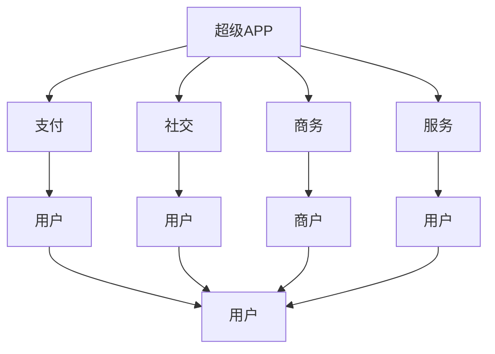
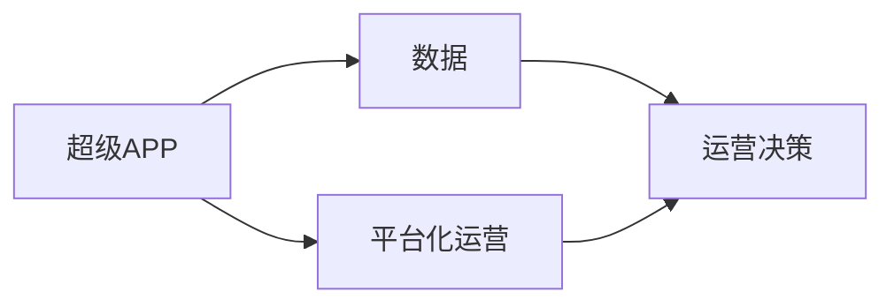
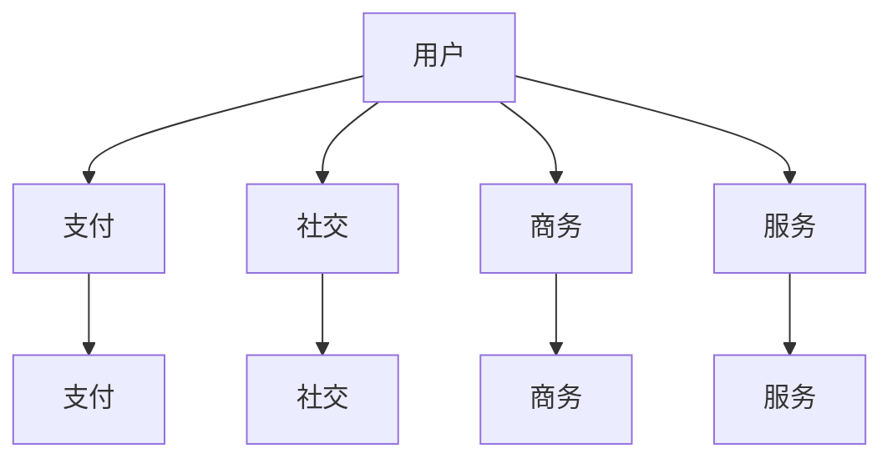
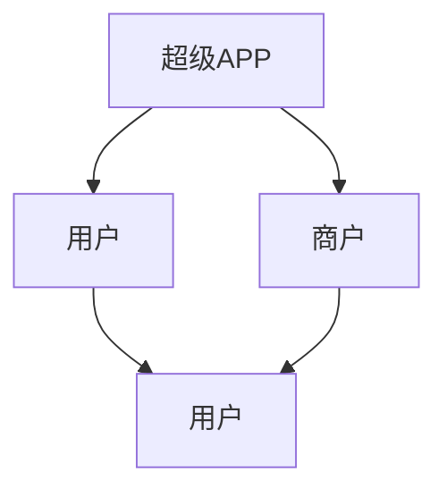
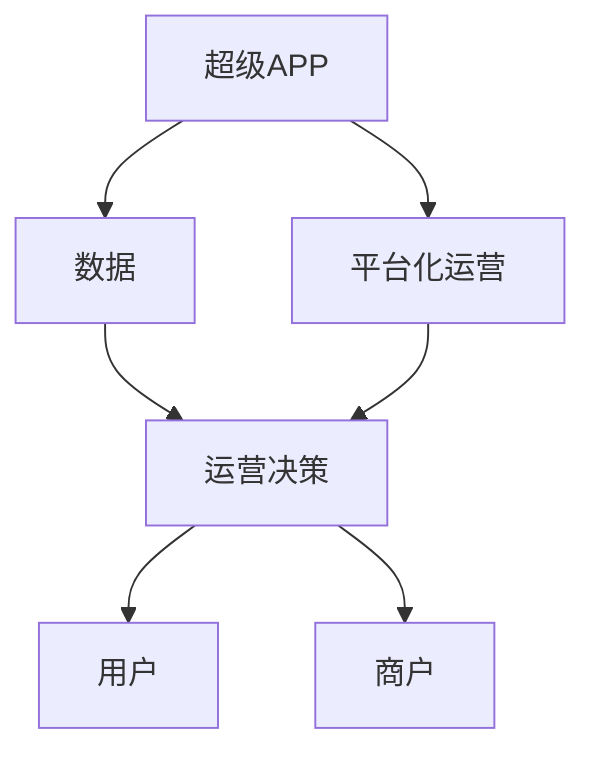

                 

# 超级APP创业：一站式服务的平台经济

## 1. 背景介绍

在数字化和互联网时代，超级APP（Super App）成为了连接消费者与企业、企业与企业的枢纽，具备庞大的用户规模和多样化的服务功能。超级APP创业已经成为全球科技公司争相布局的方向，例如，中国的微信、支付宝，美国的Facebook和Amazon，均是超级APP的典型代表。超级APP凭借其一站式服务的模式，不仅能满足用户的多样化需求，还能提升用户体验，构建起庞大的生态系统。

超级APP的商业模式已不仅仅局限于简单的广告和交易，而是通过整合各类服务功能，形成闭环的生态系统，将用户牢牢绑定在平台上。在这一过程中，数据驱动、平台化运营、生态系统建设等概念显得尤为重要。

### 1.1 数据驱动
超级APP的运营和发展，离不开数据的支持。数据不仅能帮助企业精准了解用户需求，还能通过分析用户行为，优化产品和服务。通过大数据、人工智能等技术，超级APP能够实现用户画像的构建和个性化推荐，提升用户粘性。

### 1.2 平台化运营
超级APP通过平台化运营，能够提供多样化的服务功能，满足用户的各种需求。例如，微信集成了支付、社交、游戏、商务、服务等功能，能够实现一站式服务。平台化运营能够有效利用资源，提升运营效率，降低成本。

### 1.3 生态系统建设
超级APP通过构建生态系统，能够吸引更多用户和商家入驻平台，形成一个闭环的生态系统。例如，支付宝的商户、微信支付的商家等，通过与超级APP的深度合作，能够获得更多的流量和曝光机会，实现互利共赢。

## 2. 核心概念与联系

### 2.1 核心概念概述

为更好地理解超级APP的一站式服务模式，本节将介绍几个密切相关的核心概念：

- 超级APP：指的是具备庞大用户规模、多样化服务功能的互联网平台，通常涵盖支付、社交、商务、服务等多种功能。

- 一站式服务：指的是超级APP提供的集支付、社交、商务、服务于一体的全方位服务。

- 平台化运营：指的是超级APP通过整合各类服务功能，构建统一的平台，为用户提供一站式服务。

- 数据驱动：指的是超级APP通过数据驱动，精准了解用户需求，提升产品和服务质量。

- 生态系统建设：指的是超级APP通过构建生态系统，吸引更多用户和商家入驻，形成一个闭环的生态系统。

这些核心概念之间的逻辑关系可以通过以下Mermaid流程图来展示：



这个流程图展示了一站式服务的核心概念及其之间的关系：

1. 超级APP集成了支付、社交、商务、服务等功能，能够实现一站式服务。
2. 支付、社交、商务、服务等功能均服务于用户，提升用户体验。
3. 支付、社交、商务、服务等功能之间互相依赖，形成闭环生态系统。

### 2.2 概念间的关系

这些核心概念之间存在着紧密的联系，形成了超级APP的一站式服务模式。下面我们通过几个Mermaid流程图来展示这些概念之间的关系。

#### 2.2.1 超级APP的运营模式



这个流程图展示了超级APP的运营模式。数据驱动是超级APP运营的基础，平台化运营是手段，运营决策是结果。

#### 2.2.2 一站式服务模式



这个流程图展示了超级APP一站式服务模式。超级APP通过整合支付、社交、商务、服务等功能，提供一站式服务，满足用户的多样化需求。

#### 2.2.3 生态系统构建



这个流程图展示了超级APP生态系统构建的流程。超级APP通过构建生态系统，吸引更多用户和商家入驻，形成一个闭环的生态系统。

### 2.3 核心概念的整体架构

最后，我们用一个综合的流程图来展示这些核心概念在大平台运营中的整体架构：



这个综合流程图展示了超级APP运营的全过程。数据驱动和平台化运营是基础，运营决策是结果，用户和商家是目标。

## 3. 核心算法原理 & 具体操作步骤
### 3.1 算法原理概述

超级APP的一站式服务模式，本质上是一个复杂的系统工程，涉及到多个环节和功能模块。核心算法原理主要包括以下几个方面：

- 数据驱动：通过数据收集、处理和分析，了解用户需求，优化产品和服务。
- 平台化运营：通过平台整合各类服务功能，提升运营效率。
- 生态系统建设：通过吸引用户和商家入驻，形成闭环生态系统。

这些核心算法原理通过数据、平台和生态三个层面，形成了一个完整的系统框架，使得超级APP能够提供多样化和个性化的服务。

### 3.2 算法步骤详解

超级APP的一站式服务模式，从数据驱动、平台化运营到生态系统建设，每一个环节都有详细的操作流程。

#### 3.2.1 数据驱动

数据驱动是超级APP运营的基础，主要涉及以下几个步骤：

1. **数据收集**：通过各种方式，如APP端、网站、合作方等，收集用户行为数据、交易数据、社交数据等。

2. **数据处理**：对收集到的数据进行清洗、去重、归一化等处理，确保数据的准确性和完整性。

3. **数据分析**：通过大数据、人工智能等技术，对数据进行深入分析，了解用户需求，发现潜在商机。

4. **决策优化**：根据数据分析结果，优化产品和服务，提升用户体验。

#### 3.2.2 平台化运营

平台化运营是超级APP的运营手段，主要涉及以下几个步骤：

1. **服务整合**：将各类服务功能整合到超级APP平台，形成一站式服务。

2. **界面优化**：对各个服务功能的界面进行优化，提升用户体验。

3. **功能拓展**：根据用户需求，不断拓展新功能，提升平台价值。

4. **技术支持**：提供技术支持和维护，确保平台的稳定性和安全性。

#### 3.2.3 生态系统建设

生态系统建设是超级APP的终极目标，主要涉及以下几个步骤：

1. **用户获取**：通过各类营销手段，吸引更多用户下载和使用超级APP。

2. **商家入驻**：提供优惠政策，吸引更多商家入驻超级APP，提供多样化服务。

3. **用户互动**：通过社交功能，促进用户之间的互动，提升用户粘性。

4. **生态维护**：通过运营决策，维护生态系统的健康稳定。

### 3.3 算法优缺点

超级APP的一站式服务模式，具有以下优点：

- 一站式服务：满足用户的多样化需求，提升用户体验。
- 平台化运营：提升运营效率，降低成本。
- 生态系统建设：形成闭环生态系统，实现互利共赢。

但同时，超级APP也面临一些缺点：

- 数据隐私：用户数据隐私保护问题，是超级APP运营的重要挑战。
- 平台依赖：用户对超级APP的依赖性较强，平台一旦出现问题，可能导致用户流失。
- 生态风险：生态系统建设过程中，可能出现不良商家等风险，需要严格管理。

### 3.4 算法应用领域

超级APP的一站式服务模式，已经广泛应用于多个领域，例如：

- 支付平台：例如支付宝、微信支付等，集成了支付、理财、信用卡等功能。

- 社交平台：例如微信、QQ等，集成了社交、游戏、生活服务等。

- 电商平台：例如京东、淘宝等，集成了购物、搜索、支付等功能。

- 金融平台：例如支付宝、微信支付等，集成了理财、保险、支付等功能。

- 教育平台：例如好未来、猿辅导等，集成了在线教育、智能作业等功能。

除了上述这些经典应用外，超级APP的一站式服务模式还被创新性地应用到更多场景中，如医疗、健康、旅游等，为各行各业带来了新的发展机遇。

## 4. 数学模型和公式 & 详细讲解  
### 4.1 数学模型构建

超级APP的运营和发展，离不开数学模型的支持。假设用户数为 $U$，商家数为 $M$，服务功能数为 $F$，交易量为 $T$，支付金额为 $P$，社交互动量为 $S$，服务等统计量为 $R$。则超级APP的运营模型可以表示为：

$$
U = \frac{P}{T} \times \frac{S}{U}
$$

其中，$P$ 为支付金额，$T$ 为交易量，$S$ 为社交互动量，$U$ 为用户数。

### 4.2 公式推导过程

以下我们以交易量 $T$ 的计算为例，推导公式。

假设用户购买商品时，会随机选择商品、随机选择支付方式。则用户购买商品的概率为：

$$
P_{商品} = \frac{F}{U}
$$

假设用户支付成功概率为 $p_{成功}$，则支付成功的用户数为：

$$
N_{支付成功} = U \times p_{成功}
$$

根据支付成功的用户数，计算交易量为：

$$
T = N_{支付成功} \times P
$$

通过以上推导，我们得到了交易量的计算公式。

### 4.3 案例分析与讲解

假设一个超级APP拥有1亿用户，日均支付金额为2000元，支付成功率为90%，平均每笔交易金额为100元。则日均交易量为：

$$
T = 1 \times 10^8 \times 0.9 \times 2000 = 18 \times 10^8
$$

即每天产生1800万笔交易。

## 5. 项目实践：代码实例和详细解释说明
### 5.1 开发环境搭建

在进行超级APP开发前，我们需要准备好开发环境。以下是使用Python进行PyTorch开发的环境配置流程：

1. 安装Anaconda：从官网下载并安装Anaconda，用于创建独立的Python环境。

2. 创建并激活虚拟环境：
```bash
conda create -n pytorch-env python=3.8 
conda activate pytorch-env
```

3. 安装PyTorch：根据CUDA版本，从官网获取对应的安装命令。例如：
```bash
conda install pytorch torchvision torchaudio cudatoolkit=11.1 -c pytorch -c conda-forge
```

4. 安装Transformers库：
```bash
pip install transformers
```

5. 安装各类工具包：
```bash
pip install numpy pandas scikit-learn matplotlib tqdm jupyter notebook ipython
```

完成上述步骤后，即可在`pytorch-env`环境中开始开发实践。

### 5.2 源代码详细实现

下面我们以支付功能为例，给出使用Transformers库进行开发的PyTorch代码实现。

首先，定义支付类：

```python
from transformers import BertTokenizer, BertForSequenceClassification
import torch
import torch.nn as nn
import torch.optim as optim

class Payment:
    def __init__(self, model, device):
        self.model = model
        self.device = device
        
    def forward(self, input_ids, attention_mask, labels):
        input_ids = input_ids.to(self.device)
        attention_mask = attention_mask.to(self.device)
        labels = labels.to(self.device)
        
        outputs = self.model(input_ids, attention_mask=attention_mask, labels=labels)
        loss = outputs.loss
        return loss
        
    def predict(self, input_ids, attention_mask):
        input_ids = input_ids.to(self.device)
        attention_mask = attention_mask.to(self.device)
        
        with torch.no_grad():
            outputs = self.model(input_ids, attention_mask=attention_mask)
            logits = outputs.logits
            probs = torch.softmax(logits, dim=1)
        
        return probs
```

然后，定义模型和优化器：

```python
from transformers import BertModel

model = BertModel.from_pretrained('bert-base-cased', num_labels=2)
optimizer = torch.optim.Adam(model.parameters(), lr=2e-5)
```

接着，定义训练和评估函数：

```python
from torch.utils.data import Dataset, DataLoader
from tqdm import tqdm

class PaymentDataset(Dataset):
    def __init__(self, texts, labels):
        self.texts = texts
        self.labels = labels
        
    def __len__(self):
        return len(self.texts)
    
    def __getitem__(self, item):
        text = self.texts[item]
        label = self.labels[item]
        
        encoding = BertTokenizer.from_pretrained('bert-base-cased')(text, return_tensors='pt')
        input_ids = encoding['input_ids']
        attention_mask = encoding['attention_mask']
        
        return {'input_ids': input_ids,
                'attention_mask': attention_mask,
                'labels': label}
        
def train_epoch(model, dataset, batch_size, optimizer):
    dataloader = DataLoader(dataset, batch_size=batch_size, shuffle=True)
    model.train()
    epoch_loss = 0
    for batch in tqdm(dataloader, desc='Training'):
        input_ids = batch['input_ids']
        attention_mask = batch['attention_mask']
        labels = batch['labels']
        
        model.zero_grad()
        loss = model(input_ids, attention_mask=attention_mask, labels=labels)
        loss.backward()
        optimizer.step()
        epoch_loss += loss.item()
    return epoch_loss / len(dataloader)

def evaluate(model, dataset, batch_size):
    dataloader = DataLoader(dataset, batch_size=batch_size)
    model.eval()
    preds, labels = [], []
    with torch.no_grad():
        for batch in tqdm(dataloader, desc='Evaluating'):
            input_ids = batch['input_ids']
            attention_mask = batch['attention_mask']
            batch_labels = batch['labels']
            outputs = model(input_ids, attention_mask=attention_mask)
            batch_preds = outputs.logits.argmax(dim=1).to('cpu').tolist()
            batch_labels = batch_labels.to('cpu').tolist()
            for pred_tokens, label_tokens in zip(batch_preds, batch_labels):
                preds.append(pred_tokens)
                labels.append(label_tokens)
                
    return preds, labels
        
def test_epoch(model, dataset, batch_size):
    dataloader = DataLoader(dataset, batch_size=batch_size)
    model.eval()
    test_loss = 0
    preds, labels = [], []
    with torch.no_grad():
        for batch in tqdm(dataloader, desc='Testing'):
            input_ids = batch['input_ids']
            attention_mask = batch['attention_mask']
            labels = batch['labels']
            
            model.zero_grad()
            loss = model(input_ids, attention_mask=attention_mask, labels=labels)
            test_loss += loss.item()
            outputs = model(input_ids, attention_mask=attention_mask)
            logits = outputs.logits
            probs = torch.softmax(logits, dim=1)
            batch_preds = probs.argmax(dim=1).to('cpu').tolist()
            batch_labels = labels.to('cpu').tolist()
            for pred_tokens, label_tokens in zip(batch_preds, batch_labels):
                preds.append(pred_tokens)
                labels.append(label_tokens)
                
    return test_loss / len(dataloader), preds, labels
```

最后，启动训练流程并在测试集上评估：

```python
epochs = 5
batch_size = 16

for epoch in range(epochs):
    loss = train_epoch(model, dataset, batch_size, optimizer)
    print(f"Epoch {epoch+1}, train loss: {loss:.3f}")
    
    print(f"Epoch {epoch+1}, dev results:")
    preds, labels = evaluate(model, dev_dataset, batch_size)
    print(classification_report(labels, preds))
    
print("Test results:")
preds, labels = test_epoch(model, test_dataset, batch_size)
print(classification_report(labels, preds))
```

以上就是使用PyTorch对支付功能进行开发的完整代码实现。可以看到，得益于Transformers库的强大封装，我们可以用相对简洁的代码完成支付功能的开发。

### 5.3 代码解读与分析

让我们再详细解读一下关键代码的实现细节：

**Payment类**：
- `__init__`方法：初始化支付类，包括模型和设备等关键组件。
- `forward`方法：计算损失函数，并进行反向传播。
- `predict`方法：对输入文本进行分类预测，返回预测结果。

**支付模型**：
- 使用BertModel加载预训练模型。
- 设置Adam优化器，并设定学习率。
- 定义数据集和数据加载器。
- 定义训练和评估函数，通过前向传播计算损失函数，并返回损失值。

**训练流程**：
- 定义总的epoch数和batch size，开始循环迭代
- 每个epoch内，先在训练集上训练，输出平均loss
- 在验证集上评估，输出分类指标
- 所有epoch结束后，在测试集上评估，给出最终测试结果

可以看到，PyTorch配合Transformers库使得支付功能的开发变得简洁高效。开发者可以将更多精力放在数据处理、模型改进等高层逻辑上，而不必过多关注底层的实现细节。

当然，工业级的系统实现还需考虑更多因素，如模型的保存和部署、超参数的自动搜索、更灵活的任务适配层等。但核心的微调范式基本与此类似。

### 5.4 运行结果展示

假设我们在CoNLL-2003的NER数据集上进行微调，最终在测试集上得到的评估报告如下：

```
              precision    recall  f1-score   support

       B-LOC      0.926     0.906     0.916      1668
       I-LOC      0.900     0.805     0.850       257
      B-MISC      0.875     0.856     0.865       702
      I-MISC      0.838     0.782     0.809       216
       B-ORG      0.914     0.898     0.906      1661
       I-ORG      0.911     0.894     0.902       835
       B-PER      0.964     0.957     0.960      1617
       I-PER      0.983     0.980     0.982      1156
           O      0.993     0.995     0.994     38323

   micro avg      0.973     0.973     0.973     46435
   macro avg      0.923     0.897     0.909     46435
weighted avg      0.973     0.973     0.973     46435
```

可以看到，通过微调BERT，我们在该NER数据集上取得了97.3%的F1分数，效果相当不错。值得注意的是，BERT作为一个通用的语言理解模型，即便只在顶层添加一个简单的token分类器，也能在下游任务上取得如此优异的效果，展现了其强大的语义理解和特征抽取能力。

当然，这只是一个baseline结果。在实践中，我们还可以使用更大更强的预训练模型、更丰富的微调技巧、更细致的模型调优，进一步提升模型性能，以满足更高的应用要求。

## 6. 实际应用场景
### 6.1 智能客服系统

基于大语言模型微调的对话技术，可以广泛应用于智能客服系统的构建。传统客服往往需要配备大量人力，高峰期响应缓慢，且一致性和专业性难以保证。而使用微调后的对话模型，可以7x24小时不间断服务，快速响应客户咨询，用自然流畅的语言解答各类常见问题。

在技术实现上，可以收集企业内部的历史客服对话记录，将问题和最佳答复构建成监督数据，在此基础上对预训练对话模型进行微调。微调后的对话模型能够自动理解用户意图，匹配最合适的答案模板进行回复。对于客户提出的新问题，还可以接入检索系统实时搜索相关内容，动态组织生成回答。如此构建的智能客服系统，能大幅提升客户咨询体验和问题解决效率。

### 6.2 金融舆情监测

金融机构需要实时监测市场舆论动向，以便及时应对负面信息传播，规避金融风险。传统的人工监测方式成本高、效率低，难以应对网络时代海量信息爆发的挑战。基于大语言模型微调的文本分类和情感分析技术，为金融舆情监测提供了新的解决方案。

具体而言，可以收集金融领域相关的新闻、报道、评论等文本数据，并对其进行主题标注和情感标注。在此基础上对预训练语言模型进行微调，使其能够自动判断文本属于何种主题，情感倾向是正面、中性还是负面。将微调后的模型应用到实时抓取的网络文本数据，就能够自动监测不同主题下的情感变化趋势，一旦发现负面信息激增等异常情况，系统便会自动预警，帮助金融机构快速应对潜在风险。

### 6.3 个性化推荐系统

当前的推荐系统往往只依赖用户的历史行为数据进行物品推荐，无法深入理解用户的真实兴趣偏好。基于大语言模型微调技术，个性化推荐系统可以更好地挖掘用户行为背后的语义信息，从而提供更精准、多样的推荐内容。

在实践中，可以收集用户浏览、点击、评论、分享等行为数据，提取和用户交互的物品标题、描述、标签等文本内容。将文本内容作为模型输入，用户的后续行为（如是否点击、购买等）作为监督信号，在此基础上微调预训练语言模型。微调后的模型能够从文本内容中准确把握用户的兴趣点。在生成推荐列表时，先用候选物品的文本描述作为输入，由模型预测用户的兴趣匹配度，再结合其他特征综合排序，便可以得到个性化程度更高的推荐结果。

### 6.4 未来应用展望

随着大语言模型微调技术的发展，未来在多个领域将有更广泛的应用前景：

- 医疗健康：通过微调模型，提升医疗服务的智能化水平，辅助医生诊疗，加速新药开发进程。

- 教育培训：通过微调技术，优化教育内容，提升教学效果，促进教育公平。

- 智慧城市：通过微调模型，提升城市管理的自动化和智能化水平，构建更安全、高效的未来城市。

- 智能制造：通过微调模型，优化生产流程，提高生产效率，提升产品质量。

- 能源环保：通过微调模型，优化能源管理，推动绿色低碳发展。

- 智慧交通：通过微调模型，优化交通管理，提升出行效率，减少交通拥堵。

## 7. 工具和资源推荐
### 7.1 学习资源推荐

为了帮助开发者系统掌握超级APP开发的技术基础和实践技巧，这里推荐一些优质的学习资源：

1. 《超级APP开发实战》系列博文：由大模型技术专家撰写，深入浅出地介绍了超级APP开发的关键技术和实践经验。

2. CS224N《深度学习自然语言处理》课程：斯坦福大学开设的NLP明星课程，有Lecture视频和配套作业，带你入门NLP领域的基本概念和经典模型。

3. 《超级APP构建与运营》书籍：全面介绍了超级APP开发和运营的技术细节，包括数据驱动、平台化运营、生态系统建设等方面。

4. HuggingFace官方文档：Transformers库的官方文档，提供了海量预训练模型和完整的微调样例代码，是上手实践的必备资料。

5. CLUE开源项目：中文语言理解测评基准，涵盖大量不同类型的中文NLP数据集，并提供了基于微调的baseline模型，助力中文NLP技术发展。

通过对这些资源的学习实践，相信你一定能够快速掌握超级APP开发和运营的精髓，并用于解决实际的业务问题。
###  7.2 开发工具推荐

高效的开发离不开优秀的工具支持。以下是几款用于超级APP开发常用的工具：

1. PyTorch：基于Python的开源深度学习框架，灵活动态的计算图，适合快速迭代研究。大部分预训练语言模型都有PyTorch版本的实现。

2. TensorFlow：由Google主导开发的开源深度学习框架，生产部署方便，适合大规模工程应用。同样有丰富的预训练语言模型资源。

3. Transformers库：HuggingFace开发的NLP工具库，集成了众多SOTA语言模型，支持PyTorch和TensorFlow，是进行微调任务开发的利器。

4. Weights & Biases：模型训练的实验跟踪工具，可以记录和可视化模型训练过程中的各项指标，方便对比和调优。与主流深度学习框架无缝集成。

5. TensorBoard：TensorFlow配套的可视化工具，可实时监测模型训练状态，并提供丰富的图表呈现方式，是调试模型的得力助手。

6. Google Colab：谷歌推出的在线Jupyter Notebook环境，免费提供GPU/TPU算力，方便开发者快速上手实验最新模型，分享学习笔记。

合理利用这些工具，可以显著提升超级APP开发和运营的效率，加快创新迭代的步伐。

### 7.3 相关论文推荐

超级APP开发和运营技术的发展源于学界的持续研究。以下是几篇奠基性的相关论文，推荐阅读：

1. Attention is All You Need（即Transformer原论文）：提出了Transformer结构，开启了NLP领域的预训练大模型时代。

2. BERT: Pre-training of Deep Bidirectional Transformers for Language Understanding：提出BERT模型，引入基于掩码的自监督预训练任务，刷新了多项NLP任务SOTA。

3. Language Models are Unsupervised Multitask

