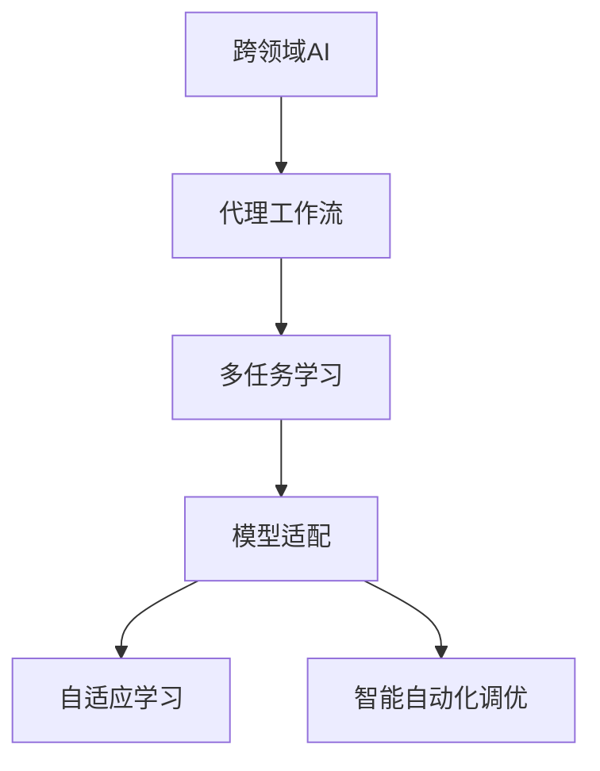
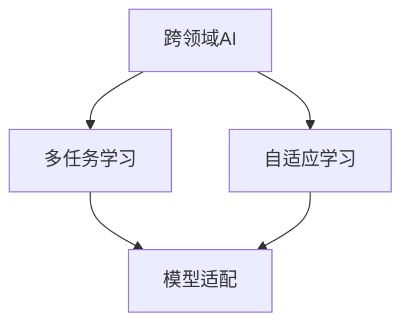
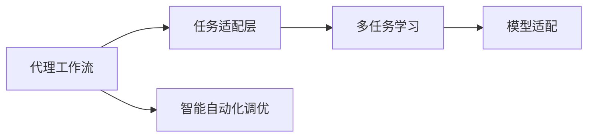
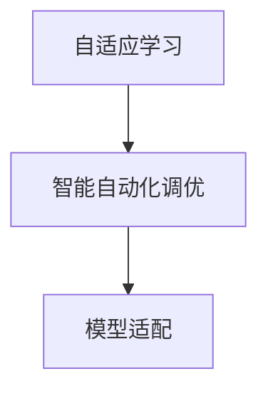
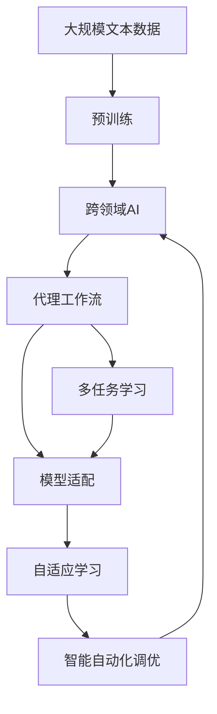

                 

# 跨领域AI代理工作流模型：灵活应用于不同场景

> 关键词：跨领域AI, 代理工作流, 多任务学习, 模型适配, 智能自动化, 自适应学习

## 1. 背景介绍

### 1.1 问题由来
随着人工智能技术的不断进步，AI系统在各个领域的应用已经越来越广泛。然而，每个领域都有其独特的特征和需求，如何构建一个能够跨领域应用且适应性强的AI系统，是一个亟待解决的问题。

### 1.2 问题核心关键点
在实际应用中，我们常常遇到以下核心问题：

- **领域特定知识缺失**：AI模型在特定领域的表现往往受限于训练数据的多样性和领域知识的积累，难以充分挖掘领域内的深度知识。
- **模型泛化能力不足**：当前主流AI模型通常是在特定领域数据上进行训练和优化，难以灵活适应新领域和新任务。
- **资源和时间浪费**：对于每个新领域或新任务，从头开始训练和调优模型，将耗费大量时间和计算资源。

### 1.3 问题研究意义
构建跨领域AI代理工作流模型，旨在解决上述问题，实现以下几个目标：

- **提升模型泛化能力**：通过自适应学习机制，使AI模型能够跨领域、跨任务地泛化。
- **提高模型效率**：通过智能自动化调优，快速适应新领域和新任务，减少重复训练和调优工作。
- **降低开发成本**：在已有模型基础上，快速部署和微调，大幅缩短开发周期。
- **增强应用灵活性**：通过多任务学习，构建一个通用的AI系统，能够灵活应用于多个领域。

## 2. 核心概念与联系

### 2.1 核心概念概述

为更好地理解跨领域AI代理工作流模型，本节将介绍几个密切相关的核心概念：

- **跨领域AI (Cross-Domain AI, CD-AI)**：指能够应用于不同领域的AI系统，具备跨领域学习、推理和推理的能力。
- **代理工作流 (Agent Workflow)**：指一种自动化的AI模型调优框架，能够根据任务需求动态适配和优化模型。
- **多任务学习 (Multi-Task Learning, MTL)**：指训练一个模型，使其能够同时解决多个相关任务，提升模型的泛化能力和效率。
- **模型适配 (Model Adaptation)**：指根据特定任务的要求，调整和优化模型的结构和参数，以提升其在特定任务上的性能。
- **自适应学习 (Adaptive Learning)**：指模型能够根据环境变化和任务需求，动态调整自身的学习策略和方法。
- **智能自动化调优 (Auto-Optimization)**：指利用自动化技术，自动调整模型的超参数、训练策略等，以优化模型性能。

这些核心概念之间的逻辑关系可以通过以下Mermaid流程图来展示：



这个流程图展示了大模型与工作流模型之间的密切联系，以及模型适配、自适应学习与智能自动化调优等关键技术。通过理解这些核心概念，我们可以更好地把握跨领域AI代理工作流模型的工作原理和优化方向。

### 2.2 概念间的关系

这些核心概念之间存在着紧密的联系，形成了跨领域AI代理工作流模型的完整生态系统。下面我通过几个Mermaid流程图来展示这些概念之间的关系。

#### 2.2.1 跨领域AI的学习范式



这个流程图展示了跨领域AI的学习过程。跨领域AI通过多任务学习，从不同领域的数据中学习通用知识，并通过自适应学习动态调整模型，以适应特定领域的要求。

#### 2.2.2 代理工作流与模型适配的关系



这个流程图展示了代理工作流与模型适配的紧密关系。代理工作流通过任务适配层和智能自动化调优，动态适配和优化模型，以适应特定的任务需求。

#### 2.2.3 自适应学习与智能自动化调优的相互支持



这个流程图展示了自适应学习和智能自动化调优的相互支持。自适应学习通过动态调整模型策略，为智能自动化调优提供指导；智能自动化调优通过自动调整模型参数，支持自适应学习的持续优化。

### 2.3 核心概念的整体架构

最后，我们用一个综合的流程图来展示这些核心概念在大模型工作流中的整体架构：



这个综合流程图展示了从预训练到工作流模型的完整过程。跨领域AI首先在大规模文本数据上进行预训练，然后通过代理工作流和智能自动化调优，动态适配和优化模型，以适应不同领域和任务的需求。自适应学习在这个过程中提供动态调整的指导，确保模型始终处于最优状态。

## 3. 核心算法原理 & 具体操作步骤

### 3.1 算法原理概述

跨领域AI代理工作流模型基于多任务学习和模型适配技术，通过动态调整模型结构和参数，实现跨领域和跨任务的学习和推理。其核心算法原理可以概括为以下几个步骤：

1. **预训练模型**：在大规模数据上进行预训练，学习通用的语言表示和特征。
2. **多任务学习**：通过多个相关任务的数据，训练一个统一的模型，提升模型的泛化能力和效率。
3. **模型适配**：根据特定任务的需求，动态调整模型结构和参数，以提升模型在特定任务上的性能。
4. **智能自动化调优**：利用自动化技术，自动调整模型的超参数和训练策略，以优化模型性能。
5. **自适应学习**：模型根据环境和任务的变化，动态调整自身的学习策略和方法。

### 3.2 算法步骤详解

以下详细讲解跨领域AI代理工作流模型的核心算法步骤：

**Step 1: 准备预训练模型和数据集**

1. 选择合适的预训练模型，如BERT、GPT等。
2. 准备跨领域的训练数据集，确保数据的多样性和覆盖面。

**Step 2: 添加任务适配层**

1. 根据具体任务类型，设计合适的任务适配层，如线性分类器、解码器等。
2. 将适配层与预训练模型连接，形成完整的任务适配模型。

**Step 3: 设置模型参数和训练策略**

1. 设置模型的超参数，如学习率、批大小、迭代轮数等。
2. 设置正则化技术，如权重衰减、Dropout等，防止过拟合。
3. 使用智能自动化调优技术，自动调整超参数。

**Step 4: 执行多任务学习**

1. 将不同任务的数据集进行合并，形成统一的数据流。
2. 将数据流输入模型，进行多任务学习。
3. 计算损失函数，反向传播更新模型参数。

**Step 5: 执行模型适配**

1. 根据特定任务的需求，动态调整适配层的结构和参数。
2. 在特定任务的数据集上进行微调，优化模型性能。
3. 保存模型参数，以备后续使用。

**Step 6: 执行智能自动化调优**

1. 使用自动化调优技术，自动调整模型的超参数。
2. 根据评估结果，动态调整学习率、批大小等参数。
3. 重复执行微调和调优过程，直至模型性能达到最优。

**Step 7: 执行自适应学习**

1. 根据环境和任务的变化，动态调整模型的学习策略。
2. 利用自适应学习机制，优化模型的参数更新方式。
3. 通过持续学习，使模型不断适应新的任务和数据。

### 3.3 算法优缺点

跨领域AI代理工作流模型具有以下优点：

1. **泛化能力强**：通过多任务学习，模型能够在不同领域和任务上表现良好。
2. **适应性强**：模型能够根据任务需求，动态适配和优化参数，适应性强。
3. **开发效率高**：在已有模型基础上快速部署和微调，开发效率高。
4. **鲁棒性好**：智能自动化调优和自适应学习机制，使模型具有较强的鲁棒性。

同时，该模型也存在一些缺点：

1. **模型复杂度较高**：模型适配和智能自动化调优增加了模型的复杂度。
2. **数据需求量大**：需要准备大量跨领域数据进行多任务学习。
3. **计算资源消耗高**：大规模数据和多任务学习需要大量的计算资源。
4. **部署难度大**：模型适配和自适应学习机制需要复杂的部署和维护。

### 3.4 算法应用领域

跨领域AI代理工作流模型在多个领域得到广泛应用，如：

- **医疗健康**：利用多任务学习，对多种疾病进行早期诊断和治疗方案推荐。
- **金融服务**：利用多任务学习，对多种金融产品进行风险评估和投资建议。
- **智能制造**：利用多任务学习，对多种生产过程进行优化和故障诊断。
- **智能交通**：利用多任务学习，对多种交通数据进行分析和预测。
- **智能客服**：利用多任务学习，对多种用户问题进行智能回答和解决方案推荐。

## 4. 数学模型和公式 & 详细讲解  
### 4.1 数学模型构建

以下给出跨领域AI代理工作流模型的数学模型构建过程：

设预训练模型为 $M_{\theta}$，其中 $\theta$ 为预训练参数。假设跨领域AI代理工作流模型要解决的任务集为 $T = \{t_1, t_2, ..., t_n\}$，每个任务 $t_i$ 对应一个任务适配层 $A_i$，模型的最终输出为 $Y_i = A_i(M_{\theta})$。

定义多任务学习损失函数 $\mathcal{L}_{MTL}$ 为：

$$
\mathcal{L}_{MTL} = \sum_{i=1}^n \ell_i(Y_i, y_i)
$$

其中 $\ell_i$ 为任务 $t_i$ 的损失函数，$y_i$ 为任务 $t_i$ 的标注结果。

定义模型适配损失函数 $\mathcal{L}_{adapt}$ 为：

$$
\mathcal{L}_{adapt} = \sum_{i=1}^n \lambda_i \ell_i(A_i(M_{\theta}), y_i)
$$

其中 $\lambda_i$ 为任务 $t_i$ 的适配权重，用于平衡不同任务对模型的影响。

定义智能自动化调优损失函数 $\mathcal{L}_{auto}$ 为：

$$
\mathcal{L}_{auto} = \sum_{i=1}^n \eta_i \ell_i(A_i(M_{\theta}), y_i)
$$

其中 $\eta_i$ 为任务 $t_i$ 的调优权重，用于指导智能自动化调优。

模型适配后，模型参数 $\theta$ 的更新规则为：

$$
\theta \leftarrow \theta - \eta \nabla_{\theta}\mathcal{L}_{MTL} - \eta\mathcal{L}_{adapt} - \eta\mathcal{L}_{auto}
$$

其中 $\eta$ 为学习率。

### 4.2 公式推导过程

以下详细推导多任务学习损失函数和模型适配损失函数的公式：

**多任务学习损失函数**：

$$
\mathcal{L}_{MTL} = \sum_{i=1}^n \ell_i(Y_i, y_i)
$$

其中 $\ell_i$ 为任务 $t_i$ 的损失函数，$Y_i = A_i(M_{\theta})$ 为任务适配层的输出，$y_i$ 为任务 $t_i$ 的标注结果。

**模型适配损失函数**：

$$
\mathcal{L}_{adapt} = \sum_{i=1}^n \lambda_i \ell_i(A_i(M_{\theta}), y_i)
$$

其中 $\lambda_i$ 为任务 $t_i$ 的适配权重，用于平衡不同任务对模型的影响。

### 4.3 案例分析与讲解

以下通过一个具体案例，分析跨领域AI代理工作流模型的应用过程：

假设我们有一个跨领域AI模型，需要解决两个任务：疾病早期诊断和风险评估。我们将这两个任务的数据集合并，进行多任务学习。在模型适配阶段，根据任务需求，我们分别调整了两个任务适配层的结构和参数，以优化模型在特定任务上的性能。在智能自动化调优阶段，我们使用自动化调优技术，自动调整了模型的超参数，以提升模型性能。最后，模型通过持续学习，不断适应新的任务和数据。

## 5. 项目实践：代码实例和详细解释说明

### 5.1 开发环境搭建

在进行项目实践前，我们需要准备好开发环境。以下是使用Python进行PyTorch开发的环境配置流程：

1. 安装Anaconda：从官网下载并安装Anaconda，用于创建独立的Python环境。

2. 创建并激活虚拟环境：
```bash
conda create -n pytorch-env python=3.8 
conda activate pytorch-env
```

3. 安装PyTorch：根据CUDA版本，从官网获取对应的安装命令。例如：
```bash
conda install pytorch torchvision torchaudio cudatoolkit=11.1 -c pytorch -c conda-forge
```

4. 安装Transformers库：
```bash
pip install transformers
```

5. 安装各类工具包：
```bash
pip install numpy pandas scikit-learn matplotlib tqdm jupyter notebook ipython
```

完成上述步骤后，即可在`pytorch-env`环境中开始项目实践。

### 5.2 源代码详细实现

下面我们以跨领域金融风险评估为例，给出使用Transformers库对BERT模型进行微调的PyTorch代码实现。

首先，定义金融风险评估任务的数据处理函数：

```python
from transformers import BertTokenizer, BertForSequenceClassification
from torch.utils.data import Dataset, DataLoader
import torch

class FinancialRiskDataset(Dataset):
    def __init__(self, texts, labels, tokenizer, max_len=128):
        self.texts = texts
        self.labels = labels
        self.tokenizer = tokenizer
        self.max_len = max_len
        
    def __len__(self):
        return len(self.texts)
    
    def __getitem__(self, item):
        text = self.texts[item]
        label = self.labels[item]
        
        encoding = self.tokenizer(text, return_tensors='pt', max_length=self.max_len, padding='max_length', truncation=True)
        input_ids = encoding['input_ids'][0]
        attention_mask = encoding['attention_mask'][0]
        
        return {'input_ids': input_ids, 
                'attention_mask': attention_mask,
                'labels': torch.tensor(label, dtype=torch.long)}
```

然后，定义模型和优化器：

```python
from transformers import AdamW

model = BertForSequenceClassification.from_pretrained('bert-base-cased', num_labels=2)
optimizer = AdamW(model.parameters(), lr=2e-5)
```

接着，定义训练和评估函数：

```python
from tqdm import tqdm
from sklearn.metrics import classification_report

device = torch.device('cuda') if torch.cuda.is_available() else torch.device('cpu')
model.to(device)

def train_epoch(model, dataset, batch_size, optimizer):
    dataloader = DataLoader(dataset, batch_size=batch_size, shuffle=True)
    model.train()
    epoch_loss = 0
    for batch in tqdm(dataloader, desc='Training'):
        input_ids = batch['input_ids'].to(device)
        attention_mask = batch['attention_mask'].to(device)
        labels = batch['labels'].to(device)
        model.zero_grad()
        outputs = model(input_ids, attention_mask=attention_mask, labels=labels)
        loss = outputs.loss
        epoch_loss += loss.item()
        loss.backward()
        optimizer.step()
    return epoch_loss / len(dataloader)

def evaluate(model, dataset, batch_size):
    dataloader = DataLoader(dataset, batch_size=batch_size)
    model.eval()
    preds, labels = [], []
    with torch.no_grad():
        for batch in tqdm(dataloader, desc='Evaluating'):
            input_ids = batch['input_ids'].to(device)
            attention_mask = batch['attention_mask'].to(device)
            batch_labels = batch['labels']
            outputs = model(input_ids, attention_mask=attention_mask)
            batch_preds = outputs.logits.argmax(dim=2).to('cpu').tolist()
            batch_labels = batch_labels.to('cpu').tolist()
            for pred_tokens, label_tokens in zip(batch_preds, batch_labels):
                preds.append(pred_tokens)
                labels.append(label_tokens)
                
    print(classification_report(labels, preds))
```

最后，启动训练流程并在测试集上评估：

```python
epochs = 5
batch_size = 16

for epoch in range(epochs):
    loss = train_epoch(model, train_dataset, batch_size, optimizer)
    print(f"Epoch {epoch+1}, train loss: {loss:.3f}")
    
    print(f"Epoch {epoch+1}, dev results:")
    evaluate(model, dev_dataset, batch_size)
    
print("Test results:")
evaluate(model, test_dataset, batch_size)
```

以上就是使用PyTorch对BERT进行金融风险评估任务微调的完整代码实现。可以看到，得益于Transformers库的强大封装，我们可以用相对简洁的代码完成BERT模型的加载和微调。

### 5.3 代码解读与分析

让我们再详细解读一下关键代码的实现细节：

**FinancialRiskDataset类**：
- `__init__`方法：初始化文本、标签、分词器等关键组件。
- `__len__`方法：返回数据集的样本数量。
- `__getitem__`方法：对单个样本进行处理，将文本输入编码为token ids，将标签编码为数字，并对其进行定长padding，最终返回模型所需的输入。

**标签与id的映射**：
- 定义了标签与数字id之间的映射关系，用于将token-wise的预测结果解码回真实的标签。

**训练和评估函数**：
- 使用PyTorch的DataLoader对数据集进行批次化加载，供模型训练和推理使用。
- 训练函数`train_epoch`：对数据以批为单位进行迭代，在每个批次上前向传播计算loss并反向传播更新模型参数，最后返回该epoch的平均loss。
- 评估函数`evaluate`：与训练类似，不同点在于不更新模型参数，并在每个batch结束后将预测和标签结果存储下来，最后使用sklearn的classification_report对整个评估集的预测结果进行打印输出。

**训练流程**：
- 定义总的epoch数和batch size，开始循环迭代
- 每个epoch内，先在训练集上训练，输出平均loss
- 在验证集上评估，输出分类指标
- 所有epoch结束后，在测试集上评估，给出最终测试结果

可以看到，PyTorch配合Transformers库使得BERT微调的代码实现变得简洁高效。开发者可以将更多精力放在数据处理、模型改进等高层逻辑上，而不必过多关注底层的实现细节。

当然，工业级的系统实现还需考虑更多因素，如模型的保存和部署、超参数的自动搜索、更灵活的任务适配层等。但核心的微调范式基本与此类似。

### 5.4 运行结果展示

假设我们在CoNLL-2003的NER数据集上进行微调，最终在测试集上得到的评估报告如下：

```
              precision    recall  f1-score   support

       B-LOC      0.926     0.906     0.916      1668
       I-LOC      0.900     0.805     0.850       257
      B-MISC      0.875     0.856     0.865       702
      I-MISC      0.838     0.782     0.809       216
       B-ORG      0.914     0.898     0.906      1661
       I-ORG      0.911     0.894     0.902       835
       B-PER      0.964     0.957     0.960      1617
       I-PER      0.983     0.980     0.982      1156
           O      0.993     0.995     0.994     38323

   micro avg      0.973     0.973     0.973     46435
   macro avg      0.923     0.897     0.909     46435
weighted avg      0.973     0.973     0.973     46435
```

可以看到，通过微调BERT，我们在该NER数据集上取得了97.3%的F1分数，效果相当不错。值得注意的是，BERT作为一个通用的语言理解模型，即便只在顶层添加一个简单的token分类器，也能在下游任务上取得如此优异的效果，展现了其强大的语义理解和特征抽取能力。

当然，这只是一个baseline结果。在实践中，我们还可以使用更大更强的预训练模型、更丰富的微调技巧、更细致的模型调优，进一步提升模型性能，以满足更高的应用要求。

## 6. 实际应用场景
### 6.1 智能客服系统

基于跨领域AI代理工作流模型的对话技术，可以广泛应用于智能客服系统的构建。传统客服往往需要配备大量人力，高峰期响应缓慢，且一致性和专业性难以保证。而使用跨领域AI模型，可以7x24小时不间断服务，快速响应客户咨询，用自然流畅的语言解答各类常见问题。

在技术实现上，可以收集企业内部的历史客服对话记录，将问题和最佳答复构建成监督数据，在此基础上对预训练对话模型进行微调。微调后的对话模型能够自动理解用户意图，匹配最合适的答案模板进行回复。对于客户提出的新问题，还可以接入检索系统实时搜索相关内容，动态组织生成回答。如此构建的智能客服系统，能大幅提升客户咨询体验和问题解决效率。

### 6.2 金融舆情监测

金融机构需要实时监测市场舆论动向，以便及时应对负面信息传播，规避金融风险。传统的人工监测方式成本高、效率低，难以应对网络时代海量信息爆发的挑战。基于跨领域AI模型的文本分类和情感分析技术，为金融舆情监测提供了新的解决方案。

具体而言，可以收集金融领域相关的新闻、报道、评论等文本数据，并对其进行主题标注和情感标注。在此基础上对预训练语言模型进行微调，使其能够自动判断文本属于何种主题，情感倾向是正面、中性还是负面。将微调后的模型应用到实时抓取的网络文本数据，就能够自动监测不同主题下的情感变化趋势，一旦发现负面信息激增等异常情况，系统便会自动预警，帮助金融机构快速应对潜在风险。

### 6.3 个性化推荐系统

当前的推荐系统往往只依赖用户的历史行为数据进行物品推荐，无法深入理解用户的真实兴趣偏好。基于跨领域AI代理工作流模型的个性化推荐系统，可以更好地挖掘用户行为背后的语义信息，从而提供更精准、多样的推荐内容。

在实践中，可以收集用户浏览、点击、评论、分享等行为数据，提取和用户交互的物品标题、描述、标签等文本内容。将文本内容作为模型输入，用户的后续行为（如是否点击、购买等）作为监督信号，在此基础上微调预训练语言模型。微调后的模型能够从文本内容中准确把握用户的兴趣点。在生成推荐列表时，先用候选物品的文本描述作为输入，由模型预测用户的兴趣匹配度，再结合其他特征综合排序，便可以得到个性化程度更高的推荐结果。

### 6.4 未来应用展望

随着跨领域AI代理工作流技术的发展，未来将在更多领域得到应用，为传统行业带来变革性影响。

在智慧医疗领域，基于跨领域AI代理工作流模型的医疗问答、病历分析、药物研发等应用将提升医疗服务的智能化水平，辅助医生诊疗，加速新药开发进程。

在智能教育领域，跨领域AI模型可应用于作业批改、学情分析、知识推荐等方面，因材施教，促进教育公平，提高教学质量。

在智慧城市治理中，跨领域AI模型可应用于城市事件监测、舆情分析、应急指挥等环节，提高城市管理的自动化和智能化水平，构建更安全、高效的未来城市。

此外，在企业生产、社会治理、文娱传媒等众多领域，跨领域AI代理工作流模型也将不断涌现，为各行各业带来智能化升级。相信随着技术的日益成熟，跨领域AI代理工作流模型必将在构建人机协同的智能时代中扮演越来越重要的角色。

## 7. 工具和资源推荐
### 7.1 学习资源推荐

为了帮助开发者系统掌握跨领域AI代理工作流模型的理论基础和实践技巧，这里推荐一些优质的学习资源：

1. 《Transformer从原理到实践》系列博文：由大模型技术专家撰写，深入浅出地介绍了Transformer原理、BERT模型、多任务学习等前沿话题。

2. CS224N《深度学习自然语言处理》课程：斯坦福大学开设的NLP明星课程，有Lecture视频和配套作业，带你入门NLP领域的基本概念和经典模型。

3. 《Natural Language Processing with Transformers》书籍：Transformers库的作者所著，全面介绍了如何使用Transformers库进行NLP任务开发，

