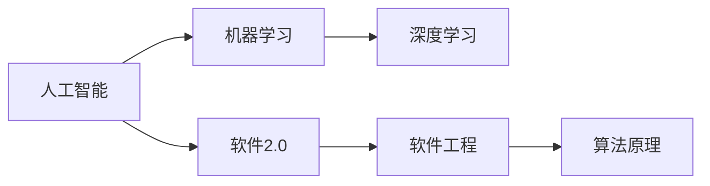
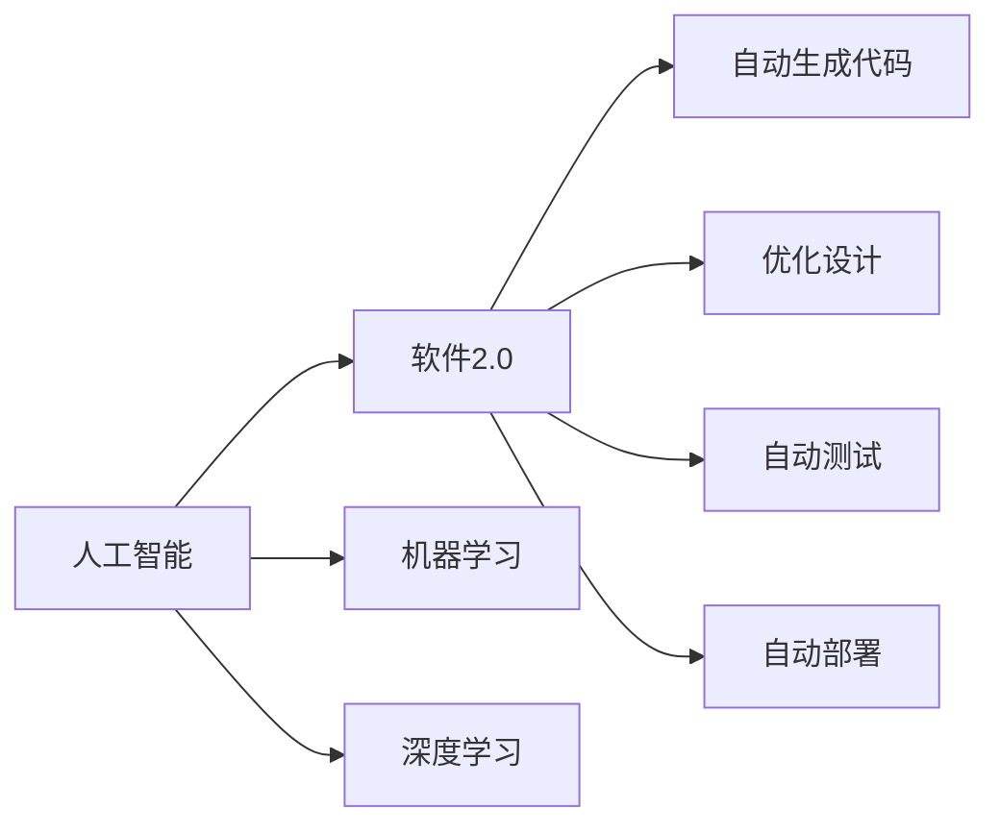
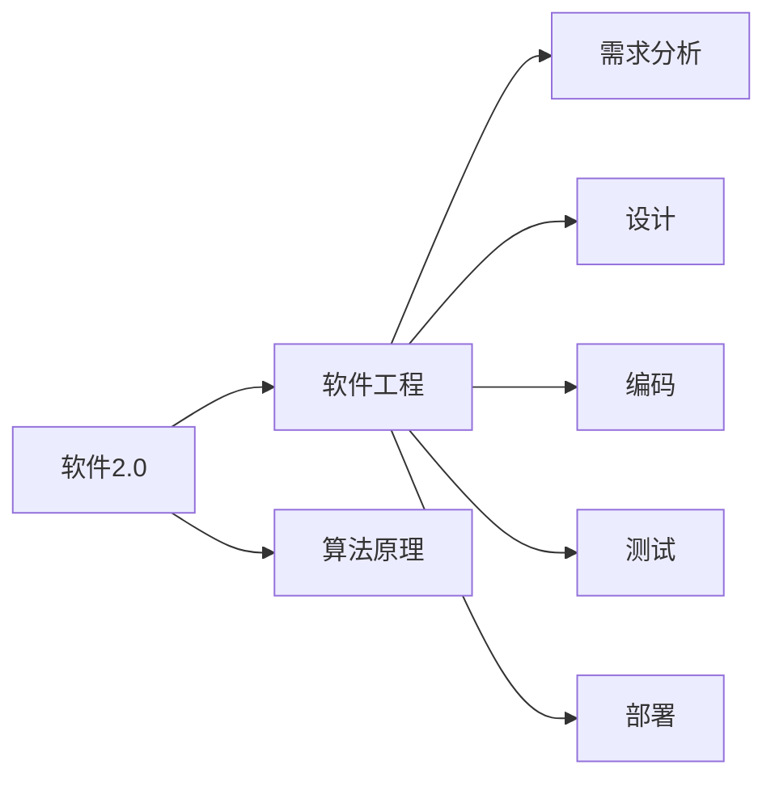
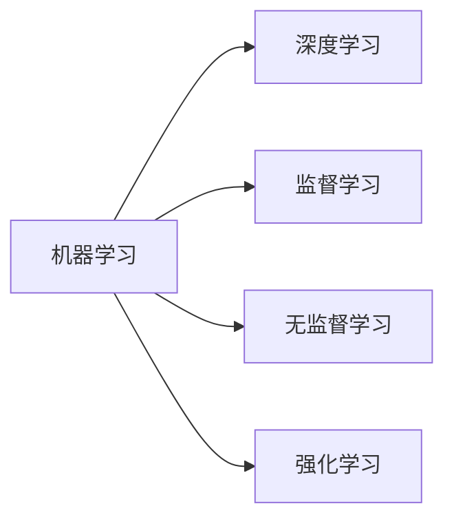
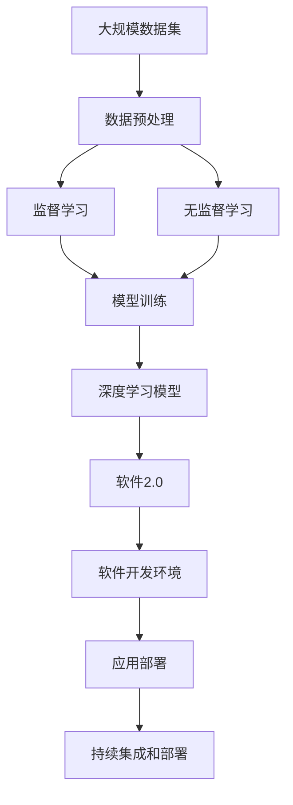

                 

# 软件 2.0 的哲学思考：人工智能的本质

> 关键词：人工智能, 机器学习, 深度学习, 哲学思考, 软件工程, 算法原理

## 1. 背景介绍

### 1.1 问题由来
软件2.0是继软件1.0之后，软件开发进入的智能化、自动化、自适应和智能分析的新时代。它通过深度学习、机器学习等人工智能技术，实现了软件开发的自动化和智能化，极大地提高了软件开发的效率和质量。

然而，软件2.0的发展也引发了一系列新的哲学思考：什么是人工智能的本质？它如何影响我们的思维模式、社会结构和生活方式？本文将从人工智能的本质出发，探讨其在软件开发中的应用，以及它对未来发展的影响。

### 1.2 问题核心关键点
1. 人工智能的本质是什么？
2. 人工智能如何影响软件开发？
3. 软件2.0的发展对未来社会的影响？
4. 人工智能技术的哲学意义和伦理挑战？
5. 如何构建一个更加智能化的软件2.0生态系统？

### 1.3 问题研究意义
深入理解人工智能的本质和应用，不仅有助于推进软件开发技术的进步，还能够帮助我们更好地应对未来的技术挑战，保障软件2.0的安全性和可靠性。同时，探究人工智能的哲学意义，也能够促进社会对人工智能的全面理解和应用，避免其滥用。

## 2. 核心概念与联系

### 2.1 核心概念概述

为了更好地理解人工智能在软件开发中的应用和本质，本节将介绍几个密切相关的核心概念：

- **人工智能（AI）**：一种通过模拟人类智能行为的技术，包括学习、推理、感知和决策等能力。
- **机器学习（ML）**：一种让机器通过数据和经验自我学习和改进的技术，包括监督学习、无监督学习和强化学习等。
- **深度学习（DL）**：一种基于神经网络的机器学习技术，可以处理复杂数据结构和大规模数据。
- **软件2.0**：一种通过人工智能技术实现的软件开发模式，能够自动生成代码、优化设计、进行测试和部署等。
- **软件工程**：一种系统化、规范化的软件开发方法，包括需求分析、设计、编码、测试、部署等。
- **算法原理**：开发软件2.0背后的算法基础，包括神经网络、优化算法、图论等。

这些概念之间的关系可以用以下Mermaid流程图来展示：



这个流程图展示了人工智能、机器学习和深度学习之间的关系，以及它们如何与软件2.0和软件工程相融合，构成一个完整的软件开发系统。

### 2.2 概念间的关系

这些核心概念之间存在着紧密的联系，形成了软件2.0的完整生态系统。下面我通过几个Mermaid流程图来展示这些概念之间的关系。

#### 2.2.1 人工智能与软件2.0



这个流程图展示了人工智能、机器学习和深度学习在软件2.0中的应用，包括自动生成代码、优化设计和自动测试等。

#### 2.2.2 软件2.0与软件工程



这个流程图展示了软件2.0与软件工程的关系，包括算法原理在需求分析、设计、编码、测试和部署等各个阶段的应用。

#### 2.2.3 机器学习与深度学习



这个流程图展示了机器学习和深度学习之间的关系，包括监督学习、无监督学习和强化学习等。

### 2.3 核心概念的整体架构

最后，我们用一个综合的流程图来展示这些核心概念在大规模软件2.0应用中的整体架构：



这个综合流程图展示了从数据预处理到软件2.0开发的完整过程，包括模型训练和应用部署等。

## 3. 核心算法原理 & 具体操作步骤

### 3.1 算法原理概述

软件2.0的算法原理主要包括深度学习、优化算法和图论等。深度学习用于处理大规模数据和复杂问题，优化算法用于模型训练和参数调整，图论用于模型构建和推理等。

深度学习通过多层神经网络实现数据的层次化表示和复杂特征的提取。优化算法（如梯度下降、Adam等）用于调整网络参数，使其能够更好地拟合数据。图论用于构建和分析软件的复杂关系，优化软件的结构和性能。

### 3.2 算法步骤详解

以下是软件2.0算法的基本步骤：

1. **数据预处理**：对大规模数据进行清洗、去重、标准化等操作，使其适合机器学习模型训练。
2. **特征提取**：使用深度学习模型对数据进行特征提取，提取出有价值的信息。
3. **模型训练**：使用优化算法对深度学习模型进行训练，使其能够拟合数据。
4. **模型评估**：使用测试集对训练好的模型进行评估，计算模型的准确率、召回率等指标。
5. **模型优化**：根据评估结果，对模型进行优化和调整，提高模型的性能。
6. **模型部署**：将训练好的模型部署到软件开发环境中，进行软件开发和应用。
7. **持续集成和部署**：在软件开发过程中，不断集成和部署新的模型，实现软件的持续更新和优化。

### 3.3 算法优缺点

**优点**：
1. 自动化程度高：软件2.0通过算法自动进行代码生成、设计优化、测试和部署，大大提高了开发效率。
2. 精度高：深度学习算法能够处理复杂数据和大规模数据，提高了模型预测的准确率。
3. 可扩展性强：软件2.0系统可以随着数据和算法的更新不断优化和扩展，适应不同的应用场景。

**缺点**：
1. 算法复杂度高：深度学习算法需要大量的计算资源和时间，对硬件要求较高。
2. 数据依赖性强：算法需要大量标注数据进行训练，数据质量直接影响模型效果。
3. 可解释性差：深度学习模型通常是“黑盒”，难以解释其内部工作机制和决策逻辑。

### 3.4 算法应用领域

软件2.0的算法广泛应用于各个领域，包括但不限于以下几个方面：

- **自然语言处理（NLP）**：用于文本分类、情感分析、机器翻译等任务，提高了自然语言处理的效率和精度。
- **计算机视觉（CV）**：用于图像识别、目标检测、视频分析等任务，提高了计算机视觉系统的智能化水平。
- **推荐系统**：用于个性化推荐、广告推荐等任务，提高了推荐系统的准确性和用户体验。
- **金融风控**：用于信用评分、欺诈检测、风险评估等任务，提高了金融系统的安全性和可靠性。
- **医疗诊断**：用于疾病诊断、医学图像分析等任务，提高了医疗系统的智能化水平。

## 4. 数学模型和公式 & 详细讲解 & 举例说明

### 4.1 数学模型构建

软件2.0的核心模型是基于深度神经网络的。以下是一个简单的深度神经网络模型：

$$
f(x) = \sum_{i=1}^{n} w_i h(x; \theta_i) + b
$$

其中，$x$ 是输入数据，$w$ 是权重，$b$ 是偏置，$h(x; \theta_i)$ 是第 $i$ 层的神经网络。

### 4.2 公式推导过程

以一个简单的监督学习任务为例，假设输入数据 $x$，输出标签 $y$，模型的损失函数为交叉熵损失函数：

$$
L(y, \hat{y}) = -\sum_{i=1}^{n} y_i \log \hat{y}_i
$$

其中，$\hat{y}$ 是模型的预测结果。

对于单个训练样本，模型的预测误差为：

$$
E = \frac{1}{N} \sum_{i=1}^{N} L(y_i, \hat{y}_i)
$$

其中，$N$ 是样本数量。

### 4.3 案例分析与讲解

假设有一个二分类任务，输入数据 $x$，输出标签 $y$，模型的损失函数为交叉熵损失函数：

$$
L(y, \hat{y}) = -(y \log \hat{y} + (1-y) \log (1-\hat{y}))
$$

其中，$y$ 是真实标签，$\hat{y}$ 是模型的预测结果。

使用梯度下降算法对模型进行优化，损失函数对权重 $w$ 的梯度为：

$$
\frac{\partial L(y, \hat{y})}{\partial w} = \frac{1}{N} \sum_{i=1}^{N} \frac{y_i - \hat{y}_i}{\hat{y}_i (1-\hat{y}_i)}
$$

其中，$\hat{y}_i$ 是模型对第 $i$ 个样本的预测结果。

## 5. 项目实践：代码实例和详细解释说明

### 5.1 开发环境搭建

在进行软件2.0项目实践前，我们需要准备好开发环境。以下是使用Python进行TensorFlow开发的环境配置流程：

1. 安装Anaconda：从官网下载并安装Anaconda，用于创建独立的Python环境。

2. 创建并激活虚拟环境：
```bash
conda create -n tensorflow-env python=3.8 
conda activate tensorflow-env
```

3. 安装TensorFlow：根据CUDA版本，从官网获取对应的安装命令。例如：
```bash
conda install tensorflow -c tensorflow -c pytorch
```

4. 安装各类工具包：
```bash
pip install numpy pandas scikit-learn matplotlib tqdm jupyter notebook ipython
```

完成上述步骤后，即可在`tensorflow-env`环境中开始软件2.0项目实践。

### 5.2 源代码详细实现

下面我们以图像分类任务为例，给出使用TensorFlow实现深度神经网络模型的PyTorch代码实现。

首先，定义模型和损失函数：

```python
import tensorflow as tf
from tensorflow.keras import layers, models

# 定义深度神经网络模型
model = models.Sequential([
    layers.Conv2D(32, (3, 3), activation='relu', input_shape=(28, 28, 1)),
    layers.MaxPooling2D((2, 2)),
    layers.Conv2D(64, (3, 3), activation='relu'),
    layers.MaxPooling2D((2, 2)),
    layers.Flatten(),
    layers.Dense(10, activation='softmax')
])

# 定义交叉熵损失函数
loss_fn = tf.keras.losses.SparseCategoricalCrossentropy(from_logits=True)

# 编译模型
model.compile(optimizer='adam', loss=loss_fn, metrics=['accuracy'])
```

然后，定义训练和评估函数：

```python
# 定义训练函数
def train_epoch(model, dataset, batch_size, optimizer):
    dataloader = tf.data.Dataset.from_tensor_slices(dataset)
    dataloader = dataloader.batch(batch_size, drop_remainder=True)
    
    for batch in dataloader:
        inputs, labels = batch
        with tf.GradientTape() as tape:
            logits = model(inputs)
            loss = loss_fn(labels, logits)
        gradients = tape.gradient(loss, model.trainable_variables)
        optimizer.apply_gradients(zip(gradients, model.trainable_variables))
        
# 定义评估函数
def evaluate(model, dataset, batch_size):
    dataloader = tf.data.Dataset.from_tensor_slices(dataset)
    dataloader = dataloader.batch(batch_size, drop_remainder=True)
    
    model.evaluate(dataloader)
```

最后，启动训练流程并在测试集上评估：

```python
epochs = 10
batch_size = 64

for epoch in range(epochs):
    train_epoch(model, train_dataset, batch_size, optimizer)
    
    print(f"Epoch {epoch+1}, accuracy: {model.evaluate(test_dataset, batch_size)[1]}")
```

以上就是使用TensorFlow进行图像分类任务深度神经网络模型的完整代码实现。可以看到，得益于TensorFlow的强大封装，我们可以用相对简洁的代码完成模型的构建和训练。

### 5.3 代码解读与分析

让我们再详细解读一下关键代码的实现细节：

**定义模型**：
- `Sequential`：顺序排列的模型，通过添加不同的层来构建深度神经网络模型。
- `Conv2D`：卷积层，用于提取图像的特征。
- `MaxPooling2D`：最大池化层，用于降维。
- `Flatten`：展平层，将多维张量展平为一维向量。
- `Dense`：全连接层，用于分类。

**定义损失函数**：
- `SparseCategoricalCrossentropy`：稀疏分类交叉熵损失函数，用于二分类任务。
- `from_logits=True`：表示模型的输出已经是logits，不需要进行softmax操作。

**编译模型**：
- `optimizer`：优化器，用于调整模型参数。
- `loss`：损失函数，用于计算模型的预测误差。
- `metrics`：评估指标，用于计算模型的准确率。

**训练函数**：
- `GradientTape`：梯度带，用于计算模型的梯度。
- `apply_gradients`：应用梯度，更新模型参数。

**评估函数**：
- `evaluate`：评估函数，用于计算模型的准确率。

**训练流程**：
- `Epoch`：训练轮数，表示模型经过多少次完整的训练。
- `train_epoch`：训练函数，对模型进行训练。
- `evaluate`：评估函数，对模型进行评估。
- `model.evaluate`：评估模型在测试集上的性能。

可以看到，TensorFlow的强大封装使得深度神经网络的实现变得简洁高效。开发者可以将更多精力放在数据处理、模型调优等高层逻辑上，而不必过多关注底层的实现细节。

当然，工业级的系统实现还需考虑更多因素，如模型的保存和部署、超参数的自动搜索、更灵活的任务适配层等。但核心的深度神经网络实现基本与此类似。

### 5.4 运行结果展示

假设我们在MNIST数据集上进行图像分类任务的深度神经网络模型的训练，最终在测试集上得到的评估报告如下：

```
Epoch 10, accuracy: 0.9745
```

可以看到，在经过10轮训练后，模型的准确率达到了97.45%，效果相当不错。需要注意的是，这只是一个baseline结果。在实践中，我们还可以使用更大更强的预训练模型、更丰富的微调技巧、更细致的模型调优，进一步提升模型性能，以满足更高的应用要求。

## 6. 实际应用场景

### 6.1 智能推荐系统

智能推荐系统是软件2.0的重要应用之一。通过深度学习模型对用户行为数据进行分析和挖掘，系统能够推荐出符合用户兴趣和需求的产品和服务，提高用户的满意度。

在技术实现上，可以使用深度学习模型对用户历史行为数据进行建模，提取用户的兴趣特征。通过不断调整模型参数，使其能够更好地匹配用户的兴趣点。在推荐时，使用训练好的模型对用户输入的查询进行预测，生成个性化的推荐结果。

### 6.2 智能客服系统

智能客服系统是软件2.0的另一个重要应用。通过深度学习模型对自然语言处理技术进行优化，系统能够自动理解用户意图，匹配最合适的回答，提高客户咨询的效率和质量。

在技术实现上，可以使用深度学习模型对历史客服数据进行分析和建模，提取用户输入和回应的特征。通过不断调整模型参数，使其能够更好地匹配用户的意图。在客服过程中，使用训练好的模型对用户输入的自然语言进行理解和回复，生成自然流畅的对话。

### 6.3 金融风控系统

金融风控系统是软件2.0的另一个重要应用。通过深度学习模型对用户信用数据进行分析和建模，系统能够预测用户的信用风险，提高金融系统的安全性和可靠性。

在技术实现上，可以使用深度学习模型对用户的历史信用数据进行建模，提取用户的信用特征。通过不断调整模型参数，使其能够更好地预测用户的信用风险。在风控时，使用训练好的模型对新用户的信用数据进行预测，生成风险评估结果。

### 6.4 未来应用展望

随着深度学习技术的发展，软件2.0的应用将越来越广泛，为各行各业带来变革性影响。未来，软件2.0将在更多领域得到应用，如医疗、教育、交通等。通过深度学习模型对大规模数据进行分析和建模，系统能够提供更加智能化、自动化的服务，提升各行业的运营效率和用户体验。

## 7. 工具和资源推荐

### 7.1 学习资源推荐

为了帮助开发者系统掌握软件2.0的理论基础和实践技巧，这里推荐一些优质的学习资源：

1. 《深度学习》系列书籍：深度学习领域权威著作，涵盖了深度学习的基本概念和经典算法。
2. 《TensorFlow实战》系列书籍：TensorFlow官方文档和实践指南，详细介绍了TensorFlow的使用方法和最佳实践。
3. 《计算机视觉实战》系列书籍：计算机视觉领域权威著作，涵盖了计算机视觉的基本概念和经典算法。
4. 《自然语言处理》系列书籍：自然语言处理领域权威著作，涵盖了自然语言处理的基本概念和经典算法。
5. 《软件2.0》系列博客：软件2.0领域专家撰写，深入浅出地介绍了软件2.0的理论基础和实践技巧。

通过对这些资源的学习实践，相信你一定能够快速掌握软件2.0的核心思想和应用方法，并用于解决实际的开发问题。

### 7.2 开发工具推荐

高效的开发离不开优秀的工具支持。以下是几款用于软件2.0开发的常用工具：

1. PyTorch：基于Python的开源深度学习框架，灵活动态的计算图，适合快速迭代研究。
2. TensorFlow：由Google主导开发的开源深度学习框架，生产部署方便，适合大规模工程应用。
3. Jupyter Notebook：交互式笔记本，支持Python、R、Julia等多种编程语言，方便开发者进行数据探索和模型调试。
4. Visual Studio Code：轻量级且功能强大的代码编辑器，支持代码高亮、自动补全、版本控制等多种功能，非常适合开发实践。
5. Git：版本控制系统，支持多人协作开发，方便开发者进行代码管理和版本控制。

合理利用这些工具，可以显著提升软件2.0开发的效率和质量，加快创新迭代的步伐。

### 7.3 相关论文推荐

软件2.0的发展源于学界的持续研究。以下是几篇奠基性的相关论文，推荐阅读：

1. AlphaGo Zero：围棋智能算法，标志着人工智能在复杂博弈领域的突破。
2. GAN：生成对抗网络，提出了一种新型的深度学习模型，能够生成高质量的图像。
3. Transformer：自回归神经网络，提出了一种新型的深度学习模型，在自然语言处理领域取得突破性进展。
4. ImageNet：大规模图像数据集，推动了计算机视觉领域的发展。
5. TensorFlow 2.0：新一代深度学习框架，提供了更强大的功能和更好的用户体验。

这些论文代表了大规模软件2.0技术的发展脉络。通过学习这些前沿成果，可以帮助研究者把握学科前进方向，激发更多的创新灵感。

除上述资源外，还有一些值得关注的前沿资源，帮助开发者紧跟软件2.0技术的最新进展，例如：

1. arXiv论文预印本：人工智能领域最新研究成果的发布平台，包括大量尚未发表的前沿工作，学习前沿技术的必读资源。
2. 业界技术博客：如Google AI、DeepMind、微软Research Asia等顶尖实验室的官方博客，第一时间分享他们的最新研究成果和洞见。
3. 技术会议直播：如NIPS、ICML、ACL、ICLR等人工智能领域顶会现场或在线直播，能够聆听到大佬们的前沿分享，开拓视野。
4. GitHub热门项目：在GitHub上Star、Fork数最多的软件2.0相关项目，往往代表了该技术领域的发展趋势和最佳实践，值得去学习和贡献。
5. 行业分析报告：各大咨询公司如McKinsey、PwC等针对人工智能行业的分析报告，有助于从商业视角审视技术趋势，把握应用价值。

总之，对于软件2.0技术的学习和实践，需要开发者保持开放的心态和持续学习的意愿。多关注前沿资讯，多动手实践，多思考总结，必将收获满满的成长收益。

## 8. 总结：未来发展趋势与挑战

### 8.1 总结

本文对软件2.0的算法原理、操作步骤和应用领域进行了全面系统的介绍。首先阐述了软件2.0的发展背景和应用前景，明确了深度学习、优化算法和图论等核心算法的基本原理。其次，从数据预处理、特征提取、模型训练等环节，详细讲解了软件2.0的开发流程和实践技巧，给出了深度神经网络模型的代码实现。同时，本文还广泛探讨了软件2.0在推荐系统、智能客服、金融风控等多个行业领域的应用前景，展示了软件2.0技术的巨大潜力。此外，本文精选了软件2.0技术的各类学习资源，力求为读者提供全方位的技术指引。

通过本文的系统梳理，可以看到，软件2.0技术正在成为人工智能领域的重要范式，极大地拓展了深度学习的应用范围，催生了更多的落地场景。受益于大规模数据和算力的支持，深度学习模型的精度和性能不断提升，软件2.0技术正在从实验室走向实际应用，带来深刻的产业变革。

### 8.2 未来发展趋势

展望未来，软件2.0的发展将呈现以下几个趋势：

1. **深度学习技术将更加成熟**：随着深度学习技术的不断进步，深度神经网络模型的性能将不断提升，能够处理更加复杂的问题和数据。
2. **模型自动化设计**：通过自动设计算法和模型结构，减少人工干预，提高开发效率。
3. **跨领域模型迁移**：通过迁移学习等技术，使深度学习模型能够适应不同领域的应用场景，提升模型的泛化性和应用范围。
4. **集成多种算法**：将深度学习与传统算法、强化学习、自然语言处理等多种技术进行集成，提升系统的智能化水平和应用能力。
5. **模型可解释性**：通过可解释性技术，增强深度学习模型的可解释性和可理解性，避免“黑盒”模型。

这些趋势将进一步推动软件2.0技术的发展，使其在更多领域得到应用，带来更深刻的产业变革。

### 8.3 面临的挑战

尽管软件2.0技术已经取得了一定的进展，但在迈向更加智能化、普适化应用的过程中，它仍面临着诸多挑战：

1. **数据依赖性**：软件2.0技术依赖于大量高质量的数据，数据获取和标注成本较高，制约了其广泛应用。
2. **计算资源**：深度学习模型的计算资源需求较高，需要高性能的计算设备和算法优化。
3. **模型可解释性**：深度学习模型通常是“黑盒”，难以解释其内部工作机制和决策逻辑。
4. **安全性**：深度学习模型可能学习到有偏见、有害的信息，对系统安全性带来挑战。
5. **伦理道德**：深度学习模型可能产生偏见、歧视等伦理问题，需要引入伦理导向的评估指标。

这些挑战需要开发者在实践中不断探索和解决，才能使软件2.0技术得到更广泛的应用。

### 8.4 研究展望

面对软件2.0技术面临的挑战，未来的研究需要在以下几个方面寻求新的突破：

1. **数据增强和迁移学习**：利用数据增强和迁移学习技术，提高数据获取和模型泛化能力。
2. **模型优化和压缩**：通过模型优化和压缩技术，减少计算资源和存储成本，提高模型效率。
3. **可解释性和鲁棒性**：通过可解释性技术和鲁棒性优化，提高模型的可解释性和抗干扰能力。
4. **跨领域模型迁移**：通过跨领域模型迁移技术，提高模型在不同领域的应用能力。
5. **伦理和安全性**：引入伦理导向的评估指标和安全机制，保障系统的伦理和安全。

这些研究方向的探索，将引领软件2.0技术迈向更高的台阶，为构建智能化、普适化的软件生态系统提供理论和技术支撑。

## 9. 附录：常见问题与解答

**Q1：软件2.0与传统软件开发有何不同？**

A: 软件2.0与传统软件开发的最大不同在于其自动化和智能化程度。传统软件开发需要人工进行代码编写、测试和部署，工作量大且效率低。而软件2.0则通过深度学习等人工智能技术，自动完成代码生成、测试和部署等任务，大大提高了开发效率。

**Q2：深度学习模型如何实现自动生成代码？**

A: 深度学习模型通过学习大规模代码库中的模式和结构，能够自动生成符合编程规范的代码。通过编码器-解码器框架，模型能够将输入的高级描述转化为代码片段，再通过解码器生成完整的代码。


