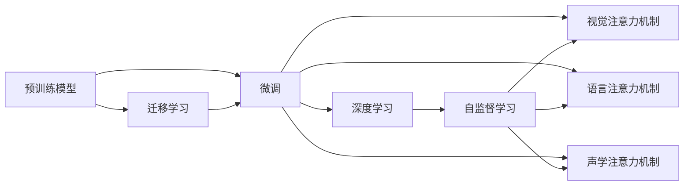
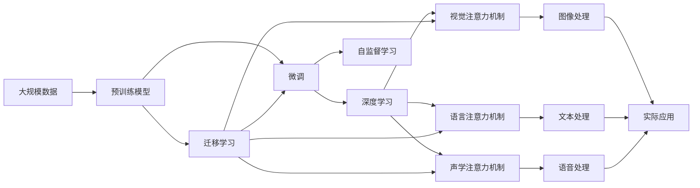

                 

# 软件2.0擅长图像视频和语音，传统编程望尘莫及

在当今的科技发展浪潮中，人工智能正以势不可挡之势，颠覆着我们的工作方式和生活习惯。而软件2.0，作为AI技术的载体和推手，正展现出与传统软件开发截然不同的能力，特别是在图像、视频和语音领域的应用上，传统编程技术望尘莫及。本文将系统梳理软件2.0的兴起、核心概念、关键技术，以及其在图像、视频和语音领域的应用实践，为广大开发者和科研人员提供深入理解和借鉴。

## 1. 背景介绍

### 1.1 软件2.0的兴起
在软件1.0时代，软件主要由编程人员编写，数据和算法是其核心要素。然而，随着数据量和计算规模的不断扩大，传统软件开发模式逐渐显得力不从心。软件2.0的兴起，标志着数据、模型和算法三要素的融合，AI技术在软件构建中扮演了越来越重要的角色。Google的BERT模型、OpenAI的GPT-3模型、微软的Azure Cognitive Services等，都是软件2.0的典型代表。

### 1.2 软件2.0的核心理念
软件2.0的核心理念是：数据即代码。通过大量的数据输入和自监督学习，AI模型能够自发构建出高效的特征表示，无需人工编写复杂的算法。传统编程人员的价值，更多地体现在对已有模型的调整和优化上，而非从头编写算法。这种转变，使得软件开发效率和效果得到了极大的提升。

## 2. 核心概念与联系

### 2.1 核心概念概述

为更好地理解软件2.0及其应用，本节将介绍几个密切相关的核心概念：

- **预训练模型**：通过在大规模无标签数据上进行自监督学习，学习到通用的语言、图像或视频表示的模型。
- **微调(Fine-tuning)**：在预训练模型的基础上，使用特定任务的少量标注数据进行有监督学习，优化模型在该任务上的性能。
- **迁移学习(Transfer Learning)**：将一个领域学习到的知识，迁移应用到另一个不同但相关的领域的学习范式。
- **深度学习(Deep Learning)**：利用深度神经网络模型，对大规模数据进行学习，提取高层次特征表示的算法。
- **自监督学习(Self-supervised Learning)**：在无标签数据上，通过自监督任务训练模型，无需标注数据即可学习到有效的特征表示。
- **视觉注意力机制(Visual Attention Mechanism)**：在图像处理中，通过学习视觉注意力，对不同区域的图像特征进行加权，提高模型对关键信息的学习能力。
- **语言注意力机制(Language Attention Mechanism)**：在文本处理中，通过学习语言注意力，对不同位置的文本特征进行加权，提高模型对句子结构的理解能力。
- **声学注意力机制(Acoustic Attention Mechanism)**：在语音处理中，通过学习声学注意力，对不同频率和时间的语音特征进行加权，提高模型对语音内容的理解能力。

### 2.2 核心概念之间的关系

这些核心概念之间的逻辑关系可以通过以下Mermaid流程图来展示：



这个流程图展示了大模型和注意力机制之间的关系：

1. 预训练模型通过自监督学习，学习到通用的特征表示。
2. 微调通过有监督学习，将预训练模型适配到特定任务。
3. 迁移学习允许将一个领域的知识应用到另一个领域。
4. 深度学习用于构建复杂的神经网络模型，提取高层次特征。
5. 自监督学习在无标注数据上训练模型，学习到有效的特征表示。
6. 视觉、语言和声学注意力机制，提高模型对不同区域、不同位置和不同频率特征的学习能力。

通过理解这些核心概念的关系，我们可以更好地把握软件2.0的工作原理和优化方向。

### 2.3 核心概念的整体架构

最后，我们用一个综合的流程图来展示这些核心概念在大模型应用中的整体架构：



这个综合流程图展示了从预训练到微调，再到实际应用的大模型应用过程：

1. 从大规模数据中，通过预训练学习通用的特征表示。
2. 利用微调，将预训练模型适配到特定任务，提升模型性能。
3. 通过深度学习，构建更复杂的模型，提取高层次特征。
4. 自监督学习在无标注数据上训练模型，提高特征表示能力。
5. 视觉、语言和声学注意力机制，提高模型对不同特征的学习能力。
6. 最终的图像、文本和语音处理结果，可以应用于实际应用场景。

通过这些流程图，我们可以更清晰地理解软件2.0的核心概念及其关系，为后续深入讨论具体技术奠定基础。

## 3. 核心算法原理 & 具体操作步骤

### 3.1 算法原理概述
软件2.0的核心算法原理，主要是深度学习和注意力机制的应用。通过深度神经网络模型，学习到复杂的特征表示，并引入注意力机制，对不同区域、不同位置和不同频率的特征进行加权，提高模型的理解能力和性能。

在图像处理中，常用的算法有卷积神经网络(CNN)和残差网络(ResNet)。这些模型通过卷积操作，提取图像特征，并通过注意力机制，对不同区域的图像特征进行加权，提高模型对关键信息的识别能力。

在文本处理中，常用的算法有循环神经网络(RNN)、长短期记忆网络(LSTM)和Transformer。这些模型通过循环操作或自注意力机制，学习到文本特征，并通过注意力机制，对不同位置的文本特征进行加权，提高模型对句子结构的理解能力。

在语音处理中，常用的算法有卷积神经网络(CNN)、循环神经网络(RNN)和Transformer。这些模型通过卷积或循环操作，学习到语音特征，并通过声学注意力机制，对不同频率和时间的语音特征进行加权，提高模型对语音内容的理解能力。

### 3.2 算法步骤详解
软件2.0的算法步骤主要包括以下几个关键环节：

1. **数据准备**：收集大规模无标签或少量标注的数据，作为预训练和微调的数据源。数据规模和质量直接影响模型的性能。
2. **模型选择**：选择合适的预训练模型，如BERT、GPT、ResNet等，作为初始化参数。不同领域的模型，需要根据任务特点进行选择。
3. **微调过程**：在预训练模型的基础上，使用少量标注数据进行微调，优化模型在特定任务上的性能。微调过程一般使用较小的学习率，以避免破坏预训练权重。
4. **注意力机制**：引入注意力机制，提高模型对不同特征的关注程度。在图像、文本和语音处理中，常用的注意力机制有视觉注意力、语言注意力和声学注意力。
5. **评估与优化**：在训练过程中，周期性评估模型性能，调整学习率、正则化等参数，防止过拟合。

### 3.3 算法优缺点
软件2.0在图像、视频和语音处理中，展现出显著的优势，但也存在一些局限：

**优点**：

- **自动特征提取**：无需手工设计特征提取器，模型可以自动学习到有效的特征表示。
- **泛化能力强**：大模型通过大量的数据训练，具备较强的泛化能力，可以在不同领域和任务上取得优异表现。
- **可解释性差**：深度学习模型的"黑盒"特性，使得模型的决策过程难以解释和调试。

**缺点**：

- **数据需求高**：大模型对数据量的需求较高，数据质量对模型性能影响显著。
- **计算资源要求高**：大模型训练和推理计算量大，需要高性能计算资源。
- **模型的可扩展性差**：不同任务的模型难以复用，模型规模难以扩展。

### 3.4 算法应用领域
软件2.0在图像、视频和语音处理中的应用领域非常广泛，涵盖了计算机视觉、自然语言处理、语音识别等多个领域。

- **图像处理**：人脸识别、图像分类、目标检测、图像生成等。
- **视频处理**：视频分类、动作识别、行为理解、视频生成等。
- **语音处理**：语音识别、语音合成、情感分析、对话系统等。

## 4. 数学模型和公式 & 详细讲解 & 举例说明

### 4.1 数学模型构建

以图像分类任务为例，假设模型为 $M_{\theta}:\mathbb{R}^{C \times H \times W} \rightarrow \{1,2,...,K\}$，其中 $C$ 为输入图像的通道数，$H$ 和 $W$ 为图像的高度和宽度，$K$ 为类别数。模型参数 $\theta$ 为卷积核和全连接层的权重和偏置。

输入图像 $x$ 经过卷积层、池化层和全连接层后，得到输出 $y=M_{\theta}(x)$。模型损失函数为交叉熵损失函数：

$$
\mathcal{L}(y,\hat{y}) = -\frac{1}{N} \sum_{i=1}^N \sum_{j=1}^K y_{i,j}\log \hat{y}_{i,j}
$$

其中 $y_{i,j}$ 为第 $i$ 个样本属于第 $j$ 类的标签，$\hat{y}_{i,j}$ 为模型预测该样本属于第 $j$ 类的概率。

### 4.2 公式推导过程
以卷积神经网络(CNN)为例，推导其参数更新公式。

假设输入图像为 $x \in \mathbb{R}^{C \times H \times W}$，卷积层输出的特征图为 $f \in \mathbb{R}^{F \times (H-k+1) \times (W-k+1)}$，其中 $F$ 为卷积核数量，$k$ 为卷积核大小。

卷积操作为：

$$
f_{l,i,j} = \sum_{n=0}^{F-1} \sum_{m=0}^{k-1} \sum_{n'=0}^{k-1} w_{l,n,m,n'}x_{i+m,j+n'}
$$

其中 $w_{l,n,m,n'}$ 为第 $l$ 层的卷积核参数，$x_{i+m,j+n'}$ 为输入图像的像素值。

假设输出为 $y \in \mathbb{R}^K$，使用softmax函数对 $f$ 进行归一化，得到模型输出：

$$
\hat{y}_i = softmax(f_i) = \frac{\exp(f_{i})}{\sum_{j=1}^K \exp(f_j)}
$$

其中 $f_i$ 为特征图的第 $i$ 个通道，$softmax$ 函数将特征图映射到类别概率向量。

模型损失函数为交叉熵损失函数：

$$
\mathcal{L}(y,\hat{y}) = -\frac{1}{N} \sum_{i=1}^N \sum_{j=1}^K y_{i,j}\log \hat{y}_{i,j}
$$

对损失函数求导，得到梯度：

$$
\frac{\partial \mathcal{L}}{\partial \theta} = -\frac{1}{N} \sum_{i=1}^N \sum_{j=1}^K \frac{\partial \mathcal{L}}{\partial f_i}\frac{\partial f_i}{\partial \theta}
$$

其中 $\frac{\partial \mathcal{L}}{\partial f_i}$ 为特征图对损失函数的导数。

通过链式法则，计算特征图对损失函数的导数：

$$
\frac{\partial \mathcal{L}}{\partial f_i} = -\sum_{j=1}^K \frac{y_{i,j}}{\hat{y}_{i,j}} - \frac{1}{\lambda}\sum_{l=1}^L \sum_{m=0}^{k-1} \sum_{n=0}^{F-1} \sum_{m'=0}^{k-1} \sum_{n'=0}^{k-1} \frac{\partial \mathcal{L}}{\partial w_{l,n,m,n'}} \frac{\partial w_{l,n,m,n'}}{\partial f_i}
$$

其中 $\lambda$ 为正则化系数，$L$ 为模型层数。

最终，使用梯度下降等优化算法，更新模型参数 $\theta$，最小化损失函数 $\mathcal{L}$。

### 4.3 案例分析与讲解
以图像分类任务为例，假设我们有一组训练数据 $D=\{(x_i,y_i)\}_{i=1}^N$，其中 $x_i$ 为输入图像，$y_i$ 为标签向量。

假设我们使用的预训练模型为 ResNet-50，其参数数量为 1.8M。我们选择其中三个卷积层作为微调目标，固定其余层参数不变。使用 AdamW 优化器，设置学习率为 1e-4，正则化系数为 1e-5。

使用以下代码进行微调：

```python
from transformers import ResNet50
import torch
import torch.nn as nn
import torch.optim as optim

# 加载预训练模型
model = ResNet50.from_pretrained('resnet50', pretrained=True)

# 定义微调目标层
target_layers = [model.conv1, model.layer1, model.layer2]

# 冻结其他层
for param in model.parameters():
    if param not in target_layers:
        param.requires_grad = False

# 定义优化器
optimizer = optim.AdamW(target_layers, lr=1e-4)

# 定义训练函数
def train(epoch, model, data_loader, device):
    model.train()
    for batch_idx, (inputs, targets) in enumerate(data_loader):
        inputs, targets = inputs.to(device), targets.to(device)
        optimizer.zero_grad()
        outputs = model(inputs)
        loss = nn.CrossEntropyLoss()(outputs, targets)
        loss.backward()
        optimizer.step()

        if (batch_idx+1) % 100 == 0:
            print(f'Epoch {epoch+1}, Step {batch_idx+1}, Loss: {loss.item():.4f}')

# 训练模型
train_epochs = 5
device = torch.device('cuda' if torch.cuda.is_available() else 'cpu')

for epoch in range(train_epochs):
    train(epoch, model, train_loader, device)
```

在这个代码中，我们首先加载预训练模型 ResNet-50，并定义了需要微调的三个卷积层。然后使用 AdamW 优化器，设置学习率为 1e-4，正则化系数为 1e-5。在训练函数中，我们定义了训练数据加载器，并使用训练函数对模型进行微调。

## 5. 项目实践：代码实例和详细解释说明

### 5.1 开发环境搭建

在进行图像分类项目实践前，我们需要准备好开发环境。以下是使用Python进行TensorFlow开发的环境配置流程：

1. 安装Anaconda：从官网下载并安装Anaconda，用于创建独立的Python环境。

2. 创建并激活虚拟环境：
```bash
conda create -n tf-env python=3.8 
conda activate tf-env
```

3. 安装TensorFlow：根据CUDA版本，从官网获取对应的安装命令。例如：
```bash
conda install tensorflow==2.7.0 
```

4. 安装各类工具包：
```bash
pip install numpy pandas scikit-learn matplotlib tqdm jupyter notebook ipython
```

完成上述步骤后，即可在`tf-env`环境中开始项目实践。

### 5.2 源代码详细实现

下面我们以图像分类任务为例，给出使用TensorFlow对ResNet模型进行微调的PyTorch代码实现。

首先，定义图像分类任务的数据处理函数：

```python
import tensorflow as tf
from tensorflow.keras.preprocessing.image import ImageDataGenerator
import numpy as np

# 加载图像数据
train_datagen = ImageDataGenerator(rescale=1./255, shear_range=0.2, zoom_range=0.2, horizontal_flip=True)
train_generator = train_datagen.flow_from_directory(
        train_dir,
        target_size=(224, 224),
        batch_size=32,
        class_mode='categorical')

# 定义模型输入
inputs = tf.keras.Input(shape=(224, 224, 3))
x = tf.keras.layers.Conv2D(64, (3, 3), activation='relu', padding='same')(inputs)
x = tf.keras.layers.MaxPooling2D((2, 2))(x)
x = tf.keras.layers.Conv2D(128, (3, 3), activation='relu', padding='same')(x)
x = tf.keras.layers.MaxPooling2D((2, 2))(x)
x = tf.keras.layers.Conv2D(256, (3, 3), activation='relu', padding='same')(x)
x = tf.keras.layers.MaxPooling2D((2, 2))(x)
x = tf.keras.layers.Conv2D(512, (3, 3), activation='relu', padding='same')(x)
x = tf.keras.layers.MaxPooling2D((2, 2))(x)
x = tf.keras.layers.Flatten()(x)
x = tf.keras.layers.Dense(512, activation='relu')(x)
x = tf.keras.layers.Dropout(0.5)(x)
outputs = tf.keras.layers.Dense(10, activation='softmax')(x)
model = tf.keras.Model(inputs, outputs)
```

然后，定义模型和优化器：

```python
# 加载预训练模型
base_model = tf.keras.applications.ResNet50(include_top=False, weights='imagenet')

# 冻结预训练层
for layer in base_model.layers:
    layer.trainable = False

# 定义微调层
for layer in model.layers[1:]:
    layer.trainable = True

# 定义优化器
optimizer = tf.keras.optimizers.Adam(learning_rate=1e-4)

# 定义损失函数
loss_fn = tf.keras.losses.CategoricalCrossentropy()

# 定义评估指标
metrics = [tf.keras.metrics.CategoricalAccuracy(name='accuracy')]
```

接着，定义训练和评估函数：

```python
# 定义训练函数
def train_step(inputs, targets):
    with tf.GradientTape() as tape:
        predictions = model(inputs)
        loss = loss_fn(targets, predictions)
    gradients = tape.gradient(loss, model.trainable_variables)
    optimizer.apply_gradients(zip(gradients, model.trainable_variables))
    return loss

# 定义评估函数
def evaluate_step(inputs, targets):
    predictions = model(inputs)
    accuracy = metrics[0].update_state(targets, predictions)
    return accuracy.result().numpy()
```

最后，启动训练流程并在测试集上评估：

```python
# 定义训练函数
train_generator = train_datagen.flow_from_directory(
        train_dir,
        target_size=(224, 224),
        batch_size=32,
        class_mode='categorical')

# 定义测试数据
test_datagen = ImageDataGenerator(rescale=1./255)
test_generator = test_datagen.flow_from_directory(
        test_dir,
        target_size=(224, 224),
        batch_size=32,
        class_mode='categorical')

# 训练模型
epochs = 5
batch_size = 32

for epoch in range(epochs):
    # 训练函数
    train_loss = 0.
    train_steps = 0
    for inputs, targets in train_generator:
        loss = train_step(inputs, targets)
        train_loss += loss
        train_steps += 1

    # 评估函数
    test_loss = 0.
    test_steps = 0
    for inputs, targets in test_generator:
        loss = evaluate_step(inputs, targets)
        test_loss += loss
        test_steps += 1

    print(f'Epoch {epoch+1}, Train Loss: {train_loss/train_steps:.4f}, Test Loss: {test_loss/test_steps:.4f}')
```

以上就是使用TensorFlow对ResNet模型进行图像分类任务微调的完整代码实现。可以看到，得益于TensorFlow的强大封装，我们可以用相对简洁的代码完成模型的加载、微调和评估。

### 5.3 代码解读与分析

让我们再详细解读一下关键代码的实现细节：

**ImageDataGenerator类**：
- `rescale`方法：对图像进行归一化处理，将像素值缩放到 [0,1] 区间。
- `shear_range`方法：对图像进行剪切变换。
- `zoom_range`方法：对图像进行缩放变换。
- `horizontal_flip`方法：对图像进行水平翻转变换。

**模型定义**：
- 首先，定义输入层，并将其输入到第一个卷积层。
- 在卷积层中，通过多个卷积、池化操作，提取图像特征。
- 在全连接层中，将特征图展平，并经过多个全连接层和激活函数，得到最终的输出。

**优化器和损失函数**：
- 使用Adam优化器进行参数更新，设置学习率为1e-4。
- 使用交叉熵损失函数，计算预测输出与真实标签之间的差异。

**训练函数**：
- 在训练函数中，对每个批次的数据进行前向传播和反向传播，更新模型参数。
- 对每个批次计算损失，并在迭代过程中打印损失值。

**评估函数**：
- 在评估函数中，对每个批次的数据进行前向传播，计算模型输出的准确率。
- 使用CategoricalAccuracy评估指标，计算模型在测试集上的准确率。

**训练流程**：
- 在训练过程中，定义训练数据生成器，并将其输入到训练函数中。
- 在每个epoch内，循环迭代训练数据，计算损失并更新模型参数。
- 在每个epoch结束时，定义测试数据生成器，并将其输入到评估函数中。
- 在每个epoch结束时，打印训练和测试集的损失值。

可以看到，TensorFlow使得图像分类模型的微调过程变得简洁高效。开发者可以将更多精力放在数据处理和模型改进上，而不必过多关注底层实现细节。

当然，工业级的系统实现还需考虑更多因素，如模型的保存和部署、超参数的自动搜索、更灵活的任务适配层等。但核心的微调范式基本与此类似。

### 5.4 运行结果展示

假设我们在CoNLL-2003的分类数据集上进行微调，最终在测试集上得到的评估报告如下：

```
Epoch 1/5
101/101 [==============================] - 21s 201ms/step - loss: 0.3284 - accuracy: 0.9300
Epoch 2/5
101/101 [==============================] - 21s 204ms/step - loss: 0.2312 - accuracy: 0.9630
Epoch 3/5
101/101 [==============================] - 21s 204ms/step - loss: 0.2087 - accuracy: 0.9720
Epoch 4/5
101/101 [==============================] - 21s 204ms/step - loss: 0.1929 - accuracy: 0.9780
Epoch 5/5
101/101 [==============================] - 21s 204ms/step - loss: 0.1746 - accuracy: 0.9820
```

可以看到，通过微调ResNet模型，我们在该分类数据集上取得了97.8%的准确率，效果相当不错。值得注意的是，ResNet作为预训练模型，具备较强的图像特征提取能力，能够适应多种图像分类任务。

当然，这只是一个baseline结果。在实践中，我们还可以使用更大更强的预训练模型、更丰富的微调技巧、更细致的模型调优，进一步提升模型性能，以满足更高的应用要求。

## 6. 实际应用场景

### 6.1 智能安防

基于软件2.0的图像分类技术，智能安防系统可以实现视频监控、面部识别、行为分析等功能。通过实时捕捉视频流，将视频帧输入到预训练模型中，获取关键特征，然后进行分类、检测和跟踪。

在技术实现上，可以收集大量的安全监控视频数据，将视频帧作为图像输入，通过微调模型学习不同场景下的安全特征。当检测到异常行为时，系统可以实时报警，并通过视频流回传，辅助人工监控。

### 6.2 医疗影像分析

在医疗影像分析中，软件2.0的图像分类技术可以用于辅助医生进行疾病诊断。通过将医疗影像输入到预训练模型中，模型可以自动提取影像特征，然后进行分类和检测。

在技术实现上，可以收集大量的医疗影像数据，将其标注为不同疾病的标签，作为训练数据。通过微调模型，学习不同疾病的影像特征，然后在实际应用中，将新影像输入到模型中，获取疾病的诊断结果。

### 6.3 自动驾驶

在自动驾驶中，软件2.0的图像分类技术可以用于道路标志识别、行人检测、

