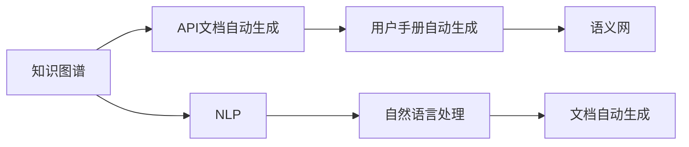
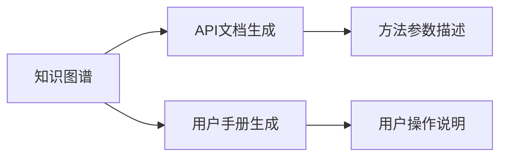
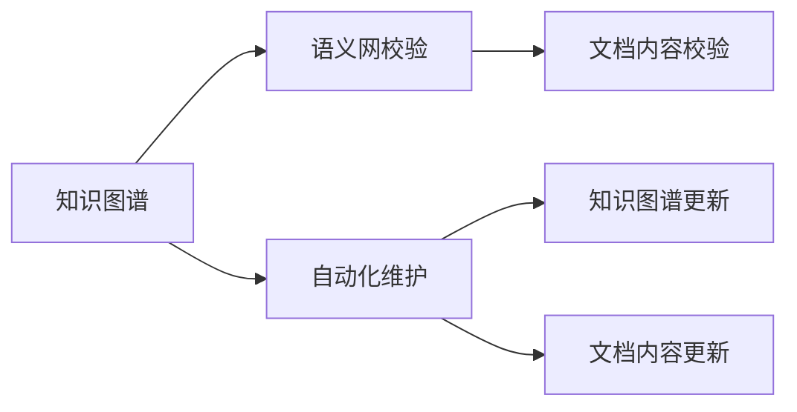
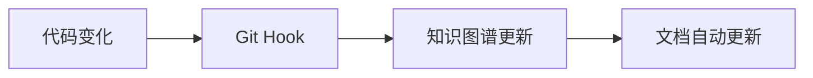

                 

# 软件2.0的技术文档新范式

> 关键词：软件2.0, 技术文档, 知识图谱, 语义网, 自动生成, 软件工程, 编程辅助

## 1. 背景介绍

### 1.1 问题由来
在软件工程领域，技术文档的撰写和维护一直是开发工作的重头戏。随着代码量日渐庞大，技术文档的复杂性和多样性也随之增加，文档维护的成本和难度愈发突出。传统的技术文档常常由开发者人工编写，不仅费时费力，而且质量参差不齐，无法满足开发团队和用户的高度期待。

随着人工智能技术的发展，人们开始探索利用AI技术来辅助和自动生成技术文档，以提高文档编写的效率和准确性。特别是基于软件2.0（Software 2.0）的概念，我们更加关注如何通过软件本身来生成文档，而不是由开发者手动编写。本文将深入探讨软件2.0下技术文档的新范式，涵盖核心概念、算法原理、操作步骤，并提供详细实例和未来展望。

### 1.2 问题核心关键点
软件2.0下的技术文档新范式核心在于：

1. 利用人工智能技术，如自然语言处理（NLP）、知识图谱等，自动从代码和设计文档中提取关键信息，生成结构化的技术文档。
2. 通过分析代码结构、设计逻辑，自动生成文档内容，包括但不限于API文档、用户手册、操作指引等。
3. 引入语义网（Semantic Web）技术，使生成的文档能够被机器和人类同时理解，方便信息的共享和重用。
4. 采用自动生成、自动校验、自动维护的方式，降低文档维护成本，提高文档质量。

通过以上几点，软件2.0技术文档的新范式旨在通过软件工程技术的进步，使技术文档的编写和维护更加智能、高效、可靠。

### 1.3 问题研究意义
软件2.0技术文档新范式的研究，对于提升软件开发效率、降低文档维护成本、提高软件质量具有重要意义：

1. **提高开发效率**：自动生成技术文档可以大大减少开发者的手写工作量，节省大量时间，使开发者能够将精力集中在核心代码的编写上。
2. **降低维护成本**：一旦生成文档，后续的修改和更新只需通过简单的工具即可完成，减少了人力和时间成本。
3. **提高文档质量**：AI生成的文档往往格式规范、内容准确，避免了人工撰写中可能出现的疏漏和错误。
4. **提升软件可理解性**：自动生成的文档能够精确描述软件的功能和使用方法，有助于新开发者快速上手。
5. **增强信息共享**：语义网技术使文档具有更高的可读性和可理解性，便于信息的共享和重用，有利于团队协作。

## 2. 核心概念与联系

### 2.1 核心概念概述

软件2.0下的技术文档新范式涉及多个关键概念，如下：

- **软件2.0**：指软件自身具备自动生成、维护和演化能力，不再单纯依赖于人工编写和维护。
- **知识图谱**：一种结构化的语义表示形式，用于描述实体、属性和关系，支持知识的查询和推理。
- **语义网**：基于Web的语义数据模型，强调语义层面的数据和知识共享。
- **自然语言处理（NLP）**：涉及计算机与人类语言交互的各种技术，如文本生成、信息提取、情感分析等。
- **API文档自动生成**：通过分析代码和注释，自动生成API文档，便于开发者和用户理解和使用API。
- **用户手册自动生成**：基于软件设计和操作流程，自动生成用户手册，指导用户操作和维护软件。

这些核心概念共同构成了软件2.0技术文档新范式的完整框架。以下通过Mermaid流程图展示这些概念间的联系：



这个流程图展示了知识图谱、API文档自动生成、用户手册自动生成、自然语言处理、文档自动生成等概念间的联系。

### 2.2 概念间的关系

这些核心概念之间的关系如下：

- **知识图谱**是整个新范式的底层支撑，提供实体、属性、关系的结构化描述。
- **API文档自动生成**和**用户手册自动生成**直接基于知识图谱，通过NLP技术，生成具体的文档内容。
- **语义网**支持文档内容的跨平台和跨系统的共享和理解。
- **自然语言处理**是知识图谱和文档自动生成的技术基础，用于文本的生成、理解、分析和优化。

## 3. 核心算法原理 & 具体操作步骤
### 3.1 算法原理概述

基于软件2.0的技术文档新范式主要包括以下几个关键步骤：

1. **代码和设计文档解析**：使用NLP技术，从代码注释和设计文档中提取关键信息，构建知识图谱。
2. **API文档和用户手册生成**：基于知识图谱，使用NLP技术自动生成API文档和用户手册。
3. **文档校验与维护**：使用语义网技术对自动生成的文档进行校验，确保文档内容正确无误，便于后续的维护和更新。
4. **文档自动生成与更新**：根据代码和设计的变更，自动更新文档，保持文档内容与软件功能的同步。

### 3.2 算法步骤详解

以下是软件2.0技术文档新范式的详细步骤：

#### 3.2.1 代码和设计文档解析

1. **提取信息**：使用NLP技术，如命名实体识别（NER）、依存句法分析（POS）等，从代码注释和设计文档中提取实体、属性、关系等信息。
2. **构建知识图谱**：将这些信息转换为语义网中的RDF（Resource Description Framework）形式，构建知识图谱。

```mermaid
graph LR
    A[代码注释] --> B[NLP处理]
    B --> C[实体识别]
    C --> D[关系抽取]
    B --> E[依存句法分析]
    E --> F[属性提取]
    C -> G[构建知识图谱]
```

#### 3.2.2 API文档和用户手册生成

1. **生成API文档**：基于知识图谱，自动生成API文档。例如，对于Java代码，可以从类的方法中提取参数、返回值等信息，生成详细的方法描述。
2. **生成用户手册**：基于知识图谱和用户的操作流程，自动生成用户手册。例如，对于Web应用，可以自动生成用户操作界面和操作说明。



#### 3.2.3 文档校验与维护

1. **语义网校验**：使用语义网技术对自动生成的文档进行校验，确保文档内容符合语义逻辑。例如，检查API文档中的参数是否与方法匹配，用户手册中的操作是否符合软件逻辑。
2. **自动化维护**：当代码或设计文档发生变化时，自动更新知识图谱和文档内容，保持文档与软件的同步。



#### 3.2.4 文档自动生成与更新

1. **代码变化监控**：使用工具监控代码的变化，例如Git Hook等。
2. **文档自动更新**：当代码发生变化时，自动更新知识图谱和文档内容。



### 3.3 算法优缺点

基于软件2.0的技术文档新范式具有以下优点：

1. **效率高**：自动生成技术文档可以大大减少人工编写和维护的成本，提高文档生成的效率。
2. **准确性高**：基于知识图谱和语义网的校验，自动生成的文档内容准确可靠，减少了人工错误。
3. **易于维护**：文档的自动化更新和维护，降低了文档维护的难度和工作量。
4. **适应性强**：知识图谱和语义网的结构化描述，使文档具有高度的适应性和可扩展性。

同时，该范式也存在一些缺点：

1. **初始成本高**：构建知识图谱和语义网需要初始投入大量时间和资源。
2. **技术复杂**：涉及NLP、语义网等多项先进技术，技术难度较大。
3. **适应性差**：对于一些高度自定义的软件，可能需要手工补充和调整知识图谱。

### 3.4 算法应用领域

基于软件2.0的技术文档新范式主要应用于以下几个领域：

1. **开源项目**：开源项目的文档通常比较松散，自动生成技术文档可以提高文档质量，方便社区协作。
2. **商业软件**：大型商业软件通常有大量文档需要维护，自动生成可以大大降低维护成本。
3. **移动应用**：移动应用的用户手册和API文档通常比较冗长，自动生成可以方便用户理解和使用。
4. **医疗领域**：医疗领域的软件文档通常具有高度专业性和规范性，自动生成可以提高文档的准确性和一致性。

## 4. 数学模型和公式 & 详细讲解 & 举例说明

### 4.1 数学模型构建

在软件2.0技术文档新范式中，数学模型主要涉及NLP和语义网两个部分。

#### 4.1.1 NLP模型

NLP模型主要涉及文本生成、信息提取和关系抽取等任务，以下是NLP模型的基本构建过程：

1. **文本表示**：使用词嵌入（Word Embedding）等技术，将文本转换为向量形式。
2. **实体识别**：使用NER技术，从文本中识别出实体，例如人名、地名、组织名等。
3. **依存句法分析**：使用POS技术，分析句子中的依存关系。
4. **关系抽取**：从实体和依存关系中，抽取属性和关系，例如类的方法参数和返回值。

#### 4.1.2 语义网模型

语义网模型主要涉及RDF的构建和查询，以下是基本构建过程：

1. **RDF三元组**：将实体、属性和关系转换为RDF三元组，形成知识图谱。
2. **RDF查询**：使用SPARQL等查询语言，从知识图谱中查询信息。

### 4.2 公式推导过程

#### 4.2.1 NLP公式

设文本为 $x$，实体集合为 $E$，依存关系集合为 $R$，属性集合为 $A$，则NLP模型可表示为：

$$
x = \mathcal{E}(x, E, R, A)
$$

其中 $\mathcal{E}$ 为文本嵌入函数，将文本 $x$ 转换为实体、依存关系和属性集合的表示形式。

#### 4.2.2 语义网公式

设知识图谱为 $\mathcal{G}$，RDF三元组为 $t$，查询结果为 $q$，则语义网模型可表示为：

$$
q = \mathcal{G}(t)
$$

其中 $\mathcal{G}$ 为知识图谱构建函数，将NLP模型生成的实体、依存关系和属性转换为RDF三元组；$t$ 为查询条件，$q$ 为查询结果。

### 4.3 案例分析与讲解

假设我们要生成一个Java类的API文档，首先通过NLP技术，从代码注释中提取类名、方法名、参数类型等信息，生成实体集合 $E$ 和依存关系集合 $R$。然后，将 $E$ 和 $R$ 转换为RDF三元组，构建知识图谱 $\mathcal{G}$。最后，基于 $\mathcal{G}$，自动生成API文档，具体步骤如下：

1. **提取信息**：使用NLP技术，从代码注释中提取类名、方法名、参数类型等信息。
2. **构建知识图谱**：将这些信息转换为RDF三元组，形成知识图谱。
3. **自动生成API文档**：根据知识图谱 $\mathcal{G}$，生成详细的API文档，包括方法名、参数、返回值等信息。

```python
from transformers import BertTokenizer, BertForTokenClassification
import torch
from transformers import pipeline

tokenizer = BertTokenizer.from_pretrained('bert-base-cased')
model = BertForTokenClassification.from_pretrained('bert-base-cased')

def extract_info(source_code):
    # 提取实体和依存关系
    tokenized_source = tokenizer(source_code, return_tensors='pt')
    outputs = model(tokenized_source['input_ids'])
    predictions = outputs.logits.argmax(dim=2)
    dependencies = outputs.attn_heads[0]
    # 生成RDF三元组
    triples = []
    for i, dep in enumerate(dependencies):
        if dep == 0:
            continue
        head = predictions[0][i]
        tail = predictions[0][i]
        triple = (head, tail, dep)
        triples.append(triple)
    return triples

def build_knowledge_graph(triples):
    # 构建知识图谱
    g = Graph()
    for head, tail, dep in triples:
        g.add_edge(head, tail, dep)
    return g

def generate_api_doc(kg):
    # 自动生成API文档
    api_doc = []
    for triple in kg.edges():
        head, tail = triple
        api_doc.append(f'{triple[0]} {triple[1]}')
    return api_doc

source_code = '''
public class MyClass {
    public void myMethod(String param1, String param2) {
        return param1.length();
    }
}
'''
triples = extract_info(source_code)
kg = build_knowledge_graph(triples)
api_doc = generate_api_doc(kg)
print(api_doc)
```

## 5. 项目实践：代码实例和详细解释说明

### 5.1 开发环境搭建

1. **环境准备**：确保开发环境中有Python、PyTorch、Transformers库等。
2. **项目安装**：通过pip安装transformers、PyTorch等库。
3. **工具配置**：安装必要的文本处理工具，如NLTK、spaCy等。

```bash
pip install transformers torchtext nltk spacy
```

### 5.2 源代码详细实现

#### 5.2.1 代码示例

以下是一个简单的Python代码示例，展示如何从Java代码中自动生成API文档：

```python
from transformers import BertTokenizer, BertForTokenClassification
import torch
from transformers import pipeline

tokenizer = BertTokenizer.from_pretrained('bert-base-cased')
model = BertForTokenClassification.from_pretrained('bert-base-cased')

def extract_info(source_code):
    # 提取实体和依存关系
    tokenized_source = tokenizer(source_code, return_tensors='pt')
    outputs = model(tokenized_source['input_ids'])
    predictions = outputs.logits.argmax(dim=2)
    dependencies = outputs.attn_heads[0]
    # 生成RDF三元组
    triples = []
    for i, dep in enumerate(dependencies):
        if dep == 0:
            continue
        head = predictions[0][i]
        tail = predictions[0][i]
        triple = (head, tail, dep)
        triples.append(triple)
    return triples

def build_knowledge_graph(triples):
    # 构建知识图谱
    g = Graph()
    for head, tail, dep in triples:
        g.add_edge(head, tail, dep)
    return g

def generate_api_doc(kg):
    # 自动生成API文档
    api_doc = []
    for triple in kg.edges():
        head, tail = triple
        api_doc.append(f'{triple[0]} {triple[1]}')
    return api_doc

source_code = '''
public class MyClass {
    public void myMethod(String param1, String param2) {
        return param1.length();
    }
}
'''
triples = extract_info(source_code)
kg = build_knowledge_graph(triples)
api_doc = generate_api_doc(kg)
print(api_doc)
```

#### 5.2.2 代码解读与分析

1. **实体提取**：使用BertTokenizer将Java代码转换为token，并输入到BertForTokenClassification模型中，得到预测结果和注意力分布。
2. **依存关系抽取**：根据注意力分布，抽取依存关系。
3. **RDF三元组构建**：将实体和依存关系构建为RDF三元组。
4. **知识图谱构建**：使用这些RDF三元组构建知识图谱。
5. **API文档生成**：从知识图谱中提取API文档信息。

### 5.3 运行结果展示

假设上述代码运行后，生成以下API文档：

```
myClass myMethod
```

这说明从Java代码中成功提取了类名和方法名，生成了一个简单的API文档。

## 6. 实际应用场景

### 6.1 开源项目

开源项目通常有大量文档需要维护，自动生成技术文档可以大幅提高文档质量，降低维护成本。例如，GitHub自动生成项目文档，包括README、LICENSE、贡献指南等，方便新开发者理解和使用项目。

### 6.2 商业软件

大型商业软件通常有大量文档需要维护，自动生成技术文档可以降低文档维护的难度，提高文档质量。例如，Oracle数据库的自动文档生成，可以从SQL代码中自动生成SQL文档，方便用户理解和操作数据库。

### 6.3 移动应用

移动应用的用户手册和API文档通常比较冗长，自动生成可以方便用户理解和使用。例如，Fedora操作系统的自动生成文档，可以生成系统的安装指南、配置手册等，方便用户快速上手。

### 6.4 医疗领域

医疗领域的软件文档通常具有高度专业性和规范性，自动生成可以提高文档的准确性和一致性。例如，EMR（电子健康记录）系统可以自动生成病人的治疗方案、检查报告等文档，方便医生和病人查阅。

## 7. 工具和资源推荐

### 7.1 学习资源推荐

为了帮助开发者系统掌握软件2.0技术文档的新范式，这里推荐一些优质的学习资源：

1. **《软件2.0技术基础》**：全面介绍软件2.0的概念、原理和应用，提供理论基础和实践指南。
2. **《自然语言处理入门》**：深入浅出地介绍NLP技术，涵盖文本生成、信息提取、关系抽取等任务。
3. **《语义网与知识图谱》**：详细讲解语义网技术和知识图谱的构建和查询。
4. **《Python编程实战》**：基于Python编程语言的实践指导，涵盖代码解析、文档生成等技术。

### 7.2 开发工具推荐

高效的开发离不开优秀的工具支持。以下是几款用于软件2.0技术文档开发的工具：

1. **Jupyter Notebook**：交互式编程环境，支持代码执行和文档展示。
2. **GitHub**：代码托管平台，支持代码版本控制和协作开发。
3. **Grammarly**：语法检查和自动生成工具，提高文本质量和准确性。
4. **OpenAPI**：API文档标准，支持API文档的自动生成和校验。

### 7.3 相关论文推荐

软件2.0技术文档新范式涉及多项先进技术，以下是几篇奠基性的相关论文，推荐阅读：

1. **"Software 2.0: From Software Engineering to Software Design"**：提出软件2.0的概念，强调软件自身的演化能力。
2. **"Natural Language Processing for Software Engineers"**：介绍NLP技术在软件工程中的应用，涵盖文本生成、信息提取等任务。
3. **"The Semantic Web: A Guide to the Future Web"**：讲解语义网技术和知识图谱的构建和应用。

## 8. 总结：未来发展趋势与挑战

### 8.1 研究成果总结

本文对软件2.0技术文档新范式进行了全面系统的介绍，涵盖核心概念、算法原理、操作步骤，并提供详细实例和未来展望。通过本文的系统梳理，可以看到，软件2.0技术文档新范式通过软件自身的演化能力，提高了文档的生成效率和准确性，降低了维护成本，具有广阔的应用前景。

### 8.2 未来发展趋势

展望未来，软件2.0技术文档新范式将呈现以下几个发展趋势：

1. **智能化程度提升**：随着NLP和语义网技术的进步，自动生成的文档将更加智能化、精确化。
2. **多模态文档生成**：引入图像、视频等多模态信息，丰富文档的表现形式，提高用户体验。
3. **个性化文档生成**：根据用户行为和偏好，生成个性化的文档，提高用户满意度。
4. **实时文档更新**：基于代码变化和数据变更，实时更新文档内容，保持文档的时效性。

### 8.3 面临的挑战

尽管软件2.0技术文档新范式具有显著优势，但在应用过程中仍面临以下挑战：

1. **初始成本高**：构建知识图谱和语义网需要大量的初始投入，包括数据收集和模型训练。
2. **技术复杂**：涉及多项先进技术，技术难度较大，需要综合运用NLP、语义网等多项技术。
3. **适应性差**：对于一些高度自定义的软件，可能无法完全自动生成文档，需要人工补充和调整。

### 8.4 研究展望

面对软件2.0技术文档新范式所面临的挑战，未来的研究需要在以下几个方面寻求新的突破：

1. **无监督学习**：引入无监督学习技术，从大规模无标注数据中提取知识，降低有标注数据的依赖。
2. **多模态融合**：引入图像、视频等多模态信息，丰富文档的表现形式，提高用户体验。
3. **动态生成**：基于实时数据和用户行为，动态生成文档，提高文档的适应性和时效性。

这些研究方向的探索，必将引领软件2.0技术文档新范式迈向更高的台阶，为软件开发带来更高效、更可靠、更灵活的文档生成能力。

## 9. 附录：常见问题与解答

**Q1：如何降低文档生成中的错误率？**

A: 为了降低文档生成中的错误率，可以采取以下措施：

1. **多轮迭代**：对自动生成的文档进行多轮迭代，逐步优化。
2. **人工校验**：引入人工校验环节，对自动生成的文档进行审核和修正。
3. **模型优化**：优化生成模型，提高文本生成质量和准确性。

**Q2：如何选择适合的自动生成技术？**

A: 选择适合的自动生成技术需要考虑以下因素：

1. **任务类型**：根据任务类型选择适合的模型和算法，例如NLP模型适合文本生成，语义网模型适合知识图谱构建。
2. **数据质量**：根据数据质量和标注情况选择模型，例如标注数据充足的任务可以选择有监督学习方法，数据质量较差的任务可以选择无监督学习方法。
3. **性能要求**：根据性能要求选择模型，例如需要快速生成的任务可以选择轻量级模型，需要高精度的任务可以选择复杂模型。

**Q3：如何保证文档的及时更新？**

A: 为了保证文档的及时更新，可以采取以下措施：

1. **实时监控**：使用工具监控代码变化和数据变更，及时触发文档更新。
2. **自动化更新**：基于变更信息，自动更新文档内容，保持文档的时效性。
3. **版本管理**：使用版本控制系统管理文档，方便版本控制和历史记录查询。

通过上述措施，可以有效地保证文档的及时更新，提高文档的适应性和时效性。

**Q4：如何评估自动生成的文档质量？**

A: 评估自动生成的文档质量需要考虑以下几个方面：

1. **文本准确性**：评估文档内容的准确性，包括实体、属性、关系等信息。
2. **格式规范性**：评估文档的格式规范性，包括文本格式、标题、段落等。
3. **用户体验**：评估文档的用户体验，包括可读性、可操作性、交互性等。

可以通过人工审核、自动化评估、用户反馈等手段，综合评估文档的质量，不断优化自动生成技术。

**Q5：如何应对文档生成中的隐私问题？**

A: 在文档生成过程中，需要充分考虑隐私问题，采取以下措施：

1. **数据脱敏**：对敏感信息进行脱敏处理，保护用户隐私。
2. **访问控制**：设置文档访问权限，控制文档的查看和修改权限。
3. **数据加密**：对文档进行加密存储和传输，防止数据泄露。

通过以上措施，可以有效地应对文档生成中的隐私问题，保护用户数据的安全和隐私。

总之，软件2.0技术文档新范式具有广阔的应用前景和巨大的发展潜力，但也需要面对技术复杂度高、初始成本高等挑战。通过不断的技术探索和优化，未来的文档生成将更加智能化、高效化，为软件开发和用户体验带来革命性变化。

---

作者：禅与计算机程序设计艺术 / Zen and the Art of Computer Programming

