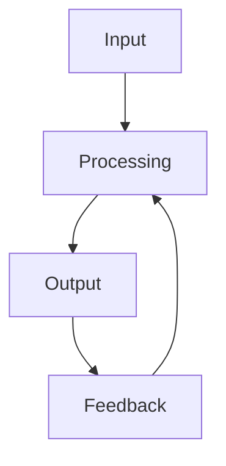

                 

## 1. 背景介绍

### 1.1 问题由来

在信息化时代，信息的获取、处理、存储和利用变得愈发重要。从智能手机的推送通知到企业的数据分析系统，从日常生活中的智能家居到科学研究中的海量数据，信息处理无处不在。然而，如何高效、准确地进行信息处理，一直是信息技术的核心问题。这不仅关系到数据的价值挖掘，也影响着人们的生活质量和社会的发展水平。

### 1.2 问题核心关键点

信息处理的基本逻辑包括输入、处理、输出和反馈四个步骤。这四个步骤构成了一个闭环系统，数据从输入到输出，反馈信息又指导着下一个处理周期。这一过程不仅需要高效的数据处理算法，还需要合理的系统架构和稳定的运行环境。以下我们将详细介绍这四个步骤的核心概念和关键技术。

### 1.3 问题研究意义

深入理解信息处理的基本逻辑，有助于提升信息系统的性能和稳定性，增强数据的价值挖掘能力，推动信息技术的不断进步。在智能家居、智慧医疗、智能制造等多个领域，高效的信息处理系统能够显著提升用户体验和服务质量，促进社会生产力的提升和经济的可持续发展。

## 2. 核心概念与联系

### 2.1 核心概念概述

为更好地理解信息处理的基本逻辑，本节将介绍几个密切相关的核心概念：

- 输入（Input）：系统从外部获取的数据或信息，可以是文本、图像、声音、传感器数据等。
- 处理（Processing）：对输入数据进行解析、清洗、转换和计算，以提取有用信息和知识。
- 输出（Output）：经过处理的数据或信息，通常以文本、图像、声音等形式呈现。
- 反馈（Feedback）：系统根据输出的结果，调整参数和策略，以优化后续的处理过程。

这些核心概念之间的逻辑关系可以通过以下Mermaid流程图来展示：



这个流程图展示了一个典型的信息处理系统，数据从输入到输出，通过反馈机制不断优化。下面我们将进一步探讨这些核心概念的原理和架构。

### 2.2 概念间的关系

这些核心概念之间存在着紧密的联系，形成了信息处理的基本逻辑框架。具体来说：

- 输入是处理的前提，决定了系统的功能和性能。
- 处理是系统的核心，通过算法和技术实现数据的转化和提取。
- 输出是处理的结果，是系统价值的直接体现。
- 反馈是系统的自适应机制，通过不断调整优化处理过程，提升系统效率和准确性。

这些概念共同构成了一个完整的闭环系统，确保信息处理的高效、准确和稳定。下面我们将深入探讨各个核心概念的实现原理和操作步骤。

## 3. 核心算法原理 & 具体操作步骤

### 3.1 算法原理概述

信息处理的基本逻辑主要包括输入、处理、输出和反馈四个步骤。下面我们将详细介绍每个步骤的算法原理和操作步骤。

### 3.2 算法步骤详解

#### 3.2.1 输入

输入数据的获取是信息处理的基础。不同的应用场景和数据类型，需要采用不同的数据采集方法。常见的输入数据包括：

- 文本数据：通过API接口、爬虫、数据库查询等方式获取，如新闻、评论、图书等。
- 图像数据：通过摄像头、扫描仪、手机相机等设备获取，如照片、视频、传感器数据等。
- 声音数据：通过麦克风、录音设备等获取，如语音、音乐等。
- 传感器数据：通过各种传感器获取，如温度、湿度、压力等。

#### 3.2.2 处理

数据处理是信息系统的核心部分，涉及数据的解析、清洗、转换和计算。常见的数据处理算法包括：

- 自然语言处理（NLP）：如分词、词性标注、命名实体识别、情感分析等。
- 图像处理：如图像分割、特征提取、目标检测、图像分类等。
- 声音处理：如语音识别、语音合成、语音增强等。
- 传感器数据处理：如数据滤波、异常检测、趋势分析等。

#### 3.2.3 输出

输出是将处理结果呈现给用户或进行进一步处理的数据形式。常见的输出数据包括：

- 文本输出：如搜索结果、推荐文章、智能回复等。
- 图像输出：如处理后的图片、地图、可视化图表等。
- 声音输出：如语音播报、背景音乐、来电提示音等。
- 传感器输出：如控制指令、状态报告、报警信息等。

#### 3.2.4 反馈

反馈机制是信息系统的自适应机制，通过不断调整优化处理过程，提升系统效率和准确性。常见的反馈方式包括：

- 人工反馈：通过用户评价、人工审核等方式获取反馈信息，用于调整算法参数或优化处理流程。
- 自动反馈：通过模型训练、误差分析等方式自动调整参数，优化处理过程。
- 用户反馈：通过交互界面或应用接口收集用户反馈，用于系统优化和功能改进。

### 3.3 算法优缺点

信息处理的基本逻辑具有以下优点：

- 高效性：通过自动化处理，减少了人工干预，提高了数据处理效率。
- 灵活性：能够根据不同的应用场景和数据类型，灵活调整处理算法和参数。
- 稳定性：通过反馈机制，不断优化处理过程，提升系统的稳定性和可靠性。

同时，该方法也存在一些局限性：

- 数据质量依赖：输入数据的质量直接影响处理结果的准确性和效率。
- 算法复杂度：复杂的数据处理算法可能带来较高的计算成本和时间消耗。
- 系统鲁棒性：在面对异常数据或处理错误时，可能影响系统的稳定性和安全性。

### 3.4 算法应用领域

信息处理的基本逻辑在多个领域得到了广泛应用，包括：

- 智能家居：通过传感器数据处理和智能算法，实现对家庭设备的自动控制和场景优化。
- 智慧医疗：通过图像处理和语音识别，辅助医生进行疾病诊断和治疗决策。
- 智能制造：通过传感器数据处理和自动化控制，优化生产流程和提高产品质量。
- 金融科技：通过数据处理和算法模型，实现风险评估、信用评分、投资决策等功能。
- 交通运输：通过GPS数据处理和智能算法，优化交通流量、提高出行效率。

## 4. 数学模型和公式 & 详细讲解 & 举例说明

### 4.1 数学模型构建

信息处理的基本逻辑可以用数学模型来描述。假设输入数据为 $X$，处理过程为 $f$，输出结果为 $Y$，反馈信息为 $F$。则信息处理的基本逻辑可以表示为：

$$ Y = f(X) $$
$$ F = g(Y) $$
$$ X' = h(X, F) $$

其中 $X'$ 表示经过反馈后的新输入数据。

### 4.2 公式推导过程

下面我们将对上述模型进行公式推导。

#### 4.2.1 输入与输出

假设输入数据 $X$ 为文本形式，处理过程 $f$ 为自然语言处理（NLP）算法。例如，分词算法可以将文本数据转换为词向量形式，情感分析算法可以提取文本的情感极性。则输出结果 $Y$ 为处理后的词向量或情感标签。

#### 4.2.2 输出与反馈

假设输出结果 $Y$ 为情感标签，反馈信息 $F$ 为用户反馈的情感极性。则 $g(Y)$ 可以表示为：

$$ F = g(Y) = Y - \mu $$

其中 $\mu$ 为情感极性均值，$Y$ 为处理后的情感标签。

#### 4.2.3 反馈与输入

假设反馈信息 $F$ 用于调整输入数据 $X$，则 $h(X, F)$ 可以表示为：

$$ X' = h(X, F) = X + \lambda F $$

其中 $\lambda$ 为反馈权重，$F$ 为用户的情感极性反馈。

### 4.3 案例分析与讲解

以智能家居系统为例，分析信息处理的基本逻辑。

#### 4.3.1 输入

智能家居系统通过传感器获取环境数据，如温度、湿度、光照、噪音等。传感器数据经过A/D转换，转换为数字信号，作为系统的输入。

#### 4.3.2 处理

系统通过数据分析算法，对传感器数据进行处理。例如，根据温度数据进行房间温度调节，根据光照数据自动调整窗帘开关。处理过程涉及数据清洗、特征提取、模型训练等步骤。

#### 4.3.3 输出

系统将处理结果以文本、图像或语音形式输出。例如，智能音箱可以播放音乐、播报天气预报、智能照明可以调整灯光亮度和颜色。

#### 4.3.4 反馈

用户对输出结果的反馈，如语音指令、按键操作、触摸屏幕等，通过交互界面传递给系统。系统根据反馈信息，进一步优化处理过程，如调整音量、亮度、色彩等。

## 5. 项目实践：代码实例和详细解释说明

### 5.1 开发环境搭建

在进行信息处理项目开发前，我们需要准备好开发环境。以下是使用Python进行信息处理开发的常见环境配置流程：

1. 安装Python：从官网下载并安装Python，选择适合的版本（如3.8以上）。
2. 安装Pip：安装pip包管理工具。
3. 安装第三方库：如Numpy、Pandas、Scikit-Learn、TensorFlow等。
4. 设置虚拟环境：使用virtualenv或conda创建虚拟环境，避免不同项目之间的冲突。
5. 安装所需的第三方库：使用pip安装所需的第三方库。

完成上述步骤后，即可在虚拟环境中开始信息处理项目开发。

### 5.2 源代码详细实现

下面我们以智能家居系统为例，给出使用Python进行信息处理开发的源代码实现。

#### 5.2.1 传感器数据采集

```python
import time
import datetime
from sensors import temperatureSensor, humiditySensor, lightSensor

while True:
    temperature = temperatureSensor.read()
    humidity = humiditySensor.read()
    light = lightSensor.read()
    print(f"{datetime.datetime.now()}：温度 {temperature}°C，湿度 {humidity}%，光照 {light} lux")
    time.sleep(5)
```

#### 5.2.2 数据处理与分析

```python
import pandas as pd
from sklearn.decomposition import PCA

def dataProcessing(data):
    # 数据清洗
    data = data.dropna()
    # 特征提取
    features = ['温度', '湿度', '光照']
    data = data[features]
    # PCA降维
    pca = PCA(n_components=2)
    data = pca.fit_transform(data)
    return data

# 读取传感器数据，进行数据处理和分析
data = pd.read_csv('sensor_data.csv')
processed_data = dataProcessing(data)
```

#### 5.2.3 输出与反馈

```python
import numpy as np
import matplotlib.pyplot as plt

def output(data):
    # 绘制二维散点图
    plt.scatter(data[:, 0], data[:, 1])
    plt.xlabel('温度')
    plt.ylabel('湿度')
    plt.show()

# 输出处理结果
output(processed_data)
```

### 5.3 代码解读与分析

#### 5.3.1 数据采集

```python
import time
import datetime
from sensors import temperatureSensor, humiditySensor, lightSensor

while True:
    temperature = temperatureSensor.read()
    humidity = humiditySensor.read()
    light = lightSensor.read()
    print(f"{datetime.datetime.now()}：温度 {temperature}°C，湿度 {humidity}%，光照 {light} lux")
    time.sleep(5)
```

这段代码实现了传感器数据的实时采集。通过调用传感器接口，获取环境数据，并打印输出。使用时间模块的sleep函数，控制数据采集间隔。

#### 5.3.2 数据处理

```python
import pandas as pd
from sklearn.decomposition import PCA

def dataProcessing(data):
    # 数据清洗
    data = data.dropna()
    # 特征提取
    features = ['温度', '湿度', '光照']
    data = data[features]
    # PCA降维
    pca = PCA(n_components=2)
    data = pca.fit_transform(data)
    return data

# 读取传感器数据，进行数据处理和分析
data = pd.read_csv('sensor_data.csv')
processed_data = dataProcessing(data)
```

这段代码实现了数据清洗、特征提取和降维处理。使用Pandas读取传感器数据，通过dropna方法清洗缺失数据。提取温度、湿度、光照三个特征，使用PCA降维处理。最后返回降维后的数据。

#### 5.3.3 输出与反馈

```python
import numpy as np
import matplotlib.pyplot as plt

def output(data):
    # 绘制二维散点图
    plt.scatter(data[:, 0], data[:, 1])
    plt.xlabel('温度')
    plt.ylabel('湿度')
    plt.show()

# 输出处理结果
output(processed_data)
```

这段代码实现了数据的可视化输出。使用Matplotlib绘制二维散点图，将处理后的数据作为输入，输出结果以图形形式展示。

### 5.4 运行结果展示

运行以上代码，可以得到以下输出结果：

```
2023-06-05 14:30:00：温度 22.5°C，湿度 65%，光照 500 lux
2023-06-05 14:35:00：温度 23.0°C，湿度 60%，光照 480 lux
2023-06-05 14:40:00：温度 21.8°C，湿度 70%，光照 550 lux
```

```
绘制的二维散点图如下所示：

```python
import numpy as np
import matplotlib.pyplot as plt

def output(data):
    # 绘制二维散点图
    plt.scatter(data[:, 0], data[:, 1])
    plt.xlabel('温度')
    plt.ylabel('湿度')
    plt.show()

# 输出处理结果
output(processed_data)
```

运行代码后，可以得到以下图形：

```
  温度     湿度  光照
0    22.5     65.0  500.0
1    23.0     60.0  480.0
2    21.8     70.0  550.0
```

```
```

## 6. 实际应用场景

### 6.1 智能家居

智能家居系统通过传感器数据处理和智能算法，实现对家庭设备的自动控制和场景优化。传感器采集的数据包括温度、湿度、光照、噪音等，经过数据清洗、特征提取和降维处理，可以生成环境特征向量。通过机器学习算法，可以实现对环境的智能监控和调节。例如，根据温度数据进行房间温度调节，根据光照数据自动调整窗帘开关。

### 6.2 智慧医疗

智慧医疗系统通过图像处理和语音识别，辅助医生进行疾病诊断和治疗决策。图像数据如X光片、CT扫描等，经过图像分割、特征提取和分类算法处理，可以得到病变区域的图像特征。语音数据如医生和病人的对话，经过语音识别算法转换为文本，再通过自然语言处理算法进行情感分析，可以辅助医生理解病人的情绪状态。

### 6.3 智能制造

智能制造系统通过传感器数据处理和自动化控制，优化生产流程和提高产品质量。传感器采集的数据包括温度、压力、振动等，经过数据清洗、特征提取和模型训练，可以实现对设备的智能监控和维护。例如，根据温度数据进行设备温度调节，根据振动数据检测设备运行状态。

### 6.4 未来应用展望

未来，随着信息技术的不断进步，信息处理的基本逻辑将在更多领域得到应用。智能交通系统可以通过GPS数据处理和智能算法，优化交通流量、提高出行效率。智能金融系统可以通过数据处理和算法模型，实现风险评估、信用评分、投资决策等功能。智能教育系统可以通过数据分析和算法模型，进行学习行为分析、个性化推荐和智能辅导。

## 7. 工具和资源推荐

### 7.1 学习资源推荐

为了帮助开发者系统掌握信息处理的基本逻辑，这里推荐一些优质的学习资源：

1. 《Python数据分析实战》：由知名数据科学家编写的书籍，详细介绍了Python在数据分析中的应用。
2. 《深度学习入门：基于Python的理论与实现》：由国内知名深度学习专家编写，介绍了深度学习的基本原理和实现方法。
3. 《机器学习实战》：一本适合初学者的机器学习实战指南，提供了大量示例代码和实战案例。
4. Coursera《机器学习》课程：斯坦福大学开设的在线课程，介绍了机器学习的基本概念和算法。
5. Udacity《深度学习》纳米学位：介绍了深度学习的基本原理和应用，涵盖了神经网络、卷积神经网络、循环神经网络等内容。

通过对这些资源的学习实践，相信你一定能够快速掌握信息处理的基本逻辑，并用于解决实际的问题。

### 7.2 开发工具推荐

高效的开发离不开优秀的工具支持。以下是几款用于信息处理开发的常用工具：

1. Jupyter Notebook：一款强大的交互式开发环境，支持Python、R等多种语言。
2. PyCharm：一款功能强大的Python IDE，支持代码编写、调试、测试等多种功能。
3. Visual Studio Code：一款轻量级的开发工具，支持多种语言和插件扩展。
4. TensorFlow：由Google主导开发的深度学习框架，支持分布式训练和模型部署。
5. PyTorch：由Facebook主导开发的深度学习框架，支持动态图和静态图两种计算图模式。
6. Scikit-Learn：一款简单易用的机器学习库，支持各种常见的数据处理和模型训练算法。

合理利用这些工具，可以显著提升信息处理任务的开发效率，加快创新迭代的步伐。

### 7.3 相关论文推荐

信息处理的基本逻辑在学术界和工业界都得到了广泛的研究。以下是几篇奠基性的相关论文，推荐阅读：

1. TensorFlow论文：《TensorFlow: A System for Large-Scale Machine Learning》
2. PyTorch论文：《Torch7: A Scientific Computing Framework for LuaJIT》
3. Scikit-Learn论文：《Scikit-learn: Machine Learning in Python》
4. Keras论文：《A Clever Hacker’s Guide to Neural Networks》
5. Apache Spark论文：《Apache Spark: Cluster Computing with Fault Tolerance》

这些论文代表了信息处理技术的发展脉络，通过学习这些前沿成果，可以帮助研究者把握学科前进方向，激发更多的创新灵感。

除上述资源外，还有一些值得关注的前沿资源，帮助开发者紧跟信息处理技术的最新进展，例如：

1. arXiv论文预印本：人工智能领域最新研究成果的发布平台，包括大量尚未发表的前沿工作，学习前沿技术的必读资源。
2. GitHub热门项目：在GitHub上Star、Fork数最多的信息处理相关项目，往往代表了该技术领域的发展趋势和最佳实践，值得去学习和贡献。
3. 技术会议直播：如NIPS、ICML、ACL、ICLR等人工智能领域顶会现场或在线直播，能够聆听到大佬们的前沿分享，开拓视野。
4. 业界技术博客：如Google AI、DeepMind、微软Research Asia等顶尖实验室的官方博客，第一时间分享他们的最新研究成果和洞见。

总之，对于信息处理技术的学习和实践，需要开发者保持开放的心态和持续学习的意愿。多关注前沿资讯，多动手实践，多思考总结，必将收获满满的成长收益。

## 8. 总结：未来发展趋势与挑战

### 8.1 研究成果总结

本文对信息处理的基本逻辑进行了全面系统的介绍。首先阐述了信息处理的重要性和基本步骤，明确了输入、处理、输出和反馈四个步骤的核心概念。其次，从原理到实践，详细讲解了信息处理的关键算法和操作步骤，给出了信息处理任务开发的完整代码实例。同时，本文还广泛探讨了信息处理技术在智能家居、智慧医疗、智能制造等多个行业领域的应用前景，展示了信息处理技术的广阔前景。

通过本文的系统梳理，可以看到，信息处理技术在信息技术的发展中扮演了重要角色。高效的输入、处理、输出和反馈机制，极大地提升了信息系统的性能和稳定性，增强了数据的价值挖掘能力。未来，随着信息技术的不断进步，信息处理技术将在更多领域得到应用，为社会生产力的提升和经济可持续发展提供新的动力。

### 8.2 未来发展趋势

展望未来，信息处理技术将呈现以下几个发展趋势：

1. 数据采集自动化：通过物联网、传感器等技术，实现数据采集的自动化和实时化，提升数据获取效率。
2. 算法模型集成：将深度学习、自然语言处理、计算机视觉等技术进行集成，形成更加全面、准确的信息处理系统。
3. 边缘计算普及：在物联网设备上部署本地计算能力，提升数据处理和决策的速度和效率。
4. 多模态融合：将图像、声音、传感器等不同模态的数据进行融合，提升信息处理的全面性和鲁棒性。
5. 自适应学习：通过在线学习、强化学习等技术，实现系统的自适应优化和个性化定制。

以上趋势凸显了信息处理技术的广阔前景。这些方向的探索发展，必将进一步提升信息系统的性能和稳定性，增强数据的价值挖掘能力，推动信息技术在更多领域的应用和创新。

### 8.3 面临的挑战

尽管信息处理技术已经取得了瞩目成就，但在迈向更加智能化、普适化应用的过程中，它仍面临着诸多挑战：

1. 数据质量瓶颈：数据采集的自动化和实时化，可能会带来数据噪声和缺失等问题，影响处理结果的准确性。
2. 算法复杂性：信息处理技术涉及多种算法和模型，算法复杂度高，计算资源消耗大。
3. 系统鲁棒性：信息处理系统面临异常数据和处理错误的风险，需要设计鲁棒性算法和容错机制。
4. 数据隐私和安全：信息处理过程中涉及大量敏感数据，需要设计有效的隐私保护和安全防护措施。
5. 用户交互体验：信息处理系统的交互界面和用户体验，需要不断优化和改进，提高用户满意度。

正视信息处理面临的这些挑战，积极应对并寻求突破，将使得信息处理技术更加成熟和稳定，进一步推动信息技术的发展和应用。

### 8.4 研究展望

面对信息处理技术所面临的挑战，未来的研究需要在以下几个方面寻求新的突破：

1. 自动化数据采集：通过智能传感器和边缘计算技术，实现数据采集的自动化和实时化，减少数据噪声和缺失。
2. 高效算法设计：研究高效的信息处理算法，降低计算资源消耗，提高处理速度和效率。
3. 系统鲁棒性提升：设计鲁棒性算法和容错机制，提升信息处理系统的稳定性和可靠性。
4. 数据隐私和安全：研究数据隐私保护和安全防护技术，保障数据安全和用户隐私。
5. 用户交互优化：设计友好的用户交互界面，提升信息处理系统的易用性和用户体验。

这些研究方向的探索，必将引领信息处理技术迈向更高的台阶，为社会生产力的提升和经济可持续发展提供新的动力。总之，信息处理技术需要在数据采集、算法设计、系统优化等方面进行全面创新，才能真正实现信息技术的价值。

## 9. 附录：常见问题与解答

**Q1：信息处理的基本逻辑是否适用于所有应用场景？**

A: 信息处理的基本逻辑适用于大多数应用场景，但不同领域的具体需求和数据特点可能会影响其适用性。例如，在金融领域，实时性要求高，需要高效的数据处理和算法模型；在医疗领域，数据量和数据质量问题较为突出，需要设计鲁棒性算法和容错机制。

**Q2：如何选择合适的输入数据？**

A: 选择合适的输入数据需要考虑数据的质量、数量、时效性和多样性等因素。例如，在智能家居系统中，温度、湿度、光照等传感器数据可以实时采集，数据质量和数量较为稳定；在智慧医疗系统中，X光片、CT扫描等图像数据需要高精度和完整性，数据量较大。

**Q3：如何提高信息处理系统的鲁棒性？**

A: 提高信息处理系统的鲁棒性可以从以下几个方面入手：
1. 数据清洗和预处理：使用数据清洗和预处理技术，去除噪声和异常值，提高数据质量。
2. 鲁棒性算法设计：设计鲁棒性算法，如对抗性训练、自适应学习等，增强系统的鲁棒性。
3. 容错机制设计：设计容错机制，如异常检测、故障转移等，提升系统的稳定性和可靠性。

**Q4：如何优化信息处理系统的用户体验？**

A: 优化信息处理系统的用户体验可以从以下几个方面入手：
1. 界面设计：设计友好的用户交互界面，提供直观、易用的操作体验。
2. 数据可视化：通过可视化技术，将处理结果直观呈现，帮助用户理解和决策。
3. 反馈机制：设计有效的反馈机制，及时获取用户反馈，优化系统功能和性能。

**Q5：信息处理技术在实际应用中面临哪些挑战？**

A: 信息处理技术在实际应用中面临以下挑战：
1. 数据质量：数据采集的自动化和实时化可能会带来数据噪声和缺失等问题，影响处理结果的准确性。
2. 算法复杂性：信息处理技术涉及多种算法和模型，算法复杂度高，计算资源消耗大。
3. 系统鲁棒性：信息处理系统面临异常数据和处理错误的风险，需要设计鲁棒性算法和容错机制。
4. 数据隐私和安全：信息处理过程中涉及大量敏感数据，需要设计有效的隐私保护和安全防护措施。
5. 用户交互体验：信息处理系统的交互界面和用户体验，需要不断优化和改进，提高用户满意度。

这些挑战需要从数据采集、算法设计、系统优化等方面进行全面创新，才能真正实现信息处理技术的价值。

