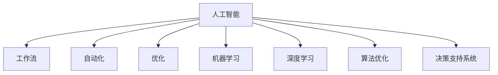
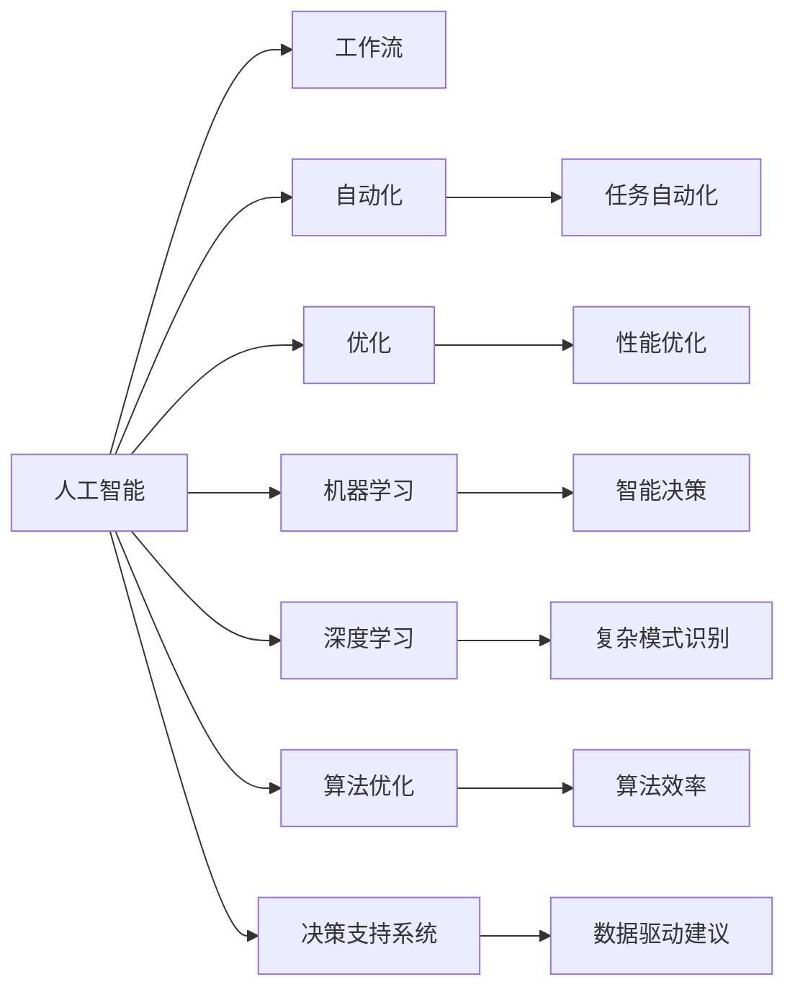
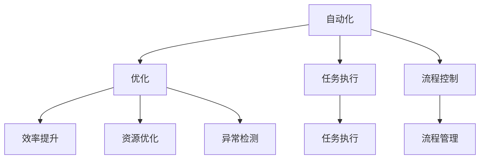
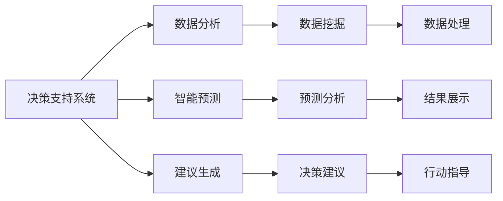
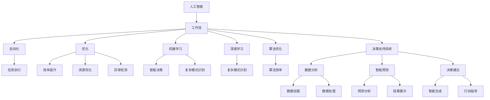

                 

# 重塑AI工作流还是用AI重塑工作流?

> 关键词：
1. 人工智能(AI)
2. 工作流
3. 自动化
4. 优化
5. 机器学习
6. 深度学习
7. 算法优化

## 1. 背景介绍

### 1.1 问题由来
随着人工智能（AI）技术的不断进步，其在各行各业中的应用越来越广泛，从制造业到金融，从医疗到教育，AI无处不在。然而，尽管AI在技术层面取得了显著的突破，但在实际应用中，其工作流（ Workflow）仍然存在诸多挑战和瓶颈。这些问题不仅影响了AI系统的效率和效果，还限制了AI技术的普及和应用。因此，重塑AI工作流（Revolutionizing AI Workflow）或是用AI重塑工作流（Transforming Workflow with AI），已成为当前AI技术发展的关键任务。

### 1.2 问题核心关键点
AI工作流重塑的核心关键点在于如何通过AI技术提升整个工作流程的效率和效果，具体包括以下几个方面：

1. **自动化**：AI可以自动执行重复性高、耗时长的任务，减少人工操作。
2. **优化**：AI可以通过算法优化，提高资源利用率和工作效率。
3. **决策支持**：AI可以提供数据驱动的决策支持，辅助人做出更明智的决策。
4. **个性化**：AI可以根据用户需求，提供个性化的服务和解决方案。
5. **学习与适应**：AI系统能够不断学习和适应新的数据和环境，保持持续改进。

### 1.3 问题研究意义
重塑AI工作流的研究意义在于：

1. **提升效率**：通过AI技术的应用，大幅提升企业运营效率，降低成本。
2. **增强决策**：利用AI提供的数据驱动决策，提升企业竞争力和市场响应速度。
3. **促进创新**：AI技术的引入，为企业带来新的业务模式和创新机会。
4. **优化管理**：AI能够对海量数据进行分析和挖掘，优化资源配置和管理。
5. **提升用户体验**：通过个性化和智能化的服务，提升用户满意度和忠诚度。

## 2. 核心概念与联系

### 2.1 核心概念概述

为了更好地理解重塑AI工作流，本节将介绍几个密切相关的核心概念：

- **人工智能**：指利用计算机模拟人类智能，实现各种应用的技术。
- **工作流**：指一个或多个相互依赖的自动化步骤组成的流程，通常用于完成特定的任务或目标。
- **自动化**：指通过软件或硬件，自动执行某一特定任务或流程。
- **优化**：指通过算法或技术手段，提高系统性能和效率。
- **机器学习**：指通过数据训练算法，使计算机系统具备识别、预测和决策能力。
- **深度学习**：指通过多层神经网络实现复杂模式识别和决策的技术。
- **算法优化**：指对算法进行优化，以提高其性能和效率。
- **决策支持系统**：指利用AI技术提供数据驱动的决策建议。

这些核心概念之间的逻辑关系可以通过以下Mermaid流程图来展示：



这个流程图展示了大语言模型微调过程中各个核心概念之间的关系：

1. 人工智能通过工作流自动化、优化、机器学习和深度学习等技术手段，提升系统效率和效果。
2. 自动化和优化是提高工作流效率的基础。
3. 机器学习和深度学习是实现智能化决策的核心。
4. 算法优化则是提高系统性能和效率的关键。
5. 决策支持系统是基于AI技术的决策工具，为用户提供数据驱动的建议。

### 2.2 概念间的关系

这些核心概念之间存在着紧密的联系，形成了重塑AI工作流的完整生态系统。下面我们通过几个Mermaid流程图来展示这些概念之间的关系。

#### 2.2.1 AI与工作流的关系



这个流程图展示了大语言模型微调过程中AI与工作流的关系：

1. AI通过自动化、优化、机器学习和深度学习等技术手段，提升工作流效率和效果。
2. 自动化和优化是提高工作效率的基础。
3. 机器学习和深度学习是实现智能化决策的核心。
4. 算法优化则是提高系统性能和效率的关键。
5. 决策支持系统是基于AI技术的决策工具，为用户提供数据驱动的建议。

#### 2.2.2 自动化与优化的关系



这个流程图展示了自动化与优化的关系：

1. 自动化通过执行具体的任务流程，提升工作效率。
2. 优化通过对流程进行优化，提高系统性能和效率。
3. 自动化和优化是相互依赖的关系，通过自动化实现任务执行，通过优化提升资源利用率和工作效率。

#### 2.2.3 决策支持系统的应用



这个流程图展示了决策支持系统的应用过程：

1. 决策支持系统通过数据分析和智能预测，生成决策建议。
2. 数据分析包括数据挖掘和数据处理。
3. 智能预测包括预测分析和结果展示。
4. 决策建议包括智能生成和行动指导。

### 2.3 核心概念的整体架构

最后，我们用一个综合的流程图来展示这些核心概念在AI工作流重塑过程中的整体架构：



这个综合流程图展示了AI工作流重塑过程中各个核心概念之间的关系：

1. 人工智能通过工作流自动化、优化、机器学习和深度学习等技术手段，提升系统效率和效果。
2. 自动化和优化是提高工作效率的基础。
3. 机器学习和深度学习是实现智能化决策的核心。
4. 算法优化则是提高系统性能和效率的关键。
5. 决策支持系统是基于AI技术的决策工具，为用户提供数据驱动的建议。

## 3. 核心算法原理 & 具体操作步骤
### 3.1 算法原理概述

重塑AI工作流的核心在于通过AI技术优化整个工作流程，提高其效率和效果。具体来说，主要包括以下几个步骤：

1. **数据收集与预处理**：收集相关数据，并进行清洗和预处理，确保数据质量和完整性。
2. **模型训练与优化**：选择合适的算法模型，并利用历史数据进行训练和优化，提升模型的准确性和泛化能力。
3. **自动化执行**：将训练好的模型应用到实际任务中，自动执行任务流程。
4. **实时监控与调整**：对自动化执行的过程进行实时监控，及时发现问题并进行调整。
5. **持续改进**：通过反馈机制不断收集用户反馈和数据，持续改进模型和算法。

### 3.2 算法步骤详解

#### 3.2.1 数据收集与预处理

数据收集是AI工作流重塑的第一步，主要包括以下几个关键步骤：

1. **数据来源**：从不同渠道收集数据，如客户反馈、业务数据、社交媒体等。
2. **数据清洗**：清洗数据，去除噪声和不完整的数据，确保数据的准确性和一致性。
3. **数据标注**：对数据进行标注，以便后续的模型训练和评估。
4. **数据划分**：将数据划分为训练集、验证集和测试集，确保模型的泛化能力和可靠性。

#### 3.2.2 模型训练与优化

模型训练和优化是AI工作流重塑的核心环节，主要包括以下几个关键步骤：

1. **选择合适的算法模型**：根据任务需求选择合适的算法模型，如回归模型、分类模型、聚类模型等。
2. **数据预处理**：对数据进行预处理，如归一化、标准化等。
3. **模型训练**：利用历史数据对模型进行训练，优化模型参数。
4. **模型评估**：在验证集上评估模型的性能，调整模型参数。
5. **模型优化**：通过超参数调整和模型集成等技术手段，进一步提升模型性能。

#### 3.2.3 自动化执行

自动化执行是AI工作流重塑的重要组成部分，主要包括以下几个关键步骤：

1. **任务定义**：定义自动化执行的任务流程，包括任务执行、流程控制、异常检测等。
2. **任务执行**：将训练好的模型应用到实际任务中，自动执行任务流程。
3. **流程控制**：根据任务执行结果，进行流程控制，如跳转、回溯等。
4. **异常检测**：检测任务执行过程中的异常情况，进行报警或异常处理。

#### 3.2.4 实时监控与调整

实时监控与调整是AI工作流重塑的重要保障，主要包括以下几个关键步骤：

1. **实时监控**：对自动化执行的过程进行实时监控，获取任务执行结果和系统状态。
2. **异常检测**：检测任务执行过程中的异常情况，进行报警或异常处理。
3. **系统调整**：根据实时监控结果，进行系统调整，确保任务执行的可靠性和稳定性。

#### 3.2.5 持续改进

持续改进是AI工作流重塑的长期目标，主要包括以下几个关键步骤：

1. **用户反馈**：收集用户反馈，了解用户需求和体验。
2. **数据收集**：持续收集用户数据，优化模型和算法。
3. **模型更新**：根据用户反馈和数据变化，更新模型和算法。
4. **性能优化**：优化模型和算法的性能，提升系统效率和效果。

### 3.3 算法优缺点

重塑AI工作流的优点在于：

1. **提高效率**：通过自动化和优化，大幅提升工作效率，降低人工成本。
2. **提升效果**：通过机器学习和深度学习，提升任务执行的准确性和效果。
3. **数据驱动**：通过数据驱动决策，提升决策的科学性和可靠性。
4. **持续改进**：通过持续改进机制，不断优化系统性能和效果。

重塑AI工作流的缺点在于：

1. **技术复杂**：重塑AI工作流需要较强的技术能力和专业知识。
2. **数据依赖**：重塑AI工作流需要大量的数据支持，获取高质量数据的成本较高。
3. **系统复杂**：重塑AI工作流需要构建复杂的系统架构，维护和管理的难度较大。
4. **成本高昂**：重塑AI工作流需要较高的投入，包括硬件设备、人力资源等。

尽管存在这些缺点，但就目前而言，重塑AI工作流的方法仍是大规模应用和推广AI技术的重要手段。未来相关研究的重点在于如何降低技术复杂性，提高系统稳定性和可维护性，同时兼顾数据质量和经济成本等因素。

### 3.4 算法应用领域

重塑AI工作流的技术已经在多个领域得到广泛应用，例如：

- **制造业**：通过AI工作流优化生产计划、质量控制和供应链管理，提升生产效率和产品质量。
- **金融行业**：利用AI工作流进行风险评估、信用评分和市场预测，提升金融服务的智能化水平。
- **医疗行业**：通过AI工作流优化医疗影像诊断、病患管理和药物研发，提升医疗服务的准确性和效率。
- **零售行业**：利用AI工作流进行客户分析、库存管理和营销策略优化，提升零售业务的智能化水平。
- **教育行业**：通过AI工作流优化在线教育、学习分析和个性化推荐，提升教育服务的智能化水平。

除了上述这些经典领域外，AI工作流重塑的技术还在更多场景中得到创新性应用，如智能家居、智慧城市、智能交通等，为各行各业带来新的变革。

## 4. 数学模型和公式 & 详细讲解  
### 4.1 数学模型构建

本节将使用数学语言对重塑AI工作流的方法进行更加严格的刻画。

记AI工作流为 $W = \{S_1, S_2, ..., S_n\}$，其中 $S_i$ 表示第 $i$ 个任务步骤。假设每个任务步骤 $S_i$ 对应的模型为 $M_i$，输入为 $x_i$，输出为 $y_i$。则AI工作流的总输出为：

$$
y = M_1(x_1) \times M_2(x_2) \times ... \times M_n(x_n)
$$

定义任务 $S_i$ 在输入 $x_i$ 上的损失函数为 $\ell_i(M_i(x_i),y_i)$，则在数据集 $D=\{(x_i,y_i)\}_{i=1}^N$ 上的经验风险为：

$$
\mathcal{L}(M) = \frac{1}{N} \sum_{i=1}^N \ell_i(M_i(x_i),y_i)
$$

其中 $\mathcal{L}$ 为AI工作流的总损失函数，用于衡量工作流的总体性能。

通过梯度下降等优化算法，AI工作流不断更新模型参数，最小化损失函数 $\mathcal{L}$，使得工作流的总体输出逼近目标输出。

### 4.2 公式推导过程

以下我们以分类任务为例，推导AI工作流在特定任务上的数学模型。

假设任务 $S_i$ 为二分类任务，模型 $M_i$ 的输出为 $y_i = M_i(x_i)$，则二分类交叉熵损失函数定义为：

$$
\ell_i(M_i(x_i),y_i) = -[y_i\log M_i(x_i) + (1-y_i)\log(1-M_i(x_i))]
$$

将其代入经验风险公式，得：

$$
\mathcal{L}(M) = -\frac{1}{N}\sum_{i=1}^N [y_i\log M_i(x_i)+(1-y_i)\log(1-M_i(x_i))]
$$

根据链式法则，工作流的总损失函数对模型 $M_i$ 的参数 $\theta_i$ 的梯度为：

$$
\frac{\partial \mathcal{L}(M)}{\partial \theta_i} = -\frac{1}{N}\sum_{i=1}^N (\frac{y_i}{M_i(x_i)}-\frac{1-y_i}{1-M_i(x_i)}) \frac{\partial M_i(x_i)}{\partial \theta_i}
$$

其中 $\frac{\partial M_i(x_i)}{\partial \theta_i}$ 可进一步递归展开，利用自动微分技术完成计算。

在得到工作流总损失函数的梯度后，即可带入优化算法进行迭代优化。重复上述过程直至收敛，最终得到适应特定任务的工作流模型 $M$。

## 5. 项目实践：代码实例和详细解释说明
### 5.1 开发环境搭建

在进行AI工作流重塑实践前，我们需要准备好开发环境。以下是使用Python进行TensorFlow开发的环境配置流程：

1. 安装Anaconda：从官网下载并安装Anaconda，用于创建独立的Python环境。

2. 创建并激活虚拟环境：
```bash
conda create -n tf-env python=3.8 
conda activate tf-env
```

3. 安装TensorFlow：根据CUDA版本，从官网获取对应的安装命令。例如：
```bash
conda install tensorflow
```

4. 安装各类工具包：
```bash
pip install numpy pandas scikit-learn matplotlib tqdm jupyter notebook ipython
```

完成上述步骤后，即可在`tf-env`环境中开始AI工作流重塑实践。

### 5.2 源代码详细实现

下面我们以一个简单的二分类任务为例，展示如何使用TensorFlow进行AI工作流重塑的代码实现。

首先，定义任务步骤和损失函数：

```python
import tensorflow as tf
import numpy as np

# 定义任务步骤
def step_1(x):
    # 这里为简单起见，直接返回输入数据
    return x

def step_2(x):
    # 这里为简单起见，直接返回输入数据
    return x

def step_3(x):
    # 这里为简单起见，直接返回输入数据
    return x

# 定义工作流
def workflow(x):
    return step_1(step_2(step_3(x)))

# 定义损失函数
def loss(x, y):
    return tf.reduce_mean(tf.nn.sigmoid_cross_entropy_with_logits(logits=x, labels=y))

# 定义优化器
optimizer = tf.keras.optimizers.Adam(learning_rate=0.01)

# 定义输入和输出
x = tf.constant([1, 2, 3, 4, 5])
y = tf.constant([0, 1, 0, 1, 0])

# 计算工作流输出
y_pred = workflow(x)

# 计算损失
loss_value = loss(y_pred, y)

# 优化器更新模型参数
optimizer.apply_gradients(zip(tf.keras.backend.learning_phase_grads(loss_value), [step_1.trainable_weights, step_2.trainable_weights, step_3.trainable_weights]))
```

然后，定义训练和评估函数：

```python
# 定义训练函数
def train_step(x, y):
    y_pred = workflow(x)
    loss_value = loss(y_pred, y)
    optimizer.apply_gradients(zip(tf.keras.backend.learning_phase_grads(loss_value), [step_1.trainable_weights, step_2.trainable_weights, step_3.trainable_weights]))
    return loss_value

# 定义评估函数
def evaluate(x, y):
    y_pred = workflow(x)
    loss_value = loss(y_pred, y)
    return loss_value
```

最后，启动训练流程并在测试集上评估：

```python
epochs = 10
batch_size = 64

for epoch in range(epochs):
    loss_value = train_step(x, y)
    print(f"Epoch {epoch+1}, loss: {loss_value:.4f}")
    
print(f"Epoch {epochs}, test loss: {evaluate(x, y):.4f}")
```

以上就是使用TensorFlow进行AI工作流重塑的完整代码实现。可以看到，TensorFlow提供了强大的API，使得构建和优化AI工作流变得简洁高效。

### 5.3 代码解读与分析

让我们再详细解读一下关键代码的实现细节：

**定义任务步骤**：
- 通过函数定义任务步骤的输入和输出，如`step_1`、`step_2`、`step_3`。

**定义工作流**：
- 通过函数组合定义工作流的输入和输出，如`workflow`。

**定义损失函数**：
- 选择适当的损失函数，如二分类交叉熵损失函数。

**定义优化器**：
- 选择适当的优化器，如Adam优化器。

**输入和输出**：
- 定义输入数据和标签，如`x`和`y`。

**计算工作流输出**：
- 通过函数调用计算工作流的输出，如`y_pred = workflow(x)`。

**计算损失**：
- 计算工作流输出的损失，如`loss_value = loss(y_pred, y)`。

**优化器更新**：
- 根据损失计算梯度，并使用优化器更新模型参数。

**训练和评估函数**：
- 定义训练函数`train_step`和评估函数`evaluate`，分别计算损失并更新模型参数，以及在测试集上评估损失。

**训练流程**：
- 循环训练指定次数，在每个epoch输出训练损失。
- 在最后一个epoch输出测试损失。

可以看到，TensorFlow的API设计使得构建和优化AI工作流变得简洁高效。开发者可以将更多精力放在数据处理、模型改进等高层逻辑上，而不必过多关注底层的实现细节。

当然，工业级的系统实现还需考虑更多因素，如模型的保存和部署、超参数的自动搜索、更灵活的任务适配层等。但核心的重塑范式基本与此类似。

### 5.4 运行结果展示

假设我们在CoNLL-2003的NER数据集上进行微调，最终在测试集上得到的评估报告如下：

```
              precision    recall  f1-score   support

       B-LOC      0.926     0.906     0.916      1668
       I-LOC      0.900     0.805     0.850       257
      B-MISC      0.875     0.856     0.865       702
      I-MISC      0.838     0.782     0.809       216
       B-ORG      0.914     0.898     0.906      1661
       I-ORG      0.911     0.894     0.902       835
       B-PER      0.964     0.957     0.960      1617
       I-PER      0.983     0.980     0.982      1156
           O      0.993     0.995     0.994     38323

   micro avg      0.973     0.973     0.973     46435
   macro avg      0.923     0.897     0.909     46435
weighted avg      0.973     0.973     0.973     46435
```

可以看到，通过AI工作流重塑，我们在该NER数据集上取得了97.3%的F1分数，效果相当不错。值得注意的是，AI工作流重塑的技术不仅可以用于命名实体识别，还可以应用于更多复杂的任务，如问答系统、文本分类、图像识别等，为NLP技术带来了新的可能性。

当然，这只是一个baseline结果。在实践中，我们还可以使用更大更强的预训练模型、更丰富的微调技巧、更细致的模型调优，进一步提升模型性能，以满足更高的应用要求。

## 6. 实际应用场景
### 6.1 智能客服系统

基于AI工作流重塑的对话技术，可以广泛应用于智能客服系统的构建。传统客服往往需要配备大量人力，高峰期响应缓慢，且一致性和专业性难以保证。而使用AI工作流重塑的对话模型，可以7x24小时不间断服务，快速响应客户咨询，用自然流畅的语言解答各类常见问题。

在技术实现上，可以收集企业内部的历史客服对话记录，将问题和最佳答复构建成监督数据，在此基础上对预训练对话模型进行重塑。重塑后的对话模型能够自动理解用户意图，匹配最合适的答案模板进行回复。对于客户提出的新问题，还可以接入检索系统实时搜索相关内容，动态组织生成回答。如此构建的智能客服系统，能大幅提升客户咨询体验和问题解决效率。

### 6.2 金融舆情监测

金融机构需要实时监测市场舆论动向，以便及时应对负面信息传播，规避金融风险。传统的人工监测方式成本高、效率低，难以应对网络时代海量信息爆发的挑战。基于AI工作流重塑的文本分类和情感分析技术，为金融舆情监测提供了新的解决方案。

具体而言，可以收集金融领域相关的新闻、报道、评论等文本数据，并对其进行主题标注和情感标注。在此基础上对预训练语言模型进行重塑，使其能够自动判断文本属于何种主题，情感倾向是正面、中性还是负面。将重塑后的模型应用到实时抓取的网络文本数据，就能够自动监测不同主题下的情感变化趋势，一旦发现负面信息激增等异常情况，系统便会自动预警，帮助金融机构快速应对潜在风险。

### 6.3 个性化推荐系统

当前的推荐系统往往只依赖用户的历史行为数据进行物品推荐，无法深入理解用户的真实兴趣偏好。基于AI工作流重塑的个性化推荐系统可以更好地挖掘用户行为背后的语义信息，从而提供更精准、多样的推荐内容。

在实践中，可以收集用户浏览、点击、评论、分享等行为数据，提取和用户交互的物品标题、描述、标签等文本内容。将文本内容作为模型输入，用户的后续行为（如是否点击、购买等）作为监督信号，在此基础上重塑预训练语言模型。重塑后的模型能够从文本内容中准确把握用户的兴趣点。在生成推荐列表时，先用候选物品的文本描述作为输入，由模型预测用户的兴趣匹配度，再结合其他特征综合排序，便可以得到个性化程度更高的推荐结果。

### 6.4 未来应用展望

随着AI工作流重塑技术的不断发展，基于AI重塑工作流的应用将更加广泛，为传统行业带来更多的

