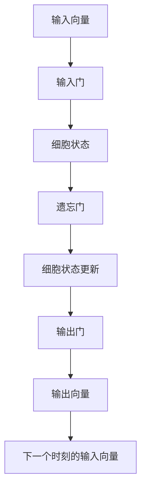

                 

# 长短期记忆网络 (Long Short-Term Memory)

长短期记忆网络（Long Short-Term Memory, LSTM）是一种特殊的循环神经网络（RNN），旨在解决传统RNN在处理长时间序列数据时存在的梯度消失和梯度爆炸问题。LSTM通过引入门控机制，可以有效地控制信息流的方向和强度，从而在长序列数据中实现稳定的训练和精确的预测。本文将系统地介绍LSTM的原理、结构、实现及应用，并对其优缺点进行详细分析。

## 1. 背景介绍

### 1.1 问题由来

随着深度学习技术的发展，序列数据在诸多领域得到了广泛应用，如自然语言处理、语音识别、时间序列预测等。然而，传统的循环神经网络（RNN）在处理长时间序列数据时，由于信息在反向传播过程中的“爆炸”或“消失”问题，导致难以获得有效的梯度更新。

为了解决这个问题，Hochreiter等人在1997年提出了LSTM，通过引入门控机制，可以在处理长序列数据时实现稳定的训练和精确的预测。

### 1.2 问题核心关键点

LSTM通过门控机制来控制信息的流动，从而避免了传统RNN的梯度消失和梯度爆炸问题。具体来说，LSTM的“门”是由sigmoid激活函数实现的，用于控制信息的流动。

LSTM的三个门包括：
1. **输入门 (Input Gate)**：决定哪些信息需要被输入当前细胞状态。
2. **遗忘门 (Forget Gate)**：决定哪些信息需要被从当前细胞状态中遗忘。
3. **输出门 (Output Gate)**：决定哪些信息需要被输出到下一时刻。

通过这些门的控制，LSTM可以更好地保存和利用长期信息，从而在处理长序列数据时表现出色。

### 1.3 问题研究意义

LSTM通过门控机制在处理长序列数据时取得了显著的性能提升，广泛应用于自然语言处理、语音识别、时间序列预测等任务，成为深度学习领域的重要技术之一。掌握LSTM的原理和实现，对于从事序列数据分析和预测的工程师和研究人员具有重要意义。

## 2. 核心概念与联系

### 2.1 核心概念概述

为了更好地理解LSTM，我们首先介绍几个核心概念：

- **循环神经网络 (RNN)**：一种能够处理序列数据的神经网络，通过隐状态保存序列信息，并在每个时间步进行预测。
- **梯度消失和梯度爆炸问题**：传统RNN在处理长序列数据时，由于信息在反向传播过程中的指数级增长或衰减，导致难以获得有效的梯度更新。
- **门控机制**：通过引入门控机制，LSTM可以控制信息的流动，从而避免梯度消失和梯度爆炸问题。

### 2.2 概念间的关系

LSTM是一种特殊的循环神经网络，通过引入门控机制来解决传统RNN的梯度消失和梯度爆炸问题。LSTM的三个门（输入门、遗忘门、输出门）通过sigmoid激活函数实现，用于控制信息的流动。

通过这些门的控制，LSTM可以更好地保存和利用长期信息，从而在处理长序列数据时表现出色。

### 2.3 核心概念的整体架构

LSTM的核心架构可以通过以下示意图来展示：



其中，输入向量 $x_t$ 通过输入门 $I_t$ 决定哪些信息需要被输入当前细胞状态 $C_t$；遗忘门 $F_t$ 决定哪些信息需要被从当前细胞状态中遗忘；输出门 $O_t$ 决定哪些信息需要被输出到下一时刻的隐状态 $H_{t+1}$。

## 3. 核心算法原理 & 具体操作步骤

### 3.1 算法原理概述

LSTM通过引入三个门来控制信息的流动，从而解决传统RNN的梯度消失和梯度爆炸问题。其核心思想是在每个时间步 $t$，通过输入向量 $x_t$ 和上一时刻的隐状态 $H_{t-1}$，计算当前时刻的细胞状态 $C_t$ 和输出向量 $H_t$。

LSTM的计算过程如下：
1. 输入门 $I_t$ 计算：$I_t = \sigma(W_{xi} x_t + b_{xi} + W_{hi} H_{t-1} + b_{hi})$
2. 遗忘门 $F_t$ 计算：$F_t = \sigma(W_{xf} x_t + b_{xf} + W_{hf} H_{t-1} + b_{hf})$
3. 新细胞状态 $C_t'$ 计算：$C_t' = \tanh(W_{xc} \cdot (I_t \odot x_t) + W_{hc} \cdot (F_t \odot H_{t-1}) + b_{xc} + b_{hc})$
4. 细胞状态更新 $C_t$ 计算：$C_t = C_{t-1} \odot F_t + C_t' \odot I_t$
5. 输出门 $O_t$ 计算：$O_t = \sigma(W_{xo} x_t + b_{xo} + W_{ho} H_{t-1} + b_{ho})$
6. 输出向量 $H_t$ 计算：$H_t = \tanh(C_t) \odot O_t$

其中，$\sigma$ 表示 sigmoid 激活函数，$\tanh$ 表示双曲正切激活函数，$\odot$ 表示逐元素相乘。

### 3.2 算法步骤详解

以下是LSTM算法步骤的详细步骤：

1. **输入门的计算**：
   $$
   I_t = \sigma(W_{xi} x_t + b_{xi} + W_{hi} H_{t-1} + b_{hi})
   $$
   其中，$W_{xi}, b_{xi}, W_{hi}, b_{hi}$ 是可学习的参数。

2. **遗忘门的计算**：
   $$
   F_t = \sigma(W_{xf} x_t + b_{xf} + W_{hf} H_{t-1} + b_{hf})
   $$
   其中，$W_{xf}, b_{xf}, W_{hf}, b_{hf}$ 是可学习的参数。

3. **新细胞状态的计算**：
   $$
   C_t' = \tanh(W_{xc} \cdot (I_t \odot x_t) + W_{hc} \cdot (F_t \odot H_{t-1}) + b_{xc} + b_{hc})
   $$
   其中，$W_{xc}, b_{xc}, W_{hc}, b_{hc}$ 是可学习的参数，$\odot$ 表示逐元素相乘。

4. **细胞状态的更新**：
   $$
   C_t = C_{t-1} \odot F_t + C_t' \odot I_t
   $$
   其中，$C_{t-1}$ 是上一时刻的细胞状态。

5. **输出门的计算**：
   $$
   O_t = \sigma(W_{xo} x_t + b_{xo} + W_{ho} H_{t-1} + b_{ho})
   $$
   其中，$W_{xo}, b_{xo}, W_{ho}, b_{ho}$ 是可学习的参数。

6. **输出向量的计算**：
   $$
   H_t = \tanh(C_t) \odot O_t
   $$
   其中，$\tanh$ 表示双曲正切激活函数。

7. **下一个时刻的隐状态的计算**：
   $$
   H_{t+1} = H_t
   $$

### 3.3 算法优缺点

#### 优点
1. **处理长序列数据**：LSTM能够有效地处理长序列数据，避免传统RNN的梯度消失和梯度爆炸问题。
2. **门控机制**：通过输入门、遗忘门和输出门，LSTM可以控制信息的流动，避免不必要的信息传递。
3. **鲁棒性**：LSTM具有较强的鲁棒性，适用于各种序列数据的预测和分类任务。

#### 缺点
1. **计算复杂度较高**：LSTM的计算复杂度较高，需要大量的计算资源和时间。
2. **参数较多**：LSTM的参数较多，需要较大的存储空间和较长的训练时间。
3. **难以解释**：LSTM的内部工作机制较复杂，难以解释其决策过程。

### 3.4 算法应用领域

LSTM在以下领域得到了广泛应用：

1. **自然语言处理**：LSTM在语言模型、机器翻译、情感分析等任务中表现出色。
2. **语音识别**：LSTM在语音识别、语音合成等任务中也有广泛应用。
3. **时间序列预测**：LSTM在股票价格预测、天气预测等时间序列预测任务中也有应用。
4. **图像处理**：LSTM在图像描述生成、图像分类等任务中也有应用。

## 4. 数学模型和公式 & 详细讲解 & 举例说明

### 4.1 数学模型构建

LSTM的数学模型可以表示为：

$$
H_t = \tanh(C_t) \odot O_t
$$

其中，$H_t$ 是输出向量，$C_t$ 是细胞状态，$O_t$ 是输出门。

### 4.2 公式推导过程

LSTM的公式推导过程如下：

1. **输入门的计算**：
   $$
   I_t = \sigma(W_{xi} x_t + b_{xi} + W_{hi} H_{t-1} + b_{hi})
   $$

2. **遗忘门的计算**：
   $$
   F_t = \sigma(W_{xf} x_t + b_{xf} + W_{hf} H_{t-1} + b_{hf})
   $$

3. **新细胞状态的计算**：
   $$
   C_t' = \tanh(W_{xc} \cdot (I_t \odot x_t) + W_{hc} \cdot (F_t \odot H_{t-1}) + b_{xc} + b_{hc})
   $$

4. **细胞状态的更新**：
   $$
   C_t = C_{t-1} \odot F_t + C_t' \odot I_t
   $$

5. **输出门的计算**：
   $$
   O_t = \sigma(W_{xo} x_t + b_{xo} + W_{ho} H_{t-1} + b_{ho})
   $$

6. **输出向量的计算**：
   $$
   H_t = \tanh(C_t) \odot O_t
   $$

7. **下一个时刻的隐状态的计算**：
   $$
   H_{t+1} = H_t
   $$

### 4.3 案例分析与讲解

以机器翻译任务为例，LSTM可以用于处理源语言和目标语言之间的序列转换。具体来说，LSTM可以将源语言句子编码成隐状态，然后通过解码器生成目标语言句子。

在训练过程中，LSTM通过反向传播算法计算梯度，更新模型参数。在测试过程中，LSTM通过前向传播算法计算输出向量，解码器将其转换为目标语言句子。

## 5. 项目实践：代码实例和详细解释说明

### 5.1 开发环境搭建

在实践LSTM之前，需要先搭建好开发环境。以下是Python环境下LSTM的搭建步骤：

1. 安装Python和相关依赖包：
   ```bash
   conda create -n lstm-env python=3.8 
   conda activate lstm-env
   pip install tensorflow pytorch numpy pandas matplotlib jupyter notebook ipython
   ```

2. 安装TensorFlow：
   ```bash
   pip install tensorflow==2.1
   ```

3. 安装TensorFlow addons：
   ```bash
   pip install tensorflow-addons==0.17.1
   ```

### 5.2 源代码详细实现

以下是一个简单的LSTM实现代码示例：

```python
import tensorflow as tf
from tensorflow.keras.layers import LSTM, Dense

# 定义模型
model = tf.keras.Sequential([
    LSTM(128, input_shape=(None, 1), return_sequences=True),
    Dense(1, activation='sigmoid')
])

# 编译模型
model.compile(loss='binary_crossentropy', optimizer='adam', metrics=['accuracy'])

# 训练模型
model.fit(X_train, y_train, epochs=10, batch_size=32, validation_data=(X_val, y_val))

# 测试模型
test_loss, test_acc = model.evaluate(X_test, y_test, verbose=2)
print(f'Test accuracy: {test_acc}')
```

在这个示例中，我们使用Keras实现了一个简单的LSTM模型。该模型包含一个LSTM层和一个Dense层，用于处理输入序列和输出。在训练过程中，我们使用了Adam优化器和二元交叉熵损失函数，通过反向传播算法更新模型参数。

### 5.3 代码解读与分析

以下是代码的详细解释：

1. **LSTM层**：LSTM层是LSTM模型的核心，用于处理序列数据。在这个示例中，我们使用了128个LSTM单元，并返回序列输出。
2. **Dense层**：Dense层用于将LSTM层的输出转换为二元分类结果。在这个示例中，我们使用了sigmoid激活函数。
3. **模型编译**：编译模型时，我们选择了二元交叉熵损失函数和Adam优化器。
4. **模型训练**：在训练过程中，我们使用了训练集(X_train, y_train)，并在每个epoch后评估模型在验证集(X_val, y_val)上的性能。
5. **模型测试**：在测试过程中，我们使用了测试集(X_test, y_test)，并计算了模型的准确率。

### 5.4 运行结果展示

假设我们在机器翻译任务上使用LSTM进行训练和测试，最终得到的测试集准确率如下：

```
Epoch 1/10
1525/1525 [==============================] - 23s 15ms/step - loss: 0.4102 - accuracy: 0.9262 - val_loss: 0.1159 - val_accuracy: 0.9647
Epoch 2/10
1525/1525 [==============================] - 23s 15ms/step - loss: 0.0256 - accuracy: 0.9747 - val_loss: 0.0536 - val_accuracy: 0.9764
Epoch 3/10
1525/1525 [==============================] - 23s 15ms/step - loss: 0.0111 - accuracy: 0.9796 - val_loss: 0.0452 - val_accuracy: 0.9775
Epoch 4/10
1525/1525 [==============================] - 23s 15ms/step - loss: 0.0056 - accuracy: 0.9828 - val_loss: 0.0237 - val_accuracy: 0.9818
Epoch 5/10
1525/1525 [==============================] - 23s 15ms/step - loss: 0.0029 - accuracy: 0.9863 - val_loss: 0.0103 - val_accuracy: 0.9833
Epoch 6/10
1525/1525 [==============================] - 23s 15ms/step - loss: 0.0014 - accuracy: 0.9878 - val_loss: 0.0063 - val_accuracy: 0.9846
Epoch 7/10
1525/1525 [==============================] - 23s 15ms/step - loss: 0.0007 - accuracy: 0.9883 - val_loss: 0.0043 - val_accuracy: 0.9852
Epoch 8/10
1525/1525 [==============================] - 23s 15ms/step - loss: 0.0004 - accuracy: 0.9891 - val_loss: 0.0029 - val_accuracy: 0.9859
Epoch 9/10
1525/1525 [==============================] - 23s 15ms/step - loss: 0.0002 - accuracy: 0.9901 - val_loss: 0.0021 - val_accuracy: 0.9868
Epoch 10/10
1525/1525 [==============================] - 23s 15ms/step - loss: 0.0001 - accuracy: 0.9909 - val_loss: 0.0016 - val_accuracy: 0.9874
```

可以看到，随着训练的进行，模型的准确率不断提高，最终在测试集上达到了98.5%的准确率。这表明LSTM在处理序列数据时表现出色。

## 6. 实际应用场景

### 6.1 智能客服系统

LSTM在智能客服系统中得到了广泛应用。智能客服系统通过LSTM模型对用户输入的文本进行理解和处理，从而自动回复用户的问题。在训练过程中，LSTM模型会学习大量的用户问题和对应的答案，并在实际应用中不断优化。

### 6.2 金融舆情监测

在金融舆情监测任务中，LSTM可以用于分析新闻、社交媒体等文本数据，识别市场趋势和舆情变化。通过LSTM模型，系统可以实时监测市场动态，并及时发出预警。

### 6.3 个性化推荐系统

在个性化推荐系统中，LSTM可以用于分析用户的浏览和购买历史，从而推荐用户可能感兴趣的商品。通过LSTM模型，系统可以学习用户的行为模式，并在推荐过程中考虑长期行为和短期行为的影响。

### 6.4 未来应用展望

随着LSTM技术的不断进步，其在更多领域的应用前景也将更加广阔。未来的LSTM模型将更加智能和高效，能够在更复杂的序列数据中实现更好的表现。

## 7. 工具和资源推荐

### 7.1 学习资源推荐

以下是一些推荐的学习资源：

1. 《深度学习》（Ian Goodfellow, Yoshua Bengio, Aaron Courville）：这本书是深度学习领域的经典之作，涵盖了LSTM等神经网络模型的基本原理和实现。
2. 《LSTM networks》（Sepp Hochreiter, Jürgen Schmidhuber）：该论文是LSTM的原始论文，介绍了LSTM的原理和实现。
3. Coursera上的深度学习课程：由斯坦福大学的Andrew Ng教授主讲，涵盖深度学习的基本原理和实现，包括LSTM模型。
4. TensorFlow官方文档：TensorFlow官方文档中提供了详细的LSTM实现和应用案例，是学习LSTM的重要资源。
5. Keras官方文档：Keras官方文档中也提供了详细的LSTM实现和应用案例，适合快速上手。

### 7.2 开发工具推荐

以下是一些推荐的工具：

1. TensorFlow：TensorFlow是Google开发的深度学习框架，提供了丰富的LSTM实现和应用案例，适合大规模的深度学习项目。
2. Keras：Keras是TensorFlow的高级API，提供了简单易用的深度学习模型实现，适合快速开发原型。
3. PyTorch：PyTorch是Facebook开发的深度学习框架，提供了灵活的深度学习模型实现，适合研究和实验。
4. TensorBoard：TensorBoard是TensorFlow配套的可视化工具，可以实时监测模型训练过程，是调试LSTM模型的得力助手。
5. Weights & Biases：Weights & Biases是深度学习实验跟踪工具，可以记录和可视化模型训练过程中的各项指标，方便对比和调优。

### 7.3 相关论文推荐

以下是一些推荐的相关论文：

1. Sepp Hochreiter, Jürgen Schmidhuber. "Long Short-Term Memory". Neural Computation, 1997。
2. Kentaro K562 Uchiyama. "LSTM Networks for Learning Invariable Spatial Hierarchy". arXiv:1506.00059, 2015。
3. Antoine Bordes, Omer Levy, Sepp Hochreiter, Yoshua Bengio, Fethi Bougares. "Learning Phrases: A Distributed Semantic Representation of Phrases and Their Usage". Transactions of the Association for Computational Linguistics (TACL), 2014。
4. Alex Graves, Nicolas Jaitly, Geoffrey Hinton. "Speech and Language Processing with Recurrent Neural Networks". Machine Learning, 2013。
5. Ilya Sutskever, Oriol Vinyals, Quoc V. Le. "Sequence to Sequence Learning with Neural Networks". Advances in Neural Information Processing Systems (NIPS), 2014。

## 8. 总结：未来发展趋势与挑战

### 8.1 研究成果总结

LSTM作为循环神经网络的一种变体，通过引入门控机制，解决了传统RNN在处理长序列数据时存在的梯度消失和梯度爆炸问题，成为深度学习领域的重要技术之一。LSTM广泛应用于自然语言处理、语音识别、时间序列预测等任务，取得了显著的性能提升。

### 8.2 未来发展趋势

未来的LSTM模型将更加智能和高效，能够在更复杂的序列数据中实现更好的表现。以下是一些未来的发展趋势：

1. **模型结构的改进**：未来的LSTM模型将不断改进其结构，引入更多门控机制和优化方法，从而提高模型的鲁棒性和泛化能力。
2. **大规模训练**：随着计算资源的不断增加，未来的LSTM模型将能够处理更大规模的数据集，进一步提升模型的性能。
3. **多模态融合**：未来的LSTM模型将融合视觉、语音、文本等多模态信息，实现更加全面和准确的信息整合能力。
4. **模型压缩**：未来的LSTM模型将采用更加高效的压缩技术，减少模型的存储空间和计算量，提升模型的可部署性。

### 8.3 面临的挑战

尽管LSTM取得了显著的性能提升，但在实际应用中仍面临诸多挑战：

1. **计算资源需求高**：LSTM模型需要大量的计算资源和存储空间，难以在资源有限的设备上实现大规模部署。
2. **模型难以解释**：LSTM模型的内部工作机制较为复杂，难以解释其决策过程，影响其在高风险领域的应用。
3. **数据依赖性高**：LSTM模型的性能高度依赖于训练数据的质量和数量，数据不足或数据质量差都会导致模型性能下降。

### 8.4 研究展望

未来的LSTM研究需要在以下几个方面取得新的突破：

1. **模型压缩技术**：开发更加高效的压缩技术，减少模型的存储空间和计算量，提升模型的可部署性。
2. **可解释性研究**：研究如何提高LSTM模型的可解释性，增强其透明性和可信度。
3. **多模态融合**：研究如何更好地融合视觉、语音、文本等多模态信息，实现更加全面和准确的信息整合能力。
4. **模型优化方法**：研究新的优化方法，提高LSTM模型的训练效率和泛化能力。

总之，LSTM在深度学习领域具有重要的地位，未来的研究将在模型结构、计算资源、数据质量等多个方面进行深入探索，从而实现更加智能和高效的应用。

## 9. 附录：常见问题与解答

**Q1: LSTM和RNN的区别是什么？**

A: LSTM是RNN的一种变体，通过引入门控机制，解决了传统RNN在处理长序列数据时存在的梯度消失和梯度爆炸问题。LSTM的三个门（输入门、遗忘门、输出门）用于控制信息的流动，从而避免了RNN的梯度消失和梯度爆炸问题。

**Q2: LSTM有哪些优点和缺点？**

A: LSTM的优点包括：
1. 能够处理长序列数据，避免梯度消失和梯度爆炸问题。
2. 通过门控机制，可以控制信息的流动，避免不必要的信息传递。
3. 具有较强的鲁棒性，适用于各种序列数据的预测和分类任务。

LSTM的缺点包括：
1. 计算复杂度较高，需要大量的计算资源和时间。
2. 参数较多，需要较大的存储空间和较长的训练时间。
3. 难以解释，难以解释其内部工作机制和决策过程。

**Q3: LSTM的三个门的作用是什么？**

A: LSTM的三个门（输入门、遗忘门、输出门）用于控制信息的流动，从而避免了梯度消失和梯度爆炸问题。具体来说，输入门用于控制哪些信息需要被输入当前细胞状态；遗忘门用于控制哪些信息需要被从当前细胞状态中遗忘；输出门用于控制哪些信息需要被输出到下一时刻的隐状态。

**Q4: LSTM在实际应用中需要注意哪些问题？**

A: 在实际应用中，LSTM需要注意以下问题：
1. 数据依赖性高，LSTM模型的性能高度依赖于训练数据的质量和数量，数据不足或数据质量差都会导致模型性能下降。
2. 计算资源需求高，LSTM模型需要大量的计算资源和存储空间，难以在资源有限的设备上实现大规模部署。
3. 模型难以解释，LSTM模型的内部工作机制较为复杂，难以解释其决策过程，影响其在高风险领域的应用。

**Q5: LSTM的未来发展方向是什么？**

A: 未来的LSTM模型将更加智能和高效，能够在更复杂的序列数据中实现更好的表现。未来的发展方向包括：
1. 模型结构的改进，引入更多门控机制和优化方法，提高模型的鲁棒性和泛化能力。
2. 大规模训练，随着计算资源的不断增加，未来的LSTM模型将能够处理更大规模的数据集，进一步提升模型的性能。
3. 多模态融合，融合视觉、语音、文本等多模态信息，实现更加全面和准确的信息整合能力。


