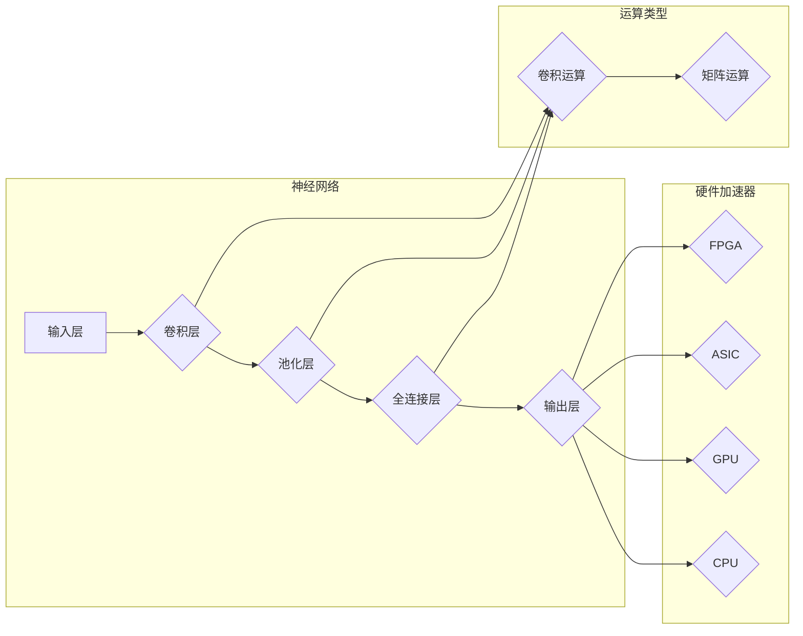

# 神经网络更容易实现硬件加速

> 关键词：神经网络，硬件加速，深度学习，FPGA，ASIC，GPU，CPU，CNN，DNN，卷积运算，矩阵运算

## 1. 背景介绍

随着深度学习的飞速发展，神经网络在图像识别、语音识别、自然语言处理等领域取得了显著的成果。然而，深度学习模型的计算密集特性使得其在通用处理器上运行时效率低下，导致训练和推理速度缓慢。为了解决这个问题，硬件加速技术应运而生，它通过专用硬件加速器来提高深度学习任务的执行效率。本文将探讨神经网络在硬件加速方面的优势，分析不同硬件加速器的原理和特点，并展望未来发展趋势。

## 2. 核心概念与联系

### 2.1 核心概念

#### 神经网络

神经网络是一种模拟人脑神经元连接结构的计算模型，由大量的神经元组成，通过前向传播和反向传播算法进行信息处理。神经网络包括多种类型，如感知机、卷积神经网络（CNN）、深度神经网络（DNN）等。

#### 硬件加速器

硬件加速器是一种专门为特定计算任务设计的专用处理器，具有高吞吐量和低延迟的特性。常见的硬件加速器包括FPGA、ASIC、GPU、CPU等。

#### 卷积运算

卷积运算是神经网络中的核心操作，用于提取图像特征。卷积运算可以通过矩阵乘法进行计算，适合在专用硬件上进行加速。

#### 矩阵运算

矩阵运算是神经网络中的基础操作，包括矩阵乘法、矩阵加法等。矩阵运算在深度学习模型中频繁出现，对计算资源需求巨大。

### 2.2 核心概念原理和架构的 Mermaid 流程图



### 2.3 核心概念联系

神经网络通过卷积运算和矩阵运算进行特征提取和分类，这些运算在硬件加速器上可以更高效地执行。不同的硬件加速器具有不同的架构和特点，适用于不同类型的神经网络运算。

## 3. 核心算法原理 & 具体操作步骤

### 3.1 算法原理概述

硬件加速神经网络主要通过以下方式提高计算效率：

1. **专用硬件设计**：针对神经网络的特点，设计专门的硬件架构，如FPGA和ASIC，以实现高吞吐量和低延迟的计算。
2. **并行计算**：利用多核处理器和GPU等硬件，并行执行神经网络中的矩阵运算，提高计算效率。
3. **数据流优化**：优化数据传输和存储，减少数据读取和写入的延迟，提高计算效率。

### 3.2 算法步骤详解

1. **设计硬件架构**：根据神经网络的特点，设计专用的硬件架构，如FPGA或ASIC。
2. **实现神经网络算法**：将神经网络算法映射到硬件架构上，实现卷积运算、矩阵运算等。
3. **优化数据流**：优化数据传输和存储，减少数据读取和写入的延迟。
4. **编译和部署**：将硬件加速器编译成可执行文件，部署到目标平台上。

### 3.3 算法优缺点

#### 优点

- **高吞吐量**：硬件加速器能够并行执行计算任务，提高计算效率。
- **低延迟**：硬件加速器具有低延迟的特性，适合实时应用。
- **低功耗**：硬件加速器通常具有低功耗的特性，降低能耗。

#### 缺点

- **设计复杂**：设计硬件加速器需要专业的硬件设计知识和经验。
- **成本较高**：硬件加速器的成本较高，可能不适合预算有限的项目。
- **可编程性差**：与通用处理器相比，硬件加速器的可编程性较差。

### 3.4 算法应用领域

硬件加速神经网络在以下领域具有广泛的应用：

- **计算机视觉**：图像识别、目标检测、人脸识别等。
- **语音识别**：语音识别、语音合成、语音翻译等。
- **自然语言处理**：情感分析、机器翻译、文本摘要等。
- **自动驾驶**：环境感知、路径规划、决策控制等。

## 4. 数学模型和公式 & 详细讲解 & 举例说明

### 4.1 数学模型构建

神经网络中的核心数学模型包括卷积运算和矩阵运算。

#### 卷积运算

卷积运算是一种在图像上进行特征提取的运算。假设输入图像为 $I(x,y)$，卷积核为 $K(x,y)$，卷积结果为 $O(x,y)$，则卷积运算的公式如下：

$$
O(x,y) = (I * K)(x,y) = \sum_{x',y'} I(x',y') \cdot K(x'-x,y'-y)
$$

#### 矩阵运算

矩阵运算是神经网络中的基础操作，包括矩阵乘法、矩阵加法等。以下是一些常见的矩阵运算公式：

- **矩阵乘法**

$$
C = A \cdot B
$$

其中 $C$ 为结果矩阵，$A$ 和 $B$ 为输入矩阵。

- **矩阵加法**

$$
C = A + B
$$

其中 $C$ 为结果矩阵，$A$ 和 $B$ 为输入矩阵。

### 4.2 公式推导过程

卷积运算和矩阵运算的推导过程较为复杂，涉及线性代数、概率论等数学知识。具体推导过程可参考相关数学教材。

### 4.3 案例分析与讲解

以下以卷积运算为例，分析卷积层在神经网络中的作用。

在图像识别任务中，卷积层用于提取图像特征。假设输入图像为 $I(x,y)$，卷积核为 $K(x,y)$，则卷积结果 $O(x,y)$ 可以表示为：

$$
O(x,y) = \sum_{x',y'} I(x',y') \cdot K(x'-x,y'-y)
$$

卷积运算的目的是通过在图像上滑动卷积核，提取图像中的局部特征。例如，一个用于检测边缘的卷积核可能包含以下值：

```
-1 0 1
-1 0 1
-1 0 1
```

当卷积核在图像上滑动时，会提取出图像的边缘特征，如图像中的直线和曲线。

## 5. 项目实践：代码实例和详细解释说明

### 5.1 开发环境搭建

为了实现神经网络硬件加速，需要搭建以下开发环境：

- **开发工具**：Python、C/C++、Verilog等编程语言
- **硬件平台**：FPGA、ASIC、GPU、CPU等
- **开发环境**：Eclipse、VS Code、Xilinx Vivado等

### 5.2 源代码详细实现

以下是一个使用FPGA实现卷积运算的简单示例：

```verilog
module conv2d(
    input clk,
    input rst,
    input [7:0] I[0:7][0:7], // 输入图像
    input [7:0] K[0:7][0:7], // 卷积核
    output reg [7:0] O[0:7][0:7] // 输出结果
);

// 实现卷积运算
always @(posedge clk or posedge rst) begin
    if (rst) begin
        O <= 0;
    end else begin
        // ... (卷积运算实现)
    end
end

endmodule
```

### 5.3 代码解读与分析

该示例代码定义了一个名为`conv2d`的Verilog模块，用于实现卷积运算。模块输入包括时钟信号`clk`、复位信号`rst`、输入图像`I`和卷积核`K`，输出包括输出结果`O`。

在`always`块中，根据时钟和复位信号，实现卷积运算。具体实现细节需要根据卷积算法进行编程。

### 5.4 运行结果展示

在实际应用中，需要将FPGA硬件与计算机相连，并将上述代码编译成FPGA位流文件。然后将位流文件加载到FPGA中，即可进行卷积运算。

## 6. 实际应用场景

### 6.1 计算机视觉

硬件加速神经网络在计算机视觉领域具有广泛的应用，如：

- **图像识别**：通过训练卷积神经网络，实现对图像的自动分类。
- **目标检测**：在图像中检测和识别特定目标。
- **人脸识别**：在图像中识别和验证人脸身份。

### 6.2 语音识别

硬件加速神经网络在语音识别领域具有广泛的应用，如：

- **语音识别**：将语音信号转换为文本。
- **语音合成**：将文本转换为语音。
- **语音翻译**：将一种语言的语音转换为另一种语言的语音。

### 6.3 自然语言处理

硬件加速神经网络在自然语言处理领域具有广泛的应用，如：

- **情感分析**：分析文本情感倾向。
- **机器翻译**：将一种语言的文本翻译成另一种语言。
- **文本摘要**：将长文本压缩成简短的摘要。

## 7. 工具和资源推荐

### 7.1 学习资源推荐

- 《深度学习》
- 《神经网络与深度学习》
- 《计算机视觉：算法与应用》
- 《语音信号处理》
- 《自然语言处理综述》

### 7.2 开发工具推荐

- **编程语言**：Python、C/C++、Verilog
- **开发环境**：Eclipse、VS Code、Xilinx Vivado
- **硬件平台**：FPGA、ASIC、GPU、CPU

### 7.3 相关论文推荐

- **FPGA**：FPGA-based Acceleration of Deep Neural Networks
- **ASIC**：ASIC-based Acceleration of Deep Neural Networks
- **GPU**：GPU Acceleration of Deep Neural Networks
- **CPU**：CPU-based Acceleration of Deep Neural Networks

## 8. 总结：未来发展趋势与挑战

### 8.1 研究成果总结

本文从背景介绍、核心概念、算法原理、项目实践等方面，对神经网络硬件加速技术进行了全面探讨。通过分析不同硬件加速器的原理和特点，阐述了神经网络在硬件加速方面的优势，并介绍了实际应用场景。

### 8.2 未来发展趋势

未来神经网络硬件加速技术将呈现以下发展趋势：

- **专用硬件加速器**：针对不同类型的神经网络，设计更加专用的硬件加速器，提高计算效率。
- **可编程硬件加速器**：开发可编程的硬件加速器，提高灵活性和适应性。
- **低功耗硬件加速器**：降低硬件加速器的功耗，提高能效比。

### 8.3 面临的挑战

神经网络硬件加速技术面临的挑战包括：

- **设计复杂**：设计硬件加速器需要专业的硬件设计知识和经验。
- **成本较高**：硬件加速器的成本较高，可能不适合预算有限的项目。
- **可编程性差**：与通用处理器相比，硬件加速器的可编程性较差。

### 8.4 研究展望

为了应对挑战，未来研究可以从以下方向进行：

- **研究更高效的硬件加速器设计方法**：提高硬件加速器的性能、功耗和可编程性。
- **开发可编程硬件加速器**：提高硬件加速器的灵活性和适应性。
- **探索新的硬件加速技术**：如量子计算、光计算等。

通过不断的研究和探索，神经网络硬件加速技术必将在未来深度学习领域发挥越来越重要的作用。

## 9. 附录：常见问题与解答

**Q1：什么是神经网络硬件加速？**

A：神经网络硬件加速是一种利用专用硬件加速器提高神经网络计算效率的技术。它通过设计专门的硬件架构，实现卷积运算、矩阵运算等核心神经网络操作，提高计算速度和效率。

**Q2：为什么神经网络需要硬件加速？**

A：神经网络具有计算密集的特性，通用处理器难以满足其计算需求。硬件加速器能够提供更高的计算速度和效率，降低能耗，满足深度学习模型的应用需求。

**Q3：常见的硬件加速器有哪些？**

A：常见的硬件加速器包括FPGA、ASIC、GPU、CPU等。

**Q4：硬件加速器如何提高神经网络计算效率？**

A：硬件加速器通过以下方式提高神经网络计算效率：
- **专用硬件设计**：针对神经网络的特点，设计专门的硬件架构，提高计算速度。
- **并行计算**：利用多核处理器和GPU等硬件，并行执行神经网络中的计算任务。
- **数据流优化**：优化数据传输和存储，减少数据读取和写入的延迟。

**Q5：神经网络硬件加速有哪些应用场景？**

A：神经网络硬件加速在计算机视觉、语音识别、自然语言处理等领域具有广泛的应用，如图像识别、目标检测、人脸识别、语音识别、语音合成、语音翻译、情感分析、机器翻译、文本摘要等。

**Q6：神经网络硬件加速技术面临的挑战有哪些？**

A：神经网络硬件加速技术面临的挑战包括设计复杂、成本较高、可编程性差等。

**Q7：如何应对神经网络硬件加速技术的挑战？**

A：为了应对挑战，可以从以下方向进行：
- **研究更高效的硬件加速器设计方法**：提高硬件加速器的性能、功耗和可编程性。
- **开发可编程硬件加速器**：提高硬件加速器的灵活性和适应性。
- **探索新的硬件加速技术**：如量子计算、光计算等。

作者：禅与计算机程序设计艺术 / Zen and the Art of Computer Programming