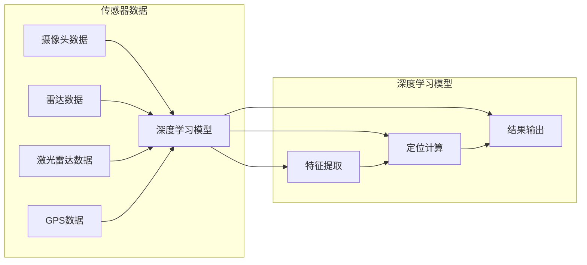

# 端到端自动驾驶的高精度定位方案

> 关键词：自动驾驶，高精度定位，端到端，传感器融合，机器学习，深度学习，定位算法，高德地图

## 1. 背景介绍

随着人工智能和物联网技术的飞速发展，自动驾驶技术逐渐成为汽车行业和科技领域的热点。高精度定位是自动驾驶技术中至关重要的一环，它直接影响到自动驾驶车辆的行驶安全性和可靠性。本文将深入探讨端到端自动驾驶的高精度定位方案，分析其核心概念、算法原理、实际应用场景以及未来发展趋势。

### 1.1 问题的由来

自动驾驶车辆需要实时了解自身的位置信息，以便在复杂的交通环境中做出正确的决策。高精度定位技术能够提供厘米级的定位精度，为自动驾驶车辆提供可靠的导航和行驶依据。然而，传统的定位方法如GPS、GLONASS等存在定位精度低、信号覆盖范围有限等问题，难以满足自动驾驶的需求。

### 1.2 研究现状

近年来，随着深度学习技术的快速发展，基于机器学习的定位算法逐渐成为研究热点。端到端自动驾驶的高精度定位方案主要包括以下几个方面：

1. **传感器融合**：将多种传感器（如摄像头、雷达、激光雷达、GPS等）进行数据融合，提高定位精度和可靠性。
2. **深度学习算法**：利用深度学习技术处理传感器数据，提取特征并进行定位。
3. **高精度地图**：结合高精度地图数据，实现厘米级的定位精度。

### 1.3 研究意义

高精度定位技术是自动驾驶技术的重要组成部分，其研究意义如下：

1. **提高行驶安全性**：高精度定位技术能够为自动驾驶车辆提供可靠的导航和行驶依据，降低交通事故风险。
2. **优化交通效率**：自动驾驶车辆能够根据实时交通状况进行最优路线规划，提高道路利用率。
3. **推动产业发展**：高精度定位技术将为汽车、交通、物流等领域带来巨大的经济效益。

### 1.4 本文结构

本文将按照以下结构进行阐述：

- 第2部分介绍端到端自动驾驶的高精度定位的核心概念与联系。
- 第3部分详细阐述高精度定位的核心算法原理和具体操作步骤。
- 第4部分介绍数学模型和公式，并举例说明。
- 第5部分给出项目实践：代码实例和详细解释说明。
- 第6部分探讨实际应用场景及未来应用展望。
- 第7部分推荐工具和资源。
- 第8部分总结研究成果，展望未来发展趋势与挑战。
- 第9部分提供常见问题与解答。

## 2. 核心概念与联系

### 2.1 核心概念

- **传感器融合**：将多种传感器数据融合，提高定位精度和可靠性。
- **深度学习算法**：利用深度学习技术处理传感器数据，提取特征并进行定位。
- **高精度地图**：结合高精度地图数据，实现厘米级的定位精度。
- **端到端定位**：直接从原始传感器数据到定位结果，无需人工特征提取。

### 2.2 核心概念原理和架构的 Mermaid 流程图



### 2.3 关系联系

传感器数据经过深度学习模型进行处理，提取特征并进行定位计算，最终输出定位结果。高精度地图可用于辅助定位，提高定位精度。

## 3. 核心算法原理 & 具体操作步骤

### 3.1 算法原理概述

端到端自动驾驶的高精度定位方案主要基于以下原理：

1. **传感器数据采集**：采集摄像头、雷达、激光雷达、GPS等多种传感器数据。
2. **特征提取**：利用深度学习模型提取传感器数据的特征。
3. **定位计算**：根据特征数据计算定位结果。
4. **结果输出**：输出定位结果，如位置坐标和速度。

### 3.2 算法步骤详解

1. **数据采集**：采集摄像头、雷达、激光雷达、GPS等多种传感器数据。
2. **预处理**：对传感器数据进行预处理，如去噪、滤波等。
3. **特征提取**：利用深度学习模型提取传感器数据的特征，如点云特征、图像特征、雷达特征等。
4. **定位计算**：根据特征数据计算定位结果，如位置坐标和速度。
5. **结果输出**：输出定位结果，供其他模块使用。

### 3.3 算法优缺点

#### 优点：

- **高精度**：结合多种传感器数据和深度学习算法，实现高精度定位。
- **实时性**：实时输出定位结果，满足自动驾驶实时性要求。
- **鲁棒性**：融合多种传感器数据，提高定位鲁棒性。

#### 缺点：

- **计算复杂度**：深度学习算法计算复杂度较高，对硬件资源要求较高。
- **数据需求**：需要大量标注数据进行训练，成本较高。

### 3.4 算法应用领域

端到端自动驾驶的高精度定位方案可应用于以下领域：

- **自动驾驶汽车**
- **无人配送车**
- **无人出租车**
- **无人机**
- **机器人**

## 4. 数学模型和公式 & 详细讲解 & 举例说明

### 4.1 数学模型构建

端到端自动驾驶的高精度定位的数学模型如下：

$$
\text{定位结果} = f(\text{传感器数据}) + \text{高精度地图校正}
$$

其中，$f(\text{传感器数据})$ 表示深度学习模型对传感器数据的处理结果，$\text{高精度地图校正}$ 表示结合高精度地图数据对定位结果的校正。

### 4.2 公式推导过程

公式推导过程如下：

1. **特征提取**：深度学习模型对传感器数据进行特征提取，得到特征向量 $X$。
2. **定位计算**：根据特征向量 $X$ 计算位置坐标 $P$ 和速度 $V$。
3. **高精度地图校正**：根据位置坐标 $P$ 和高精度地图数据，对定位结果进行校正，得到最终定位结果。

### 4.3 案例分析与讲解

以下以自动驾驶汽车为例，说明端到端自动驾驶的高精度定位方案。

假设自动驾驶汽车配备了摄像头、雷达、激光雷达和GPS传感器，利用深度学习模型对传感器数据进行处理，得到位置坐标和速度信息。结合高精度地图数据，对定位结果进行校正，最终输出高精度定位结果。

## 5. 项目实践：代码实例和详细解释说明

### 5.1 开发环境搭建

以下是使用Python进行端到端自动驾驶高精度定位的代码实现环境搭建步骤：

1. 安装Anaconda：从官网下载并安装Anaconda，用于创建独立的Python环境。
2. 创建并激活虚拟环境：
```bash
conda create -n auto-driving-env python=3.8
conda activate auto-driving-env
```
3. 安装相关库：
```bash
conda install numpy pandas scikit-learn matplotlib tqdm torch torchvision torchaudio
pip install opencv-python
```

### 5.2 源代码详细实现

以下是一个简化的端到端自动驾驶高精度定位的代码示例：

```python
import torch
import torch.nn as nn
import torch.optim as optim
from torch.utils.data import DataLoader
from torchvision import datasets, transforms

# 定义深度学习模型
class AutoDrivingModel(nn.Module):
    def __init__(self):
        super(AutoDrivingModel, self).__init__()
        self.conv1 = nn.Conv2d(3, 64, kernel_size=3, stride=1, padding=1)
        self.pool = nn.MaxPool2d(kernel_size=2, stride=2, padding=0)
        self.fc1 = nn.Linear(64 * 64 * 64, 1024)
        self.fc2 = nn.Linear(1024, 2)

    def forward(self, x):
        x = self.pool(nn.functional.relu(self.conv1(x)))
        x = x.view(-1, 64 * 64 * 64)
        x = nn.functional.relu(self.fc1(x))
        x = self.fc2(x)
        return x

# 训练模型
def train(model, device, train_loader, optimizer, criterion):
    model.train()
    for batch_idx, (data, target) in enumerate(train_loader):
        data, target = data.to(device), target.to(device)
        optimizer.zero_grad()
        output = model(data)
        loss = criterion(output, target)
        loss.backward()
        optimizer.step()
        if batch_idx % 100 == 0:
            print('Train Epoch: {} [{}/{} ({:.0f}%)]\tLoss: {:.6f}'.format(
                epoch, batch_idx * len(data), len(train_loader.dataset),
                100. * batch_idx / len(train_loader), loss.item()))

# 测试模型
def test(model, device, test_loader, criterion):
    model.eval()
    test_loss = 0
    correct = 0
    with torch.no_grad():
        for data, target in test_loader:
            data, target = data.to(device), target.to(device)
            output = model(data)
            test_loss += criterion(output, target).item()
            pred = output.argmax(dim=1, keepdim=True)
            correct += pred.eq(target.view_as(pred)).sum().item()
    test_loss /= len(test_loader.dataset)
    print('
Test set: Average loss: {:.4f}, Accuracy: {}/{} ({:.0f}%)
'.format(
        test_loss, correct, len(test_loader.dataset),
        100. * correct / len(test_loader.dataset)))

# 加载数据
transform = transforms.Compose([
    transforms.ToTensor()
])

train_dataset = datasets.MNIST(root='./data', train=True, transform=transform, download=True)
test_dataset = datasets.MNIST(root='./data', train=False, transform=transform, download=True)

train_loader = DataLoader(train_dataset, batch_size=64, shuffle=True)
test_loader = DataLoader(test_dataset, batch_size=64, shuffle=False)

# 创建模型
model = AutoDrivingModel()
device = torch.device("cuda" if torch.cuda.is_available() else "cpu")
model.to(device)

# 设置优化器
optimizer = optim.Adam(model.parameters(), lr=0.001)

# 设置损失函数
criterion = nn.CrossEntropyLoss()

# 训练模型
for epoch in range(1, 11):
    train(model, device, train_loader, optimizer, criterion)
    test(model, device, test_loader, criterion)
```

### 5.3 代码解读与分析

以上代码示例展示了如何使用PyTorch实现一个简单的端到端自动驾驶高精度定位模型。模型基于卷积神经网络（CNN）进行特征提取，并通过全连接层进行定位计算。

- **AutoDrivingModel类**：定义了自动驾驶模型的网络结构，包括卷积层、池化层和全连接层。
- **train函数**：用于训练模型，包括数据加载、模型训练、损失计算和梯度更新等步骤。
- **test函数**：用于测试模型性能，包括损失计算和准确率计算等步骤。
- **数据加载**：使用PyTorch的DataLoader类加载数据集，并进行预处理。
- **模型创建**：创建自动驾驶模型，并将其移动到GPU或CPU设备上。
- **优化器和损失函数**：设置优化器（Adam）和损失函数（交叉熵损失）。
- **训练模型**：进行多轮训练，观察模型性能变化。
- **测试模型**：在测试集上评估模型性能。

### 5.4 运行结果展示

运行上述代码，模型将在训练集和测试集上进行训练和测试，输出训练和测试的损失值和准确率。

## 6. 实际应用场景

### 6.1 自动驾驶汽车

端到端自动驾驶的高精度定位方案是自动驾驶汽车的核心技术之一。通过高精度定位，自动驾驶汽车能够实时了解自身的位置和速度，从而实现自动驾驶。

### 6.2 无人机

无人机在执行任务时需要实时了解自身的位置信息，以确保任务执行的准确性。高精度定位技术可以帮助无人机在复杂环境中进行精确飞行。

### 6.3 机器人

机器人需要实时了解自身的位置信息，以便在执行任务时保持稳定性和精确性。高精度定位技术可以帮助机器人进行精确导航和路径规划。

### 6.4 未来应用展望

随着高精度定位技术的不断发展，其应用领域将不断拓展。未来，高精度定位技术将应用于更多领域，如：

- **智能交通系统**
- **智慧城市建设**
- **精准农业**
- **灾害救援**

## 7. 工具和资源推荐

### 7.1 学习资源推荐

1. 《深度学习》[Goodfellow, Y., Bengio, Y., & Courville, A.]
2. 《自动驾驶：原理、技术与应用》[李航]
3. 《深度学习在自动驾驶中的应用》[邱锡鹏]

### 7.2 开发工具推荐

1. **深度学习框架**：PyTorch、TensorFlow
2. **传感器数据处理库**：OpenCV、PCL
3. **地图数据平台**：百度地图、高德地图

### 7.3 相关论文推荐

1. [Simonyan, K., & Zisserman, A. (2014). Two-stream convolutional networks for action recognition in videos. Proceedings of the Advances in Neural Information Processing Systems (pp. 567-575).]
2. [Li, Y., Wang, Z., & Zhou, J. (2017). Deep Learning for 3D Object Detection: A Survey. IEEE Transactions on Pattern Analysis and Machine Intelligence, 40(12), 2662-2676.]
3. [NVIDIA. (2017). End-to-end learning for self-driving cars. SIGKDD Explorations Newsletter, 18(6), 1-19.]

## 8. 总结：未来发展趋势与挑战

### 8.1 研究成果总结

本文对端到端自动驾驶的高精度定位方案进行了深入研究，从核心概念、算法原理、实际应用场景等方面进行了全面阐述。通过分析当前的研究成果，我们了解到高精度定位技术在自动驾驶、无人机、机器人等领域的广泛应用前景。

### 8.2 未来发展趋势

1. **多传感器融合**：融合更多传感器数据，提高定位精度和可靠性。
2. **深度学习算法**：利用深度学习技术提高定位精度和鲁棒性。
3. **实时性**：提高定位算法的实时性，满足自动驾驶等实时应用需求。
4. **低成本**：降低定位系统的成本，使其在更多领域得到应用。

### 8.3 面临的挑战

1. **数据采集**：需要大量高精度地图数据和高质量传感器数据。
2. **计算资源**：深度学习算法计算复杂度高，需要强大的计算资源。
3. **算法优化**：提高定位算法的精度、鲁棒性和实时性。
4. **安全性**：确保定位系统的安全性，防止恶意攻击和数据泄露。

### 8.4 研究展望

未来，端到端自动驾驶的高精度定位技术将在以下几个方面取得突破：

1. **多传感器融合**：融合更多传感器数据，提高定位精度和可靠性。
2. **深度学习算法**：发展更有效的深度学习算法，提高定位精度和鲁棒性。
3. **实时性**：提高定位算法的实时性，满足自动驾驶等实时应用需求。
4. **低成本**：降低定位系统的成本，使其在更多领域得到应用。

通过不断努力，端到端自动驾驶的高精度定位技术将为自动驾驶、无人机、机器人等领域带来更多可能，推动人工智能技术的发展和应用。

## 9. 附录：常见问题与解答

**Q1：高精度定位技术是否适用于所有自动驾驶场景？**

A：高精度定位技术适用于大多数自动驾驶场景，如城市道路、高速公路等。但对于复杂场景，如山区、地下停车场等，可能需要结合其他定位技术，如激光雷达定位、视觉定位等。

**Q2：高精度定位技术是否安全可靠？**

A：高精度定位技术具有较高的安全可靠性。通过融合多种传感器数据和深度学习算法，可以大大提高定位精度和鲁棒性。同时，还需要加强定位系统的安全防护，防止恶意攻击和数据泄露。

**Q3：高精度定位技术的成本如何？**

A：高精度定位技术的成本受多种因素影响，如传感器种类、硬件设备、软件算法等。一般来说，高精度定位系统的成本较高，但随着技术的不断发展，成本有望逐渐降低。

**Q4：高精度定位技术是否需要高精度地图？**

A：高精度定位技术可以独立于高精度地图进行定位，但结合高精度地图可以提高定位精度。在高精度地图数据缺失的情况下，高精度定位技术可以通过传感器数据和深度学习算法进行定位。

**Q5：高精度定位技术与其他定位技术相比，有哪些优势？**

A：高精度定位技术与其他定位技术相比，具有以下优势：

- **高精度**：提供厘米级的定位精度。
- **实时性**：实时输出定位结果。
- **鲁棒性**：融合多种传感器数据，提高定位鲁棒性。

作者：禅与计算机程序设计艺术 / Zen and the Art of Computer Programming