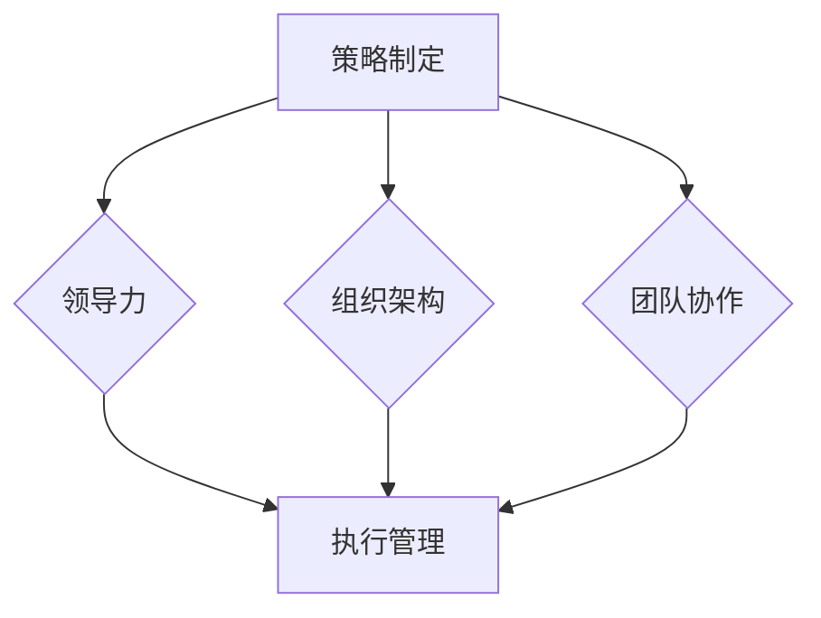

# 管理艺术：从策略到执行

> 关键词：管理艺术、策略制定、执行管理、领导力、组织架构、团队协作

## 1. 背景介绍

在信息技术日新月异的今天，企业面临着前所未有的挑战和机遇。如何在这个快速变化的环境中制定有效的策略，并将其成功执行，成为了企业能否持续发展的关键。管理艺术，就是在这个过程中所体现的一种深层次的能力，它涵盖了从策略制定到执行管理的全过程。

### 1.1 管理艺术的兴起

随着知识经济的到来，管理艺术的重要性日益凸显。传统的管理方法往往侧重于流程和规则的制定，而忽视了人的因素和环境的动态变化。管理艺术则强调以人为本，关注领导力、团队协作和组织架构的优化，从而实现战略的有效执行。

### 1.2 管理艺术的核心要素

管理艺术的核心要素包括：

- **策略制定**：明确企业的愿景、使命和目标，制定相应的战略规划。
- **领导力**：激发团队成员的潜能，引导团队朝着既定目标前进。
- **组织架构**：构建合理的组织结构，确保资源的有效配置和信息的流畅传递。
- **团队协作**：促进团队成员之间的沟通与协作，实现团队效能的最大化。
- **执行管理**：确保战略目标的顺利实施，并对执行过程进行监控和调整。

## 2. 核心概念与联系

### 2.1 核心概念原理

管理艺术的核心理念可以用以下Mermaid流程图来表示：

在这个图中，策略制定是整个管理过程的起点，它决定了企业的发展方向。领导力、组织架构和团队协作则是实现策略的关键因素，它们共同作用于执行管理，确保战略目标的实现。

### 2.2 架构联系

- **策略制定**为组织提供了明确的目标和方向，是整个管理过程的指南针。
- **领导力**是推动组织前进的核心动力，它激励团队成员为实现战略目标而努力。
- **组织架构**为组织提供了合理的框架，确保了资源的有效配置和信息的流畅传递。
- **团队协作**是实现组织目标的基础，它促进了团队成员之间的沟通与协作。
- **执行管理**是整个管理过程的核心环节，它确保了战略目标的顺利实施，并对执行过程进行监控和调整。

## 3. 核心算法原理 & 具体操作步骤

### 3.1 算法原理概述

管理艺术并没有特定的算法，它更是一种综合性的管理理念。然而，我们可以将其核心原理概括为以下几个步骤：

1. **明确目标**：确定企业的愿景、使命和战略目标。
2. **分析环境**：评估外部环境和内部资源，制定相应的应对策略。
3. **制定计划**：制定详细的执行计划，包括时间表、预算、责任分配等。
4. **领导与沟通**：建立有效的领导力，确保团队成员明确目标并积极参与。
5. **执行监控**：对执行过程进行实时监控，及时调整策略和计划。
6. **评估与改进**：对执行结果进行评估，总结经验教训，持续改进。

### 3.2 算法步骤详解

1. **明确目标**：通过愿景陈述、使命宣言和战略规划，明确企业的长期和短期目标。
2. **分析环境**：利用SWOT分析、PEST分析等方法，全面评估外部环境和内部资源。
3. **制定计划**：根据环境分析和目标设定，制定详细的执行计划，包括时间表、预算、责任分配、风险管理等。
4. **领导与沟通**：建立有效的领导力，通过沟通、激励和授权，确保团队成员明确目标并积极参与。
5. **执行监控**：设立关键绩效指标(KPI)，对执行过程进行实时监控，及时发现问题和风险。
6. **评估与改进**：定期对执行结果进行评估，分析成功和失败的原因，总结经验教训，持续改进管理实践。

### 3.3 算法优缺点

**优点**：

- **系统性强**：管理艺术强调从战略到执行的全面性，确保了管理的系统性。
- **灵活性高**：管理艺术注重适应环境变化，能够灵活调整战略和计划。
- **以人为本**：管理艺术强调人的因素，关注团队成员的成长和发展。

**缺点**：

- **实施难度大**：管理艺术需要管理者具备较高的综合素质，实施难度较大。
- **评价标准不明确**：管理艺术的效果难以量化，评价标准不明确。
- **容易流于形式**：管理艺术容易被误解为一种形式主义，缺乏实际效果。

### 3.4 算法应用领域

管理艺术适用于所有类型的企业和组织，无论是初创公司、成长型企业还是成熟企业，都需要管理艺术的指导。

## 4. 数学模型和公式 & 详细讲解 & 举例说明

### 4.1 数学模型构建

管理艺术的数学模型可以概括为以下公式：

$$
\text{管理艺术} = \text{战略制定} \times \text{领导力} \times \text{组织架构} \times \text{团队协作} \times \text{执行管理}
$$

这个公式表明，管理艺术是多个因素相互作用的产物，任何一个因素的缺失或不足都会影响管理艺术的最终效果。

### 4.2 公式推导过程

该公式的推导过程如下：

- **战略制定**：明确企业的愿景、使命和目标，是管理艺术的起点。
- **领导力**：通过激发团队成员的潜能，推动组织朝着目标前进。
- **组织架构**：为组织提供合理的框架，确保资源的有效配置和信息的流畅传递。
- **团队协作**：促进团队成员之间的沟通与协作，实现团队效能的最大化。
- **执行管理**：确保战略目标的顺利实施，并对执行过程进行监控和调整。

这些因素相互作用，共同构成了管理艺术的完整体系。

### 4.3 案例分析与讲解

以下是一个管理艺术的应用案例：

**案例背景**：某创业公司希望开发一款面向年轻人的社交应用，希望通过创新的产品设计和运营策略，在竞争激烈的市场中脱颖而出。

**管理艺术实践**：

1. **明确目标**：公司明确了产品的愿景是成为年轻人的首选社交平台，使命是连接年轻人，创造美好回忆。
2. **分析环境**：通过市场调研，公司了解到年轻人对社交应用的需求，并分析了竞争对手的优势和劣势。
3. **制定计划**：公司制定了详细的产品开发、市场推广和运营策略，包括时间表、预算、责任分配等。
4. **领导与沟通**：公司创始人亲自担任产品经理，与团队成员保持密切沟通，确保目标一致。
5. **执行监控**：公司设立了KPI，对产品上线后的用户增长、活跃度、留存率等指标进行实时监控。
6. **评估与改进**：根据用户反馈和运营数据，公司不断优化产品功能和运营策略，提高用户满意度。

**案例结果**：该社交应用在上线后迅速获得了用户的认可，用户数量快速增长，成为市场上的热门应用。

## 5. 项目实践：代码实例和详细解释说明

### 5.1 开发环境搭建

由于管理艺术属于管理领域的概念，而非编程领域的算法，因此本章节将不涉及具体的代码实例。但是，我们可以通过以下步骤来模拟一个管理艺术的项目实践：

1. **组建团队**：根据项目需求，组建一支具备不同技能的团队，包括产品经理、设计师、开发人员、市场人员等。
2. **明确目标**：与团队成员共同讨论，明确项目的愿景、使命和目标。
3. **制定计划**：制定详细的项目计划，包括时间表、预算、责任分配等。
4. **执行监控**：对项目执行过程进行实时监控，及时发现问题和风险。
5. **评估与改进**：对项目结果进行评估，总结经验教训，持续改进管理实践。

### 5.2 源代码详细实现

由于管理艺术不涉及具体的编程实现，因此本章节将不提供源代码。

### 5.3 代码解读与分析

本章节同样不涉及代码解读和分析。

### 5.4 运行结果展示

由于管理艺术不涉及具体的编程实现，因此本章节将不展示运行结果。

## 6. 实际应用场景

### 6.1 企业管理

管理艺术在企业中的应用场景非常广泛，包括：

- **战略规划**：制定企业的长期和短期目标，确保企业持续发展。
- **组织变革**：优化组织结构，提升组织效能。
- **人力资源管理**：激发员工潜能，提升员工满意度。
- **市场营销**：制定有效的营销策略，提升品牌知名度。

### 6.2 项目管理

在项目管理中，管理艺术可以用于：

- **项目规划**：制定详细的项目计划，确保项目按计划推进。
- **风险管理**：识别和评估项目风险，制定应对策略。
- **团队管理**：激发团队成员的潜能，确保项目团队的高效协作。

### 6.3 人力资源管理

在人力资源管理中，管理艺术可以用于：

- **招聘与选拔**：制定有效的招聘策略，选拔合适的员工。
- **培训与发展**：提供员工培训，提升员工技能和素质。
- **绩效管理**：制定合理的绩效评估体系，激发员工积极性。

## 7. 工具和资源推荐

### 7.1 学习资源推荐

- 《管理学》
- 《执行》
- 《第五项修炼》
- 《从优秀到卓越》

### 7.2 开发工具推荐

- 项目管理工具：如Jira、Trello等
- 团队协作工具：如Slack、Microsoft Teams等

### 7.3 相关论文推荐

- 《管理艺术》
- 《领导力》
- 《组织行为学》
- 《项目管理》

## 8. 总结：未来发展趋势与挑战

### 8.1 研究成果总结

管理艺术作为一门综合性的管理理念，在过去的几十年中取得了显著的成果。它为企业提供了有效的管理工具，帮助企业在竞争激烈的市场中取得成功。

### 8.2 未来发展趋势

未来，管理艺术将朝着以下几个方向发展：

- **更加注重人本管理**：随着知识经济的到来，人的因素将越来越重要，管理艺术将更加注重激发员工的潜能，提升员工的幸福感和满意度。
- **更加关注敏捷管理**：在快速变化的市场环境中，企业需要更加灵活的管理模式，管理艺术将更加注重敏捷管理，以适应市场的快速变化。
- **更加重视数据驱动**：数据将成为企业的重要资产，管理艺术将更加注重数据驱动，通过数据分析来指导管理决策。

### 8.3 面临的挑战

管理艺术在未来的发展中也将面临以下挑战：

- **管理观念的转变**：需要企业和管理者转变传统的管理观念，更加注重人本管理、敏捷管理和数据驱动。
- **管理工具的更新**：需要开发更加先进的管理工具，以支持管理艺术的实践。
- **管理人才的培养**：需要培养更多具备管理艺术素养的管理人才。

### 8.4 研究展望

未来，管理艺术的研究将更加注重以下方向：

- **跨文化管理**：研究不同文化背景下管理艺术的适用性。
- **伦理管理**：研究管理艺术在伦理道德方面的应用。
- **可持续发展管理**：研究管理艺术在可持续发展方面的应用。

## 9. 附录：常见问题与解答

**Q1：管理艺术和管理学有什么区别？**

A：管理学是一门学科，研究管理的理论和实践。而管理艺术则是一种综合性的管理理念，它强调以人为本，关注领导力、团队协作和组织架构的优化。

**Q2：如何提升管理艺术的能力？**

A：提升管理艺术的能力需要不断学习和实践。可以通过阅读管理书籍、参加管理培训、参与管理实践等方式来提升管理艺术的能力。

**Q3：管理艺术在企业管理中的具体应用有哪些？**

A：管理艺术在企业管理中的应用非常广泛，包括战略规划、组织变革、人力资源管理、市场营销、项目管理等方面。

**Q4：管理艺术是否适用于所有组织？**

A：管理艺术适用于所有类型的组织，无论是企业、政府机构还是非营利组织。

**Q5：如何将管理艺术应用于个人管理？**

A：个人管理也可以借鉴管理艺术的理念，如制定个人目标、提升个人能力、优化个人时间管理等。

---

作者：禅与计算机程序设计艺术 / Zen and the Art of Computer Programming