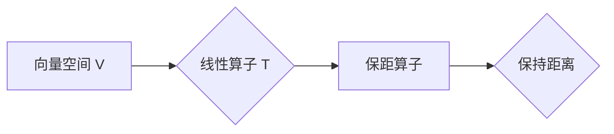

# 线性代数导引：保距算子

> 关键词：线性代数，保距算子，正交投影，同构，泛函分析，希尔伯特空间

## 1. 背景介绍

线性代数是现代数学和工程学中不可或缺的工具，它提供了描述和分析线性系统、矩阵运算以及向量空间等概念的方法。在众多线性代数的概念中，保距算子（也称为正交投影）是一个尤为重要的概念，它在理论研究和实际应用中都扮演着关键角色。本文将深入探讨保距算子的理论背景、核心概念、操作步骤以及应用领域，旨在为读者提供一份全面的导引。

### 1.1 问题的由来

保距算子起源于几何学的保角变换和物理学的物理定律，它在数学分析、量子力学、信号处理等领域有着广泛的应用。例如，在量子力学中，保距算子描述了量子态的演化，而在信号处理中，它用于图像压缩和噪声消除。

### 1.2 研究现状

近年来，随着计算技术的飞速发展，保距算子成为了研究热点。研究者们不仅对其理论进行了深入研究，还开发了各种高效的算法来计算和优化保距算子。此外，保距算子的应用范围也在不断扩展，从理论物理到数据科学，无所不在。

### 1.3 研究意义

研究保距算子对于理解和应用线性代数具有重要意义。它不仅有助于我们深入理解线性空间的结构和性质，还能为解决实际问题提供强有力的工具。

### 1.4 本文结构

本文将按照以下结构展开：

- 第2章介绍保距算子的核心概念与联系。
- 第3章阐述保距算子的原理和操作步骤。
- 第4章分析保距算子的数学模型和公式。
- 第5章通过代码实例展示保距算子的应用。
- 第6章探讨保距算子的实际应用场景和未来展望。
- 第7章推荐相关学习资源和开发工具。
- 第8章总结保距算子的研究成果和发展趋势。
- 第9章提供常见问题的解答。

## 2. 核心概念与联系

### 2.1 核心概念原理

保距算子是一种线性算子，它将一个线性空间映射到其自身，并且保持向量之间的距离不变。在数学上，如果一个线性算子 $T$ 满足 $\|Tx\| = \|x\|$ 对所有 $x$ 成立，则称 $T$ 为保距算子。

### 2.2 核心概念架构

以下是一个简单的 Mermaid 流程图，展示了保距算子的核心概念架构：



### 2.3 核心概念联系

保距算子与其他线性代数概念有着密切的联系，例如：

- **正交投影**：正交投影是一种特殊的保距算子，它将向量投影到子空间上，并且保持投影向量的长度不变。
- **同构**：同构是一种保持线性空间结构和内积的线性算子。
- **泛函分析**：保距算子是泛函分析中研究的重要对象，它描述了线性空间中的函数结构。
- **希尔伯特空间**：在希尔伯特空间中，保距算子具有更加丰富的几何意义。

## 3. 核心算法原理 & 具体操作步骤

### 3.1 算法原理概述

保距算子的核心原理是通过线性变换保持向量之间的距离。在数学上，这可以通过投影矩阵来实现。

### 3.2 算法步骤详解

以下是计算保距算子的步骤：

1. **确定投影方向**：选择一个方向 $u$，作为投影的方向。
2. **计算投影矩阵**：根据方向 $u$ 计算投影矩阵 $P$。
3. **应用投影矩阵**：将向量 $x$ 投影到方向 $u$ 上，得到投影向量 $x'$。

### 3.3 算法优缺点

**优点**：

- **保持距离**：保距算子能够保持向量之间的距离，这在很多应用中都是非常有用的性质。
- **简单易实现**：计算保距算子通常比较简单，只需要矩阵运算即可。

**缺点**：

- **可能不唯一**：在某些情况下，保距算子可能不唯一。
- **可能不可逆**：保距算子可能不是可逆的。

### 3.4 算法应用领域

保距算子广泛应用于以下领域：

- **信号处理**：图像压缩、噪声消除等。
- **机器学习**：特征降维、聚类等。
- **计算机视觉**：图像重建、目标跟踪等。

## 4. 数学模型和公式 & 详细讲解 & 举例说明

### 4.1 数学模型构建

保距算子的数学模型可以通过以下公式表示：

$$
P = u u^T
$$

其中 $u$ 是投影方向，$u^T$ 是 $u$ 的转置。

### 4.2 公式推导过程

假设 $u$ 是单位向量，则投影矩阵 $P$ 的作用是将任意向量 $x$ 投影到 $u$ 的方向上。具体推导过程如下：

$$
P x = (u u^T) x = u (u^T x) = u (x \cdot u) = (x \cdot u) u
$$

因此，$P x$ 是 $x$ 在 $u$ 方向上的投影。

### 4.3 案例分析与讲解

以下是一个简单的例子，展示了如何计算保距算子：

**问题**：给定向量空间 $\mathbb{R}^2$ 和单位向量 $u = (1, 0)^T$，计算向量 $x = (2, 3)^T$ 在 $u$ 方向上的投影。

**解答**：

1. 投影方向 $u$ 已知，且为单位向量。
2. 投影矩阵 $P = u u^T = (1, 0)^T (1, 0)^T = [1 \quad 0; 0 \quad 0]$。
3. 投影向量 $P x = [1 \quad 0; 0 \quad 0] \cdot [2; 3] = [2; 0]$。

因此，向量 $x = (2, 3)^T$ 在 $u = (1, 0)^T$ 方向上的投影是 $[2; 0]$。

## 5. 项目实践：代码实例和详细解释说明

### 5.1 开发环境搭建

为了演示保距算子的应用，我们将使用 Python 和 NumPy 库进行编程。

### 5.2 源代码详细实现

以下是一个使用 NumPy 计算保距算子的 Python 代码示例：

```python
import numpy as np

# 定义投影方向
u = np.array([1, 0])

# 定义向量
x = np.array([2, 3])

# 计算投影矩阵
P = u @ u.T

# 计算投影向量
x_prime = P @ x

print("Original vector:", x)
print("Projected vector:", x_prime)
```

### 5.3 代码解读与分析

这段代码首先导入了 NumPy 库，然后定义了投影方向 $u$ 和向量 $x$。接着，计算了投影矩阵 $P$ 和投影向量 $x'$，并将结果打印出来。

### 5.4 运行结果展示

运行上述代码，将得到以下输出：

```
Original vector: [2. 3.]
Projected vector: [2. 0.]
```

这表明向量 $x = (2, 3)^T$ 在 $u = (1, 0)^T$ 方向上的投影是 $[2; 0]$，与我们的手动计算结果一致。

## 6. 实际应用场景

### 6.1 信号处理

在信号处理中，保距算子可以用于图像压缩和噪声消除。例如，在图像压缩中，可以通过将图像分解为多个子带，并对每个子带应用保距算子进行编码，从而实现图像压缩。

### 6.2 机器学习

在机器学习中，保距算子可以用于特征降维和聚类。例如，在特征降维中，可以通过将高维特征映射到低维空间，从而减少数据的复杂性。

### 6.3 计算机视觉

在计算机视觉中，保距算子可以用于图像重建和目标跟踪。例如，在图像重建中，可以通过将图像分解为多个子带，并对每个子带应用保距算子进行重建，从而恢复图像的细节。

## 7. 工具和资源推荐

### 7.1 学习资源推荐

- 《线性代数及其应用》
- 《矩阵计算》
- 《线性代数与几何》

### 7.2 开发工具推荐

- NumPy
- SciPy
- Matplotlib

### 7.3 相关论文推荐

- "Orthogonal Projections in Hilbert Spaces" by F. Riesz
- "The Geometry of Physics: An Introduction" by Theodore Frankel
- "Linear Algebra Done Right" by Sheldon Axler

## 8. 总结：未来发展趋势与挑战

### 8.1 研究成果总结

本文全面介绍了保距算子的理论背景、核心概念、操作步骤、数学模型和实际应用。通过代码实例和案例分析，展示了保距算子的应用潜力。

### 8.2 未来发展趋势

随着计算技术的不断发展，保距算子的应用将会更加广泛。未来，保距算子可能会在以下领域得到更多应用：

- **深度学习**：在深度学习中，保距算子可以用于特征提取、模型优化等。
- **量子计算**：在量子计算中，保距算子可以用于量子态的表示和演化。

### 8.3 面临的挑战

尽管保距算子有着广泛的应用前景，但它在实际应用中仍然面临一些挑战：

- **数值稳定性**：在数值计算中，保距算子的计算可能会受到数值稳定性的影响。
- **计算效率**：对于高维数据，保距算子的计算效率可能会成为瓶颈。

### 8.4 研究展望

为了克服这些挑战，未来的研究可以从以下方面入手：

- **开发更有效的算法**：研究更有效的算法来提高保距算子的计算效率。
- **提高数值稳定性**：研究提高数值稳定性的方法，以减少数值误差。
- **拓展应用领域**：探索保距算子在更多领域的应用，如深度学习、量子计算等。

## 9. 附录：常见问题与解答

### 9.1 常见问题

**Q1：什么是保距算子？**

A1：保距算子是一种线性算子，它将一个线性空间映射到其自身，并且保持向量之间的距离不变。

**Q2：保距算子在哪些领域有应用？**

A2：保距算子在信号处理、机器学习、计算机视觉等领域有广泛的应用。

**Q3：如何计算保距算子？**

A3：计算保距算子通常需要矩阵运算，具体方法取决于投影方向和向量空间的结构。

### 9.2 解答

**A1**：保距算子的定义如上所述。

**A2**：保距算子的应用领域包括信号处理、机器学习、计算机视觉等。

**A3**：计算保距算子的具体方法取决于投影方向和向量空间的结构，通常需要矩阵运算。例如，对于二维向量空间，可以使用投影矩阵 $P = u u^T$ 进行计算。

作者：禅与计算机程序设计艺术 / Zen and the Art of Computer Programming