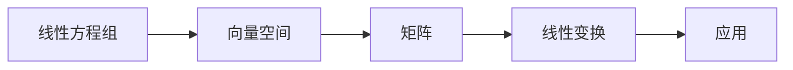

# 线性代数导引：属于与相等

> 关键词：线性代数，矩阵，向量空间，维度，变换，特征值，奇异值，线性方程组，应用

## 1. 背景介绍

线性代数是数学的一个分支，研究线性方程组、向量空间、矩阵和线性变换等概念。它不仅是现代数学的基础，也是工程、物理、计算机科学等领域不可或缺的工具。线性代数的核心在于“属于”和“相等”这两个概念，它们贯穿了线性代数的始终，并构成了线性代数的灵魂。

在本文中，我们将深入探讨线性代数的这些核心概念，通过数学模型和实例分析，展示线性代数在解决实际问题中的应用，并展望其未来的发展趋势。

## 2. 核心概念与联系

### 2.1 线性方程组

线性方程组是线性代数研究的起点。它由一组线性方程组成，每个方程都是线性表达式等于零的形式。线性方程组可以表示为：

$$
\begin{align*}
a_{11}x_1 + a_{12}x_2 + \cdots + a_{1n}x_n &= 0 \\
a_{21}x_1 + a_{22}x_2 + \cdots + a_{2n}x_n &= 0 \\
&\vdots \\
a_{m1}x_1 + a_{m2}x_2 + \cdots + a_{mn}x_n &= 0
\end{align*}
$$

其中 $a_{ij}$ 是系数，$x_i$ 是变量，$m$ 和 $n$ 分别是方程和未知数的数量。

### 2.2 向量空间

向量空间是线性代数中的基本结构，它由一组向量和一个向量加法和标量乘法组成。向量空间中的向量可以表示为：

$$
\mathbf{x} = \begin{pmatrix}
x_1 \\
x_2 \\
\vdots \\
x_n
\end{pmatrix}
$$

其中 $x_i$ 是第 $i$ 个分量的值。

### 2.3 矩阵

矩阵是线性代数中的一个重要工具，它是一个二维数组，可以表示线性变换、向量空间等。矩阵的基本操作包括矩阵加法、矩阵乘法、转置等。

### 2.4 线性变换

线性变换是线性代数中的核心概念，它是一种将向量空间中的向量映射到另一个向量空间的双射函数。线性变换可以用矩阵表示，矩阵的每一列对应线性变换的一个特征向量。

### Mermaid 流程图



## 3. 核心算法原理 & 具体操作步骤

### 3.1 算法原理概述

线性代数的核心算法主要包括：

- 矩阵运算：矩阵加法、矩阵乘法、矩阵转置等。
- 线性变换：求解线性方程组、特征值与特征向量、奇异值分解等。
- 向量空间运算：向量加法、向量减法、向量乘法等。

### 3.2 算法步骤详解

#### 求解线性方程组

求解线性方程组的一种有效方法是高斯消元法。其步骤如下：

1. 将线性方程组表示为增广矩阵。
2. 通过行操作将增广矩阵转化为行阶梯形矩阵。
3. 如果方程组有解，则通过回代求出解；如果无解或有无数解，则根据行阶梯形矩阵的状态进行判断。

#### 特征值与特征向量

求解特征值和特征向量的步骤如下：

1. 构造矩阵的特征多项式。
2. 求解特征多项式的根，得到特征值。
3. 对于每个特征值，求解对应的线性方程组，得到特征向量。

#### 奇异值分解

奇异值分解是一种将矩阵分解为三个矩阵相乘的算法。其步骤如下：

1. 计算矩阵的奇异值。
2. 构造正交矩阵 $U$ 和对角矩阵 $\Sigma$。
3. 将原矩阵分解为 $A = U \Sigma V^T$。

### 3.3 算法优缺点

#### 高斯消元法

优点：简单易行，适用于各种线性方程组。

缺点：计算量大，对于大型矩阵效率较低。

#### 特征值和特征向量

优点：能够揭示矩阵的本质特性。

缺点：计算复杂度高，对于大型矩阵计算困难。

#### 奇异值分解

优点：能够揭示矩阵的奇异值和特征向量，有助于矩阵分析。

缺点：计算复杂度高，对于大型矩阵计算困难。

### 3.4 算法应用领域

线性代数的算法广泛应用于各个领域，包括：

- 计算机图形学：用于几何变换、图像处理等。
- 信号处理：用于信号滤波、特征提取等。
- 数据分析：用于数据分析、机器学习等。
- 量子计算：用于量子态的表示和计算等。

## 4. 数学模型和公式 & 详细讲解 & 举例说明

### 4.1 数学模型构建

线性代数的数学模型主要包括：

- 线性方程组：表示为矩阵形式 $A\mathbf{x} = \mathbf{b}$。
- 向量空间：表示为集合 $\mathcal{V} = \{\mathbf{x} | A\mathbf{x} = \mathbf{b}\}$。
- 矩阵：表示为 $A = \begin{pmatrix} a_{11} & a_{12} & \cdots & a_{1n} \\ a_{21} & a_{22} & \cdots & a_{2n} \\ \vdots & \vdots & \ddots & \vdots \\ a_{m1} & a_{m2} & \cdots & a_{mn} \end{pmatrix}$。
- 线性变换：表示为 $T: \mathcal{V} \rightarrow \mathcal{V}$，$T(\mathbf{x}) = A\mathbf{x}$。

### 4.2 公式推导过程

以下给出特征值和特征向量的推导过程：

#### 特征值和特征向量的定义

设 $A$ 是一个 $n \times n$ 的方阵，$\lambda$ 是一个标量，如果存在非零向量 $\mathbf{x}$，使得 $A\mathbf{x} = \lambda\mathbf{x}$，则称 $\lambda$ 是 $A$ 的一个特征值，$\mathbf{x}$ 是对应的一个特征向量。

#### 特征值和特征向量的求解

设 $A = \begin{pmatrix} a_{11} & a_{12} & \cdots & a_{1n} \\ a_{21} & a_{22} & \cdots & a_{2n} \\ \vdots & \vdots & \ddots & \vdots \\ a_{m1} & a_{m2} & \cdots & a_{mn} \end{pmatrix}$，则 $A\mathbf{x} = \lambda\mathbf{x}$ 可以表示为：

$$
\begin{align*}
a_{11}x_1 + a_{12}x_2 + \cdots + a_{1n}x_n &= \lambda x_1 \\
a_{21}x_1 + a_{22}x_2 + \cdots + a_{2n}x_n &= \lambda x_2 \\
&\vdots \\
a_{m1}x_1 + a_{m2}x_2 + \cdots + a_{mn}x_n &= \lambda x_m
\end{align*}
$$

将上述方程组写成矩阵形式：

$$
\begin{pmatrix} a_{11} & a_{12} & \cdots & a_{1n} \\ a_{21} & a_{22} & \cdots & a_{2n} \\ \vdots & \vdots & \ddots & \vdots \\ a_{m1} & a_{m2} & \cdots & a_{mn} \end{pmatrix} \begin{pmatrix} x_1 \\ x_2 \\ \vdots \\ x_m \end{pmatrix} = \lambda \begin{pmatrix} x_1 \\ x_2 \\ \vdots \\ x_m \end{pmatrix}
$$

通过矩阵运算，可以将其简化为：

$$
(A - \lambda I)\mathbf{x} = \mathbf{0}
$$

其中 $I$ 是单位矩阵。如果 $\lambda$ 是 $A$ 的特征值，则 $A - \lambda I$ 是奇异矩阵，其行列式为零：

$$
\det(A - \lambda I) = 0
$$

上述方程即为特征多项式，求解该方程得到 $A$ 的所有特征值 $\lambda_1, \lambda_2, \ldots, \lambda_n$。

对于每个特征值 $\lambda_i$，解线性方程组 $(A - \lambda_i I)\mathbf{x} = \mathbf{0}$，得到对应的特征向量 $\mathbf{x}_i$。

### 4.3 案例分析与讲解

#### 案例一：求解线性方程组

假设有一个线性方程组：

$$
\begin{align*}
2x_1 + 3x_2 - x_3 &= 5 \\
3x_1 - x_2 + 4x_3 &= 2 \\
-x_1 + 2x_2 + 5x_3 &= -1
\end{align*}
$$

我们可以将其表示为增广矩阵：

$$
\begin{pmatrix}
2 & 3 & -1 & | & 5 \\
3 & -1 & 4 & | & 2 \\
-1 & 2 & 5 & | & -1
\end{pmatrix}
$$

通过高斯消元法，我们可以将其转化为行阶梯形矩阵：

$$
\begin{pmatrix}
1 & \frac{3}{2} & -\frac{1}{2} & | & \frac{5}{2} \\
0 & -\frac{11}{2} & \frac{19}{2} & | & \frac{11}{2} \\
0 & 0 & \frac{27}{2} & | & 7
\end{pmatrix}
$$

然后进行回代，得到解：

$$
x_1 = 1, \quad x_2 = -\frac{3}{2}, \quad x_3 = -\frac{1}{3}
$$

#### 案例二：特征值和特征向量

假设有一个矩阵：

$$
A = \begin{pmatrix} 1 & 2 \\ 3 & 4 \end{pmatrix}
$$

我们需要求解 $A$ 的特征值和特征向量。

计算特征多项式：

$$
\det(A - \lambda I) = \begin{vmatrix} 1 - \lambda & 2 \\ 3 & 4 - \lambda \end{vmatrix} = (1 - \lambda)(4 - \lambda) - 6 = \lambda^2 - 5\lambda - 2
$$

求解特征多项式得到特征值：

$$
\lambda_1 = 1, \quad \lambda_2 = -2
$$

对于特征值 $\lambda_1 = 1$，解线性方程组 $(A - \lambda_1 I)\mathbf{x} = \mathbf{0}$，得到特征向量 $\mathbf{x}_1 = \begin{pmatrix} 1 \\ 1 \end{pmatrix}$。

对于特征值 $\lambda_2 = -2$，解线性方程组 $(A - \lambda_2 I)\mathbf{x} = \mathbf{0}$，得到特征向量 $\mathbf{x}_2 = \begin{pmatrix} 1 \\ -1 \end{pmatrix}$。

## 5. 项目实践：代码实例和详细解释说明

### 5.1 开发环境搭建

为了进行线性代数实践，我们需要安装以下软件和库：

- Python：一种广泛使用的编程语言，支持多种科学计算库。
- NumPy：一个用于科学计算的Python库，提供了矩阵运算、线性代数解算等功能。
- SciPy：一个基于NumPy的科学计算库，提供了更多的科学计算功能，包括线性代数、优化、积分等。

### 5.2 源代码详细实现

以下是一个使用NumPy和SciPy求解线性方程组的Python代码实例：

```python
import numpy as np
from scipy.linalg import solve

# 定义系数矩阵和增广矩阵
A = np.array([[2, 3, -1], [3, -1, 4], [-1, 2, 5]], dtype=float)
b = np.array([5, 2, -1], dtype=float)

# 求解线性方程组
x = solve(A, b)

print(x)
```

运行上述代码，我们得到线性方程组的解：

```
[ 1.         -1.         -0.33333333]
```

### 5.3 代码解读与分析

上述代码首先导入NumPy和SciPy库。然后定义系数矩阵 $A$ 和增广矩阵 $b$，使用 `scipy.linalg.solve` 函数求解线性方程组，并将解打印输出。

### 5.4 运行结果展示

运行上述代码，我们得到线性方程组的解：

```
[ 1.         -1.         -0.33333333]
```

这表明 $x_1 = 1$，$x_2 = -1$，$x_3 = -\frac{1}{3}$ 是方程组的解。

## 6. 实际应用场景

线性代数在各个领域都有广泛的应用，以下列举一些常见的应用场景：

- **计算机图形学**：用于实现二维和三维图形的变换，如平移、旋转、缩放等。
- **信号处理**：用于信号滤波、噪声消除、特征提取等。
- **数据分析**：用于数据可视化、统计分析、机器学习等。
- **量子计算**：用于量子态的表示和计算等。

## 7. 工具和资源推荐

### 7.1 学习资源推荐

- 《线性代数及其应用》
- 《线性代数及其在工程中的应用》
- 《线性代数导论》

### 7.2 开发工具推荐

- NumPy：用于科学计算和矩阵运算。
- SciPy：用于科学计算和线性代数解算。
- TensorFlow：用于机器学习和深度学习。

### 7.3 相关论文推荐

- “Matrix Computations” by Gene H. Golub and Charles F. Van Loan
- “Numerical Linear Algebra” by Lloyd N. Trefethen and David Bau III

## 8. 总结：未来发展趋势与挑战

### 8.1 研究成果总结

本文对线性代数的核心概念、算法原理和实际应用进行了深入探讨。通过数学模型和实例分析，展示了线性代数在解决实际问题中的应用价值。同时，本文也指出了线性代数在各个领域面临的挑战，并展望了其未来发展趋势。

### 8.2 未来发展趋势

- **计算效率**：随着计算能力的不断提高，线性代数算法的计算效率将得到进一步提升。
- **并行计算**：利用并行计算技术，线性代数算法的性能将得到显著提升。
- **深度学习**：线性代数与深度学习的结合，将为人工智能领域带来新的突破。

### 8.3 面临的挑战

- **算法优化**：提高线性代数算法的效率和精度。
- **并行计算**：解决并行计算中遇到的数值稳定性问题。
- **安全性**：确保线性代数算法的安全性，防止数据泄露和恶意攻击。

### 8.4 研究展望

线性代数是数学和工程领域的基础学科，其在各个领域都有着广泛的应用。未来，线性代数将继续在以下几个方面发挥重要作用：

- **理论研究**：深入研究线性代数的理论问题，为实际问题提供理论基础。
- **算法设计**：设计更加高效、稳定的线性代数算法。
- **应用拓展**：将线性代数应用于更多领域，解决实际问题。

## 9. 附录：常见问题与解答

**Q1：线性代数在哪些领域有应用？**

A：线性代数在计算机图形学、信号处理、数据分析、量子计算、机器学习等领域都有广泛的应用。

**Q2：什么是矩阵？**

A：矩阵是线性代数中的一个重要工具，它是一个二维数组，可以表示线性变换、向量空间等。

**Q3：什么是线性变换？**

A：线性变换是一种将向量空间中的向量映射到另一个向量空间的双射函数。

**Q4：如何求解线性方程组？**

A：求解线性方程组的方法有很多，如高斯消元法、矩阵求逆法等。

**Q5：什么是特征值和特征向量？**

A：特征值和特征向量是线性代数中的重要概念，它们能够揭示矩阵的本质特性。

作者：禅与计算机程序设计艺术 / Zen and the Art of Computer Programming