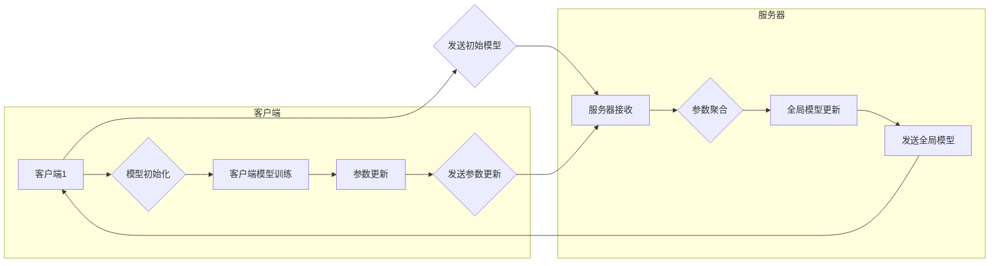

> 关键词：联邦学习，隐私保护，协同学习，分布式计算，机器学习，模型训练

# 联邦学习 原理与代码实例讲解

联邦学习（Federated Learning）是一种先进的机器学习方法，旨在在不共享用户数据的情况下，通过分布式计算实现模型的共同训练。这种方法在保护用户隐私的同时，促进了模型在多个设备或服务器上的协同学习。本文将深入探讨联邦学习的原理，并通过代码实例讲解其具体实现。

## 1. 背景介绍

### 1.1 问题的由来

随着移动互联网的普及，越来越多的数据被收集和存储在云端服务器上。然而，用户对隐私保护的需求日益增长，要求企业尊重和保护用户的个人信息。传统的集中式机器学习模型需要将所有数据集中在单个服务器上进行训练，这可能导致数据泄露的风险。

### 1.2 研究现状

联邦学习作为一种新兴技术，通过在用户端进行局部模型训练，然后将更新后的模型参数发送到中心服务器进行聚合，从而实现模型的共同训练。这种方法在保护用户隐私的同时，也克服了数据孤岛的问题。

### 1.3 研究意义

联邦学习具有以下重要意义：

- **隐私保护**：用户数据无需离开本地设备，有效保护用户隐私。
- **数据可用性**：无需集中存储大量数据，提高了数据的可用性。
- **协同学习**：不同设备或服务器上的模型可以协同训练，提高模型的泛化能力。
- **边缘计算**：将计算任务分散到边缘设备，减轻中心服务器的计算负担。

## 2. 核心概念与联系

### 2.1 核心概念

- **客户端**：运行局部训练任务的设备，如智能手机、物联网设备等。
- **服务器**：负责聚合客户端模型更新的中心节点。
- **模型参数**：模型中的可学习参数，如神经网络权重。
- **局部训练**：在客户端设备上进行的模型训练过程。
- **模型聚合**：将多个客户端的模型参数更新合并为全局模型参数。

### 2.2 架构流程图



### 2.3 关联概念

- **分布式学习**：多个客户端独立训练模型，然后将模型结果汇总。
- **去中心化学习**：去除中心服务器，客户端直接进行协作学习。
- **联邦平均（Federated Averaging, FedAvg）**：最常见的联邦学习算法，通过简单平均客户端参数更新来更新全局模型。

## 3. 核心算法原理 & 具体操作步骤

### 3.1 算法原理概述

联邦学习的基本原理是，在保护用户隐私的前提下，让多个客户端参与模型的共同训练。每个客户端在自己的数据集上训练局部模型，然后将更新后的模型参数发送到中心服务器进行聚合。服务器将收到的参数更新合并为全局模型参数，并返回给所有客户端。

### 3.2 算法步骤详解

1. **初始化**：服务器向所有客户端发送全局模型的初始参数。
2. **局部训练**：每个客户端使用本地数据对全局模型进行训练，并生成参数更新。
3. **参数更新**：客户端将参数更新发送到服务器。
4. **参数聚合**：服务器接收所有客户端的参数更新，并计算全局模型参数。
5. **全局模型更新**：服务器将全局模型参数发送回所有客户端。
6. **重复步骤2-5**：重复执行步骤2-5，直到满足停止条件。

### 3.3 算法优缺点

#### 优点

- **隐私保护**：用户数据无需离开本地设备，有效保护用户隐私。
- **数据可用性**：无需集中存储大量数据，提高了数据的可用性。
- **协同学习**：不同设备或服务器上的模型可以协同训练，提高模型的泛化能力。

#### 缺点

- **通信开销**：客户端需要向服务器发送参数更新，增加了通信开销。
- **同步问题**：不同客户端的局部训练进度可能不一致，可能导致同步问题。
- **模型效率**：由于需要频繁地发送和接收参数，可能降低模型训练效率。

### 3.4 算法应用领域

联邦学习适用于以下场景：

- **移动设备**：如智能手机、平板电脑等，可以保护用户隐私的同时提供个性化服务。
- **物联网设备**：如智能家电、可穿戴设备等，可以实现设备之间的协同操作。
- **边缘计算**：如智能家居、智能交通等，可以降低中心服务器的计算负担。

## 4. 数学模型和公式 & 详细讲解 & 举例说明

### 4.1 数学模型构建

假设全局模型参数为 $\theta_{global}$，客户端参数为 $\theta_{client}$，则联邦平均算法的数学模型如下：

$$
\theta_{global}^{(t+1)} = \frac{1}{N}\sum_{i=1}^{N} \theta_{client_i}^{(t+1)}
$$

其中，$t$ 表示迭代次数，$N$ 表示客户端数量。

### 4.2 公式推导过程

联邦平均算法的推导过程如下：

1. **初始化**：$\theta_{global}^{(0)} = \theta_0$，其中 $\theta_0$ 为全局模型的初始参数。
2. **局部训练**：客户端 $i$ 在本地数据集 $D_i$ 上训练局部模型，得到参数更新 $\Delta \theta_{client_i}^{(t)}$。
3. **参数更新**：客户端 $i$ 将参数更新 $\Delta \theta_{client_i}^{(t)}$ 发送到服务器。
4. **参数聚合**：服务器接收所有客户端的参数更新，计算全局模型参数：
   $$
\theta_{global}^{(t+1)} = \theta_{global}^{(t)} + \frac{1}{N}\sum_{i=1}^{N} \Delta \theta_{client_i}^{(t)}
$$
5. **全局模型更新**：服务器将全局模型参数 $\theta_{global}^{(t+1)}$ 发送回所有客户端。
6. **重复步骤2-5**：重复执行步骤2-5，直到满足停止条件。

### 4.3 案例分析与讲解

假设有两个客户端，分别拥有两个不同的数据集 $D_1$ 和 $D_2$，每个数据集包含100个样本。全局模型的初始参数为 $\theta_0 = [1, 2, 3]$。在第1次迭代中，客户端1在 $D_1$ 上训练得到参数更新 $\Delta \theta_{client_1}^{(1)} = [0.1, -0.1, 0.2]$，客户端2在 $D_2$ 上训练得到参数更新 $\Delta \theta_{client_2}^{(1)} = [-0.2, 0.3, -0.1]$。

根据联邦平均算法，全局模型参数更新为：

$$
\theta_{global}^{(1)} = \frac{1}{2}(\Delta \theta_{client_1}^{(1)} + \Delta \theta_{client_2}^{(1)}) = \frac{1}{2}([0.1, -0.1, 0.2] + [-0.2, 0.3, -0.1]) = [0.0, 0.1, 0.05]
$$

因此，全局模型参数更新为 $\theta_{global}^{(1)} = [0.0, 0.1, 0.05]$。

## 5. 项目实践：代码实例和详细解释说明

### 5.1 开发环境搭建

在进行联邦学习项目实践前，我们需要搭建以下开发环境：

- Python 3.7 或更高版本
- TensorFlow 或 PyTorch 深度学习框架
- TensorFlow Federated (TFF) 或 Federated Learning Framework (FLlib) 等联邦学习库

### 5.2 源代码详细实现

以下是一个使用 TensorFlow Federated (TFF) 实现联邦学习的简单示例：

```python
import tensorflow as tf
import tensorflow_federated as tff

# 定义模型
def create_model():
    model = tf.keras.Sequential([
        tf.keras.layers.Dense(64, activation='relu', input_shape=(10,)),
        tf.keras.layers.Dense(1, activation='sigmoid')
    ])
    return model

# 定义训练任务
def model_fn():
    model = create_model()
    loss = tf.keras.losses.BinaryCrossentropy()
    metric = tf.keras.metrics.BinaryAccuracy()
    return tff.learning.models.Model(
        model_fn=model,
        loss=loss,
        metrics=metric,
    )

# 定义客户端训练循环
def client_train_epoch(client_model, client_data):
    for batch in client_data:
        client_model = client_model.train_on_batch(batch[0], batch[1])
    return client_model

# 定义服务器训练循环
def server_train_epoch(client_models, server_data):
    client_model_updates = tff.learning.update_model(
        model_fn=model_fn(),
        client_models=client_models,
        client_data=server_data,
    )
    return client_model_updates

# 创建模拟数据
client_data = [([1, 2], 1), ([3, 4], 0), ([5, 6], 1)]
server_data = [([1, 2], 1), ([3, 4], 0), ([5, 6], 1)]

# 创建联邦学习算法
tff_model = tff.learning.build_federated_averaging_process(model_fn=model_fn())

# 运行联邦学习算法
client_models = [create_model() for _ in range(3)]
for epoch in range(5):
    client_model_updates = server_train_epoch(client_models, server_data)
    for client_id, client_model_update in enumerate(client_model_updates):
        client_models[client_id] = client_model_update.model
```

### 5.3 代码解读与分析

以上代码展示了使用 TensorFlow Federated (TFF) 实现联邦学习的基本流程：

- `create_model` 函数定义了一个简单的神经网络模型。
- `model_fn` 函数定义了模型训练相关的函数，包括损失函数和指标。
- `client_train_epoch` 函数定义了客户端的训练循环。
- `server_train_epoch` 函数定义了服务器的训练循环。
- `client_data` 和 `server_data` 分别表示客户端和服务器上的模拟数据。
- `tff_model` 创建了一个联邦学习算法实例。
- `client_models` 初始化了三个客户端模型。
- 运行联邦学习算法，进行5轮迭代。

通过以上代码，我们可以看到使用 TFF 进行联邦学习的简洁性。开发者可以轻松地将自己的模型和训练逻辑集成到 TFF 框架中，实现联邦学习应用。

### 5.4 运行结果展示

运行上述代码后，可以看到服务器训练循环的输出信息，包括每个客户端的模型更新和服务器聚合后的模型参数。通过多轮迭代，全局模型参数逐渐收敛。

## 6. 实际应用场景

联邦学习在以下场景中具有广泛的应用：

- **移动应用**：如智能手机、平板电脑等，可以保护用户隐私的同时提供个性化服务。
- **物联网设备**：如智能家电、可穿戴设备等，可以实现设备之间的协同操作。
- **边缘计算**：如智能家居、智能交通等，可以降低中心服务器的计算负担。
- **医疗健康**：如疾病预测、患者监控等，可以在保护患者隐私的同时，促进医疗健康数据的研究和应用。

## 7. 工具和资源推荐

### 7.1 学习资源推荐

- 《联邦学习：原理与实践》
- TensorFlow Federated 官方文档
- PySyft 官方文档
- 联邦学习入门教程

### 7.2 开发工具推荐

- TensorFlow Federated (TFF)
- PySyft
- Federated Learning Framework (FLlib)
- TensorFlow
- PyTorch

### 7.3 相关论文推荐

- "Federated Learning" by Michael I. Jordan
- "Federated Learning: Strategies for Improving Communication Efficiency" by Michael I. Jordan and Yin Lou
- "Communication-Efficient Learning of Deep Networks from Multiple Clients" by Michael I. Jordan, et al.

## 8. 总结：未来发展趋势与挑战

### 8.1 研究成果总结

本文深入介绍了联邦学习的原理和应用，并通过代码实例讲解了其具体实现。联邦学习作为一种新兴的机器学习方法，在保护用户隐私的同时，促进了模型在多个设备或服务器上的协同学习。未来，随着联邦学习技术的不断发展，其应用范围将更加广泛，为构建安全、可靠的智能系统提供有力支持。

### 8.2 未来发展趋势

- **更高效的算法**：研究更高效的联邦学习算法，降低通信开销和训练时间。
- **更安全的联邦学习**：加强联邦学习的安全性，防止数据泄露和模型篡改。
- **跨领域联邦学习**：研究跨领域联邦学习，实现不同领域数据的安全共享和协同学习。
- **联邦学习与其他技术的融合**：将联邦学习与其他技术（如区块链、加密算法等）进行融合，进一步提升其性能和安全性。

### 8.3 面临的挑战

- **通信开销**：联邦学习需要大量通信，如何降低通信开销是一个重要挑战。
- **同步问题**：不同客户端的训练进度可能不一致，如何保证同步是一个挑战。
- **模型效率**：如何提高联邦学习的模型效率，是一个需要解决的难题。
- **安全性**：如何保证联邦学习的安全性，防止数据泄露和模型篡改。

### 8.4 研究展望

未来，联邦学习将朝着以下方向发展：

- **更广泛的应用场景**：联邦学习将在更多领域得到应用，如医疗健康、金融、工业等。
- **更强大的模型能力**：联邦学习将能够训练更复杂的模型，解决更复杂的问题。
- **更安全的隐私保护**：联邦学习将提供更强大的隐私保护机制，保护用户隐私。
- **更高效的协同学习**：联邦学习将实现更高效的协同学习，提高模型的性能和泛化能力。

联邦学习作为一种新兴的机器学习方法，具有广阔的应用前景。相信随着技术的不断进步，联邦学习将为构建安全、可靠、高效的智能系统做出更大的贡献。

## 9. 附录：常见问题与解答

**Q1：联邦学习与集中式学习有何区别？**

A：集中式学习需要将所有数据集中在单个服务器上进行训练，而联邦学习在客户端进行局部训练，然后将更新后的模型参数发送到中心服务器进行聚合。

**Q2：联邦学习有哪些优点？**

A：联邦学习具有以下优点：
- 隐私保护：用户数据无需离开本地设备，有效保护用户隐私。
- 数据可用性：无需集中存储大量数据，提高了数据的可用性。
- 协同学习：不同设备或服务器上的模型可以协同训练，提高模型的泛化能力。

**Q3：联邦学习有哪些应用场景？**

A：联邦学习适用于以下场景：
- 移动应用：如智能手机、平板电脑等，可以保护用户隐私的同时提供个性化服务。
- 物联网设备：如智能家电、可穿戴设备等，可以实现设备之间的协同操作。
- 边缘计算：如智能家居、智能交通等，可以降低中心服务器的计算负担。
- 医疗健康：如疾病预测、患者监控等，可以在保护患者隐私的同时，促进医疗健康数据的研究和应用。

**Q4：联邦学习有哪些挑战？**

A：联邦学习面临以下挑战：
- 通信开销：联邦学习需要大量通信，如何降低通信开销是一个重要挑战。
- 同步问题：不同客户端的训练进度可能不一致，如何保证同步是一个挑战。
- 模型效率：如何提高联邦学习的模型效率，是一个需要解决的难题。
- 安全性：如何保证联邦学习的安全性，防止数据泄露和模型篡改。

**Q5：联邦学习有哪些发展趋势？**

A：联邦学习将朝着以下方向发展：
- 更广泛的应用场景：联邦学习将在更多领域得到应用，如医疗健康、金融、工业等。
- 更强大的模型能力：联邦学习将能够训练更复杂的模型，解决更复杂的问题。
- 更安全的隐私保护：联邦学习将提供更强大的隐私保护机制，保护用户隐私。
- 更高效的协同学习：联邦学习将实现更高效的协同学习，提高模型的性能和泛化能力。

作者：禅与计算机程序设计艺术 / Zen and the Art of Computer Programming