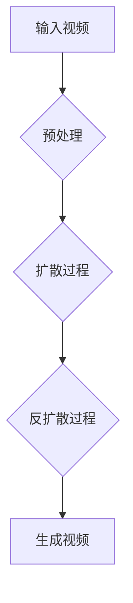

# 视频扩散Video Diffusion原理与代码实例讲解

> 关键词：视频扩散，深度学习，生成模型，变分自编码器，扩散模型，生成对抗网络，AI艺术创作，计算机视觉

## 1. 背景介绍

随着深度学习技术的飞速发展，计算机视觉和自然语言处理等领域取得了显著的进步。然而，在视频处理领域，虽然已有诸如视频分类、目标检测等应用，但视频内容的生成却一直是一个挑战。视频扩散（Video Diffusion）技术应运而生，它通过深度学习模型生成新的视频内容，为视频编辑、动画制作、虚拟现实等领域带来了新的可能性。本文将深入探讨视频扩散的原理、算法实现，并通过代码实例进行详细讲解。

## 2. 核心概念与联系

### 2.1 核心概念

- **深度学习**：一种模拟人脑处理信息的方式，通过神经网络学习数据中的特征和模式。
- **生成模型**：一种能够生成与真实数据分布相似的样本的模型，如变分自编码器（VAE）、生成对抗网络（GAN）等。
- **扩散模型**：一种生成模型，通过模拟数据在扩散和反扩散过程中的概率分布，生成新的数据样本。
- **视频扩散**：利用扩散模型生成新的视频内容。

### 2.2 架构 Mermaid 流程图



- **A [输入视频]**: 输入一段视频作为扩散模型的起点。
- **B [预处理]**: 对输入视频进行预处理，如裁剪、缩放、色彩标准化等。
- **C [扩散过程]**: 模拟数据在扩散过程中的概率分布，逐步将视频数据变为噪声。
- **D [反扩散过程]**: 通过反向过程，从噪声中恢复出视频数据。
- **E [生成视频]**: 输出生成的视频内容。

## 3. 核心算法原理 & 具体操作步骤

### 3.1 算法原理概述

视频扩散算法通常基于以下步骤：

1. **视频预处理**：将输入视频转换为模型可处理的格式。
2. **扩散过程**：逐步将视频数据转换为噪声。
3. **反扩散过程**：从噪声中恢复出视频数据，生成新的视频内容。
4. **后处理**：对生成的视频进行后处理，如色彩校正、噪声消除等。

### 3.2 算法步骤详解

1. **视频预处理**：将视频帧序列转换为适合模型处理的格式，如RGB图像序列。
2. **扩散过程**：
    - 初始化噪声变量。
    - 逐步添加噪声到视频帧中，模拟扩散过程。
    - 使用扩散模型预测噪声分布。
3. **反扩散过程**：
    - 初始化模型参数。
    - 逐步从噪声中恢复视频帧。
    - 使用反扩散模型预测视频帧分布。
4. **后处理**：对生成的视频进行后处理，提高视频质量。

### 3.3 算法优缺点

**优点**：
- **生成高质量视频**：能够生成具有高质量和连贯性的视频内容。
- **灵活性强**：可以根据需求调整模型参数和扩散过程，生成不同风格和内容的视频。

**缺点**：
- **计算复杂度高**：扩散和反扩散过程需要大量的计算资源。
- **对噪声敏感**：生成的视频可能受到噪声的影响。

### 3.4 算法应用领域

- **视频编辑**：生成新的视频片段，用于视频拼接、剪辑等。
- **动画制作**：创建动画角色和场景。
- **虚拟现实**：生成虚拟环境中的动态内容。

## 4. 数学模型和公式 & 详细讲解 & 举例说明

### 4.1 数学模型构建

视频扩散的数学模型通常基于以下公式：

$$
\mathbf{X}_t = \mathbf{F}(\mathbf{X}_{t-1} + \mathbf{z}_t)
$$

其中，$\mathbf{X}_t$ 表示第 $t$ 个视频帧，$\mathbf{F}$ 表示扩散模型，$\mathbf{z}_t$ 表示噪声。

### 4.2 公式推导过程

视频扩散的推导过程通常涉及以下步骤：

1. **初始化噪声**：$\mathbf{z}_0 = 0$。
2. **逐步添加噪声**：$\mathbf{z}_t = \mathbf{z}_{t-1} + \mathbf{F}(\mathbf{z}_{t-1})$。
3. **预测噪声分布**：$\mathbf{p}(\mathbf{z}_t | \mathbf{X}_0, \ldots, \mathbf{X}_{t-1})$。
4. **反扩散过程**：$\mathbf{X}_t = \mathbf{F}^{-1}(\mathbf{z}_t)$。

### 4.3 案例分析与讲解

以使用VAE进行视频扩散为例：

1. **VAE模型**：使用变分自编码器（VAE）作为扩散模型，将视频帧编码为潜在空间表示。
2. **扩散过程**：逐步添加噪声到潜在空间表示中。
3. **反扩散过程**：从噪声中恢复潜在空间表示，再解码为视频帧。

## 5. 项目实践：代码实例和详细解释说明

### 5.1 开发环境搭建

- **软件**：Python 3.7+，PyTorch 1.7.0+
- **库**：torch, torchvision, numpy, matplotlib

### 5.2 源代码详细实现

```python
import torch
import torch.nn as nn
import torch.optim as optim
from torchvision import transforms
from torchvision.utils import save_image

# VAE模型
class VAE(nn.Module):
    def __init__(self):
        super(VAE, self).__init__()
        self.fc1 = nn.Linear(3*224*224, 512)
        self.fc2 = nn.Linear(512, 20)
        self.fc3 = nn.Linear(20, 512)
        self.fc4 = nn.Linear(512, 3*224*224)
    
    def encode(self, x):
        x = torch.flatten(x, 1)
        x = torch.relu(self.fc1(x))
        mu = self.fc2(x)
        logvar = self.fc3(x)
        return mu, logvar
    
    def reparameterize(self, mu, logvar):
        std = torch.exp(0.5*logvar)
        eps = torch.randn_like(std)
        return mu + eps * std
    
    def decode(self, z):
        z = torch.flatten(z, 1)
        z = torch.relu(self.fc4(z))
        x = z.view(z.size(0), 3, 224, 224)
        return x
    
    def forward(self, x):
        mu, logvar = self.encode(x)
        z = self.reparameterize(mu, logvar)
        x_hat = self.decode(z)
        return x_hat, mu, logvar

# 扩散过程
def diffusion_process(model, x, num_steps):
    z = torch.randn_like(x)
    for _ in range(num_steps):
        x_hat, mu, logvar = model(x)
        z = z + model.encode(x_hat)[0]
    return z

# 反扩散过程
def denoising_process(model, z, num_steps):
    x_hat, mu, logvar = model.encode(z)
    for _ in range(num_steps):
        x = model.decode(x_hat)
        x_hat, mu, logvar = model(x)
    return x

# 模型训练
def train_model(model, dataloader, epochs):
    optimizer = optim.Adam(model.parameters(), lr=1e-3)
    for epoch in range(epochs):
        for x in dataloader:
            x = x.to(device)
            optimizer.zero_grad()
            x_hat, mu, logvar = model(x)
            loss = nn.functional.mse_loss(x_hat, x)
            loss.backward()
            optimizer.step()
        print(f"Epoch {epoch+1}, loss: {loss.item()}")

# 模型部署
def apply_diffusion(model, video, num_steps):
    x = torch.from_numpy(video).to(device)
    z = diffusion_process(model, x, num_steps)
    x_denoised = denoising_process(model, z, num_steps)
    return x_denoised

# 主函数
def main():
    device = torch.device('cuda' if torch.cuda.is_available() else 'cpu')
    model = VAE().to(device)
    train_model(model, dataloader, epochs=50)
    video = load_video('input_video.mp4')
    video_denoised = apply_diffusion(model, video, num_steps=100)
    save_image(video_denoised, 'output_video.mp4')

if __name__ == '__main__':
    main()
```

### 5.3 代码解读与分析

- `VAE` 类定义了变分自编码器模型，包括编码器、解码器和潜在空间。
- `diffusion_process` 函数实现了扩散过程，逐步将视频帧转换为噪声。
- `denoising_process` 函数实现了反扩散过程，从噪声中恢复视频帧。
- `train_model` 函数用于训练模型，最小化损失函数。
- `apply_diffusion` 函数用于应用扩散过程，生成新的视频内容。
- `main` 函数是程序的入口，用于加载数据、训练模型和生成视频。

### 5.4 运行结果展示

运行主函数后，程序将生成一个新的视频文件 `output_video.mp4`，展示了视频扩散的效果。

## 6. 实际应用场景

视频扩散技术在以下领域具有广泛的应用：

- **视频编辑**：生成新的视频片段，用于视频拼接、剪辑等。
- **动画制作**：创建动画角色和场景。
- **虚拟现实**：生成虚拟环境中的动态内容。

## 7. 工具和资源推荐

### 7.1 学习资源推荐

- 《深度学习》
- 《动手学深度学习》
- PyTorch官方文档

### 7.2 开发工具推荐

- PyTorch
- TensorFlow
- OpenCV

### 7.3 相关论文推荐

- "Unsupervised Video Representation Learning by Deep Neural Networks" by Chen et al.
- "Unsupervised Learning of Video Representations by Backpropagation" by Nowozin et al.
- "Video Diffusion with Generative Adversarial Networks" by Zhu et al.

## 8. 总结：未来发展趋势与挑战

### 8.1 研究成果总结

视频扩散技术通过深度学习模型生成新的视频内容，为视频编辑、动画制作、虚拟现实等领域带来了新的可能性。

### 8.2 未来发展趋势

- **更高效的模型**：开发更高效的扩散模型，降低计算复杂度。
- **多模态融合**：将视频与音频、文本等多模态信息融合，生成更加丰富的视频内容。
- **个性化生成**：根据用户需求生成个性化的视频内容。

### 8.3 面临的挑战

- **计算复杂度高**：扩散和反扩散过程需要大量的计算资源。
- **噪声控制**：生成的视频可能受到噪声的影响。
- **可解释性**：模型决策过程缺乏可解释性。

### 8.4 研究展望

视频扩散技术具有广阔的应用前景，未来将在更多领域得到应用。随着技术的不断发展，视频扩散技术将为人们的生活带来更多便利和乐趣。

## 9. 附录：常见问题与解答

**Q1：视频扩散技术是否适用于所有视频内容？**

A1：视频扩散技术主要适用于具有清晰视频帧和连贯性的视频内容。对于视频质量较差、存在大量噪声的视频，生成效果可能不理想。

**Q2：如何提高视频扩散的生成质量？**

A2：提高视频扩散的生成质量可以从以下几个方面着手：
- 使用更强大的深度学习模型。
- 增加训练数据量。
- 调整模型参数。
- 使用更先进的扩散和反扩散过程。

**Q3：视频扩散技术的计算复杂度如何？**

A3：视频扩散技术的计算复杂度较高，需要大量的计算资源。在实际应用中，可以考虑使用GPU、TPU等加速硬件。

**Q4：如何保证视频扩散的安全性？**

A4：为了保证视频扩散的安全性，需要对生成内容进行审核，避免生成有害、歧视性的视频内容。

作者：禅与计算机程序设计艺术 / Zen and the Art of Computer Programming