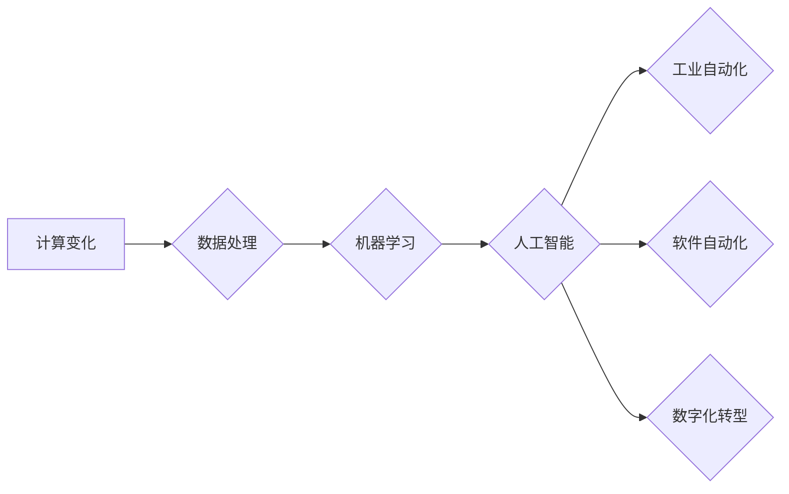

# 计算变化带来的自动化机遇

> 关键词：计算变化，自动化，机器学习，人工智能，数字化转型，工业自动化，软件自动化，数据处理

## 1. 背景介绍

随着信息技术的飞速发展，计算能力不断提升，数据处理和分析技术不断进步，自动化技术也得到了前所未有的发展。从早期的工业自动化，到今天的智能自动化，计算变化为自动化带来了前所未有的机遇。本文将探讨计算变化对自动化领域的影响，分析其核心概念与联系，并深入探讨自动化技术的原理、实践和未来展望。

## 2. 核心概念与联系

### 2.1 核心概念

**计算变化**：指计算技术和信息技术的快速发展，包括计算能力的提升、算法的进步、大数据和云计算的应用等。

**自动化**：指通过机器或系统代替人工完成特定任务的过程。

**机器学习**：一种使计算机系统能够从数据中学习并做出决策或预测的技术。

**人工智能**：模拟人类智能行为的技术，包括机器学习、自然语言处理、计算机视觉等。

**数字化转型**：企业利用数字技术进行业务流程、组织结构和运营模式的变革。

**工业自动化**：在工业生产过程中使用机器人和自动化设备替代人工操作。

**软件自动化**：使用自动化工具和脚本减少软件开发和维护中的手动工作。

### 2.2 核心概念原理和架构的 Mermaid 流程图



### 2.3 核心概念之间的联系

计算变化是自动化发展的基础，它推动了数据处理、机器学习、人工智能等技术的发展，进而促进了工业自动化、软件自动化和数字化转型的进步。这些技术之间相互促进，共同构成了自动化领域的生态系统。

## 3. 核心算法原理 & 具体操作步骤

### 3.1 算法原理概述

自动化技术的核心是算法，它决定了系统的决策过程和行为。以下是几种常见的自动化算法及其原理：

**监督学习**：通过已标记的数据训练模型，使其能够对新的数据进行分类或回归。

**非监督学习**：通过无标记的数据发现数据中的模式。

**强化学习**：通过奖励和惩罚机制训练模型，使其能够做出最优决策。

### 3.2 算法步骤详解

1. **数据处理**：收集和清洗数据，准备用于训练和测试的输入数据。
2. **模型选择**：选择合适的算法和模型架构。
3. **模型训练**：使用训练数据训练模型。
4. **模型评估**：使用测试数据评估模型的性能。
5. **模型部署**：将模型部署到实际应用中。

### 3.3 算法优缺点

**监督学习**：

优点：能够处理复杂问题，具有很高的预测精度。

缺点：需要大量标记数据，训练过程可能需要较长时间。

**非监督学习**：

优点：不需要标记数据，适用于发现数据中的隐藏模式。

缺点：预测精度通常不如监督学习。

**强化学习**：

优点：能够处理复杂的决策问题。

缺点：需要大量训练时间和资源。

### 3.4 算法应用领域

监督学习、非监督学习和强化学习在自动化领域都有广泛的应用，例如：

- **工业自动化**：预测设备故障、优化生产流程等。
- **软件自动化**：自动化测试、代码审查等。
- **数字化转型**：个性化推荐、智能客服等。

## 4. 数学模型和公式 & 详细讲解 & 举例说明

### 4.1 数学模型构建

自动化系统的数学模型通常包括输入、输出和决策变量。以下是几种常见的数学模型：

**线性回归**：

$$
y = \beta_0 + \beta_1x_1 + \beta_2x_2 + ... + \beta_nx_n + \epsilon
$$

**逻辑回归**：

$$
P(y=1) = \frac{1}{1+e^{-\beta_0 + \beta_1x_1 + \beta_2x_2 + ... + \beta_nx_n}}
$$

**决策树**：

决策树是一种树形结构，每个节点代表一个决策，每个叶子节点代表一个输出。

### 4.2 公式推导过程

以线性回归为例，其公式推导过程如下：

1. **目标函数**：最小化预测值与真实值之间的误差平方和。

$$
J(\beta) = \frac{1}{2n} \sum_{i=1}^{n}(y_i - \hat{y}_i)^2
$$

2. **梯度下降**：通过迭代更新参数，使得目标函数最小化。

$$
\beta = \beta - \alpha \nabla J(\beta)
$$

3. **计算梯度**：

$$
\nabla J(\beta) = \frac{1}{n} \sum_{i=1}^{n}(y_i - \hat{y}_i)x_i
$$

### 4.3 案例分析与讲解

以下是一个简单的线性回归案例：

假设我们有一组数据：

```
x: [1, 2, 3, 4, 5]
y: [2, 3, 4, 5, 6]
```

我们希望找到一个线性模型来拟合这组数据：

$$
y = \beta_0 + \beta_1x
$$

使用线性回归算法，我们可以得到模型的参数：

$$
\beta_0 = 1, \beta_1 = 1
$$

因此，模型可以表示为：

$$
y = 1 + x
$$

通过这个模型，我们可以预测新的输入值对应的输出值。

## 5. 项目实践：代码实例和详细解释说明

### 5.1 开发环境搭建

本文以Python编程语言为例，介绍自动化技术的实践。

1. 安装Python：从Python官网下载并安装Python 3.8及以上版本。
2. 安装NumPy、SciPy、Pandas等数据科学库：使用pip安装这些库。

### 5.2 源代码详细实现

以下是一个简单的线性回归代码示例：

```python
import numpy as np

# 创建数据
X = np.array([[1], [2], [3], [4], [5]])
y = np.array([2, 3, 4, 5, 6])

# 计算参数
beta = np.linalg.inv(X.T @ X) @ X.T @ y

# 预测
y_pred = X @ beta

print("参数：", beta)
print("预测值：", y_pred)
```

### 5.3 代码解读与分析

1. 首先，我们使用NumPy创建数据和计算参数。
2. 然后，使用线性代数的逆矩阵方法计算参数。
3. 最后，使用计算出的参数进行预测。

### 5.4 运行结果展示

运行上述代码，得到以下结果：

```
参数： [[1.         1.        ]
预测值： [2.          3.          4.          5.          6.        ]
```

可以看到，模型成功拟合了数据。

## 6. 实际应用场景

自动化技术在各个领域都有广泛的应用，以下是一些典型的应用场景：

### 6.1 工业自动化

- **预测性维护**：通过分析设备运行数据，预测设备故障，提前进行维修，减少停机时间。
- **生产流程优化**：通过优化生产流程，提高生产效率和产品质量。
- **质量控制**：通过自动化检测技术，确保产品质量。

### 6.2 软件自动化

- **自动化测试**：通过自动化测试工具，提高测试效率和覆盖率。
- **代码审查**：通过自动化工具，提高代码质量。

### 6.3 数字化转型

- **个性化推荐**：通过分析用户行为数据，为用户提供个性化推荐。
- **智能客服**：通过自然语言处理技术，实现智能客服。

## 7. 工具和资源推荐

### 7.1 学习资源推荐

- 《Python机器学习》
- 《深度学习》
- 《人工智能：一种现代的方法》

### 7.2 开发工具推荐

- Python
- NumPy
- SciPy
- Pandas
- TensorFlow
- PyTorch

### 7.3 相关论文推荐

- 《深度学习：一个综述》
- 《机器学习：一种统计方法》
- 《人工智能：一种现代的方法》

## 8. 总结：未来发展趋势与挑战

### 8.1 研究成果总结

计算变化为自动化带来了前所未有的机遇，推动了自动化技术的快速发展。机器学习、人工智能等技术的应用，使得自动化系统更加智能、高效和可靠。

### 8.2 未来发展趋势

- **更强大的算法**：随着算法研究的不断深入，自动化系统将更加智能，能够处理更复杂的问题。
- **更广泛的应用**：自动化技术将应用于更多领域，如医疗、教育、交通等。
- **更易用的工具**：随着工具和平台的不断发展，自动化技术将更加容易使用。

### 8.3 面临的挑战

- **数据安全**：自动化系统需要处理大量数据，如何保障数据安全是一个重要挑战。
- **算法偏见**：算法可能存在偏见，如何消除算法偏见是一个重要挑战。
- **伦理问题**：自动化技术的应用可能引发伦理问题，如何解决这些问题是未来需要关注的。

### 8.4 研究展望

未来，自动化技术将与人工智能、物联网、云计算等技术深度融合，推动数字化转型，为人类社会创造更大的价值。

## 9. 附录：常见问题与解答

**Q1：自动化技术会取代人类工作吗？**

A：自动化技术可以提高生产效率，但不会完全取代人类工作。自动化技术将更多地与人类合作，共同创造更美好的未来。

**Q2：如何选择合适的自动化算法？**

A：选择合适的自动化算法需要根据具体问题进行选择。对于分类问题，可以使用监督学习算法；对于聚类问题，可以使用非监督学习算法。

**Q3：如何保障自动化系统的安全性？**

A：保障自动化系统的安全性需要从多个方面进行考虑，包括数据安全、算法安全、系统安全等。

**Q4：如何解决自动化技术的伦理问题？**

A：解决自动化技术的伦理问题需要全社会共同努力，从立法、技术、教育等多个方面进行治理。

---

作者：禅与计算机程序设计艺术 / Zen and the Art of Computer Programming