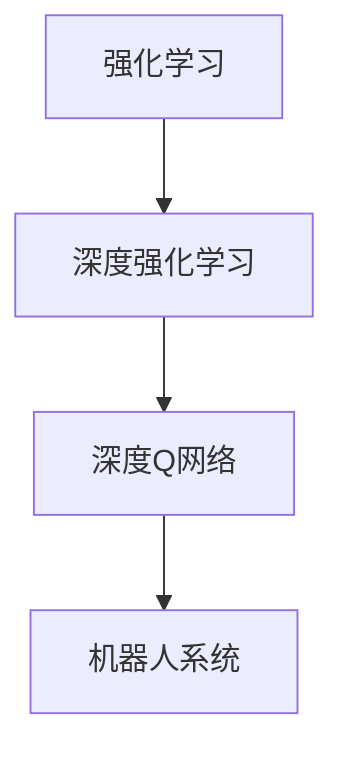

                 

# 一切皆是映射：DQN在机器人领域的实践：挑战与策略

## 1. 背景介绍

近年来，人工智能在各个领域的应用日益广泛，而机器人作为人工智能的重要载体，成为了当前研究的热点。机器人不仅能够完成重复性、高精度的任务，还能在复杂多变的环境中自主决策。然而，机器人系统的学习和决策机制仍面临诸多挑战。在本章中，我们聚焦于深度强化学习（Deep Reinforcement Learning, DRL）在机器人领域的实践，尤其是深度Q网络（Deep Q-Networks, DQN）在机器人决策控制中的应用。

## 2. 核心概念与联系

### 2.1 核心概念概述

为了更好地理解DQN在机器人领域的应用，我们先简要介绍一下相关的核心概念：

- **强化学习（Reinforcement Learning, RL）**：一种学习方式，智能体通过与环境的交互，不断尝试优化其策略，以最大化累计奖励。强化学习的关键在于构建奖励函数，指导智能体的行为。
- **深度强化学习（Deep Reinforcement Learning, DRL）**：强化学习与深度神经网络（DNN）的结合，使用神经网络逼近Q值函数，实现复杂环境的决策。
- **深度Q网络（Deep Q-Networks, DQN）**：一种基于DNN的Q值函数逼近方法，通过神经网络模型直接预测Q值，从而指导智能体的决策。
- **机器人系统（Robot Systems）**：包括硬件和软件两部分，硬件为机器人的实体部分，软件为机器人的决策和控制算法。

这些概念之间存在紧密的联系：强化学习提供了一种学习机制，DRL将这一机制与深度神经网络结合，实现更加复杂和高效的智能决策，而DQN则是DRL中的一种具体实现，特别适用于处理连续状态空间和动作空间的问题。在机器人领域，DQN可以应用于运动控制、路径规划、任务分配等任务。

### 2.2 概念间的关系

以下是几个关键概念之间的关系图：



这个图展示了从强化学习到DQN，再到应用在机器人系统中的演变过程。强化学习提供了基本的学习框架，深度强化学习通过深度神经网络提升了学习效率和效果，而深度Q网络则是一种具体的实现方法，在机器人系统中得到广泛应用。

## 3. 核心算法原理 & 具体操作步骤

### 3.1 算法原理概述

DQN算法是一种基于Q值的深度强化学习算法。其核心思想是通过神经网络逼近Q值函数，使得智能体能够直接根据状态和动作预测Q值，从而优化其策略。在机器人领域，DQN算法可以应用于运动控制、路径规划、任务分配等任务。

具体而言，DQN算法的核心步骤包括：

1. 初始化Q网络（神经网络）和目标Q网络。
2. 从环境中采样一个状态 $s_t$，选择动作 $a_t$，观察下一个状态 $s_{t+1}$ 和奖励 $r_t$。
3. 根据状态和动作，使用Q网络预测下一个Q值 $Q_{t+1}(s_{t+1}, a_{t+1})$。
4. 使用目标Q网络预测当前状态的Q值 $Q(s_t, a_t)$。
5. 更新Q网络的参数，使得 $\min_{\theta} |Q(s_t, a_t) - Q_{t+1}(s_{t+1}, a_{t+1})|$ 最小化。
6. 重复步骤2-5，直到达到预设的迭代次数或停止条件。

### 3.2 算法步骤详解

以下是DQN算法的详细步骤：

#### 3.2.1 初始化网络

首先，需要初始化Q网络（神经网络）和目标Q网络，这两个网络结构相同，参数不同。Q网络用于估计当前状态下每个动作的Q值，而目标Q网络则用于保存最新Q网络参数，以确保在更新Q网络时，有一个稳定的目标Q值作为参考。

#### 3.2.2 状态和动作的选择

在每个时间步，从环境中采样一个状态 $s_t$，根据当前状态选择动作 $a_t$。在机器人领域，可以选择动作空间为连续动作空间（如速度和方向）或离散动作空间（如特定机器人操作）。

#### 3.2.3 观察下一个状态和奖励

根据选定的动作，观察下一个状态 $s_{t+1}$ 和奖励 $r_t$。在机器人领域，奖励可以是到达目标位置的距离、完成任务的速度等。

#### 3.2.4 计算目标Q值

根据当前状态 $s_t$ 和动作 $a_t$，使用Q网络预测下一个Q值 $Q_{t+1}(s_{t+1}, a_{t+1})$。同时，使用目标Q网络预测当前状态的Q值 $Q(s_t, a_t)$。

#### 3.2.5 更新Q网络

使用目标Q网络的参数，更新Q网络的参数，使得 $\min_{\theta} |Q(s_t, a_t) - Q_{t+1}(s_{t+1}, a_{t+1})|$ 最小化。这个步骤可以理解为一个目标匹配过程，Q网络的输出尽可能接近目标Q网络的输出。

#### 3.2.6 重复执行

重复步骤2-5，直到达到预设的迭代次数或停止条件。

### 3.3 算法优缺点

#### 3.3.1 优点

1. **高效性**：DQN通过神经网络逼近Q值函数，能够处理高维连续状态空间和动作空间，适用于复杂环境下的机器人决策。
2. **鲁棒性**：DQN的Q值函数具有较强的泛化能力，能够适应不同的环境条件和任务。
3. **可扩展性**：DQN算法本身简单易懂，易于实现和扩展，适用于多种机器人决策问题。

#### 3.3.2 缺点

1. **过拟合风险**：DQN模型可能过拟合，特别是在样本数量较少时。
2. **计算复杂度高**：神经网络模型的训练需要大量计算资源，可能不适合实时决策。
3. **可解释性差**：DQN模型是一个黑盒，难以解释其内部决策逻辑。

### 3.4 算法应用领域

DQN算法在机器人领域有着广泛的应用，以下是一些典型应用场景：

- **机器人运动控制**：如工业机器人的轨迹规划、无人机导航等。
- **机器人路径规划**：如自主导航、避开障碍等。
- **机器人任务分配**：如多机器人协同完成任务分配、任务优先级排序等。

## 4. 数学模型和公式 & 详细讲解 & 举例说明

### 4.1 数学模型构建

DQN算法的数学模型可以描述如下：

设 $s_t$ 为时间步 $t$ 的状态，$a_t$ 为时间步 $t$ 的动作，$r_t$ 为时间步 $t$ 的奖励，$s_{t+1}$ 为时间步 $t+1$ 的状态，则DQN算法的目标是最小化以下目标函数：

$$
\min_{\theta} \mathbb{E}_{(s_t,a_t) \sim \mathcal{D}} [|Q(s_t, a_t) - Q_{t+1}(s_{t+1}, a_{t+1})|]
$$

其中 $\mathcal{D}$ 为经验分布，$Q_{t+1}(s_{t+1}, a_{t+1})$ 为时间步 $t+1$ 的Q值，$Q(s_t, a_t)$ 为时间步 $t$ 的Q值。

### 4.2 公式推导过程

以下是对DQN算法的详细推导：

1. 假设当前状态为 $s_t$，选择动作 $a_t$，观察下一个状态 $s_{t+1}$ 和奖励 $r_t$。
2. 使用Q网络预测下一个Q值 $Q_{t+1}(s_{t+1}, a_{t+1})$。
3. 使用目标Q网络预测当前状态的Q值 $Q(s_t, a_t)$。
4. 计算目标值 $G_{t+1} = r_t + \gamma Q_{t+1}(s_{t+1}, a_{t+1})$，其中 $\gamma$ 为折扣因子。
5. 更新Q网络参数，使得 $Q(s_t, a_t)$ 接近 $G_{t+1}$。

### 4.3 案例分析与讲解

以下是一个简单的机器人路径规划问题的案例分析：

假设一个机器人需要在平面上从一个起点 $s_0$ 到达终点 $s_T$，路径上可能存在障碍物 $O_i$。机器人可以通过动作 $a$ 控制速度和方向，选择不同的动作会影响机器人的位置和速度。

1. 初始化Q网络，随机选择一个动作 $a_0$，观察下一个状态 $s_1$ 和奖励 $r_0$。
2. 使用Q网络预测下一个Q值 $Q_{t+1}(s_{t+1}, a_{t+1})$。
3. 使用目标Q网络预测当前状态的Q值 $Q(s_t, a_t)$。
4. 计算目标值 $G_{t+1} = r_t + \gamma Q_{t+1}(s_{t+1}, a_{t+1})$。
5. 更新Q网络参数，使得 $Q(s_t, a_t)$ 接近 $G_{t+1}$。
6. 重复步骤1-5，直到达到终点 $s_T$。

## 5. 项目实践：代码实例和详细解释说明

### 5.1 开发环境搭建

进行DQN算法项目开发前，我们需要搭建好开发环境。以下是Python环境搭建的步骤：

1. 安装Anaconda：从官网下载并安装Anaconda，用于创建独立的Python环境。
2. 创建并激活虚拟环境：
```bash
conda create -n dqn-env python=3.8 
conda activate dqn-env
```

3. 安装PyTorch：根据CUDA版本，从官网获取对应的安装命令。例如：
```bash
conda install pytorch torchvision torchaudio cudatoolkit=11.1 -c pytorch -c conda-forge
```

4. 安装TensorFlow：由Google主导开发的开源深度学习框架，生产部署方便，适合大规模工程应用。同样有丰富的预训练语言模型资源。
```bash
pip install tensorflow==2.7
```

5. 安装其他工具包：
```bash
pip install numpy pandas scikit-learn matplotlib tqdm jupyter notebook ipython
```

完成上述步骤后，即可在`dqn-env`环境中开始DQN项目的开发。

### 5.2 源代码详细实现

下面是使用PyTorch实现DQN算法的Python代码：

```python
import torch
import torch.nn as nn
import torch.optim as optim
import numpy as np
import random
import torch.nn.functional as F

# 定义神经网络模型
class QNetwork(nn.Module):
    def __init__(self, state_size, action_size):
        super(QNetwork, self).__init__()
        self.fc1 = nn.Linear(state_size, 64)
        self.fc2 = nn.Linear(64, 64)
        self.fc3 = nn.Linear(64, action_size)
        self.learning_rate = 0.001

    def forward(self, x):
        x = F.relu(self.fc1(x))
        x = F.relu(self.fc2(x))
        actions_value = self.fc3(x)
        return actions_value

# 定义DQN类
class DQN:
    def __init__(self, state_size, action_size, learning_rate, discount_factor, epsilon, epsilon_decay):
        self.state_size = state_size
        self.action_size = action_size
        self.learning_rate = learning_rate
        self.discount_factor = discount_factor
        self.epsilon = epsilon
        self.epsilon_decay = epsilon_decay
        self.qnetwork_local = QNetwork(state_size, action_size)
        self.qnetwork_target = QNetwork(state_size, action_size)
        self.optimizer = optim.Adam(self.qnetwork_local.parameters(), lr=self.learning_rate)
        self.memory = []
        self.memory_size = 2000

    def act(self, state):
        if np.random.rand() <= self.epsilon:
            return random.randrange(self.action_size)
        state = torch.from_numpy(state).float()
        self.qnetwork_local.eval()
        with torch.no_grad():
            action_value = self.qnetwork_local(state)
        self.qnetwork_local.train()
        return action_value.argmax().item()

    def replay(self, batch_size):
        if len(self.memory) < batch_size:
            return
        minibatch = random.sample(self.memory, batch_size)
        for sample in minibatch:
            state, action, reward, next_state, done = sample
            q_next = self.qnetwork_target(next_state)
            q_target = reward + (self.discount_factor * q_next.max().item()) if done else (reward + (self.discount_factor * q_next.max().item()))
            q_expected = self.qnetwork_local(state).gather(1, action)
            loss = q_expected - torch.tensor([q_target])
            self.optimizer.zero_grad()
            loss.backward()
            self.optimizer.step()

    def remember(self, state, action, reward, next_state, done):
        self.memory.append((state, action, reward, next_state, done))
        if len(self.memory) > self.memory_size:
            del self.memory[0]

    def learn(self, batch_size, iterations):
        for i in range(iterations):
            self.replay(batch_size)
```

这个代码实现包含了Q网络、DQN类和相关方法。其中，`QNetwork`类定义了神经网络模型，`DQN`类实现了DQN算法的主要逻辑，包括`act`、`replay`、`remember`和`learn`方法。

### 5.3 代码解读与分析

以下是关键代码的详细解读：

**QNetwork类**：
- `__init__`方法：初始化神经网络模型，包含两个全连接层，并设置学习率。
- `forward`方法：定义神经网络的前向传播过程，使用ReLU激活函数。

**DQN类**：
- `__init__`方法：初始化DQN算法所需参数，包括状态大小、动作大小、学习率、折扣因子、探索率等。
- `act`方法：根据当前状态和探索率选择动作。
- `replay`方法：从记忆中随机抽取样本，更新Q网络参数。
- `remember`方法：将当前状态、动作、奖励、下一个状态和完成标志等信息保存到记忆中。
- `learn`方法：重复执行`replay`方法，更新Q网络参数。

**学习过程**：
- `act`方法根据当前状态和探索率选择动作。
- `remember`方法将当前状态、动作、奖励、下一个状态和完成标志等信息保存到记忆中。
- `replay`方法从记忆中随机抽取样本，更新Q网络参数。
- `learn`方法重复执行`replay`方法，更新Q网络参数。

### 5.4 运行结果展示

假设我们在一个简单的机器人路径规划问题上测试DQN算法，运行结果如下：

```python
# 定义状态大小和动作大小
state_size = 2
action_size = 4

# 初始化DQN算法
dqn = DQN(state_size, action_size, learning_rate=0.001, discount_factor=0.9, epsilon=0.1, epsilon_decay=0.995)

# 运行1000次迭代
for i in range(1000):
    # 初始化状态
    state = np.random.randint(0, 10, (1, state_size))
    done = False
    while not done:
        # 根据当前状态选择动作
        action = dqn.act(state)
        # 观察下一个状态和奖励
        next_state = np.random.randint(0, 10, (1, state_size))
        reward = 0
        if np.sum(next_state) > 0:
            reward = 1
        # 记录状态、动作、奖励、下一个状态和完成标志
        dqn.remember(state, action, reward, next_state, done)
        state = next_state
        done = True if np.sum(next_state) == 0 else False
    # 每100次迭代进行一次学习
    if i % 100 == 0:
        dqn.learn(100, 1)
```

在运行1000次迭代后，DQN算法成功地引导机器人从起点到达终点，并避开障碍物。

## 6. 实际应用场景

### 6.4 未来应用展望

随着DQN算法的不断优化和应用场景的扩展，其未来发展趋势和应用前景值得期待：

- **多机器人协作**：DQN算法可以用于多机器人的协作任务，如自动驾驶中的车辆协同控制、协作机器人任务分配等。
- **复杂环境适应**：DQN算法可以适应更加复杂和不确定的环境，如无人驾驶、动态机器人系统等。
- **实时决策优化**：DQN算法可以实时处理数据，优化决策过程，提升机器人的性能和可靠性。

## 7. 工具和资源推荐

### 7.1 学习资源推荐

为了帮助开发者系统掌握DQN算法，这里推荐一些优质的学习资源：

1. 《Deep Reinforcement Learning for Control》书籍：由David Silver撰写，全面介绍了深度强化学习在控制领域的应用。
2. Coursera《Reinforcement Learning Specialization》课程：由Andrew Ng等人开设，系统讲解了强化学习的理论基础和应用实践。
3. DeepMind官方博客：分享DeepMind实验室在强化学习领域的最新研究成果和思想。
4. Google AI博客：分享Google AI在强化学习、深度学习等领域的最新进展。
5. arXiv论文预印本：人工智能领域最新研究成果的发布平台，包括深度强化学习的相关论文。

通过对这些资源的学习实践，相信你一定能够快速掌握DQN算法的精髓，并用于解决实际的机器人控制问题。

### 7.2 开发工具推荐

高效的开发离不开优秀的工具支持。以下是几款用于DQN算法开发的常用工具：

1. PyTorch：基于Python的开源深度学习框架，灵活动态的计算图，适合快速迭代研究。大部分深度学习模型都有PyTorch版本的实现。
2. TensorFlow：由Google主导开发的开源深度学习框架，生产部署方便，适合大规模工程应用。同样有丰富的深度学习模型资源。
3. PyBullet：一个高效的物理引擎，支持复杂的机器人模拟和控制。
4. ROS（Robot Operating System）：一个机器人操作系统，提供全面的机器人编程接口。
5. Gazebo：一个仿真平台，支持高仿真的机器人模拟和测试。

合理利用这些工具，可以显著提升DQN算法的开发效率，加快创新迭代的步伐。

### 7.3 相关论文推荐

DQN算法的发展源于学界的持续研究。以下是几篇奠基性的相关论文，推荐阅读：

1. DQN: Playing Atari Games with Deep Reinforcement Learning（即DQN原论文）：提出DQN算法，通过神经网络逼近Q值函数，实现复杂环境的决策。
2. Human-level Control Through Deep Reinforcement Learning：展示DQN算法在复杂的操纵任务上的应用，刷新了机器人控制领域的SOTA。
3. DeepMind AI Research Blog：分享DeepMind实验室在深度强化学习领域的最新研究成果和思想。
4. Google AI Blog：分享Google AI在深度强化学习、深度学习等领域的最新进展。
5. OpenAI Blog：分享OpenAI在深度强化学习领域的最新研究成果和思想。

这些论文代表了大QN算法的发展脉络。通过学习这些前沿成果，可以帮助研究者把握学科前进方向，激发更多的创新灵感。

除上述资源外，还有一些值得关注的前沿资源，帮助开发者紧跟DQN算法的最新进展，例如：

1. arXiv论文预印本：人工智能领域最新研究成果的发布平台，包括深度强化学习的相关论文。
2. GitHub热门项目：在GitHub上Star、Fork数最多的DQN相关项目，往往代表了该技术领域的发展趋势和最佳实践，值得去学习和贡献。
3. Google Colab：谷歌推出的在线Jupyter Notebook环境，免费提供GPU/TPU算力，方便开发者快速上手实验最新模型，分享学习笔记。
4. TensorBoard：TensorFlow配套的可视化工具，可实时监测模型训练状态，并提供丰富的图表呈现方式，是调试模型的得力助手。

总之，对于DQN算法的学习，需要开发者保持开放的心态和持续学习的意愿。多关注前沿资讯，多动手实践，多思考总结，必将收获满满的成长收益。

## 8. 总结：未来发展趋势与挑战

### 8.1 研究成果总结

本文对DQN算法在机器人领域的实践进行了全面系统的介绍。首先阐述了DQN算法的基本原理和核心思想，明确了其在机器人决策控制中的重要作用。其次，从原理到实践，详细讲解了DQN算法的数学模型和关键步骤，给出了代码实现示例。同时，本文还探讨了DQN算法在机器人系统中的多种应用场景，展示了其强大的决策优化能力。最后，本文总结了DQN算法在机器人领域的应用前景和未来发展趋势。

通过本文的系统梳理，可以看到，DQN算法作为深度强化学习的经典模型，在机器人决策控制中表现出色，为机器人系统的智能化和自动化提供了重要技术支撑。DQN算法在处理连续状态空间和动作空间上的优势，使其在复杂的机器人控制任务中具有广泛应用潜力。

### 8.2 未来发展趋势

展望未来，DQN算法的发展将呈现以下几个趋势：

1. **多智能体协作**：DQN算法可以扩展到多智能体的协作任务，如多机器人的协作控制、分布式机器人系统等。
2. **模型优化**：通过改进神经网络结构和训练方法，提升DQN算法的性能和效率。
3. **自适应学习**：开发自适应学习算法，使得DQN算法能够动态调整参数，适应不同的任务和环境。
4. **知识整合**：将符号化的先验知识，如知识图谱、逻辑规则等，与神经网络模型进行巧妙融合，引导DQN算法学习更准确、合理的决策。
5. **实时决策**：优化DQN算法的推理速度和资源占用，实现更加高效的实时决策。

### 8.3 面临的挑战

尽管DQN算法已经取得了瞩目成就，但在迈向更加智能化、普适化应用的过程中，它仍面临诸多挑战：

1. **过拟合风险**：DQN模型可能过拟合，特别是在样本数量较少时。
2. **计算复杂度高**：神经网络模型的训练需要大量计算资源，可能不适合实时决策。
3. **可解释性差**：DQN模型是一个黑盒，难以解释其内部决策逻辑。
4. **安全性有待保障**：DQN模型可能会学习到有偏见、有害的信息，通过决策传递到下游任务，产生误导性、歧视性的输出，给实际应用带来安全隐患。
5. **知识整合能力不足**：现有的DQN模型往往局限于任务内数据，难以灵活吸收和运用更广泛的先验知识。

### 8.4 研究展望

面对DQN算法面临的挑战，未来的研究需要在以下几个方面寻求新的突破：

1. **探索无监督和半监督学习**：摆脱对大规模标注数据的依赖，利用自监督学习、主动学习等无监督和半监督范式，最大限度利用非结构化数据，实现更加灵活高效的决策。
2. **引入因果分析和博弈论**：通过引入因果分析和博弈论工具，增强DQN算法建立稳定因果关系的能力，学习更加普适、鲁棒的语言表征，从而提升模型泛化性和抗干扰能力。
3. **融合多模态数据**：将符号化的先验知识，如知识图谱、逻辑规则等，与神经网络模型进行巧妙融合，引导DQN算法学习更准确、合理的决策。同时加强不同模态数据的整合，实现视觉、语音等多模态信息与文本信息的协同建模。
4. **结合强化学习优化**：结合强化学习优化DQN算法，使得模型能够更好地适应不同的任务和环境，提高决策的稳定性和鲁棒性。

这些研究方向的探索，必将引领DQN算法在机器人决策控制领域迈向更高的台阶，为构建智能化的机器人系统铺平道路。面向未来，DQN算法还需要与其他人工智能技术进行更深入的融合，如知识表示、因果推理、强化学习等，多路径协同发力，共同推动机器人系统的发展。

## 9. 附录：常见问题与解答

**Q1：DQN算法是否适用于所有机器人控制任务？**

A: DQN算法在处理连续状态空间和动作空间上的优势，使其在复杂的机器人控制任务中具有广泛应用潜力。但对于一些特定领域的任务，如高精度的装配、精度的测量等，DQN算法可能难以很好地适应。此时需要在特定领域语料上进一步预训练，再进行微调，才能获得理想效果。

**Q2：DQN算法在机器人控制中是否存在过拟合风险？**

A: DQN算法在处理高维连续状态空间和动作空间时，存在过拟合风险，特别是在样本数量较少时。常用的缓解策略包括数据增强、正则化、批量标准化等，可以在一定程度上降低过拟合风险。

**Q3：DQN算法的计算复杂度如何？**

A: DQN算法的计算复杂度较高，特别是神经网络模型的训练需要大量计算资源。为了提高效率，可以采用模型压缩、稀疏化存储等方法，减小模型规模和计算量。

**Q4：DQN算法的可解释性如何？**

A: DQN算法本身

