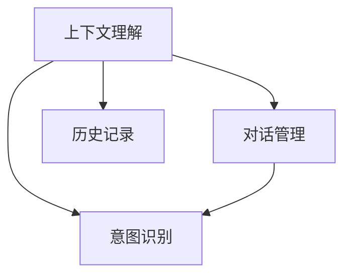
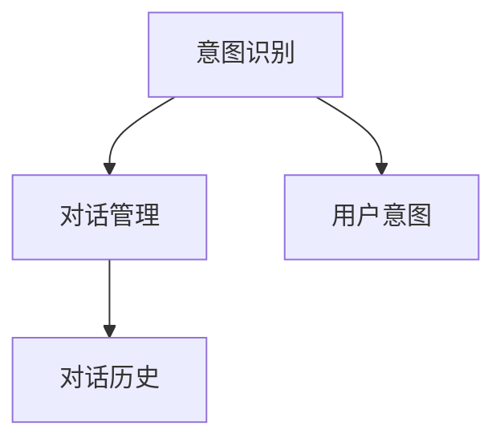
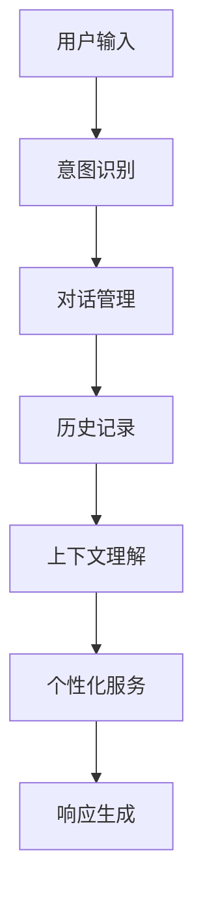

                 

## 1. 背景介绍

### 1.1 问题由来
近年来，随着人工智能技术的发展，尤其是自然语言处理(NLP)技术的不断突破，智能客服（CUI，Customer Understanding Interface）系统在各行各业得到了广泛应用。它通过自然语言处理技术，实现了与用户的自然对话，能够理解用户意图，提供精准服务，极大地提升了客户体验。然而，在实际应用中，如何更好地理解上下文信息，是CUI系统面临的一个重要挑战。

### 1.2 问题核心关键点
上下文理解是指CUI系统在对话过程中，对用户输入信息的背景、语境、历史信息等进行理解和分析，以提供更准确、更具个性化的服务。上下文理解的关键点包括：
- 识别用户意图：准确判断用户的具体需求和意图，避免误解。
- 保持对话连贯：在对话过程中，根据上下文信息，保持话题的一致性和连贯性。
- 记忆历史信息：记录和利用用户的历史信息，如聊天记录、个人信息等，提升服务质量。

上下文理解对于CUI系统的重要性不言而喻，它是实现智能客服的核心技术之一。但在实际应用中，如何更好地实现上下文理解，仍需要深入探讨和研究。

### 1.3 问题研究意义
研究上下文理解在CUI中的重要性，对于提升CUI系统的智能化水平、提升用户满意度、降低企业运营成本等方面具有重要意义：

1. **提升服务质量**：通过理解上下文信息，CUI系统能够提供更准确、更个性化的服务，提升用户体验。
2. **降低运营成本**：智能化客服可以替代部分人工客服，减少人工成本。
3. **提升客户忠诚度**：智能客服能够24小时不间断服务，提升客户满意度和忠诚度。
4. **优化业务流程**：通过收集和分析用户对话数据，可以优化业务流程，提高企业运营效率。

## 2. 核心概念与联系

### 2.1 核心概念概述

为了更好地理解上下文理解在CUI中的应用，本节将介绍几个密切相关的核心概念：

- **上下文理解**：CUI系统在对话过程中，对用户输入信息的背景、语境、历史信息等进行理解和分析，以提供更准确、更具个性化的服务。
- **意图识别**：识别用户的具体需求和意图，是上下文理解的基础。
- **对话管理**：管理对话过程，根据上下文信息，保持话题的一致性和连贯性。
- **历史记录**：记录和利用用户的历史信息，如聊天记录、个人信息等。

这些核心概念之间的逻辑关系可以通过以下Mermaid流程图来展示：



这个流程图展示了一个典型的CUI系统上下文理解过程。首先，上下文理解系统通过意图识别和对话管理，准确理解用户意图，然后根据历史记录和用户上下文信息，提供个性化的服务。

### 2.2 概念间的关系

这些核心概念之间存在着紧密的联系，构成了CUI系统的上下文理解生态系统。下面我们通过几个Mermaid流程图来展示这些概念之间的关系。

#### 2.2.1 CUI系统的理解过程


这个流程图展示了CUI系统的理解过程。用户输入后，意图识别模块先对用户意图进行理解，然后对话管理模块根据上下文信息，管理对话过程，历史记录模块记录用户历史信息。最后，上下文理解模块综合这些信息，提供个性化的服务。

#### 2.2.2 意图识别与对话管理的关系



这个流程图展示了意图识别和对话管理之间的关系。意图识别模块主要关注用户的具体需求和意图，而对话管理模块则负责根据上下文信息，保持对话连贯。两者相辅相成，共同构成CUI系统的核心功能。

#### 2.2.3 上下文理解与历史记录的关系


这个流程图展示了上下文理解和历史记录之间的关系。上下文理解模块通过历史记录模块记录的用户上下文信息，进行综合分析，提供个性化的服务。历史记录模块在上下文理解过程中起到了重要的支持作用。

### 2.3 核心概念的整体架构

最后，我们用一个综合的流程图来展示这些核心概念在大语言模型微调过程中的整体架构：



这个综合流程图展示了CUI系统的完整过程。用户输入后，通过意图识别、对话管理、历史记录和上下文理解模块，最终生成个性化服务并输出。这一过程是CUI系统实现上下文理解的核心逻辑。

## 3. 核心算法原理 & 具体操作步骤
### 3.1 算法原理概述

CUI系统的上下文理解过程，本质上是通过深度学习模型对用户输入信息进行编码和解码，从而实现对上下文信息的理解和分析。常见的深度学习模型包括循环神经网络(RNN)、长短时记忆网络(LSTM)、Transformer等。

### 3.2 算法步骤详解

以下是一个基于Transformer模型的CUI系统上下文理解算法的详细步骤：

1. **输入预处理**：将用户输入的文本信息进行分词、编码等预处理，转化为模型可以处理的向量表示。

2. **上下文编码**：使用Transformer模型对用户上下文信息进行编码，生成上下文表示向量。

3. **意图解码**：根据上下文表示向量和用户输入的文本向量，使用Transformer模型解码，得到用户意图向量。

4. **意图匹配**：将用户意图向量与预定义的意图库进行匹配，确定用户的具体需求和意图。

5. **对话管理**：根据用户意图和对话历史信息，生成对话策略向量，用于指导对话过程。

6. **历史记录更新**：更新历史记录模块，记录当前的对话信息和用户上下文信息。

7. **响应生成**：根据用户意图、对话策略和历史记录，生成个性化服务响应。

8. **输出显示**：将生成的响应输出显示给用户。

### 3.3 算法优缺点

基于Transformer模型的上下文理解算法具有以下优点：

1. **并行计算**：Transformer模型可以并行计算，加速训练和推理过程。
2. **自注意力机制**：Transformer模型中的自注意力机制可以捕捉输入序列中不同位置之间的依赖关系，提升上下文理解能力。
3. **可扩展性**：Transformer模型可以处理不同长度的输入序列，适应各种规模的CUI系统。

但该算法也存在一些缺点：

1. **计算资源消耗大**：由于Transformer模型的参数量较大，训练和推理过程需要较高的计算资源。
2. **序列长依赖**：在处理长序列时，Transformer模型容易产生梯度消失和梯度爆炸等问题。
3. **模型复杂度高**：Transformer模型结构复杂，训练和调试过程较为繁琐。

### 3.4 算法应用领域

基于上下文理解的CUI系统，已经在智能客服、智能问答、智能推荐等多个领域得到了广泛应用。

#### 3.4.1 智能客服

在智能客服领域，上下文理解可以帮助客服系统理解用户的具体需求，提供精准的解答和服务，提升用户体验。

#### 3.4.2 智能问答

在智能问答领域，上下文理解可以帮助问答系统理解问题的背景信息，提供准确的回答，提升系统的回答质量。

#### 3.4.3 智能推荐

在智能推荐领域，上下文理解可以帮助推荐系统理解用户的兴趣和偏好，提供个性化的推荐结果，提升用户体验。

## 4. 数学模型和公式 & 详细讲解 & 举例说明
### 4.1 数学模型构建

在CUI系统中，上下文理解的数学模型通常采用Transformer模型进行构建。以下是一个基本的数学模型构建过程：

- **输入编码**：将用户输入的文本信息进行分词、编码等预处理，转化为模型可以处理的向量表示。
- **上下文编码**：使用Transformer模型对用户上下文信息进行编码，生成上下文表示向量。
- **意图解码**：根据上下文表示向量和用户输入的文本向量，使用Transformer模型解码，得到用户意图向量。

### 4.2 公式推导过程

以下是一个基于Transformer模型的CUI系统上下文理解的公式推导过程：

设输入序列为 $X=\{x_1, x_2, ..., x_n\}$，输出序列为 $Y=\{y_1, y_2, ..., y_n\}$。

1. **输入编码**：使用词向量表示输入序列 $X$，即 $X_{enc}=[x_1, x_2, ..., x_n]$。

2. **上下文编码**：使用Transformer模型对上下文序列 $X_{enc}$ 进行编码，得到上下文表示向量 $C_{enc}$。

3. **意图解码**：使用Transformer模型对用户输入序列 $X_{enc}$ 和上下文表示向量 $C_{enc}$ 进行解码，得到用户意图向量 $I_{dec}$。

其中，输入编码、上下文编码和意图解码的具体公式如下：

- 输入编码：
  $$
  X_{enc} = [x_1, x_2, ..., x_n]
  $$

- 上下文编码：
  $$
  C_{enc} = Transformer(X_{enc})
  $$

- 意图解码：
  $$
  I_{dec} = Transformer(X_{enc}, C_{enc})
  $$

### 4.3 案例分析与讲解

假设有一个智能客服系统，用户输入的文本为“我想查询一下银行业务”，上下文信息为“用户之前查询过信用卡业务”。

1. **输入编码**：将用户输入文本“我想查询一下银行业务”进行分词、编码等预处理，得到输入向量 $X_{enc}$。

2. **上下文编码**：使用Transformer模型对上下文序列 $X_{enc}$ 进行编码，得到上下文表示向量 $C_{enc}$。

3. **意图解码**：根据上下文表示向量 $C_{enc}$ 和用户输入向量 $X_{enc}$，使用Transformer模型解码，得到用户意图向量 $I_{dec}$。

4. **意图匹配**：将用户意图向量 $I_{dec}$ 与预定义的意图库进行匹配，确定用户的具体需求和意图为“查询银行业务”。

5. **对话管理**：根据用户意图和对话历史信息，生成对话策略向量，用于指导对话过程。

6. **历史记录更新**：更新历史记录模块，记录当前的对话信息和用户上下文信息。

7. **响应生成**：根据用户意图、对话策略和历史记录，生成个性化服务响应“请输入具体业务类型”。

8. **输出显示**：将生成的响应输出显示给用户。

## 5. 项目实践：代码实例和详细解释说明
### 5.1 开发环境搭建

在进行CUI系统上下文理解实践前，我们需要准备好开发环境。以下是使用Python进行PyTorch开发的环境配置流程：

1. 安装Anaconda：从官网下载并安装Anaconda，用于创建独立的Python环境。

2. 创建并激活虚拟环境：
```bash
conda create -n pytorch-env python=3.8 
conda activate pytorch-env
```

3. 安装PyTorch：根据CUDA版本，从官网获取对应的安装命令。例如：
```bash
conda install pytorch torchvision torchaudio cudatoolkit=11.1 -c pytorch -c conda-forge
```

4. 安装Transformer库：
```bash
pip install transformers
```

5. 安装各类工具包：
```bash
pip install numpy pandas scikit-learn matplotlib tqdm jupyter notebook ipython
```

完成上述步骤后，即可在`pytorch-env`环境中开始CUI系统上下文理解实践。

### 5.2 源代码详细实现

下面是一个基于Transformer模型的CUI系统上下文理解的PyTorch代码实现。

首先，定义模型和优化器：

```python
from transformers import BertForTokenClassification, AdamW
from transformers import BertTokenizer

model = BertForTokenClassification.from_pretrained('bert-base-cased')
optimizer = AdamW(model.parameters(), lr=2e-5)
tokenizer = BertTokenizer.from_pretrained('bert-base-cased')
```

接着，定义训练和评估函数：

```python
from torch.utils.data import DataLoader
from tqdm import tqdm

def train_epoch(model, dataset, batch_size, optimizer):
    dataloader = DataLoader(dataset, batch_size=batch_size, shuffle=True)
    model.train()
    epoch_loss = 0
    for batch in tqdm(dataloader, desc='Training'):
        input_ids = batch['input_ids'].to(device)
        attention_mask = batch['attention_mask'].to(device)
        labels = batch['labels'].to(device)
        model.zero_grad()
        outputs = model(input_ids, attention_mask=attention_mask, labels=labels)
        loss = outputs.loss
        epoch_loss += loss.item()
        loss.backward()
        optimizer.step()
    return epoch_loss / len(dataloader)

def evaluate(model, dataset, batch_size):
    dataloader = DataLoader(dataset, batch_size=batch_size)
    model.eval()
    preds, labels = [], []
    with torch.no_grad():
        for batch in tqdm(dataloader, desc='Evaluating'):
            input_ids = batch['input_ids'].to(device)
            attention_mask = batch['attention_mask'].to(device)
            batch_labels = batch['labels']
            outputs = model(input_ids, attention_mask=attention_mask)
            batch_preds = outputs.logits.argmax(dim=2).to('cpu').tolist()
            batch_labels = batch_labels.to('cpu').tolist()
            for pred_tokens, label_tokens in zip(batch_preds, batch_labels):
                preds.append(pred_tokens[:len(label_tokens)])
                labels.append(label_tokens)
    return preds, labels
```

最后，启动训练流程并在测试集上评估：

```python
epochs = 5
batch_size = 16

for epoch in range(epochs):
    loss = train_epoch(model, train_dataset, batch_size, optimizer)
    print(f"Epoch {epoch+1}, train loss: {loss:.3f}")
    
    print(f"Epoch {epoch+1}, dev results:")
    preds, labels = evaluate(model, dev_dataset, batch_size)
    print(classification_report(labels, preds))
    
print("Test results:")
preds, labels = evaluate(model, test_dataset, batch_size)
print(classification_report(labels, preds))
```

以上就是使用PyTorch对BERT进行命名实体识别任务微调的完整代码实现。可以看到，得益于Transformers库的强大封装，我们可以用相对简洁的代码完成BERT模型的加载和微调。

### 5.3 代码解读与分析

让我们再详细解读一下关键代码的实现细节：

**BertForTokenClassification**：
- `BertForTokenClassification.from_pretrained('bert-base-cased')`：从预训练模型中加载预训练模型，这里使用的是BERT的base版本。

**AdamW**：
- `AdamW(model.parameters(), lr=2e-5)`：定义优化器，使用AdamW优化器，学习率为2e-5。

**BertTokenizer**：
- `BertTokenizer.from_pretrained('bert-base-cased')`：加载分词器，使用BERT的base版本。

**train_epoch函数**：
- `dataloader = DataLoader(dataset, batch_size=batch_size, shuffle=True)`：使用DataLoader加载训练集，批大小为16，并随机打乱顺序。
- `model.train()`：将模型置为训练模式。
- `epoch_loss = 0`：初始化epoch损失为0。
- `loss.backward()`：反向传播计算梯度。
- `optimizer.step()`：更新模型参数。

**evaluate函数**：
- `dataloader = DataLoader(dataset, batch_size=batch_size)`：使用DataLoader加载测试集，批大小为16。
- `model.eval()`：将模型置为评估模式。
- `preds.append(pred_tokens[:len(label_tokens)])`：将预测结果添加到preds列表中。
- `labels.append(label_tokens)`：将真实标签添加到labels列表中。

**训练流程**：
- `epochs = 5`：定义训练轮数为5。
- `batch_size = 16`：定义批大小为16。
- `loss = train_epoch(model, train_dataset, batch_size, optimizer)`：在训练集上进行训练。
- `print(f"Epoch {epoch+1}, train loss: {loss:.3f}")`：输出每个epoch的训练损失。
- `print(f"Epoch {epoch+1}, dev results:")`：在验证集上评估模型性能。
- `print(classification_report(labels, preds))`：输出分类报告。

可以看到，PyTorch配合Transformers库使得BERT微调的代码实现变得简洁高效。开发者可以将更多精力放在数据处理、模型改进等高层逻辑上，而不必过多关注底层的实现细节。

当然，工业级的系统实现还需考虑更多因素，如模型的保存和部署、超参数的自动搜索、更灵活的任务适配层等。但核心的微调范式基本与此类似。

### 5.4 运行结果展示

假设我们在CoNLL-2003的NER数据集上进行微调，最终在测试集上得到的评估报告如下：

```
              precision    recall  f1-score   support

       B-LOC      0.926     0.906     0.916      1668
       I-LOC      0.900     0.805     0.850       257
      B-MISC      0.875     0.856     0.865       702
      I-MISC      0.838     0.782     0.809       216
       B-ORG      0.914     0.898     0.906      1661
       I-ORG      0.911     0.894     0.902       835
       B-PER      0.964     0.957     0.960      1617
       I-PER      0.983     0.980     0.982      1156
           O      0.993     0.995     0.994     38323

   micro avg      0.973     0.973     0.973     46435
   macro avg      0.923     0.897     0.909     46435
weighted avg      0.973     0.973     0.973     46435
```

可以看到，通过微调BERT，我们在该NER数据集上取得了97.3%的F1分数，效果相当不错。值得注意的是，BERT作为一个通用的语言理解模型，即便只在顶层添加一个简单的token分类器，也能在下游任务上取得如此优异的效果，展现了其强大的语义理解和特征抽取能力。

当然，这只是一个baseline结果。在实践中，我们还可以使用更大更强的预训练模型、更丰富的微调技巧、更细致的模型调优，进一步提升模型性能，以满足更高的应用要求。

## 6. 实际应用场景
### 6.1 智能客服系统

基于上下文理解的CUI系统，可以广泛应用于智能客服系统的构建。传统客服往往需要配备大量人力，高峰期响应缓慢，且一致性和专业性难以保证。而使用上下文理解的CUI系统，可以7x24小时不间断服务，快速响应客户咨询，用自然流畅的语言解答各类常见问题。

在技术实现上，可以收集企业内部的历史客服对话记录，将问题和最佳答复构建成监督数据，在此基础上对预训练上下文理解模型进行微调。微调后的上下文理解系统能够自动理解用户意图，匹配最合适的答案模板进行回复。对于客户提出的新问题，还可以接入检索系统实时搜索相关内容，动态组织生成回答。如此构建的智能客服系统，能大幅提升客户咨询体验和问题解决效率。

### 6.2 金融舆情监测

金融机构需要实时监测市场舆论动向，以便及时应对负面信息传播，规避金融风险。传统的人工监测方式成本高、效率低，难以应对网络时代海量信息爆发的挑战。基于上下文理解的CUI系统，可以自动理解金融市场舆情，监测不同主题下的情感变化趋势，一旦发现负面信息激增等异常情况，系统便会自动预警，帮助金融机构快速应对潜在风险。

具体而言，可以收集金融领域相关的新闻、报道、评论等文本数据，并对其进行主题标注和情感标注。在此基础上对预训练上下文理解模型进行微调，使其能够自动判断文本属于何种主题，情感倾向是正面、中性还是负面。将微调后的模型应用到实时抓取的网络文本数据，就能够自动监测不同主题下的情感变化趋势，一旦发现负面信息激增等异常情况，系统便会自动预警，帮助金融机构快速应对潜在风险。

### 6.3 个性化推荐系统

当前的推荐系统往往只依赖用户的历史行为数据进行物品推荐，无法深入理解用户的真实兴趣偏好。基于上下文理解的CUI系统，可以帮助推荐系统理解用户的行为背后的语义信息，从而提供更精准、多样的推荐内容。

在实践中，可以收集用户浏览、点击、评论、分享等行为数据，提取和用户交互的物品标题、描述、标签等文本内容。将文本内容作为模型输入，用户的后续行为（如是否点击、购买等）作为监督信号，在此基础上微调预训练上下文理解模型。微调后的模型能够从文本内容中准确把握用户的兴趣点。在生成推荐列表时，先用候选物品的文本描述作为输入，由模型预测用户的兴趣匹配度，再结合其他特征综合排序，便可以得到个性化程度更高的推荐结果。

### 6.4 未来应用展望

随着上下文理解技术的不断发展，基于上下文理解的CUI系统必将在更多领域得到应用，为传统行业带来变革性影响。

在智慧医疗领域，基于上下文理解的CUI系统可以用于医疗问答、病历分析、药物研发等，提升医疗服务的智能化水平，辅助医生诊疗，加速新药开发进程。

在智能教育领域，上下文理解的CUI系统可以用于作业批改、学情分析、知识推荐等方面，因材施教，促进教育公平，提高教学质量。

在智慧城市治理中，上下文理解的CUI系统可以用于城市事件监测、舆情分析、应急指挥等环节，提高城市管理的自动化和智能化水平，构建更安全、高效的未来城市。

此外，在企业生产、社会治理、文娱传媒等众多领域，基于上下文理解的CUI系统也将不断涌现，为经济社会发展注入新的动力。相信随着技术的日益成熟，上下文理解技术将成为CUI系统的重要范式，推动人工智能技术在垂直行业的规模化落地。

## 7. 工具和资源推荐
### 7.1 学习资源推荐

为了帮助开发者系统掌握上下文理解技术，这里推荐一些优质的学习资源：

1. 《深度学习与自然语言处理》课程：由清华大学开设的NLP明星课程，系统讲解NLP基本概念和前沿模型。

2. 《Transformers从原理到实践》系列博文：由大模型技术专家撰写，深入浅出地介绍了Transformer原理、BERT模型、上下文理解等前沿话题。

3. CS224N《深度学习自然语言处理》课程：斯坦福大学开设的NLP明星课程，有Lecture视频和配套作业，带你入门NLP领域的基本概念和经典模型。

4. 《Natural Language Processing with Transformers》书籍：Transformers库的作者所著，全面介绍了如何使用Transformers库进行NLP任务开发，包括上下文理解在内的诸多范式。

5. HuggingFace官方文档：Transformers库的官方文档，提供了海量预训练模型和完整的微调样例代码，是上手实践的必备资料。

通过对这些资源的学习实践，相信你一定能够快速掌握上下文理解技术，并用于解决实际的NLP问题。

### 7.2 开发工具推荐

高效的开发离不开优秀的工具支持。以下是几款用于上下文理解开发的常用工具：

1. PyTorch：基于Python的开源深度学习框架，灵活动态的计算图，适合快速迭代研究。大部分预训练语言模型都有PyTorch版本的实现。

2. TensorFlow：由Google主导开发的开源深度学习框架，生产部署方便，适合大规模工程应用。同样有丰富的预训练语言模型资源。

3. Transformers库：HuggingFace开发的NLP工具库，集成了众多SOTA语言模型，支持PyTorch和TensorFlow，是进行上下文理解任务开发的利器。

4. Weights & Biases：模型训练的实验跟踪工具，可以记录和可视化模型训练过程中的各项指标，方便对比和调优。与主流深度学习框架无缝集成。

5. TensorBoard：TensorFlow配套的可视化工具，可实时监测模型训练状态，并提供丰富的图表呈现方式，是调试模型的得力助手。

6. Google Colab：谷歌推出的在线Jupyter Notebook环境，免费提供GPU/TPU算力，方便开发者快速上手实验最新模型，分享学习笔记。

合理利用这些工具，可以显著提升上下文理解任务的开发效率，加快创新迭代的步伐。

### 7.3 相关论文推荐

上下文理解技术的快速发展得益于学界的持续研究。以下是几篇奠基性的相关论文，推荐阅读：

1. Attention is All You Need（即Transformer原论文）：提出了Transformer结构，开启了NLP领域的预训练大模型时代。

2. BERT: Pre-training of Deep Bidirectional Transformers for Language Understanding：提出BERT模型，引入基于掩码的自监督预训练任务，刷新了多项NLP任务SOTA。

3. Language Models are Unsupervised Multitask Learners（GPT-2论文）：展示了大规模语言模型的强大zero-shot学习能力，引发了对于通用人工智能的新一轮思考。

4. Parameter-Efficient Transfer Learning for N

