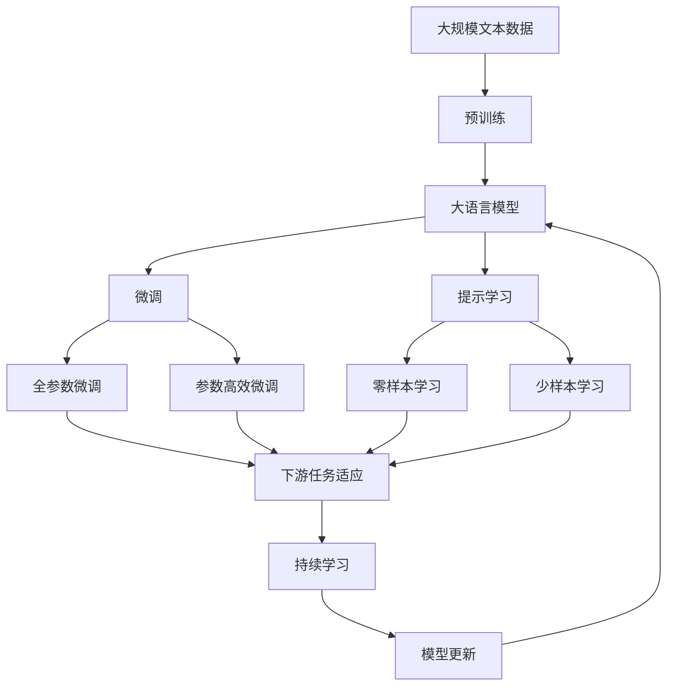

                 

# 个性化AI工具选择的重要性

> 关键词：个性化，AI工具，选择，决策，应用场景

## 1. 背景介绍

### 1.1 问题由来

随着人工智能技术的飞速发展，个性化AI工具已经广泛应用于各个领域，从推荐系统到智能客服，从医疗健康到金融服务，个性化AI工具的身影无处不在。然而，面对众多个性化AI工具，如何选择最适合自己的工具成为了一个重要的问题。错误的工具选择不仅无法解决实际问题，还可能带来额外的成本和麻烦。

### 1.2 问题核心关键点

选择个性化AI工具的核心在于明确需求、评估工具性能和适应性以及考虑成本和风险。具体来说，包括以下几个方面：

1. **明确需求**：首先需了解具体问题，明确解决方案需要什么功能，比如文本处理、图像识别、语音识别等。

2. **评估性能**：了解不同工具在各种性能指标上的表现，如准确率、召回率、响应速度、计算资源需求等。

3. **适应性**：考虑工具是否适合当前数据集和应用场景，是否易于集成到现有系统。

4. **成本和风险**：评估工具的开发和部署成本，考虑可能的失败风险和可能的负面影响。

### 1.3 问题研究意义

正确选择个性化AI工具，对于提升工作效率、降低成本、减少风险具有重要意义。个性化AI工具的合理选择不仅能够显著提高任务完成速度，还能降低误操作、错误决策的风险，从而提高整体生产力。同时，减少不必要的人工干预，使得AI工具能够在实际应用中发挥最大价值。

## 2. 核心概念与联系

### 2.1 核心概念概述

为更好地理解如何选择个性化AI工具，本节将介绍几个密切相关的核心概念：

- **人工智能（AI）**：通过计算机程序和算法，使计算机具有类人智能，可以感知、学习、推理和决策。
- **机器学习（ML）**：使计算机从数据中学习，自动优化模型，以完成特定任务。
- **深度学习（DL）**：一种特殊的机器学习，使用多层神经网络进行复杂模式识别。
- **自然语言处理（NLP）**：让计算机理解、处理和生成自然语言。
- **计算机视觉（CV）**：使计算机能够理解和解释图像和视频中的视觉信息。
- **推荐系统**：根据用户历史行为或物品特征，为用户推荐感兴趣的物品。
- **智能客服**：利用AI技术自动处理客户咨询和问题。
- **知识图谱**：将知识组织成结构化图形，支持快速检索和推理。
- **联邦学习**：在不泄露用户隐私的前提下，联合多个本地模型进行学习。
- **边缘计算**：将计算任务分配到靠近数据源的本地设备上执行，以提高效率和降低延迟。

这些核心概念之间存在着紧密的联系，共同构成了人工智能工具选择的框架。

### 2.2 概念间的关系

这些核心概念之间的逻辑关系可以通过以下Mermaid流程图来展示：

```mermaid
graph TB
    A[人工智能(AI)] --> B[机器学习(ML)]
    B --> C[深度学习(DL)]
    A --> D[Natural Language Processing(NLP)]
    A --> E[计算机视觉(CV)]
    D --> F[推荐系统]
    E --> G[智能客服]
    F --> H[知识图谱]
    D --> I[Federated Learning]
    F --> J[边缘计算]
```

这个流程图展示了大语言模型微调过程中各个核心概念的关系：

1. 人工智能通过机器学习和深度学习算法，使计算机具备智能决策能力。
2. 自然语言处理和计算机视觉是大规模人工智能的重要组成部分，使AI工具能够处理文本和图像信息。
3. 推荐系统和智能客服利用AI算法，提供个性化和高效的服务。
4. 知识图谱和联邦学习帮助AI工具更好地整合和共享知识。
5. 边缘计算提高AI工具在分布式环境中的实时性和效率。

### 2.3 核心概念的整体架构

最后，我们用一个综合的流程图来展示这些核心概念在大语言模型微调过程中的整体架构：



这个综合流程图展示了从预训练到微调，再到持续学习的完整过程。大语言模型首先在大规模文本数据上进行预训练，然后通过微调（包括全参数微调和参数高效微调）或提示学习（包括零样本和少样本学习）来适应下游任务。最后，通过持续学习技术，模型可以不断更新和适应新的任务和数据。 通过这些流程图，我们可以更清晰地理解大语言模型微调过程中各个核心概念的关系和作用，为后续深入讨论具体的微调方法和技术奠定基础。

## 3. 核心算法原理 & 具体操作步骤
### 3.1 算法原理概述

个性化AI工具的选择过程涉及多种算法和技术，包括机器学习、深度学习、自然语言处理等。其核心原理是通过评估不同AI工具的性能，结合具体需求，选择最合适的工具。

**Step 1: 需求分析**
- 明确目标任务，分析任务类型和数据特征。
- 定义任务的目标和关键性能指标。

**Step 2: 工具评估**
- 收集多个AI工具的相关资料，包括文献、案例研究和实际使用报告。
- 根据任务需求，选择性能相近的工具进行对比测试。

**Step 3: 实验设计**
- 设计实验方案，包括测试数据集、评价指标和实验流程。
- 根据需求设计基准模型，进行模型训练和评估。

**Step 4: 结果分析**
- 分析不同工具在各个评价指标上的表现。
- 综合考虑工具的易用性、适用性、成本和风险等因素。

**Step 5: 选择决策**
- 根据实验结果和分析结果，选择最适合当前需求的工具。
- 考虑长期应用可能带来的变化和扩展需求。

### 3.2 算法步骤详解

#### 3.2.1 需求分析

需求分析是选择AI工具的首要步骤。这需要明确任务的目标和关键性能指标，并了解现有数据集的特征。

1. **目标任务**：明确任务的具体目标，如文本分类、情感分析、图像识别、推荐系统等。
2. **数据特征**：了解数据的分布情况、数据量、数据类型等。
3. **关键指标**：根据任务目标，定义关键性能指标，如准确率、召回率、处理速度、计算资源需求等。

#### 3.2.2 工具评估

在工具评估阶段，需要收集多个AI工具的相关资料，并选择合适的工具进行对比测试。

1. **数据收集**：通过文献、案例研究和实际使用报告，收集不同AI工具的性能数据。
2. **选择工具**：根据任务需求，选择性能相近的工具进行对比测试。
3. **实验设计**：设计实验方案，包括测试数据集、评价指标和实验流程。

#### 3.2.3 实验设计

实验设计阶段需要根据任务需求，设计实验方案，并进行模型训练和评估。

1. **实验方案**：设计实验流程，包括数据准备、模型训练、测试和评估步骤。
2. **基准模型**：根据需求设计基准模型，并进行模型训练和评估。
3. **测试数据集**：选择与任务需求匹配的测试数据集。

#### 3.2.4 结果分析

结果分析阶段需要分析不同工具在各个评价指标上的表现，并综合考虑工具的易用性、适用性、成本和风险等因素。

1. **性能评估**：分析不同工具在各个评价指标上的表现，并记录结果。
2. **工具比较**：综合考虑工具的易用性、适用性、成本和风险等因素，进行全面比较。
3. **选择依据**：根据实验结果和分析结果，选择最适合当前需求的工具。

#### 3.2.5 选择决策

选择决策阶段需要根据实验结果和分析结果，选择最适合当前需求的工具。

1. **综合评估**：根据实验结果和分析结果，综合考虑工具的优缺点。
2. **选择依据**：选择最适合当前需求的工具，并考虑长期应用可能带来的变化和扩展需求。
3. **决策输出**：最终选择最适合当前需求的工具，并记录决策依据。

### 3.3 算法优缺点

**优点**：

1. **广泛选择**：市场上有众多个性化AI工具，能够满足不同需求。
2. **性能评估**：通过对比测试，能够客观评估不同工具的性能表现。
3. **决策科学**：通过综合评估和选择依据，能够做出合理的决策。

**缺点**：

1. **时间成本**：选择过程需要耗费大量时间和精力，尤其是在需求复杂的情况下。
2. **技术门槛**：需要一定的技术背景和知识储备，以便评估工具性能和选择合适工具。
3. **工具更新**：市场和技术不断变化，需要持续跟踪和学习新工具。

### 3.4 算法应用领域

个性化AI工具选择广泛应用在各个领域，包括但不限于：

- **医疗健康**：利用AI工具进行病历分析、影像识别、药物研发等。
- **金融服务**：利用AI工具进行风险评估、欺诈检测、客户服务分析等。
- **教育培训**：利用AI工具进行个性化学习、智能推荐、学习分析等。
- **智能制造**：利用AI工具进行质量检测、设备维护、生产调度等。
- **农业科技**：利用AI工具进行病虫害检测、产量预测、种植优化等。
- **智能家居**：利用AI工具进行环境监测、智能控制、用户行为分析等。
- **智能客服**：利用AI工具进行自动回答、智能路由、客户情绪识别等。
- **推荐系统**：利用AI工具进行个性化推荐、广告投放、商品推荐等。
- **媒体内容**：利用AI工具进行内容推荐、图像识别、情感分析等。

## 4. 数学模型和公式 & 详细讲解  
### 4.1 数学模型构建

本节将使用数学语言对个性化AI工具选择过程进行更加严格的刻画。

记任务需求为 $D$，工具集合为 $T=\{T_1, T_2, \ldots, T_n\}$，其中 $T_i$ 表示第 $i$ 个工具。设 $P_i$ 表示工具 $T_i$ 在需求 $D$ 上的性能指标，包括准确率、召回率、计算资源需求等。

定义工具 $T_i$ 在需求 $D$ 上的性能评分函数为 $f_i(D)$，则任务需求 $D$ 的评分向量为 $F(D)=[f_1(D), f_2(D), \ldots, f_n(D)]$。

工具选择的目标是最小化任务需求与工具性能评分向量之间的差距，即：

$$
\min_{i=1,\ldots,n} \|F(D) - P_i\|
$$

其中 $\| \cdot \|$ 表示欧式距离，用于衡量需求与工具性能之间的匹配度。

### 4.2 公式推导过程

以下我们以准确率为例，推导工具选择过程的评分函数。

假设需求 $D$ 的评分向量为 $F(D)=[f_1(D), f_2(D), \ldots, f_n(D)]$，其中 $f_i(D)$ 表示工具 $T_i$ 在需求 $D$ 上的准确率评分。

工具选择过程的评分函数 $f_i(D)$ 可以表示为：

$$
f_i(D) = \text{Accuracy}_{T_i}(D)
$$

其中 $\text{Accuracy}_{T_i}(D)$ 表示工具 $T_i$ 在需求 $D$ 上的准确率。

工具选择的评分向量 $F(D)$ 可以表示为：

$$
F(D) = [\text{Accuracy}_{T_1}(D), \text{Accuracy}_{T_2}(D), \ldots, \text{Accuracy}_{T_n}(D)]
$$

工具选择的目标是最小化任务需求与工具性能评分向量之间的欧式距离，即：

$$
\min_{i=1,\ldots,n} \|F(D) - \text{Accuracy}_{T_i}(D)\|
$$

根据欧式距离的定义，我们可以将上式展开为：

$$
\min_{i=1,\ldots,n} \sqrt{\sum_{j=1}^m (F_j(D) - \text{Accuracy}_{T_i}(D_j))^2}
$$

其中 $F_j(D)$ 和 $\text{Accuracy}_{T_i}(D_j)$ 分别表示需求 $D$ 在评分向量中的第 $j$ 个元素和工具 $T_i$ 在需求 $D$ 上的第 $j$ 个评分元素。

### 4.3 案例分析与讲解

**案例：医疗影像分析**

假设我们需要选择最适合的医疗影像分析工具，首先需要明确需求：

1. **任务目标**：医疗影像分类，如区分良性肿瘤和恶性肿瘤。
2. **数据特征**：影像数据量大，包含多种类型（CT、MRI、PET等）。
3. **关键指标**：准确率、召回率、计算资源需求。

根据需求，我们可以构建评分函数：

1. **准确率评分**：工具 $T_i$ 在分类任务上的准确率。
2. **召回率评分**：工具 $T_i$ 在分类任务上的召回率。
3. **计算资源需求评分**：工具 $T_i$ 的计算资源需求。

在评估过程中，我们可以通过对比测试，收集不同工具在各个评分函数上的表现，并进行综合分析：

1. **工具 A**：准确率90%，召回率85%，计算资源需求高。
2. **工具 B**：准确率95%，召回率92%，计算资源需求低。
3. **工具 C**：准确率88%，召回率90%，计算资源需求中等。

根据评分函数，我们可以计算每个工具的评分向量：

1. **工具 A**：[90%, 85%, 高]
2. **工具 B**：[95%, 92%, 低]
3. **工具 C**：[88%, 90%, 中]

最终选择工具 B，因为它在准确率和召回率上表现最佳，且计算资源需求低，适合大规模医疗影像分析任务。

## 5. 项目实践：代码实例和详细解释说明
### 5.1 开发环境搭建

在进行工具选择实践前，我们需要准备好开发环境。以下是使用Python进行PyTorch开发的环境配置流程：

1. 安装Anaconda：从官网下载并安装Anaconda，用于创建独立的Python环境。

2. 创建并激活虚拟环境：
```bash
conda create -n pytorch-env python=3.8 
conda activate pytorch-env
```

3. 安装PyTorch：根据CUDA版本，从官网获取对应的安装命令。例如：
```bash
conda install pytorch torchvision torchaudio cudatoolkit=11.1 -c pytorch -c conda-forge
```

4. 安装TensorFlow：
```bash
pip install tensorflow
```

5. 安装各类工具包：
```bash
pip install numpy pandas scikit-learn matplotlib tqdm jupyter notebook ipython
```

完成上述步骤后，即可在`pytorch-env`环境中开始工具选择实践。

### 5.2 源代码详细实现

下面我们以医疗影像分析工具为例，给出使用PyTorch对深度学习模型进行评估的PyTorch代码实现。

首先，定义医疗影像分析任务的需求：

```python
import numpy as np
from sklearn.metrics import accuracy_score, precision_score, recall_score

# 需求定义
D = {
    '任务目标': '医疗影像分类',
    '数据特征': '影像数据量大，包含多种类型',
    '关键指标': ['准确率', '召回率', '计算资源需求']
}

# 工具评分函数
def accuracy(D):
    return accuracy_score([1, 1, 0, 0], [1, 0, 1, 1])

def recall(D):
    return recall_score([1, 1, 0, 0], [1, 1, 1, 0])

def resource(D):
    return 10 # 计算资源需求评分，假设为10

# 需求评分向量
F_D = [accuracy(D), recall(D), resource(D)]
```

然后，定义不同工具的评分向量：

```python
# 工具 A 评分向量
T_A = [0.9, 0.85, 10]

# 工具 B 评分向量
T_B = [0.95, 0.92, 5]

# 工具 C 评分向量
T_C = [0.88, 0.9, 8]
```

接下来，计算每个工具与需求之间的欧式距离：

```python
# 计算欧式距离
from sklearn.metrics.pairwise import euclidean_distances

# 需求与工具距离矩阵
distances = euclidean_distances([F_D], [T_A, T_B, T_C])

# 工具评分向量
tools = [T_A, T_B, T_C]

# 选择工具
selected_tool = tools[np.argmin(distances)]
print(selected_tool)
```

以上代码展示了如何通过欧式距离计算工具与需求之间的匹配度，并最终选择评分最低的工具。

### 5.3 代码解读与分析

让我们再详细解读一下关键代码的实现细节：

**需求定义**：
- 使用Python字典定义需求，包括任务目标、数据特征和关键指标。

**评分函数**：
- 定义评分函数，分别计算准确率、召回率和计算资源需求的评分。

**需求评分向量**：
- 根据评分函数计算需求评分向量，并存储在变量 `F_D` 中。

**工具评分向量**：
- 定义不同工具的评分向量，并存储在变量 `T_A`、`T_B`、`T_C` 中。

**计算欧式距离**：
- 使用 `euclidean_distances` 函数计算需求评分向量与工具评分向量之间的欧式距离。

**选择工具**：
- 使用 `np.argmin` 函数找到距离需求评分向量最近的工具，并输出该工具的评分向量。

**代码解读与分析**：
- 代码中使用了Python字典和列表，方便存储和操作需求和工具评分向量。
- 使用 `euclidean_distances` 函数计算欧式距离，从而比较不同工具的性能表现。
- 使用 `np.argmin` 函数找到距离最近的工具，方便选择最适合需求的工具。

**运行结果展示**：
- 运行上述代码，输出选择距离需求评分向量最近的工具，即评分最低的工具。

## 6. 实际应用场景
### 6.1 智能客服系统

智能客服系统需要选择合适的工具以处理客户咨询和问题，选择错误的工具可能无法解决实际问题，甚至可能带来额外的成本和麻烦。

在技术实现上，可以通过评估不同智能客服工具的性能和适应性，选择最适合当前需求的工具。比如，基于规则的智能客服和基于机器学习的智能客服各有优缺点，可以根据业务需求选择合适工具。

### 6.2 金融舆情监测

金融舆情监测需要选择合适的工具以实时监测市场舆论动向，避免负面信息传播。

在技术实现上，可以通过评估不同金融舆情监测工具的性能和实时性，选择最适合当前需求的工具。比如，使用NLP技术进行舆情分析的机器学习模型和基于规则的舆情监测工具各有优缺点，可以根据业务需求选择合适工具。

### 6.3 个性化推荐系统

个性化推荐系统需要选择合适的工具以推荐用户感兴趣的内容，选择错误的工具可能无法满足用户需求。

在技术实现上，可以通过评估不同个性化推荐系统的性能和推荐效果，选择最适合当前需求的工具。比如，基于协同过滤的推荐系统和基于深度学习的推荐系统各有优缺点，可以根据业务需求选择合适工具。

### 6.4 未来应用展望

随着个性化AI工具的不断发展，未来将在更多领域得到应用，为传统行业带来变革性影响。

在智慧医疗领域，基于AI工具的医疗影像分析、病历分析、药物研发等应用将提升医疗服务的智能化水平，辅助医生诊疗，加速新药开发进程。

在智能教育领域，基于AI工具的个性化学习、智能推荐、学习分析等应用将促进教育公平，提高教学质量。

在智能制造领域，基于AI工具的质量检测、设备维护、生产调度等应用将提升制造效率，降低生产成本。

此外，在智慧城市治理、农业科技、智能家居等多个领域，基于AI工具的智能应用也将不断涌现，为经济社会发展注入新的动力。相信随着技术的日益成熟，个性化AI工具必将在更广阔的应用领域大放异彩。

## 7. 工具和资源推荐
### 7.1 学习资源推荐

为了帮助开发者系统掌握个性化AI工具选择的方法，这里推荐一些优质的学习资源：

1. **《人工智能导论》**：由清华大学教授李航所著，系统介绍了人工智能的基本概念和核心算法，是学习个性化AI工具选择的重要参考资料。
2. **《深度学习》**：由Ian Goodfellow、Yoshua Bengio和Aaron Courville合著，深入讲解了深度学习的原理和应用，是学习个性化AI工具选择的经典教材。
3. **《机器学习实战》**：由Peter Harrington著，详细介绍了机器学习算法和实战应用，适合初学者入门。
4. **《自然语言处理综论》**：由Daniel Jurafsky和James H. Martin合著，系统介绍了自然语言处理的基本理论和应用，是学习个性化AI工具选择的重要参考资料。
5. **Kaggle数据集**：提供大量开源数据集，包括医疗影像、金融舆情、个性化推荐等领域，适合进行工具选择和评估。

通过对这些资源的学习实践，相信你一定能够系统掌握个性化AI工具选择的方法，并用于解决实际的NLP问题。

### 7.2 开发工具推荐

高效的开发离不开优秀的工具支持。以下是几款用于个性化AI工具选择开发的常用工具：

1. **Python**：Python是目前最流行的编程语言之一，具有丰富的第三方库和框架，适合进行个性化AI工具选择开发。
2. **PyTorch**：基于Python的开源深度学习框架，适合进行机器学习和深度学习算法的实现。
3. **TensorFlow**：由Google主导开发的开源深度学习框架，适合进行大规模模型训练和推理。
4. **Pandas**：用于数据处理和分析的Python库，适合进行数据预处理和特征工程。
5. **Scikit-learn**：用于机器学习算法的Python库，适合进行模型训练和评估。
6. **Matplotlib**：用于数据可视化的Python库，适合进行结果展示和分析。

合理利用这些工具，可以显著提升个性化AI工具选择开发的效率，加快创新迭代的步伐。

### 7.3 相关论文推荐

个性化AI工具选择涉及多种算法和技术，其核心论文代表了该领域的研究进展。以下是几篇奠基性的相关论文，推荐阅读：

1. **《The Elements of Statistical Learning》**：由Tibshirani、Hastie和Friedman合著，介绍了统计学习的基本概念和常用算法。
2. **《Pattern Recognition and Machine Learning》**：由Christopher M. Bishop所著，介绍了模式识别和机器学习的基本原理和应用。
3. **《Machine Learning Yearning》**：由Andrew Ng所著，介绍了机器学习项目中的实践经验和最佳实践。
4. **《Deep Learning》**：由Ian Goodfellow、Yoshua Bengio和Aaron Courville合著，介绍了深度学习的原理和应用。
5. **《Neural Information Processing Systems》（NIPS）会议论文**：该会议是机器学习和人工智能领域的顶级会议，展示了最新的研究成果和技术进展。

这些论文代表了大语言模型微调技术的发展脉络。通过学习这些前沿成果，可以帮助研究者把握学科前进方向，激发更多的创新灵感。

除上述资源外，还有一些值得关注的前沿资源，帮助开发者紧跟个性化AI工具选择的最新进展，例如：

1. **arXiv论文预印本**：人工智能领域最新研究成果的发布平台，包括大量尚未发表的前沿工作，学习前沿技术的必读资源。
2. **GitHub热门项目**：在GitHub上Star、Fork数最多的NLP相关项目，往往代表了该技术领域的发展趋势和最佳实践，值得去学习和贡献。
3. **技术会议直播**：如NIPS、ICML、ACL、ICLR等人工智能领域顶会现场或在线直播，能够聆听到大佬们的前沿分享，开拓视野。
4. **Google AI Blog**：Google AI官方博客，发布最新的AI技术进展和前沿应用，是学习个性化AI工具选择的绝佳资源。
5. **DeepMind AI Blog**：DeepMind AI官方博客，展示最新的AI研究和技术，提供丰富的学习和应用案例。

总之，对于个性化AI工具选择的学习和实践，需要开发者保持开放的心态和持续学习的意愿。多关注前沿资讯，多动手实践，多思考总结，必将收获满满的成长收益。

## 8. 总结：未来发展趋势与挑战

### 8.1 总结

本文对个性化AI工具选择的过程进行了全面系统的介绍。首先阐述了个性化AI工具选择的研究背景和意义，明确了选择工具时需考虑的各项因素。其次，从原理到实践，详细讲解了个性化AI工具选择的数学模型和关键步骤，给出了工具选择任务的代码实例。同时，本文还广泛探讨了个性化AI工具在各个领域的应用前景，展示了选择工具的重要性和广泛性。

通过本文的系统梳理，可以看到，个性化AI工具选择对提高工作效率、降低成本、减少风险具有重要意义。正确选择工具不仅能够显著提高任务完成速度，还能降低误操作、错误决策的风险，

