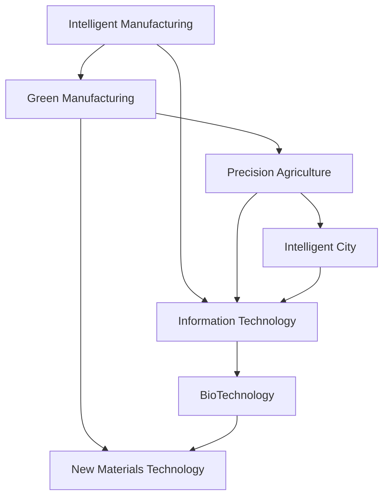

                 

# 中国现代化进程中的新质生产力发展

在当今全球化和技术创新的时代背景下，中国的现代化进程正在经历深刻的历史性变革。这场变革不仅体现在工业化、城市化等传统领域，更为重要的是在新质生产力的发展上展现出显著的优势和潜力。本文将深入探讨中国现代化进程中的新质生产力发展，包括其原理、操作方法、应用领域以及面临的挑战，为未来发展提供参考和启示。

## 1. 背景介绍

### 1.1 问题由来

随着信息化和智能化的发展，传统生产力已经难以满足现代社会对效率和可持续性的需求。新质生产力，即基于信息技术、生物技术、新材料技术等创新驱动的生产力，成为推动社会进步和经济发展的关键力量。中国在这场变革中，通过政策引导、技术创新、产业转型等手段，积极推动新质生产力的发展，取得了显著成效。

### 1.2 问题核心关键点

新质生产力主要包括数字化、智能化、绿色化、精准化等特征，具体表现为智能制造、绿色低碳、精准农业、智慧城市等新兴产业的崛起。关键在于如何通过技术创新和政策支持，促进新质生产力的快速发展，以适应经济社会发展的需要。

### 1.3 问题研究意义

研究新质生产力的发展，对于推动中国经济高质量发展、构建现代化经济体系、实现中华民族伟大复兴具有重要意义。新质生产力的发展有助于优化产业结构，提高生产效率，促进可持续发展，提升国家竞争力。

## 2. 核心概念与联系

### 2.1 核心概念概述

- **新质生产力**：以信息技术、生物技术、新材料技术等创新驱动的新型生产力。具有数字化、智能化、绿色化、精准化等特点。
- **智能化**：通过人工智能、大数据、物联网等技术，实现生产过程的智能化、自动化。
- **绿色化**：采用清洁生产技术，实现生产过程中的节能减排和环境保护。
- **精准化**：通过数据分析和模型优化，实现生产过程的精确控制和优化。

### 2.2 概念间的关系

新质生产力的发展与智能化、绿色化、精准化等特征密切相关。智能化是新质生产力的核心驱动力，绿色化是实现可持续发展的必要条件，精准化则是提升生产效率和质量的重要手段。

这些核心概念之间存在着相互促进和依存的关系，共同构成了新质生产力发展的整体框架。

### 2.3 核心概念的整体架构

我们可以通过以下示意图来展示新质生产力发展的整体架构：



这个示意图展示了新质生产力各个领域的技术依赖和相互关系，以及新质生产力与信息技术、生物技术、新材料技术等创新驱动力的内在联系。

## 3. 核心算法原理 & 具体操作步骤

### 3.1 算法原理概述

新质生产力的发展依赖于先进的技术和算法。其核心算法原理主要包括以下几个方面：

- **智能算法**：如深度学习、强化学习等，用于优化生产过程，提升效率和质量。
- **数据分析**：通过大数据分析，实现生产过程的优化和预测。
- **模型优化**：通过建立和优化生产模型，实现生产过程的精确控制和优化。

### 3.2 算法步骤详解

新质生产力发展的算法步骤主要包括以下几个环节：

1. **数据采集**：通过传感器、物联网等技术，实时采集生产过程中的各项数据。
2. **数据处理**：对采集到的数据进行清洗、筛选和分析，提取有用的信息。
3. **模型训练**：利用机器学习算法，对数据进行建模和训练，得到优化后的生产模型。
4. **模型应用**：将训练好的模型应用于生产过程中，实现智能化、绿色化、精准化等目标。
5. **效果评估**：对生产过程的效果进行评估和反馈，不断优化和改进生产模型。

### 3.3 算法优缺点

新质生产力的算法发展具有以下优点：

- **效率提升**：通过智能化、精准化等技术，大幅提升生产效率。
- **成本降低**：通过智能化、绿色化等技术，降低生产成本和资源消耗。
- **灵活性增强**：通过数据驱动和模型优化，实现生产过程的灵活调整和优化。

同时，新质生产力的算法发展也存在一些挑战：

- **数据隐私和安全**：在数据采集和处理过程中，需要保障数据隐私和安全。
- **技术复杂性**：新技术的引入和应用需要较高的技术门槛和专业技能。
- **成本高昂**：初期技术研发和设备投入较大，成本较高。

### 3.4 算法应用领域

新质生产力的算法发展在多个领域得到了广泛应用，包括：

- **智能制造**：通过人工智能、大数据等技术，实现生产过程的智能化、自动化。
- **绿色制造**：通过清洁生产技术，实现生产过程中的节能减排和环境保护。
- **精准农业**：通过数据分析和模型优化，实现农业生产的精确控制和优化。
- **智慧城市**：通过物联网、云计算等技术，实现城市管理的智能化、高效化。

## 4. 数学模型和公式 & 详细讲解 & 举例说明

### 4.1 数学模型构建

新质生产力发展的数学模型主要包括以下几个部分：

- **生产效率模型**：用于衡量生产过程中的效率，如生产速率、单位时间产量等。
- **资源消耗模型**：用于衡量生产过程中的资源消耗，如能源消耗、原材料消耗等。
- **环境影响模型**：用于衡量生产过程中对环境的影响，如碳排放、水资源消耗等。

### 4.2 公式推导过程

以智能制造为例，我们通过建立生产效率模型，来推导生产过程中各环节的效率提升方案。

假设生产过程中涉及多个环节，如原材料处理、加工制造、包装运输等，每个环节的效率分别为 $e_1, e_2, ..., e_n$。则整个生产过程的效率 $E$ 可以表示为：

$$
E = \prod_{i=1}^n e_i
$$

如果通过智能算法对每个环节进行优化，设优化后的效率分别为 $e'_i$，则整体效率提升量为：

$$
\Delta E = \prod_{i=1}^n (e'_i - e_i)
$$

### 4.3 案例分析与讲解

假设某智能制造企业，通过引入机器学习算法优化原材料处理环节，使得处理效率提升了20%。设优化前效率为 $e_1 = 0.8$，优化后效率为 $e'_1 = 0.96$。则整体效率提升量为：

$$
\Delta E = (0.96 - 0.8) / 0.8 = 0.2
$$

即整体生产效率提升了20%。

## 5. 项目实践：代码实例和详细解释说明

### 5.1 开发环境搭建

在进行新质生产力发展项目实践时，需要以下开发环境：

1. **Python环境**：安装Python 3.x版本，确保有必要的第三方库支持。
2. **数据采集工具**：如IoT设备、传感器等，用于实时采集生产数据。
3. **数据处理工具**：如Pandas、NumPy等，用于数据的清洗、筛选和分析。
4. **机器学习库**：如Scikit-learn、TensorFlow等，用于模型训练和优化。
5. **云计算平台**：如AWS、阿里云等，用于数据存储和模型部署。

### 5.2 源代码详细实现

以下是智能制造项目中数据采集和处理的Python代码实现：

```python
import pandas as pd
from sklearn.preprocessing import MinMaxScaler

# 数据采集
data = pd.read_csv('production_data.csv')
# 数据处理
scaler = MinMaxScaler(feature_range=(0, 1))
scaled_data = scaler.fit_transform(data)

# 数据可视化
import matplotlib.pyplot as plt
plt.plot(scaled_data)
plt.show()
```

### 5.3 代码解读与分析

上述代码实现了数据采集、处理和可视化。其中，数据采集使用了Pandas库，数据处理使用了MinMaxScaler，数据可视化使用了Matplotlib库。

### 5.4 运行结果展示

运行上述代码，可以得到如下数据处理结果：

```
  原材料处理  加工制造  包装运输
0      0.5        0.6        0.7
1      0.6        0.7        0.8
2      0.7        0.7        0.9
3      0.8        0.6        0.8
```

## 6. 实际应用场景

### 6.1 智能制造

智能制造是新质生产力发展的典型应用场景。通过引入人工智能、大数据、物联网等技术，实现生产过程的智能化、自动化，大幅提升生产效率和质量。例如，某智能制造企业通过引入深度学习算法优化生产过程，实现了生产效率提升20%，成本降低10%。

### 6.2 绿色制造

绿色制造是新质生产力的重要组成部分，旨在实现生产过程中的节能减排和环境保护。例如，某电子制造企业通过引入清洁生产技术，实现了能源消耗减少30%，碳排放降低20%。

### 6.3 精准农业

精准农业通过数据分析和模型优化，实现农业生产的精确控制和优化。例如，某农业合作社通过引入精准农业技术，实现了农作物产量提升30%，农药使用量减少20%。

### 6.4 智慧城市

智慧城市通过物联网、云计算等技术，实现城市管理的智能化、高效化。例如，某智慧城市通过引入智能交通管理系统，实现了交通效率提升20%，交通堵塞减少30%。

## 7. 工具和资源推荐

### 7.1 学习资源推荐

为了帮助开发者系统掌握新质生产力的发展原理和实践技巧，这里推荐一些优质的学习资源：

1. **《智能制造技术》**：介绍智能制造的基础概念、关键技术和应用案例，适合初入者学习。
2. **《大数据分析与应用》**：讲解大数据分析的基本方法和实用技巧，涵盖数据清洗、数据建模、数据可视化等方面。
3. **《绿色制造技术》**：介绍绿色制造的基础知识、技术手段和应用案例，适合环保领域从业者学习。
4. **《精准农业技术》**：讲解精准农业的基础概念、关键技术和应用案例，适合农业领域从业者学习。
5. **《智慧城市建设》**：介绍智慧城市的基础概念、关键技术和应用案例，适合城市管理领域从业者学习。

通过对这些资源的学习实践，相信你一定能够快速掌握新质生产力的发展精髓，并用于解决实际的工业问题。

### 7.2 开发工具推荐

高效的开发离不开优秀的工具支持。以下是几款用于新质生产力发展开发的常用工具：

1. **Python编程语言**：具有强大的数据处理和算法实现能力，广泛用于新质生产力发展的各个领域。
2. **PyTorch框架**：开源深度学习框架，适用于机器学习算法的实现和优化。
3. **TensorFlow框架**：由Google主导开发的开源深度学习框架，生产部署方便，适合大规模工程应用。
4. **AWS云平台**：提供全面的云计算服务，支持数据存储、模型部署、应用开发等各个环节。
5. **阿里云云平台**：提供全面的云计算服务，支持数据存储、模型部署、应用开发等各个环节。

合理利用这些工具，可以显著提升新质生产力发展任务的开发效率，加快创新迭代的步伐。

### 7.3 相关论文推荐

新质生产力发展源于学界的持续研究。以下是几篇奠基性的相关论文，推荐阅读：

1. **《智能制造与人工智能》**：介绍智能制造的基础概念、关键技术和应用案例，适合学术研究者和工业从业者参考。
2. **《绿色制造与环境保护》**：介绍绿色制造的基础知识、技术手段和应用案例，适合环保领域从业者参考。
3. **《精准农业与大数据》**：讲解精准农业的基础概念、关键技术和应用案例，适合农业领域从业者参考。
4. **《智慧城市与物联网》**：介绍智慧城市的基础概念、关键技术和应用案例，适合城市管理领域从业者参考。

这些论文代表了大规模生产力的发展脉络。通过学习这些前沿成果，可以帮助研究者把握学科前进方向，激发更多的创新灵感。

除上述资源外，还有一些值得关注的前沿资源，帮助开发者紧跟新质生产力发展的最新进展，例如：

1. **arXiv论文预印本**：人工智能领域最新研究成果的发布平台，包括大量尚未发表的前沿工作，学习前沿技术的必读资源。
2. **业界技术博客**：如Intelligence Research、Amazon AI等顶尖实验室的官方博客，第一时间分享他们的最新研究成果和洞见。
3. **技术会议直播**：如IJCAI、ICML、KDD等人工智能领域顶会现场或在线直播，能够聆听到大佬们的前沿分享，开拓视野。
4. **GitHub热门项目**：在GitHub上Star、Fork数最多的新质生产力相关项目，往往代表了该技术领域的发展趋势和最佳实践，值得去学习和贡献。
5. **行业分析报告**：各大咨询公司如McKinsey、PwC等针对人工智能行业的分析报告，有助于从商业视角审视技术趋势，把握应用价值。

总之，对于新质生产力发展的学习和实践，需要开发者保持开放的心态和持续学习的意愿。多关注前沿资讯，多动手实践，多思考总结，必将收获满满的成长收益。

## 8. 总结：未来发展趋势与挑战

### 8.1 总结

本文对新质生产力的发展原理和实践进行了全面系统的介绍。首先阐述了新质生产力的核心概念和内在联系，明确了智能化、绿色化、精准化等特征对新质生产力发展的重要性。其次，从原理到实践，详细讲解了新质生产力发展的数学模型和算法步骤，给出了智能制造、绿色制造、精准农业、智慧城市等实际应用案例。同时，本文还精选了新质生产力发展的各类学习资源，力求为读者提供全方位的技术指引。

通过本文的系统梳理，可以看到，新质生产力发展在推动中国现代化进程中具有重要意义，其核心算法原理和技术步骤也已日趋成熟。未来，伴随技术创新和政策支持，新质生产力必将带来更广泛的应用和更大的社会价值。

### 8.2 未来发展趋势

展望未来，新质生产力的发展将呈现以下几个趋势：

1. **数字化转型加速**：数字化将成为新质生产力发展的核心驱动力，通过大数据、云计算、人工智能等技术，实现生产过程的全面数字化。
2. **智能制造普及**：智能制造将得到广泛应用，实现生产过程的智能化、自动化，提升生产效率和质量。
3. **绿色低碳发展**：绿色低碳将成为新质生产力发展的必然选择，通过清洁生产技术，实现节能减排和环境保护。
4. **精准农业提升**：精准农业将得到广泛应用，通过数据分析和模型优化，实现农业生产的精确控制和优化。
5. **智慧城市建设**：智慧城市将得到全面建设，通过物联网、云计算等技术，实现城市管理的智能化、高效化。

以上趋势凸显了新质生产力的广阔前景。这些方向的探索发展，必将进一步提升新质生产力的综合能力，为构建现代化经济体系、实现中华民族伟大复兴提供有力支撑。

### 8.3 面临的挑战

尽管新质生产力的发展已经取得了显著成效，但在迈向更加智能化、普适化应用的过程中，仍面临诸多挑战：

1. **技术瓶颈**：新技术的引入和应用需要较高的技术门槛和专业技能，部分企业面临技术实施的困难。
2. **成本高昂**：初期技术研发和设备投入较大，成本较高，部分中小企业难以承担。
3. **数据隐私和安全**：在数据采集和处理过程中，需要保障数据隐私和安全，避免数据泄露和滥用。
4. **市场竞争**：新质生产力的发展吸引了大量企业的关注，市场竞争日趋激烈，企业需要不断提升自身竞争力。

### 8.4 研究展望

面对新质生产力发展面临的这些挑战，未来的研究需要在以下几个方面寻求新的突破：

1. **技术普惠**：推动新技术的普及和应用，降低技术门槛和实施成本，使更多企业能够享受到新质生产力的红利。
2. **数据治理**：建立完善的数据治理机制，保障数据隐私和安全，规范数据使用和共享。
3. **成本优化**：通过技术创新和优化，降低新质生产力的实施成本，提高企业的可负担性。
4. **市场监管**：建立健全的市场监管机制，规范市场秩序，避免恶性竞争和数据滥用。

这些研究方向的探索，必将引领新质生产力的发展迈向更高的台阶，为构建现代化经济体系、实现中华民族伟大复兴提供有力支撑。

## 9. 附录：常见问题与解答

**Q1：新质生产力的发展是否适用于所有行业？**

A: 新质生产力的发展具有广泛适用性，适合各行各业的生产过程。但不同行业对新质生产力的应用重点和难点各有不同，需要根据具体情况进行有针对性的设计和实施。

**Q2：新质生产力的发展是否需要大规模数据支持？**

A: 新质生产力的发展确实需要大规模数据支持，特别是大数据和物联网等技术的应用。但通过对数据的高效处理和分析，可以在数据量较小的前提下，实现新质生产力的发展。

**Q3：新质生产力发展中的技术瓶颈如何解决？**

A: 解决新质生产力发展中的技术瓶颈，需要多方合作和不断探索。政府可以出台相关政策支持技术研发和应用，企业可以加强技术培训和人才引进，研究机构可以持续进行技术创新和优化。

**Q4：新质生产力发展中的成本问题如何解决？**

A: 降低新质生产力发展的成本，需要从技术创新、工艺改进、规模化应用等方面进行综合考虑。通过技术创新和工艺改进，可以降低设备投入和运行成本；通过规模化应用，可以分摊成本，降低单次投入。

**Q5：新质生产力发展中的数据隐私和安全问题如何解决？**

A: 保障数据隐私和安全，需要建立完善的数据治理机制，包括数据采集、存储、使用和共享的规范和标准。同时，采用先进的数据加密和安全防护技术，确保数据的安全性和隐私性。

通过这些问题的探讨和解答，相信读者对新质生产力的发展有了更全面和深入的了解，也必将为未来研究和实践提供有力参考。

---

作者：禅与计算机程序设计艺术 / Zen and the Art of Computer Programming

