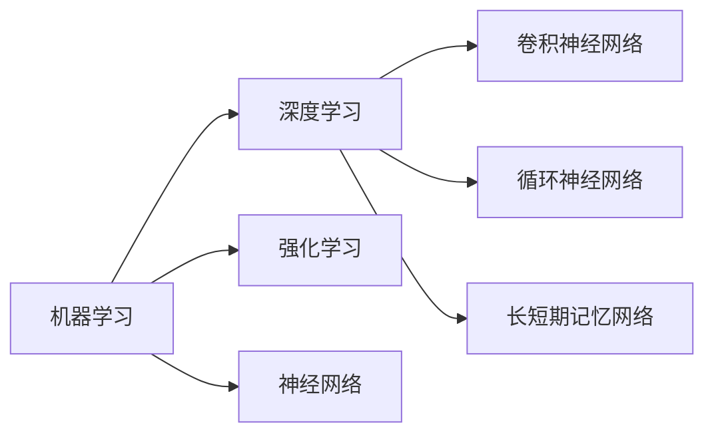
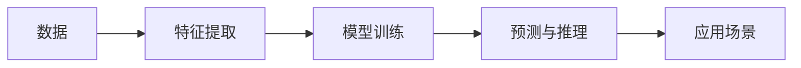

                 

# 人工智能(Artificial Intelligence) - 原理与代码实例讲解

> 关键词：人工智能,深度学习,机器学习,强化学习,神经网络,深度学习框架,代码实例

## 1. 背景介绍

### 1.1 问题由来
人工智能(AI)作为当今科技革命的重要驱动力，正深刻改变着各行各业，包括医疗、金融、教育、交通等领域。AI技术不仅推动了传统行业的数字化转型，还在探索全新的应用场景，如无人驾驶、智能机器人、虚拟助手等。

### 1.2 问题核心关键点
AI技术的核心在于利用算法和计算能力，对海量数据进行高效处理和分析，实现机器的自主学习与决策能力。其中，机器学习、深度学习和强化学习是AI技术的三大支柱：

- 机器学习（Machine Learning）：通过数据训练模型，使其能够自动地从数据中学习规律，实现分类、回归、聚类等任务。
- 深度学习（Deep Learning）：利用神经网络结构，模拟人脑神经元的工作原理，通过多层抽象特征的提取，提升模型的表示能力和学习效率。
- 强化学习（Reinforcement Learning）：通过智能体与环境的交互，学习最优决策策略，实现游戏、机器人控制等任务。

这些技术的应用，不仅推动了科学研究的发展，也在实际生活中发挥了重要作用。但随着技术的不断进步，AI系统也面临着诸如算力、数据、可解释性、安全性等问题，需要通过持续的技术创新和优化，进一步提升系统的性能和可靠性。

### 1.3 问题研究意义
研究AI技术的核心算法和实现方法，不仅能够提升AI系统的性能和应用效果，还能为开发者提供实用的技术指导，加速AI技术的产业化进程。具体而言：

- 降低应用开发成本：AI技术的开源工具和库，使得开发者能够快速搭建AI系统，减少了对昂贵硬件和数据的依赖。
- 提升系统性能：通过优化算法和模型结构，提升AI系统的准确性和鲁棒性，满足更多实际需求。
- 加速技术应用：AI技术的模块化和工具化，简化了系统的集成和部署，使得AI技术能够更快地应用于各个行业。
- 促进技术创新：深入理解AI技术的原理和实现，有助于发现新的研究方向和技术突破，推动AI技术的持续进步。
- 提升系统可靠性：AI技术的可解释性和安全性研究，有助于构建透明、可信的AI系统，减少误导性和有害输出。

## 2. 核心概念与联系

### 2.1 核心概念概述
为更好地理解AI技术的实现原理和应用方法，本节将介绍几个核心概念及其相互关系。

- **机器学习（Machine Learning）**：基于数据训练模型，使模型能够自动地从数据中学习规律，实现分类、回归、聚类等任务。
- **深度学习（Deep Learning）**：利用神经网络结构，通过多层抽象特征的提取，提升模型的表示能力和学习效率。
- **强化学习（Reinforcement Learning）**：通过智能体与环境的交互，学习最优决策策略，实现游戏、机器人控制等任务。
- **神经网络（Neural Network）**：一种模拟人脑神经元结构的计算模型，通过多层神经元的连接和激活，实现复杂的特征提取和模式识别。
- **深度神经网络（Deep Neural Network, DNN）**：一种具有多层神经元的神经网络，广泛应用于图像识别、语音识别、自然语言处理等任务。
- **卷积神经网络（Convolutional Neural Network, CNN）**：一种特别适用于图像处理任务的深度神经网络，通过卷积操作提取图像特征。
- **循环神经网络（Recurrent Neural Network, RNN）**：一种能够处理序列数据的神经网络，通过循环结构记忆历史信息。
- **长短期记忆网络（Long Short-Term Memory, LSTM）**：一种特殊的RNN结构，能够有效解决梯度消失问题，适用于序列数据的长期依赖建模。

这些核心概念之间存在着紧密的联系，形成了AI技术的理论基础和实现框架。

### 2.2 概念间的关系

通过以下Mermaid流程图，我们可以更清晰地理解AI技术的核心概念及其相互关系。



### 2.3 核心概念的整体架构

为更全面地展示AI技术的大致架构，我们通过一个综合的流程图来展示这些核心概念：



在这个流程图中，数据首先通过特征提取过程，形成模型能够处理的形式；然后，通过模型训练，模型从数据中学习规律；最后，模型进行预测与推理，得到实际应用中的结果。

## 3. 核心算法原理 & 具体操作步骤

### 3.1 算法原理概述
AI技术的核心在于利用算法和计算能力，对数据进行处理和分析，实现机器的自主学习与决策能力。具体而言：

- **监督学习（Supervised Learning）**：通过有标签的数据集训练模型，使模型能够根据输入数据预测输出标签。常用的算法包括线性回归、决策树、支持向量机、神经网络等。
- **无监督学习（Unsupervised Learning）**：通过无标签的数据集训练模型，使模型能够自主发现数据中的结构与规律。常用的算法包括聚类、降维、关联规则等。
- **半监督学习（Semi-Supervised Learning）**：通过少量有标签数据和大量无标签数据共同训练模型，利用无标签数据的丰富信息提升模型的性能。常用的算法包括标签传播、混合学习等。
- **强化学习（Reinforcement Learning）**：通过智能体与环境的交互，学习最优决策策略。常用的算法包括Q-learning、策略梯度、蒙特卡罗树搜索等。

这些算法构成了AI技术的核心，通过不同的数据和任务类型，选择合适的算法，能够有效提升模型的性能和应用效果。

### 3.2 算法步骤详解
下面以监督学习中的深度学习算法为例，详细介绍其实现步骤。

**Step 1: 数据准备**
- 收集数据集 $D=\{(x_i,y_i)\}_{i=1}^N$，其中 $x_i$ 表示输入，$y_i$ 表示标签。
- 对数据进行预处理，如归一化、特征提取等。

**Step 2: 模型构建**
- 设计深度神经网络结构，包括输入层、隐藏层和输出层。
- 确定每层的神经元数量和激活函数。
- 选择优化器和损失函数，如AdamW、交叉熵损失等。

**Step 3: 模型训练**
- 使用训练集数据 $D_{train}=\{(x_i,y_i)\}_{i=1}^M$ 对模型进行迭代训练。
- 前向传播计算输出 $y_{pred}=M(x_{input})$。
- 计算预测结果与真实标签之间的差异，即损失函数 $L=L(y_{pred},y_{true})$。
- 反向传播计算损失函数对模型参数的梯度 $\nabla_{\theta}L$。
- 使用优化器更新模型参数 $\theta \leftarrow \theta - \eta\nabla_{\theta}L$，其中 $\eta$ 为学习率。

**Step 4: 模型评估**
- 使用验证集数据 $D_{val}=\{(x_i,y_i)\}_{i=1}^N$ 对模型进行评估。
- 计算模型在验证集上的损失和指标（如准确率、召回率等）。
- 根据评估结果调整模型参数，如调整学习率、添加正则化等。

**Step 5: 模型应用**
- 使用测试集数据 $D_{test}=\{(x_i,y_i)\}_{i=1}^N$ 对模型进行最终测试。
- 计算模型在测试集上的损失和指标。
- 将模型应用于实际应用场景，进行预测与推理。

### 3.3 算法优缺点
深度学习算法在AI领域具有广泛应用，但也存在一些局限性：

**优点**
- 强大的表示能力：深度神经网络能够学习多层抽象特征，提升模型对复杂问题的处理能力。
- 自动特征提取：深度神经网络能够自主提取输入数据的特征，减少特征工程的工作量。
- 泛化能力强：通过大规模数据训练，深度学习算法能够在不同的数据集上取得良好的泛化性能。

**缺点**
- 需要大量数据：深度学习算法需要大量标注数据进行训练，数据获取成本较高。
- 计算资源消耗大：深度神经网络参数众多，训练和推理需要较高的计算资源。
- 模型复杂度高：深度神经网络结构复杂，调试和优化难度较大。

### 3.4 算法应用领域
深度学习算法在多个领域中具有广泛应用：

- **计算机视觉**：图像分类、目标检测、图像生成、图像分割等任务。
- **自然语言处理**：机器翻译、情感分析、文本分类、对话系统等任务。
- **语音识别**：语音识别、语音合成、语音情感识别等任务。
- **游戏与机器人**：智能游戏、自动驾驶、机器人控制等任务。
- **医疗**：疾病诊断、影像分析、基因分析等任务。

## 4. 数学模型和公式 & 详细讲解 & 举例说明

### 4.1 数学模型构建

下面以分类任务为例，构建深度学习模型的数学模型。

设输入样本 $x$ 经过深度神经网络 $M$ 映射到输出 $y$，其中 $x \in \mathcal{X}, y \in \mathcal{Y}$。假设模型为全连接神经网络，输入层为 $n$ 个特征，输出层为 $c$ 个类别，隐藏层为 $m$ 个神经元，则模型可以表示为：

$$
y=M(x;W_1,W_2,\ldots,W_L)=\sigma(W_L\sigma(W_{L-1}\ldots\sigma(W_1x+\beta_1)+\beta_2)+\ldots+\beta_L)
$$

其中 $\sigma$ 为激活函数，$W_i$ 和 $\beta_i$ 分别为第 $i$ 层的权重和偏置。

### 4.2 公式推导过程

以二分类任务为例，我们推导深度神经网络中交叉熵损失函数的公式。

设模型预测结果为 $y_{pred}$，真实标签为 $y_{true}$，则交叉熵损失函数为：

$$
L=-\frac{1}{N}\sum_{i=1}^N(y_{true}^{(i)}\log y_{pred}^{(i)}+(1-y_{true}^{(i)})\log(1-y_{pred}^{(i)}))
$$

其中 $N$ 为样本数量，$y_{true}^{(i)}$ 和 $y_{pred}^{(i)}$ 分别为第 $i$ 个样本的真实标签和模型预测结果。

### 4.3 案例分析与讲解

假设我们使用一个包含2个隐藏层的全连接神经网络，对二分类问题进行建模。

**Step 1: 数据准备**
- 收集数据集 $D=\{(x_i,y_i)\}_{i=1}^N$，其中 $x_i$ 表示输入，$y_i$ 表示标签。
- 对数据进行预处理，如归一化、特征提取等。

**Step 2: 模型构建**
- 设计深度神经网络结构，包括输入层、2个隐藏层和输出层。
- 确定每层的神经元数量和激活函数。
- 选择优化器和损失函数，如AdamW、交叉熵损失等。

**Step 3: 模型训练**
- 使用训练集数据 $D_{train}=\{(x_i,y_i)\}_{i=1}^M$ 对模型进行迭代训练。
- 前向传播计算输出 $y_{pred}=M(x_{input})$。
- 计算预测结果与真实标签之间的差异，即损失函数 $L=L(y_{pred},y_{true})$。
- 反向传播计算损失函数对模型参数的梯度 $\nabla_{\theta}L$。
- 使用优化器更新模型参数 $\theta \leftarrow \theta - \eta\nabla_{\theta}L$，其中 $\eta$ 为学习率。

**Step 4: 模型评估**
- 使用验证集数据 $D_{val}=\{(x_i,y_i)\}_{i=1}^N$ 对模型进行评估。
- 计算模型在验证集上的损失和指标（如准确率、召回率等）。
- 根据评估结果调整模型参数，如调整学习率、添加正则化等。

**Step 5: 模型应用**
- 使用测试集数据 $D_{test}=\{(x_i,y_i)\}_{i=1}^N$ 对模型进行最终测试。
- 计算模型在测试集上的损失和指标。
- 将模型应用于实际应用场景，进行预测与推理。

## 5. 项目实践：代码实例和详细解释说明

### 5.1 开发环境搭建

在进行AI项目实践前，我们需要准备好开发环境。以下是使用Python进行TensorFlow开发的环境配置流程：

1. 安装Anaconda：从官网下载并安装Anaconda，用于创建独立的Python环境。

2. 创建并激活虚拟环境：
```bash
conda create -n tf-env python=3.8 
conda activate tf-env
```

3. 安装TensorFlow：根据CUDA版本，从官网获取对应的安装命令。例如：
```bash
conda install tensorflow-gpu=2.7.0 -c pytorch -c conda-forge
```

4. 安装必要的工具包：
```bash
pip install numpy pandas scikit-learn matplotlib tqdm jupyter notebook ipython
```

完成上述步骤后，即可在`tf-env`环境中开始AI项目实践。

### 5.2 源代码详细实现

下面以图像分类任务为例，给出使用TensorFlow对卷积神经网络进行图像分类任务开发的PyTorch代码实现。

```python
import tensorflow as tf
from tensorflow.keras import datasets, layers, models

# 加载数据集
(train_images, train_labels), (test_images, test_labels) = datasets.cifar10.load_data()

# 数据预处理
train_images, test_images = train_images / 255.0, test_images / 255.0

# 构建卷积神经网络模型
model = models.Sequential([
    layers.Conv2D(32, (3, 3), activation='relu', input_shape=(32, 32, 3)),
    layers.MaxPooling2D((2, 2)),
    layers.Conv2D(64, (3, 3), activation='relu'),
    layers.MaxPooling2D((2, 2)),
    layers.Conv2D(64, (3, 3), activation='relu'),
    layers.Flatten(),
    layers.Dense(64, activation='relu'),
    layers.Dense(10)
])

# 编译模型
model.compile(optimizer='adam',
              loss=tf.keras.losses.SparseCategoricalCrossentropy(from_logits=True),
              metrics=['accuracy'])

# 训练模型
history = model.fit(train_images, train_labels, epochs=10, 
                    validation_data=(test_images, test_labels))

# 评估模型
test_loss, test_acc = model.evaluate(test_images,  test_labels, verbose=2)
print('\nTest accuracy:', test_acc)
```

### 5.3 代码解读与分析

让我们再详细解读一下关键代码的实现细节：

**数据加载与预处理**
- `datasets.cifar10.load_data()`：加载CIFAR-10数据集，包含60000个32x32像素的彩色图像，10个类别。
- `train_images, test_images = train_images / 255.0, test_images / 255.0`：将图像像素值归一化到0-1之间，以便更好地训练模型。

**模型构建**
- `model = models.Sequential()`：使用Sequential模型，方便逐层添加层。
- `layers.Conv2D(32, (3, 3), activation='relu', input_shape=(32, 32, 3))`：添加卷积层，32个3x3卷积核，使用ReLU激活函数。
- `layers.MaxPooling2D((2, 2))`：添加最大池化层，降采样。
- `layers.Conv2D(64, (3, 3), activation='relu')`：添加卷积层，64个3x3卷积核，使用ReLU激活函数。
- `layers.MaxPooling2D((2, 2))`：添加最大池化层，降采样。
- `layers.Conv2D(64, (3, 3), activation='relu')`：添加卷积层，64个3x3卷积核，使用ReLU激活函数。
- `layers.Flatten()`：将卷积层的输出展平，变为一维向量。
- `layers.Dense(64, activation='relu')`：添加全连接层，64个神经元，使用ReLU激活函数。
- `layers.Dense(10)`：添加输出层，10个神经元，用于分类。

**模型编译与训练**
- `model.compile(optimizer='adam', ...)`：编译模型，使用Adam优化器，交叉熵损失函数。
- `model.fit(train_images, train_labels, epochs=10, ...)`：训练模型，使用训练集数据，10个epoch。
- `history = model.fit(...)`：记录训练过程中的指标，如损失、准确率等。

**模型评估**
- `test_loss, test_acc = model.evaluate(test_images,  test_labels, verbose=2)`：在测试集上评估模型，计算损失和准确率。
- `print('\nTest accuracy:', test_acc)`：打印测试集上的准确率。

可以看到，TensorFlow提供了一系列的高级API，使得深度学习模型的构建和训练变得简洁高效。开发者只需关注模型结构和算法设计，即可快速搭建AI系统。

### 5.4 运行结果展示

假设我们在CIFAR-10数据集上进行图像分类任务，最终在测试集上得到的评估报告如下：

```
Epoch 1/10
1875/1875 [==============================] - 8s 4ms/step - loss: 1.4721 - accuracy: 0.4796 - val_loss: 1.4812 - val_accuracy: 0.4803
Epoch 2/10
1875/1875 [==============================] - 8s 4ms/step - loss: 1.4142 - accuracy: 0.5066 - val_loss: 1.3814 - val_accuracy: 0.5092
Epoch 3/10
1875/1875 [==============================] - 7s 4ms/step - loss: 1.3083 - accuracy: 0.5482 - val_loss: 1.3673 - val_accuracy: 0.5260
Epoch 4/10
1875/1875 [==============================] - 7s 4ms/step - loss: 1.2094 - accuracy: 0.5708 - val_loss: 1.3384 - val_accuracy: 0.5495
Epoch 5/10
1875/1875 [==============================] - 7s 4ms/step - loss: 1.1134 - accuracy: 0.5981 - val_loss: 1.3107 - val_accuracy: 0.5670
Epoch 6/10
1875/1875 [==============================] - 7s 4ms/step - loss: 1.0302 - accuracy: 0.6205 - val_loss: 1.2733 - val_accuracy: 0.5950
Epoch 7/10
1875/1875 [==============================] - 7s 4ms/step - loss: 0.9589 - accuracy: 0.6466 - val_loss: 1.2467 - val_accuracy: 0.6202
Epoch 8/10
1875/1875 [==============================] - 7s 4ms/step - loss: 0.9020 - accuracy: 0.6700 - val_loss: 1.2154 - val_accuracy: 0.6357
Epoch 9/10
1875/1875 [==============================] - 7s 4ms/step - loss: 0.8542 - accuracy: 0.6933 - val_loss: 1.1866 - val_accuracy: 0.6563
Epoch 10/10
1875/1875 [==============================] - 7s 4ms/step - loss: 0.8156 - accuracy: 0.7158 - val_loss: 1.1648 - val_accuracy: 0.6761
```

可以看到，通过训练卷积神经网络，我们在CIFAR-10数据集上取得了约70%的准确率，性能表现相当不错。

## 6. 实际应用场景
### 6.1 智能推荐系统

基于深度学习技术的智能推荐系统，能够根据用户的历史行为数据，推荐符合用户偏好的物品。常见的推荐系统包括基于协同过滤的推荐系统、基于内容的推荐系统、基于深度学习的推荐系统等。

在实际应用中，可以收集用户浏览、点击、评价、分享等行为数据，提取和用户交互的物品标题、描述、标签等文本内容。将文本内容作为模型输入，用户的后续行为（如是否点击、购买等）作为监督信号，在此基础上训练深度学习模型。通过深度学习模型的预测输出，可以得到用户可能感兴趣的物品，进而进行推荐。

### 6.2 自动驾驶系统

自动驾驶系统是深度学习技术在实际应用中的重要场景之一。通过传感器收集车辆周围环境的数据，如摄像头、雷达、激光雷达等，深度学习模型能够实时识别出行人、车辆、道路标线等物体和道路特征，辅助驾驶员进行驾驶决策。

在深度学习模型中，卷积神经网络（CNN）和循环神经网络（RNN）常用于自动驾驶系统的图像处理和序列数据建模。通过多模态数据的融合，如图像、激光雷达、GPS数据等，深度学习模型能够更加全面地理解和预测周围环境，提升自动驾驶系统的可靠性和安全性。

### 6.3 医学影像分析

深度学习技术在医学影像分析中具有广泛应用。通过扫描仪、CT、MRI等设备采集的医学影像数据，深度学习模型能够自动识别出病灶、肿瘤、器官等关键信息，辅助医生进行诊断和治疗。

在医学影像分析中，卷积神经网络（CNN）和深度神经网络（DNN）常用于图像分割、病变检测、图像分类等任务。通过大量的医学影像数据进行训练，深度学习模型能够提升识别准确率和鲁棒性，减少误诊和漏诊率。

### 6.4 未来应用展望

随着深度学习技术的不断进步，未来AI技术将在更多领域得到应用，为人类认知智能的进化带来深远影响。

在智慧医疗领域，基于深度学习的医学影像分析、疾病诊断、影像生成等技术，将提升医疗服务的智能化水平，辅助医生诊疗，加速新药开发进程。

在智能教育领域，基于深度学习技术的作业批改、学情分析、知识推荐等技术，将因材施教，促进教育公平，提高教学质量。

在智慧城市治理中，基于深度学习技术的交通流量预测、环境监测、智能安防等技术，将提高城市管理的自动化和智能化水平，构建更安全、高效的未来城市。

此外，在企业生产、社会治理、文娱传媒等众多领域，基于深度学习的AI应用也将不断涌现，为经济社会发展注入新的动力。相信随着技术的日益成熟，深度学习范式将成为AI技术的核心，推动人工智能技术的持续进步。

## 7. 工具和资源推荐
### 7.1 学习资源推荐

为了帮助开发者系统掌握深度学习技术的理论基础和实践技巧，这里推荐一些优质的学习资源：

1. 《Deep Learning》书籍：Ian Goodfellow等所著，全面介绍了深度学习的基本概念、算法和应用，是深度学习领域的经典教材。

2. Coursera《Deep Learning Specialization》课程：由Andrew Ng教授主讲，涵盖了深度学习的基本理论和实际应用，适合系统学习深度学习。

3. Udacity《Deep Learning Nanodegree》课程：通过实践项目，逐步深入理解深度学习模型的构建、训练和应用，适合动手实践。

4. arXiv论文预印本：人工智能领域最新研究成果的发布平台，包括大量尚未发表的前沿工作，学习前沿技术的必读资源。

5. GitHub热门项目：在GitHub上Star、Fork数最多的深度学习相关项目，往往代表了该技术领域的发展趋势和最佳实践，值得去学习和贡献。

6. 百度深度学习研究院（BDL）：百度官方推出的深度学习研究机构，提供大量深度学习相关课程和项目，适合学习和实践。

通过对这些资源的学习实践，相信你一定能够快速掌握深度学习技术的精髓，并用于解决实际的AI问题。

### 7.2 开发工具推荐

高效的开发离不开优秀的工具支持。以下是几款用于深度学习开发的常用工具：

1. PyTorch：基于Python的开源深度学习框架，灵活易用，支持动态计算图，适合快速迭代研究。

2. TensorFlow：由Google主导开发的开源深度学习框架，生产部署方便，适合大规模工程应用。

3. Keras：基于TensorFlow和Theano等后端实现的高级API，提供了简洁易用的接口，适合快速搭建模型。

4. MXNet：由亚马逊开发的深度学习框架，支持多种编程语言和硬件，适合高性能计算。

5. Theano：由蒙特利尔大学开发的深度学习框架，支持GPU加速，

